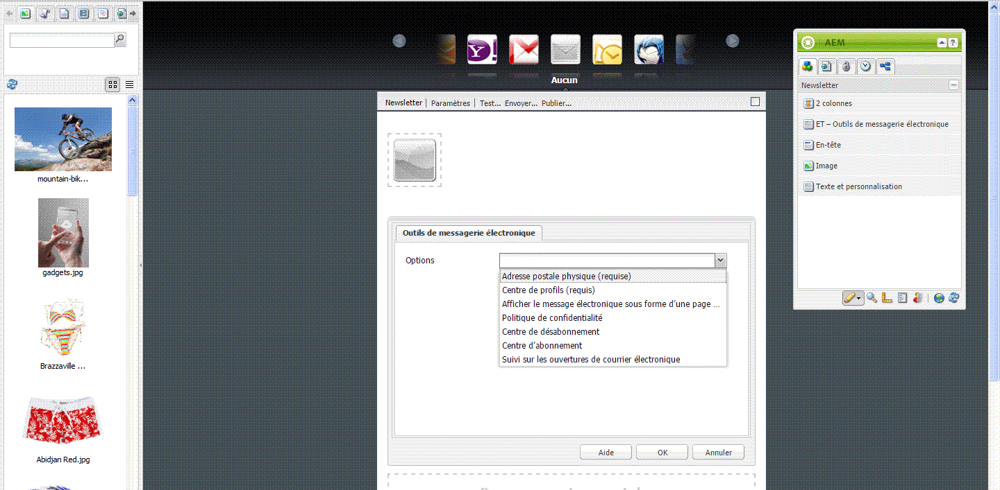
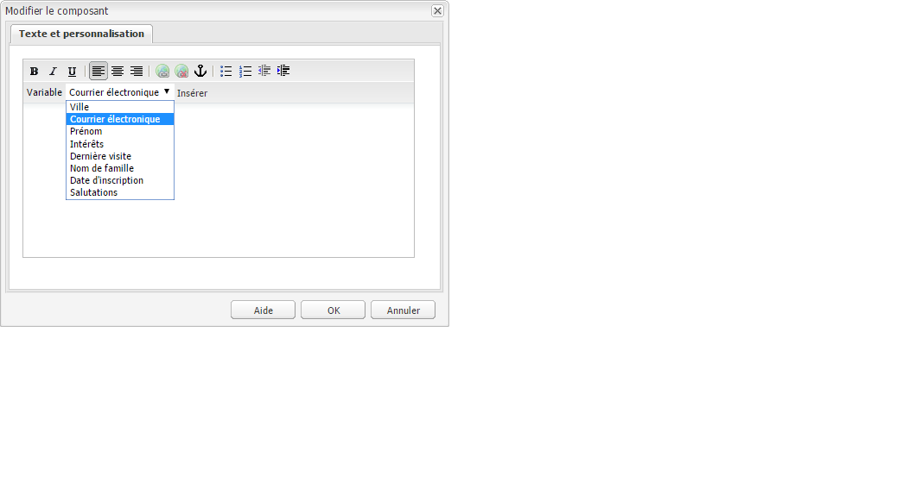
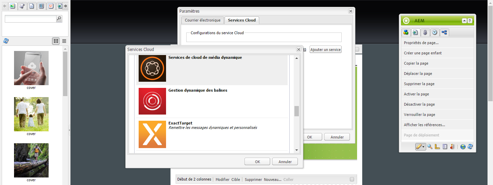
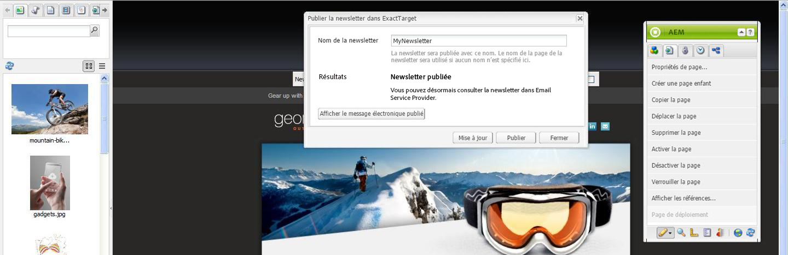

# Publication d’un message électronique sur des services de messagerie{#publishing-an-email-to-email-service-providers}

Vous pouvez diffuser des newsletters sur des services de messagerie, tels qu’ExactTarget et Silverpop Engage. Ce document explique comment configurer AEM en vue de diffuser une newsletter sur ces services de messagerie.

>[!NOTE]
>
>Vous devez configurer le fournisseur de services avant de créer et de publier un message électronique. Voir [Configuration d’ExactTarget](/help/sites-administering/exacttarget.md) et [Configuration de Silverpop Engage](/help/sites-administering/silverpop.md) pour plus d’informations.

Pour diffuser votre message électronique sur un service de messagerie, vous devez effectuer les étapes suivantes :

1. Créez un message électronique.
1. Appliquez la configuration de service de messagerie au message électronique.
1. Publiez le message électronique.

>[!NOTE]
>
>Si vous mettez à jour vos fournisseurs de messagerie, que vous effectuez un test envoi ou que vous envoyez une newsletter, ces opérations échouent si la newsletter n’est pas au préalable publiée sur l’instance de publication ou si l’instance de publication n’est pas disponible. Veillez à publier votre newsletter et à ce que l’instance de publication soit activée.

## Création d’un message électronique {#creating-an-email}

Un courrier électronique ou un bulletin d’information que vous souhaitez publier dans un service de messagerie peut être créé sous une campagne à l’aide du modèle **Geometrixx Newsletter**. Vous pouvez également utiliser le modèle **Geometrixx Outdoors E-Mail**. Vous trouverez un exemple de courrier électronique/bulletin d&#39;information basé sur le modèle **Geometrixx Outdoors E-Mail** à l&#39;adresse `https://<hostname>:<port>/cf#/content/campaigns/geometrixx-outdoors/e-mails.html`.

Pour créer un courrier électronique publié sur le service de messagerie configuré :

1. Accédez à **Sites Web**, puis **Campagnes**. Sélectionnez une campagne.
1. Cliquez sur **Nouveau** pour ouvrir la fenêtre **Créer une page**.
1. Indiquez un titre et un nom, puis sélectionnez le modèle **Newsletter Geometrixx** dans la liste des modèles disponibles.
1. Cliquez sur **Créer**.
1. Ouvrez le message électronique que vous avez créé.
1. Basculez vers le mode de conception pour sélectionner les composants à afficher dans le sidekick.
1. Basculez en mode d’édition et commencez à ajouter du contenu (texte, images, [outils de messagerie électronique](#adding-exacttarget-email-tools-to-your-email), [variables de personnalisation](#adding-text-and-personalization-tool-to-your-e-mail), etc.) à votre message électronique.

### Ajout d’outils de messagerie ExactTarget à votre message électronique {#adding-exacttarget-email-tools-to-your-email}

>[!NOTE]
>
>Cette section est spécifique au service ExactTarget.

Le composant **Outils de messagerie électronique** pour ExactTarget permet d’ajouter des fonctionnalités de messagerie à votre message électronique/newsletter.

1. Ouvrez un message électronique à publier sur ExactTarget.
1. Ajoutez le composant **ET – Outils de messagerie électronique** à votre page à l’aide du sidekick. Ouvrez le composant en mode d’édition.

   

1. Sélectionnez une option dans le menu **Options** :

<table>
 <tbody>
  <tr>
   <td>Adresse postale physique (requise)</td>
   <td>Ce composant insère l’adresse postale (physique) de votre entreprise dans le message électronique.</td>
  </tr>
  <tr>
   <td>Centre de profils (requis)</td>
   <td>Le centre de profils est une page web dans laquelle les abonnés peuvent saisir et gérer des informations personnelles.</td>
  </tr>
  <tr>
   <td>Afficher le message électronique sous forme d’une page Web</td>
   <td>Ce composant permet à l’utilisateur d’afficher le message électronique sous la forme d’une page web.</td>
  </tr>
  <tr>
   <td>Politique de confidentialité</td>
   <td>Ce composant insère le lien vers la politique de confidentialité dans le message électronique.  </td>
  </tr>
  <tr>
   <td>Centre de désabonnement</td>
   <td>Donne à l’utilisateur la possibilité de se désabonner de votre liste de distribution.</td>
  </tr>
  <tr>
   <td>Centre d’abonnement</td>
   <td>Un centre d’abonnements est une page Web sur laquelle un abonné peut contrôler les messages qu’il reçoit de votre organisation.</td>
  </tr>
  <tr>
   <td>Suivi sur les ouvertures de courrier électronique</td>
   <td>Composant masqué qui vous permet d’utiliser la fonctionnalité de suivi d’ExactTarget.  </td>
  </tr>
 </tbody>
</table>

>[!NOTE]
>
>Des valeurs ne sont renseignées dans le menu déroulant **Options** que si la configuration d’ExactTarget est appliquée au message électronique. Voir [Application de la configuration du service de messagerie aux paramètres de messagerie](#applying-e-mail-service-configuration-to-e-mail-settings) pour plus d’informations.

1. Publiez le message électronique sur ExactTarget.

   Le message électronique accompagné d’outils de messagerie électronique peut désormais être utilisé dans le compte ExactTarget configuré.

>[!NOTE]
>
>* Les URL des outils de messagerie sont remplacées (dans le courrier électronique reçu) par leurs valeurs réelles uniquement lorsqu’un courrier électronique est envoyé à l’aide de **Envoi simple** ou **Envoi guidé** mais pas de **Tester l’envoi**.
   >
   >
* Deux des outils de messagerie électronique sont obligatoires, à savoir : **Adresse postale physique (requise)** et **Centre de profils (requis)**. Lorsque le message électronique est publié sur ExactTarget, ces deux outils de messagerie sont ajoutés, par défaut, au bas de chaque message.

>

### Ajout de l’outil Texte et personnalisation à votre message électronique  {#adding-text-and-personalization-tool-to-your-e-mail}

Vous pouvez ajouter des champs personnalisés à un message électronique lorsque vous insérez le composant **Texte et personnalisation** dans la page :

1. Ouvrez le courrier électronique à publier sur votre service de messagerie.
1. Pour activer le champ de personnalisation de votre service de messagerie, ajoutez la configuration de la structure lors de la configuration du service de messagerie. Voir [configuration de Silverpop Engage](/help/sites-administering/silverpop.md) et [configuration de Cible exacte](/help/sites-administering/exacttarget.md) pour plus d’informations.
1. Ajoutez le composant **Texte et personnalisation** à partir du sidekick. Ce composant fait partie du groupe newsletter. Ouvrez ce composant en mode d’édition.

   

1. Ajoutez au texte le champ personnalisé nécessaire en le sélectionnant dans le menu contextuel et en cliquant sur **Insérer**.
1. Cliquez sur **OK** pour terminer.

## Application de la configuration du service de messagerie aux paramètres de courrier électronique {#applying-e-mail-service-configuration-to-e-mail-settings}

Pour appliquer la configuration du service de messagerie à une newsletter, procédez comme suit :

1. Créez une configuration Service de messagerie électronique.
1. Ouvrez votre message électronique/newsletter.
1. Ouvrez les paramètres de courrier électronique/newsletter en cliquant sur **Paramètres** ou en cliquant sur **Propriétés de la page dans** le sidekick.
1. Cliquez sur **Ajouter un service** dans l’onglet **Services Cloud**. La liste des services s’affiche alors. Sélectionnez la configuration requise, **ExactTarget** ou **Silverpop**, dans la liste déroulante.

   

1. Cliquez sur **OK**.

## Publication de messages électroniques sur le service de messagerie {#publishing-emails-to-email-service}

Les messages électroniques/newsletters peuvent être publiés sur votre service de messagerie en procédant comme suit :

1. Ouvrez le message électronique.
1. Avant de publier un message électronique sur ExactTarget, veillez à lui appliquer la configuration correcte.
1. Cliquez sur **Publier**. Vous accédez alors à la fenêtre **Publier la newsletter dans Email Service Provider.**
1. Renseignez le champ **Nom de la newsletter**. Le message électronique/la newsletter est publié(e) sur le service de messagerie avec le nom indiqué. Si aucun nom n’est indiqué, le message électronique est publié avec le nom de page de la newsletter défini dans AEM.
1. Cliquez sur **Publier**. 

   

   Si la publication se déroule correctement, AEM confirme que vous pouvez afficher le message électronique dans ExactTarget ou Engagement Silverpop.

   Dans le cas d’ExactTarget, le courrier électronique publié peut être affiché en cliquant sur **Vue Publié**. Vous accédez ainsi directement à la newsletter publiée dans ExactTarget ([https://members.exacttarget.com/](https://members.exacttarget.com/)).

>[!NOTE]
>
>Si un message électronique ou une newsletter est publié(e) sous le même nom qu’un autre message ou une autre newsletter déjà diffusé(e), l’élément le plus ancien n’est pas remplacé. À la place, un nouveau message électronique ou une nouvelle newsletter est créé(e) avec le même nom (les ID des deux newsletters sont toutefois différents).
>
>La publication du message électronique/de la newsletter dans Email Service Provider le(la) diffuse également sur l’instance de publication AEM.

### Mise à jour d’un message électronique publié {#updating-a-published-e-mail}

Le bouton **Mettre à jour** de la boîte de dialogue Publier vous permet de mettre à jour un bulletin d&#39;information déjà publié dans un Prestataire de messagerie. Si la newsletter n’est pas encore publiée et que vous cliquez sur le bouton **Mise à jour**, un message **Newsletter non publiée** s’affiche.

Pour mettre à jour un courrier électronique publié :

1. Ouvrez le message électronique/la newsletter déjà publié(e) sur un service de messagerie que vous souhaitez republier après l’avoir mis(e) à jour.
1. Cliquez sur **Publier**. La fenêtre **Publier le bulletin d&#39;information dans le Prestataire électronique** s&#39;affiche. Cliquez sur **Mettre à jour**.

   Pour vérifier si le courrier électronique/le bulletin d’information a été mis à jour sur ExactTarget, cliquez sur **Vue Publié**. Vous accédez alors au message électronique publié dans ExactTarget.

   Pour vérifier si le message électronique/la newsletter a été mis(e) à jour sur le service de messagerie Silverpop, accédez au site d’Engagement Silverpop.

