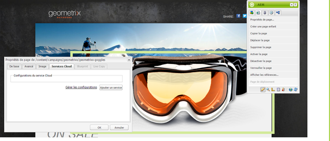
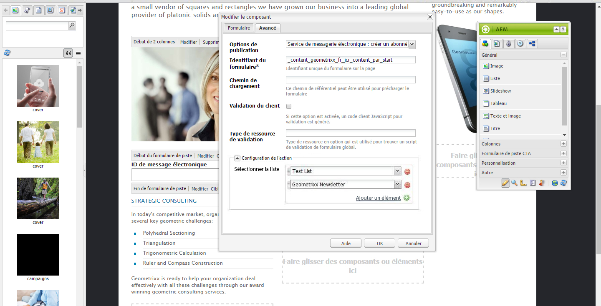
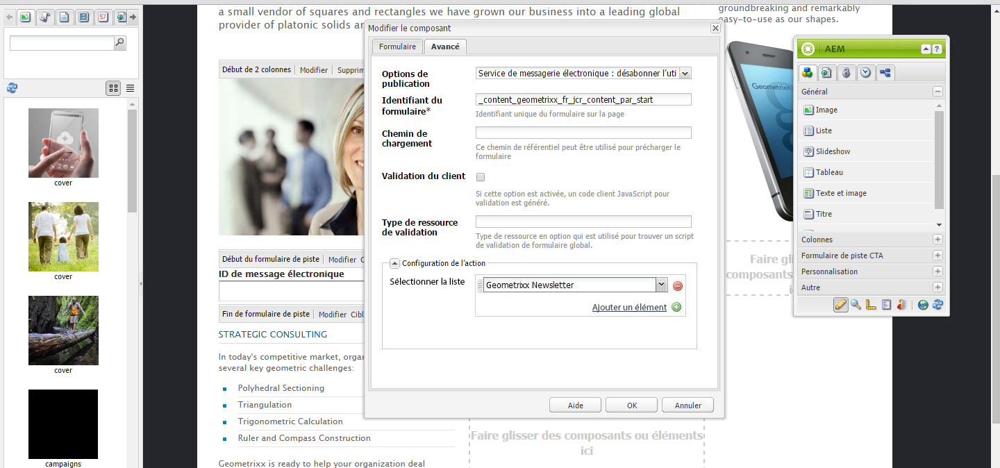
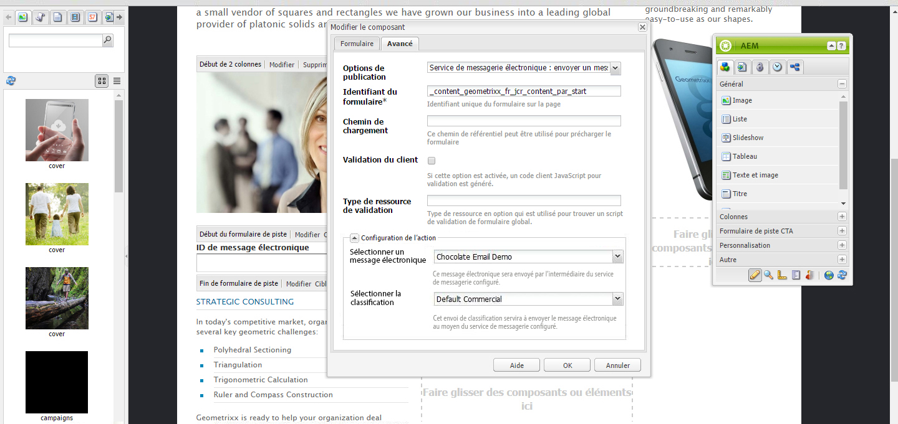

# Gestion des abonnements{#managing-subscriptions}

>[!NOTE]
>
>L&#39;Adobe ne prévoit pas d&#39;améliorer davantage cette capacité (Gestion des pistes et des Listes).
>Il est recommandé de tirer parti de [Adobe Campaign et de son intégration AEM](/help/sites-administering/campaign.md).

Les utilisateurs peuvent être invités à s&#39;abonner à **Prestataire de messagerie** listes de publipostage à l&#39;aide du composant **Formulaire** utilisé sur une page Web AEM. Pour préparer une page AEM avec un formulaire d’abonnement à des listes de diffusion d’un service de messagerie, appliquez la configuration de service correspondante à la page AEM que consultera l’abonné potentiel.

## Application de la configuration du service de messagerie à une page {#applying-email-service-configuration-to-a-page}

Pour configurer une page AEM :

1. Accédez à l’onglet **Sites web**.
1. Sélectionnez la page à configurer pour le service. Cliquez avec le bouton droit sur la page et sélectionnez **Propriétés**.

1. Sélectionnez **Cloud Services**, puis **Ajouter le service**. Sélectionnez une configuration dans la liste des configurations disponibles.

   

1. Cliquez sur **OK**.

## Création d’un formulaire d’inscription dans une page AEM en vue de s’abonner à des listes ou de s’en désabonner {#creating-a-sign-up-form-on-an-aem-page-for-subscribing-unsubscribing-to-lists}

Pour créer un formulaire d’inscription et le configurer en vue de s’abonner à des listes de diffusion de fournisseurs de services de messagerie, procédez comme suit :

1. Ouvrez la page AEM que l’utilisateur va consulter.
1. Appliquez la configuration du fournisseur de services de messagerie à la page.

1. Ajoutez un composant **Formulaire** à la page en le faisant glisser à partir du sidekick. Si le composant n’est pas disponible, basculez en mode de conception et activez le groupe **Formulaire**.
1. Cliquez sur **Modifier** dans la barre **Début du formulaire** et accédez à l&#39;onglet **Avancé**.
1. Dans le menu déroulant **Formulaire**, sélectionnez **Service de messagerie : Créez un abonné** et ajoutez-le à la liste.
1. Au bas de la boîte de dialogue, ouvrez la liste déroulante **Configuration de l&#39;action**, qui vous permet de sélectionner une ou plusieurs listes d&#39;abonnement.
1. Dans la liste **Sélectionner, choisissez la liste** à laquelle vous souhaitez que les utilisateurs s’abonnent. Vous pouvez ajouter plusieurs listes à l’aide du bouton plus (**Ajouter un élément**).

   

   >[!NOTE]
   >
   >La boîte de dialogue peut différer selon le fournisseur de services de messagerie.

1. Dans l’onglet **Formulaire**, sélectionnez la page de remerciement à laquelle doivent accéder les utilisateurs après avoir rempli leur formulaire (si ce champ est vide, le formulaire s’affiche à nouveau lors de l’envoi). Cliquez sur **OK**. Un composant **ID de message électronique** apparaît dans le formulaire. Il vous permet de créer un formulaire dans lequel les utilisateurs peuvent entrer leurs adresses électroniques pour s’abonner (ou se désabonner) à une liste de diffusion.
1. Ajoutez le composant de bouton **Envoyer** dans la section **Formulaire** du sidekick.

   Le formulaire est maintenant prêt à l’emploi. Publiez la page configurée ci-dessus, ainsi que la page **Merci**, sur l’instance de publication. Tout abonné potentiel qui consulte la page peut remplir le formulaire et s’abonner à la liste fournie dans la configuration.

   >[!NOTE]
   >
   >Pour faire en sorte que l’abonnement au formulaire fonctionne correctement, [les clés de chiffrement en provenance de l’auteur doivent être exportées et importées sur l’instance de publication](#exporting-keys-from-author-and-importing-on-publish).

## Exportation de clés à partir de l’auteur et importation lors de la publication  {#exporting-keys-from-author-and-importing-on-publish}

Pour qu’il soit possible de s’abonner et de se désabonner du service de messagerie électronique via le formulaire d’inscription sur l’instance de publication, vous devez procéder comme suit :

1. Sur l’instance de l’auteur, accédez à Package Manager.
1. Créez un package. Définissez le filtre sur `/etc/key`.
1. Générez et téléchargez le package.
1. Accédez à Package Manager sur l’instance de publication et téléchargez ce package.
1. Accédez à la console OSGi Publication et redémarrez le bundle nommé **Adobe Granite Crypto Support**.

## Désabonnement d’utilisateurs des listes  {#unsubscribing-users-from-lists}

Pour désabonner des utilisateurs de listes :

1. Ouvrez la page des propriétés de la page AEM qui contient le formulaire d’inscription pour désabonner une piste.
1. Appliquez la configuration du service à la page.
1. Créez un formulaire d’inscription dans la page.
1. Lors de la configuration du composant, sélectionnez l&#39;action **Service de messagerie** : **Désabonner l&#39;utilisateur de la liste.**
1. Dans le menu déroulant, sélectionnez la liste de laquelle l’utilisateur sera supprimé lors du désabonnement.

   

1. Exportez les clés de l’instance de création vers l’instance de publication.

## Configuration de messages de répondeur automatique pour le service de messagerie électronique  {#configuring-auto-responder-emails-for-email-service}

Pour configurer un message de répondeur automatique pour un abonné, procédez comme suit :

1. Ouvrez les propriétés de page de la page AEM qui possède le formulaire d&#39;inscription pour configurer le répondeur automatique pour une piste.
1. Appliquez la configuration ExactTarget à la page.

1. Ajoutez un composant **Formulaire** à la page en le faisant glisser à partir du sidekick. Si le composant n’est pas disponible, basculez vers le mode de conception et activez le groupe **Formulaire**.
1. Cliquez sur **Modifier** dans la barre **Début du formulaire** et accédez à l&#39;onglet **Avancé**.
1. Dans le menu déroulant **Formulaire**, sélectionnez **Service de messagerie : Envoyer un courriel de répondeur automatique.**
1. **Sélectionnez un courriel**  (il s’agit du courriel envoyé en tant que courriel de répondeur automatique).

1. **Sélectionnez Classification**  (cette classification est utilisée pour envoyer le courriel).
1. Sélectionnez la page **Merci** (page à laquelle les utilisateurs sont redirigés lorsqu’ils envoient le formulaire).

   Dans l’onglet **Formulaire**, sélectionnez la page de remerciement à laquelle doivent accéder les utilisateurs après avoir envoyé le formulaire. (Si aucune donnée n’est saisie, le formulaire s’affiche à nouveau lors de l’envoi.) Cliquez sur **OK**.

1. Exportez les clés de l’instance de création vers l’instance de publication.
1. Ajoutez le composant de bouton **Envoyer** dans la section **Formulaire** du sidekick.

   Le formulaire d’inscription est maintenant prêt à l’emploi. Publiez la page configurée ci-dessus, ainsi que la page **Merci**, sur l’instance de publication. Tout abonné potentiel qui consulte la page peut compléter le formulaire. Lors de l’envoi du formulaire, le visiteur recevra alors un message de répondeur automatique à l’ID de message électronique indiqué dans le formulaire.

   >[!NOTE]
   >
   >Pour faire en sorte que l’abonnement au formulaire d’inscription fonctionne correctement, [les clés de chiffrement en provenance de l’auteur doivent être exportées et importées sur l’instance de publication](#exporting-keys-from-author-and-importing-on-publish).

   

