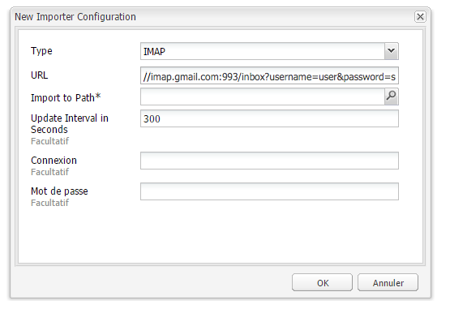

# Suivi des messages rejetés{#tracking-bounced-emails}

>[!NOTE]
>
>Adobe ne prévoit pas d&#39;améliorer davantage le suivi des courriers électroniques ouverts/rebondis envoyés par AEM service SMTP.
>
>La recommandation consiste à [tirer parti de l&#39;Adobe Campaign et de son intégration](/help/sites-administering/campaign.md)AEM.

Lorsque vous envoyez une newsletter à de nombreux utilisateurs, la liste de diffusion comporte généralement plusieurs adresses électroniques non valides. Les newsletters envoyées à ces adresses sont rejetées. AEM est en mesure de gérer ces rebonds et d’arrêter l’envoi de newsletters vers ces adresses après le dépassement du compteur de rebonds. Par défaut, le taux de rebonds est défini sur 3, mais cette valeur est configurable.

Pour configurer AEM en vue du suivi des messages rejetés, vous devez faire en sorte que le logiciel sonde une boîte aux lettres existante dans laquelle les messages rejetés sont reçus (il s’agit généralement de l’adresse indiquée pour l’envoi de la newsletter). AEM sonde cette boîte aux lettres et importe tous les messages sous le chemin indiqué dans la configuration de sondage. Un flux de travail est ensuite déclenché pour rechercher les adresses électroniques reportées au sein des utilisateurs et met à jour la valeur de la propriété bounceCounter de l’utilisateur en conséquence. Une fois le nombre maximum de rebonds atteint, l’utilisateur est supprimé de la liste des newsletters.

## Configuration de Feed Importer {#configuring-the-feed-importer}

Feed Importer vous permet d’importer, dans votre référentiel, du contenu provenant de sources externes et ce, de manière itérative. Lorsque Feed Importer est configuré de la sorte, AEM recherche des messages rejetés dans la boîte aux lettres de l’expéditeur.

Pour configurer Feed Importer en vue du suivi des messages rejetés, procédez comme suit :

1. Sélectionnez Feed Importer dans **Outils**.

1. Cliquez sur **Ajouter** pour créer une configuration.

   

1. Ajoutez une nouvelle configuration en sélectionnant le type et en ajoutant des informations à l’URL de sondage afin de configurer l’hôte et le port. Vous devez, en outre, ajouter à la requête URL des paramètres spécifiques à la messagerie et au protocole. Définissez la configuration de telle sorte que le sondage soit effectué au moins une fois par jour.

   Les informations suivantes sont nécessaires pour toutes les configurations dans l’URL de sondage :

   `username`: Nom d’utilisateur à utiliser pour la connexion

   `password`: Mot de passe à utiliser pour la connexion

   En fonction du protocole, vous pouvez, en outre, configurer certains paramètres.

   **Propriétés de la configuration POP3** :

   `pop3.leave.on.server`: Permet d’indiquer si des messages doivent être laissés ou non sur le serveur. Définissez la valeur sur « true » pour laisser les messages sur le serveur et sur « false » dans le cas contraire. La valeur par défaut est « true ».

   **Exemples POP3** :

   | pop3s://pop.gmail.com:995/INBOX?username=user&amp;password=secret | Utilisation de pop3 sur SSL pour se connecter à GMail sur le port 995 avec user/secret, en laissant les messages sur le serveur par défaut |
   |---|---|
   | pop3s://pop.gmail.com:995/INBOX?username=user&amp;password=secret&amp;pop3.leave.on.server=false | pop3s://pop.gmail.com:995/INBOX?username=user&amp;password=secret&amp;pop3.leave.on.server=false |

   **Propriétés de la configuration IMAP** :

   Permet de définir des indicateurs pour la recherche.

   `imap.flag.SEEN`: Définit false pour le message nouveau/invisible, true pour les messages déjà lus

   See [https://java.sun.com/products/javamail/javadocs/javax/mail/Flags.Flag.html](https://java.sun.com/products/javamail/javadocs/javax/mail/Flags.Flag.html) for the full list of flags.

   **Exemples IMAP** :

   | imaps://imap.gmail.com:993/inbox?username=user&amp;password=secret | Utilisation du protocole IMAP sur SSL pour se connecter à GMail sur le port 993 avec les identifiants user/secret. Par défaut, seuls les nouveaux messages sont récupérés. |
   |---|---|
   | imaps://imap.gmail.com:993/inbox?username=user&amp;password=secret&amp;imap.flag.SEEN=true | Utilisation du protocole IMAP sur SSL pour se connecter à GMail sur le port 993 avec les identifiants user/secret. Seuls les messages déjà lus sont récupérés. |
   | imaps://imap.gmail.com:993/inbox?username=user&amp;password=secret&amp;imap.flag.SEEN=true&amp;imap.flag.SEEN=false | Utilisation du protocole IMAP sur SSL pour se connecter à GMail sur le port 993 avec les identifiants user/secret. Seuls les nouveaux messages OU les messages déjà lus sont récupérés. |

1. Enregistrez la configuration.

## Configuration du composant Service de newsletter {#configuring-the-newsletter-service-component}

Après avoir configuré Feed Importer, vous devez configurer l’adresse de l’expéditeur et le compteur de rebonds.

Pour configurer le service de newsletter, procédez comme suit :

1. Dans la console OSGi, accédez au bulletin `<host>:<port>/system/console/configMgr` **** MCM et accédez-y.

1. Configurez le service et enregistrez les modifications une fois cette opération terminée.

   

   Vous pouvez définir les configurations suivantes pour régler le fonctionnement :

   | Bounce Counter Maximum (max.bounce.count) | (Nombre maximum de rebonds) Définit le nombre maximum de rebonds jusqu’à ce qu’un utilisateur soit omis lors de l’envoi d’une newsletter. Lorsque vous définissez cette valeur sur 0, la vérification des rebonds est complètement désactivée. |
   |---|---|
   | Activity No Cache (sent.activity.nocache) | (Activité - Pas de cache) Définit le paramètre de cache à utiliser pour l’activité d’envoi des newsletters. |

   Une fois enregistré, le service Newsletter MCM procède comme suit :

   * Il écrit une activité sur le flux masqué des utilisateurs lors de l’envoi réussi d’une newsletter.
   * Il écrit une activité si un rebond est détecté et le compteur de rebonds des utilisateurs est mis à jour.
