# Marketing par messagerie électronique{#e-mail-marketing}

>[!NOTE]
>
>Adobe ne prévoit pas d’améliorer davantage le suivi des messages électroniques ouverts/rejetés (non livrables) envoyés par le service SMTP AEM.
> Il est conseillé d’[utiliser Adobe Campaign et l’intégration à AEM](/help/sites-administering/campaign.md). 

Le marketing par messagerie électronique (les newsletters, par exemple) constitue une partie importante de toute campagne de marketing, car il vous sert à pousser du contenu vers vos pistes. Dans AEM, vous pouvez créer des newsletters à partir de contenu AEM existant et ajouter un nouveau contenu, spécifique aux newsletters.

Une fois créées, vous pouvez envoyer les newsletters à des groupes spécifiques d’utilisateurs immédiatement ou à un autre moment planifié (à l’aide d’un worfklow). En outre, les utilisateurs peuvent s’abonner aux newsletters dans le format de leur choix.

Par ailleurs, AEM vous permet d’administrer la fonctionnalité de newsletter, y compris la gestion des sujets, l’archivage des newsletters et l’affichage des statistiques qui concernent ces dernières.

>[!NOTE]
>
>Dans Geometrixx, le modèle de newsletter affiche automatiquement l’éditeur de messagerie électronique. Vous pouvez utiliser l’éditeur de messagerie électronique dans d’autres modèles dans lesquels vous souhaitez envoyer des courriers électroniques, par exemple, des invitations. L’éditeur de messagerie électronique s’affiche chaque fois qu’une page est héritée de **mcm/components/newsletter/page**.

Ce document décrit les notions fondamentales de la création de newsletters dans AEM. Pour plus d’informations sur l’utilisation du marketing par messagerie électronique, voir les documents suivants :

* [Création d’une page d’entrée efficace pour une newsletter](/help/sites-classic-ui-authoring/classic-personalization-campaigns-email-landingpage.md)
* [Gestion des abonnements](/help/sites-classic-ui-authoring/classic-personalization-campaigns-email-subscriptions.md)
* [Publication d’un courrier électronique sur des services de messagerie](/help/sites-classic-ui-authoring/classic-personalization-campaigns-email-newsletters.md)
* [Suivi des messages rejetés](/help/sites-classic-ui-authoring/classic-personalization-campaigns-email-tracking-bounces.md)

>[!NOTE]
>
>Si vous mettez à jour vos fournisseurs de messagerie, que vous effectuez un test envoi ou que vous envoyez une newsletter, ces opérations échouent si la newsletter n’est pas au préalable publiée sur l’instance de publication ou si l’instance de publication n’est pas disponible. Veillez à publier votre newsletter et à ce que l’instance de publication soit activée.

## Création d’une expérience Newsletter {#creating-a-newsletter-experience}

>[!NOTE]
>
>Les notifications électroniques doivent être configurées par l’intermédiaire de la configuration OSGi. Voir [Configuration des notifications électroniques](/help/sites-administering/notification.md). 

1. Sélectionnez votre nouvelle campagne dans le volet de gauche ou double-cliquez sur celle-ci dans le volet de droite.

1. Sélectionnez la vue de liste à l’aide de l’icône :

   

1. Cliquez sur **Nouveau...**

   Vous pouvez indiquer le **Titre**, le **Nom** et le type d’expérience à créer ; dans ce cas, Newsletter.

   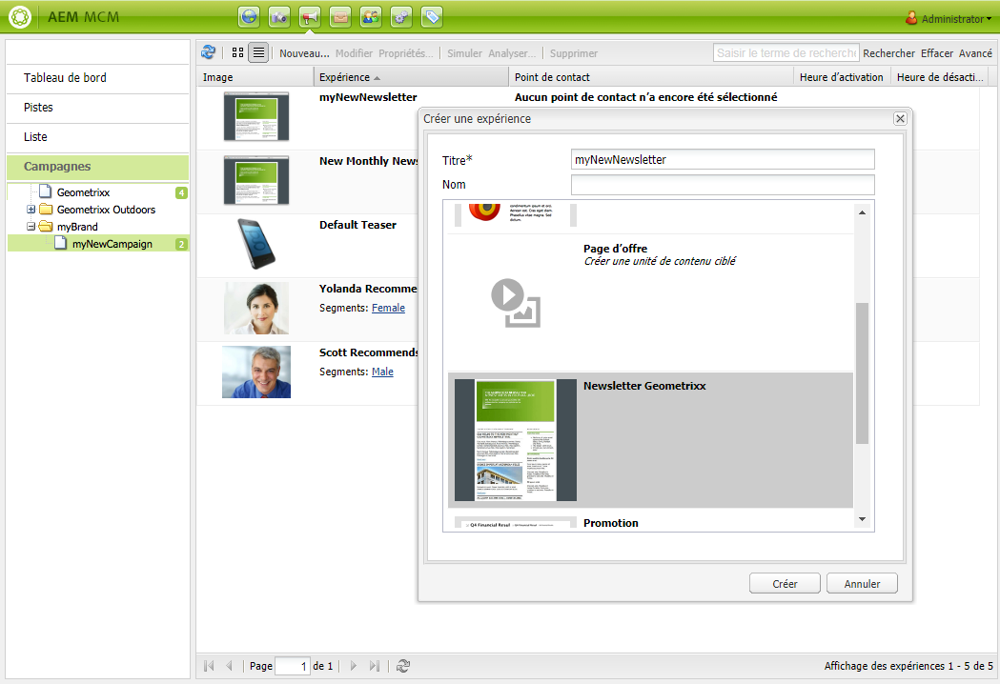

1. Cliquez sur **Créer**.

1. Une nouvelle boîte de dialogue s’ouvre immédiatement. Vous pouvez y saisir les propriétés de la newsletter.

   **Liste des destinataires par défaut** est un champ obligatoire, dans la mesure où il s’agit du point de contact pour la newsletter (pour plus d’informations sur les listes, voir [Utilisation de listes](/help/sites-classic-ui-authoring/classic-personalization-campaigns.md#workingwithlists)).

   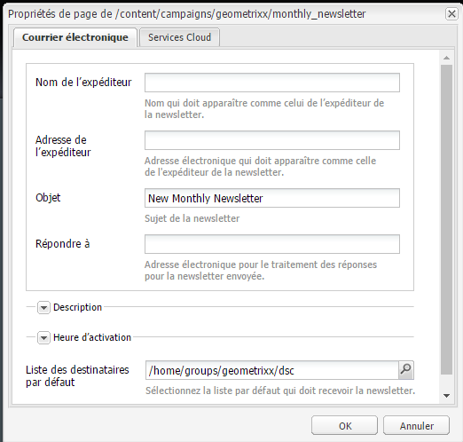

   * **Nom de l’expéditeur** Nom qui doit apparaître comme celui de l’expéditeur de la newsletter.

   * **Adresse de l’expéditeur** Adresse électronique qui doit apparaître comme celle de l’expéditeur de la newsletter.

   * **Objet** Objet de la newsletter.

   * **Répondre à** Adresse électronique pour le traitement des réponses à la newsletter envoyée.

   * **Description** Description de la newsletter.

   * **Heure d’activation** Heure d’activation pour l’envoi de la newsletter.

   * **Liste des destinataires par défaut** Liste par défaut des destinataires qui doivent recevoir la newsletter.
   Ces segments pourront être mis à jour ultérieurement à partir de la boîte de dialogue **Propriétés...**

1. Cliquez sur **OK** pour enregistrer. 

## Ajout de contenu à des newsletters {#adding-content-to-newsletters}

Vous pouvez ajouter du contenu, notamment du contenu dynamique, à vos newsletters, comme c’est le cas dans tout composant AEM. Dans Geometrixx, le modèle Newsletter dispose de certains composants disponibles pour l’ajout et la modification de contenu dans les newsletters.

1. Dans le MCM, cliquez sur l’onglet **Campagnes** et double-cliquez sur la newsletter à laquelle vous souhaitez ajouter du contenu ou que vous voulez modifier. La newsletter s’affiche.

1. Si des composants ne sont pas visibles, passez en mode de conception et activez les composants nécessaires (par exemple, les composants de newsletter) avant de commencer les modifications.
1. Saisissez tout nouveau texte, toute nouvelle image ou tout autre composant le cas échéant. Dans l’exemple Geometrixx, 4 composants sont disponibles : Texte, Image, En-tête et 2 colonnes. Votre newsletter peut avoir davantage ou moins de composants, selon la manière dont vous l’avez définie.

   >[!NOTE]
   >
   >Vous personnalisez les newsletters à l’aide de variables. Dans la newsletter Geometrixx, les variables sont disponibles dans le composant de texte. Les valeurs pour les variables sont héritées des informations contenues dans le profil utilisateur.

   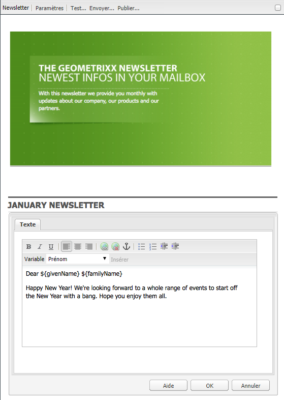

1. Pour insérer des variables, sélectionnez la variable dans la liste et cliquez sur **Insérer**. Les variables sont renseignées à partir du profil.

## Personnalisation de newsletters {#personalizing-newsletters}

Vous personnalisez les newsletters en insérant des variables prédéfinies dans le composant de texte des newsletters dans Geometrixx. Les valeurs pour les variables sont héritées des informations contenues dans le profil utilisateur.

Vous pouvez également simuler la manière dont une newsletter est personnalisée en utilisant ClientContext et en chargeant un profil.

Personnalisation d’une newsletter et simulation de son aperçu :

1. Depuis le MCM, ouvrez la newsletter dont vous voulez personnaliser les paramètres.

1. Ouvrez le composant de texte à personnaliser.

1. Placez le curseur à l’endroit où vous voulez que la variable s’affiche et sélectionnez une variable dans la liste déroulante, puis cliquez sur **Insérer**. Répétez cette procédure pour chaque variable dont vous avez besoin, puis cliquez sur **OK**.

   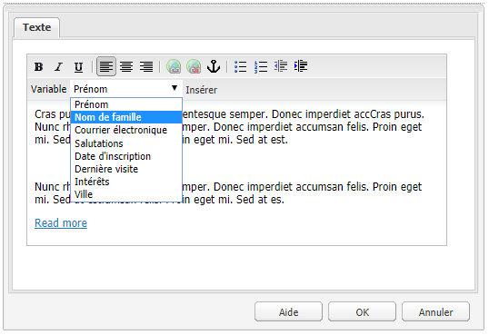

1. Pour simuler un aperçu de la variable lorsqu’elle est envoyée, appuyez sur les touches CTRL+ALT+C pour ouvrir ClientContext, puis sélectionnez **Charger**. Sélectionnez dans la liste l’utilisateur dont vous souhaitez charger le profil, puis cliquez sur **OK**.

   Les informations du profil chargé renseignent les variables.

   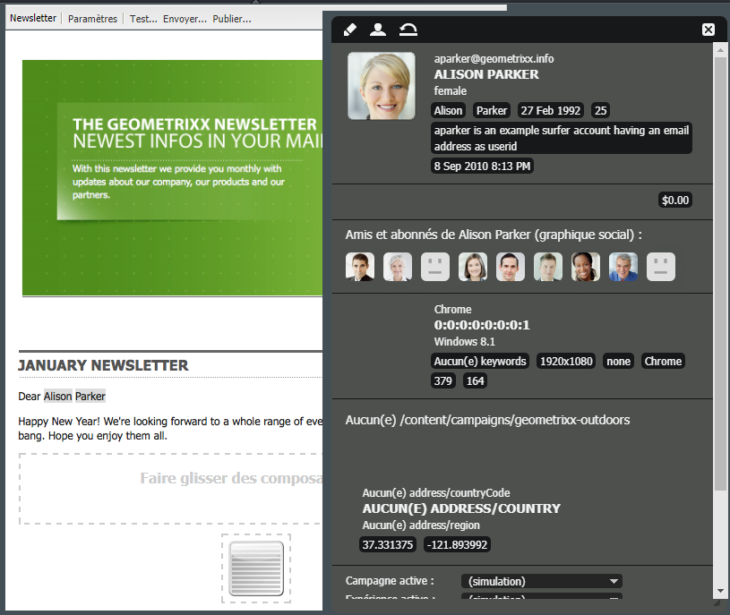

## Test de newsletters dans divers clients de messagerie électronique {#testing-newsletters-in-different-e-mail-clients}

>[!NOTE]
>
>Avant d’envoyer des bulletins d’information, vérifiez la configuration OSGi pour Day CQ Link Externalizer (Externalisateur de liens Day CQ) à l’adresse `https://localhost:4502/system/console/configMgr`.
>
>Par défaut, la valeur du paramètre est `localhost:4502` et l’opération ne peut pas être menée à bien en cas de modification du port d’exécution de l’instance.

Basculez entre les clients de messagerie courants pour afficher un aperçu de la newsletter telle qu’elle sera présentée à vos pistes. Par défaut, votre newsletter s’ouvre avec l’un des clients de messagerie sélectionnés.

Actuellement, vous pouvez afficher les newsletters dans les clients de messagerie suivants :

* Yahoo! mail
* Gmail
* Hotmail
* Thunderbird
* Microsoft Outlook 2007
* Apple Mail

Pour basculer entre les clients, cliquez sur l’icône correspondante pour afficher la newsletter dans ce client de messagerie :

1. Depuis le MCM, ouvrez la newsletter dont vous voulez personnaliser les paramètres.

1. Cliquez sur un client de messagerie dans la barre supérieure pour voir un aperçu de la newsletter telle qu’elle s’affiche dans ce client.

   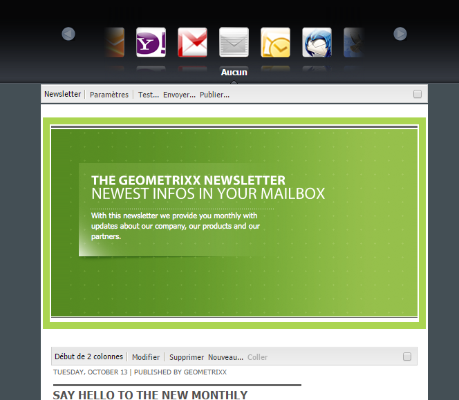

1. Répétez cette étape pour tout client de messagerie supplémentaire que vous voulez afficher.

   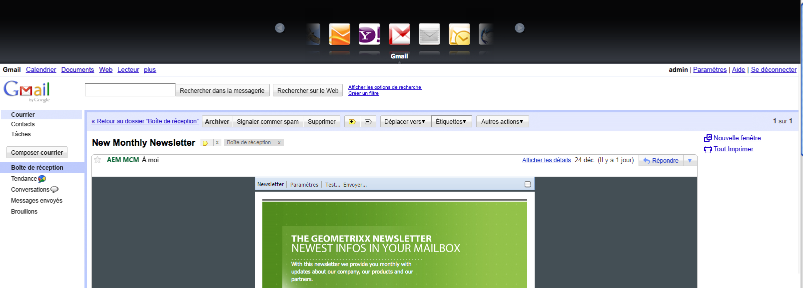

## Personnalisation des paramètres de newsletter {#customizing-newsletter-settings}

Bien que seuls les utilisateurs autorisés puissent envoyer une newsletter, il convient de personnaliser ce qui suit :

* La ligne d’objet, pour inciter les utilisateurs à ouvrir votre courrier électronique et pour que votre newsletter ne soit pas désignée comme courrier indésirable.
* L’adresse De, par exemple noreply@geometrixx.com, pour que les utilisateurs reçoivent des courriers électroniques d’une adresse spécifiée.

Personnalisation des paramètres de newsletter :

1. Depuis le MCM, ouvrez la newsletter dont vous voulez personnaliser les paramètres.

   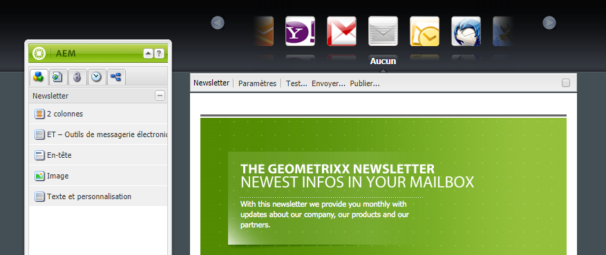

1. En haut de la newsletter, cliquez sur **Paramètres**.

   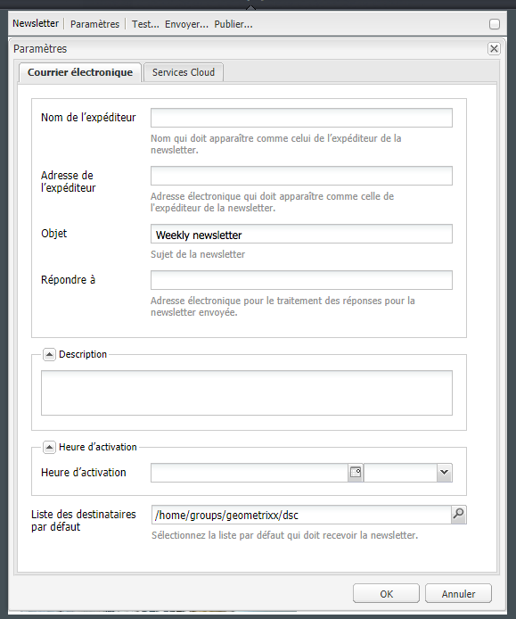
1. Saisissez l’adresse électronique **De**.

1. Modifiez l’**Objet** du courrier électronique, le cas échéant.

1. Sélectionnez une **Liste des destinataires par défaut** dans la liste déroulante.

1. Cliquez sur **OK**.

   Lorsque vous testez ou envoyez la newsletter, les destinataires reçoivent des courriers électroniques avec l’adresse électronique et l’objet spécifiés.

## Test envoi newsletters {#flight-testing-newsletters}

Même si le test envoi n’est pas obligatoire, il convient, avant d’envoyer une newsletter, de la tester pour s’assurer qu’elle s’affiche telle que vous le souhaitez.

Un test envoi vous permet ce qui suit :

* Afficher la newsletter dans [tous les clients visés](#testing-newsletters-in-different-e-mail-clients)
* Assurer que le serveur de messagerie est correctement configuré
* Déterminer si votre courrier électronique est signalé comme courrier indésirable (veillez à vous inclure dans la liste des destinataires)

>[!NOTE]
>
>Si vous mettez à jour vos fournisseurs de messagerie, que vous effectuez un test envoi ou que vous envoyez une newsletter, ces opérations échouent si la newsletter n’est pas au préalable publiée sur l’instance de publication ou si l’instance de publication n’est pas disponible. Veillez à publier votre newsletter et à ce que l’instance de publication soit activée.

Test envoi des newsletters :

1. Dans le MCM, ouvrez la newsletter à tester et envoyer.

1. En haut de la newsletter, cliquez sur **Tester** pour tester avant l’envoi.

   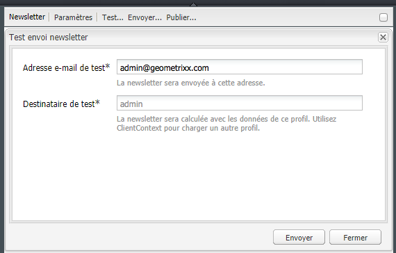

1. Saisissez l’adresse électronique de test à laquelle vous souhaitez envoyer la newsletter, puis cliquez sur **Envoyer**. Pour changer de profil, chargez-en un autre dans ClientContext. Procédez en appuyant sur les touches CTRL+ALT+c et en sélectionnant Charger pour charger un profil.

## Envoi de newsletters {#sending-newsletters}

>[!NOTE]
>
>Adobe ne prévoit pas d’améliorer davantage le suivi des messages électroniques ouverts/rejetés (non livrables) envoyés par le service SMTP AEM.
> Il est conseillé d’[utiliser Adobe Campaign et l’intégration à AEM](/help/sites-administering/campaign.md). 

Vous pouvez envoyer une newsletter à partir de la newsletter ou à partir de la liste. Les deux procédures sont décrites.

>[!NOTE]
>
>Avant d’envoyer des bulletins d’information, vérifiez la configuration OSGi pour Day CQ Link Externalizer (Externalisateur de liens Day CQ) à l’adresse `https://localhost:4502/system/console/configMgr`.
>
>Par défaut, la valeur du paramètre est `localhost:4502` et l’opération ne peut pas être menée à bien en cas de modification du port d’exécution de l’instance.

>[!NOTE]
>
>Si vous mettez à jour vos fournisseurs de messagerie, que vous effectuez un test envoi ou que vous envoyez une newsletter, ces opérations échouent si la newsletter n’est pas au préalable publiée sur l’instance de publication ou si l’instance de publication n’est pas disponible. Veillez à publier votre newsletter et à ce que l’instance de publication soit activée.

### Envoi de newsletters à partir d’une campagne {#sending-newsletters-from-a-campaign}

Envoi d’une newsletter à partir d’une campagne :

1. Dans MCM, ouvrez la newsletter à envoyer.

   >[!NOTE]
   >
   >Avant l’envoi, assurez-vous d’avoir personnalisé l’objet de la newsletter et l’adresse électronique de l’expéditeur en [personnalisant ses paramètres](#customizing-newsletter-settings).
   >
   >
   >Il est recommandé d’effectuer un [test envoi](#flight-testing-newsletters) de la newsletter avant de l’envoyer.

1. En haut de la newsletter, cliquez sur **Envoyer**. L’Assistant de newsletter s’affiche.

1. Dans la liste des destinataires, sélectionnez la liste de ceux qui doivent recevoir la newsletter, puis cliquez sur **Suivant**.

   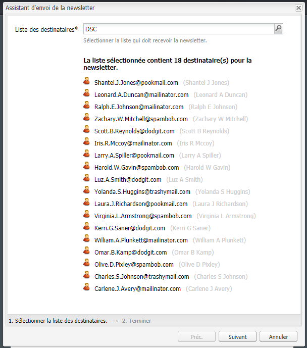

1. La fin de la configuration est confirmée. Cliquez sur **Envoyer** pour envoyer réellement la newsletter.

   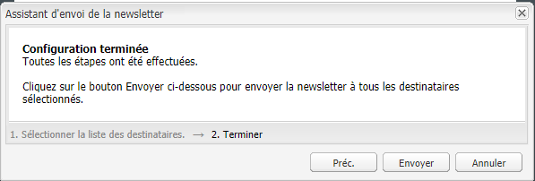

   >[!NOTE]
   >
   >Assurez-vous que vous êtes l’un des destinataires pour vérifier que la newsletter a bien été reçue.

### Envoi de newsletters à partir d’une liste  {#sending-newsletters-from-a-list}

Envoi d’une newsletter à partir d’une liste :

1. Dans MCM, cliquez sur **Listes** dans le volet de gauche.

   >[!NOTE]
   >
   >Avant l’envoi, assurez-vous d’avoir personnalisé l’objet de la newsletter et l’adresse électronique de l’expéditeur en [personnalisant ses paramètres](#customizing-newsletter-settings). Il n’est pas possible de tester une newsletter si vous l’envoyez à partir de la liste. Vous pouvez effectuer un [test envoi](#flight-testing-newsletters) si vous l’envoyez à partir de la newsletter.

1. Cochez la case en regard de la liste des pistes auxquelles vous souhaitez envoyer la newsletter.

1. Dans le menu **Outils**, sélectionnez **Envoyer la newsletter**. La fenêtre **Envoyer la newsletter** s’ouvre.

   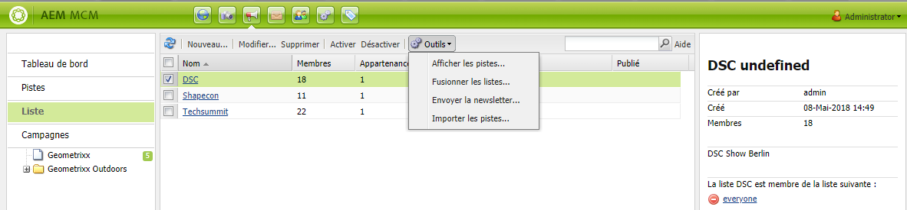

1. Dans le champ **Newsletter**, sélectionnez la newsletter que vous souhaitez envoyer, puis cliquez sur **Suivant**.

   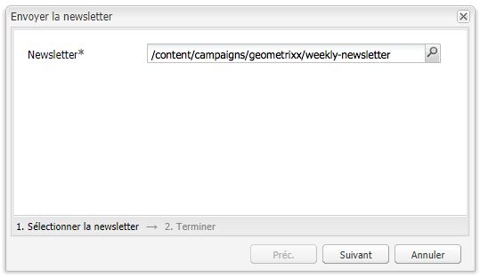

1. La fin de la configuration est confirmée. Cliquez sur **Envoyer** pour envoyer la newsletter sélectionnée à la liste de pistes spécifiée.

   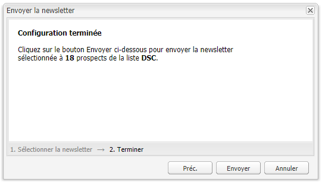

   Votre newsletter est envoyée aux destinataires sélectionnés.

## Abonnement à une newsletter {#subscribing-to-a-newsletter}

Cette section décrit comment s’abonner à une newsletter.

### Abonnement à une newsletter  {#subscribing-to-a-newsletter-1}

S’abonner à une newsletter (en utilisant le site Web Geometrixx comme exemple) :

1. Cliquez sur **Sites Web** et accédez à la **Barre d’outils** Geometrixx, puis ouvrez-la.

   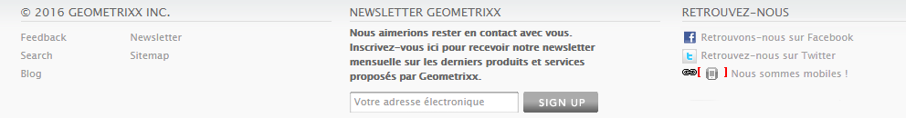

1. Dans le champ **Sign Up** (S’inscrire) de la Newsletter Geometrixx, saisissez votre adresse électronique, puis cliquez sur **Sign Up**. Vous êtes maintenant abonné à la newsletter.
