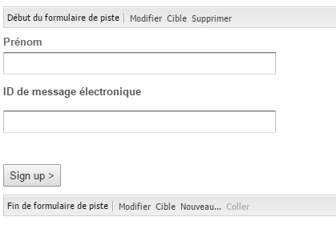

# Pages de destination{#landing-pages}

La fonction landing pages permet d’importer rapidement et facilement une conception et un contenu directement dans une page AEM. Le code HTML et les ressources connexes préparés par un développeur web pourront être importés, en intégralité ou partiellement. Cette fonctionnalité est utile pour créer des landing pages marketing qui ne sont actives que pendant une durée limitée et qui doivent être créées rapidement.

Cette page décrit les éléments suivants :

* à quoi ressemblent les landing pages dans AEM incluant les composants disponibles
* comment créer une landing page et importer un bloc de conception
* utilisation des landing pages dans AEM
* configuration des landing pages mobiles

La préparation du module de conception à importer est traitée dans la section [Extension et configuration de l’importateur de conception](/help/sites-administering/extending-the-design-importer-for-landingpages.md). L’intégration à Adobe Analytics est présentée dans la section [Intégration de pages d’entrée à Adobe Analytics.](/help/sites-administering/integrating-landing-pages-with-adobe-analytics.md)

>[!CAUTION]
>
>l’importateur de conception, utilisé pour importer des landing pages, [a été abandonné avec AEM 6.5.](/help/release-notes/deprecated-removed-features.md#deprecated-features).

>[!CAUTION]
>
>Étant donné que l’importateur de conception doit pouvoir accéder à `/apps`, il ne fonctionnera pas dans les environnements cloud conteneurisés où `/apps` est immuable.

## Que sont les landing pages ? {#what-are-landing-pages}

Les pages d’entrée sont des sites d’une ou de plusieurs pages qui sont le &quot;point de terminaison&quot; d’une diffusion marketing, par exemple, avec des courriers électroniques, des mots-clés/bannières, des médias sociaux. Une page d’entrée peut avoir plusieurs objectifs, mais tous ont une chose en commun : le visiteur doit accomplir une tâche et définir le succès d’une page d’entrée.

La fonction Pages d’entrée d’AEM permet aux marketeurs de collaborer avec les concepteurs web des agences ou des équipes créatives internes afin de créer des conceptions de page qui peuvent être facilement importées dans AEM et qui restent modifiables par les marketeurs et publiées sous la même gouvernance que les autres sites optimisés par l’.

Dans AEM, vous créez des landing pages en procédant comme suit :

1. Créez une page dans AEM qui contient le canevas des landing pages. AEM est fourni avec un exemple nommé **Page d’importateur**.

1. [Préparez le code HTML et les ressources.](/help/sites-administering/extending-the-design-importer-for-landingpages.md)
1. Regroupez les ressources dans un fichier ZIP appelé « package de conception ».
1. Importez le package de conception sur la page de l’importateur.
1. Modifiez et publiez la page.

### Pages d’entrée du bureau {#desktop-landing-pages}

Voici un exemple de landing page dans AEM :

### Pages d’entrée mobiles {#mobile-landing-pages}

Une landing page peut également avoir une version mobile de la page. Pour disposer d’une version mobile distincte de la page de destination, la conception de l’importation doit comporter deux fichiers HTML : *index.htm(l)* et *mobile.index.htm(l)*.

La procédure d’importation de ces pages de destination est identique à celle d’une page de destination normale ; la conception de page de destination est associée à un fichier HTML supplémentaire correspondant à la page de destination pour mobiles. Ce fichier HTML doit, lui aussi, disposer d’une balise `div` de canevas avec `id=cqcanvas`, comme c’est le cas pour la page de destination pour ordinateurs de bureau. De plus, il prend en charge tous les composants modifiables décrits pour la page de destination pour ordinateurs de bureau.

La page de destination pour mobiles est créée en tant que page enfant de la page de destination pour ordinateurs de bureau. Pour l’ouvrir, accédez à la page d’entrée dans Sites web et ouvrez la page enfant.

>[!NOTE]
>
>La page d’entrée mobile est supprimée/désactivée avec la page d’entrée pour ordinateur de bureau si la page d’entrée pour ordinateur de bureau est supprimée ou désactivée.

## Composants de page d’entrée {#landing-page-components}

Pour rendre des parties du HTML importées modifiables dans AEM, vous pouvez mapper directement le contenu du HTML Landing pages aux composants AEM. Par défaut, l’importateur de conception comprend les composants suivants :

* Texte, pour tout texte
* Titre, pour le contenu des balises H1-6
* Image, pour les images qui doivent être échangeables
* Appel à l’action :

   * Lien de clic publicitaire
   * Lien graphique

* Formulaire de piste CTA, pour capturer des informations sur l’utilisateur
* Système de paragraphe (Parsys), pour permettre l’ajout de tout composant ou la conversion du composant ci-dessus.

En outre, il est possible d’étendre cette fonctionnalité et de prendre en charge les composants personnalisés. Cette section décrit les composants en détail.

### Texte {#text}

Le composant Texte vous permet de saisir un bloc de texte à l’aide d’un éditeur WYSIWYG. Voir [Composant textuel](/help/sites-authoring/default-components.md#text) pour plus d’informations.

Voici un exemple de composant Texte sur une page de destination :

#### Titre {#title}

Le composant Titre vous permet d’afficher un titre et de configurer la taille (h1-6). Voir [Composant du titre](/help/sites-authoring/default-components.md#title) pour plus d’informations.

Voici un exemple de composant Titre sur une page de destination :

#### Image {#image}

Le composant d’image affiche une image que vous pouvez faire glisser à partir de l’outil de recherche de contenu ou cliquer pour la télécharger. Voir [composant image](/help/sites-authoring/default-components.md) pour plus d’informations.

Voici un exemple de composant Image sur une page de destination :

#### Appel à l’action (CTA) {#call-to-action-cta}

Une conception de page d’entrée peut comporter plusieurs liens ; certains d’entre eux peuvent être conçus comme des &quot;appels à l’action&quot;.

L’appel à l’action (CTA) est utilisé pour inciter le visiteur à agir immédiatement sur la page d’entrée, par exemple &quot;S’abonner maintenant&quot;, &quot;Afficher cette vidéo&quot;, &quot;Durée limitée&quot;, etc.

* Lien des clics publicitaires : permet d’ajouter un lien texte qui, lorsqu’un utilisateur clique dessus, dirige le visiteur vers une URL cible.
* Lien graphique : permet d’ajouter une image qui, lorsqu’un utilisateur clique dessus, dirige le visiteur vers une URL cible.

Les deux composants CTA disposent d’options similaires. Le lien Clic publicitaire contient d’autres options de texte enrichi. Les composants sont décrits en détail dans les paragraphes suivants.

#### Lien des clics publicitaires {#click-through-link}

Ce composant CTA peut être utilisé pour ajouter un lien texte sur la page d’entrée. Vous pouvez cliquer sur ce lien pour amener l’utilisateur à l’URL cible spécifiée dans les propriétés du composant. Il fait partie du groupe &quot;Appel à l’action&quot;.

**Libellé** Il s’agit du texte visible par les utilisateurs. Vous pouvez modifier la mise en forme à l’aide de l’éditeur de texte enrichi.

**Cible URL** Saisissez l’URI à laquelle les utilisateurs accéderont s’ils cliquent sur le texte. 

**Options de rendu** Décrit les options de rendu. Vous pouvez effectuer une sélection parmi les options suivantes :

* Charger la page dans une nouvelle fenêtre de navigateur
* Charger la page dans la fenêtre active
* Chargement de page dans le cadre parent
* Annuler toutes les images et charger la page dans la fenêtre complète du navigateur

**CSS** Dans l’onglet Style, saisissez le chemin d’accès à votre feuille de styles CSS.

**ID** Dans l’onglet Style, saisissez l’ID du composant afin de l’identifier de manière unique.

Voici un exemple de lien de clics publicitaires :

#### Lien graphique {#graphical-link}

Vous pouvez utiliser ce composant CTA pour ajouter une image graphique avec un lien sur la page de destination. Il peut s’agir d’un simple bouton ou d’une image en arrière-plan. Lorsque l’utilisateur clique sur l’image, il est amené à l’URL cible spécifiée dans les propriétés du composant. Cela fait partie de la **Appel à l’action** groupe.

**Libellé** Il s’agit du texte présenté à l’utilisateur dans le diagramme. Vous pouvez modifier la mise en forme à l’aide de l’éditeur de texte enrichi.

**Cible URL** Saisissez l’URI à laquelle les utilisateurs accéderont s’ils cliquent sur l’image.

**Options de rendu** Décrit les options de rendu. Vous pouvez effectuer une sélection parmi les options suivantes :

* Charger la page dans une nouvelle fenêtre de navigateur
* Charger la page dans la fenêtre active
* Chargement de page dans le cadre parent
* Annuler toutes les images et charger la page dans la fenêtre complète du navigateur

**CSS** Dans l’onglet Style, saisissez le chemin d’accès à votre feuille de styles CSS.

**ID** Dans l’onglet Style, saisissez l’ID du composant afin de l’identifier de manière unique.

Voici un exemple de lien graphique :

### Formulaire de piste CTA (Appel à l’action) {#call-to-action-cta-lead-form}

Le formulaire de piste est utilisé pour collecter des informations sur le profil d’un visiteur/prospect. Ces informations pourront être stockées et exploitées ultérieurement pour mener une campagne marketing efficace. Ces informations comprennent généralement le titre, le nom, l’adresse électronique, la date de naissance, l’adresse, l’intérêt, etc. Cela fait partie de la **Formulaire de piste CTA** groupe.

Voici un exemple de formulaire de piste CTA :

Les formulaires de piste CTA sont construits à partir de plusieurs composants différents :

* **Formulaire de piste**
Le composant Formulaire de piste définit le début et la fin d’un nouveau formulaire de piste sur une page. D’autres composants peuvent être placés entre ces éléments, tels que « ID d’e-mail », « Prénom », etc.

* **Champs et éléments de formulaires**
Les champs et les éléments de formulaires peuvent inclure des zones textuelles, des cases d’option, des images, etc. L’utilisateur effectue souvent une action dans un champ de formulaire, comme saisir du texte. Consultez chaque élément de formulaires pour plus d’informations.

* **Composants Profil**
Les composants Profil sont associés aux profils des visiteurs utilisés pour la collaboration sociale et pour tout autre domaine où la personnalisation des visiteurs est requise.

Vous découvrez un exemple de formulaire ci-dessus. Il comprend le composant **Formulaire de prospect** (début et fin), avec les champs **Prénom** et **ID d’e-mail** utilisés comme données d’entrée et un champ **Envoyer**.

Les composants suivants sont disponibles à partir du Sidekick pour le formulaire de prospect CTA :

#### Paramètres communs à de nombreux composants de formulaire de piste {#settings-common-to-many-lead-form-components}

Bien que chacun des composants du formulaire de piste ait un objectif différent, la plupart d’entre eux sont composés d’options et de paramètres similaires.

Lors de la configuration de l’un des composants de formulaire, les onglets suivants sont disponibles dans la boîte de dialogue :

* **Titre et texte**
Ici, vous devez spécifier les informations de base, telles que le titre du composant et tout texte d’accompagnement. Le cas échéant, il vous permet également de définir d’autres informations clés, telles que si le champ peut être sélectionné plusieurs fois et si des éléments peuvent être sélectionnés.

* **Valeurs initiales**
Permet de spécifier une valeur par défaut.

* **Contraintes**
Permet d’indiquer si un champ est obligatoire et les contraintes qui lui sont appliquées (doit être numérique, par exemple).

* **Style**
Indique la taille et le style des champs.

>[!NOTE]
>
>Les champs affichés varient en fonction du composant individuel.
>
>Toutes les options ne sont pas disponibles pour tous les composants de formulaire de piste. Voir Forms pour plus d’informations sur ces [paramètres communs](/help/sites-authoring/default-components.md#formsgroup).

#### Composants de formulaire de piste {#lead-form-components}

La section suivante décrit les composants disponibles pour les formulaires de piste Appel à l’action .

**À propos** Permet aux utilisateurs d’ajouter des informations de type « À propos ».

**Champ d’adresse** Permet aux utilisateurs de saisir les informations d’adresse. Lorsque vous configurez ce composant, vous devez saisir le Nom de l’élément dans la boîte de dialogue. Le Nom de l’élément est le nom de l’élément de formulaire. Indique l’emplacement de stockage des données dans le référentiel.

**Date de naissance** Les utilisateurs peuvent saisir leur date de naissance.

**ID d’e-mail** Permet aux utilisateurs de saisir une adresse électronique (identification).

**Prénom** Champ permettant aux utilisateurs de saisir leur prénom.

**Genre** Les utilisateurs peuvent sélectionner leur genre dans une liste déroulante.

**Nom** Les utilisateurs peuvent saisir leurs informations de nom.

**Formulaire de prospect** Ajoutez ce composant afin d’ajouter un formulaire de prospect à votre page de destination. Un formulaire de prospect comprend automatiquement un champ Début du formulaire de prospect et un champ Fin de formulaire de prospect. Entre les deux, vous ajoutez les composants « Formulaire de prospect » décrits dans cette section.

Le composant Formulaire de prospect définit le début et la fin d’un formulaire à l’aide des éléments **Début du formulaire** et **Fin de formulaire**. Ils sont toujours associés pour s’assurer que le formulaire est correctement défini.

Après avoir ajouté le formulaire de piste, vous pouvez configurer le début ou la fin du formulaire en cliquant sur **Modifier** dans la barre correspondante.

**Début du formulaire de lead**

Deux onglets sont disponibles pour la configuration, **Formulaire** et **Avancé** :

**Page de remerciement** Page à référencer pour remercier les visiteurs qui ont saisi des données. Si ce champ est laissé vide, le formulaire est réaffiché après la soumission.

**Démarrer le workflow** Détermine quel workflow est déclenché une fois le formulaire de prospect envoyé.

**Options de publication** Les options de publication suivantes sont disponibles :

* Créer un prospect
* Service de messagerie électronique : créer un abonné et l’ajouter à la liste. Utilisez cette option si vous utilisez un fournisseur de services de messagerie tel qu’ExactTarget.
* Service de messagerie électronique : envoyer un message de répondeur automatique. Utilisez cette option si vous utilisez un fournisseur de services de messagerie tel qu’ExactTarget.
* Service de messagerie électronique : désabonner l’utilisateur de la liste. Utilisez cette option si vous utilisez un fournisseur de services de messagerie tel qu’ExactTarget.
* Désabonner l’utilisateur

**L’identifiant de formulaire** L’identifiant de formulaire d’un prospect l’identifie de façon unique. Utilisez cet identifiant si plusieurs formulaires figurent sur une seule page ; assurez-vous qu’ils présentent des identifiants différents.

**Chemin de chargement** Chemin d’accès aux propriétés de nœud, utilisé pour charger les valeurs prédéfinies dans les champs du formulaire de prospect.

Il s’agit d’un champ facultatif qui permet de spécifier le chemin à un nœud dans le référentiel. Lorsque ce nœud comporte des propriétés qui correspondent aux noms des champs, les champs adéquats du formulaire sont préchargés avec la valeur de ces propriétés. S’il n’existe aucune correspondance, le champ contient la valeur par défaut.

**Validation du client** Indique si la validation du client est obligatoire pour ce formulaire (la validation de serveur a toujours lieu). Ceci peut être réalisé en conjonction avec le composant Captcha de formulaires.

**Type de ressource de validation** Définit le type de ressource de validation si vous souhaitez valider la totalité du formulaire de prospect (au lieu de chaque champ).

Si vous validez le formulaire dans son intégralité, vous devez également inclure l’un des éléments suivants :

* Un script pour la validation du client
  ` /apps/<myApp>/form/<myValidation>/formclientvalidation.jsp`

* Un script pour la validation du côté serveur
  ` /apps/<myApp>/form/<myValidation>/formservervalidation.jsp`

**Configuration de l’action** La Configuration de l’action change en fonction des sélections effectuées dans Options de publication. Lorsque vous sélectionnez, par exemple, Créer un prospect, vous pouvez configurer la liste à laquelle le prospect est ajouté.

* **Afficher le bouton Envoyer**
Indique si le bouton Envoyer doit être visible ou non.

* **Nom du bouton Envoyer**
Identifiant à spécifier si vous utilisez plusieurs boutons Envoyer dans un formulaire.

* **Titre du bouton Envoyer**
Nom qui apparaît sur le bouton, Envoyer ou Soumettre, par exemple.

* **Afficher le bouton Réinitialiser**
Cochez la case pour que le bouton Réinitialiser soit visible.

* **Titre du bouton Réinitialiser**
Nom qui apparaît sur le bouton Réinitialiser.

* **Description**
Informations qui s’affichent sous le bouton.

## Création d’une page d’entrée {#creating-a-landing-page}

Lorsque vous créez une landing page, vous devez effectuer trois étapes :

1. Créez une page d’importateur.
1. [Préparez le code HTML pour l’importation.](/help/sites-administering/extending-the-design-importer-for-landingpages.md)
1. Importez le package de conception.

### Utilisation de l’importateur de conception {#use-of-the-design-importer}

Comme l’importation de pages implique la préparation du HTML, la vérification et le test des pages, l’importation de pages d’entrée est conçue comme une tâche d’administration. En tant qu’administrateur, l’utilisateur effectuant l’importation a besoin d’autorisations de lecture, d’écriture, de création et de suppression sur `/apps`. Si l’utilisateur ne dispose pas de ces autorisations, l’importation échouera.

>[!NOTE]
>
>Étant donné que l’importateur de conception est conçu comme un outil d’administration ayant besoin d’autorisations de lecture, d’écriture, de création et de suppression sur `/apps`, Adobe déconseille de l’utiliser en production.

Adobe recommande d’utiliser l’importateur de conception sur une instance d’évaluation. Sur une instance d’évaluation, l’importation peut être testée et validée par un développeur qui est ensuite responsable du déploiement du code sur l’instance de production.

### Création d’une page d’importateur {#creating-an-importer-page}

Avant de pouvoir importer votre conception de page d’entrée, vous devez créer une page d’importateur, par exemple, sous une campagne. Le modèle Page d’importateur vous permet d’importer votre landing page HTML complète. La page contient une zone de dépôt dans laquelle le bloc de conception de page d’entrée peut être importé par glisser-déposer.

>[!NOTE]
>
>Par défaut, une page d’importateur peut uniquement être créée sous des campagnes, mais vous pouvez également superposer ce modèle pour créer une page d’entrée sous `/content/mysite`.

Pour créer une landing page :

1. Accédez au **Sites web** console.
1. Sélectionnez votre campagne dans le volet de gauche.
1. Cliquez sur **Nouveau** pour ouvrir la fenêtre **Créer une page**.
1. Sélectionnez le modèle **Page d’importateur**, ajoutez un titre et, éventuellement, un nom, puis cliquez sur **Créer**.

   

   La nouvelle page de l’importateur s’affiche.

### Préparation du HTML pour l’importation {#preparing-the-html-for-import}

Avant d’importer le module de conception, le HTML doit être préparé. Voir [Extension et configuration de l’importation de conception](/help/sites-administering/extending-the-design-importer-for-landingpages.md) pour plus d’informations.

### Importation du module de conception {#importing-the-design-package}

Une fois la page d’importateur créée, vous pouvez y importer un module de conception. Vous trouverez des informations détaillées sur la création du module de conception et sa structure recommandée dans la section [Extension et configuration de l’importation de conception](/help/sites-administering/extending-the-design-importer-for-landingpages.md).

En supposant que le module de conception soit prêt, les étapes suivantes décrivent comment importer le module de conception sur une page d’importateur.

1. Ouvrez la page d’importateur que vous utilisez. [créé précédemment](#creatingablankcanvaspage).

   

1. Faites glisser et déposez le module de conception dans la zone de dépôt. Notez que la flèche change de direction lorsqu’un package est glissé dessus.
1. Après avoir effectué un glisser-déposer, la page d’entrée s’affiche à la place de la page d’importateur. La page de destination HTML a bien été importée.

   

>[!NOTE]
>
>Lors de l’importation, les balises sont assainies pour des raisons de sécurité et pour éviter d’importer et de publier des balises non valides. Cela suppose que les balises HTML uniquement et que toutes les autres formes d’éléments tels que les SVG en ligne ou les composants web soient filtrées.

>[!NOTE]
>
>Si vous rencontrez des problèmes lors de l’importation du module de conception, voir [Dépannage](/help/sites-administering/extending-the-design-importer-for-landingpages.md#troubleshooting).

## Utilisation des landing pages {#working-with-landing-pages}

La conception et les ressources d’une page d’entrée sont généralement créées par un concepteur, éventuellement au sein d’une agence, dans des outils qu’ils utilisent comme Adobe Photoshop ou Adobe Dreamweaver. Une fois la conception terminée, le concepteur envoie, au service marketing, un fichier compressé contenant tous les éléments. Le contact en marketing est alors chargé de déposer le fichier zip dans AEM et de publier le contenu.

En outre, le concepteur peut avoir à apporter des modifications à la landing page après son importation en modifiant ou en supprimant du contenu et en configurant les composants d’appel à l’action. Enfin, le marketeur souhaite afficher un aperçu de la landing page, puis activer la campagne pour s&#39;assurer que la landing page est publiée.

Cette section décrit la procédure à suivre :

* Supprimer une landing page
* Téléchargez le module de conception
* Affichage des informations d’importation
* Réinitialiser une landing page
* [Configuration des composants CTA et ajout de contenu à la page](#call-to-action-cta)
* Prévisualiser la landing page
* Activer/publier une landing page

Lorsque vous importez le module de conception, **Effacer la conception** et **Télécharger le fichier compressé importé** sont disponibles dans le menu des paramètres de la page :

### Téléchargement du bloc de conception importé {#downloading-the-imported-design-package}

Le téléchargement du fichier zip permet d&#39;enregistrer le fichier zip importé avec une landing page spécifique. Les modifications effectuées sur une page ne sont pas ajoutées au fichier zip.

Pour télécharger le module de conception importé, cliquez sur **Télécharger le fichier Zip** dans la barre d’outils de la page d’entrée.

### Affichage des informations d’importation {#viewing-import-information}

Vous pouvez à tout moment afficher des informations sur la dernière importation en cliquant sur le point d’exclamation bleu en haut de la page d’entrée dans l’interface utilisateur classique.

Si le module de conception importé présente certains problèmes, par exemple s’il fait référence à des images/scripts qui n’existent pas dans le module, et ainsi de suite, l’importateur de conception affiche ces problèmes sous la forme d’une liste. Pour afficher la liste des problèmes, dans l’interface utilisateur classique, cliquez sur le lien Problèmes dans la barre d’outils de la page d’entrée. Sur l’image suivante, la fenêtre Problèmes d’importation s’affiche lorsque vous cliquez sur **Problèmes**.

### Réinitialisation d’une page de destination {#resetting-a-landing-page}

Si vous souhaitez réimporter votre module de conception de la page de destination après y avoir apporté des modifications, vous pouvez « effacer » la page de destination en cliquant sur **Effacer** dans la partie supérieure de la page de destination dans l’interface utilisateur classique ou en cliquant sur Effacer dans le menu Paramètres de l’interface utilisateur optimisée pour les écrans tactiles. La page de destination importée est alors supprimée et une page d’importateur vierge est créée.

Lors de l’effacement de la page de destination, vous pouvez supprimer les modifications du contenu. Si vous cliquez sur **Non**, les modifications du contenu sont conservées. En d’autres termes, la structure sous-jacente de `jcr:content/importer` est conservée, et seuls le composant de page d’importateur et les ressources situées dans `etc/design` sont supprimés. En revanche, si vous cliquez sur **Oui**, `jcr:content/importer` est également supprimé.

>[!NOTE]
>
>Si vous décidez de supprimer les modifications de contenu, toutes les modifications que vous avez apportées à la page d’entrée importée et toutes les propriétés de page sont perdues lorsque vous cliquez sur **Effacer**.

### Modification et ajout de composants sur une page d’entrée {#modifying-and-adding-components-on-a-landing-page}

Pour modifier des composants sur la page d’entrée, double-cliquez dessus pour les ouvrir et les modifier comme vous le feriez pour tout autre composant.

Pour ajouter des composants sur la page d’entrée, faites-les glisser et déposez-les sur la page d’entrée (depuis le sidekick dans l’interface utilisateur classique ou depuis le volet Composants de l’interface utilisateur optimisée pour les écrans tactiles), puis modifiez-les selon les besoins.

>[!NOTE]
>
>Si un composant de la landing page ne peut pas être modifié, vous devez réimporter le fichier zip après [modification du fichier de HTML.](/help/sites-administering/extending-the-design-importer-for-landingpages.md) Cela signifie que pendant l’importation, les parties non modifiables n’ont pas été converties en composants AEM.

### Supprimer une landing page {#deleting-a-landing-page}

La suppression d&#39;une landing page est comme la suppression d&#39;une page d&#39;AEM normale.

La seule exception est que lorsque vous supprimez une landing page pour ordinateur de bureau, elle supprime également la landing page mobile correspondante (si elle est présente), mais pas l’inverse.

### Publier une landing page {#publishing-a-landing-page}

Vous pouvez publier la page de destination et toutes ses dépendances comme vous publieriez une page normale.

>[!NOTE]
>
>La publication de la landing page Bureau publie également sa version mobile correspondante (le cas échéant). Mais la publication d’une landing page mobile ne publie pas la version de bureau.
