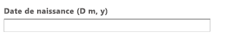

# Pages d’entrée{#landing-pages}

Les pages d’entrée vous permettent d’importer, en un tournemain, une conception et du contenu dans une page AEM. Le code HTML et les ressources connexes préparés par un développeur web pourront être importés, en intégralité ou partiellement. Cette fonctionnalité se révèle particulièrement utile pour créer des pages d’entrée de marketing qui sont actives pendant une période limitée et qui doivent être créées rapidement.

Cette page décrit les éléments suivants :

* Apparence des pages d’entrée dans AEM, y compris les composants disponibles
* Procédures de création d’une page d’entrée et d’importation d’un bloc de conception
* Traitement des pages d’entrée dans AEM
* Configuration des pages d’entrée pour mobiles

La préparation du module de conception pour l’importation est traitée dans [Extension et configuration de l’importateur de conception](/help/sites-administering/extending-the-design-importer-for-landingpages.md). L’intégration à Adobe Analytics est traitée dans [Intégration de pages d’entrée à Adobe Analytics.](/help/sites-administering/integrating-landing-pages-with-adobe-analytics.md)

>[!CAUTION]
>
>L’importateur de conception, utilisé pour importer des pages d’entrée, [est obsolète avec AEM 6.5](/help/release-notes/deprecated-removed-features.md#deprecated-features).

>[!CAUTION]
>
>Comme l’importateur de conception requiert l’accès à `/apps`, il ne fonctionnera pas dans les environnements de cloud conteneurisés où `/apps` est immuable.

## Que sont les Landings page ? {#what-are-landing-pages}

Les pages d’entrée sont des sites comportant une ou plusieurs pages. Elles constituent le « point de terminaison » d’un programme marketing. Par exemple, avec une adresse électronique, AdWords/bannières, des réseaux sociaux, etc. Les objectifs d’une page d’entrée peuvent être multiples, mais tous partagent un point commun, à savoir : le visiteur doit accomplir une tâche, ce dont dépend le succès de la page.

La fonctionnalité « Pages d’entrée » d’AEM permet aux responsables marketing de collaborer avec des concepteurs web externes ou des équipes de créateurs internes afin de créer des conceptions de page pouvant être importées aisément dans AEM, tout en restant modifiables pour les responsables marketing, et publiées sous la même autorité que le reste des sites sous AEM.

Dans AEM, vous pouvez créer des pages d’entrée en procédant comme suit :

1. Dans AEM, créez une page contenant le canevas des pages d’entrée. AEM est fourni avec un exemple nommé **Page d’importateur**.

1. [Préparez le code HTML et les ressources.](/help/sites-administering/extending-the-design-importer-for-landingpages.md)
1. Regroupez les ressources dans un fichier ZIP appelé « module de conception ».
1. Importez le module de conception sur la page de l’importateur.
1. Modifiez et publiez la page.

### Pages d’entrée pour ordinateurs de bureau {#desktop-landing-pages}

Un exemple de page d’entrée dans AEM se présente comme suit :

### Pages d’entrée pour mobiles {#mobile-landing-pages}

Une page d’entrée peut également se présenter sous sa version mobile. Pour disposer d’une version mobile distincte du landing page, la conception d’importation doit comporter deux fichiers html : *index.htm(l)* et *mobile.index.htm(l)*.

La procédure d’importation de ces pages d’entrée est identique à celle d’une page d’entrée normale ; la conception de page d’entrée est associée à un fichier HTML supplémentaire correspondant à la page d’entrée pour mobiles. Ce fichier HTML doit, lui aussi, disposer d’une balise `div` de canevas avec `id=cqcanvas`, comme c’est le cas pour la page d’entrée pour ordinateurs de bureau. De plus, il prend en charge tous les composants modifiables décrits pour la page d’entrée pour ordinateurs de bureau.

La page d’entrée pour mobiles est créée en tant que page enfant de la page d’entrée pour ordinateurs de bureau. Pour l’ouvrir, accédez à la page d’entrée dans Sites web et ouvrez la page enfant.

>[!NOTE]
>
>La page d’entrée pour mobiles est supprimée/désactivée si la page pour ordinateur de bureau l’est également.

## Composants de la page d’entrée  {#landing-page-components}

Pour faire en sorte que des parties du fichier HTML importé puissent être modifiées dans AEM, vous pouvez mapper directement le contenu du fichier HTML des pages d’entrée sur des composants AEM. L’importateur de conception accepte, par défaut, les composants suivants :

* Texte, pour n’importe quel texte
* Titre, pour du contenu dans des balises H1-6
* Image, pour les images qui doivent être échangeables
* Appels à l’action :

   * Lien des clics publicitaires
   * Lien graphique

* Formulaire de piste CTA, pour collecter des informations sur l’utilisateur
* Système de paragraphe (Parsys), pour permettre l’ajout de tout composant ou la conversion du composant ci-dessus

Il est, en outre, possible d’étendre cette liste et de prendre en charge des composants personnalisés. Cette section décrit les composants de manière détaillée.

### Texte {#text}

Le composant Texte vous permet de saisir un bloc de texte à l’aide d’un éditeur WYSIWYG. Pour plus d’informations, reportez-vous à la section [Composant Texte](/help/sites-authoring/default-components.md#text).

Voici un exemple de composant Texte sur une page d’entrée :

#### Titre {#title}

Le composant Titre vous permet d’afficher un titre et d’en configurer la taille (h1-6). Pour plus d’informations, reportez-vous à la section [Composant Titre](/help/sites-authoring/default-components.md#title).

Voici un exemple de composant Titre sur une page d’entrée :

#### Image {#image}

Le composant Image affiche une image que vous pouvez faire glisser à partir de l’outil de recherche de contenu ou télécharger en cliquant dessus. Pour plus d’informations, reportez-vous à la section [Composant Image](/help/sites-authoring/default-components.md).

Voici un exemple de composant Image sur une page d’entrée :

#### Appel à l’action (CTA) {#call-to-action-cta}

Une conception de page d’entrée peut comporter différents liens, dont certains peuvent être considérés comme des « appels à l’action ».

L’appel à l’action est employé pour inciter le visiteur à agir immédiatement sur la page d’entrée, comme « Inscrivez-vous dès maintenant », « Visionnez cette vidéo », « Offre à durée limitée » et ainsi de suite.

* Lien des clics publicitaires : permet d’ajouter un lien texte qui redirige l’utilisateur vers une URL cible.
* Lien graphique - Permet d’ajouter une image cliquable qui dirige l’utilisateur vers une URL cible.

Les deux composants CTA présentent des options similaires. Le lien des clics publicitaires s’accompagne d’options de texte enrichi supplémentaires. Les composants sont décrits de manière détaillée dans les paragraphes suivants.

#### Lien des clics publicitaires {#click-through-link}

Vous pouvez utiliser ce composant CTA pour ajouter le lien texte sur la page d’entrée. L’utilisateur peut cliquer sur ce lien pour accéder à l’URL cible spécifiée dans les propriétés du composant. Elle fait partie du groupe « Appel à l’action ».

**** ÉtiquetteLe texte que les utilisateurs voient. Vous pouvez modifier la mise en forme à l’aide de l’éditeur de texte enrichi.

**Cible** URLEentrez l’URI que les utilisateurs doivent visiter s’ils cliquent sur le texte.

**Options** de renduDécrit les options de rendu. Vous avez le choix entre les options suivantes :

* Charger la page dans une nouvelle fenêtre de navigateur
* Charger la page dans la fenêtre active
* Charger la page dans le cadre parent
* Annuler tous les cadres et charger la page dans un navigateur

**** CSSOdans l’onglet Style, saisissez le chemin d’accès à votre feuille de style CSS.

**** IDOdans l’onglet Style, saisissez un identifiant pour le composant afin de l’identifier de manière unique.

Voici un exemple de lien de clics publicitaires :

#### Lien graphique {#graphical-link}

Vous pouvez utiliser ce composant CTA pour ajouter une image graphique avec un lien sur la page d’entrée. Il peut s’agir d’un simple bouton ou d’une image en arrière-plan. Lorsque l’utilisateur clique sur l’image, il accède à l’URL cible spécifiée dans les propriétés du composant. Elle fait partie du groupe **Appel à l’action**.

**** ÉtiquetteLe texte que les utilisateurs voient dans le graphique. Vous pouvez modifier la mise en forme à l’aide de l’éditeur de texte enrichi.

**Cible** URLEentrez l’URI que les utilisateurs doivent visiter s’ils cliquent sur l’image.

**Options** de renduDécrit les options de rendu. Vous avez le choix entre les options suivantes :

* Charger la page dans une nouvelle fenêtre de navigateur
* Charger la page dans la fenêtre active
* Charger la page dans le cadre parent
* Annuler tous les cadres et charger la page dans un navigateur

**** CSSOdans l’onglet Style, saisissez le chemin d’accès à votre feuille de style CSS.

**** IDOdans l’onglet Style, saisissez un identifiant pour le composant afin de l’identifier de manière unique.

Voici un exemple de lien graphique :

### Formulaire de piste CTA (Appel à l’action){#call-to-action-cta-lead-form}

Le formulaire de piste est utilisé pour collecter des informations sur le profil d’un visiteur/prospect. Ces informations pourront être stockées et exploitées ultérieurement pour mener une campagne marketing efficace. Il s’agit généralement du titre, du nom, de l’adresse électronique, de la date de naissance, de l’adresse, du centre d’intérêt, etc. Il fait partie du groupe **Formulaire de piste CTA**.

Voici un exemple de formulaire de piste CTA :

Les formulaires de piste CTA sont constitués de plusieurs composants différents :

* **Formulaire de piste**
Le composant Formulaire de piste définit le début et la fin d’un nouveau formulaire dans une page. D’autres composants peuvent être placés entre ces éléments, tels que « ID de message électronique », « Prénom », etc.

* **Champs de formulaires et éléments**
Les champs de formulaires et les éléments peuvent inclure des zones textuelles, des cases d’option, des images, etc. L’utilisateur effectue souvent une action dans un champ de formulaire, comme saisir du texte. Voir les éléments de formulaires individuels pour plus d’informations.

* **Composants Profil**
Les composants Profil sont associés aux profils des visiteurs utilisés pour la collaboration sociale et pour tout autre domaine où la personnalisation des visiteurs est requise.

Le précédent illustre un exemple de formulaire ; il comprend le composant **Formulaire de piste** (début et fin), avec les champs **Prénom** et **Id de courriel** utilisés pour l&#39;entrée et un champ **Envoyer**

Les composants suivants sont disponibles à partir du Sidekick pour le formulaire de piste CTA :

#### Paramètres communs à de nombreux composants de formulaire {#settings-common-to-many-lead-form-components}

Bien que chaque composant de formulaire de piste ait une finalité différente, nombre d’entre eux comportent des options et des paramètres semblables.

Les onglets suivants sont disponibles dans la boîte de dialogue lors de la configuration d’un composant de formulaire :

* **Titre et texte**
Cet onglet vous invite à renseigner des informations de base, telles que le titre du composant et tout texte d’accompagnement. Le cas échéant, il vous permet également de définir d’autres informations essentielles ; par exemple, s’il s’agit d’un champ à sélection multiple ou encore les différents éléments pouvant être sélectionnés.

* **Valeurs initiales**
Permet d’indiquer une valeur par défaut.

* **Contraintes**
Permet d’indiquer si un champ est obligatoire et les contraintes qui lui sont appliquées (doit être numérique, par exemple).

* **Style**
Indique la taille et le style des champs.

>[!NOTE]
>
>Les champs affichés varient en fonction du composant.
>
>Toutes les options ne sont pas disponibles pour l’ensemble des composants du formulaire de piste. Pour plus d’informations sur ces [paramètres communs](/help/sites-authoring/default-components.md#formsgroup), reportez-vous à la section Formulaires.

#### Composants de formulaire de piste {#lead-form-components}

La section suivante décrit les composants disponibles pour les formulaires de piste Appel à l’action (CTA).

**** À propos dePermet aux utilisateurs d’ajouter des informations à propos de.

**Champ d&#39;adresse** Permet aux utilisateurs de saisir des informations d&#39;adresse. Lorsque vous configurez ce composant, vous devez saisir le Nom de l’élément dans la boîte de dialogue. Le Nom de l’élément est le nom de l’élément de formulaire. Cela indique l’emplacement de stockage des données dans le référentiel.

**Date de** naissanceLes utilisateurs peuvent saisir des informations sur la date de naissance.

**ID de** courrielPermet aux utilisateurs de saisir une adresse de courriel (identification).

**PrénomFournit un champ permettant aux utilisateurs de saisir leur prénom.** 

**** SexeLes utilisateurs peuvent sélectionner leur sexe dans une liste déroulante.

**Nom** Les utilisateurs peuvent saisir des informations de nom.

**Formulaire de pisteAjoutez ce composant pour ajouter un formulaire de piste à votre landing page.** Un formulaire de piste comprend automatiquement un champ Début du formulaire de piste et un champ Fin de formulaire de piste. Entre les deux, vous ajoutez les composants « Formulaire de piste » décrits dans cette section.

Le composant Formulaire de piste définit à la fois le début et la fin d’un formulaire à l’aide des éléments **Début de formulaire** et **Fin de formulaire**. Ces deux paragraphes sont toujours utilisés conjointement pour s’assurer que le formulaire est correctement défini.

Après avoir ajouté le formulaire de piste, vous pouvez configurer le début ou la fin du formulaire en cliquant sur **Modifier** dans la barre correspondante.

**Début du formulaire de piste**

Deux onglets sont disponibles pour la configuration, **Formulaire** et **Avancé** :

**Page de remerciement**
Page à référencer pour remercier les visiteurs qui ont saisi des données. Si ce champ est laissé vide, le formulaire est réaffiché après la soumission.

**Début** WorkflowDétermine quel processus est déclenché une fois qu&#39;un formulaire de piste est envoyé.

**Options** de publicationLes options de publication suivantes sont disponibles :

* Créer une piste
* Service de messagerie électronique : créer un abonné et l’ajouter à la liste. Sélectionnez cette option si vous utilisez un fournisseur de services de messagerie tel que ExactTarget.
* Service de messagerie : Envoyer un courriel de répondeur automatique : à utiliser si vous utilisez un prestataire de messagerie comme ExactTarget.
* Service de messagerie : Désabonner l&#39;utilisateur de la liste : à utiliser si vous utilisez un prestataire de messagerie tel qu&#39;ExactTarget.
* Désabonner l’utilisateur

**Identifiant de formulaireIdentifiant** de formulaire qui identifie de manière unique le formulaire de piste. Utilisez cet identifiant si plusieurs formulaires figurent sur une seule page ; assurez-vous qu’ils présentent des identifiants différents.

**Load** PathChemin d&#39;accès aux propriétés de noeud utilisé pour charger des valeurs prédéfinies dans les champs de formulaire de piste.

Il s’agit d’un champ facultatif qui permet de spécifier le chemin à un nœud dans le référentiel. Lorsque ce nœud comporte des propriétés qui correspondent aux noms des champs, les champs adéquats du formulaire sont préchargés avec la valeur de ces propriétés. S’il n’existe aucune correspondance, le champ contient la valeur par défaut.

**** Validation du clientIndique si la validation du client est requise pour ce formulaire (la validation du serveur se produit toujours). Ceci peut être réalisé en association avec le composant Forms Captcha.

**Type de ressource de validation** Définit le type de ressource de validation de formulaire si vous souhaitez valider l&#39;intégralité du formulaire de piste (au lieu de champs individuels).

Si vous validez le formulaire dans son intégralité, vous devez également inclure l’un des éléments suivants :

* Un script pour la validation du client :
   ` /apps/<myApp>/form/<myValidation>/formclientvalidation.jsp`

* Un script pour la validation du côté serveur :
   ` /apps/<myApp>/form/<myValidation>/formservervalidation.jsp`

**Configuration de l’actionSelon la sélection dans Options de publication, la configuration de l’action change.** Lorsque vous sélectionnez, par exemple, Créer une piste, vous pouvez configurer la liste à laquelle la piste est ajoutée.

* **Afficher le bouton Envoyer**
Indique si le bouton Envoyer doit être visible ou non.

* **Envoyer le nom**
Identifiant à spécifier si vous utilisez plusieurs boutons Envoyer dans un formulaire.

* **Envoyer le titre**
Nom qui apparaît sur le bouton, Envoyer, par exemple.

* **Afficher le bouton Réinitialiser**
Cochez la case pour que le bouton Réinitialiser soit visible.

* **Réinitialiser le titre**
Nom qui apparaît sur le bouton Réinitialiser.

* **Description**
Informations qui s’affichent sous le bouton.

## Création d’une page d’entrée {#creating-a-landing-page}

Trois étapes sont nécessaires lorsque vous créez une page d’entrée :

1. Créez une page d’importateur.
1. [Préparez le code HTML pour l’importation.](/help/sites-administering/extending-the-design-importer-for-landingpages.md)
1. Importez le module de conception.

### Utilisation de l’importateur de conception  {#use-of-the-design-importer}

Dans la mesure où l’importation de pages implique la préparation du code HTML, la vérification et le test des pages, l’importation de pages d’entrée est conçue comme une tâche d’administrateur. En tant qu’administrateur, les utilisateurs qui effectuent l’importation doivent disposer d’autorisations de lecture, d’écriture, de création et de suppression sur `/apps`. Si l’utilisateur ne dispose pas de ces autorisations, l’importation échouera.

>[!NOTE]
>
>L’importateur de conceptions étant conçu comme un outil d’administration nécessitant des autorisations de lecture, d’écriture, de création et de suppression sur `/apps`, l’Adobe ne recommande pas d’utiliser l’importateur de conceptions en production.

Adobe recommande d’utiliser l’importateur de conception sur une instance intermédiaire. Sur une instance intermédiaire, l’importation peut être testée et validée par un développeur qui est ensuite responsable du déploiement du code sur l’instance de production.

### Création d’une page d’importateur {#creating-an-importer-page}

Avant de pouvoir importer votre conception de page d’entrée, vous devez créer une page d’importateur ; sous une campagne, par exemple. Le modèle Page d’importateur vous permet d’importer l’intégralité de votre page d’entrée HTML. La page contient une zone de déplacement dans laquelle vous pouvez importer votre module de conception de page d’entrée par glisser-déplacer.

>[!NOTE]
>
>Par défaut, une page d’importateur ne peut être créée que sous les campagnes. Vous pouvez toutefois superposer ce modèle afin de créer une page d’entrée sous `/content/mysite`.

Pour créer une page d’entrée, procédez comme suit :

1. Accédez à la console **Sites web**.
1. Sélectionnez la campagne dans le volet de gauche.
1. Cliquez sur **Nouveau** pour ouvrir la fenêtre **Créer une page**.
1. Sélectionnez le modèle **Page d’importateur**, ajoutez un titre et, éventuellement, un nom, puis cliquez sur **Créer**.

   

   La nouvelle page d’importateur s’affiche.

### Préparation du fichier HTML pour l’importation {#preparing-the-html-for-import}

Avant d’importer le bloc de conception, il convient de préparer le fichier HTML. Pour plus d’informations, reportez-vous à la section [Extension et configuration de l’importateur de conception](/help/sites-administering/extending-the-design-importer-for-landingpages.md).

### Importation du bloc de conception  {#importing-the-design-package}

Après avoir créé une page d’importateur, vous pouvez y importer un module de conception. Vous obtiendrez des détails sur la création du module de conception et la structure recommandée dans [Extension et configuration de l’importateur de conception](/help/sites-administering/extending-the-design-importer-for-landingpages.md).

En supposant que le bloc de conception soit prêt, les étapes suivantes décrivent comment importer ce dernier sur la page d’importateur.

1. Ouvrez la page d’importateur que vous avez [créée précédemment](#creatingablankcanvaspage).

   

1. Faites glisser le bloc de conception vers la zone de déplacement. Comme vous pouvez le constater, la flèche change de sens lorsque vous faites glisser un bloc. 
1. Après avoir effectué cette opération, la page d’entrée apparaît en lieu et place de la page d’importateur. Votre landing page HTML a été importé avec succès.

   

>[!NOTE]
>
>Lors de lʼimportation, le balisage est nettoyé pour des raisons de sécurité et afin dʼéviter lʼimportation et la publication de balisage non valide. Cela suppose que les balises HTML et que toutes les autres formes dʼéléments, tels que les SVG ou les composants web intégrés, seront filtrés.

>[!NOTE]
>
>Si vous rencontrez des difficultés à importer le bloc de conception, reportez-vous à la section [Résolution des problèmes](/help/sites-administering/extending-the-design-importer-for-landingpages.md#troubleshooting).

## Utilisation de pages d’entrée {#working-with-landing-pages}

La conception et les éléments sont généralement créés par un concepteur, travaillant éventuellement dans une agence extérieure, dans des outils avec lesquels ils sont familiers, tels qu’Adobe Photoshop ou Adobe Dreamweaver. Une fois la conception terminée, le concepteur envoie, au service marketing, un fichier compressé contenant tous les éléments. Le contact du service marketing est alors chargé de faire glisser le fichier compressé dans AEM et de publier le contenu.

Il se peut, en outre, que le concepteur doive apporter des modifications à la page d’entrée importée en modifiant ou en supprimant du contenu, ou en configurant des composants CTA (appel à l’action). Enfin, le responsable marketing souhaite prévisualiser la page d’entrée, puis activer la campagne afin de s’assurer que la page est publiée.

Cette section explique comment effectuer les opérations suivantes :

* Supprimer une page d’entrée
* Télécharger le bloc de conception
* Afficher les informations d’importation
* Réinitialiser une page d’entrée
* [Configuration des composants CTA et ajout de contenu à la page](#call-to-action-cta)
* Prévisualiser la page d’entrée
* Activer/publier une page d’entrée

Lorsque vous importez le package de conception, les options **Effacer la conception** et **Télécharger le fichier zip** sont disponibles dans le menu paramètres de la page :

### Téléchargement du bloc de conception importé {#downloading-the-imported-design-package}

Le téléchargement du fichier compressé vous permet d’enregistrer celui qui a été importé avec une page d’entrée spécifique. Notez que les modifications effectuées sur une page ne sont pas ajoutées au fichier compressé.

Pour télécharger le bloc de conception importé, cliquez sur **Télécharger le fichier zip** dans la barre d’outils de la page d’entrée.

### Affichage d’informations d’importation  {#viewing-import-information}

Dans l’interface utilisateur classique, vous pouvez afficher, à tout moment, des informations sur la dernière importation en cliquant sur le point d’exclamation bleu dans la partie supérieure de la page d’entrée.

Si le module de conception importé contient des erreurs (s’il fait référence, par exemple, à des images/scripts qui n’existent pas dans le module), l’importateur de conception affiche ces problèmes sous la forme d’une liste. Pour afficher la liste des problèmes, dans l’interface utilisateur classique, cliquez sur le lien correspondant dans la barre d’outils de la page d’entrée. Dans l’image suivante, cliquez sur le lien **Problèmes** pour ouvrir la fenêtre Problèmes d’importation.

### Réinitialisation d’une page d’entrée {#resetting-a-landing-page}

Si vous souhaitez réimporter votre module de conception de la page d’entrée après y avoir apporté des modifications, vous pouvez « effacer » la page d’entrée en cliquant sur **Effacer** dans la partie supérieure de la page d’entrée dans l’interface utilisateur classique ou en cliquant sur Effacer dans le menu Paramètres de l’interface utilisateur optimisée pour les écrans tactiles. La page d’entrée importée est alors supprimée et une page d’importateur vierge est créée.

Lors de l’effacement de la page d’entrée, vous pouvez supprimer les modifications du contenu. Si vous cliquez sur **Non**, les modifications de contenu sont conservées, c&#39;est-à-dire que la structure sous `jcr:content/importer`est conservée et que seul le composant de page d&#39;importation et les ressources de `etc/design` sont supprimés. En revanche, si vous cliquez sur **Oui**, `jcr:content/importer` est également supprimé.

>[!NOTE]
>
>Si vous décidez de supprimer les modifications du contenu, toutes les modifications que vous avez effectuées sur la page d’entrée importée, ainsi que toutes les propriétés de page, seront perdues lorsque vous cliquerez sur **Effacer**.

### Modification et ajout de composants sur une page d’entrée {#modifying-and-adding-components-on-a-landing-page}

Pour modifier des composants sur une page d’entrée, double-cliquez sur ceux-ci afin de les ouvrir et de les modifier, comme vous le feriez avec tout autre composant.

Pour ajouter des composants sur la page d’entrée, faites-les glisser et déposez-les dessus à partir du sidekick de l’interface utilisateur classique ou du volet Composants de l’interface utilisateur optimisée pour les écrans tactiles. Ensuite, modifiez-les de manière appropriée.

>[!NOTE]
>
>Si un composant de la page d’entrée ne peut pas être modifié, vous devez réimporter le fichier compressé après avoir [modifié le fichier HTML.](/help/sites-administering/extending-the-design-importer-for-landingpages.md) Cela signifie que les parties non modifiables n’ont pas été converties en composants AEM au cours de l’importation.

### Suppression d’une page d’entrée  {#deleting-a-landing-page}

La suppression d’une page d’entrée s’apparente à la suppression d’une page AEM normale.

Il convient toutefois de signaler une exception : lorsque vous supprimez une page d’entrée d’ordinateur de bureau, la page correspondante pour mobiles l’est également (le cas échéant), mais pas l’inverse.

### Publication d’une page d’entrée  {#publishing-a-landing-page}

Vous pouvez publier le landing page et toutes ses dépendances comme si vous publiiez une page normale.

>[!NOTE]
>
>Lorsque vous publiez la page d’entrée d’ordinateur de bureau, la version correspondante pour mobiles l’est également (le cas échéant), mais pas l’inverse.
