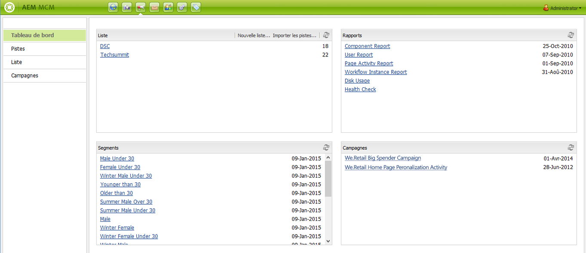
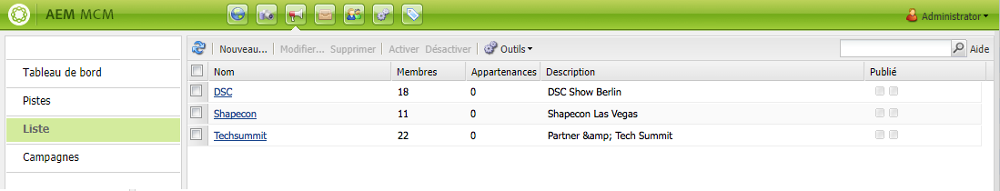
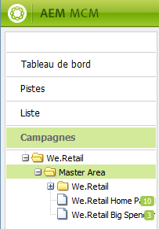
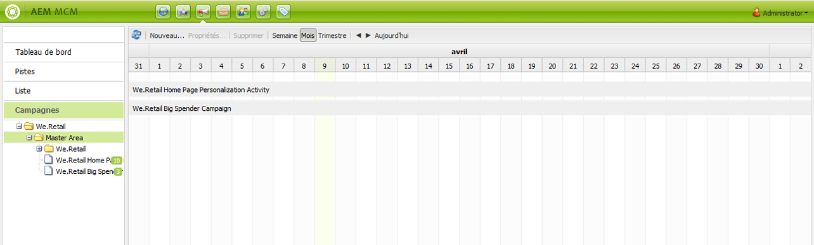
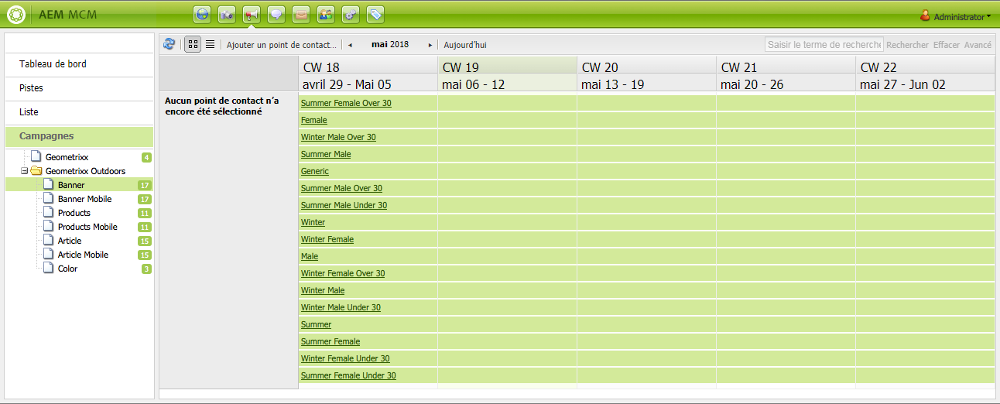
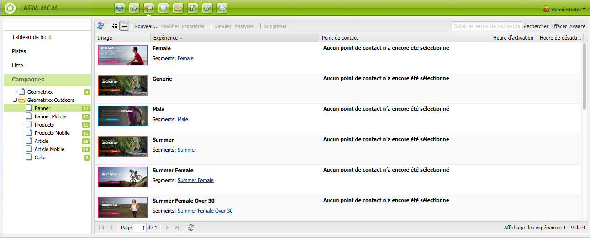
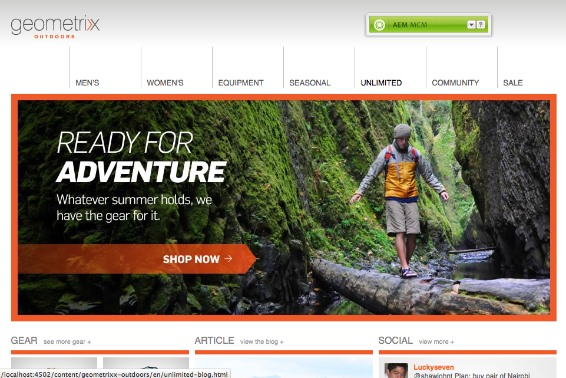
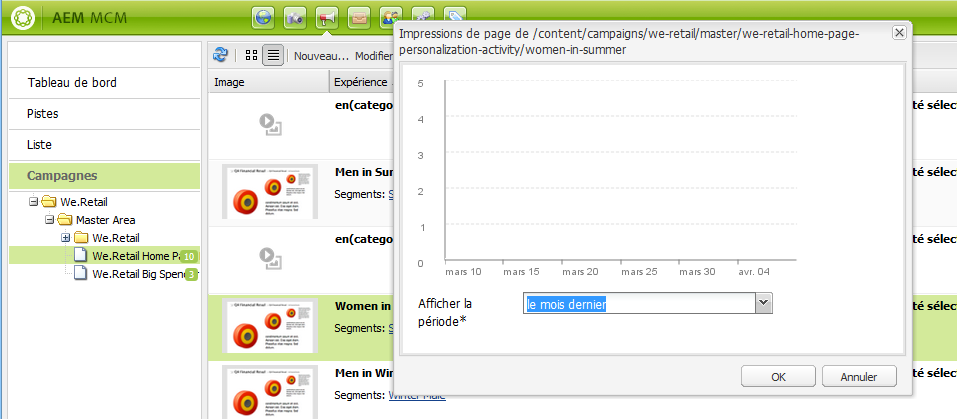

# Utilisation de Marketing Campaign Manager{#working-with-the-marketing-campaign-manager}

Marketing Campaign Manager (MCM) est une console disponible dans AEM qui vous aide à gérer vos campagnes multicanal. Ce logiciel d’automatisation des activités marketing permet de gérer l’ensemble des marques, campagnes et expériences avec les segments, listes, pistes et rapports qui y sont associés.

Vous pouvez accéder à MCM de diverses manières dans AEM : à partir de l’écran d’accueil, à l’aide de l’icône Campagnes ou via l’URL :

`https://<hostname>:<port>/libs/mcm/content/admin.html`

Par exemple :

`https://localhost:4502/libs/mcm/content/admin.html`

MCM vous permet d’accéder aux éléments suivants :

* **[Tableau de bord](#dashboard)** Le tableau de bord se compose de quatre volets :

   * [Listes](#lists) Ce volet affiche les listes que vous avez déjà créées, ainsi que le nombre de pistes figurant dans chacune d’elles. Il vous permet de créer une liste entièrement nouvelle ou en important des pistes.
Lorsque vous sélectionnez une liste spécifique, vous accédez à la section [Listes](#lists) qui affiche des détails à son sujet.

   * [Segments](/help/sites-classic-ui-authoring/classic-personalization-campaigns.md#anoverviewofsegmentation) Ce volet affiche les segments que vous avez définis. Les segments vous permettent de caractériser un ensemble de visiteurs qui partagent des caractéristiques communes.
Lorsque vous sélectionnez un segment spécifique, il s’ouvre dans la page de définition correspondante.

   * [Rapports](/help/sites-administering/reporting.md) AEM fournit différents rapports pour vous aider à analyser et à surveiller l’état de votre instance. Ce volet de MCM répertorie les rapports.
Lorsque vous sélectionnez un rapport, sa page s’ouvre.

   * [Campagnes](#campaigns) Ce volet répertorie les expériences de campagne, telles que les [newsletters](/help/sites-classic-ui-authoring/classic-personalization-campaigns.md#newsletters) et les [teasers](/help/sites-classic-ui-authoring/classic-personalization-campaigns.md#teasers).

* **[Pistes](#leads)** Ce volet vous permet de gérer vos pistes. Vous pouvez créer ou importer des pistes, modifier des détails spécifiques ou supprimer ceux dont vous n’avez plus besoin. Vous pouvez également placer les pistes dans différents groupes, appelés listes. **Remarque :** Adobe ne prévoit pas d’améliorer davantage cette fonctionnalité.
 Il est conseillé d’[utiliser Adobe Campaign et l’intégration à AEM](/help/sites-administering/campaign.md). 

* **[Listes](#lists)** Ce volet vous permet de gérer vos listes (de pistes). **Remarque :** Adobe ne prévoit pas d’améliorer davantage cette fonctionnalité.
 Il est conseillé d’[utiliser Adobe Campaign et l’intégration à AEM](/help/sites-administering/campaign.md). 

* **[Campagnes](#campaigns)** Ce volet vous permet de gérer vos marques, campagnes et expériences.

## Tableau de bord {#dashboard}

Le tableau de bord se compose de quatre volets qui vous donnent un aperçu des listes (de pistes), segments, rapports et campagnes. L’accès aux fonctionnalités de base est également possible à partir de ce tableau de bord.

### Pistes {#leads}

>[!NOTE]
>
>Adobe ne prévoit pas d’optimiser cette fonctionnalité (gestion des pistes).
> Il est conseillé d’[utiliser Adobe Campaign et l’intégration à AEM](/help/sites-administering/campaign.md). 

Dans AEM MCM, vous pouvez organiser et ajouter des pistes en les saisissant manuellement ou en important une liste de valeurs séparées par des virgules ; une liste de diffusion, par exemple. Pour générer des pistes, il existe d’autres méthodes comme les abonnements aux newsletters ou les inscriptions aux communautés (s’ils sont configurés de la sorte, ils peuvent déclencher un worfklow pour renseigner les pistes). Les pistes sont généralement classées et répertoriées dans une liste pour vous permettre d’effectuer, ultérieurement, des actions sur la liste entière ; envoyer un courrier électronique personnalisé à une certaine liste, par exemple.

Dans la section **Pistes** du volet de gauche, vous pouvez créer, importer, modifier et supprimer vos pistes, puis les activer ou les désactiver suivant les besoins. Vous pouvez ajouter une piste à une liste ou afficher la liste dont elle fait déjà partie.

>[!NOTE]
>
>Voir [Utilisation des pistes](/help/sites-classic-ui-authoring/classic-personalization-campaigns.md#workingwithleads) pour plus d’informations sur certaines tâches. 

### Listes {#lists}

>[!NOTE]
>
>Adobe ne prévoit pas d’optimiser cette fonctionnalité (gestion des listes).
> Il est conseillé d’[utiliser Adobe Campaign et l’intégration à AEM](/help/sites-administering/campaign.md). 

Les listes vous permettent d’organiser vos pistes en groupes. Elles vous offrent la possibilité de cibler vos campagnes marketing sur un groupe de personnes de votre choix ; vous pouvez, par exemple, adresser une newsletter ciblée à une liste.

La section **Listes** vous permet de créer, d’importer, de modifier, de fusionner ou encore de supprimer des listes. Vous pourrez ensuite les activer ou les désactiver suivant vos besoins. Il est également possible d’afficher les pistes qu’elles contiennent, de vérifier si elles font partie d’une autre liste ou encore d’en afficher la description.

>[!NOTE]
>
>Voir [Utilisation des listes](/help/sites-classic-ui-authoring/classic-personalization-campaigns.md#workingwithlists) pour plus d’informations sur certaines tâches. 

### Campagnes {#campaigns}

>[!NOTE]
>
>Voir [Teasers et stratégies](/help/sites-classic-ui-authoring/classic-personalization-campaigns.md#workingwithlists), [Configuration de votre campagne](/help/sites-classic-ui-authoring/classic-personalization-campaigns.md#settingupyourcampaign) et [Newsletters](/help/sites-classic-ui-authoring/classic-personalization-campaigns.md#newsletters) pour plus d’informations sur certaines tâches. 

Pour accéder aux campagnes existantes, dans le MCM, cliquez sur **Campagnes**.

* **Dans le volet de gauche** : Vous voyez la liste de toutes les marques et campagnes.
Un simple clic sur une marque effectue les deux opérations suivantes :

   * Développer la liste afin d’afficher toutes les campagnes associées dans le volet de gauche. Cette liste affiche également le nombre d’expériences existant pour chaque campagne.
   * Ouvrir l’aperçu des marques dans le volet de droite.

* **Dans le volet de droite** : Des icônes sont affichées pour chaque marque (les anciennes campagnes ne sont pas visibles).
Vous pouvez double-cliquer sur ces icônes pour ouvrir l’aperçu de la marque.

#### Aperçu de la marque {#brand-overview}

Vous pouvez effectuer les opérations suivantes à partir de cette fenêtre :

* Afficher le nombre de campagnes et d’expériences (nombre indiqué dans le panneau de gauche) existant pour cette marque.
* Créer une campagne (**Nouveau...**) pour cette marque.

* Modifier la période en cours de consultation ; sélectionnez **Semaine**, **Mois** ou **Trimestre**, utilisez les flèches pour sélectionner des périodes spécifiques ou revenez à **Aujourd’hui**.

* Sélectionnez une campagne (dans le volet de droite) pour :

   * Modifier les **Propriétés...**
   * **Supprimer** la campagne.

* Ouvrez l’aperçu de la campagne (double-cliquez sur une campagne dans le volet de droite ou cliquez dans le volet de gauche).

#### Aperçu de la campagne  {#campaign-overview}

Deux modes d’affichage sont disponibles pour chaque campagne :

1. **Vue Calendrier**

   Utilisez l’icône suivante :

   

   Elle affiche la liste de tous les points de contact (en gris) avec une chronologie des expériences (en vert) qui y sont connectées :

   

   Vous pouvez effectuer les opérations suivantes à partir de cette fenêtre :

   * Modifier la période en cours de consultation en utilisant les flèches ou revenir à **Aujourd’hui**.

   * Utiliser **Ajouter un point de contact...** pour ajouter un point de contact pour une expérience existante.

   * Cliquer sur un teaser (dans le volet de droite) pour définir les paramètres **Heure d’activation** et **Heure de désactivation**.

1. **Mode Liste**

   Utilisez l’icône suivante :

   

   Cette option affiche toutes les expériences (teasers et newsletters, par exemple) de la campagne sélectionnée :

   

   Vous pouvez effectuer les opérations suivantes à partir de cette fenêtre :

   * Créer un **nouveau...expérience**; par exemple, offres Adobe Target, teasers et bulletins d’information.
   * **Modifier** les détails d’une newsletter ou d’une page de teaser spécifique (vous pouvez également effectuer un double-clic).
   * Définir les **Propriétés...** d’une newsletter ou d’une page de teaser spécifique
   * **Simuler** l’aspect et la fonctionnalité d’une expérience (newsletter ou page de teaser).
Une fois la page simulée ouverte, vous pouvez ouvrir le sidekick afin de basculer vers le mode d’édition de cette page.

   * **Analyser...** les impressions générées pour une page.

   * **Supprimer** les éléments dont vous n’avez plus besoin.
   * **Rechercher** votre texte (la recherche porte sur le champ Titre de l’expérience).
   * Utiliser le mode de recherche **Avancé** pour appliquer des filtres à la recherche.

### Simulation de vos expériences de campagne  {#simulating-your-campaign-experiences}

Dans MCM, cliquez sur **Campagnes**. Assurez-vous que le mode Liste est actif, puis sélectionnez l’expérience de campagne requise et cliquez sur **Simuler**. Le point de contact (page de newsletter ou de teaser) s’ouvre. Il affiche l’expérience que vous avez sélectionnée, telle qu’elle sera présentée au visiteur.

Vous avez également la possibilité d’ouvrir le sidekick (en cliquant sur la petite flèche vers le bas) pour basculer vers le mode d’édition afin de mettre à jour la page.

### Analyse de vos expériences de campagne  {#analyzing-your-campaign-experiences}

Dans MCM, cliquez sur **Campagnes**. Assurez-vous que le mode Liste est actif, puis sélectionnez l’expérience de campagne requise et cliquez sur **Analyser...** Un graphique des impressions de page au fil du temps s’affiche alors.

