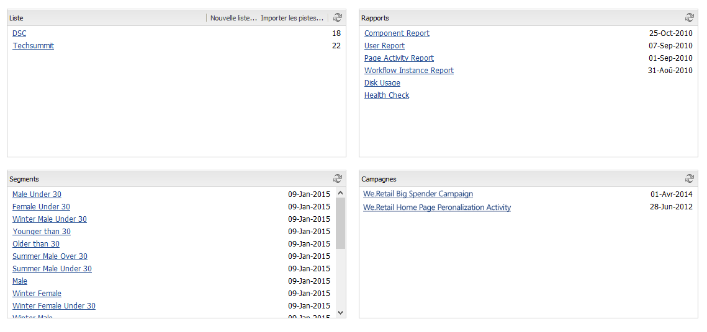
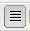

# Utiliser Marketing Campaign Manager{#working-with-the-marketing-campaign-manager}

Marketing Campaign Manager (MCM) est une console disponible dans AEM qui vous aide à gérer vos campagnes multicanal. Grâce à ce logiciel d’automatisation du marketing, vous pouvez gérer toutes vos marques, campagnes et expériences, ainsi que les segments, listes, prospects et rapports associés.

MCM est accessible à partir de divers emplacements dans AEM, par exemple, l’écran d’accueil, à l’aide de l’icône Campagnes ou avec l’URL :

`https://<hostname>:<port>/libs/mcm/content/admin.html`

Par exemple :

`https://localhost:4502/libs/mcm/content/admin.html`

MCM vous permet d’accéder aux éléments suivants :

* **[Tableau de bord](#dashboard)**
Le tableau de bord se compose de quatre volets :

   * [Listes](#lists)
Ce volet affiche les listes que vous avez déjà créées, ainsi que le nombre de prospects figurant dans chacune d’elles. Depuis ce volet, vous pouvez créer une liste directement ou importer des pistes pour créer une liste.
Lorsque vous sélectionnez une liste spécifique, vous accédez à la section [Listes](#lists) qui affiche des détails à son sujet.

   * [Segments](/help/sites-classic-ui-authoring/classic-personalization-campaigns.md#anoverviewofsegmentation)
Ce volet affiche les segments que vous avez définis. Les segments vous permettent de caractériser un ensemble de visiteurs qui partagent des caractéristiques communes.
La sélection d’un segment spécifique ouvre la page de définition de segment.

   * [Rapports](/help/sites-administering/reporting.md)
AEM fournit différents rapports pour vous aider à analyser et à surveiller le statut de votre instance. Ce volet de MCM répertorie les rapports.
La sélection d’un rapport ouvre la page du rapport.

   * [Campagnes](#campaigns)
Ce volet répertorie les expériences de campagne, telles que les [newsletters](/help/sites-classic-ui-authoring/classic-personalization-campaigns.md#newsletters) et les [teasers](/help/sites-classic-ui-authoring/classic-personalization-campaigns.md#teasers).

* **[Prospects](#leads)**
Ce volet vous permet de gérer vos prospects. Vous pouvez créer ou importer des prospects, modifier des détails spécifiques ou supprimer ceux dont vous n’avez plus besoin. Vous pouvez également placer les prospects dans différents groupes, appelés Listes. **Remarque :** Adobe ne prévoit pas de continuer à améliorer cette fonctionnalité. Il est recommandé d’utiliser [Adobe Campaign et intégration à AEM](/help/sites-administering/campaign.md).

* **[Listes](#lists)**
Ce volet vous permet de gérer vos listes (de prospects). **Remarque :** Adobe ne prévoit pas de continuer à améliorer cette fonctionnalité. Il est recommandé d’utiliser [Adobe Campaign et intégration à AEM](/help/sites-administering/campaign.md).

* **[Campagnes](#campaigns)**
Ce volet vous permet de gérer vos marques, campagnes et expériences.

## Tableau de bord {#dashboard}

Le tableau de bord présente quatre volets qui vous donnent un aperçu de vos listes (de prospects), segments, rapports et campagnes. L’accès aux fonctionnalités de base pour ceux-ci est également disponible ici.

### Prospects {#leads}

>[!NOTE]
>
>Adobe ne prévoit pas d’optimiser cette fonctionnalité (gestion des prospects).
>Il est recommandé d’utiliser [Adobe Campaign et intégration à AEM](/help/sites-administering/campaign.md).

Dans AEM MCM, vous pouvez organiser et ajouter des prospects en les saisissant manuellement ou en important une liste séparée par des virgules. par exemple, une liste de diffusion. Pour générer des pistes, il existe d’autres méthodes comme les abonnements aux newsletters ou les inscriptions aux communautés (s’ils sont configurés de la sorte, ils peuvent déclencher un workflow pour renseigner les pistes). Les prospects sont généralement catégorisés et mis dans une liste afin que vous puissiez ensuite effectuer des actions sur l’ensemble de la liste ; par exemple, envoyer un email personnalisé à une certaine liste.

Sous **Prospects** dans le volet de gauche, vous pouvez créer, importer, modifier et supprimer vos prospects, puis les activer ou les désactiver selon vos besoins. Vous pouvez ajouter un prospect à une liste ou voir à quelles listes il appartient déjà.

>[!NOTE]
>
>Consultez [Utilisation des prospects](/help/sites-classic-ui-authoring/classic-personalization-campaigns.md#workingwithleads) pour plus d’informations sur certaines tâches.

### Listes {#lists}

>[!NOTE]
>
>Adobe ne prévoit pas d’optimiser cette fonctionnalité (gestion des listes).
>Il est recommandé d’utiliser [Adobe Campaign et intégration à AEM](/help/sites-administering/campaign.md).

Les listes vous permettent d’organiser vos prospects en groupes. Avec les listes, vous pouvez cibler vos campagnes marketing sur un groupe de personnes sélectionné ; par exemple, vous pouvez envoyer une newsletter ciblée à une liste.

Sous **Listes**, vous pouvez gérer vos listes en créant, important, éditant, fusionnant et supprimant des listes que vous pourrez ensuite activer ou désactiver selon vos besoins. Vous pouvez également afficher les prospects de cette liste, voir si la liste est membre d’une autre liste ou afficher la description.

>[!NOTE]
>
>Consultez [Utilisation des listes](/help/sites-classic-ui-authoring/classic-personalization-campaigns.md#workingwithlists) pour plus d’informations sur certaines tâches. 

### Campagnes {#campaigns}

>[!NOTE]
>
>Consultez [Teasers et stratégies](/help/sites-classic-ui-authoring/classic-personalization-campaigns.md#workingwithlists), [Configuration de votre campagne](/help/sites-classic-ui-authoring/classic-personalization-campaigns.md#settingupyourcampaign) et [Newsletters](/help/sites-classic-ui-authoring/classic-personalization-campaigns.md#newsletters) pour plus d’informations sur certaines tâches. 

Pour accéder aux campagnes existantes, dans le MCM, cliquez sur **Campagnes**.

* **Dans le volet de gauche** :
Vous voyez la liste de toutes les marques et campagnes.
Cliquez sur une marque pour développer la liste afin d’afficher toutes les campagnes associées dans le volet de gauche. Cette liste indique également le nombre d’expériences qui existent pour chaque campagne. Il ouvre également l’aperçu de la marque dans le volet de droite.

* **Dans le volet de droite** :
Des icônes sont affichées pour chaque marque (les anciennes campagnes ne sont pas visibles).
Vous pouvez double-cliquer dessus pour ouvrir l’aperçu de la marque.

#### Vue d’ensemble de la marque {#brand-overview}

Vous pouvez effectuer les opérations suivantes à partir de cette fenêtre :

* Afficher le nombre de campagnes et d’expériences (nombre affiché dans le volet de gauche) qui existent pour cette marque.
* Sous **Nouveau...**, créer une campagne pour cette marque.

* Modifier le calendrier affiché ; sélectionnez **Semaine**, **Mois** ou **Trimestre**, utilisez les flèches pour sélectionner des périodes spécifiques ou revenez à **Aujourd’hui**.

* Sélectionnez une campagne (dans le volet de droite) pour :

   * Modifier les **Propriétés...**.
   * **Supprimer** la campagne.

* Ouvrez la vue d’ensemble des campagnes (double-cliquez sur une campagne dans le volet de droite ou faites un simple clic dans le volet de gauche).

#### Vue d’ensemble de la campagne {#campaign-overview}

Pour chaque campagne individuelle, deux vues sont disponibles :

1. **Mode Calendrier**

   Utilisez l’icône :

   

   Elle présente une liste de tous les points de contact (gris) avec une période horizontale des expériences (vert) connectées à ce point de contact :

   

   Vous pouvez effectuer les opérations suivantes à partir de cette fenêtre :

   * Modifiez la période que vous affichez à l’aide des flèches ou revenez à **Aujourd’hui**.

   * Utilisez **Ajouter un point de contact...** pour ajouter un nouveau point de contact pour une expérience existante.

   * Cliquez sur un teaser (dans le volet de droite) pour définir la variable **Heure d’activation** et **Heure de désactivation**.

1. **Vue Liste**

   Utilisez l’icône :

   

   Cette section répertorie toutes les expériences (teasers et newsletters, par exemple) de la campagne sélectionnée :

   

   Vous pouvez effectuer les opérations suivantes à partir de cette fenêtre :

   * Créez une **nouvelle** expérience, par exemple, des newsletters, des teasers et des offres Adobe Target.
   * **Modifiez** les informations d’une page de teaser ou d’une newsletter spécifique (un double-clic peut également être utilisé).
   * Définissez les **Propriétés...** pour une newsletter ou une page de teaser spécifique.
   * **Simulez** l’aspect et la fonctionnalité d’une expérience (newsletter ou page de teaser).
Lorsque la page simulée est ouverte, vous pouvez ensuite ouvrir le sidekick pour passer en mode d’édition pour cette page.

   * **Analysez** les impressions générées pour une page.

   * **Supprimez** les éléments lorsqu’ils ne sont plus nécessaires.
   * **Recherchez** votre texte (la recherche porte sur le champ Titre de l’expérience).
   * Utilisez le mode **Avancé** de la recherche pour appliquer des filtres à la recherche.

### Simuler des expériences de campagne {#simulating-your-campaign-experiences}

Dans le MCM, cliquez sur **Campagnes**. Assurez-vous que la vue Liste est active, puis sélectionnez l’expérience de campagne requise et cliquez sur **Simuler**. Le point de contact (page de teaser ou de newsletter) s’ouvre pour afficher l’expérience que vous avez sélectionnée, tel que le visiteur ou la visiteuse la verra.

À partir de là, vous pouvez également ouvrir le sidekick (cliquez sur la petite flèche vers le bas) pour passer en mode d’édition afin de mettre à jour la page.

### Analyser vos expériences de campagne {#analyzing-your-campaign-experiences}

Dans le MCM, cliquez sur **Campagnes**. Assurez-vous que la vue Liste est active, puis sélectionnez l’expérience de campagne requise et cliquez sur **Analyser...** Un graphique des impressions de page au fil du temps s’affiche.

