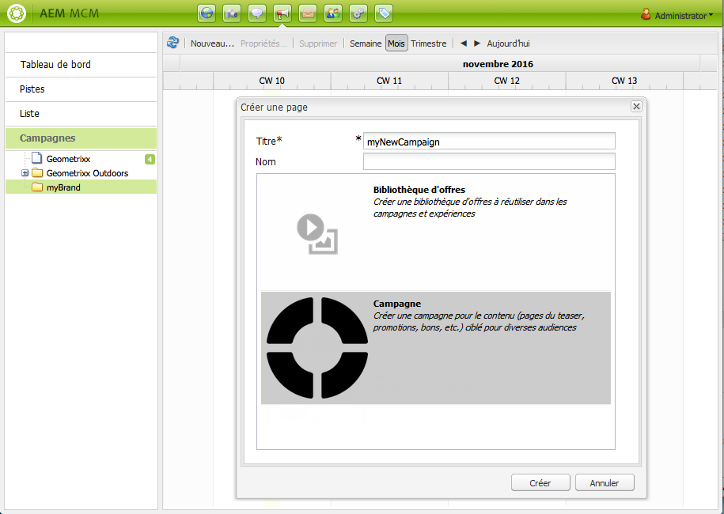

# Configuration d’une campagne{#setting-up-your-campaign}

La configuration d’une nouvelle campagne comprend les étapes (génériques) suivantes :

1. [Créez une marque](#creating-a-new-brand) pour héberger vos campagnes.
1. Le cas échéant, vous pouvez [définir les propriétés de votre nouvelle marque](#defining-the-properties-for-your-new-brand).
1. [Créez une campagne](#creating-a-new-campaign) où seront hébergées des expériences ; des pages de teaser ou une newsletter, par exemple.
1. Le cas échéant, vous pouvez [définir les propriétés de votre nouvelle campagne](#defining-the-properties-for-your-new-campaign).

Ensuite, en fonction du type d’expérience en cours de création, vous devrez [créer une expérience](#creating-a-new-experience). Les détails de l’expérience, ainsi que les actions consécutives à sa création, dépendent du type d’expérience à créer :

* Pour la création d’un teaser :

   1. [Créez une expérience de teaser](/help/sites-classic-ui-authoring/classic-personalization-campaigns.md#creatingateaserexperience).
   1. [Ajoutez du contenu à votre teaser](/help/sites-classic-ui-authoring/classic-personalization-campaigns.md#addingcontenttoyourteaser).
   1. [Créez un point de contact pour votre teaser](/help/sites-classic-ui-authoring/classic-personalization-campaigns.md#creatingatouchpointforyourteaser) (ajoutez votre teaser à une page de contenu).

* Pour la création d’une newsletter :

   1. [Créez une expérience de newsletter](/help/sites-classic-ui-authoring/classic-personalization-campaigns.md#creatinganewsletterexperience).
   1. [Ajoutez du contenu aux diapositives.](/help/sites-classic-ui-authoring/classic-personalization-campaigns.md#addingcontenttonewsletters)
   1. [Personnalisez la newsletter.](/help/sites-classic-ui-authoring/classic-personalization-campaigns.md#personalizingnewsletters)
   1. [Créez une page d’entrée attrayante pour la newsletter](/help/sites-classic-ui-authoring/classic-personalization-campaigns.md#settingupanewsletterlandingpage).
   1. [Envoyez la newsletter](/help/sites-classic-ui-authoring/classic-personalization-campaigns.md#sendingnewsletters) aux abonnés ou aux prospects.

* Pour la création d’une offre Adobe Target (anciennement Test &amp; Target) :

   1. [Créez une expérience d’offre Adobe Target](/help/sites-classic-ui-authoring/classic-personalization-campaigns.md#creatingatesttargetofferexperience).
   1. [Intégrez-la à Adobe Target](/help/sites-classic-ui-authoring/classic-personalization-campaigns.md#integratewithadobetesttarget)

>[!NOTE]
>
>Pour plus d’informations sur la définition de vos segments, voir [Segmentation](/help/sites-administering/campaign-segmentation.md).

## Création d’une marque {#creating-a-new-brand}

Pour créer une marque, procédez comme suit :

1. Ouvrez **MCM** et sélectionnez **Campagnes** dans le volet de gauche.

1. Sélectionnez **Nouveau...** pour saisir le **Titre** et le **Nom**, ainsi que le modèle à utiliser pour votre nouvelle marque :

   

1. Cliquez sur **Créer**. Votre nouvelle marque s’affiche alors dans MCM (avec une icône par défaut).

### Définition des propriétés de votre nouvelle marque {#defining-the-properties-for-your-new-brand}

1. A partir de **Campagnes**, dans le volet de gauche, sélectionnez l’icône de votre nouvelle marque dans le volet de droite, puis cliquez sur **Propriétés...**

   Vous pouvez saisir un **Titre**, une **Description** et une image à utiliser comme icône.

   

1. Cliquez sur **OK** pour enregistrer. 

### Création d’une campagne  {#creating-a-new-campaign}

Création d’une nouvelle campagne :

1. A partir de **Campagnes**, sélectionnez votre nouvelle campagne dans le volet de gauche ou double-cliquez sur l’icône dans le volet de droite.

   L’aperçu est affiché (il est vide s’il s’agit d’une nouvelle marque).

1. Cliquez sur **Nouveau...**, puis indiquez le **Titre**, le **Nom** et le modèle à utiliser pour votre nouvelle campagne.

   

1. Cliquez sur **Créer**. Votre campagne sera affichée dans le MCM.

### Définition des propriétés de votre nouvelle campagne  {#defining-the-properties-for-your-new-campaign}

Configurez les propriétés de campagne qui contrôlent le comportement :

* **Priorité :** priorité de la campagne par rapport aux autres campagnes. Si plusieurs campagnes sont en cours au même moment, la campagne présentant la priorité la plus élevée contrôle l’expérience des visiteurs.
* **Heure d’activation/de désactivation :** ces propriétés contrôlent le temps pendant lequel la campagne contrôle l’expérience des visiteurs. La propriété Heure d’activation contrôle le moment auquel la campagne commence à contrôler l’expérience, tandis que la propriété Heure de désactivation contrôle le moment où la campagne cesse de contrôler l’expérience.
* **Image :** image représentant la campagne dans AEM.
* **Services Cloud :** les configurations des services cloud auxquels la campagne est intégrée (voir [Intégration à Adobe Marketing Cloud](/help/sites-administering/marketing-cloud.md)).

* **Adobe Target :** propriétés qui permettent de configurer les campagnes qui sont intégrées à Adobe Target (voir [Intégration à Adobe Target](/help/sites-administering/target.md)).

1. Sous **Campagnes**, sélectionnez votre marque. Dans le volet de droite, sélectionnez votre campagne et cliquez sur **Propriétés**.

   Vous pouvez définir différentes propriétés, telles qu’un **Titre**, une **Description** et les **Services Cloud** de votre choix.

   

1. Cliquez sur **OK** pour enregistrer. 

### Création d’une expérience  {#creating-a-new-experience}

La procédure à suivre dépend du type d’expérience à créer :

* [Création d’un teaser](/help/sites-classic-ui-authoring/classic-personalization-campaigns.md#creatingateaser)
* [Création d’une newsletter](/help/sites-classic-ui-authoring/classic-personalization-campaigns.md#creatinganewsletter)
* [Création d’une offre Adobe Target](/help/sites-classic-ui-authoring/classic-personalization-campaigns.md#creatingatesttargetoffer)

>[!NOTE]
>
>Comme c’était le cas avec les versions précédentes, il est possible de créer une expérience en tant que page dans la console **Sites web** (de plus, toute page de ce type créée dans les versions antérieures est également prise en charge).
>
>Désormais, la méthode conseillée consiste à utiliser MCM pour créer des expériences.

### Configuration de votre nouvelle expérience  {#configuring-your-new-experience}

Après avoir créé le « squelette » de votre expérience, vous devez effectuer les actions suivantes, en fonction de son type :

* [Teaser](/help/sites-classic-ui-authoring/classic-personalization-campaigns.md#teasers):

   * [Connectez la page de teaser aux segments de visiteurs.](/help/sites-classic-ui-authoring/classic-personalization-campaigns.md#applyingasegmenttoyourteaser)
   * [Créez un point de contact pour votre teaser](/help/sites-classic-ui-authoring/classic-personalization-campaigns.md#creatingatouchpointforyourteaser) (ajoutez votre teaser à une page de contenu).

* [Newsletter](/help/sites-classic-ui-authoring/classic-personalization-campaigns.md#newsletters) :

   * [Ajoutez du contenu aux diapositives.](/help/sites-classic-ui-authoring/classic-personalization-campaigns.md#addingcontenttonewsletters)
   * [Personnalisez la newsletter.](/help/sites-classic-ui-authoring/classic-personalization-campaigns.md#personalizingnewsletters)
   * [Envoyez la newsletter](/help/sites-classic-ui-authoring/classic-personalization-campaigns.md#sendingnewsletters) aux abonnés ou aux prospects.
   * [Créez une page d’entrée attrayante pour la newsletter](/help/sites-classic-ui-authoring/classic-personalization-campaigns.md#settingupanewsletterlandingpage).

* [Offre Adobe Target](/help/sites-classic-ui-authoring/classic-personalization-campaigns.md#testtargetoffers) :

   * [Intégrez-la à Adobe Target](/help/sites-administering/target.md)

### Ajout d’un point de contact {#adding-a-new-touchpoint}

S’il existe déjà des expériences, vous pouvez ajouter directement un point de contact à partir de la vue Calendrier de MCM :

1. Sélectionnez la vue Calendrier de votre campagne.

1. Cliquez sur **Ajouter un point de contact...** pour ouvrir la boîte de dialogue. Précisez l’expérience que vous souhaitez ajouter :

   

1. Cliquez sur **OK** pour enregistrer.

## Utilisation de pistes {#working-with-leads}

>[!NOTE]
>
>Adobe ne prévoit pas d’optimiser cette fonctionnalité (gestion des pistes).
> Il est conseillé d’[utiliser Adobe Campaign et l’intégration à AEM](/help/sites-administering/campaign.md). 

Dans AEM MCM, vous pouvez organiser et ajouter des pistes en les saisissant manuellement ou en important une liste de valeurs séparées par des virgules ; une liste de distribution, par exemple. Pour générer des pistes, il existe d’autres méthodes comme les abonnements aux newsletters ou les inscriptions aux communautés (s’ils sont configurés de la sorte, ils peuvent déclencher un workflow pour renseigner les pistes).

Les pistes sont généralement classées et répertoriées dans une liste pour vous permettre ultérieurement d’effectuer des actions sur la liste entière ; par exemple, envoyer un courrier électronique personnalisé à une certaine liste.

Dans le tableau de bord, vous avez accès à toutes les pistes en cliquant sur **Pistes** dans le volet de gauche. Vous pouvez également accéder à des pistes à partir du volet **Listes**.

>[!NOTE]
>
>Pour ajouter ou modifier les avatars des utilisateurs, ouvrez Clickstream Cloud (Ctrl+Alt+c), chargez le profil, puis cliquez sur **Modifier**.

### Création de pistes  {#creating-new-leads}

Une fois les nouvelles pistes créées, assurez-vous de [les activer](#activating-or-deactivating-leads) pour pouvoir suivre leur activité sur l’instance de publication et personnaliser leur expérience.

Création manuelle d’une piste :

1. Dans AEM, accédez à MCM. Dans le tableau de bord, cliquez sur **Pistes**.
1. Cliquez sur **Nouveau**. La fenêtre **Créer** s’ouvre.

   

1. Saisissez les informations dans les champs, si nécessaire. Cliquez sur l’onglet **Adresse**.

   

1. Saisissez les informations de l’adresse, si nécessaire. Cliquez sur **Enregistrer** pour enregistrer la piste. Si vous avez besoin d’ajouter des pistes supplémentaires, cliquez sur **Enregistrer et nouveau**.

   La nouvelle piste s’affiche dans le volet Pistes. Lorsque vous cliquez sur l’entrée, toutes les informations saisies s’affichent dans le volet de droite. Une fois une piste créée, vous pouvez l’ajouter à une liste.

   

### Activation ou désactivation de pistes {#activating-or-deactivating-leads}

Le fait d’activer les pistes permet de mieux suivre leur activité sur l’instance de publication et de personnaliser leur expérience. Lorsque vous ne souhaitez plus suivre leur activité, vous pouvez les désactiver.

Activation et désactivation de pistes :

1. Dans AEM, accédez à MCM et cliquez sur **Pistes**.

1. Sélectionnez les pistes à activer ou désactiver et cliquez sur **Activer** ou **Désactiver**.

   

   À l’instar des pages AEM, l’état de publication est indiqué dans la colonne **Publié**.

   

### Importation de nouvelles pistes {#importing-new-leads}

Lorsque vous importez de nouvelles pistes, vous pouvez les ajouter automatiquement à une liste existante ou créer une nouvelle liste pour les inclure.

Importation de pistes à partir d’une liste de valeurs séparées par des virgules :

1. Dans AEM, accédez à MCM et cliquez sur **Pistes**.

   >[!NOTE]
   >
   >Vous pouvez également importer des pistes grâce à l’une des méthodes suivantes :
   >
   >
   >
   >    * Dans le tableau de bord, cliquez sur **Importer les pistes** dans le volet **Listes**.
      >
      >    
   * Cliquez sur **Listes** et dans le menu **Outils**, sélectionnez **Importer les pistes**.

1. Dans le menu **Outils**, sélectionnez **Importer** **les pistes**.

1. Saisissez les informations comme décrit dans la section Données d’échantillon. Les champs suivants peuvent être importés : email,familyName,givenName,gender,aboutMe,city,country,phoneNumber,postalCode,region,streetAddress.

   >[!NOTE]
   >
   >La première ligne de la liste CSV contient des étiquettes dont la formulation doit être parfaitement identique à l’exemple ci-dessous :
   >
   >
   >`email,givenName,familyName` - s&#39;il est écrit comme  `givenname`par exemple, le système ne le reconnaîtra pas.

   

1. Cliquez sur **Suivant**. Ici, vous affichez un aperçu des pistes pour vérifier qu’elles sont exactes.

   

1. Cliquez sur **Suivant**. Sélectionnez la liste à laquelle doivent appartenir les pistes. Si vous ne souhaitez pas qu’elles appartiennent à une liste, supprimez les informations dans le champ. Par défaut, AEM crée un nom de liste qui inclut la date et l’heure. Cliquez sur **Importer**.

   

   La nouvelle piste s’affiche dans le volet Pistes. Lorsque vous cliquez sur l’entrée, toutes les informations saisies s’affichent dans le volet de droite. Une fois une piste créée, vous pouvez l’ajouter à une liste.

### Ajout de pistes à des listes  {#adding-leads-to-lists}

Ajout de pistes à des listes préexistantes :

1. Dans le MCM, cliquez sur **Pistes** pour afficher l’ensemble des pistes disponibles.

1. Sélectionnez les pistes à ajouter à une liste en cochant la case en regard de la piste. Vous pouvez ajouter autant de pistes que vous le souhaitez.

   

1. Dans le menu **Outils**, sélectionnez **Ajouter à la liste.** La fenêtre **Ajouter à la liste** s’ouvre.

   

1. Sélectionnez la liste à laquelle vous souhaitez ajouter les pistes, puis cliquez sur **OK**. Les pistes sont ajoutées aux listes appropriées.

### Affichage des informations de piste  {#viewing-lead-information}

Pour afficher les informations de piste, dans le MCM, cochez la case en regard de la piste ; un volet droit s’affiche, indiquant toutes les informations de piste, y compris les affiliations aux listes.

### Modification de pistes existantes {#modifying-existing-leads}

Modification des informations de pistes existantes :

1. Dans le MCM, cliquez sur **Pistes**. Dans la liste des pistes, cochez la case en regard de la piste à modifier. Toutes les informations de piste s’affichent dans le volet de droite.

   

   >[!NOTE]
   >
   >Vous ne pouvez modifier qu’une seule piste à la fois. Pour modifier des pistes qui font partie d’une même liste, vous pouvez modifier la liste à la place.

1. Cliquez sur **Modifier**. La fenêtre **Modifier la piste** s’ouvre.

   

1. Effectuez les modifications nécessaires, puis cliquez sur **Enregistrer** pour les enregistrer.

   >[!NOTE]
   >
   >Pour modifier l’avatar de piste, accédez au profil des utilisateurs. Vous pouvez charger le profil dans Clickstream Cloud en appuyant sur CTRL+ALT+c, en cliquant sur **Charger**, puis en sélectionnant le profil.

### Suppression de pistes existantes  {#deleting-existing-leads}

Pour supprimer une piste existante dans la console MCM, cochez la case en regard de celle-ci, puis cliquez sur **Supprimer**. La piste est supprimée de la liste de pistes et de toutes les listes associées.

>[!NOTE]
>
>Avant la suppression, AEM confirme que vous souhaitez supprimer la piste existante. Une fois supprimé, il ne peut pas être récupéré.

## Utilisation de listes  {#working-with-lists}

>[!NOTE]
>
>Adobe ne prévoit pas d’optimiser cette fonctionnalité (gestion des listes).
> Il est conseillé d’[utiliser Adobe Campaign et l’intégration à AEM](/help/sites-administering/campaign.md). 

Les listes vous permettent d’organiser vos pistes en groupes. Elles vous offrent la possibilité de cibler vos campagnes marketing sur un groupe de personnes de votre choix ; vous pouvez, par exemple, adresser une newsletter ciblée à une liste. Les listes sont visibles dans le MCM, dans le tableau de bord ou en cliquant sur **Listes**. Les deux techniques vous fournissent le nom de la liste et le nombre de membres.

Si vous cliquez sur **Listes**, vous pouvez également voir si la liste est membre d’une autre liste et afficher une description.

### Création de listes {#creating-new-lists}

Création d’une nouvelle liste (groupe) :

1. Dans le tableau de bord du MCM, cliquez sur **Nouvelle liste...** ou dans **Listes**, cliquez sur **Nouveau** ... La fenêtre Créer une liste s’ouvre.

   

1. Saisissez un nom (obligatoire) et, si vous le souhaitez, une description, puis cliquez sur **Enregistrer**. La liste s’affiche dans le volet **Listes**.

   

### Modification de listes existantes {#modifying-existing-lists}

Modification d’une liste existante :

1. Dans le MCM, cliquez sur **Listes**.

1. Depuis la liste, cochez la case en regard de la liste à modifier et cliquez sur **Modifier**. La fenêtre **Modifier la liste** s’ouvre.

   

   >[!NOTE]
   >
   >Vous ne pouvez modifier qu’une seule liste à la fois.

1. Effectuez les modifications selon les besoins, puis cliquez sur **Enregistrer** pour les enregistrer.

### Suppression de listes existantes  {#deleting-existing-lists}

Pour supprimer des listes existantes, dans le MCM, cochez la case en regard de la liste et cliquez sur **Supprimer**. La liste est supprimée. Les pistes qui étaient affiliées à la liste ne sont pas supprimées : seule l’affiliation à la liste est supprimée.

>[!NOTE]
>
>Avant la suppression, AEM confirme que vous souhaitez supprimer les listes existantes. Une fois supprimé, il ne peut pas être récupéré.

### Fusion de listes  {#merging-lists}

Vous pouvez fusionner une liste existante avec une autre. La liste que vous fusionnez devient alors membre de l’autre liste. Elle existe toujours en tant qu’entité distincte et ne doit pas être supprimée.

Vous pouvez fusionner des listes si une même conférence a lieu à deux endroits distincts et que vous souhaitez les fusionner en une liste de participants à toutes les conférences.

Fusion de listes existantes :

1. Dans le MCM, cliquez sur **Listes**.

1. Sélectionnez la liste à fusionner à une autre liste en cochant sa case.

1. Dans le menu **Outils**, sélectionnez **Fusionner les listes**.

   >[!NOTE]
   >
   >Vous ne pouvez fusionner qu’une seule liste à la fois.

1. Dans la fenêtre **Fusionner les listes**, sélectionnez la liste à fusionner et cliquez sur **OK**.

   

   La liste que vous fusionnez doit augmenter d’un membre. Pour vérifier que votre liste est fusionnée, sélectionnez la liste que vous avez fusionnée et, dans le menu **Outils**, sélectionnez **Afficher les pistes**.

1. Répétez l’étape pour fusionner toutes les listes de votre choix.

   

>[!NOTE]
>
>La procédure pour supprimer une liste fusionnée de son appartenance est identique à la procédure pour supprimer une piste d’une liste. Ouvrez l’onglet **Listes**, sélectionnez la liste qui inclut la liste fusionnée et supprimez l’appartenance en cliquant sur le cercle rouge en regard de la liste.

### Affichage de pistes dans des listes  {#viewing-leads-in-lists}

A tout moment, vous pouvez afficher les pistes qui appartiennent à une liste spécifique soit en navigant, soit en recherchant les membres.

Affichage des pistes qui appartiennent à une liste :

1. Dans le MCM, cliquez sur **Listes**.

1. Cochez la case en regard de la liste dont vous souhaitez afficher les membres.

1. Dans le menu **Outils**, sélectionnez **Afficher les pistes**. AEM affiche les pistes qui sont membres de cette liste. Vous pouvez parcourir la liste ou rechercher les membres.

   >[!NOTE]
   >
   >En outre, vous pouvez supprimer les pistes d’une liste en les sélectionnant, puis en cliquant sur **Supprimer l’appartenance**.

   

1. Cliquez sur **Fermer** pour revenir au MCM.
