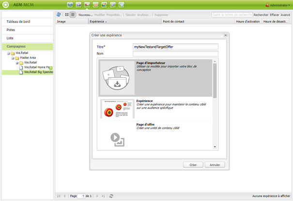

# Offres Target{#target-offers}

## Création d’une expérience Offre Test&amp;Target {#creating-a-test-target-offer-experience}

1. Sélectionnez votre nouvelle campagne dans le volet de gauche ou double-cliquez sur celle-ci dans le volet de droite.
1. Sélectionnez le mode Liste à l’aide de l’icône :

   

1. Cliquez sur **Nouveau ...**
1. You can specify the **Title**, **Name** and type of experience to be created; in this case, Test&amp;Target Offer.

   

1. Cliquez sur **Créer**.

   >[!NOTE]
   >
   >Les expériences Test&amp;Target ne sont actuellement pas répertoriées dans MCM. Elles sont accessibles à partir de la console **Sites Web**, sous Campagnes.

## Intégration à Adobe Target {#integrating-with-adobe-target}

See [Integrate with Adobe](/help/sites-administering/target.md) [Target](/help/sites-administering/target.md) for full details.
