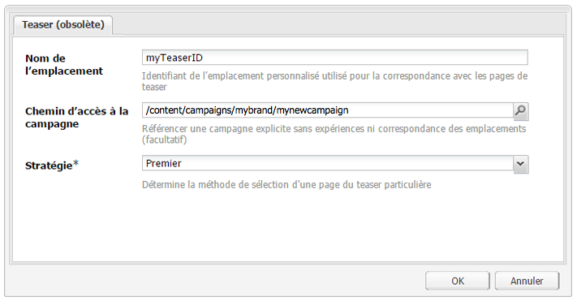
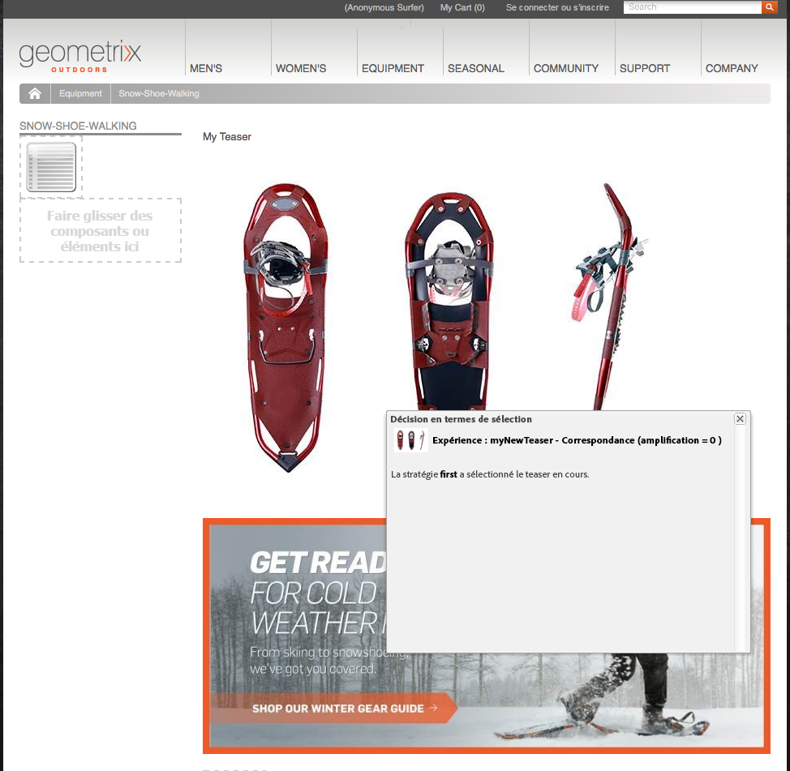
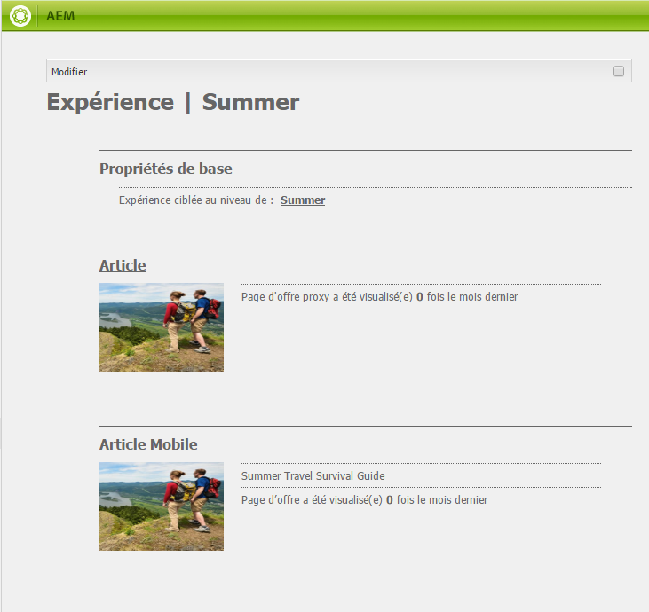

# Teasers et stratégies{#teasers-and-strategies}

Les campagnes se servent souvent des teasers comme d’un mécanisme pour inciter un segment spécifique de visiteurs à consulter du contenu centré sur leurs intérêts. Un ou plusieurs teasers sont définis pour une campagne spécifique.

>[!NOTE]
>
>Le composant Teaser est obsolète dans AEM 6.2. Utilisez le [composant Cible](/help/sites-authoring/content-targeting-touch.md) à la place.

* **Les pages** de marque sont stockées dans la section Campagnes du site Web. Une marque contient les différentes campagnes.
* **Les pages** Campaign sont stockées dans la section Campagnes du site Web. Chaque campagne possède une page individuelle, où sont conservées les définitions de teaser. La page de conteneur ou d’aperçu présente également certaines informations et statistiques concernant les pages de teaser individuelles.

Dans AEM, les teasers sont constitués de plusieurs parties :

* **Les pages** de teaser sont stockées sous la page de campagne appropriée et contiennent les définitions des paragraphes de teaser disponibles pour chaque campagne spécifique. Ces définitions sont utilisées lors de l’affichage des paragraphes de teaser ; y compris les variations de contenu, le segment à utiliser pour la sélection d’une variation et du facteur d’amplification.
* Le **composant de teaser** est disponible prêt à l’emploi et vous permet de créer une instance de votre paragraphe de teaser spécifique dans une page de contenu. Vous pouvez faire glisser le composant de teaser depuis le sidekick, puis spécifier votre définition de teaser pour créer votre propre paragraphe de teaser. **Remarque :** Le composant Teaser a été abandonné dans AEM 6.2. Utilisez plutôt le composant  Cible.
* Les **paragraphes de teaser** sont de véritables instances de votre teaser au sein d’une page de contenu. Ceux-ci incitent un segment de visiteurs à consulter du contenu centré sur leurs intérêts.
* Les pages qui présentent le contenu de la campagne centré sur un segment de visiteurs spécifique. Généralement, les paragraphes de teaser dirigent le visiteur jusqu’à des pages de ce type.

## Stratégies {#strategies}

When adding a teaser paragraph to a page you need to define the **Strategy**.

C’est pour le cas où plusieurs teasers sont disponibles pour être sélectionnés alors que leurs segments affectés sont tous résolus avec succès. La **stratégie** indique alors un critère supplémentaire utilisé pour sélectionner le teaser affiché :

* **Score Clickstream** est basé sur les balises et les accès aux balises associés conservés dans le ClientContext du visiteur (indique la fréquence à laquelle un visiteur clique sur les pages contenant la balise respective). Les taux de fréquence d’accès aux balises définis sur la page de teaser sont comparés.
* **Aléatoire**, pour la sélection &quot;aléatoire&quot;; utilise le facteur aléatoire généré pour une page, ce qui est visible avec le contexte client.
* **Premier** dans la liste des segments résolus. L’ordre est celui des teasers dans la page conteneur de campagne.

The [Boost Factor](/help/sites-administering/campaign-segmentation.md#boost-factor) of the segment also has an impact on the selection. Il s’agit d’un facteur de pondération ajouté à une définition de segment pour augmenter ou réduire la possibilité relative qu’elle soit sélectionnée.

Le worfklow et les interrelations des divers critères de sélection sont mieux illustrés par un exemple (une méthode qui peut également être utilisée pour assurer que vos teasers atteignent le public requis).

Si les segments suivants sont déjà créés et que leur facteur d’amplification respectif leur a déjà été affecté :

| Segment | Facteur d’amplification |
|---|---|
| S1 | 0 |
| S2 | 0 |
| S3 | 10 |
| S4 | 30 |
| S5 | 0 |
| S6 | 100 |

Et nous utilisons les définitions de teaser suivantes :

<table>
 <tbody>
  <tr>
   <td>Campagne</td>
   <td>Teaser</td>
   <td>Segments affectés</td>
   <td>Balises attribuées </td>
  </tr>
  <tr>
   <td>C1</td>
   <td>T1</td>
   <td>S1, S2</td>
   <td>Commerce, Marketing</td>
  </tr>
  <tr>
   <td>C1</td>
   <td>T2 </td>
   <td>S1</td>
   <td>  </td>
  </tr>
  <tr>
   <td>C1 </td>
   <td>T3</td>
   <td>S3, S4</td>
   <td>  </td>
  </tr>
  <tr>
   <td>C1 </td>
   <td>T4</td>
   <td>S2, S5</td>
   <td>  </td>
  </tr>
  <tr>
   <td>C1 </td>
   <td>T5</td>
   <td>S1, S2, S6</td>
   <td>Marketing</td>
  </tr>
  <tr>
   <td>C1 </td>
   <td>T6</td>
   <td>S6</td>
   <td>Commerce  </td>
  </tr>
 </tbody>
</table>

Ensuite, si nous appliquons ceci à un visiteur quand :

* **Résolution de S1**, **S2** et **S6** réussie

* la balise **marketing** est accédée 3 fois
* la balise **commerce** est accédée 6 fois

Nous pouvons afficher les résultats suivants :

* correspondance réussie - l’un des segments affectés au teaser a-t-il été résolu avec succès pour le visiteur en cours ?
* facteur d’amplification - le facteur d’amplification le plus élevé de tous les segments applicables
* Clickstream Score - le total cumulatif de tous les accès aux balises applicables

qui sont calculés avant d’appliquer la stratégie appropriée :

<table>
 <tbody>
  <tr>
   <td>Campagne</td>
   <td>Teaser</td>
   <td>Segments affectés</td>
   <td>Balises </td>
   <td>Correspondance réussie ?</td>
   <td>Facteur d’amplification résultant</td>
   <td>Clickstream Score résultant </td>
  </tr>
  <tr>
   <td>C1</td>
   <td>T1</td>
   <td>S1, S2</td>
   <td>Commerce, Marketing</td>
   <td>Oui</td>
   <td>0</td>
   <td>9</td>
  </tr>
  <tr>
   <td>C1</td>
   <td>T2 </td>
   <td>S1</td>
   <td>  </td>
   <td>Oui</td>
   <td>0</td>
   <td>  </td>
  </tr>
  <tr>
   <td>C1 </td>
   <td>T3</td>
   <td>S3, S4</td>
   <td>  </td>
   <td>Non</td>
   <td>  </td>
   <td>  </td>
  </tr>
  <tr>
   <td>C1 </td>
   <td>T4</td>
   <td>S2, S5</td>
   <td>  </td>
   <td>Oui  </td>
   <td>0  </td>
   <td>  </td>
  </tr>
  <tr>
   <td>C1 </td>
   <td>T5</td>
   <td>S1, S2, S6</td>
   <td>Marketing</td>
   <td>Oui</td>
   <td>100</td>
   <td>3</td>
  </tr>
  <tr>
   <td>C1 </td>
   <td>T6</td>
   <td>S6</td>
   <td>Commerce</td>
   <td>Oui</td>
   <td>100</td>
   <td>6 </td>
  </tr>
 </tbody>
</table>

Ces valeurs sont utilisées pour déterminer le ou les teasers que le visiteur affiche, selon la **stratégie** appliquée au paragraphe de teaser :

<table>
 <tbody>
  <tr>
   <td>Stratégie</td>
   <td>Teaser résultant</td>
   <td>Commentaires</td>
  </tr>
  <tr>
   <td>Première</td>
   <td>T5</td>
   <td>Seuls T5 et T6 sont considérés comme ayant tous leurs segments résolus <i>et</i> ils possèdent le facteur d’amplification le plus élevé. La liste renvoyée est dans l’ordre T5, T6 ; T5 est ainsi sélectionné et affiché.</td>
  </tr>
  <tr>
   <td>Aléatoire</td>
   <td>T5 ou T6</td>
   <td>Les deux teasers ont des segments qui sont tous résolus et le même facteur d’amplification. Par conséquent, les deux teasers sont affichés en proportions égales.</td>
  </tr>
  <tr>
   <td>Clickstream Score</td>
   <td>T6</td>
   <td>
Les segments pour T1, T4, T5 et T6 sont tous résolus pour le visiteur. Les facteurs d’amplification plus élevés de T5 et T6 excluent ensuite T1 et T4. Finalement, le Clickstream Score plus élevé de T6 a pour résultat la sélection de T6.
 </td>
  </tr>
 </tbody>
</table>

>[!NOTE]
>
>Si, après les techniques de résolution ci-dessus, plusieurs teasers sont disponibles pour être sélectionnés, une sélection interne (aléatoire) sélectionne un seul teaser pour l’affichage.
>
>Par exemple, si la stratégie est Clickstream Score et T5 a le même Clickstream Score que T6 (c’est-à-dire 6 au lieu de 3), alors la sélection interne (aléatoire) est utilisée pour sélectionner l’un des deux.

Les paragraphes / pages de teaser sont utilisés pour diriger des segments de visiteurs spécifiques vers le contenu qui est centré sur leurs intérêts. Ils peuvent présenter toute une gamme d’options parmi lesquelles le visiteur peut faire son choix ou montrer un seul paragraphe de teaser, selon le segment de visiteurs spécifique ; par exemple, le paragraphe de teaser indiqué peut être fonction de l’âge du visiteur.

Typiquement, une page de teaser est une action temporaire qui dure pour une période spécifique, jusqu’à son remplacement par la page de teaser suivante.

Après avoir créé votre marque et votre campagne, vous pouvez créer et configurer votre expérience de teaser.

### Création d’un point de contact pour votre teaser {#creating-a-touchpoint-for-your-teaser}

>[!NOTE]
>
>Le composant Teaser est obsolète dans AEM 6.2. Utilisez le [composant Cible](/help/sites-authoring/content-targeting-touch.md) à la place.

1. Accédez à la page de contenu où vous souhaitez placer le paragraphe du teaser qui conduira à votre page de campagne.
1. Ajoutez un composant **Teaser** (disponible dans la section **Personnalisation** de sidekick) dans l’emplacement requis. Lors de la configuration initiale, il indique que le chemin d’accès à la campagne n’est pas encore configuré :

   

1. Modifiez le composant teaser pour ajouter :

   * **Chemin d’accès à la campagne**
Le chemin d’accès à la page de campagne qui comprend la page de teaser individuelle ; les segments déterminent exactement le teaser affiché.

   * **[Stratégie](/help/sites-classic-ui-authoring/classic-personalization-campaigns.md#strategies)** Méthode utilisée pour la sélection lorsque plusieurs segments sont résolus avec succès.
   

1. Cliquez sur **OK** pour enregistrer. Le contenu approprié s’affiche en fonction des segments que vous avez définis sur le teaser et du profil de l’utilisateur avec lequel vous vous êtes connecté :

   

1. Survolez le paragraphe du teaser avec le pointeur de votre souris pour faire apparaître l’icône en forme de point d’interrogation (dans le coin inférieur droit du composant). Cliquez sur cette icône pour afficher les segments appliqués et savoir s’ils sont actuellement résolus.

   

### Aperçu du teaser {#teaser-overview}

A l’instar de la vue de campagne dans MCM, la page de campagne fournit des informations sur les teasers auxquels elle est connectée :

1. Ouvrez la page de campagne à partir de la console **Sites Web**, par exemple :

   `https://localhost:4502/content/campaigns/geometrixx-outdoors/storefront/summer.html`

   Vous accédez alors à un aperçu de la définition du teaser et des statistiques de visionnage :

   
