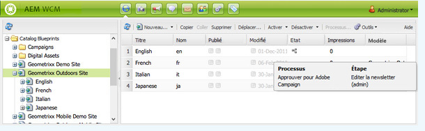

# Application de workflows aux pages  {#applying-workflows-to-pages}

Lorsque vous appliquez le workflow, vous spécifiez les informations suivantes :

* Workflow à appliquer.

   Vous pouvez appliquer n’importe quel workflow (auquel vous avez accès, selon les affectations réalisées par votre administrateur AEM).
* Si vous le souhaitez :

   * Un commentaire qui fournit des informations sur la raison pour laquelle vous avez commencé le workflow.
   * Un titre qui permet d’identifier l’instance de workflow dans la boîte de réception d’un utilisateur.

>[!NOTE]
>
>Les administrateurs AEM peuvent commencer des workflows à l’aide de [plusieurs autres méthodes](/help/sites-administering/workflows-starting.md).

## Application de workflows {#applying-workflows}

Les workflows peuvent être démarrés à partir de la console Sites web ou, lors de la modification d’une page, à partir du sidekick.

The **Status** column in the **Websites** console indicates whether a workflow has been applied to a page:

### Démarrage d’un workflow à partir de la console Sites web {#starting-a-workflow-from-the-websites-console}

1. Ouvrez la console Sites web. ([http://localhost:4502/siteadmin](http://localhost:4502/siteadmin))
1. Dans l’arborescence Sites web, sélectionnez le parent de la page à laquelle vous souhaitez appliquer le workflow.
1. Dans la liste de pages, sélectionnez la page, puis cliquez sur Worfklow.
1. Dans la boîte de dialogue Démarrer le workflow, sélectionnez le workflow à appliquer. Si vous le souhaitez, entrez un commentaire et un titre. Cliquez ensuite sur Démarrer.

### Démarrage d’un workflow à partir du sidekick {#starting-a-workflow-using-sidekick}

1. Ouvrez la console Sites web.
1. Ouvrez la page requise.
1. Sélectionnez l’onglet Worfklow dans le sidekick.
1. Expand the **Workflow** dialog, allowing you to select the **Workflow** and optionally enter **Workflow Title** and **Comment**.

   

1. Cliquez sur **Démarrer le workflow** pour démarrer une nouvelle instance de workflow avec les propriétés que vous avez configurées et la page actuelle comme charge utile. Le workflow s’exécute à présent.

