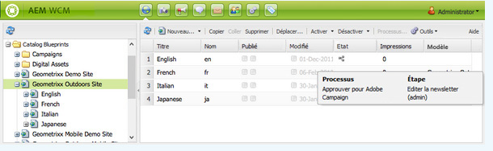
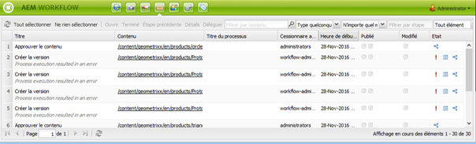
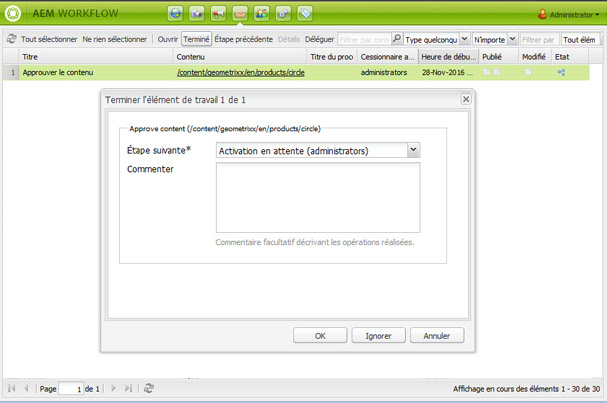
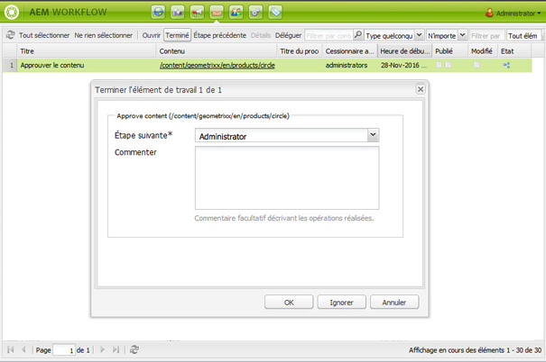
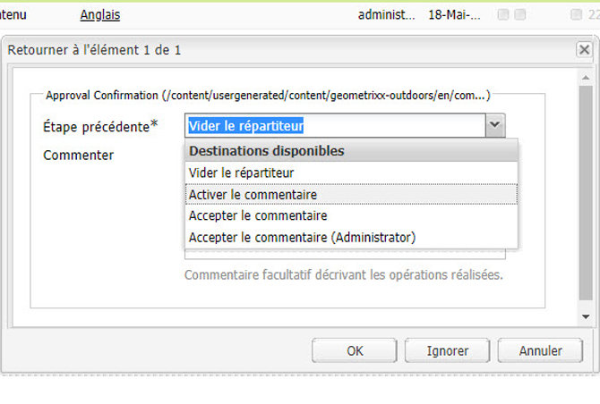

# Participation aux workflows{#participating-in-workflows}

Les workflows incluent généralement les étapes qu’une personne doit suivre pour réaliser une activité sur une page ou sur une ressource. Le workflow sélectionne un utilisateur ou un groupe pour qu’il mette en œuvre l’activité en question et attribue un élément de travail à cette personne ou à ce groupe.

## Traitement d’éléments de travail {#processing-your-work-items}

Vous pouvez effectuer les actions suivantes pour traiter un élément de travail :

* **Terminé**

   Vous pouvez terminer un élément pour permettre au workflow de passer à l’étape suivante.

* **Déléguer**

   Si une étape vous a été affectée, mais que pour une raison quelconque, vous ne pouvez pas vous en charger, vous pouvez la déléguer à un autre utilisateur ou groupe.

   Les utilisateurs à qui vous pouvez déléguer une étape dépendent de la personne à qui l’élément de travail a été attribué :

   * Si l’élément de travail a été attribué à un groupe, les membres du groupe sont disponibles.
   * Si l’élément de travail a été attribué à un groupe puis délégué à un utilisateur, les membres du groupe et le groupe sont disponibles.
   * Si l’élément de travail a été attribué à un utilisateur unique, l’élément de travail ne peut pas être délégué.

* **Étape précédente**

   Si vous vous rendez compte qu’une étape ou qu’une série d’étapes doit être répétée, vous pouvez revenir en arrière. Cela vous permet de sélectionner une étape qui s’est produite plus tôt dans le workflow pour la traiter à nouveau. Le workflow retourne à l’étape spécifiée et poursuit à partir de là.

## Participation aux workflows {#participating-in-a-workflow}

### Notifications d’actions de workflow attribués {#notifications-of-assigned-workflow-actions}

Lorsqu’une tâche vous est attribuée (par exemple, **Approuver le contenu**), diverses alertes et/ou notifications s’affichent :

* La colonne **État** de la console Sites web indique quand une page fait partie d’un workflow :

   

* Lorsque vous ou un groupe auquel vous appartenez vous voyez attribuer un élément de travail dans le cadre d’un workflow, l’élément de travail apparaît dans votre boîte de réception Worfklow AEM.

   

### Réalisation d’une étape de participant {#completing-a-participant-step}

Lorsque vous avez suivi l’étape qui vous a été attribuée, vous pouvez finaliser l’élément de travail, ce qui permet au workflow de se poursuivre. Procédez comme suit pour finaliser l’élément de travail.

1. Sélectionnez l’étape du workflow et cliquez sur **Terminé** dans la barre de navigation supérieure.
1. Dans la boîte de dialogue qui s’ouvre, sélectionnez **Étape suivante**, c’est-à-dire l’étape à exécuter par la suite. Une liste déroulante affiche toutes les destinations correspondantes. Un **commentaire** peut également être rédigé.

   

   Le nombre d’étapes indiqué dépend de la structure du modèle de workflow.

1. Cliquez sur **OK** pour confirmer l’action.

### Délégation d’une étape de participant    {#delegating-a-participant-step}

Procédez comme suit pour déléguer un élément de travail.

1. Cliquez sur le bouton **Déléguer** dans la barre de navigation supérieure.
1. Dans la boîte de dialogue, utilisez la liste déroulante pour sélectionner **l’utilisateur** auquel vous souhaitez déléguer l’élément de travail. Vous pouvez également rédiger un **commentaire**.

   

1. Cliquez sur **OK** pour confirmer l’action.

### Revenir d’une étape de participant en arrière {#performing-step-back-on-a-participant-step}

Procédez comme suit pour revenir en arrière.

1. Cliquez sur le bouton Revenir en arrière dans la barre de navigation supérieure.
1. Dans la boîte de dialogue qui s’ouvre, sélectionnez l’étape précédente, c’est-à-dire l’étape à exécuter par la suite, même s’il s’agit d’une étape qui se produit plus tôt dans le workflow. Une liste déroulante affiche toutes les destinations correspondantes.

   

1. Cliquez sur OK pour confirmer l’action.

