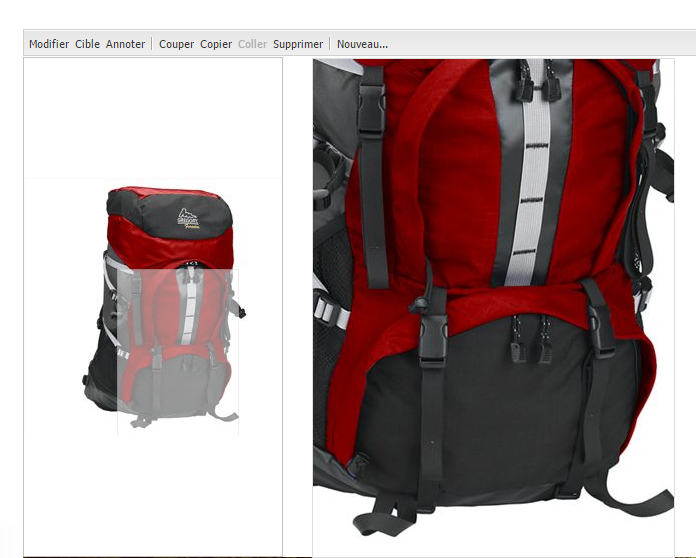

# Ajout de ressources Dynamic Media aux pages{#adding-dynamic-media-assets-to-pages}

To add the Dynamic Media functionality to assets you use on your websites, you can add the **[!UICONTROL Dynamic Media]** or **[!UICONTROL Interactive Media]** component directly on the page. You do this by entering [!UICONTROL Design] mode and enabling the dynamic media components. Vous pouvez ensuite ajouter ces composants à la page et ajouter des ressources au composant. Les composants Dynamic Media et Interactive Media sont dynamiques : ils détectent si vous ajoutez une image ou une vidéo et les options disponibles changent en conséquence.

Vous pouvez ajouter directement des ressources multimédias dynamiques à la page si vous utilisez AEM en tant que WCM.

>[!NOTE]
>
>Les zones cliquables sont disponibles et prêtes à l’emploi pour les bannières de carrousel.

## Ajout d’un composant Dynamic Media à une page  {#adding-a-dynamic-media-component-to-a-page}

Adding the [!UICONTROL Dynamic Media] or [!UICONTROL Interactive Media] component to a page is the same as adding a component to any page. The [!UICONTROL Dynamic Media] and [!UICONTROL Interactive Media] components are described in detail in the following sections.

Pour ajouter un composant/une visionneuse Dynamic Media à une page, procédez comme suit :

1. Dans AEM, ouvrez la page où vous souhaitez ajouter le composant Dynamic Media.
1. If no Dynamic Media component is available, click the ruler in the [!UICONTROL Sidekick] to enter **[!UICONTROL Design]** mode, click **[!UICONTROL Edit]** parsys, and select **[!UICONTROL Dynamic Media]** to make the Dynamic Media components available.

   >[!NOTE]
   >
   >Pour plus d’informations, voir [Configuration des composants en mode Création](/help/sites-authoring/default-components-designmode.md).

1. Return to **[!UICONTROL Edit]** mode by clicking the pencil icon in the [!UICONTROL Sidekick].
1. Drag the **[!UICONTROL Dynamic Media]** or **[!UICONTROL Interactive Media]** component from the **[!UICONTROL Other]** group in the sidekick onto the page in the desired location.
1. Cliquez sur l’icône **[!UICONTROL Modifier]** pour ouvrir le composant.
1. Modifiez le composant comme requis et cliquez sur **[!UICONTROL OK]** pour enregistrer les modifications.

## Composants Dynamic Media {#dynamic-media-components}

[!UICONTROL Dynamic Media] et [!UICONTROL Interactive Media] sont disponibles dans le [!UICONTROL Sidekick] sous **[!UICONTROL Dynamic Media.]** Vous utilisez le composant **[!UICONTROL Interactive Media]** pour toutes les ressources interactives telles que du contenu vidéo interactif, des images interactives ou des ensembles de carrousels. Pour tous les autres composants Dynamic Media, utilisez le composant **[!UICONTROL Dynamic Media]**.

>[!NOTE]
>
>Ces composants ne sont pas disponibles par défaut et doivent être sélectionnés en mode Conception avant leur utilisation. [Une fois les composants disponibles en mode Conception](/help/sites-authoring/default-components-designmode.md), vous pouvez les ajouter à votre page comme vous le feriez avec tout autre composant AEM.

### Composant Dynamic Media {#dynamic-media-component}

Le composant Dynamic Media est intelligent ; selon que vous ajoutez une image ou une vidéo, vous disposez de différentes options. Le composant prend en charge les paramètres d’image prédéfinis, ainsi que les visionneuses d’images telles que les visionneuses d’images, les visionneuses à 360°, les visionneuses de médias mixtes et le contenu vidéo. En outre, le lecteur est réactif. Autrement dit, la taille de l’écran change automatiquement en fonction de la taille de l’écran. Toutes les visionneuses sont des visionneuses HTML5.

>[!NOTE]
>
>When you add the [!UICONTROL Dynamic Media] component, and **[!UICONTROL Dynamic Media Settings]** is blank or you cannot add an asset properly, check the following:
>
>* Vous avez [activé Dynamic Media](/help/assets/config-dynamic.md). Par défaut, ce module complémentaire est désactivé.
>* L’image possède un fichier pyramid tiff. Les images importées avant l’activation de Dynamic Media ne possèdent pas de fichier pyramid tiff.

>

#### En cas d’utilisation d’images  {#when-working-with-images}

The [!UICONTROL Dynamic Media] component lets you add dynamic images, including image sets, spin sets, and mixed media sets. Vous pouvez effectuer un zoom avant et arrière, faire pivoter une image dans une visionneuse à 360° ou sélectionner une image dans un autre type de visionneuse.

Vous pouvez également configurer directement dans le composant les paramètres prédéfinis de la visionneuse ou de l’image ou le format de l’image. Pour rendre une image réactive, vous pouvez définir les points d’arrêt ou appliquer un paramètre prédéfini d’image réactive.

You can edit the following Dynamic Media settings by clicking **[!UICONTROL Edit]** in the component and then clicking the **[!UICONTROL Dynamic Media Settings]** tab.

>[!NOTE]
>
>Par défaut, le composant d’image Dynamic Media est adaptatif. If you want to make it a fixed size, set it in the component in the **[!UICONTROL Advanced]** tab with the **[!UICONTROL Width]** and **[!UICONTROL Height]** properties.

**[!UICONTROL Paramètre]** prédéfini de visionneuse : sélectionnez un paramètre prédéfini de visionneuse existant dans le menu déroulant. Si le paramètre prédéfini de visionneuse que vous recherchez n’est pas visible, vous devrez le rendre visible. Voir [Gestion des paramètres prédéfinis de visionneuse](/help/assets/managing-viewer-presets.md). Si vous utilisez un paramètre prédéfini d’image, vous ne pouvez pas sélectionner de paramètre prédéfini de visionneuse, et inversement.

Il s’agit de la seule option disponible si vous affichez des visionneuses d’images, à 360° ou de supports variés. Les paramètres prédéfinis de la visionneuse affichés sont également intelligents ; seuls les paramètres prédéfinis pertinents de la visionneuse apparaissent.

**[!UICONTROL Paramètre]** d’image prédéfini : sélectionnez un paramètre d’image prédéfini existant dans le menu déroulant. Si le paramètre d’image prédéfini que vous recherchez n’est pas visible, vous devrez le rendre visible. Voir [Gestion des paramètres d’image prédéfinis](/help/assets/managing-image-presets.md). Si vous utilisez un paramètre prédéfini d’image, vous ne pouvez pas sélectionner de paramètre prédéfini de visionneuse, et inversement.

Cette option n’est pas disponible si vous affichez des visionneuses d’images, à 360° ou de supports variés.

**[!UICONTROL Modificateurs]** d’image : vous pouvez modifier les effets d’image en fournissant des commandes d’image supplémentaires. These are described in [Managing Image Presets](/help/assets/managing-viewer-presets.md) and the [Command reference](https://marketing.adobe.com/resources/help/en_US/s7/is_ir_api/is_api/http_ref/c_command_reference.html).

Cette option n’est pas disponible si vous affichez des visionneuses d’images, à 360° ou de supports variés.

**[!UICONTROL Points d’arrêt]** : si vous utilisez cette ressource sur un site réactif, vous devez ajouter les points d’arrêt de page. Les points d’arrêt d’image doivent être séparés par des virgules (,). Cette option fonctionne lorsqu’il n’existe aucune valeur de hauteur ou largeur définie dans un paramètre d’image prédéfini.

Cette option n’est pas disponible si vous affichez des visionneuses d’images, à 360° ou de supports variés.

You can edit the following [!UICONTROL Advanced Settings] by clicking **[!UICONTROL Edit]** in the component.

**[!UICONTROL Titre]** - Modifie le titre de l&#39;image.

**[!UICONTROL Texte]** de remplacement : Ajoutez un titre à l&#39;image pour les utilisateurs dont les graphiques sont désactivés.

Cette option n’est pas disponible si vous affichez des visionneuses d’images, à 360° ou de supports variés.

**[!UICONTROL URL, Ouvrir dans]** : vous pouvez définir un fichier à partir duquel ouvrir un lien. Set the **[!UICONTROL URL]** and **[!UICONTROL Open in]** to indicate whether you want it to open in the same window or a new window.

Cette option n’est pas disponible si vous affichez des visionneuses d’images, à 360° ou de supports variés.

**[!UICONTROL Largeur et Hauteur]** : entrez une valeur en pixels si vous souhaitez que l&#39;image soit d&#39;une taille fixe. Si vous ne fournissez pas de valeurs, la ressource devient adaptative.

#### When working with video {#when-working-with-video}

Use the [!UICONTROL Dynamic Media] component to add dynamic video to your web pages. Lorsque vous modifiez le composant, vous pouvez choisir d’utiliser un paramètre prédéfini de la visionneuse de vidéos pour lire la vidéo sur la page.

You can edit the following [!UICONTROL Dynamic Media Settings] by clicking **[!UICONTROL Edit]** in the component.

>[!NOTE]
>
>Par défaut le composant vidéo Dynamic Media est adaptatif. Si vous souhaitez lui donner une taille fixe, définissez-la sous l’onglet **[!UICONTROL Avancé]** du composant, grâce aux options **[!UICONTROL Largeur]** et **[!UICONTROL Hauteur]**.

**[!UICONTROL Paramètre prédéfini]** de visionneuse : sélectionnez un paramètre prédéfini existant dans le menu déroulant. Si le paramètre prédéfini de visionneuse que vous recherchez n’est pas visible, vous devrez le rendre visible. Voir [Gestion des paramètres prédéfinis de visionneuse](/help/assets/managing-viewer-presets.md).

You can edit the following [!UICONTROL Advanced] settings by clicking **[!UICONTROL Edit]** in the component.

**[!UICONTROL Titre]** - Modifie le titre de la vidéo.

**[!UICONTROL Largeur et Hauteur]** - Saisissez une valeur en pixels si vous souhaitez que la vidéo soit d’une taille fixe. Si vous ne fournissez pas de valeurs, la vidéo devient adaptative.

#### Mode de diffusion d’une vidéo sécurisée {#how-to-delivery-secure-video}

Dans AEM 6.2, lorsque vous installez [FP-13480](https://www.adobeaemcloud.com/fr/content/marketplace/marketplaceProxy.html?packagePath=/content/companies/public/adobe/packages/cq620/featurepack/cq-6.2.0-featurepack-13480), vous pouvez contrôler si la vidéo est diffusée via une connexion SSL sécurisée (HTTPS) ou une connexion non sécurisée (HTTP). Par défaut, le protocole de diffusion vidéo est automatiquement hérité du protocole de la page web d’incorporation. Si la page web est chargée via HTTPS, la vidéo est également diffusée via HTTPS. Inversement, si la page web est chargée via HTTP, la vidéo est diffusée via HTTP. Dans la plupart des cas, ce comportement par défaut est correct et aucune modification de configuration n’est nécessaire. Vous pouvez toutefois remplacer ce comportement par défaut en ajoutant `VideoPlayer.ssl=on` à la fin d’un chemin d’URL ou à la liste des autres paramètres de configuration de la visionneuse dans un fragment de code intégré afin de forcer la diffusion sécurisée de la vidéo.

Pour plus d’informations sur la diffusion sécurisée de vidéos et l’utilisation de l’attribut de configuration `VideoPlayer.ssl` dans le chemin d’accès URL, voir [Diffusion sécurisée de vidéos](https://marketing.adobe.com/resources/help/fr_FR/s7/viewers_ref/c_html5_video_viewer_20_securevideodelivery.html) dans le Guide de référence des visionneuses. Outre la visionneuse vidéo, la diffusion sécurisée de vidéos est disponible pour la visionneuse de médias mixtes et la visionneuse de vidéos interactives.

### Composant Interactive Media {#interactive-media-component}

Le composant Interactive Media est destiné aux ressources présentant des éléments interactifs tels que des zones réactives ou des zones cliquables. Si vous disposez d’une image interactive, d’une vidéo interactive ou d’une bannière de carrousel, utilisez le composant **[!UICONTROL Interactive Media]**.

The [!UICONTROL Interactive Media] component is smart – depending on whether you add an image or a video, you have various options. En outre, le lecteur est réactif. Autrement dit, la taille de l’écran change automatiquement en fonction de la taille de l’écran. Toutes les visionneuses sont des visionneuses HTML5.

Vous pouvez modifier les paramètres **[!UICONTROL Général]** ci-après en cliquant sur **[!UICONTROL Modifier]** dans le composant.

**[!UICONTROL Paramètre]** prédéfini de visionneuse : sélectionnez un paramètre prédéfini de visionneuse existant dans le menu déroulant. Si le paramètre prédéfini de visionneuse que vous recherchez n’est pas visible, vous devrez le rendre visible. Les paramètres de visionneuse prédéfinis doivent être publiés avant de pouvoir être utilisés. Voir Gestion des paramètres prédéfinis de visionneuse.

**[!UICONTROL Titre]** - Modifie le titre de la vidéo.

**[!UICONTROL Largeur et Hauteur]** - Saisissez une valeur en pixels si vous souhaitez que la vidéo soit d’une taille fixe. Si vous ne fournissez pas de valeurs, la vidéo devient adaptative.

You can edit the following **[!UICONTROL Add To Cart** settings by clicking **[!UICONTROL Edit]** in the component.

**[!UICONTROL Afficher le fichier]** du produit - Par défaut, cette valeur est sélectionnée. La ressource de produit affiche une image du produit telle que définie dans le module Commerce. Désactivez la case pour ne pas afficher la ressource de produit.

**[!UICONTROL Afficher le prix]** du produit - Par défaut, cette valeur est sélectionnée. Le prix du produit affiche le prix de l’élément tel qu’il est défini dans le module Commerce. Désactivez la case pour ne pas afficher le prix du produit.

**[!UICONTROL Afficher le formulaire]** de produit - Par défaut, cette valeur n’est pas sélectionnée. Le formulaire de produit contient toutes les variantes de produit, telles que la taille et la couleur. Désactivez la case pour ne pas afficher les variantes de produit.
