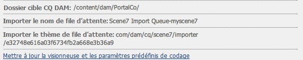
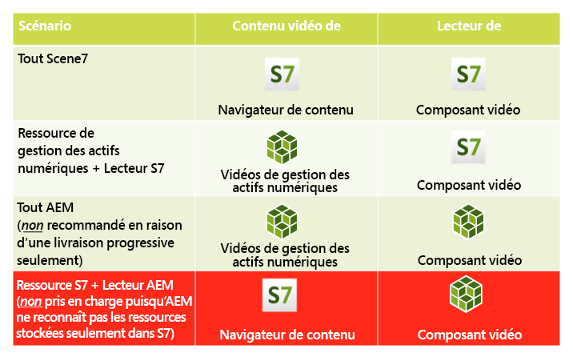
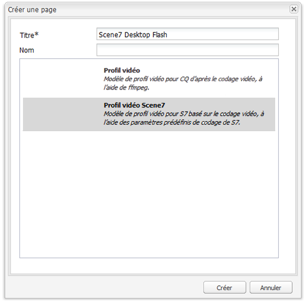
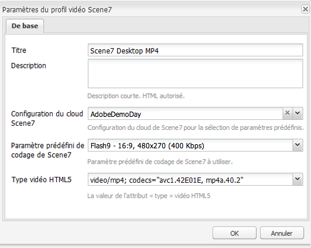

# Vidéo{#video}

Les ressources permettent une gestion centralisée des ressources vidéo dans laquelle vous pouvez télécharger directement des vidéos vers les ressources pour un codage automatique vers Dynamic Media Classic et accéder directement aux vidéos Dynamic Media Classic à partir des ressources pour la création de pages.

L’intégration vidéo Dynamic Media Classic étend la portée de la vidéo optimisée à tous les écrans (détection de périphériques et de bande passante automatique).

* Le composant vidéo Dynamic Media Classic (Scene7) détecte automatiquement les périphériques et la bande passante afin de lire des vidéos au format et à la qualité appropriés sur les ordinateurs de bureau, les tablettes et les appareils mobiles.
* Ressources - Vous pouvez inclure des ensembles de vidéos adaptables au lieu de contenus vidéo uniques. Un ensemble de vidéos adaptables est un conteneur de tous les rendus vidéo requis permettant de lire la vidéo sans heurt sur plusieurs écrans. Une visionneuse de vidéos adaptative regroupe les versions d’une même vidéo codées dans des débits et des formats différents, par exemple 400 kbit/s, 800 kbit/s et 1 000 kbit/s. Vous utilisez un ensemble de vidéos adaptables, accompagné d’un composant vidéo S7, pour la diffusion vidéo en continu adaptative sur plusieurs écrans, notamment des ordinateurs de bureau, des téléphones iOS, Android et Blackberry et des appareils mobiles Windows. Pour plus d’informations, voir [Documentation Scene7 sur les ensembles de vidéos adaptables](https://help.adobe.com/en_US/scene7/using/WS53492AE1-6029-45d8-BF80-F4B5CF33EB08.html).

## A propos de FFMPEG et Dynamic Media Classic {#about-ffmpeg-and-scene}

Le workflow de codage vidéo par défaut est basé sur l’utilisation d’une intégration basée sur FFMPEG aux profils vidéo. Therefore, the out-of-the-box [!UICONTROL DAM Update Asset] workflow contains the following two ffmpeg-based workflow steps:

* Miniatures FFMPEG
* Codage FFMPEG

Be aware that enabling and configuring the Dynamic Media Classic integration does not automatically remove or deactivate these two workflow steps from the out-of-the-box [!UICONTROL DAM Update Asset] ingestion workflow. Si vous utilisez déjà le codage vidéo FFMPEG dans AEM, il est probable que FFMPEG soit installé dans vos environnements de création. Dans ce cas, une nouvelle vidéo ingérée à l’aide de ressources est codée deux fois : une fois à partir de l’encodeur FFMPEG et une fois à partir de l’intégration Dynamic Media Classic.

If you have the FFMPEG-based video encoding in AEM configured and FFMPEG installed, Adobe recommends that you remove the two FFMPEG workflows from your [!UICONTROL DAM Update Asset] workflows.

### Formats pris en charge {#supported-formats}

Les formats suivants sont pris en charge pour le composant vidéo Dynamic Media Classic :

* F4V H.264
* MP4 H.264

### Choix de l’emplacement du téléchargement de la vidéo {#deciding-where-to-upload-your-video}

Le choix de l’emplacement du téléchargement du contenu vidéo dépend des éléments suivants :

* Avez-vous besoin d’un worfklow pour le contenu vidéo ?
* Avez-vous besoin d’un contrôle des versions pour le contenu vidéo ?

Si la réponse est « oui » à l’une des questions ou aux deux, téléchargez la vidéo directement dans la gestion des actifs numériques d’Adobe. Si la réponse est &quot;non&quot; aux deux questions, téléchargez votre vidéo directement sur Dynamic Media Classic. Le worfklow de chaque scénario est décrit dans la section suivante.

#### Si vous téléchargez la vidéo directement dans Adobe Assets {#if-you-are-uploading-your-video-directly-to-adobe-assets}

Si vous avez besoin d’un worfklow ou d’une création de versions pour les ressources, vous devez tout d’abord les télécharger dans Adobe Assets. Vous trouverez ci-dessous le worfklow recommandé :

1. Téléchargez la ressource vidéo sur Adobe Assets et codez et publiez automatiquement sur Dynamic Media Classic.
1. Dans AEM, accédez aux contenus vidéo dans la gestion de contenu web, dans l’onglet **[!UICONTROL Films]** de l’outil de recherche de contenu.
1. Auteur avec un composant vidéo Dynamic Media Classic ou vidéo de base.

#### Si vous téléchargez la vidéo vers Dynamic Media Classic {#if-you-are-uploading-your-video-to-scene}

Si vous n’avez pas besoin d’un flux de travail ou d’un contrôle de version pour vos ressources, téléchargez-les vers Dynamic Media Classic. Vous trouverez ci-dessous le worfklow recommandé :

1. Dans Dynamic Media Classic, [configurez un téléchargement et un codage FTP planifiés vers Dynamic Media Classic (système automatisé)](https://help.adobe.com/en_US/scene7/using/WS70B173EC-4CAD-4b4c-BF9C-43A11F3A5950.html).
1. In AEM, access video assets in WCM in the **[!UICONTROL Dynamic Media Classic]** tab of the Content Finder.
1. Auteur avec le composant vidéo Dynamic Media Classic.

### Configuration de l’intégration avec la vidéo Dynamic Media Classic {#configuring-integration-with-scene-video}

**Pour configurer des paramètres prédéfinis** universels :

1. In **[!UICONTROL Cloud Services]**, navigate to your **[!UICONTROL Dynamic Media Classic]** configuration and click **[!UICONTROL Edit]**.
1. Sélectionnez l’onglet **[!UICONTROL Vidéo]**.

   >[!NOTE]
   >
   >L’onglet **[!UICONTROL Vidéo]** n’apparaît pas si la page ne comporte pas de configuration de cloud. Voir [Activation de Dynamic Media Classic pour WCM](#enablingscene7forwcm).

1. Sélectionnez le profil de codage vidéo adaptative, un profil de codage vidéo unique prêt à l’emploi ou un profil de codage vidéo personnalisé.

   >[!NOTE]
   >
   >For more information about what the video presets mean, see the [Dynamic Media Classic documentation](https://help.adobe.com/en_US/scene7/using/WSE86ACF2B-BD50-4c48-A1D7-9CD4405B62D0.html).
   >
   >Adobe recommande de sélectionner les deux ensembles de vidéos adaptables lors de la configuration des paramètres prédéfinis ou de sélectionner l’option **[!UICONTROL Codage vidéo adaptative]**.

1. Les profils de codage sélectionnés sont automatiquement appliqués à toutes les vidéos téléchargées dans le dossier de cible CQ DAM que vous avez configuré pour cette configuration de cloud Dynamic Media Classic. Vous pouvez configurer plusieurs configurations de cloud Dynamic Media Classic avec différents dossiers de cible pour appliquer différents profils de codage selon vos besoins.

### Mise à jour de la visionneuse et des paramètres prédéfinis de codage {#updating-viewer-and-encoding-presets}

If you need to update the viewer and encoding presets for video in AEM because the presets have been updated in Dynamic Media Classic, navigate to the Dynamic Media Classic configuration in the cloud configuration and click **Update the viewer and encoding presets**.

### Téléchargement de votre vidéo source principale {#uploading-your-master-video}

Pour télécharger votre vidéo source principale vers Dynamic Media Classic depuis Adobe DAM :

1. Accédez au dossier CQ DAM cible où vous avez configuré votre configuration de cloud avec les profils de codage Dynamic Media Classic.
1. Cliquez sur **[!UICONTROL Télécharger]** pour télécharger la vidéo source principale. Video uploading and encoding is complete after the [!UICONTROL DAM Update Asset] workflow is complete and **[!UICONTROL Publish to Dynamic Media Classic]** has a checkmark.

   >[!NOTE]
   >
   >La génération des miniatures de vidéo peut prendre du temps.

   Dragging the DAM primary source video on to the video component accesses *all* of the Dynamic Media Classic encoded proxy renditions for delivery.

### Composant vidéo de base par rapport au composant vidéo de Dynamic Media Classic {#foundation-video-component-versus-scene-video-component}

Lors de l’utilisation d’AEM, vous avez accès au composant vidéo disponible dans Sites et au composant vidéo Dynamic Media Classic (Scene7). Ces composants ne sont pas interchangeables.

Le composant vidéo Dynamic Media Classic ne fonctionne que pour les vidéos Dynamic Media Classic. Le composant foundation fonctionne avec les vidéos stockées à partir d’AEM (à l’aide de ffmpeg) et des vidéos Dynamic Media Classic.

Le tableau suivant explique les cas d’utilisation de chaque composant :

>[!NOTE]
>
>Le composant vidéo Dynamic Media Classic utilise le profil vidéo universel prêt à l’emploi. Vous pouvez toutefois obtenir le lecteur vidéo basé sur HTML5 pour une utilisation par AEM. Dans Dynamic Media Classic, copiez le code incorporé du lecteur vidéo HTML5 prêt à l’emploi et placez-le dans votre page AEM.

## Composant vidéo AEM {#aem-video-component}

Même si l’utilisation du composant vidéo Dynamic Media Classic est recommandée pour l’affichage de vidéos Dynamic Media Classic, cette section décrit l’utilisation de vidéos Dynamic Media Classic avec le composant [!UICONTROL vidéo] Foundation dans AEM, par souci d’exhaustivité.

### Comparaison des vidéos AEM et des vidéos Dynamic Media Classic {#aem-video-and-scene-video-comparison}

Le tableau suivant fournit une comparaison de niveau élevé des fonctions prises en charge par le composant vidéo de base AEM et le composant vidéo Scene7 :

|  | Vidéo de base AEM | Vidéo Dynamic Media Classic |
|---|---|---|
| Approche | Approche HTML5 en premier lieu. Flash n’est utilisé que pour le secours non HTML5. | Flash sur la plupart des ordinateurs de bureau. HTML5 est utilisé pour les mobiles et les tablettes. |
| Diffusion | Progressive | Adaptative |
| Suivi | Oui | Oui |
| Evolutivité | Oui | Oui (avec le SDK de la visionneuse Dynamic Media Classic) |
| Vidéo mobile | Oui | Oui |

### Configuration {#setting-up}

#### Création de profils vidéo {#creating-video-profiles}

Les divers codages vidéo sont créés selon les paramètres prédéfinis de codage Dynamic Media Classic sélectionnés dans la configuration de cloud Dynamic Media Classic. Pour que le composant vidéo de base puisse les utiliser, un profil vidéo doit être créé pour chaque paramètre prédéfini de codage Dynamic Media Classic sélectionné. Cela permet au composant vidéo de sélectionner les rendus de la gestion des actifs numériques en conséquence.

>[!NOTE]
>
>Les nouveaux profils vidéo et leurs modifications doivent être activés pour la publication.

1. Dans AEM, accédez à **[!UICONTROL Outils]**, puis sélectionnez **[!UICONTROL Console de configuration]**. In the Configuration Console navigate to **[!UICONTROL Tools]** > **[!UICONTROL Assets]** > **[!UICONTROL Video Profiles]** in the navigation tree.
1. Créez un nouveau Profil vidéo Dynamic Media Classic. In the **[!UICONTROL New...]** menu, select **[!UICONTROL Create Page]** and then select the Dynamic Media Classic Video Profile template. Attribuez un nom à la nouvelle page de profil vidéo et cliquez sur **[!UICONTROL Créer]**.

   

1. Modifiez le nouveau profil vidéo. Sélectionnez tout d’abord la configuration de cloud. Puis, sélectionnez le même paramètre prédéfini de codage que celui sélectionné dans la configuration de cloud.

   

   | Propriétés | Description |
   |---|---|
   | Configuration du cloud Dynamic Media Classic (Scene7) | Configuration de cloud à utiliser pour les paramètres prédéfinis de codage. |
   | Paramètre prédéfini de codage Dynamic Media Classic (Scene7) | Paramètre prédéfini de codage à associer à ce profil vidéo. |
   | Type de vidéo HTML5 | Cette propriété permet de définir la valeur de la propriété du type de l’élément source vidéo HTML5. Ces informations ne sont pas fournies par les paramètres prédéfinis de codage Dynamic Media Classic, mais sont requises pour effectuer le rendu correct des vidéos à l’aide de l’élément vidéo HTML5. Une liste des formats courants est fournie mais ils peuvent être remplacés par d’autres formats. |

   Répétez cette étape pour tous les paramètres prédéfinis de codage sélectionnés dans la configuration de cloud que vous voulez utiliser dans le composant vidéo.

#### Conception de la configuration {#configuring-design}

Le composant vidéo de base doit connaître les profils vidéo à utiliser afin de créer la liste des sources vidéo. Vous devez ouvrir la boîte de dialogue de conception des composants vidéo et configurer la conception des composants pour l’utilisation des nouveaux profils vidéo.

>[!NOTE]
>
>Si vous utilisez le composant vidéo de base sur une page mobile, vous devrez peut-être répéter ces étapes pour la conception de la page mobile.

>[!NOTE]
>
>Les modifications apportées à la conception requièrent l’activation de la conception afin qu’elles prennent effet lors de la publication.

1. Ouvrez la boîte de dialogue de conception des composants vidéo de base et sélectionnez l’onglet **[!UICONTROL Profils.]** Supprimez ensuite les profils prêts à l’emploi et ajoutez les nouveaux profils vidéo Dynamic Media Classic. L’ordre de la liste de profil dans la boîte de dialogue de conception définit également l’ordre de l’élément sources vidéo lors du rendu.
1. Pour les navigateurs ne prenant pas en charge HTML5, le composant vidéo permet de configurer un secours Flash. Ouvrez la boîte de dialogue de conception des composants vidéo et sélectionnez l’onglet **[!UICONTROL Flash.]** Configurez les paramètres du lecteur Flash et affectez un profil de secours au lecteur.

#### Liste de contrôle {#checklist}

1. Créez une configuration de cloud Dynamic Media Classic (Scene7). S’assurer que les paramètres prédéfinis de codage vidéo sont définis et que l’importateur fonctionne.
1. Créez un profil vidéo Dynamic Media Classic pour chaque paramètre prédéfini de codage vidéo sélectionné dans la configuration cloud.
1. Les profils vidéo doivent être activés.
1. Configurer la conception du composant vidéo de base sur votre page.
1. Activer la conception une fois que vous avez terminé les modifications de cette dernière.

