# Ajout de fonctionnalités Scene7 à votre page{#adding-scene-features-to-your-page}

[Adobe Scene7](https://help.adobe.com/en_US/scene7/using/WS26AB0D9A-F51C-464e-88C8-580A5A82F810.html) est une solution hébergée visant à la gestion, l’amélioration, la publication et la diffusion de contenus multimédia enrichis sur le web, sur les appareils mobiles, par email, sur les appareils connectés à Internet et par impression.

Vous pouvez vue des fichiers Experience Manager publiés dans Scene7 dans divers lecteurs :

* Zoom
* Fenêtre déroulante
* Vidéo
* Modèle d’image
* Image

Vous pouvez publier des ressources numériques directement du Experience Manager au Scene7 et vous pouvez publier des ressources numériques du Scene7 vers le Experience Manager.

Ce document décrit comment publier des ressources numériques du Experience Manager vers Scene7 et vice versa. Les visionneuses sont également décrites en détail. Pour plus d’informations sur la configuration du Experience Manager pour Scene7, voir [Intégration de Scene7 avec le Experience Manager](/help/sites-administering/scene7.md).

Voir aussi [Ajout de zones cliquables](/help/assets/image-maps.md).

Pour plus d’informations sur l’utilisation des composants vidéo avec le Experience Manager, voir les sections suivantes :

* [Vidéo](/help/sites-classic-ui-authoring/manage-assets-classic-s7-video.md)

>[!NOTE]
>
>Si les ressources Scene7 ne s’affichent pas correctement, assurez-vous que Contenu multimédia dynamique est [désactivé](/help/assets/config-dynamic.md#disabling-dynamic-media), puis actualisez la page.

## Publication manuelle sur Scene7 depuis AEM Assets {#manually-publishing-to-scene-from-assets}

Vous pouvez publier des éléments numériques sur Scene7 depuis la console Ressources de l’interface utilisateur classique ou directement depuis l’élément.

>[!NOTE]
>
>Le Experience Manager publie sur Scene7 de manière asynchrone. Une fois que vous avez cliqué sur **Publier**, il peut s’écouler plusieurs secondes avant que l’élément soit publié sur Scene7.

### Publication depuis la console Ressources {#publishing-from-the-assets-console}

Pour publier sur Scene7 depuis la console Ressources si les éléments se trouvent dans un dossier cible Scene7, procédez comme suit :

1. Dans l’interface utilisateur classique du Experience Manager, cliquez sur **Ressources numériques** pour accéder au gestionnaire de ressources numériques.

1. Sélectionnez, depuis le dossier cible, l’élément (ou les éléments) ou le dossier que vous souhaitez publier sur Scene7, puis cliquez avec le bouton droit et sélectionnez **Publier sur Scene7**. Vous pouvez également sélectionner **Publier dans Scene7** dans le menu **Outils**.

   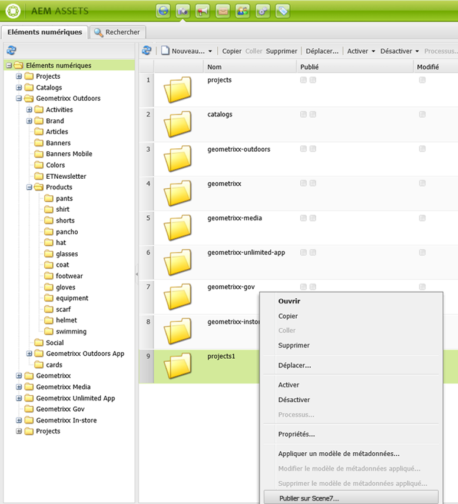

1. Accédez à Scene7 et confirmez que les éléments sont disponibles.

   >[!NOTE]
   >
   >Si les éléments ne figurent pas dans un dossier synchronisé Scene7, l’option **Publier vers Scene7** des deux menus est visible mais désactivée.

### Publication depuis un élément  {#publishing-from-an-asset}

Vous pouvez publier manuellement un élément sous réserve que cet élément figure dans le dossier Scene7 synchronisé.

>[!NOTE]
>
>Si l’élément ne figure pas dans le dossier synchronisé Scene7, le lien **Publier sur Scene7** ne s’affiche pas.

Pour publier sur Scene7 directement depuis un élément numérique, procédez comme suit :

1. Dans le Experience Manager, cliquez sur **Ressources numériques** pour accéder au gestionnaire de ressources numériques.

1. Double-cliquez pour ouvrir un élément.

1. Dans le panneau de détails de l’élément, sélectionnez **Publier sur Scene7**.

   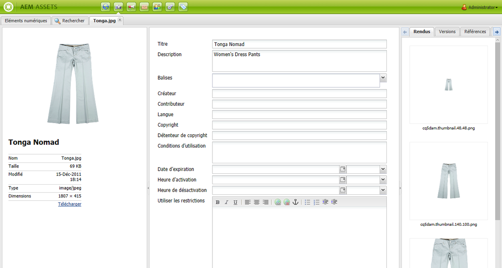

1. Le lien devient **Publication...**, puis **Publié**. Accédez à Scene7 et confirmez que l’élément est disponible.

   >[!NOTE]
   >
   >Si l’élément n’est pas publié correctement sur Scene7, le lien devient **Echec de la publication**. Si l’élément a déjà été publié sur Scene7, le lien devient **Publier à nouveau vers Scene7**. La republication vous permet d’apporter des modifications à un fichier dans le Experience Manager et de le republier.

### Publication d’éléments depuis un dossier autre que le dossier cible CQ {#publishing-assets-from-outside-the-cq-target-folder}

Adobe recommande de ne publier des éléments sur Scene7 que depuis des éléments figurant dans le dossier cible Scene7. Cependant, si vous devez télécharger des fichiers à partir d’un dossier situé en dehors du dossier de cible, vous pouvez toujours le faire en les téléchargeant dans un dossier **ad-hoc** sur Scene7.

Vous devez tout d’abord définir la configuration de cloud pour la page dans laquelle l’élément va apparaître. Vous ajoutez ensuite un composant Scene7 à la page et faites glisser l’élément sur le composant. Une fois les propriétés de la page définies pour cette page, un lien **Publier vers Scene7** s’affiche lorsque l’option sélectionnée déclenche le téléchargement vers Scene7.

>[!NOTE]
>
>Les éléments qui figurent dans le dossier ad hoc n’apparaissent pas dans le navigateur de contenu Scene7.

Pour publier des éléments qui ne figurent pas dans le dossier cible CQ, procédez comme suit :

1. Dans le Experience Manager de l’interface utilisateur classique, cliquez sur **Sites Web** et accédez à la page Web à laquelle vous souhaitez ajouter un fichier numérique qui n’est pas encore publié sur Scene7. (Les règles normales d’héritage de la page s’appliquent.)

1. Dans le sidekick, cliquez sur l’icône **Page**, puis sur **Propriétés de la page**.

1. Cliquez sur **Services Cloud**, puis sur **Ajouter un service** et sélectionnez **Scene7**.
1. Dans la liste déroulante **Adobe Scene7**, sélectionnez la configuration souhaitée, puis cliquez sur **OK**.

   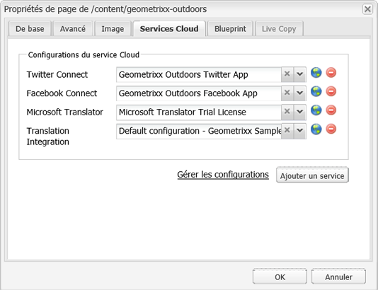

1. Sur la page web, ajoutez un composant Scene7 à l’emplacement souhaité sur la page.
1. Depuis l’outil de recherche de contenu, faites glisser un élément numérique vers le composant. Un lien permettant de **Vérifier l’état de la publication sur Scene7** apparaît.

   >[!NOTE]
   >
   >Si la ressource numérique se trouve dans le dossier de cible CQ, aucun lien vers **Vérifier l’état de publication de Scene7** n’apparaît. Les éléments sont simplement placés dans le composant.

   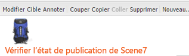

1. Cliquez sur **Vérifier l’état de la publication sur Scene7**. Si les ressources ne sont pas publiées, le Experience Manager les publie dans Scene7. Une fois téléchargé, l’élément figure dans le dossier ad hoc. Par défaut, le dossier ad hoc est situé dans le chemin d’accès **nom_de_la_société/CQ5_adhoc**. Vous pouvez [configurer ce chemin, le cas échéant](#configuringtheadhocfolder).

   >[!NOTE]
   >
   >Si l’élément ne figure pas dans un dossier synchronisé Scene7 et qu’aucune configuration de cloud Scene7 n’est associée à la page actuelle, le téléchargement échoue.

## Composants Scene7  {#scene-components}

Les composants Scene7 suivants sont disponibles en Experience Manager :

* Zoom
* Fenêtre déroulante (Zoom)
* Modèle d’image
* Image
* Vidéo

>[!NOTE]
>
>Ces composants ne sont pas disponibles par défaut et doivent être sélectionnés en mode Conception avant leur utilisation.

Une fois qu’elles sont disponibles en mode Création, vous pouvez ajouter les composants à votre page comme tout autre composant Experience Manager. Les éléments qui n’ont pas encore été publiés sur Scene7 le sont s’ils figurent dans un dossier synchronisé ou sur une page disposant d’une configuration de cloud Scene7.

>[!NOTE]
>
>Si vous créez et développez des visionneuses S7 personnalisées et que vous utilisez l’outil de recherche de contenu, vous devez explicitement ajouter le paramètre **allowfullscreen**.

### Notification de fin de prise en charge de la visionneuse Flash {#flash-viewers-end-of-life-notice}

À compter du 31 janvier 2017, Adobe Scene7 mettra officiellement fin à la prise en charge de la plate-forme de la visionneuse Flash.

Pour plus d’informations sur cette importante modification, reportez-vous aux [questions fréquentes sur la fin de prise en charge de la visionneuse Flash](https://docs.adobe.com/content/docs/en/aem/6-1/administer/integration/marketing-cloud/scene7/flash-eol.html).

### Ajout d’un composant Scene7 à une page  {#adding-a-scene-component-to-a-page}

L’ajout d’un composant Scene7 à une page est identique à l’ajout d’un composant à n’importe quelle page. Les composants Scene7 sont décrits en détail dans les sections suivantes.

Pour ajouter un composant/une visionneuse Scene7 à une page dans l’interface utilisateur classique, procédez comme suit :

1. Dans le Experience Manager, ouvrez la page dans laquelle vous souhaitez ajouter le composant Scene7.

1. Si aucun composant Scene7 n’est disponible, cliquez sur la règle dans le sidekick pour passer en mode **Conception**, cliquez sur le parsys **Modifier** et sélectionnez tous les composants **Scene7** pour les rendre disponibles.

1. Revenez au mode **Modifier** en cliquant sur le crayon dans le sidekick.

1. Faites glisser un composant du groupe **Scene7** dans le sidekick vers la page à l’emplacement souhaité.

1. Cliquez sur l’icône **Modifier** pour ouvrir le composant.

1. Modifiez le composant comme requis et cliquez sur **OK** pour enregistrer les modifications.

### Ajout d’expériences de visionnage interactif à un site web réactif  {#adding-interactive-viewing-experiences-to-a-responsive-website}

Une conception réactive signifie que les éléments s’adaptent selon l’emplacement où ils sont affichés. Avec la conception réactive, les mêmes éléments peuvent être affichés sur plusieurs appareils.

Pour ajouter une expérience de visionnage interactif à un site réactif par l’intermédiaire de l’interface utilisateur classique, procédez comme suit :

1. Connectez-vous au Experience Manager et assurez-vous que vous avez [configuré les Cloud Services Adobe Scene7](/help/sites-administering/scene7.md#configuring-scene-integration) et que les composants Scene7 sont disponibles.

   >[!NOTE]
   >
   >Si les composants Scene7 WCM ne sont pas disponibles, veillez à les activer via le mode Création.

1. Dans un site web dont les composants Scene7 sont activés, faites glisser une visionneuse **Image** vers la page.
1. Modifiez le composant et ajustez les points d’arrêt dans l’onglet **Paramètres de Scene7**.

   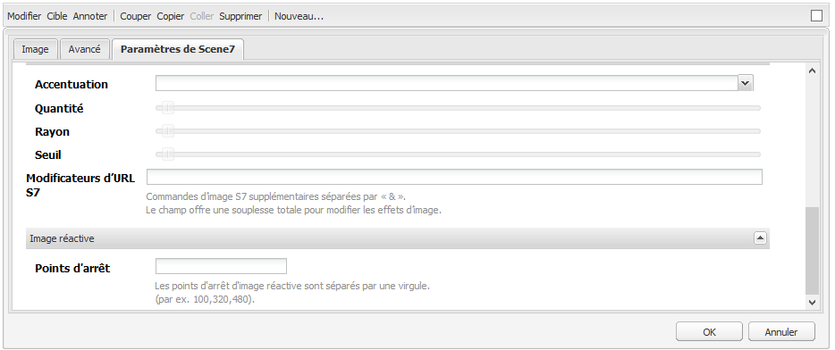

1. Confirmez que les visionneuses se redimensionnent de manière réactive et que toutes les interactions sont optimisées pour les ordinateurs de bureau, les tablettes et les appareils mobiles.

### Paramètres communs à tous les composants de Scene7  {#settings-common-to-all-scene-components}

Bien que les options de configuration varient, les paramètres suivants sont communs à tous les composants Scene7 :

* **Référence du fichier** : accédez à un fichier que vous souhaitez référencer. La référence du fichier affiche l’URL de l’élément, et pas nécessairement l’ensemble de l’URL Scene7, notamment les commandes et paramètres d’URL. Vous ne pouvez pas ajouter de commandes et de paramètres d’URL Scene7 dans ce champ. Ils doivent être ajoutés par l’intermédiaire de la fonctionnalité correspondante du composant.
* **Largeur** : permet de définir la largeur.
* **Hauteur** : permet de définir la hauteur.

Vous définissez ces options de configuration en ouvrant (double-cliquant) un composant Scene7, par exemple, lorsque vous ouvrez un composant **Zoom** :

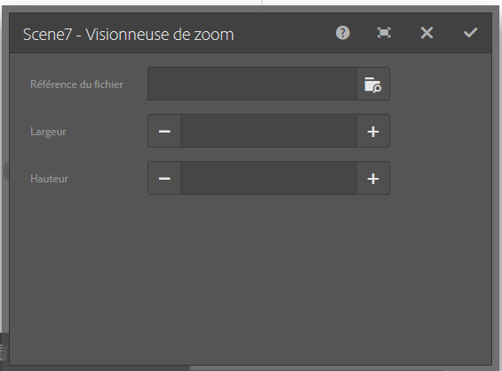

### Zoom {#zoom}

Le composant Zoom HTML5 affiche une image plus grande lorsque vous appuyez sur le bouton +.

L’élément comporte des outils de zoom dans sa partie inférieure. Cliquez sur **+** pour agrandir. Cliquez sur **-** pour réduire. Cliquez sur **x** ou sur la flèche de zoom réinitialisé pour ramener l’image à la taille d’origine sous laquelle elle a été importée. Cliquez sur les flèches en diagonale pour passer en mode plein écran. Cliquez sur **Modifier** pour configurer le composant. Avec ce composant, vous pouvez configurer des paramètres [communs à tous les composants Scene7](#settings-common-to-all-scene-components).

### Flyout {#flyout}

Dans le composant Fenêtre déroulante HTML5, l’élément s’affiche sous la forme d’un écran partagé : à gauche se trouve l’élément à la taille spécifiée, à droite la partie sur laquelle le zoom a été effectué. Cliquez sur **Modifier** pour configurer le composant. Avec ce composant, vous pouvez configurer des paramètres [communs à tous les composants Scene7](/help/sites-administering/scene7.md#settingscommontoallscene7components).

>[!NOTE]
>
>Si le composant Fenêtre déroulante utilise une taille personnalisée, cette taille personnalisée est utilisée et la configuration réactive du composant est désactivée.
>
>Si votre composant Fenêtre déroulante utilise la taille par défaut, telle qu’elle est définie dans la vue de conception, la taille par défaut est utilisée et le composant s’étire pour s’adapter à la taille de la mise en page avec la configuration adaptée du composant activée. Sachez toutefois qu’il existe une limite à la configuration réactive du composant. Lorsque vous utilisez le composant Fenêtre déroulante avec la configuration réactive, vous ne devez pas l’utiliser avec l’étirement de pleine page. Dans le cas contraire, la fenêtre déroulante peut s’étendre au-delà de la bordure droite de la page.

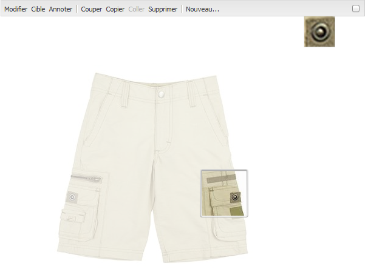

### Image {#image}

Le composant Image de Scene7 permet d’ajouter la fonctionnalité Scene7 aux images, par exemple des modificateurs, des paramètres d’image prédéfinis ou des paramètres prédéfinis de visionneuse et une accentuation. Le composant d’image Scene7 est similaire aux autres composants d’image du Experience Manager avec une fonctionnalité Scene7 spéciale. Dans cet exemple, le modificateur d’URL Scene7 **&amp;op_invert=1** est appliqué à l’image.

**Titre, Alt** TextDans l’onglet Avancé, ajoutez un titre à l’image et un texte de remplacement pour les utilisateurs dont les graphiques sont désactivés.

**URL, Ouvrir** dans Vous pouvez définir un fichier à partir duquel ouvrir un lien. Définissez l’URL, puis dans le champ Ouvrir dans, indiquez si vous souhaitez l’ouvrir dans la même fenêtre ou une nouvelle fenêtre.

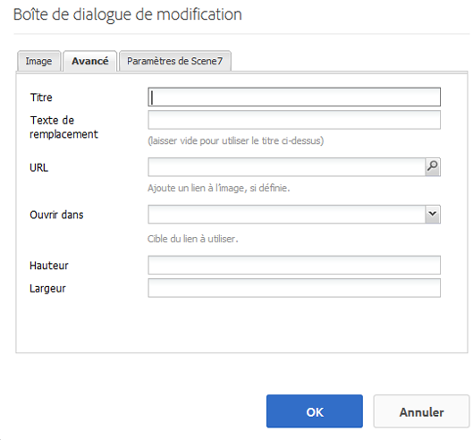

**Paramètre** prédéfini de visionneuseSélectionnez un paramètre prédéfini existant dans le menu déroulant. Si le paramètre prédéfini de visionneuse que vous recherchez n’est pas visible, vous devrez le rendre visible. Voir Gestion des paramètres prédéfinis de visionneuse. Si vous utilisez un paramètre prédéfini d’image, vous ne pouvez pas sélectionner de paramètre prédéfini de visionneuse, et inversement.

**Scene7** ConfigurationSélectionnez la configuration Scene7 à utiliser pour récupérer les paramètres d’image prédéfinis principaux à partir de SPS.

**Paramètre** d’image prédéfiniSélectionnez un paramètre d’image prédéfini existant dans le menu déroulant. Si le paramètre d’image prédéfini que vous recherchez n’est pas visible, vous devrez le rendre visible. Voir Gestion des paramètres d’image prédéfinis. Si vous utilisez un paramètre prédéfini d’image, vous ne pouvez pas sélectionner de paramètre prédéfini de visionneuse, et inversement.

**Format** de sortieSélectionnez le format de sortie de l’image, par exemple jpeg. Selon le format de sortie que vous sélectionnez, vous pouvez ajouter des options de configuration supplémentaires. Voir Bonnes pratiques relatives aux paramètres d’image prédéfinis.

**** AccentuationSélectionnez le mode d’accentuation de l’image. L’accentuation est expliquée en détails dans les rubriques Bonnes pratiques relatives aux paramètres d’image prédéfinis et Bonnes pratiques relatives à l’accentuation.

**Modificateurs** d’URLVous pouvez modifier les effets d’image en fournissant des commandes d’image S7 supplémentaires. Ces commandes sont décrites dans la section Paramètres prédéfinis d’image et le guide de référence des commandes.

**** Points d’arrêtSi votre site Web est réactif, vous souhaitez ajuster les points d’arrêt. Les points d’arrêt doivent être séparés par des virgules (,).

### Modèle d’image {#image-template}

Les [modèles d’image Scene7](https://help.adobe.com/en_US/scene7/using/WS60B68844-9054-4099-BF69-3DC998A04D3C.html) sont du contenu Photoshop en couches qui a été importé vers Scene7, où le contenu et les propriétés ont été paramétrés pour la variabilité. Le composant **Modèle d’image** vous permet d’importer des images et de modifier le texte de manière dynamique en Experience Manager. En outre, vous pouvez configurer le composant **Modèle d’image** afin d’utiliser des valeurs provenant de ClientContext de sorte que chaque utilisateur voit l’image d’une manière personnalisée.

Cliquez sur **Modifier** pour configurer le composant. Vous pouvez configurer des paramètres [communs à tous les composants de Scene7](/help/sites-administering/scene7.md#settingscommontoallscene7components) ainsi que d&#39;autres paramètres décrits dans cette section.

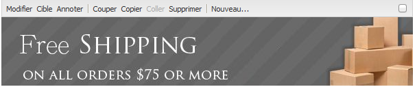

**Référence du fichier, Largeur,** HauteurVoir les paramètres communs à tous les composants Scene7.

>[!NOTE]
>
>Les commandes et paramètres d’URL Scene7 ne peuvent pas être ajoutés directement à l’URL Référence du fichier. Ils ne peuvent être définis que dans l’interface utilisateur du composant, dans le panneau **Paramètre**.

**Titre, Alt** TextDans l’onglet Modèle d’image Scene7, ajoutez un titre à l’image et un texte de remplacement pour les utilisateurs dont les graphiques sont désactivés.

**URL, Ouvrir** dans Vous pouvez définir un fichier à partir duquel ouvrir un lien. Définissez l’URL, puis dans le champ Ouvrir dans, indiquez si vous souhaitez l’ouvrir dans la même fenêtre ou une nouvelle fenêtre.

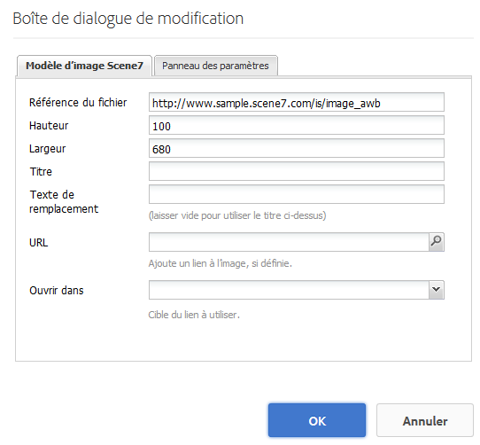

**** Panneau de paramètresLors de l’importation d’une image, les paramètres sont prérenseignés avec les informations de l’image. En l’absence de contenu pouvant être modifié dynamiquement, cette fenêtre est vide.

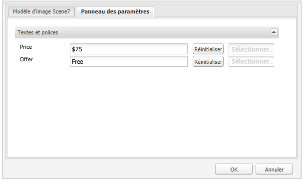

#### Modification dynamique du texte {#changing-text-dynamically}

Pour une modification dynamique du texte, saisissez le nouveau texte dans les champs, puis cliquez sur **OK**. Dans cet exemple, le **Prix** est désormais de 50 $ et l’expédition de 99 cents.

Le texte de l’image change. Vous pouvez réinitialiser le texte sur la valeur d’origine en cliquant sur **Réinitialiser** en regard du champ.

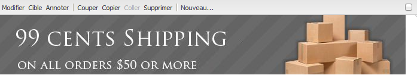

#### Modification du texte afin de refléter une valeur ClientContext {#changing-text-to-reflect-the-value-of-a-client-context-value}

Pour lier un champ à une valeur de contexte client, cliquez sur **Sélectionner** pour ouvrir le menu contextuel client, sélectionnez le contexte client, puis cliquez sur **OK**. Dans cet exemple, le nom change selon la liaison entre le Nom et le nom formaté du profil.

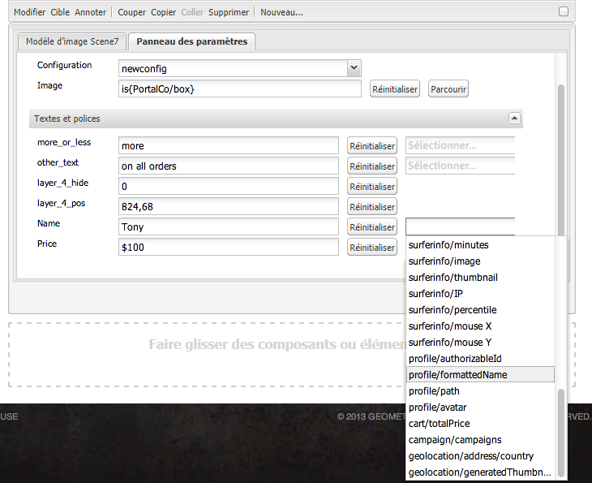

Le texte reflète le nom de l’utilisateur actuellement connecté. Vous pouvez réinitialiser le texte sur la valeur d’origine en cliquant sur **Réinitialiser** en regard du champ.

#### Transformation du modèle d’image Scene7 en un lien {#making-the-scene-image-template-a-link}

Pour transformer le composant Modèle d’image Scene7 en un lien cliquable, procédez comme suit :

1. Sur la page comportant le composant Modèle d’image Scene7, cliquez sur **Modifier**.
1. Dans le champ **URL**, saisissez l’URL à laquelle l’utilisateur accède lorsqu’il clique sur l’image. Dans le champ **Ouvrir dans**, choisissez où vous souhaitez que la cible s’ouvre (une nouvelle fenêtre ou la même fenêtre).

   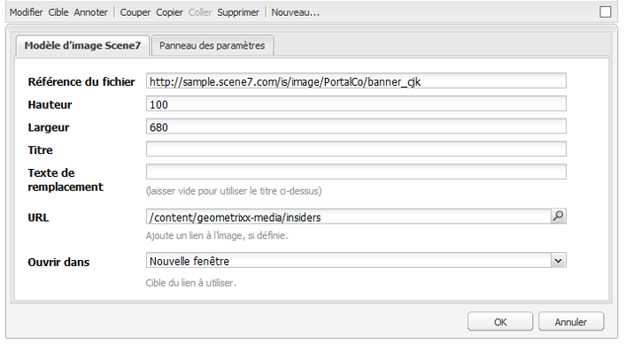

1. Cliquez sur **OK**.

### Composant vidéo {#video-component}

Le composant Scene7 **Video** (disponible à partir de la section Scene7 du sidekick) utilise la détection de périphérique et de bande passante pour diffuser la vidéo appropriée sur chaque écran. Ce composant est un lecteur vidéo HTML5. Il s’agit d’une visionneuse unique pouvant être utilisée sur plusieurs canaux.

Il peut être utilisé pour des ensembles de vidéos adaptables, une vidéo MP4 unique ou une vidéo F4V unique.

Pour plus d’informations sur le fonctionnement des vidéos avec l’intégration de Scene7, voir [Vidéo](/help/sites-classic-ui-authoring/manage-assets-classic-s7-video.md) En outre, voir [la comparaison entre le composant **vidéo Scene7** et le composant **vidéo** de base](/help/sites-classic-ui-authoring/manage-assets-classic-s7-video.md).

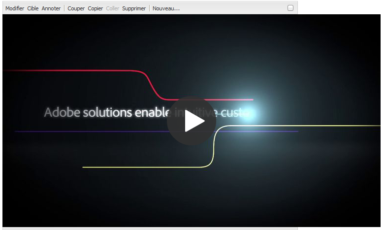

### Limitations connues du composant vidéo {#known-limitations-for-the-video-component}

Adobe DAM et WCM indique si une vidéo source Principale est téléchargée. Elles n’affichent pas les éléments proxy suivants :

* Rendus codés Scene7
* Ensembles de vidéos adaptables Scene7

Lors de l’utilisation d’un ensemble de vidéos adaptables avec un composant vidéo Scene7, le composant doit être redimensionné afin de correspondre aux dimensions de la vidéo.

## Navigateur de contenu Scene7 {#scene-content-browser}

Le navigateur de contenu Scene7 vous permet de vue du contenu de Scene7 directement dans le Experience Manager. Pour accéder à l’explorateur de contenu, dans l’Outil de recherche de contenu, sélectionnez **Scene7** dans l’interface utilisateur optimisée pour les écrans tactiles ou l’icône **S7** dans l’interface utilisateur classique. La fonctionnalité est identique pour les deux interfaces utilisateur.

Si vous avez plusieurs configurations, le Experience Manager affiche par défaut la [configuration par défaut](/help/sites-administering/scene7.md#configuring-a-default-configuration). Vous pouvez sélectionner différentes configurations directement dans le navigateur de contenu Scene7, depuis le menu déroulant.

>[!NOTE]
>
>* Les éléments figurant dans le dossier ad hoc n’apparaissent pas dans le navigateur de contenu Scene7.
>* Lorsque l’[aperçu sécurisé est activé](/help/sites-administering/scene7.md#configuring-the-state-published-unpublished-of-assets-pushed-to-scene), les éléments publiés sur Scene7, tout comme les éléments non publiés, apparaissent dans le navigateur de contenu Scene7.
>* Si vous ne voyez pas **Scene7** ou l&#39;icône **S7** comme option dans le navigateur de contenu, vous devez [configurer Scene7 pour qu&#39;il fonctionne avec Experience Manager](/help/sites-administering/scene7.md).
>* Pour la vidéo, le navigateur de contenu Scene7 prend en charge :
   >   * Les ensembles de vidéos adaptables. Il s’agit de conteneurs de tous les rendus vidéo requis pour lire la vidéo sans difficultés sur plusieurs écrans.
   >   * La vidéo MP4 unique
   >   * Vidéo F4V simple

### Navigation dans le contenu {#browsing-content-in-the-classic-ui}

Parcourez le contenu de Scene7 en cliquant sur l’onglet **S7**.

Vous pouvez modifier la configuration à laquelle vous accédez en la sélectionnant. Les dossiers changent en fonction de la configuration que vous sélectionnez.

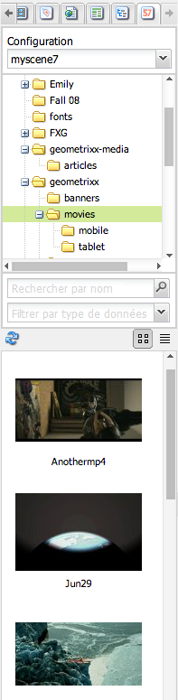

Comme avec l’outil de recherche de contenu des ressources, vous pouvez effectuer une rechercher des éléments et filtrer les résultats. Néanmoins, à la différence de l’outil de recherche de contenu des ressources, lors de la saisie d’un mot-clé dans l’onglet **S7**, le nom du fichier **commence par** la chaîne que vous avez saisie au lieu de **contenir** le mot-clé.

Par défaut, les éléments sont affichés par nom de fichier. Vous pouvez également filtrer les résultats par type d’élément.

>[!NOTE]
>
>Pour la vidéo, le navigateur de contenu Scene7 de la gestion de contenu web prend en charge :
>
>* Les ensembles de vidéos adaptables. Il s’agit de conteneurs de tous les rendus vidéo requis pour lire la vidéo sans difficultés sur plusieurs écrans.
>* La vidéo MP4 unique
>* Vidéo F4V simple

>

### Recherche d’éléments Scene7 avec le navigateur de contenu {#searching-for-scene-assets-with-the-content-browser}

La recherche d’actifs Scene7 est similaire à la recherche d’actifs Experience Manager, sauf que lorsque vous effectuez une recherche, une vue distante des actifs dans le système Scene7 s’affiche, plutôt que de les importer directement dans le Experience Manager.

Vous pouvez utiliser l’interface utilisateur classique ou l’interface utilisateur optimisée pour les écrans tactiles pour visualiser et rechercher des éléments. Selon l’interface, le mode de recherche est légèrement différent.

Lors d’une recherche dans l’une ou l’autre des interfaces, vous pouvez filtrer selon les critères suivants (présentés ici dans l’interface utilisateur optimisée pour les écrans tactiles) :

**Entrez des** mots-clésVous pouvez rechercher des ressources par nom. Lors de la recherche par mots-clés, vous saisissez le début du nom du fichier. Par exemple, la saisie du mot « swimming » recherche tous les noms de fichier qui commencent par ces lettres, dans cet ordre. Veillez à appuyer sur Entrée après avoir tapé le mot-clé de recherche de l’élément.

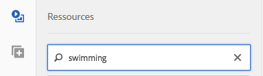

**Dossier/** cheminLe nom du dossier qui s&#39;affiche dépend de la configuration que vous avez sélectionnée. Vous pouvez descendre vers des niveaux inférieurs en cliquant sur l’icône du dossier et en sélectionnant un sous-dossier, puis en cliquant sur la coche pour le sélectionner.

Si vous saisissez un mot-clé et sélectionnez un dossier, le Experience Manager effectue une recherche dans ce dossier et dans les sous-dossiers correspondants. Néanmoins, si vous ne saisissez pas de mots-clés lors de la recherche, la sélection du dossier n’affiche que les éléments de ce dossier et n’inclut pas les sous-dossiers.

Par défaut, le Experience Manager recherche le dossier sélectionné et tous les sous-dossiers.

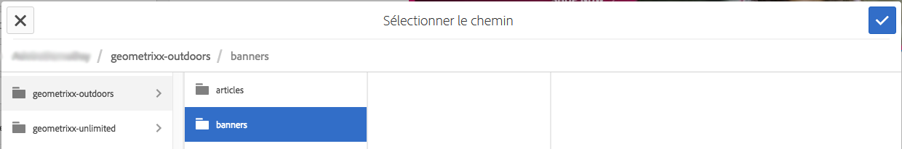

**Type d&#39;** actifSélectionnez Scene7 pour parcourir le contenu Scene7. Cette option n’est disponible que si Scene7 a été configurée.

**** ConfigurationSi plusieurs configurations Scene7 sont définies en Cloud Services, vous pouvez les sélectionner ici. De ce fait, le dossier change selon la configuration que vous avez choisie.

**Type de ressourceDans le navigateur Scene7, vous pouvez filtrer les résultats pour inclure l’un des éléments suivants :**  images, modèles, vidéos et visionneuses de vidéos adaptatives. Si vous ne sélectionnez aucun type de fichier, le Experience Manager recherche par défaut tous les types de fichier.

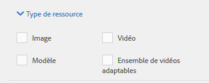

>[!NOTE]
>
>* Dans l’interface utilisateur classique, vous pouvez rechercher des éléments **Flash** et **FXG**. Le filtrage de ces deux éléments n’est actuellement pas pris en charge par l’interface utilisateur optimisée pour les écrans tactiles.
   >
   >
* Lors de la recherche de vidéos, vous recherchez un seul rendu. Les résultats retournent le rendu d’origine (uniquement en *.mp4) et le rendu codé.
* Lors de la recherche d’une visionneuse de vidéos adaptative, vous recherchez le dossier et tous les sous-dossiers, mais uniquement si vous avez ajouté un mot-clé à la recherche. Si vous n&#39;avez pas ajouté de mot-clé, le Experience Manager ne recherche pas les sous-dossiers.

**** Statut de publicationVous pouvez filtrer les fichiers en fonction de l’état de publication : Non publié ou publié. Si vous ne sélectionnez aucun état de publication, le Experience Manager recherche par défaut tous les états de publication.

