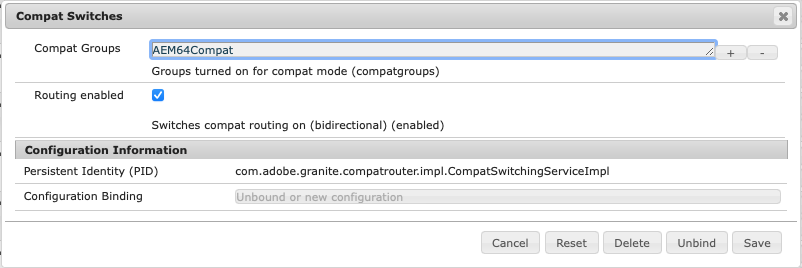

# Compatibilité ascendante dans AEM 6.5{#backward-compatibility-in-aem}

## du commerce électronique {#overview}

>[!NOTE]
>
>Pour obtenir la liste des modifications de contenu et de configuration qui ne font pas partie du module de compatibilité, voir [Restructuration des référentiels dans AEM](/help/sites-deploying/repository-restructuring.md).

Dans Adobe Experience Manager (AEM) 6.5, toutes les fonctionnalités ont été développées en tenant compte de la compatibilité descendante.

En règle générale, les clients exécutant AEM 6.3 ne doivent pas avoir à modifier le code ou les personnalisations lors de la mise à niveau. Pour les clients AEM 6.1 et 6.2, il n’y a aucune autre modification de rupture par rapport à ce que vous pourriez subir lors d’une mise à niveau vers la version 6.3.

Pour les exceptions où les fonctionnalités n’ont pas pu être maintenues rétrocompatibles, les problèmes d’incompatibilité ascendante pour les lots et le contenu peuvent être atténués. Pour ce faire, installez un package de compatibilité pour la version 6.4 (voir la procédure de configuration ci-dessous pour plus d’informations sur l’emplacement de téléchargement). Ce package de compatibilité aide à restaurer la compatibilité habituellement entre les applications conformes à AEM 6.4.

Le package de compatibilité vous permet d’exécuter AEM en mode de compatibilité et de différer le développement personnalisé conformément aux nouvelles fonctionnalités d’AEM :

>[!NOTE]
>
>Le package de compatibilité n’est qu’une solution temporaire permettant de différer le développement requis pour la compatibilité AEM 6.5. Adobe recommande de ne l’utiliser que comme dernière option si vous ne pouvez pas résoudre les problèmes de compatibilité par le biais du développement immédiatement après la mise à niveau. En outre, Adobe vous recommande de passer en mode natif et de désinstaller le package de compatibilité une fois que vous avez décidé de procéder au développement personnalisé basé sur la version 6.5 et de bénéficier de toutes les fonctionnalités de la version 6.5.

Le package de compatibilité possède deux modes : **Routage activé** et **Routage désactivé**.

AEM 6.5 peut ainsi s’exécuter en trois modes :

**Mode natif :**

Le mode natif est destiné aux clientes et clients qui souhaitent utiliser toutes les nouvelles fonctionnalités d’AEM 6.5 et qui sont au point pour effectuer des développements pour que leurs personnalisations fonctionnent avec toutes les nouvelles fonctionnalités.

Cela signifie que vous devez ajuster votre application immédiatement après la mise à niveau.

**Mode de compatibilité : package de compatibilité installé avec le routage activé**

Le mode de compatibilité est destiné aux clientes et clients qui disposent de personnalisations d’interfaces non rétrocompatibles. Cela permet à AEM de s’exécuter en mode de compatibilité et de différer le développement personnalisé requis par rapport aux nouvelles fonctionnalités AEM qui ne sont pas compatibles avec une partie de votre code personnalisé.

**Mode hérité : package de compatibilité installé avec le mode Routage désactivé**

Le mode hérité est destiné aux clientes et clients disposant d’interfaces personnalisées basées sur du code hérité ou obsolète d’AEM qui a été déplacé dans le package de compatibilité.

## Méthode de configuration {#how-to-set-up}

La variable **Pack de compatibilité AEM 6.4 pour 6.5** peut être installé en tant que package à l’aide du gestionnaire de modules. Vous pouvez télécharger le fichier [AEM 6.4 Compatibility Pack pour la version 6.5 de la distribution logicielle](https://experience.adobe.com/#/downloads/content/software-distribution/en/aem.html?fulltext=compat*&amp;orderby=%40jcr%3Acontent%2Fjcr%3AlastModified&amp;orderby.sort=desc&amp;layout=list&amp;p.offset=0&amp;p.limit=20&amp;package=%2Fcontent%2Fsoftware-distribution%2Fen%2Fdetails.html%2Fcontent%2Fdam%2Faem%2Fpublic%2Fadobe%2Fpackages%2Fcq650%2Fcompatpack%2Faem-compat-cq65-to-cq64) site.

Une fois le package de compatibilité installé, le routage peut être activé ou désactivé à l’aide d’un commutateur dans la configuration OSGI, comme indiqué ci-dessous :

Une fois le package de compatibilité installé et configuré, les fonctionnalités sont utilisées en fonction du mode de compatibilité choisi.
