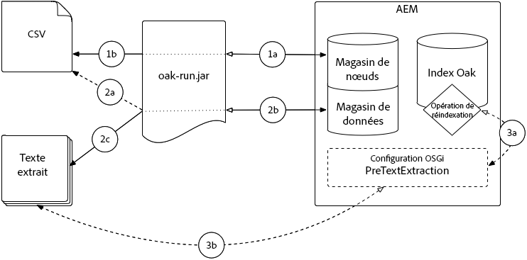

# Bonnes pratiques relatives aux requêtes et à l’indexation{#best-practices-for-queries-and-indexing}

Avec la transition vers Oak dans AEM 6, certains changements majeurs ont été apportés à la façon dont les requêtes et les index sont gérés. Sous Jackrabbit 2, tout le contenu était indexé par défaut et pouvait être interrogé librement. In Oak, indexes must be created manually under the `oak:index` node. Une requête peut être exécutée sans index, mais pour les jeux de données volumineux, elle l’est très lentement et risque même d’être abandonnée.

Cet article contient les informations suivantes : quand créer des index et dans quels cas ils ne sont pas nécessaires ; astuces pour ne pas utiliser de requêtes lorsqu’elles ne sont pas indispensables ; conseils pour optimiser les index et les requêtes.

De plus, assurez-vous de lire la [documentation Oak sur l’écriture de requêtes et d’index](/help/sites-deploying/queries-and-indexing.md). En plus du nouveau concept d’index dans AEM 6, il existe des différences syntaxiques dans les requêtes Oak qui doivent être prises en compte lors de la migration du code à partir d’une installation AEM précédente.

## Quand utiliser des requêtes {#when-to-use-queries}

### Conception du référentiel et de la taxonomie {#repository-and-taxonomy-design}

Lors de la conception de la taxonomie d’un référentiel, plusieurs facteurs doivent être pris en compte. Il s’agit entre autres des contrôles d’accès, de la localisation et de l’héritage des propriétés de composant et de page.

Lors de la conception d’une taxonomie qui tient compte de ces facteurs, il est également important de penser à la « traversabilité » de la conception de l’indexation. Dans ce contexte, la traversabilité est la capacité d’une taxonomie de permettre un accès prévisible au contenu en fonction de son chemin d’accès. Le système est ainsi plus performant et plus facile à gérer qu’un système qui requiert l’exécution d’un grand nombre de requêtes.

De plus, lors de la conception d’une taxonomie, il faut considérer si l’ordre importe. Dans les cas où un ordre explicite n’est pas nécessaire et qu’un grand nombre de nœuds frères est attendu, il est préférable d’utiliser un type de nœud non ordonné tel que `sling:Folder` ou `oak:Unstructured`. In cases where ordering is required, `nt:unstructured` and `sling:OrderedFolder` would be more appropriate.

### Requêtes au sein de composants {#queries-in-components}

Comme les requêtes peuvent être l’une des opérations les plus intensives sur un système AEM, il est conseillé de les exclure de vos composants. L’exécution de plusieurs requêtes chaque fois qu’une page est rendue peut souvent dégrader les performances du système. Deux stratégies sont conseillées pour éviter l’exécution de requêtes lors du rendu de composants : le **parcours transversal des nœuds** et la **pré-récupération des résultats**.

#### Parcours transversal des nœuds {#traversing-nodes}

Si le référentiel est conçu de manière à permettre une connaissance préalable de l’emplacement des données requises, le code qui récupère ces données à partir des chemins nécessaires peut être déployé sans avoir à exécuter des requêtes pour les localiser.

Le rendu de contenu correspondant à une certaine catégorie en est un exemple. L’une des approches consiste à organiser le contenu avec une propriété de catégorie qui peut être interrogée pour remplir un composant présentant des éléments dans une catégorie.

Une meilleure approche consiste à structurer ce contenu dans une taxonomie par catégorie afin qu’il puisse être récupéré manuellement.

Par exemple, si le contenu est stocké dans une taxonomie similaire à :

```xml
/content/myUnstructuredContent/parentCategory/childCategory/contentPiece
```

the `/content/myUnstructuredContent/parentCategory/childCategory` node can simply be retrieved, its children can be parsed and used to render the component.

En outre, lorsque vous traitez un jeu de résultats de petite taille ou homogène, il est parfois plus rapide de parcourir transversalement le référentiel et de rassembler les nœuds nécessaires plutôt que de créer une requête pour renvoyer le même jeu de résultats. En règle générale, les requêtes doivent être évitées dans la mesure du possible.

#### Pré-extraction des résultats {#prefetching-results}

Parfois, le contenu ou les exigences liées à un composant ne permettent pas d’utiliser le parcours transversal des nœuds comme méthode de récupération des données nécessaires. Dans ce cas, les requêtes requises doivent être exécutées avant le rendu du composant afin que des performances optimales soient garanties pour l’utilisateur final.

Si les résultats requis pour le composant peuvent être calculés au moment de sa création et qu’aucun changement de contenu n’est attendu, la requête peut être exécutée lorsque l’auteur applique les paramètres dans la boîte de dialogue.

Si les données ou le contenu changent régulièrement, la requête peut être exécutée selon un calendrier ou via un écouteur pour les mises à jour des données sous-jacentes. Ensuite, les résultats peuvent être enregistrés dans un emplacement partagé au sein du référentiel. Tous les composants qui ont besoin de ces données peuvent ensuite extraire les valeurs de ce nœud unique sans avoir à exécuter une requête lors de l’exécution.

## Optimisation des requêtes {#query-optimization}

Lors de l’exécution d’une requête n’utilisant pas d’index, des avertissements liés au parcours transversal des nœuds sont journalisés. Si la requête va être exécutée souvent, un index doit être créé. Pour déterminer l’index qu’utilise une requête donnée, l’outil [Expliquer la requête](/help/sites-administering/operations-dashboard.md#explain-query) est recommandé. Pour plus d’informations, la journalisation DEBUG peut être activée pour les API de recherche pertinentes.

>[!NOTE]
>
>Une fois la définition de l’index modifiée, l’index doit être recréé (réindexé). Selon la taille de l’index, l’opération peut prendre un certain temps.

Lors de l’exécution de requêtes complexes, la ventilation de la requête en plusieurs requêtes plus petites et la jonction des données par du code après coup est plus performante, dans certains cas. Il est alors recommandé de comparer les performances des deux approches pour déterminer la meilleure option pour le cas d’utilisation en question.

AEM permet d’écrire des requêtes de l’une des trois façons suivantes :

* Via the [QueryBuilder APIs](/help/sites-developing/querybuilder-api.md) (recommended)
* Au moyen de XPath (recommandé)
* En utilisant SQL2

Bien que toutes les requêtes soient converties en SQL2 avant d’être exécutées, la surcharge de conversion de la requête est minimale et, par conséquent, la question majeure à se poser lors du choix d’un langage de requête est la lisibilité et le niveau de confort de l’équipe de développement.

>[!NOTE]
>
>Si QueryBuilder est utilisé, il détermine le nombre de résultats par défaut, opération qui est plus lente dans Oak par rapport aux versions précédentes de Jackrabbit. Pour compenser cela, vous pouvez utiliser le [paramètre guessTotal](/help/sites-developing/querybuilder-api.md#using-p-guesstotal-to-return-the-results).

### Outil Expliquer la requête {#the-explain-query-tool}

Comme pour tout langage de requête, la première étape de l’optimisation d’une requête consiste à comprendre comment elle va être exécutée. Pour effectuer cette activité, vous pouvez utiliser l’[outil Expliquer la requête](/help/sites-administering/operations-dashboard.md#explain-query) qui fait partie du tableau de bord des opérations. Grâce à cet outil, une requête peut être expliquée. Un avertissement s’affiche si la requête engendre des problèmes avec un référentiel volumineux, et indique également sa durée d’exécution et les index qui seront utilisés. L’outil peut également charger une liste de requêtes lentes et courantes qui peuvent ensuite être expliquées et optimisées.

### Journalisation DEBUG pour les requêtes {#debug-logging-for-queries}

Pour obtenir des informations supplémentaires sur la façon dont Oak choisit l’index à utiliser et l’exécution proprement dite de la requête par le moteur de requête, une configuration de journalisation **DEBUG** peut être ajoutée pour les modules suivants :

* org.apache.jackrabbit.oak.plugins.index
* org.apache.jackrabbit.oak.query
* com.day.cq.search

Assurez-vous de supprimer cet enregistreur lorsque vous avez terminé le débogage de votre requête, car il génère une activité intensive et peut, en fin de compte, remplir votre disque de fichiers journaux.

Pour plus d’informations sur la procédure à suivre, voir la [documentation sur la journalisation](/help/sites-deploying/configure-logging.md).

### Statistiques sur les index {#index-statistics}

Lucene enregistre un bean JMX qui fournit des détails sur le contenu indexé, y compris la taille et le nombre de documents présents dans chacun des index.

You can reach it by accessing the JMX Console at `https://server:port/system/console/jmx`

Une fois que vous êtes connecté à la console JMX, recherchez **Lucene Index Statistics** afin de le trouver. D’autres statistiques sur les index sont disponibles dans le MBean **IndexStats**.

Pour les statistiques sur les requêtes, consultez le MBean nommé **Oak Query Statistics**.

Si vous souhaitez explorer davantage vos index au moyen d’un outil comme [Luke](https://code.google.com/p/luke/), vous devez utiliser la console Oak pour vider l’index depuis le `NodeStore` dans un répertoire de système de fichiers. Pour savoir comment procéder, veuillez lire la [documentation Lucene](https://jackrabbit.apache.org/oak/docs/query/lucene.html).

Vous pouvez également extraire les index de votre système au format JSON. In order to do this, you need to access `https://server:port/oak:index.tidy.-1.json`

### Limites de requête {#query-limits}

**Pendant le développement**

Définissez des seuils bas pour `oak.queryLimitInMemory`(par ex. 10000) et oak. `queryLimitReads` (eg. 5000) et optimisez les requêtes coûteuses lorsque vous obtenez une exception UnsupportedOperationException indiquant que la requête lit plus de x nœuds... (The query read more than x nodes...).

Cela permet d’éviter les requêtes gourmandes en ressources (c’est-à-dire non soutenues par un index ou soutenues par un index moins étendu). Par exemple, une requête qui lit 1 million de nœuds entraînerait une augmentation des E/S et aurait un impact négatif sur les performances globales de l’application. Toute requête qui échoue en raison des limites ci-dessus doit être analysée et optimisée.

#### **Post-déploiement** {#post-deployment}

* Surveillez les journaux à la recherche de requêtes déclenchant une traversée de grands noeuds ou une consommation importante de mémoire de tas : &quot;

   * `*WARN* ... java.lang.UnsupportedOperationException: The query read or traversed more than 100000 nodes. To avoid affecting other tasks, processing was stopped.`
   * Optimisez la requête afin de réduire le nombre de nœuds parcourus transversalement.

* Surveillez les journaux à la recherche de requêtes déclenchant une consommation importante de mémoire de tas :

   * `*WARN* ... java.lang.UnsupportedOperationException: The query read more than 500000 nodes in memory. To avoid running out of memory, processing was stopped`
   * Optimisez la requête pour réduire la consommation de mémoire de tas.

Pour AEM versions 6.0 à 6.2, vous pouvez régler le seuil de traversée des noeuds au moyen de paramètres JVM dans le script d’début AEM afin d’éviter que les requêtes volumineuses ne surchargent l’environnement.

Les valeurs recommandées sont les suivantes :

* `-Doak.queryLimitInMemory=500000`
* `-Doak.queryLimitReads=100000`

Dans AEM 6.3, les 2 paramètres ci-dessus sont préconfigurés OOTB et peuvent être conservés dans les paramètres OSGi QueryEngineSettings.

More information available under : [https://jackrabbit.apache.org/oak/docs/query/query-engine.html#Slow_Queries_and_Read_Limits](https://jackrabbit.apache.org/oak/docs/query/query-engine.html#Slow_Queries_and_Read_Limits)

## Conseils pour créer des index efficaces {#tips-for-creating-efficient-indexes}

### Should I Create an Index? {#should-i-create-an-index}

La première question à se poser lors de la création ou de l’optimisation des index est de savoir s’ils sont réellement indispensables pour une situation donnée. Si vous comptez exécuter la requête en question une seule fois ou de manière occasionnelle et à une heure creuse pour le système via un traitement par lots, il peut être préférable de ne pas créer d’index du tout.

Une fois un index créé, chaque fois que les données indexées sont mises à jour, l’index doit également l’être. Étant donné que cela se répercute sur les performances du système, les index ne doivent être créés que s’ils sont indispensables.

De plus, les index ne sont utiles que si les données qu’ils contiennent sont suffisamment uniques pour le justifier. Considérez l’index d’un livre et les rubriques qu’il couvre. Lors de l’indexation d’un ensemble de rubriques composant un texte, il existe généralement des centaines ou des milliers d’entrées. Elles vous permettent de passer en un clin d’œil à un sous-ensemble de pages pour trouver rapidement les informations que vous cherchez. Si cet index ne comportait que deux ou trois entrées, chacune indiquant plusieurs centaines de pages, l’index ne serait pas très utile. Ce même concept s’applique aux index de base de données. S’il n’y a que quelques valeurs uniques, l’index est inutile. Cela étant, s’il est trop volumineux, l’index risque également d’être inutile. Pour consulter les statistiques sur les index, voir [Statistiques sur les index](/help/sites-deploying/best-practices-for-queries-and-indexing.md#index-statistics) ci-dessus.

### Index Lucene ou de propriété ? {#lucene-or-property-indexes}

Les index Lucene ont été introduits dans Oak 1.0.9 et offrent de puissantes optimisations par rapport aux index de propriété introduits avec le lancement initial d’AEM 6. Lorsque vous décidez d’utiliser des index Lucene ou des index de propriété, tenez compte des éléments suivants :

* Les index Lucene offrent beaucoup plus de fonctionnalités que les index de propriété. Par exemple, un index de propriété ne peut indexer qu’une seule propriété alors qu’un index Lucene peut en inclure plusieurs. Pour plus d’informations sur toutes les fonctionnalités disponibles dans les index Lucene, consultez la [documentation](https://jackrabbit.apache.org/oak/docs/query/lucene.html).
* Les index Lucene sont asynchrones. Bien qu’ils améliorent considérablement les performances, ils peuvent également induire un délai entre l’écriture des données dans le référentiel et la mise à jour de l’index. S’il est essentiel que les requêtes renvoient des résultats précis à 100 %, un index de propriété se révèle être nécessaire.
* Étant asynchrones, les index Lucene ne peuvent pas imposer des contraintes d’unicité. Si cela est un impératif, un index de propriété doit être créé.

En règle générale, il est recommandé d’utiliser les index Lucene, à moins qu’il soit impératif d’utiliser des index de propriété afin de bénéficier de niveaux supérieurs de performances et de flexibilité.

### Indexation Solr {#solr-indexing}

AEM prend également en charge l’indexation Solr par défaut. Elle sert principalement à prendre en charge la recherche de texte intégral, mais aussi tout type de requête JCR. Solr doit être pris en compte lorsque les instances AEM n’ont pas la capacité de processeur permettant de gérer le nombre de requêtes requises dans les déploiements intensifs en recherche, tels que les sites web axés sur la recherche avec un nombre élevé d’utilisateurs simultanés. Alternativement, Solr peut être implémenté selon une approche basée sur un robot d’indexation pour exploiter certaines des fonctionnalités les plus avancées de la plateforme.

Les index Solr peuvent être configurés de manière à être exécutés sur le serveur AEM pour les environnements de développement ou déchargés sur une instance distante pour améliorer l’évolutivité de la recherche dans les environnements de production et de simulation. Si le déchargement de la recherche améliore l’évolutivité, il introduit une latence. Pour cette raison, il est déconseillé à moins d’être indispensable. Pour plus d’informations sur la configuration de l’intégration Solr et la création d’index Solr, voir la [documentation Oak sur les requêtes et l’indexation](/help/sites-deploying/queries-and-indexing.md#the-solr-index).

>[!NOTE]
>
>En adoptant l’approche de recherche Solr intégrée, il est possible de décharger l’indexation sur un serveur Solr. Si les fonctionnalités plus avancées du serveur Solr sont utilisées selon une approche de robot d’indexation, un travail de configuration supplémentaire est nécessaire. Headwire a créé un [connecteur open source](https://www.aemsolrsearch.com/#/) pour accélérer ces types d’implémentation.

L’inconvénient de cette approche est que si, par défaut, les requêtes AEM respectent les ACL et masquent ainsi les résultats auxquels un utilisateur n’a pas accès, l’externalisation de la recherche sur un serveur Solr ne prend pas en charge cette fonctionnalité. Si la recherche doit être externalisée de cette manière, il faut veiller à ne pas présenter aux utilisateurs des résultats qu’ils ne doivent pas voir.

Les cas d’utilisation pour lesquels cette approche peut convenir sont les cas où les données de recherche issues de sources multiples doivent éventuellement être agrégées. Prenons l’exemple d’un site hébergé sur AEM et d’un second site hébergé sur une plateforme tierce. Solr peut être configuré de sorte à indexer le contenu des deux sites et à le stocker dans un index agrégé. Cela permet ainsi des recherches inter-sites.

### Considérations relatives à la conception {#design-considerations}

La documentation d’Oak sur les index Lucene présente plusieurs points à prendre en compte lors de la création d’index :

* Si la requête utilise des restrictions de chemin différentes, utilisez `evaluatePathRestrictions`. Cela permet à la requête de renvoyer le sous-ensemble de résultats sous le chemin spécifié, puis de les filtrer en fonction de la requête. Sinon, la requête recherche tous les résultats correspondant aux paramètres de la requête dans le référentiel, puis les filtre en fonction du chemin.
* Si la requête utilise le tri, définissez une propriété explicite pour la propriété triée et définissez `ordered` sur `true`. Vous pouvez ainsi ordonner les résultats en tant que tels dans l’index et vous économisez sur les opérations de tri coûteuses au moment de l’exécution de la requête.

* Ne mettez que ce qui est nécessaire dans l’index. L’ajout de fonctionnalités ou de propriétés inutiles entraîne la croissance de l’index et ralentit les performances.
* Dans un index de propriété, un nom de propriété unique contribue à réduire la taille de l’index, mais dans le cas des index Lucene, l’utilisation de `nodeTypes` et `mixins` est conseillée pour obtenir des index cohérents. Querying a specific `nodeType` or `mixin` will be more performant than querying `nt:base`. When using this approach, define `indexRules` for the `nodeTypes` in question.

* Si vos requêtes ne sont exécutées que sous certains chemins, créez ces index sous ces chemins. Les index ne doivent pas obligatoirement résider à la racine du référentiel.
* Il est recommandé d’utiliser un seul index lorsque toutes les propriétés indexées sont liées pour permettre à Lucene d’évaluer autant de restrictions de propriétés que possible nativement. En outre, une requête n’utilisera qu’un index, même lors d’une jointure.

### CopyOnRead {#copyonread}

Dans les cas où le `NodeStore` est stocké à distance, une option appelée `CopyOnRead` peut être activée. L’option entraîne l’écriture de l’index distant sur le système de fichiers local lors de sa lecture. Cela peut contribuer à améliorer les performances pour les requêtes souvent exécutées sur ces index distants.

L’option est configurée dans la console OSGi sous le service **LuceneIndexProvider** et est par défaut activée à compter d’Oak 1.0.13.

### Suppression d’index {#removing-indexes}

Lors de la suppression d’un index, il est toujours recommandé de le désactiver temporairement en définissant la propriété `type` sur `disabled` et de vérifier que votre application fonctionne correctement avant de le supprimer. Notez qu’un index n’est pas mis à jour lorsqu’il est désactivé. Son contenu risque donc d’être incorrect s’il est réactivé et doit être réindexé.

Après avoir supprimé un index de propriété sur une instance TarMK, le compactage doit être exécuté pour récupérer tout l’espace disque utilisé. Pour les index Lucene, le contenu de l’index réel réside dans le BlobStore, de sorte qu’un nettoyage de mémoire de l’entrepôt de données est nécessaire.

Lors de la suppression d’un index sur une instance MongoDB, le coût de la suppression est proportionnel au nombre de nœuds de l’index. Dans la mesure où la suppression d’un index volumineux peut poser des problèmes, il est recommandé de désactiver l’index et de le supprimer uniquement pendant une fenêtre de maintenance, au moyen d’un outil tel que **oak-mongo.js**. Veuillez noter que cette approche ne s’applique pas à un contenu de nœud normal car elle peut nuire à l’intégrité des données.

>[!NOTE]
>
>Pour plus d’informations sur oak-mongo.js, voir la [section Outils de ligne de commande](https://jackrabbit.apache.org/oak/docs/command_line.html) de la documentation Oak.

## Réindexation {#re-indexing}

This section outlines the **only** acceptable reasons to re-index Oak indexes.

Outside the reasons outlined below, initiating re-indexes of Oak indexes will **not** change behavior or resolve issues, and unncessarily increase load on AEM.

La réindexation des index Oak doit être évitée à moins d’être justifiée par l’une des raisons décrites dans les tableaux ci-dessous.

>[!NOTE]
>
>Avant de consulter les tableaux ci-dessous pour déterminer si la réindexation est utile,** toujours **verify :
>
>* la requête est correcte
>* la requête résout l’index attendu (au moyen de l’outil [Expliquer la requête](/help/sites-administering/operations-dashboard.md#diagnosis-tools)) ;
>* le processus d’indexation est terminé.

>


### Modifications apportées à la configuration d’un index Oak {#oak-index-configuration-changes}

Un changement apporté à la configuration d’un index Oak est la seule condition de non-erreur acceptable justifiant la réindexation des index Oak.

*La réindexation doit toujours être envisagée en tenant compte de son impact sur les performances globales d’AEM et être réalisée pendant les périodes de faible activité ou de maintenance.*

Problèmes possibles et solutions :

* [Modification de la définition d’un index de propriété](#property-index-definition-change)
* [Modification de la définition d’un index Lucene](#lucene-index-definition-change)

#### Modification de la définition d’un index de propriété {#property-index-definition-change}

* S’applique pour/si :

   * Toutes les versions d’Oak
   * Uniquement les [index de propriété](https://jackrabbit.apache.org/oak/docs/query/property-index.html)

* Symptômes :

   * Absence dans les résultats de nœuds existant avant la mise à jour de la définition de l’index de propriété

* Mode de vérification :

   * Déterminez si les nœuds manquants ont été créés/modifiés avant le déploiement de la définition d’index mise à jour.
   * Verify the `jcr:created` or `jcr:lastModified` properties of any missing nodes against the index&#39;s modified time

* Mode de résolution :

   * [Réindexez](/help/sites-deploying/best-practices-for-queries-and-indexing.md#how-to-re-index) l’index Lucene
   * Vous pouvez également modifier par toucher (effectuer une opération d’écriture bénigne) les nœuds manquants

      * Requiert des touchers manuels ou un code personnalisé
      * Requiert la connaissance de l’ensemble des nœuds manquants
      * Requiert la modification de toute propriété sur le nœud

#### Modification de la définition d’un index Lucene {#lucene-index-definition-change}

* S’applique pour/si :

   * Toutes les versions d’Oak
   * Only [lucene indexes](https://jackrabbit.apache.org/oak/docs/query/lucene.html)

* Symptômes :

   * L’index Lucene ne contient pas les résultats attendus
   * Les résultats de la requête ne reflètent pas le comportement attendu de la définition de l’index
   * Le plan de requête n’indique pas la sortie attendue selon la définition de l’index

* Mode de vérification :

   * Verify the index definition was changed using the Lucene Index statistics JMX Mbean (LuceneIndex), method `diffStoredIndexDefinition`.

* Mode de résolution :

   * Versions Oak antérieures à 1.6 :

      * [Réindexez](#how-to-re-index) l’index Lucene
   * Versions Oak ultérieures à 1.6 :

      * Si le contenu existant n’est pas affecté par les modifications, seule une actualisation est nécessaire

         * [Actualisez](https://jackrabbit.apache.org/oak/docs/query/lucene.html#stored-index-definition) l&#39;index lucene en définissant [oak:queryIndexDefinition]@refresh=true
      * Sinon, [réindexez ](#how-to-re-index)l’index Lucene

         * Remarque : L’état de l’index depuis la dernière réindexation effective (ou l’indexation initiale) sera utilisé jusqu’à ce qu’une nouvelle réindexation soit déclenchée


### Situations d’erreur et exceptionnelles {#erring-and-exceptional-situations}

Le tableau suivant décrit les seules situations d’erreur et exceptionnelles acceptables pour lesquelles la réindexation des index Oak résoudra le problème.

Si un problème sur AEM ne correspond pas aux critères décrits ci-dessous, il ne faut **pas** réindexer les index, car cela ne résoudra pas le problème.

Problèmes possibles et solutions :

* [Binaire de l’index Lucene manquant](#lucene-index-binary-is-missing)
* [Binaire de l’index Lucene corrompu](#lucene-index-binary-is-corrupt)

#### Le binaire de l’index Lucene est manquant {#lucene-index-binary-is-missing}

* S’applique pour/si :

   * Toutes les versions d’Oak
   * Only [lucene indexes](https://jackrabbit.apache.org/oak/docs/query/lucene.html)

* Symptômes :

   * L’index Lucene ne contient pas les résultats attendus

* Mode de vérification :

   * Le fichier journal des erreurs contient une exception indiquant qu’un binaire de l’index Lucene est manquant

* Mode de résolution :

   * effectuer une vérification du référentiel de traversée ; par exemple :

      [http://localhost:4502/system/console/repositorycheck](http://localhost:4502/system/console/repositorycheck)

      la navigation dans le référentiel détermine si d&#39;autres fichiers binaires (en plus des fichiers lucene) sont manquants

   * Si des binaires autres que les index Lucene sont manquants, restaurez à partir de la sauvegarde
   * Otherwise, [re-index](#how-to-re-index) *all* lucene indexes
   * Remarque :

      Cette condition indique qu’une banque de données mal configurée peut entraîner un résultat binaire (p. ex. des binaires de ressources).

      Dans ce cas, restaurez la dernière version fonctionnelle connue du référentiel pour récupérer tous les binaires manquants.

#### Binaire de l’index Lucene corrompu {#lucene-index-binary-is-corrupt}

* S’applique pour/si :

   * Toutes les versions d’Oak
   * Only [lucene indexes](https://jackrabbit.apache.org/oak/docs/query/lucene.html)

* Symptômes :

   * L’index Lucene ne contient pas les résultats attendus

* Mode de vérification :

   * The `AsyncIndexUpdate` (every 5s) will fail with an exception in the error.log:

      `...a Lucene index file is corrupt...`

* Mode de résolution :

   * Supprimez la copie locale de l’index Lucene

      1. Arrêtez AEM
      1. Delete the local copy of the lucene index at `crx-quickstart/repository/index`
      1. Redémarrez AEM
   * If this does not resolve the issue, and the `AsyncIndexUpdate` exceptions persist then:

      1. [Réindexez ](#how-to-re-index)l’index erroné
      1. Also file an [Adobe Support](https://helpx.adobe.com/fr/support.html) ticket


### Procédure de réindexation {#how-to-re-index}

>[!NOTE]
>
>In AEM 6.5, [oak-run.jar is the ONLY supported method](/help/sites-deploying/indexing-via-the-oak-run-jar.md#reindexingapproachdecisiontree) for re-indexing on MongoMK or RDBMK repositories.

#### Réindexation des index de propriété {#re-indexing-property-indexes}

* Utilisez [oak-run.jar](/help/sites-deploying/oak-run-indexing-usecases.md#usecase3reindexing) pour réindexer l’index de propriété.
* Définissez la propriété async-reindex sur true dans l’index de propriété 

   * `[oak:queryIndexDefinition]@reindex-async=true`

* Réindexez l’index de propriétés de manière asynchrone à l’aide de la console Web via le MBean **PropertyIndexAsyncReindex** ;

   par exemple,

   [http://localhost:4502/system/console/jmx/org.apache.jackrabbit.oak%3Aname%3Dasync%2Ctype%3DPropertyIndexAsyncReindex](http://localhost:4502/system/console/jmx/org.apache.jackrabbit.oak%3Aname%3Dasync%2Ctype%3DPropertyIndexAsyncReindex)

#### Réindexation des index de propriété Lucene {#re-indexing-lucene-property-indexes}

* Utilisez [oak-run.jar](/help/sites-deploying/oak-run-indexing-usecases.md#usecase3reindexing) pour réindexer l’index de la propriété Lucene.
* Définissez la propriété async-reindex sur true dans l’index de propriété  index de propriété lucene

   * `[oak:queryIndexDefinition]@reindex-async=true`

>[!NOTE]
>
>La section précédente résume et formule les conseils de réindexation Oak à partir de la [documentation d’Apache Oak](https://jackrabbit.apache.org/oak/docs/query/indexing.html#reindexing) dans le contexte d’AEM.

### Pré-extraction de texte des binaires {#text-pre-extraction-of-binaries}

La pré-extraction de texte est un processus permettant d’extraire et de traiter le texte de binaires, directement à partir de l’entrepôt de données au moyen d’un processus isolé, et présente directement le texte extrait aux indexations/réindexations suivantes des index Oak.

* La pré-extraction de texte Oak est recommandée pour indexer/réindexer les index Lucene dans des référentiels contenant d’importants volumes de fichiers (binaires) contenant du texte extractible (par ex. PDF, Word, PPT, TXT, etc.) that qualify for full-text search via deployed Oak indexes; for example `/oak:index/damAssetLucene`.
* La pré-extraction de texte ne bénéficiera qu’à l’indexation/réindexation des index Lucene, et NON pas aux index de propriété Oak, puisque ces derniers n’extraient pas de texte des binaires.
* La pré-extraction de texte a un fort impact positif lors de la réindexation en texte intégral de binaires chargés en texte (PDF, Doc, TXT, etc.), alors que le référentiel d’images ne bénéficie pas de la même efficacité puisque les images ne contiennent pas de texte extractible.
* La pré-extraction de texte effectue l’extraction de texte lié à une recherche de texte intégral de manière très efficace et la présente au processus d’indexation/réindexation d’Oak d’une manière extrêmement efficace à utiliser.

#### When CAN text pre-extraction be used? {#when-can-text-pre-extraction-be-used}

Réindexation d’un index Lucene **existant** avec extraction binaire activée

* Re-indexing processing **all** candidate content in the repository; when the binaries to extract full-text from are numerous or complex, an increased computational burden to performthefull-text extraction is placed on AEM. La pré-extraction de texte déplace les tâches coûteuses en calcul du processus d’extraction de texte vers un processus isolé qui accède directement à l’entrepôt de données d’AEM, évitant ainsi la surcharge et les conflits de ressources dans AEM.

Prise en charge du déploiement d’un **nouvel** index Lucene sur AEM avec extraction de binaires activée

* Lorsqu’un nouvel index (avec extraction de binaires activée) est déployé dans AEM, Oak indexe automatiquement tout le contenu candidat sur l’indexation en texte intégral asynchrone suivante. Pour les mêmes raisons que celles décrites dans la réindexation ci-dessus, cela peut engendrer une charge excessive dans AEM.

#### Quand la pré-extraction de texte ne peut-elle PAS être utilisée ? {#when-can-text-pre-extraction-not-be-used}

La pré-extraction de texte ne peut pas être utilisée pour un nouveau contenu ajouté au référentiel ; elle n’est d’ailleurs pas nécessaire.

Le nouveau contenu ajouté au référentiel sera indexé de façon naturelle et incrémentielle par le processus d’indexation en texte intégral asynchrone (par défaut, toutes les 5 secondes).

Dans le cadre du fonctionnement normal d’AEM, par exemple le chargement de ressources via l’interface utilisateur web ou l’acquisition programmée de ressources, AEM indexe automatiquement et de manière incrémentielle le nouveau contenu binaire. Comme la quantité de données est incrémentielle et relativement petite (environ l’équivalent d’une quantité de données pouvant persister dans le référentiel pendant 5 secondes), AEM peut effectuer l’extraction de texte intégral à partir des binaires lors de l’indexation sans dégrader les performances globales du système.

#### Conditions préalables à l’utilisation de la pré-extraction de texte {#prerequisites-to-using-text-pre-extraction}

* Vous envisagez de réindexer un index Lucene qui effectue une extraction de binaires en texte intégral ou de déployer un nouvel index qui va effectuer cette même opération sur un contenu existant
* Le contenu (binaires) à partir duquel pré-extraire le texte doit résider dans le référentiel
* Une fenêtre de maintenance permettant de générer le fichier CSV ET d’effectuer la réindexation finale
* Version d’Oak : 1.0.18+, 1.2.3+
* [oak-run.](https://mvnrepository.com/artifact/org.apache.jackrabbit/oak-run/)jarversion 1.7.4+
* Un dossier/partage de système de fichiers pour stocker le texte extrait accessible à partir des instances d&#39;AEM d&#39;indexation

   * La config OSGi de pré-extraction de texte requiert un chemin d’accès au système de fichiers vers les fichiers texte extraits. Ils doivent donc être accessibles directement depuis l’instance AEM (lecteur local ou montage de partage de fichiers).

#### Procédure de pré-extraction de texte {#how-to-perform-text-pre-extraction}

>[!NOTE]
>
>***Les commandes oak-run.jar décrites ci-dessous sont énumérées en détail à l’adresse [https://jackrabbit.apache.org/oak/docs/query/pre-extract-text.html.](https://jackrabbit.apache.org/oak/docs/query/pre-extract-text.html)***
>
>Le schéma ci-dessus et les étapes ci-dessous servent à expliquer et à compléter les étapes de pré-extraction de texte technique décrites dans la documentation d’Apache Oak.



**Génération de la liste du contenu à pré-extraire**

*Exécutez l’étape 1 (a-b) au cours d’une fenêtre de maintenance/période de faible utilisation lorsque le magasin de nœuds est parcouru transversalement durant cette opération, ce qui peut entraîner une charge importante sur le système.*

1a. Exécutez `oak-run.jar --generate` pour créer une liste de nœuds dont le texte sera pré-extrait.

1b. La liste des nœuds (1a) est stockée dans le système de fichiers sous la forme d’un fichier CSV.

Note that the entire Node Store is traversed (as specified by the paths in the oak-run command) every time `--generate` is executed, and a **new** CSV file is created. The CSV file is **not** re-used between discrete executions of the text pre-extraction process (Steps 1 - 2).

**Pré-extraction du texte dans le système de fichiers**

*L’étape 2 (a-c) peut être effectuée pendant le fonctionnement normal d’AEM, car elle n’interagit qu’avec l’entrepôt de données.*

2a. Exécutez `oak-run.jar --tika` pour pré-extraire le texte des nœuds binaires énumérés dans le fichier CSV généré dans (1b).

2b. Le processus lancé à l’étape (2a) accède directement aux nœuds binaires définis dans le fichier CSV de l’entrepôt de données et extrait le texte.

2c.  Le texte extrait est stocké sur un système de fichiers dans un format que peut acquérir le processus de réindexation d’Oak (3a).

Le texte pré-extrait est identifié dans le fichier CSV par l’empreinte binaire. Si le fichier binaire est le même, le même texte pré-extrait peut être utilisé sur les instances AEM. Puisque AEM Publish est généralement un sous-ensemble d’AEM Author, le texte pré-extrait d’AEM Author peut souvent être utilisé pour réindexer AEM Publish (en supposant qu’AEM Publish ait accès aux fichiers texte extraits).

Le texte pré-extrait peut être ajouté de manière incrémentielle au fil du temps. La pré-extraction du texte ignore l’extraction pour les binaires précédemment extraits. Il est donc recommandé de conserver le texte pré-extrait au cas où la réindexation devrait se reproduire dans le futur (en supposant que le contenu extrait ne soit pas trop volumineux. Si c’est le cas, évaluez la compression du contenu entre temps, car le texte se compresse bien).

**Réindexation des index Oak, en recherchant le texte intégral à partir de fichiers texte extraits**

*Exécutez la réindexation (étapes 3a-b) au cours d’une période de maintenance/faible utilisation lorsque le magasin de nœuds est parcouru transversalement durant cette opération, ce qui peut entraîner une charge importante sur le système.*

3a. La [réindexation](#how-to-re-index) des index Lucene est invoquée dans AEM.

3b. La configuration OSGi d&#39;Apache Jackrabbit Oak DataStore PreExtraitsTextProvider (configurée pour pointer vers le texte extrait via un chemin d&#39;accès au système de fichiers) indique à Oak de trouver du texte intégral à partir des fichiers extraits, et évite d&#39;accéder directement aux données stockées dans le référentiel et de les traiter.

