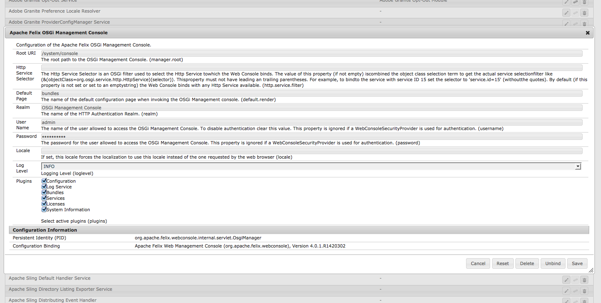

# Configuration d’OSGi{#configuring-osgi}

Le framework [OSGi](https://www.osgi.org/) est un élément fondamental de la pile technologique d’Adobe Experience Manager (AEM). Il est utilisé pour contrôler les lots composites d’AEM et leur configuration.

OSGi « *fournit les primitives normalisées qui permettent de construire des applications à partir de petits composants, réutilisables et collaboratifs. Ces composants peuvent être créés dans une application et déployés*&quot;.

Cela permet une gestion conviviale des lots , car ils peuvent être arrêtés, installés et démarrés individuellement. Les interdépendances sont gérées automatiquement. Chaque composant OSGi (voir la [spécification OSGi](https://www.osgi.org/Specifications/HomePage)) est contenu dans l’un des différents lots.

Vous pouvez gérer les paramètres de configuration de ces lots en :

* utilisant la [console web Adobe CQ](#osgi-configuration-with-the-web-console) ;
* utilisant les [fichiers de configuration](#osgi-configuration-with-configuration-files) ;
* configuring [content-nodes ( `sling:OsgiConfig`) in the repository](#osgi-configuration-in-the-repository)

L’une ou l’autre des méthodes peut être utilisée bien qu’il existe des différences subtiles, principalement en relation avec les [modes d’exécution](/help/sites-deploying/configure-runmodes.md) :

* [Console web Adobe CQ](#osgi-configuration-with-the-web-console)

   * La console web est l’interface standard pour la configuration OSGi. Elle fournit une interface utilisateur, permettant de modifier les différentes propriétés, dans laquelle vous pouvez sélectionner des valeurs à partir de listes prédéfinies.

      De ce fait, il s’agit de la méthode la plus simple à utiliser.

   * Toutes les configurations effectuées avec la console web sont appliquées immédiatement et s’appliquent à l’instance en cours, quel que soit le mode d’exécution en cours ou toute modification ultérieure du mode d’exécution.

* [fichiers de configuration](#osgi-configuration-with-configuration-files)

   * Contiennent les paramètres définis dans la console web.
   * Peuvent être inclus dans des modules de contenu pour une utilisation dans d’autres instances.

* [content-nodes (sling:osgiConfig) du référentiel](#osgi-configuration-in-the-repository)

   * Nécessite une configuration manuelle à l’aide de CRXDE Lite.
   * En raison des conventions de dénomination des nœuds `sling:OsgiConfig`, vous pouvez lier la configuration à un [mode d’exécution](/help/sites-deploying/configure-runmodes.md) spécifique. Vous pouvez même enregistrer des configurations pour plusieurs modes d’exécution dans le même référentiel.
   * Toutes les configurations appropriées sont appliquées immédiatement (en fonction du mode d’exécution).

Quelle que soit la méthode utilisée, toutes ces méthodes de configuration :

* garantissent que la copie ou la réplication du contenu du référentiel recrée des configurations identiques ;
* permettent d’extraire des configurations de FileVault ou Subversion à des fins de sécurité ou d’autres mises à jour ;
* peuvent être enregistrées dans des modules à utiliser lors de la configuration d’autres instances ;
* permettent d’effectuer des déploiements de configuration à l’aide de scripts afin de propager les détails de la configuration.

>[!NOTE]
>
>Les détails de certains paramètres importants sont répertoriés dans les [paramètres de la configuration OSGi.](/help/sites-deploying/osgi-configuration-settings.md)

## Configuration OSGi avec la console web {#osgi-configuration-with-the-web-console}

La [console web](/help/sites-deploying/web-console.md) d’AEM fournit une interface normalisée pour la configuration des lots. L’onglet **Configuration** est utilisé pour la configuration des lots OSGi et constitue, par conséquent, le mécanisme sous-jacent de la configuration des paramètres système d’AEM.

Toute modification apportée est immédiatement appliquée à la configuration OSGi concernée. Aucun redémarrage n’est requis.

>[!NOTE]
>
>Changes made in the web console are saved in the repository as [configuration files](#osgi-configuration-with-configuration-files). Ceux-ci peuvent être inclus dans les modules de contenu pour être réutilisés dans d’autres installations.

>[!NOTE]
>
>Sur la console web, toutes les descriptions qui mentionnent les paramètres par défaut sont relatives aux paramètres Sling par défaut.
>
>Adobe Experience Manager possède ses propres paramètres par défaut et le jeu de paramètres par défaut peut différer de ceux documentés dans la console.

Pour mettre à jour une configuration avec la console web :

1. Accédez à l’onglet **Configuration** de la console web en :

   * Ouvrant la console web à partir du lien du menu **Outil -> Opérations**. Après vous être connecté à la console, vous pouvez utiliser le menu déroulant de :

      **les lots OSGi >**

   * L&#39;URL directe ; par exemple :

      `http://localhost:4502/system/console/configMgr`
   Une liste s’affiche.

1. Sélectionnez le lot que vous souhaitez configurer en :

   * cliquant sur l’icône **Modifier** correspondant à ce lot ;
   * cliquant sur le **Nom** du lot.

1. Une boîte de dialogue s’ouvre. Dans cette dernière, vous pouvez apporter les modifications appropriées, par exemple, définir le **Niveau de journal** sur `INFO` :

   

   >[!NOTE]
   >
   >Les mises à jour sont enregistrées dans le référentiel sous la forme de [fichiers de configuration](#osgi-configuration-with-configuration-files). To locate these afterwards, (e.g. to include in a content package for use on another instance) you should make a note of the persistent identity ( `PID`).

1. Cliquez sur **Save**.

   Les modifications sont immédiatement appliquées à la configuration OSGi correspondante du système en cours d’exécution. Aucun redémarrage n’est requis.

   >[!NOTE]
   >
   >You can now locate the related [configuration file(s)](#osgi-configuration-with-configuration-files); for example, to include in a content package for use on another instance.

## Configuration OSGi avec les fichiers de configuration {#osgi-configuration-with-configuration-files}

Configuration changes made using the Web Console are persisted in the repository as configuration files ( `.config`) under:

`/apps`

Ces fichiers peuvent être inclus dans des modules de contenu et réutilisés dans d’autres instances.

>[!NOTE]
>
>Le format des fichiers de configuration est très spécifique. Pour plus d’informations, voir la [ documentation de Sling Apache.](https://sling.apache.org/documentation/development/slingstart.html#default-configuration-format)
>
>Pour cette raison, il est recommandé de créer et de mettre à jour le fichier de configuration en effectuant des modifications réelles dans la console web.

La console web n’indique pas à quel emplacement les modifications ont été enregistrées dans le référentiel, mais elles peuvent être facilement localisées :

1. Créez le fichier de configuration en [effectuant une modification initiale dans la console web](#osgi-configuration-with-the-web-console).
1. Ouvrez CRXDE Lite.
1. Dans le menu **Outils**, sélectionnez **Requête...**.
1. Envoyez une requête de **Type** `SQL` afin de rechercher le PID de la configuration que vous avez mise à jour.

   Par exemple, la **console de gestion Apache Felix OSGi** possède l’identité persistante (PID) :

   `org.apache.felix.webconsole.internal.servlet.OsgiManager`

   Ainsi, la requête SQL pourrait être :

   ```shell
   select * from nt:base where jcr:path like '/apps/%' and contains(*, 'org.apache.felix.webconsole.internal.servlet.OsgiManager')
   ```

1. Le nœud du fichier de configuration s’affiche.

   Pour l’exemple ci-dessus :

   `/apps/system/config/org.apache.felix.webconsole.internal.servlet.OsgiManager.config`

   >[!CAUTION]
   >
   >Vous pouvez ouvrir ce fichier pour afficher les modifications, mais, pour éviter les erreurs de frappe, il est recommandé d’apporter les modifications dans la console.

1. Vous pouvez maintenant créer un module de contenu comportant ce nœud et l’utiliser comme requis dans vos autres instances.

## Configuration OSGi dans le référentiel {#osgi-configuration-in-the-repository}

Outre l’utilisation de la console web, vous pouvez également définir des détails de la configuration dans le référentiel. Vous pouvez ainsi configurer facilement les différents modes d’exécution.

Vous réalisez ces configurations en créant des nœuds `sling:OsgiConfig` dans le référentiel à titre de références dans le système. Ces nœuds reflètent les configurations OSGi et forment une interface utilisateur permettant d’y accéder. Pour mettre à jour les données de configuration, mettez à jour les propriétés du nœud.

Si vous modifiez les données de configuration dans le référentiel, les modifications sont immédiatement appliquées à la configuration OSGi appropriée, comme si les modifications avaient été effectuées à l’aide de la console web, avec les vérifications de validation et de cohérence adéquates. This also applies to the action of copying a configuration from `/libs/` to `/apps/`.

Comme le même paramètre de configuration peut être situé à plusieurs endroits, le système :

* searches for all nodes of type `sling:OsgiConfig`
* filtre selon le nom du service ;
* filtre selon le mode d’exécution.

>[!NOTE]
>
>Lisez aussi [comment définir une configuration basée sur le référentiel pour une instance spécifique uniquement](https://helpx.adobe.com/experience-manager/kb/RunModeDependentConfigAndInstall.html).

### Ajout d’une nouvelle configuration au référentiel {#adding-a-new-configuration-to-the-repository}

#### Ce que vous devez savoir {#what-you-need-to-know}

Pour ajouter une nouvelle configuration au référentiel, vous devez connaître ou savoir ce qui suit :

1. The **Persistent Identity** (PID) of the service.

   Reference the **Configurations** field in the Web console. The name is shown in brackets after the bundle name (or in the **Configuration Information** towards the bottom of the page).

   Par exemple, créez un noeud `com.day.cq.wcm.core.impl.VersionManagerImpl.` pour configurer **AEM WCM Version Manager**.

   

1. Whether a specific [run mode](/help/sites-deploying/configure-runmodes.md) is required. Créez le dossier :

   * `config` - pour tous les modes d&#39;exécution
   * `config.author` - pour l&#39;environnement auteur
   * `config.publish` - pour l&#39;environnement de publication
   * `config.<run-mode>` - le cas échéant

1. Whether a **Configuration** or **Factory Configuration** is necessary.
1. Les paramètres individuels à configurer y compris les définitions de paramètres existantes qui devront être recréées.

   Référencez le champ des paramètres individuels dans la console web. Le nom s’affiche entre parenthèses pour chaque paramètre.

   Par exemple, créez une propriété.
   `versionmanager.createVersionOnActivation` pour configurer **Créer une version sur Activation**.

   

1. Does a configuration already exist in `/libs`? To list all configurations in your instance, use the **Query** tool in CRXDE Lite to submit the following SQL query:

   `select * from sling:OsgiConfig`

   Si tel est le cas, cette configuration peut être copiée dans ` /apps/<yourProject>/`, puis personnalisée dans le nouvel emplacement.

#### Création de la configuration dans le référentiel {#creating-the-configuration-in-the-repository}

Pour ajouter la nouvelle configuration au référentiel :

1. Utilisez CRXDE Lite pour accéder à :

   ` /apps/<yourProject>`

1. If not already existing, create the `config` folder ( `sling:Folder`):

   * `config` : applicable à tous les modes d’exécution
   * `config.<run-mode>` - spécifique à un mode d&#39;exécution particulier

1. Sous ce dossier; créez un nœud :

   * Type : `sling:OsgiConfig`
   * Nom : l&#39;identité persistante (PID);

      par exemple pour AEM WCM Version Manager utilisé `com.day.cq.wcm.core.impl.VersionManagerImpl`
   >[!NOTE]
   >
   >When making a Factory Configuration append `-<identifier>` to the name.
   >
   >Comme dans : `org.apache.sling.commons.log.LogManager.factory.config-<identifier>`
   >
   >Where `<identifier>` is replaced by free text that you (must) enter to identify the instance (you cannot omit this information); for example:
   >
   >`org.apache.sling.commons.log.LogManager.factory.config-MINE`

1. Pour chaque paramètre que vous souhaitez configurer, créez une propriété sur ce nœud :

   * Nom : nom du paramètre tel qu’il apparaît dans la console web. Il est indiqué entre parenthèses à la fin de la description du champ. Par exemple, pour une `Create Version on Activation` utilisation `versionmanager.createVersionOnActivation`
   * Type : selon le cas.
   * Valeur : selon les besoins.

   Il vous suffit de créer des propriétés pour les paramètres que vous voulez configurer. Les autres prendront toujours les valeurs par défaut définies par AEM.

1. Enregistrez toutes les modifications.

   Les modifications sont appliquées dès que le nœud est mis à jour en redémarrant le service (comme avec les modifications apportées dans la console web).

>[!CAUTION]
>
>Vous ne devez rien modifier dans le chemin `/libs`.

>[!CAUTION]
>
>Le chemin complet d’une configuration doit être correct pour être lu au démarrage.

## Détails de la configuration {#configuration-details}

### Séquence de résolution au démarrage {#resolution-order-at-startup}

L’ordre de priorité suivant est utilisé :

1. Repository nodes under `/apps/*/config...`.either with type `sling:OsgiConfig` or property files.

1. Repository nodes with type `sling:OsgiConfig` under `/libs/*/config...`. (définitions prêtes à l’emploi).

1. Tout `.config` fichier de `<*cq-installation-dir*>/crx-quickstart/launchpad/config/...`. sur le système de fichiers local.

This means that a generic configuration in `/libs` can be masked by a project specific configuration in `/apps`.

### Séquence de résolution lors de l’exécution {#resolution-order-at-runtime}

Les modifications de la configuration apportées pendant l’exécution du système déclenchent un rechargement avec la configuration modifiée.

Puis, l’ordre de priorité suivant s’applique :

1. La modification d’une configuration dans la console web prend effet immédiatement car elle a priorité lors de l’exécution.
1. Modifying a configuration in `/apps` will take immediate effect.
1. Modifying a configuration in `/libs` will take immediate effect, unless it is masked by a configuration in `/apps`.

### Résolution de plusieurs modes d’exécution {#resolution-of-multiple-run-modes}

Pour les configurations spécifiques au mode d’exécution, plusieurs modes d’exécution peuvent être combinés. Par exemple, vous pouvez créer des dossiers de configuration dans le style suivant :

`/apps/*/config.<runmode1>.<runmode2>/`

Les configurations de ces dossiers sont appliquées si tous les modes d’exécution correspondent à un mode d’exécution défini au démarrage.

For example, if an instance was started with the run modes `author,dev,emea`, configuration nodes in `/apps/*/config.emea`, `/apps/*/config.author.dev/` and `/apps/*/config.author.emea.dev/` will be applied, while configuration nodes in `/apps/*/config.author.asean/` and `/config/author.dev.emea.noldap/` will not be applied.

Si plusieurs configurations correspondant au même PID sont applicables, la configuration comportant le nombre le plus élevé de modes d’exécution correspondants est appliquée.

For example, if an instance was started with the run modes `author,dev,emea`, and both `/apps/*/config.author/` and `/apps/*/config.emea.author/` define a configuration for
`com.day.cq.wcm.core.impl.VersionManagerImpl`, the configuration in `/apps/*/config.emea.author/` will be applied.

La granularité de cette règle se trouve au niveau du PID.
You cannot define some properties for the same PID in `/apps/*/config.author/` and more specific ones in `/apps/*/config.emea.author/` for the same PID.
La configuration comportant le nombre le plus élevé de modes d’exécution correspondants est effective pour tout le PID.

### Configurations standard {#standard-configurations}

La liste suivante présente une petite sélection de configurations disponibles dans le référentiel (pour une installation standard) :

* Auteur - AEM filtre WCM :

   `libs/wcm/core/config.author/com.day.cq.wcm.core.WCMRequestFilter`

* Publier - AEM Filtre WCM :

   `libs/wcm/core/config.publish/com.day.cq.wcm.core.WCMRequestFilter`

* Publier - Statistiques de page WCM AEM :

   `libs/wcm/core/config.publish/com.day.cq.wcm.core.stats.PageViewStatistics`

>[!NOTE]
>
>As these configurations reside in `/libs` they must not be edited directly, but copied to your application area ( `/apps`) before customization.

Pour répertorier tous les nœuds de configuration de votre instance, utilisez la fonctionnalité **Requête** de CRXDE Lite pour envoyer la requête SQL suivante :

`select * from sling:OsgiConfig`

### Persistance de la configuration {#configuration-persistence}

* Si vous modifiez une configuration via la console Web, elle est (généralement) consignée dans le référentiel à l&#39;adresse suivante :

   `/apps/{somewhere}`

   * Par défaut `{somewhere}` est `system/config` ainsi écrit pour la configuration

      `/apps/system/config`

   * Cependant, si vous modifiez une configuration qui venait initialement d’un autre emplacement du référentiel : par exemple :

      /libs/foo/config/someconfig

      Ensuite, la configuration mise à jour est écrite sous l&#39;emplacement d&#39;origine ; par exemple :

      `/apps/foo/config/someconfig`

* Settings that are changed by `admin` are saved in `*.config` files under:

   ```
      /crx-quickstart/launchpad/config
   ```

   * Il s’agit de la zone de données privée de l’administrateur de la configuration OSGi qui contient tous les détails de la configuration spécifiés par `admin`, quel que soit leur mode d’entrée dans le système.
   * Il s’agit d’un détail d’implémentation et vous ne devez jamais modifier ce répertoire directement.
   * Cependant, il est utile de connaître l’emplacement de ces fichiers de configuration afin que vous puissiez en effectuer des copies à des fins de sauvegarde et/ou d’installation multiple :

      * Console de gestion OSGi Apache Felix

         `../crx/org/apache/felix/webconsole/internal/servlet/OsgiManager.config`

      * Référentiel client Sling CRX

         `../com/day/crx/sling/client/impl/CRXSlingClientRepository/<pid-nr>.config`

>[!CAUTION]
>
>Vous ***ne devez jamais*** modifier les dossiers ou fichiers sous :
>
>`/crx-quickstart/launchpad/config`

