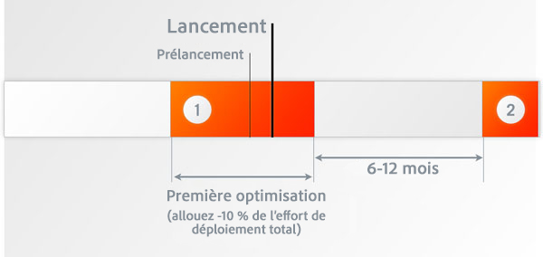
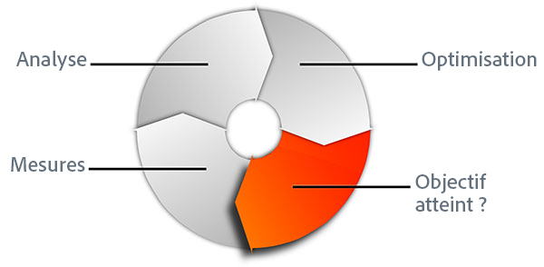
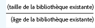
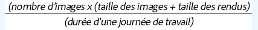
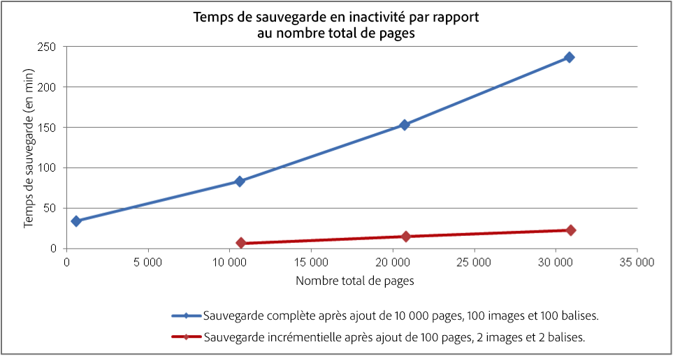
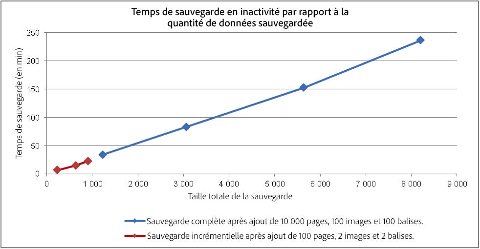
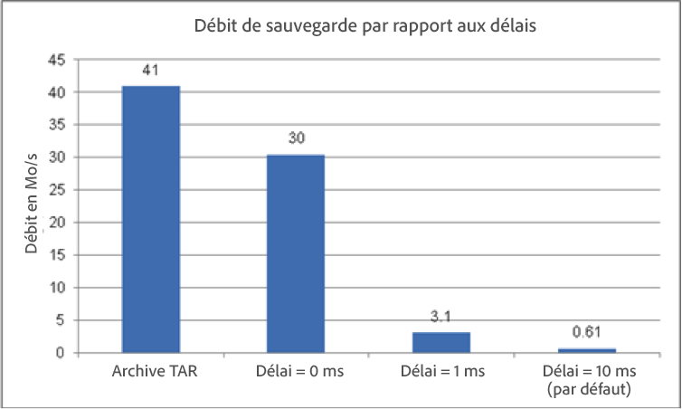

# Optimisation des performances {#performance-optimization}

>[!NOTE]
>
>Pour obtenir des instructions générales sur les performances, lisez la page [Instructions sur les performances](/help/sites-deploying/performance-guidelines.md).
>
>Pour plus d’informations sur le dépannage et la résolution des problèmes de performances, voir aussi l’[arborescence des performances](/help/sites-deploying/performance-tree.md).
>
>De plus, vous pouvez consulter un article de la base de connaissances sur les [conseils d&#39;optimisation des performances.](https://helpx.adobe.com/fr/experience-manager/kb/performance-tuning-tips.html)

L’un des problèmes majeurs est le temps que met votre site web pour répondre aux requêtes des visiteurs. Bien que cette valeur varie pour chaque demande, une valeur cible moyenne peut être définie. Une fois que cette valeur se révèle être à la fois réalisable et gérable, elle peut être utilisée pour surveiller les performances du site web et indiquer le développement d’éventuels problèmes.

Les temps de réponse que vous ciblerez seront différents dans les environnements de création et de publication, reflétant les différentes caractéristiques de l’audience cible :

## Environnement de création {#author-environment}

Cet environnement est utilisé par les auteurs qui créent et mettent à jour du contenu. Il doit prendre en charge un petit nombre d’utilisateurs qui génèrent chacun un nombre élevé de demandes gourmandes en performances lors de la mise à jour des pages de contenu et des éléments individuels de ces pages.

## Environnement de publication {#publish-environment}

Cet environnement intègre le contenu que vous mettez à la disposition de vos utilisateurs. Dans ce cas, le nombre de demandes est encore plus élevé et la vitesse est tout aussi vitale, mais comme la nature des demandes est moins dynamique, des mécanismes supplémentaires d&#39;amélioration des performances peuvent être appliqués ; comme la mise en cache du contenu ou l’équilibrage de charge.

>[!NOTE]
>
>* Une fois l’optimisation des performances configurée, suivez les procédures dans [Tough Day](/help/sites-developing/tough-day.md) pour tester l’environnement en le soumettant à une charge importante.
>* Voir aussi [Conseils pour le réglage des performances.](https://helpx.adobe.com/experience-manager/kb/performance-tuning-tips.html)


## Méthodologie d’optimisation des performances {#performance-optimization-methodology}

Une méthodologie d&#39;optimisation des performances pour les projets AEM peut être résumée en cinq règles très simples qui peuvent être suivies pour éviter les problèmes de performance du début :

1. [Planification de l’optimisation](#planning-for-optimization)
1. [Simulation de la réalité](#simulate-reality)
1. [Établissement d’objectifs solides](#establish-solid-goals)
1. [Maintien de la pertinence](#stay-relevant)
1. [Cycles d’itération agile](#agile-iteration-cycles)

Ces règles, dans une large mesure, s&#39;appliquent aux projets Web en général et sont pertinentes pour les gestionnaires de projets et les administrateurs système afin de s&#39;assurer que leurs projets ne seront pas confrontés à des problèmes de performance au moment du lancement.

### Planification de l’optimisation {#planning-for-optimization}



Environ 10 % des efforts liés à un projet doivent être planifiés en vue de la phase d’optimisation des performances. Bien sûr, les exigences d’optimisation des performances dépendront du niveau de complexité d’un projet donné et de l’expérience de l’équipe de développement. Même si votre projet peut (au final) ne pas consommer tout le temps alloué, il est recommandé de toujours planifier l’optimisation des performances dans la zone géographique proposée.

Chaque fois que cela est possible, un projet doit d&#39;abord être lancé en douceur à une audience limitée afin de collecter l&#39;expérience réelle et d&#39;effectuer d&#39;autres optimisations, sans la pression supplémentaire qui suit une annonce complète.

Une fois que le site est « en ligne », l’optimisation des performances se poursuit. C’est le moment où vous faites face à la réelle charge que subit votre système. Il est important de prévoir des ajustements supplémentaires après le lancement.

Dans la mesure où la charge de votre système change et que les profils de performances de votre système évoluent au fil du temps, il faut prévoir une « mise au point » ou un « contrôle d’intégrité » des performances tous les 6 à 12 mois.

### Simulation de la réalité  {#simulate-reality}


Si vous avez mis en ligne un site web et que vous identifiez, après le lancement, des problèmes de performances, une seule raison peut les expliquer : vos tests de charge et de performance n’ont pas simulé la réalité le plus fidèlement possible.

Simuler la réalité est difficile et le degré d&#39;effort que vous voudrez raisonnablement investir pour devenir &quot;réel&quot; dépend de la nature de votre projet. Cette réalité signifie non seulement un « code réel » et un « trafic réel », mais aussi du « contenu réel », en particulier en ce qui concerne la taille et la structure. Gardez à l’esprit que vos modèles peuvent se comporter différemment selon la taille et la structure du référentiel.

### Établissement d’objectifs solides  {#establish-solid-goals}


Il ne faut pas sous-estimer l&#39;importance d&#39;établir correctement les objectifs de rendement. Souvent, une fois que les gens se concentrent sur des objectifs de rendement précis, il est très difficile de changer ces objectifs par la suite, même s&#39;ils sont fondés sur des hypothèses délirantes.

L’établissement d’objectifs de performances réalisables et viables est vraiment l’un des aspects les plus délicats. Il est souvent préférable de se fier à des journaux et des repères réels d’un site web comparable (par exemple, le prédécesseur du nouveau site web).

### Maintien de la pertinence  {#stay-relevant}


Il est important de résoudre un seul goulot d’étranglement à la fois. Si vous essayez de faire plusieurs choses en parallèle sans valider l’impact de chaque optimisation, vous perdrez toute trace de la mesure d’optimisation qui a réellement contribué à une amélioration.

### Cycles d’itération agile  {#agile-iteration-cycles}



L’optimisation des performances est un processus itératif qui implique des activités de mesure, d’analyse, d’optimisation et de validation jusqu’à ce que l’objectif soit atteint. Afin de prendre correctement en compte cet aspect, implémentez un processus de validation souple dans la phase d&#39;optimisation plutôt qu&#39;un processus de test plus intensif à poids après chaque itération.

Cela signifie notamment que le développeur implémentant l’optimisation doit disposer d’un moyen rapide pour savoir si l’optimisation a déjà atteint l’objectif. Ces informations sont précieuses, car une fois l’objectif atteint, l’optimisation est terminée.

## Consignes de performances de base  {#basic-performance-guidelines}

De manière générale, vos demandes html non mises en cache doivent être inférieures à 100 ms. Plus précisément, les éléments suivants peuvent servir de lignes directrices :

* 70 % des demandes de pages doivent être traitées en moins de 100 ms.
* 25 % des demandes de pages doivent recevoir une réponse dans un délai de 100 à 300 ms.
* 4 % des demandes de pages doivent recevoir une réponse dans un délai de 300 à 500 ms.
* 1 % des demandes de pages doivent recevoir une réponse dans un délai de 500 à 1000 ms.
* Aucune page ne doit répondre en plus d’une seconde.

Les chiffres ci-dessus supposent les conditions suivantes :

* Mesuré lors de la publication (sans frais généraux liés à un environnement de création)
* Mesuré sur le serveur (sans surcharge réseau)
* Non mis en cache (aucun cache de sortie AEM, aucun cache de répartiteur)
* Uniquement pour les éléments complexes avec de nombreuses dépendances (HTML, JS, PDF, ...)
* Aucune autre charge sur le système

Un certain nombre de difficultés contribuent fréquemment aux problèmes de performances. Elles portent essentiellement sur les aspects suivants :

* Inefficacité de la mise en cache du répartiteur
* Utilisation de requêtes dans des modèles d’affichage normaux.

Les réglages au niveau de la JVM et du système d’exploitation n’ont généralement pas d’effets majeurs sur les performances et doivent donc être effectués à la fin du cycle d’optimisation.

La structure d’un référentiel de contenu peut également se répercuter sur les performances. Pour de meilleures performances, le nombre de nœuds enfants associés à des nœuds individuels dans un référentiel de contenu doit être inférieur à 1 000 (en règle générale).

Lors d’une activité ordinaire d’optimisation des performances, les ressources suivantes sont d’une très grande utilité :

* La page `request.log`
* Délai basé sur les composants
* Dernier mais non le moindre profileur java.

### Performances lors du chargement et de la modification des ressources numériques {#performance-when-loading-and-editing-digital-assets}

En raison de l’important volume de données impliquées lors du chargement et de la modification de ressources numériques, les performances peuvent poser un problème.

À cet égard, deux composants matériels affectent les performances :

* CPU : plusieurs coeurs permettent un travail plus fluide lors du transcodage
* Disques durs : les disques RAID parallèles ont le même effet

Pour améliorer les performances, vous pouvez prendre en compte les éléments suivants :

* Combien d’éléments seront téléchargés par jour ? Une bonne estimation peut être basée sur :



* Période pendant laquelle les modifications seront effectuées (généralement la durée de la journée de travail, plus pour les opérations internationales).
* la taille moyenne des images chargées (et la taille des rendus générés par image) en mégaoctets.
* Déterminez le débit de données moyen :



* 80 % de toutes les modifications seront effectuées dans 20 % des cas, donc en période de trafic élevé, attendez-vous à un débit moyen quadruplé. C’est votre objectif de performance.

## Surveillance des performances {#performance-monitoring}

Les performances (ou leur insuffisance) sont l’une des premières choses que vos utilisateurs remarquent. Aussi, pour toute application dotée d’une interface utilisateur, les performances sont un facteur déterminant. Pour optimiser les performances de votre installation AEM vous devez surveiller divers attributs de l’instance et de son comportement.

Pour plus d&#39;informations sur la manière d&#39;effectuer la surveillance des performances, voir [Surveillance des performances](/help/sites-deploying/monitoring-and-maintaining.md#monitoring-performance).

Les difficultés à l’origine de problèmes de performance sont souvent difficiles à localiser, même si leurs effets sont très visibles.

Comme point de départ, il faut une bonne connaissance de votre système en fonctionnement normal. À moins de savoir à quoi votre environnement « ressemble » et comment il « se comporte » lorsqu’il fonctionne correctement, il peut être difficile de localiser le problème en cas de détérioration des performances. Cela signifie qu’il convient de consacrer du temps à l’analyse de votre système lorsqu’il fonctionne correctement et de vous assurer que la collecte d’informations sur les performances est une tâche continue. Vous disposerez ainsi d’une base de comparaison si les performances se détériorent.

Le diagramme suivant illustre le chemin d’accès qu’une demande de contenu AEM peut emprunter, et par conséquent le nombre d’éléments différents qui peuvent avoir un impact sur les performances.


La performance est également un équilibre entre le volume et la capacité :

* **Volume**  - Quantité de sortie traitée et livrée par le système.
* **Capacité**  - Capacité du système à fournir le volume.

Cet aspect est présent à différents endroits de la chaîne web.


Plusieurs domaines fonctionnels sont souvent responsables d’une dégradation des performances :

* Mise en cache
* Code de l’application (votre projet)
* Fonctionnalité de recherche

### Règles de base relatives aux performances  {#basic-rules-regarding-performance}

Il faut garder à l’esprit certaines règles lors de l’optimisation des performances :

* L’optimisation des performances *doit* être intégrée à chaque projet.
* Il ne faut pas optimiser au début du cycle de développement.
* La qualité des performances est proportionnelle au maillon le plus faible.
* Pensez toujours au rapport capacité/volume.
* Optimisez les aspects importants en premier.
* N’optimisez jamais sans objectifs *réalistes*.

>[!NOTE]
>
>Gardez à l’esprit que, souvent, le mécanisme que vous utilisez pour mesurer les performances affecte justement ce que vous essayez de mesurer. Essayez toujours de tenir compte de ces écarts, et d’éliminer leurs effets dans toute la mesure du possible. Notamment, les plug-ins de navigateur doivent être désactivés autant que possible.

## Configuration des performances  {#configuring-for-performance}

Certains aspects d’AEM (et/ou du référentiel sous-jacent) peuvent être configurés pour optimiser la performance. Vous trouverez ci-dessous des possibilités et des suggestions. Vous devez vous assurer d’utiliser la fonctionnalité en question avant d’apporter des modifications.

>[!NOTE]
>
>Pour plus d’informations, veuillez lire [l’article de la base de connaissances](https://helpx.adobe.com/experience-manager/kb/performance-tuning-tips.html).

### Indexation de recherche {#search-indexing}

À compter d’AEM 6.0, Adobe Experience Manager utilise une architecture de référentiel basée sur Oak.

Vous trouverez des informations d’indexation mises à jour ici :

* [Bonnes pratiques relatives aux requêtes et à l’indexation](/help/sites-deploying/best-practices-for-queries-and-indexing.md)
* [Requêtes et indexation](/help/sites-deploying/queries-and-indexing.md)

### Traitement de processus simultanés  {#concurrent-workflow-processing}

Limitez le nombre de workflow en cours d’exécution pour améliorer les performances. Par défaut, le moteur de workflow traite autant de workflow en parallèle qu’il y a de processeurs disponibles pour la machine virtuelle Java. Lorsque les étapes de flux de travail nécessitent de grandes quantités de ressources de traitement (RAM ou CPU), l’exécution simultanée de plusieurs de ces workflows peut imposer des exigences élevées aux ressources de serveur disponibles.

Par exemple, lorsque des images (ou des ressources de gestion des actifs numériques en général) sont chargées, les workflows importent automatiquement les images dans la gestion des actifs numériques (DAM). Les images, en haute résolution le plus souvent, peuvent facilement consommer des centaines de Mo de segment de mémoire pour le traitement. La manipulation de ces images en parallèle impose une charge élevée sur le sous-système de mémoire et le nettoyeur de mémoire.

Le moteur de workflow utilise les files d’attente de tâches Apache Sling pour gérer et planifier le traitement des éléments de travail. Les services de file d’attente de travaux suivants ont été créés par défaut à partir de la fabrique de services de configuration de file d’attente de travaux Apache Sling pour le traitement des tâches de flux de travaux :

* File d&#39;attente de processus granite : La plupart des étapes de processus, telles que celles qui traitent les ressources DAM, utilisent le service Granite Workflow Queue.
* File d&#39;attente de travaux de processus externe Granite Workflow : Ce service est utilisé pour les étapes de processus externes spéciales, généralement utilisées pour contacter un système externe et interroger les résultats. Par exemple, l’étape InDesign Media Extraction Process est implémentée en tant que processus externe. Le moteur de workflow utilise la file d’attente externe pour traiter l’interrogation. (Voir [com.day.cq.workflow.exec.WorkflowExternalProcess](https://helpx.adobe.com/experience-manager/6-5/sites/developing/using/reference-materials/javadoc/com/day/cq/workflow/exec/WorkflowExternalProcess.html).)

Configurez ces services pour limiter le nombre maximal de workflows en cours d’exécution.

>[!NOTE]
>
>La configuration de ces files d&#39;attente de travaux affecte tous les workflows, sauf si vous avez créé une file d&#39;attente de travaux pour un modèle de processus spécifique (voir [Configurer la file d&#39;attente pour un modèle de processus spécifique](/help/sites-deploying/configuring-performance.md#configure-the-queue-for-a-specific-workflow) ci-dessous).

#### Configuration dans le référentiel {#configuration-in-the-repo}

Si vous configurez les services [en utilisant un noeud sling:OsgiConfig](/help/sites-deploying/configuring-osgi.md#adding-a-new-configuration-to-the-repository), vous devez trouver le PID des services existants, par exemple : org.apache.sling.événement.jobs.QueueConfiguration.370aad73-d01b-4a0b-abe4-20198d85f705. Vous pouvez détecter le PID à l’aide de la console web.

Vous devez configurer la propriété `queue.maxparallel`.

#### Configuration dans la console web {#configuration-in-the-web-console}

Pour configurer ces services [à l&#39;aide de la console Web](/help/sites-deploying/configuring-osgi.md#osgi-configuration-with-the-web-console), recherchez les éléments de configuration existants sous la fabrique de services de configuration de la file d&#39;attente de travaux Apache Sling.

Vous devez configurer la propriété nommée Tâches parallèles maximales.

### Configuration de la file d’attente pour un workflow donné {#configure-the-queue-for-a-specific-workflow}

Créez une file d’attente de tâches pour un modèle de workflow spécifique afin de pouvoir configurer la gestion des tâches pour ce modèle de workflow. De cette manière, vos configurations se répercutent sur le traitement d’un workflow spécifique, tandis que la configuration de la file d’attente de workflow Granite par défaut contrôle le traitement des autres workflows.

Lorsque les modèles de workflow s’exécutent, ils créent des tâches Sling pour une rubrique particulière. Par défaut, la rubrique correspond à celles configurées pour la file d’attente de workflow Granite générale ou la file d’attente des tâches de processus externes du workflow Granite :

* `com/adobe/granite/workflow/job*`
* `com/adobe/granite/workflow/external/job*`

Les tâches réelles générées par les modèles de flux de travail incluent un suffixe spécifique au modèle. Par exemple, le modèle de flux de travaux **DAM Update Asset** génère des tâches avec la rubrique suivante :

`com/adobe/granite/workflow/job/etc/workflow/models/dam/update_asset/jcr_content/model`

Par conséquent, vous pouvez créer une file d’attente de tâches pour la rubrique correspondant aux rubriques de votre modèle de workflow. La configuration des propriétés liées aux performances de la file d’attente affecte uniquement le modèle de workflow qui génère les tâches correspondant à la rubrique de la file d’attente.

La procédure suivante crée une file d&#39;attente de travaux pour un flux de travaux, à l&#39;aide du workflow **DAM Update Asset**.

1. Exécutez le modèle de workflow pour lequel vous souhaitez créer la file d’attente de tâches et générer des statistiques de rubrique. Par exemple, ajoutez une image aux ressources pour exécuter le workflow **DAM Update Asset**.
1. Ouvrez la console Tâches Sling (`https://<host>:<port>/system/console/slingevent`).
1. Découvrez les rubriques relatives au workflow dans la console. Pour Ressources de mise à jour de gestion des actifs numériques, les rubriques suivantes ont été détectées :

   * `com/adobe/granite/workflow/external/job/etc/workflow/models/dam/update_asset/jcr_content/model`
   * `com/adobe/granite/workflow/job/etc/workflow/models/dam/update_asset/jcr_content/model`
   * `com/adobe/granite/workflow/job/etc/workflow/models/dam-xmp-writeback/jcr_content/model`

1. Créez une file d’attente pour chacune de ces rubriques. Pour créer une file d’attente, créez une configuration de fabrique pour le service de fabrique File d’attente des tâches Apache.

   Les configurations en usine sont similaires à la file d&#39;attente de flux de travaux granitique décrite dans [Traitement du flux de travaux simultanés](/help/sites-deploying/configuring-performance.md#concurrent-workflow-processing), à l&#39;exception de la propriété Rubriques qui correspond à la rubrique de vos tâches de processus.

### Service de synchronisation des ressources DAM AEM {#cq-dam-asset-synchronization-service}

Le service `AssetSynchronizationService` permet de synchroniser les ressources des référentiels montés (y compris LiveLink et Documentum, entre autres). Par défaut, il effectue une vérification régulière toutes les 300 secondes (5 minutes), donc si vous n’utilisez pas de référentiels montés, vous pouvez désactiver ce service.

Ceci est réalisé en [configurant le service OSGi](/help/sites-deploying/configuring-osgi.md) **Service de synchronisation des ressources de gestion des actifs numériques CQ** de façon à définir la **période de synchronisation** (`scheduler.period`) sur (au minimum) 1 an (spécifiée en secondes).

### Instances DAM multiples {#multiple-dam-instances}

Le déploiement de plusieurs instances DAM peut améliorer les performances si, par exemple :

* La charge est élevée en raison du chargement régulier d’un grand nombre de fichiers pour l’environnement auteur ; une instance DAM distincte peut être consacrée à la maintenance de l&#39;auteur.
* Vous avez plusieurs équipes dans des endroits du monde entier (par exemple aux États-Unis, en Europe, en Asie).

Autres points à prendre en compte :

* Séparation du &quot;travail en cours&quot; de l’auteur et du &quot;final&quot; lors de la publication
* Séparation des utilisateurs internes de l’auteur des visiteurs externes/utilisateurs lors de la publication (par exemple agents, représentants de la presse, clients, étudiants, etc.).

## Meilleures pratiques pour l’assurance qualité {#best-practices-for-quality-assurance}

Les performances sont primordiales pour votre environnement de publication. Par conséquent, vous devez scrupuleusement planifier et analyser les tests de performances que vous allez effectuer pour l’environnement de publication lors de la mise en œuvre de votre projet.

Cette section vise à donner un aperçu standardisé des problèmes liés à la définition d&#39;un concept de test spécifique pour les tests de performances sur votre environnement *publish*. Elle s’adresse principalement aux ingénieurs en assurance qualité, aux chefs de projet et aux administrateurs système.

Ce qui suit décrit une approche normalisée des tests de performance pour une application AEM sur l&#39;environnement *Publier*. Cela implique les 5 phases suivantes :

* [Vérification des connaissances](#verification-of-knowledge)
* [Définition de la portée](#scope-definition)
* [Méthodologies de test](#test-methodologies)
* [Définition des objectifs de performances](#defining-the-performance-goals)
* [Optimisation](#optimization)

Le contrôle est un processus additionnel, global, nécessaire mais non limité aux tests.

### Vérification des connaissances  {#verification-of-knowledge}

Une première étape consiste à documenter les informations de base que vous devez connaître avant de pouvoir commencer à tester :

* L&#39;architecture de votre environnement de test
* Un plan d&#39;application détaillant les éléments internes qui devront être testés (à la fois isolément et en combinaison)

#### Architecture de l’environnement de test {#test-architecture}

Vous devez documenter clairement l’architecture de l’environnement de test utilisé pour vos tests de performances.

Vous aurez besoin d’une reproduction de votre environnement de publication de production planifié, avec le dispatcher et de l’équilibreur de charge.

#### Carte de l’application  {#application-map}

Pour obtenir une vue d’ensemble claire, vous pouvez créer une carte de l’intégralité de l’application (que vous pouvez obtenir à partir de tests dans l’environnement de création).

Une représentation schématique des éléments internes de l’application peut donner un aperçu des exigences de test. Grâce à un code de couleur, il peut également servir de base pour les rapports.

### Définition de la portée {#scope-definition}

Une application sera généralement associée à un ensemble de cas d’utilisation. Certains sont très importants, d’autres moins.

Pour cibler la portée des tests de performances sur l’environnement de publication, nous vous recommandons de définir les éléments suivants :

* Exemples d&#39;utilisation commerciale les plus importants
* Cas d&#39;utilisation technique les plus critiques

Vous décidez du nombre de cas d’utilisation, mais sachez qu’il doit être limité à un nombre facilement gérable (par exemple entre 5 et 10).

Une fois les cas d’utilisation clés sélectionnés, les indicateurs de performance clés et les outils utilisés pour les mesurer peuvent être définis pour chaque cas. Exemples d’indicateurs de performance clés courants :

* Temps de réponse de bout en bout
* Temps de réponse du servlet
* Temps de réponse pour un seul composant
* Temps de réponse pour les services
* Nombre de threads inactifs dans le pool de threads
* Nombre de connexions gratuites
* Ressources système telles que l’accès au processeur et aux E/S

### Méthodologies de test  {#test-methodologies}

Ce concept prévoit 4 scénarios utilisés pour définir et tester les objectifs de performances :

* Tests sur un seul composant
* Tests sur des composants combinés
* Scénario de *mise en ligne*
* Scénarios d’erreur

Selon les principes suivants.

#### Points d’arrêt des composants {#component-breakpoints}

* Chaque composant possède un point d’arrêt spécifique lorsqu’il est lié aux performances. Cela signifie qu’un composant sera performant jusqu’à ce qu’un seuil soit atteint, après quoi les performances se dégraderont rapidement.
* Pour obtenir une vue d’ensemble complète de l’application, vous devez d’abord vérifier vos composants afin de déterminer le moment auquel le point d’arrêt de chacun est atteint.
* Pour l’identifier, vous pouvez effectuer un test de charge où, sur une période de temps, vous augmentez le nombre d’utilisateurs pour soumettre le composant à une charge de plus en plus élevée. En surveillant cette charge, et la réponse des composants, vous rencontrerez un comportement de performance spécifique au moment où le point d’arrêt du composant est atteint. Le point peut être qualifié par le nombre de transactions simultanées par seconde, ainsi que le nombre d’utilisateurs simultanés (si le composant est sensible à cet indicateur de performance clé).
* Ces informations peuvent alors servir de référence en vue d’améliorations, indiquer l’efficacité des mesures appliquées et contribuer à définir des scénarios de test.

#### Transactions {#transactions}

* Le terme « transaction » désigne une demande de page web complète, y compris la page elle-même et tous les appels subséquents, c’est-à-dire la demande de page, les appels AJAX, les images et d’autres objets.**Analyse des demandes**
* Pour analyser complètement chaque demande, vous pouvez représenter chaque élément de la pile d’appels, puis additionner le temps de traitement moyen pour chacun.

### Définition des objectifs de performances {#defining-the-performance-goals}

Une fois la portée et les indicateurs de performance clé associés définis, il convient de définir les objectifs de performances. Cela implique de concevoir des scénarios de test, ainsi que des valeurs cibles.

Il s’agit de tester les performances dans des conditions moyennes et de pointe. En outre, des tests de scénarios de mise en ligne sont nécessaires pour s’assurer de répondre à un intérêt grandissant pour votre site web dès sa mise en ligne.

Les données d’expérience ou statistiques que vous avez pu collecter sur un site web existant seront également utiles pour déterminer les objectifs futurs, par exemple le trafic le plus dense de votre site web en ligne.

#### Tests sur un seul composant  {#single-component-tests}

Il faut tester les composants stratégiques dans des conditions moyennes et de pointe.

Dans les deux cas, vous pouvez définir le nombre attendu de transactions par seconde lorsqu’un nombre prédéfini d’utilisateurs utilise le système.

| Composant | Type de test | Non. des utilisateurs | Tx/s (attendu) | Tx/s (testé) | Description |
|---|---|---|---|---|---|
| Utilisateur unique de la page d&#39;accueil | Moyenne | 1 | 3 |  |  |
|  | Crête | 1 | 3 |  |  |
| 100 utilisateurs de la page d&#39;accueil | Moyenne | 100 | 1 |  |  |
|  | Crête | 100 | 3 |  |

#### Tests sur des composants combinés {#combined-component-tests}

En testant une combinaison de composants, vous vous dotez d’une visibilité plus précise sur le comportement des applications. Là encore, il faut tester des conditions moyennes et de pointe.

| Scénario | Composant | Non. des utilisateurs | Tx/s (attendu) | Tx/s (testé) | Description |
|---|---|---|---|---|---|
| Moyenne mixte | Page d’accueil | 10 | 1 |  |  |
|  | Rechercher | 10 | 1 |  |  |
|  | Actualités | 10 | 2 |  |  |
|  | Événements | 10 | 1 |  |  |
|  | Activations | 10 | 3 |  | Simulation du comportement de l’auteur. |
| Pic mixte | Page d’accueil | 100 | 5 |  |  |
|  | Rechercher | 50 | 5 |  |  |
|  | Actualités | 100 | 10 |  |  |
|  | Événements | 100 | 10 |  |  |
|  | Activations | 20 | 20 |  | Simulation du comportement de l’auteur. |

#### Tests de mise en ligne {#going-live-tests}

Au cours des premiers jours suivant la mise en ligne de votre site web, attendez-vous à un niveau élevé d’intérêt. Il sera probablement plus important que les valeurs de pointe que vous avez testées. Il est fortement recommandé de tester les scénarios de mise en ligne pour s’assurer que le système est capable de gérer cette situation.

| Scénario | Type de test | Non. des utilisateurs | Tx/s (attendu) | Tx/s (testé) | Description |
|---|---|---|---|---|---|
| Aller en direct au sommet | Page d’accueil | 200 | 20 |  |  |
|  | Rechercher | 100 | 10 |  |  |
|  | Actualités | 200 | 20 |  |  |
|  | Événements | 200 | 20 |  |  |
|  | Activations | 20 | 20 |  | Simulation du comportement de l’auteur. |

#### Test de scénarios d’erreur {#error-scenario-tests}

Les scénarios d’erreur doivent également être testés pour s’assurer que le système réagit correctement et de manière appropriée. Non seulement en termes de traitement de l’erreur elle-même, mais aussi de répercussions sur les performances. Par exemple :

* Que se passe-t-il lorsque l&#39;utilisateur tente de saisir un terme de recherche non valide dans la zone de recherche ?
* Que se passe-t-il lorsque le terme de recherche est si général qu&#39;il renvoie un nombre excessif de résultats ?

Lors de la conception de ces tests, il faut garder à l’esprit que tous les scénarios ne se produiront pas régulièrement. Cependant, leur impact sur l’ensemble du système est important.

| Scénario d’erreur | Type d’erreur | Non. des utilisateurs | Tx/s (attendu) | Tx/s (testé) | Description |
|---|---|---|---|---|---|
| Surcharge des composants de recherche | Recherche sur un caractère générique global (astérisque) | 10 | 1 |  | &amp;ast;&amp;ast;&amp;ast;&amp;ast; sont recherchées. |
|  | Mot d’arrêt | 20 | 2 |  | Recherche d&#39;un mot d&#39;arrêt. |
|  | Chaîne vide | 10 | 1 |  | Recherche d’une chaîne vide. |
|  | Caractères spéciaux | 10 | 1 |  | Recherche de caractères spéciaux. |

#### Tests d’endurance {#endurance-tests}

Certains problèmes ne feront surface qu’après une période continue de fonctionnement du système, qu’il s’agisse d’heures ou même de jours. Un test d’endurance sert à tester une charge moyenne constante sur une période de temps donnée. Toute dégradation des performances peut ensuite être analysée.

| Scénario | Type de test | Non. des utilisateurs | Tx/s (attendu) | Tx/s (testé) | Description |
|---|---|---|---|---|---|
| Essai d&#39;endurance (72 heures) | Page d’accueil | 10 | 3 |  |  |
|  | Rechercher | 10 | 3 |  |  |
|  | Actualités | 20 | 2 |  |  |
|  | Événements | 10 | 1 |  |  |
|  | Activations | 3 | 3 |  | Simulation du comportement de l’auteur. |

### Optimisation {#optimization}

Dans les dernières étapes de la mise en œuvre, vous allez optimiser l’application pour atteindre/maximiser les objectifs de performances.

Toutes les optimisations effectuées doivent être testées pour s’assurer :

* Non affecté par la fonctionnalité
* A été vérifié avec les tests de charge avant d&#39;être libéré

Une sélection d’outils est disponible pour vous aider dans la génération de la charge, la surveillance des performances et/ou l’analyse des résultats :

* [JMeter](https://jakarta.apache.org/jmeter/)
* [Load Runner](https://www.microfocus.com/en-us/products/loadrunner-load-testing/overview)
* [Determyne](https://www.determyne.com/) InsideApps
* [InfraRED](https://www.infraredsoftware.com/)
* [Java Interactive Profile](https://jiprof.sourceforge.net/)
* et bien d’autres encore...

Après les activités d’optimisation, vous devez réitérer les tests pour confirmer l’impact.

### Création de rapports  {#reporting}

Un rapports permanent sera nécessaire pour tenir tout le monde informé de l&#39;état, comme mentionné précédemment avec le codage couleur, la carte d&#39;architecture peut être utilisée pour cela.

Une fois tous les tests terminés, il convient de faire état :

* Toute erreur critique rencontrée
* Questions non critiques qui devront encore faire l&#39;objet d&#39;une étude plus approfondie
* Toutes les suppositions faites lors des tests
* Toute recommandation découlant des tests

## Optimisation des performances lors de l’utilisation du dispatcher {#optimizing-performance-when-using-the-dispatcher}

Le [dispatcher](https://helpx.adobe.com/experience-manager/dispatcher/using/dispatcher.html) est l’outil de mise en cache et/ou d’équilibrage de charge d’Adobe. Lorsque vous l’utilisez, pensez à optimiser votre site web en termes de performances du cache.

>[!NOTE]
>
>Les versions du dispatcher sont indépendantes d’AEM. Cependant, la documentation du dispatcher est incluse dans la documentation d’AEM. Utilisez toujours la documentation du dispatcher incluse dans la documentation de la dernière version d’AEM.
>
>Vous avez été redirigé vers cette page si vous avez suivi un lien vers la documentation de Dispatcher incluse dans la documentation d’une précédente version d’AEM.

Le dispatcher propose un certain nombre de mécanismes intégrés pour optimiser les performances à condition que votre site web en tire parti. Cette section vous indique comment concevoir votre site web afin de profiter au mieux des avantages de la mise en cache.

>[!NOTE]
>
>Il peut être utile de vous rappeler que le dispatcher stocke le cache sur un serveur web standard. Cela signifie que :
>
>* Peut mettre en cache tout ce que vous pouvez stocker en tant que page et demander à l’aide d’une URL
>* Impossible de stocker d&#39;autres éléments, tels que les cookies, les données de session et les données de formulaire.

>
>
En général, de nombreuses stratégies de mise en cache impliquent de sélectionner les URL appropriées et de ne pas s’en tenir à ces informations supplémentaires.
>
>Avec Dispatcher version 4.1.11, vous pouvez également mettre en cache les en-têtes de réponse, voir [Mise en cache des en-têtes de réponse HTTP](https://helpx.adobe.com/experience-manager/dispatcher/using/dispatcher-configuration.html#configuring-the-dispatcher-cache-cache).


### Calcul du ratio cache/dispatcher {#calculating-the-dispatcher-cache-ratio}

La formule du ratio évalue le pourcentage des demandes traitées par le cache par rapport au nombre total de demandes transmises au système. Pour calculer ce ratio, vous avez besoin des éléments suivants :

* Le nombre total de demandes. Ces informations sont disponibles dans Apache `access.log`. Pour plus d’informations, voir la [documentation officielle Apache](https://httpd.apache.org/docs/2.4/logs.html#accesslog).

* Le nombre de demandes traitées par l’instance de publication. Ces informations sont disponibles dans le `request.log` de l&#39;instance. Pour plus de détails, voir [Interprétation de request.log](/help/sites-deploying/monitoring-and-maintaining.md#interpreting-the-request-log) et [Recherche des fichiers journaux](/help/sites-deploying/monitoring-and-maintaining.md#finding-the-log-files).

Formule de calcul du ratio :

* (Nombre total de requêtes **moins** le nombre de requêtes sur la publication) **divisé** par le nombre total de requêtes.

Par exemple, si le nombre total de demandes est 129491 et le nombre de demandes servies par l’instance de publication est 58959, le ratio est : **(129491 – 58959)/129491 = 54,5 %**.

Si vous ne disposez pas d’un couplage particulier éditeur/dispatcher un à un, vous devez ajouter les demandes de tous les dispatchers et éditeurs pour obtenir une mesure précise. Voir aussi [Déploiements recommandés](/help/sites-deploying/recommended-deploys.md).

>[!NOTE]
>
>Pour de meilleures performances, Adobe recommande un ratio compris entre 90 % et 95 %.

#### Utilisation d’un codage cohérent de page   {#using-consistent-page-encoding}

Avec la version 4.1.11 du dispatcher, vous pouvez mettre en cache les en-têtes de réponse. Si vous ne mettez pas en cache les en-têtes de réponse sur le dispatcher, des problèmes peuvent survenir quand vous stockez des informations de codage de page dans l’en-tête. Dans ce cas, lorsque Dispatcher diffuse une page du cache, le codage par défaut du serveur web est utilisé pour la page. Il existe deux méthodes pour contourner ce problème :

* Si vous utilisez un seul codage, assurez-vous que le codage utilisé sur le serveur web est le même que le codage par défaut du site web AEM.
* Utilisez une balise `<META>` dans la section `head` du code HTML pour définir le codage, comme dans l’exemple suivant :

```xml
        <META http-equiv="Content-Type" content="text/html; charset=EUC-JP">
```

#### Contournement des paramètres d’URL {#avoid-url-parameters}

Si possible, évitez les paramètres d’URL pour les pages que vous souhaitez mettre en cache. Par exemple, si vous disposez d’une galerie d’images, l’URL suivante n’est jamais mise en cache (sauf si le dispatcher [est configuré en conséquence](https://helpx.adobe.com/experience-manager/dispatcher/using/dispatcher-configuration.html#configuring-the-dispatcher-cache-cache)) :

```xml
www.myCompany.com/pictures/gallery.html?event=christmas&amp;page=1
```

Cependant, vous pouvez placer les paramètres suivants dans l’URL de la page, comme suit :

```xml
www.myCompany.com/pictures/gallery.christmas.1.html
```

>[!NOTE]
>
>Cette URL invoque la même page et le même modèle que `gallery.html`. Dans la définition du modèle, vous pouvez spécifier le script qui effectue le rendu de la page ou utiliser le même script pour toutes les pages.

#### Personnalisation par URL   {#customize-by-url}

Si vous autorisez les utilisateurs à modifier la taille de police des caractères (ou toute autre personnalisation de la mise en page), assurez-vous que les différentes personnalisations sont répercutées dans l’URL.

Par exemple, les cookies ne sont pas mis en cache. Par conséquent, si vous stockez la taille de police des caractères dans un cookie (ou un mécanisme similaire), la taille de la police n’est pas conservée pour la page en cache. Ainsi, le dispatcher renvoie de manière aléatoire des documents comportant toutes tailles de police.

L’inclusion de la taille de police dans L’URL sous la forme d’un sélecteur évite ce problème :

```xml
www.myCompany.com/news/main.large.html
```

>[!NOTE]
>
>Pour la plupart des aspects de mise en page, il est également possible d’utiliser des feuilles de style et/ou des scripts côté client. Ces deux options fonctionnent généralement bien avec la mise en cache.
>
>Elles sont également utiles pour une version imprimée. Dans ce cas, vous pouvez également utiliser une URL telle que : 
>
>`www.myCompany.com/news/main.print.html`
>
>En utilisant l’expansion de nom de fichier du script de la définition du modèle, vous pouvez définir un script distinct qui effectue le rendu des pages d’impression.

#### Invalidation de fichiers image utilisés comme titres   {#invalidating-image-files-used-as-titles}

Si vous affichez les titres de page ou tout autre texte sous la forme d’images, il est conseillé de stocker les fichiers de manière à ce qu’ils soient supprimés lors de la mise à jour du contenu de la page :

1. Placez le fichier image dans le même dossier que la page.
1. Utilisez le format d’affectation de nom suivant pour le fichier image :

   `<page file name>.<image file name>`

Par exemple, vous pouvez stocker le titre de la page `myPage.html` dans `file myPage.title.gif`. Ce fichier est automatiquement supprimé lorsque la page est mise à jour, de sorte que toute modification du titre de la page est automatiquement répercutée dans le cache.

>[!NOTE]
>
>Le fichier image n’existe pas nécessairement physiquement sur l’instance AEM. Vous pouvez utiliser un script qui crée dynamiquement le fichier image. Dispatcher stocke ensuite le fichier sur le serveur web.

#### Invalidation des fichiers image utilisés pour la navigation   {#invalidating-image-files-used-for-navigation}

Si vous utilisez des images pour les entrées de navigation, la méthode est fondamentalement la même qu’avec les titres. Elle est seulement un peu plus complexe. Stockez toutes les images de navigation avec les pages cibles. Si vous utilisez deux images pour les modes normal et actif, vous pouvez utiliser les scripts suivants :

* Un script affichant la page, en mode normal.
* Un script qui traite la demande « .normal » et renvoie l’image normale.
* Un script qui traite la demande « .active » et renvoie l’image activée.

Il est important de créer ces images avec le même descripteur de nommage que la page, pour s’assurer qu’une mise à jour du contenu supprime ces images ainsi que la page.

Pour les pages qui ne sont pas modifiées, les images sont toujours dans le cache, bien que les pages elles-mêmes soient généralement invalidées automatiquement.

#### Personnalisation   {#personalization}

Il est recommandé de limiter la personnalisation là où elle est nécessaire. Explications :

* Si vous utilisez une page de démarrage personnalisable librement, cette page doit être affichée chaque fois qu’un utilisateur la demande.
* Si, en revanche, vous offrez un choix de 10 pages de démarrage différentes, vous pouvez mettre en cache chacune d’entre elles afin d’améliorer les performances.

>[!TIP]
>Pour plus d&#39;informations sur la configuration du cache du répartiteur, consultez le [Didacticiel sur le cache du répartiteur d&#39;AEM ](https://experienceleague.adobe.com/docs/experience-manager-learn/dispatcher-tutorial/overview.html) et sa section sur [Mise en cache du contenu protégé.](https://experienceleague.adobe.com/docs/experience-manager-learn/dispatcher-tutorial/chapter-1.html#dispatcher-tips-and-tricks)

Si vous personnalisez chaque page (par exemple en plaçant le nom de l’utilisateur dans la barre de titre), elle peut avoir un impact sur les performances.

>[!TIP]
>Pour la mise en cache du contenu sécurisé, voir [Mise en cache du contenu sécurisé](https://experienceleague.adobe.com/docs/experience-manager-dispatcher/using/configuring/permissions-cache.html) dans le guide Répartiteur.

En ce qui concerne le mélange de contenu restreint et public sur une page, vous pouvez envisager une stratégie qui exploite les inclusions côté serveur dans le répartiteur, ou les inclusions côté client via Ajax dans le navigateur.

>[!TIP]
>
>Pour la gestion du contenu mixte public et restreint, voir [Configuration de l’inclusion dynamique Sling.](https://experienceleague.adobe.com/docs/experience-manager-learn/foundation/development/set-up-sling-dynamic-include.html)

#### Connexions persistantes   {#sticky-connections}

Les [connections persistantes](https://helpx.adobe.com/experience-manager/dispatcher/using/dispatcher.html#the-benefits-of-load-balancing) garantissent que les documents d’un utilisateur sont tous composés sur le même serveur. Si un utilisateur quitte ce dossier et y revient ultérieurement, la connexion reste valide. Définissez un dossier pour stocker tous les documents qui nécessitent des connexions persistantes pour le site web. Essayez de ne pas placer d’autres documents dans ce dossier. Si vous utilisez des pages personnalisées et des données de session, cela impacte l’équilibrage de charge.

#### Types MIME   {#mime-types}

Pour un navigateur, il existe deux manières de déterminer le type d’un fichier :

1. Par son extension (p. ex. `.html`, `.gif`, `.jpg`, etc.)
1. Grâce au type MIME que le serveur envoie avec le fichier.

Pour la plupart des fichiers, le type MIME est implicite dans l’extension du fichier. C’est-à-dire :

1. Par son extension (p. ex. `.html`, `.gif`, `.jpg`, etc.)
1. Grâce au type MIME que le serveur envoie avec le fichier.

Si le nom de fichier n’a pas d’extension, il s’affiche en tant que texte brut.

Avec la version 4.1.11 du dispatcher, vous pouvez mettre en cache les en-têtes de réponse. Si vous ne mettez pas en cache les en-têtes de réponse sur le dispatcher, sachez que le type MIME fait partie de l’en-tête HTTP. Par conséquent, si votre application AEM renvoie des fichiers dont la fin n’est pas reconnue et que vous vous fiez plutôt au type MIME, ces fichiers risquent d’être incorrectement affichés.

Pour s’assurer que ces fichiers sont correctement mis en cache, suivez les consignes suivantes :

* Assurez-vous que les fichiers ont toujours l’extension appropriée.
* Evitez les scripts de serveur de fichiers génériques qui possèdent des URL telles que `download.jsp?file=2214`. Réécrivez le script pour utiliser les URL contenant la spécification de fichier. Pour l’exemple précédent, il s’agit de `download.2214.pdf`.

## Performances des sauvegardes {#backup-performance}

Cette section présente une série de points de référence utilisés pour évaluer les performances des sauvegardes AEM et les effets de l&#39;activité de sauvegarde sur les performances des applications. AEM sauvegardes présentent une charge importante sur le système pendant son exécution, et nous mesurons cela, ainsi que les effets des paramètres de délai de sauvegarde qui tentent de moduler ces effets. L’objectif est d’offrir des données de référence sur les performances attendues des sauvegardes avec des configurations et des quantités de données de production réalistes, et de fournir des conseils sur l’évaluation de la durée de la sauvegarde pour les systèmes planifiés.

### Environnement de référence {#reference-environment}

#### Système physique {#physical-system}

Les résultats décrits dans ce document ont été obtenus à partir de tests comparatifs exécutés dans un environnement de référence avec la configuration suivante. Cette configuration est conçue pour être similaire à un environnement de production typique dans un centre de données :

* H-P ProLiant DL380 G6, 8 processeurs x 2,533 GHz
* Disques SCSI 300 Go 10 000 tr/min connectés en série
* Contrôleur RAID matériel ; 8 disques dans une baie RAID0+5
* Image VMware Processeur x 2 Intel Xeon E5540 à 2,53 GHz
* RedHat Linux 2.6.18-194.el5 ; Java 1.6.0_29
* Instance Auteur unique

Le sous-système de disque sur ce serveur est assez rapide, représentatif d’une configuration RAID haute performance pouvant être utilisée dans un serveur de production. Les performances de sauvegarde peuvent être sensibles aux performances des disques. Les résultats dans cet environnement reflètent les performances d’une configuration RAID très rapide. L’image VMWare est configurée de manière à avoir un seul important volume de disque qui réside physiquement dans le stockage sur disque local, sur la baie RAID.

La configuration AEM place le référentiel et la banque de données sur le même volume logique, à côté de l&#39;ensemble du système d&#39;exploitation et du logiciel AEM. Le répertoire cible pour les sauvegardes réside également sur ce système de fichiers logique.

#### Volumes de données  {#data-volumes}

Le tableau suivant illustre la taille des volumes de données utilisés dans les tests de performances de sauvegarde. Le contenu de référence initial est d’abord installé, puis des quantités de données supplémentaires sont ajoutées pour augmenter la taille du contenu sauvegardé. Des sauvegardes sont créées à des incréments spécifiques afin de représenter une augmentation importante du contenu, et du volume qui peut être produit en un jour. La distribution du contenu (pages, images, balises) est en gros basée sur une composition réaliste des ressources de production. Les pages, images et balises sont limitées à un maximum de 800 pages enfants. Chaque page comprend les composants suivants : titre, Flash, texte/image, vidéo, diaporama, formulaire, tableau, cloud et carrousel. Les images sont chargées à partir d’un pool de 400 fichiers uniques dont la taille varie entre 37 Ko et 594 Ko.

| Contenu | Noeuds | Pages | Images | Balises |
|---|---|---|---|---|
| Installation de base | 69 610 | 562 | 256 | 237 |
| Petit contenu pour la sauvegarde incrémentielle |  | +100 | +2 | +2 |
| Contenu volumineux pour une sauvegarde complète |  | +10 000 | +100 | +100 |

L’indicateur de sauvegarde est répété avec les jeux de contenu supplémentaires ajoutés à chaque répétition.

#### Scénarios de référence {#benchmark-scenarios}

Les essais comparatifs de sauvegarde couvrent deux scénarios principaux : les sauvegardes lorsque le système est soumis à une charge applicative importante et lorsqu’il est inactif. Bien que la recommandation générale soit que les sauvegardes soient effectuées lorsque l&#39;AEM est aussi inactif que possible, il peut arriver que la sauvegarde soit exécutée lorsque le système est en cours de chargement.

* **Etat**  inactif : les sauvegardes sont effectuées sans autre activité sur AEM.
* **Sous Charger**  - Les sauvegardes sont exécutées alors que le système est sous 80 % chargé à partir des processus en ligne. Variation du délai de sauvegarde pour déterminer l’impact sur la charge.

Les heures de sauvegarde et la taille de la sauvegarde résultante sont obtenues à partir des journaux du serveur AEM. Il est généralement recommandé que les sauvegardes soient planifiées pour les heures creuses lorsque l&#39;AEM est inactive, par exemple au milieu de la nuit. Ce scénario est représentatif de l’approche recommandée.

La charge comporte des activités de création/suppression, parcours et requêtes de pages, la plus grande proportion de la charge étant issue des parcours et des requêtes de pages. L’ajout et la suppression d’un nombre trop important de pages augmente continuellement la taille de l’espace de travail et empêche le déroulement complet des sauvegardes. La répartition de charge que le script utilise est de 75 % de parcours de pages, 24 % de requêtes et 1 % de créations de pages (niveau unique sans sous-pages imbriquées). Le nombre moyen/maximal de transactions par seconde sur un système inactif est obtenu avec 4 threads simultanés, ce qui sera utilisé lors du test des sauvegardes avec une charge.

L’impact de la charge sur les performances de sauvegarde peut être évalué par la différence entre les performances avec et sans cette charge applicative. L’impact de la sauvegarde sur le débit de l’application est obtenu en comparant le débit du scénario dans les transactions horaires avec et sans sauvegarde simultanée à des sauvegardes soumises à différents paramètres de « délai de sauvegarde ».

* **Paramètres**  de délai - Pour plusieurs scénarios, nous avons également modifié le paramètre de délai de sauvegarde, en utilisant des valeurs de 10 ms (par défaut), 1 ms et 0 ms, afin d&#39;explorer comment ce paramètre a affecté les performances des sauvegardes.
* **Type**  de sauvegarde : toutes les sauvegardes étaient des sauvegardes externes du référentiel effectuées dans un répertoire de sauvegarde sans création de fichier zip, sauf dans un cas pour la comparaison où la commande tar était directement utilisée. Étant donné que les sauvegardes incrémentielles ne peuvent pas être créées dans un fichier zip ou si la sauvegarde complète antérieure est un fichier zip, la méthode du répertoire de sauvegarde est la plus souvent utilisée dans des situations de production.

### Résumé des résultats {#summary-of-results}

#### Temps et débit de sauvegarde {#backup-time-and-throughput}

L’objectif de ces essais comparatifs est de montrer en quoi les durées de sauvegarde varient selon le type de sauvegarde et la quantité de données globale. Le tableau suivant indique la durée de sauvegarde obtenue avec la configuration de sauvegarde par défaut, en tant que fonction du nombre total de pages.



Les durées des sauvegardes sur une instance inactive sont relativement constantes, avec une moyenne de 0,608 Mo/s, indépendamment des sauvegardes complètes ou incrémentielles (voir le tableau ci-dessous). La durée de sauvegarde est simplement fonction de la quantité de données sauvegardées. Le temps nécessaire pour effectuer une sauvegarde complète augmente nettement avec le nombre total de pages. Le temps nécessaire pour effectuer une sauvegarde incrémentielle augmente également avec le nombre total de pages, mais beaucoup moins vite. Le temps nécessaire pour effectuer la sauvegarde incrémentielle est beaucoup plus court en raison de la quantité relativement faible des données sauvegardées.

La taille de la sauvegarde produite est le principal facteur déterminant du temps nécessaire pour effectuer une sauvegarde. Le tableau suivant présente la durée de sauvegarde en fonction de la taille de la sauvegarde finale.



Ce graphique montre que les sauvegardes incrémentielles et complètes suivent un modèle simple de taille en fonction du temps, que nous pouvons mesurer sous forme de débit. Les durées de sauvegarde sur une instance inactive sont relativement constantes, avec une moyenne de 0,61 Mo/s, indépendamment des sauvegardes complètes ou incrémentielles dans l’environnement de référence.

#### Délai de sauvegarde {#backup-delay}

Le paramètre de délai de sauvegarde permet de limiter la mesure dans laquelle les sauvegardes peuvent interférer avec les charges de travail de production. Le paramètre spécifie un temps d’attente en millisecondes qui est entrecoupé dans l’opération de sauvegarde fichier par fichier. L’effet global dépend en partie de la taille des fichiers concernés. La mesure des performances de sauvegarde en Mo/s permet de comparer les effets du délai sur la sauvegarde.

* L’exécution simultanée d’une sauvegarde avec une charge applicative régulière a un effet négatif sur le débit de la charge normale.
* L&#39;impact peut être faible (jusqu&#39;à 5 %) ou très significatif, entraînant jusqu&#39;à 75 % de baisse du débit, et cela dépend probablement de l&#39;application plus que tout.
* La sauvegarde ne constitue pas une charge contraignante pour le processeur. De ce fait, les charges de travail de production consommatrices de ressources de processeur sont moins affectées par la sauvegarde que celles gourmandes en E/S.



À titre de comparaison, prenons l’exemple d’un débit obtenu en utilisant une sauvegarde du système de fichiers (avec tar) pour sauvegarder les mêmes fichiers du référentiel. La performance du tar est comparable, mais légèrement supérieure à la sauvegarde avec un délai défini sur zéro. La définition d’un délai, aussi minime qu’il soit, réduit considérablement le débit de sauvegarde, et le délai par défaut de 10 ms entraîne un débit considérablement réduit. Dans les situations où des sauvegardes peuvent être programmées lorsque l’utilisation globale de l’application est très faible ou que l’application peut être complètement inactive, il est probablement souhaitable de réduire le délai en dessous de la valeur par défaut afin de permettre une sauvegarde plus rapide.

L’impact réel du débit d’application d’une sauvegarde en cours dépend des détails de l’application et de son infrastructure. Le choix de la valeur de délai doit être fait par une analyse empirique de l’application. Cela étant, la valeur choisie doit être aussi petite que possible afin que les sauvegardes se déroulent le plus rapidement possible. Dans la mesure où il n’y a qu’une faible corrélation entre le choix de la valeur du délai et l’impact sur le débit d’application, le choix du délai doit privilégier des temps de sauvegarde en général plus courts, afin de minimiser l’impact global des sauvegardes. Une durée de sauvegarde de 8 heures qui réduit le débit de 20 % est susceptible d’avoir un impact global plus important qu’une sauvegarde de 2 heures qui le réduit de 30 %.

### Références {#references}

* [Administration – Sauvegarde et restauration](/help/sites-administering/backup-and-restore.md)
* [Gestion – Capacité et volume](/help/managing/best-practices-further-reference.md#capacity-and-volume)
