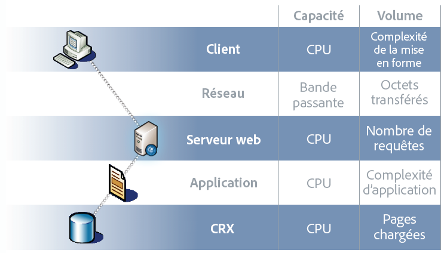

# Optimiser les performances {#performance-optimization}

>[!NOTE]
>
>Pour obtenir des instructions générales sur les performances, consultez la page [Conseils relatifs aux performance](/help/sites-deploying/performance-guidelines.md).
>
>Pour plus d’informations sur le dépannage et la résolution des problèmes de performances, voir également l’[arborescence de la performance](/help/sites-deploying/performance-tree.md).
>
>De plus, vous pouvez lire un article de la base de connaissances pour obtenir des [Conseils pour le réglage des performances](https://experienceleague.adobe.com/fr/docs/experience-cloud-kcs/kbarticles/ka-17466).

L’un des problèmes majeurs est le temps que met votre site web pour répondre aux requêtes des visiteurs et visiteuses. Bien que cette valeur varie pour chaque requête, une valeur cible moyenne peut être définie. Une fois que cette valeur se révèle à la fois réalisable et gérable, elle peut être utilisée pour surveiller les performances du site web et indiquer le développement de problèmes potentiels.

Les temps de réponse que vous visez sont différents dans les environnements de création et de publication, selon les diverses caractéristiques de l’audience cible :

## Environnement de création {#author-environment}

Cet environnement est utilisé par les auteurs et autrices qui saisissent et mettent à jour du contenu. Il doit répondre aux besoins de quelques utilisateurs et utilisatrices qui génèrent un grand nombre de requêtes lors de la mise à jour de pages de contenu et de chaque élément de ces pages.

## Environnement de publication {#publish-environment}

Cet environnement intègre le contenu que vous mettez à la disposition de vos utilisateurs. Ici, le nombre de requêtes est encore plus important et la vitesse est primordiale. Mais comme la nature des requêtes est moins dynamique, d’autres mécanismes d’amélioration des performances peuvent être appliqués, comme la mise en cache du contenu ou l’équilibrage de charge.

>[!NOTE]
>
>* Une fois l’optimisation des performances configurée, suivez les procédures dans [Tough Day](/help/sites-developing/tough-day.md) pour tester l’environnement en le soumettant à une charge importante.
>* Consultez également la section [Conseils pour le réglage des performances.](https://experienceleague.adobe.com/fr/docs/experience-cloud-kcs/kbarticles/ka-17466)

## Méthodologie d’optimisation des performances {#performance-optimization-methodology}

Une méthodologie d’optimisation des performances pour les projets AEM peut se résumer en cinq règles très simples qu’il convient de respecter pour éviter des problèmes de performances dès le départ :

1. [Planification de l’optimisation](#planning-for-optimization)
1. [Simulation de la réalité](#simulate-reality)
1. [Établissement d’objectifs solides](#establish-solid-goals)
1. [Maintien de la pertinence](#stay-relevant)
1. [Cycles d’itération agile](#agile-iteration-cycles)

Ces règles s’appliquent aux projets web en général et sont pertinentes pour les chefs/cheffes de projet et les administrateurs/administratrices système, car elles leur permettent d’éviter des problèmes de performances au moment du lancement de leurs projets.

### Planification de l’optimisation {#planning-for-optimization}


Planifiez environ 10 % de l’effort du projet pour la phase d’optimisation des performances. Les exigences d’optimisation des performances réelles dépendent du niveau de complexité d’un projet et de l’expérience de l’équipe de développement. Bien que votre projet puisse (finalement) ne pas nécessiter le temps alloué, il est recommandé de toujours planifier l’optimisation des performances dans la région suggérée.

Dans la mesure du possible, un projet doit d’abord être lancé en douceur pour une audience limitée, afin de collecter des données d’expérience réelle et d’effectuer d’autres activités d’optimisation, sans la pression supplémentaire qui suit une annonce de lancement définitif.

Après la « mise en production », l’optimisation des performances n’est pas terminée. C’est maintenant que vous ressentez la « vraie » charge sur votre système. Il est important de prévoir des ajustements supplémentaires après le lancement.

Comme la charge et les profils de performances de votre système changent au fil du temps, une « mise au point » ou un « contrôle de l’intégrité » des performances doivent être planifiés à 6-12 mois d’intervalle.

### Simulation de la réalité {#simulate-reality}


Si vous avez mis en ligne un site web et que vous identifiez, après le lancement, des problèmes de performances, il est probable que vos tests de charge et de performances n’ont pas simulé la réalité le plus fidèlement possible.

La simulation de la réalité est difficile et les efforts que vous êtes prêt à fournir pour vous approcher de la « réalité » dépendent de la nature de votre projet. Cette réalité signifie non seulement un « code réel » et un « trafic réel », mais aussi du « contenu réel », en particulier en ce qui concerne la taille et la structure. Vos modèles peuvent se comporter différemment selon la taille et la structure du référentiel.

### Établir des objectifs solides {#establish-solid-goals}


L’importance d’établir correctement les objectifs de performances ne doit pas être sous-estimée. Souvent, une fois que les personnes se concentrent sur des objectifs de performances précis, il est très difficile de modifier ces objectifs par la suite, même s’ils sont basés sur des hypothèses.

L’établissement d’objectifs de performances réalisables et viables est vraiment l’un des aspects les plus délicats. Il est souvent préférable de collecter les références et les données réelles d’un site Web comparable (par exemple le prédécesseur du nouveau site Web).

### Maintenir la pertinence {#stay-relevant}


Il est important de résoudre un seul goulot d’étranglement à la fois. Si vous essayez de faire des choses en parallèle sans valider l’impact d’une optimisation, vous pouvez risquer de ne plus savoir quelle mesure d’optimisation a été utile.

### Cycles d’itération agile {#agile-iteration-cycles}


L’optimisation des performances est un processus itératif qui implique des activités de mesure, d’analyse, d’optimisation et de validation jusqu’à ce que l’objectif soit atteint. Pour tenir compte de cet aspect, implémentez un processus de validation agile dans la phase d’optimisation plutôt qu’un processus de tests contraignant après chaque itération.

Cela signifie que le développeur ou la développeuse qui implémente l’optimisation doit disposer d’un moyen rapide de déterminer si l’optimisation a déjà atteint l’objectif. Ces informations sont utiles, car lorsque l’objectif est atteint, l’optimisation est terminée.

## Consignes de performances de base {#basic-performance-guidelines}

De manière générale, vos demandes html non mises en cache doivent être inférieures à 100 millisecondes. Plus précisément, ce qui suit peut servir de ligne directrice :

* 70 % des demandes de pages doivent être traitées en moins de 100 millisecondes.
* 25 % des demandes de pages doivent recevoir une réponse dans un délai de 100 à 300 millisecondes.
* 4 % des demandes de pages doivent recevoir une réponse dans un délai de 300 à 500 millisecondes.
* 1 % des demandes de pages doit recevoir une réponse dans un délai de 500 à 1 000 millisecondes.
* Aucune page ne doit avoir de temps de réponse de plus d’une seconde.

Les chiffres ci-dessus supposent les conditions suivantes :

* Mesure prise au moment de la publication (sans surcharge liée à un environnement de création)
* Mesure prise sur le serveur (pas de surcharge réseau)
* Pas de mise en cache (pas de cache de sortie AEM, pas de cache du Dispatcher)
* Uniquement pour les éléments complexes présentant de nombreuses dépendances (HTML, JS, PDF...)
* Pas d’autre charge sur le système

Certains problèmes contribuent fréquemment aux problèmes de performances, notamment :

* L’inefficacité de la mise en cache par le Dispatcher
* L’utilisation de requêtes dans des modèles d’affichage normaux

Le réglage au niveau de la JVM et du système d’exploitation n’entraîne généralement pas de bond en avant significatif en termes de performances et doit donc être effectué à la toute fin du cycle d’optimisation.

La structure d’un référentiel de contenu peut également avoir un impact sur les performances. Pour de meilleures performances, le nombre de nœuds enfants associés à des nœuds individuels dans un référentiel de contenu ne doit pas dépasser 1 000 (en règle générale).

Voici vos meilleurs amis lors d’un exercice habituel d’optimisation des performances :

* La `request.log`
* Timing basé sur les composants
* Un profileur Java™.

### Performances lors du chargement et de la modification des ressources numériques {#performance-when-loading-and-editing-digital-assets}

En raison du volume important de données impliquées lors du chargement et de la modification des ressources numériques, les performances peuvent devenir un problème.

Deux éléments affectent ici les performances :

* Processeur : plusieurs cœurs permettent un travail plus fluide lors du transcodage
* Disque dur : les disques RAID parallèles obtiennent le même résultat

Pour améliorer les performances, tenez compte des points suivants :

* Combien d’éléments seront téléchargés par jour ? Une bonne estimation peut être basée sur :


* le délai durant lequel les modifications sont effectuées (généralement une journée de travail, davantage pour les opérations internationales) ;
* la taille moyenne des images chargées (et la taille des rendus générés par image) en mégaoctets.
* Déterminez le débit de données moyen :


* 80 % de toutes les modifications seront effectuées dans 20 % des cas, donc en période de trafic élevé, attendez-vous à un débit moyen quadruplé. Une telle performance est votre objectif.

## Surveillance des performances {#performance-monitoring}

Les performances (ou leur insuffisance) sont l’une des premières choses que vos utilisateurs remarquent. Aussi, pour toute application dotée d’une interface utilisateur, les performances sont un facteur déterminant. Pour optimiser les performances de votre installation AEM, vous devez surveiller les différents attributs de l’instance et son comportement.

Pour plus d’informations sur l’exécution de la surveillance des performances, consultez [Surveillance des performances](/help/sites-deploying/monitoring-and-maintaining.md#monitoring-performance).

Les raisons des problèmes de performances sont souvent difficiles à détecter, même lorsque leurs effets sont faciles à voir.

Pour commencer, ayez une bonne connaissance de votre système lorsqu’il fonctionne normalement. À moins de savoir à quoi votre environnement ressemble et comment il se comporte lorsqu’il fonctionne correctement, il est difficile de localiser le problème lorsque les performances se détériorent. Passez du temps à enquêter sur votre système lorsqu’il s’exécute en douceur et assurez-vous que la collecte des informations de performances a bien lieu. Vous aurez ainsi une base de comparaison en cas de dégradation des performances.

Le diagramme suivant illustre le parcours que peut suivre une demande de contenu AEM, et donc le nombre d’éléments différents pouvant se répercuter sur les performances.


Les performances sont également un compromis entre volume et capacité :

* **Volume** - La quantité en sortie qui est traitée et diffusée par le système.
* **Capacité** - La capacité du système à fournir le volume.

Les performances s’illustrent à différents endroits de la chaîne web.



Plusieurs domaines fonctionnels sont souvent responsables de l’impact sur les performances :

* Mise en cache
* Code de l’application (votre projet)
* Fonctionnalité de recherche

### Règles de base concernant les performances {#basic-rules-regarding-performance}

Certaines règles doivent être prises en compte lors de l’optimisation des performances :

* L’optimisation des performances *doit* faire partie de chaque projet.
* N’effectuez pas d’optimisation au début du cycle de développement.
* Les performances sont toujours égales à celles du lien le plus faible.
* Pensez toujours à la capacité par rapport au volume.
* Optimisez d’abord les éléments importants.
* N’optimisez jamais sans objectif *réaliste*.

>[!NOTE]
>
>Gardez à l’esprit que le mécanisme que vous utilisez pour mesurer les performances affecte souvent exactement ce que vous essayez de mesurer. Tentez de tenir compte de ces écarts et d’éliminer le plus possible leurs effets. Dans la mesure du possible, les plug-ins du navigateur doivent notamment être désactivés.

## Configurer pour optimiser la performance {#configuring-for-performance}

Certains aspects d’AEM (et/ou du référentiel sous-jacent) peuvent être configurés pour optimiser la performance. Vous trouverez ci-dessous des possibilités et des suggestions. Vous devez vous assurer d’utiliser la fonctionnalité en question avant d’y apporter des modifications.

>[!NOTE]
>
>Voir [Optimisation des performances](https://experienceleague.adobe.com/docs/experience-manager-65/content/implementing/deploying/configuring/configuring-performance.html?lang=fr).

### Indexation de recherche {#search-indexing}

À compter d’AEM 6.0, Adobe Experience Manager utilise une architecture de référentiel Oak.

Vous trouverez les informations d’indexation mises à jour ici :

* [Bonnes pratiques relatives aux requêtes et à l’indexation](/help/sites-deploying/best-practices-for-queries-and-indexing.md)
* [Requêtes et indexation](/help/sites-deploying/queries-and-indexing.md)

### Traitement de workflows simultanés {#concurrent-workflow-processing}

Pour améliorer les performances, limitez le nombre de processus de workflow en cours d’exécution. Par défaut, le moteur de workflow traite autant de workflows en parallèle qu’il y a de processeurs disponibles pour la machine virtuelle Java™. Lorsque les étapes du workflow nécessitent d’importantes quantités de ressources de traitement (mémoire vive ou processeur), l’exécution simultanée de plusieurs de ces workflow peut intensifier la demande en ressources serveur disponibles.

Par exemple, lorsque des images (ou des ressources de gestion des actifs numériques en général) sont chargées, les workflows importent automatiquement les images dans la gestion des actifs numériques (DAM). Les images sont souvent à haute résolution et peuvent facilement consommer des centaines de Mo de tas pour le traitement. La gestion de ces images en parallèle place une charge élevée sur le sous-système de mémoire et le récupéreur d’espace mémoire.

Le moteur de workflow utilise les files d’attente de tâches Apache Sling pour gérer et planifier le traitement des éléments de travail. Les services de file d’attente de tâches suivants ont été créés par défaut à partir de la fabrique de services Configuration des files d’attente des tâches Apache Sling pour le traitement des tâches de workflow :

* File d’attente des workflows Granite : la plupart des étapes de workflow, telles que celles qui traitent les ressources de gestion des ressources numériques, utilisent le service File d’attente des workflows Granite.
* File d’attente des tâches de processus externe des workflows Granite : ce service est utilisé pour les étapes de workflow spéciales et externes qui servent généralement à contacter un système externe et à interroger les résultats. Par exemple, le processus d’extraction de médias InDesign est implémenté en tant que processus externe. Le moteur de workflow utilise la file d’attente externe pour traiter l’interrogation. (Voir [com.day.cq.workflow.exec.WorkflowExternalProcess](https://developer.adobe.com/experience-manager/reference-materials/6-5/javadoc/com/day/cq/workflow/exec/WorkflowExternalProcess.html).)

Configurez ces services pour limiter le nombre maximal de workflows en cours d’exécution.

>[!NOTE]
>
>Remarque : la configuration de ces files d’attente affecte tous les workflows sauf si vous avez créé une file d’attente pour un modèle de workflow spécifique (consultez [Configuration de la file d’attente pour un modèle de workflow spécifique](/help/sites-deploying/configuring-performance.md#configure-the-queue-for-a-specific-workflow) ci-après).

#### Configuration dans le référentiel {#configuration-in-the-repo}

Si vous configurez les services [à l’aide d’un nœud sling:OsgiConfig &#x200B;](/help/sites-deploying/configuring-osgi.md#adding-a-new-configuration-to-the-repository), vous devez trouver le PID des services existants, par exemple : org.apache.sling.event.jobs.QueueConfiguration.370aad73-d01b-4a0b-abe4-20198d85f705. Vous pouvez détecter le PID à l’aide de la console web.

Configurez la propriété nommée `queue.maxparallel`.

#### Configuration dans la console Web {#configuration-in-the-web-console}

Pour configurer ces services [à l’aide de la console Web](/help/sites-deploying/configuring-osgi.md#osgi-configuration-with-the-web-console), localisez les éléments de configuration existants sous la fabrique de services Configuration de la file d’attente de tâches Apache Sling.

Configurez la propriété nommée Nombre maximal de tâches en parallèle.

### Configurer la file d’attente pour un workflow spécifique {#configure-the-queue-for-a-specific-workflow}

Créez une file d’attente de tâches pour un modèle de workflow spécifique, afin de pouvoir configurer la gestion des tâches pour ce modèle de workflow. Ainsi, vos configurations affectent le traitement d’un workflow spécifique, tandis que la configuration de la file d’attente de workflow Granite par défaut contrôle le traitement d’autres workflows.

Lorsque les modèles de workflow s’exécutent, ils créent des tâches Sling pour une rubrique spécifique. Par défaut, la rubrique correspond aux rubriques configurées pour la file d’attente de workflows Granite générale ou la file d’attente de tâches de processus externe de workflows Granite :

* `com/adobe/granite/workflow/job*`
* `com/adobe/granite/workflow/external/job*`

Les rubriques de tâche réelles générées par les modèles de workflow incluent le suffixe spécifique au modèle. Par exemple, le modèle du workflow **Ressource de mise à jour de la gestion des ressources numériques** génère des tâches avec la rubrique suivante :

`com/adobe/granite/workflow/job/etc/workflow/models/dam/update_asset/jcr_content/model`

Par conséquent, vous pouvez créer une file d’attente de tâches pour la rubrique correspondant aux rubriques de votre modèle de workflow. La configuration des propriétés liées aux performances de la file d’attente affecte uniquement le modèle de workflow qui génère les tâches correspondant à la rubrique de la file d’attente.

La procédure suivante crée une file d’attente de tâches pour un workflow, en utilisant le workflow **Ressource de mise à jour de la gestion des ressources numériques** pour exemple.

1. Exécutez le modèle de workflow pour lequel vous souhaitez créer la file d’attente de tâches et générer des statistiques de rubrique. Par exemple, ajoutez une image aux Ressources pour exécuter le workflow **Ressource de mise à jour de la gestion des ressources numériques**.
1. Ouvrez la console Tâches Sling (`https://<host>:<port>/system/console/slingevent`).
1. Découvrez les rubriques relatives aux workflows dans la console. Pour les ressources de mise à jour de la gestion des DAM, les rubriques suivantes sont disponibles :

   * `com/adobe/granite/workflow/external/job/etc/workflow/models/dam/update_asset/jcr_content/model`
   * `com/adobe/granite/workflow/job/etc/workflow/models/dam/update_asset/jcr_content/model`
   * `com/adobe/granite/workflow/job/etc/workflow/models/dam-xmp-writeback/jcr_content/model`

1. Créez une file d’attente pour chacune de ces rubriques. Pour créer une file d’attente de tâches, créez une configuration d’usine pour le service d’usine File d’attente de tâches Apache Sling.

   Les configurations de fabrique sont similaires à la file d’attente des workflows Granite décrite dans [Traitement de workflows simultanés](/help/sites-deploying/configuring-performance.md#concurrent-workflow-processing), à la différence que la propriété Rubriques correspond à la rubrique de vos tâches de workflow.

### Service AEM de synchronisation des ressources de gestion des ressources numériques {#cq-dam-asset-synchronization-service}

Le service `AssetSynchronizationService` permet de synchroniser les ressources des référentiels montés (y compris LiveLink et Documentum®, entre autres). Par défaut, il effectue une vérification régulière toutes les 300 secondes (5 minutes), donc si vous n’utilisez pas de référentiels montés, vous pouvez désactiver ce service.

Pour désactiver le service, [configurez le service OSGi](/help/sites-deploying/configuring-osgi.md) **CQ DAM Asset Synchronization Service** pour définir la **période de synchronisation** (`scheduler.period`) à (un minimum d’)un an (en secondes).

### Instances multiples de gestion des ressources numériques {#multiple-dam-instances}

Le déploiement de plusieurs instances de gestion des ressources numériques peut améliorer les performances si, par exemple :

* votre charge est élevée en raison du chargement régulier d’un grand nombre de ressources pour l’environnement de création. Dans ce cas, une instance distincte de gestion des DAM peut être dédiée à la création ;
* vous avez plusieurs équipes dans le monde (par exemple, États-Unis, Europe, Asie).

Autres points à prendre en compte :

* Séparer le « travail en cours » en mode de création du « final » en mode de publication
* Séparer les utilisateurs et utilisatrices internes en mode de création des visiteurs et visiteuses, ou utilisateurs et utilisatrices externes en mode de publication (par exemple les agentes et agents, les représentantes et représentants de la presse, les clientes et clients, les étudiantes et étudiants).

## Bonnes pratiques pour l’assurance qualité {#best-practices-for-quality-assurance}

Les performances sont primordiales pour votre environnement de publication. Par conséquent, vous devez soigneusement planifier et analyser les tests de performances que vous effectuez pour l’environnement de publication lors de l’implémentation de votre projet.

Cette section vise à donner un aperçu normalisé des problèmes liés à la définition d’un concept de test spécifique pour les tests de performances dans votre environnement de *publication*. Cette information s’adresse principalement aux ingénieures et ingénieurs en assurance qualité, aux cheffes et chefs de projet et aux administrateurs et administratrices système.

Le contenu suivant présente une approche normalisée des tests de performances pour une application AEM sur l’environnement de *publication*. Ce test de performances implique les cinq phases suivantes :

* [Vérification des connaissances](#verification-of-knowledge)
* [Définition de la portée](#scope-definition)
* [Méthodologies de test](#test-methodologies)
* [Définition des objectifs de performances](#defining-the-performance-goals)
* [Optimisation](#optimization)

Le contrôle est un processus supplémentaire et global, nécessaire mais non limité aux tests.

### Vérification des connaissances {#verification-of-knowledge}

Une première étape consiste à documenter les informations de base que vous devez connaître avant de pouvoir démarrer les tests :

* l’architecture de votre environnement de test ;
* Une carte de l’application détaillant les éléments internes qui nécessitent des tests (à la fois de manière isolée et combinée).

#### Architecture de test {#test-architecture}

Documentez l’architecture de l’environnement de test utilisé pour vos tests de performances.

Vous avez besoin d’une reproduction de votre environnement de publication de production prévu, avec Dispatcher et la répartition de charge.

#### Carte de l’application {#application-map}

Obtenez un aperçu clair à partir duquel vous pouvez créer une carte de l’ensemble de l’application (vous disposez peut-être déjà de cette carte grâce aux tests dans l’environnement de création).

Un diagramme représentant les éléments internes de l’application peut donner un aperçu des exigences de test. Avec le codage par couleur, il peut également servir de base pour la création de rapports.

### Définition de la portée {#scope-definition}

Une application comporte généralement une sélection de cas d’utilisation. Certains cas d’utilisation sont importants, d’autres moins.

Pour cibler la portée des tests de performances en mode de publication, Adobe vous recommande de définir les éléments suivants :

* Les cas d’utilisation commerciale les plus importants
* Les cas d’utilisation technique les plus critiques

Le nombre de cas d’utilisation dépend de vous, mais il doit être limité à un nombre facilement gérable (par exemple, entre 5 et 10).

Une fois les cas d’utilisation clés sélectionnés, les indicateurs de performance clés et les outils utilisés pour les mesurer peuvent être définis pour chaque cas. Voici quelques exemples de KPI courants :

* Temps de réponse de bout en bout
* Temps de réponse du servlet
* Temps de réponse pour un seul composant
* Temps de réponse des services
* Nombre de threads inactifs dans le pool de threads
* Nombre de connexions libres
* Ressources système telles que l’accès au processeur et aux E/S

### Méthodologies de test {#test-methodologies}

Ce concept comporte quatre scénarios utilisés pour définir et tester les objectifs de performances :

* Tests sur un composant unique
* Tests sur les composants combinés
* Scénario de *mise en production*
* Scénarios d’erreur

Sur la base des principes suivants.

#### Points d’arrêt des composants {#component-breakpoints}

* Chaque composant possède un point d’arrêt spécifique lorsqu’il est lié aux performances. En d’autres termes, un composant peut montrer de bonnes performances jusqu’à ce qu’un point spécifique soit atteint, après quoi les performances se dégradent rapidement.
* Pour obtenir une vue d’ensemble complète de l’application, vous devez d’abord vérifier vos composants afin de déterminer le moment auquel le point d’arrêt de chacun est atteint.
* Pour l’identifier, vous pouvez effectuer un test de charge où, sur une période de temps, vous augmentez le nombre d’utilisateurs et utilisatrices pour soumettre le composant à une charge de plus en plus élevée. En surveillant cette charge et la réponse des composants, vous rencontrerez un comportement de performances spécifique au moment où le point d’arrêt du composant est atteint. Le point peut être qualifié par le nombre de transactions simultanées par seconde, ainsi que par le nombre d’utilisateurs et utilisatrices simultanés (si le composant est sensible à ce KPI).
* Ces informations peuvent ensuite servir de référence pour les améliorations, indiquer l’efficacité des mesures utilisées et aider à définir des scénarios de test.

#### Transactions {#transactions}

* Le terme Transaction est utilisé pour représenter la demande d’une page web complète, y compris la page elle-même et tous les appels suivants. C’est-à-dire la requête de page, les appels AJAX, les images et autres objets **Analyse en profondeur de la requête**.
* Pour analyser entièrement chaque requête, vous pouvez représenter chaque élément de la pile d’appels, puis totaliser la durée moyenne de traitement de chacune d’elles.

### Définir les objectifs de performances {#defining-the-performance-goals}

Une fois la portée et les KPI associés définis, les objectifs de performances spécifiques sont définis. Ce processus implique la conception de scénarios de test, ainsi que de valeurs cibles.

Testez les performances dans des conditions moyennes et de pointe. En outre, vous avez besoin de tests de scénario en ligne pour vous assurer que vous pourrez faire face à un intérêt accru pour votre site web lorsqu’il sera disponible.

Toute expérience ou statistique que vous avez peut-être collectée sur un site web existant peut également se révéler utile pour déterminer les objectifs futurs. Par exemple, le trafic le plus élevé provenant de votre site web actif.

#### Tests sur des composants uniques {#single-component-tests}

Les composants essentiels doivent être testés dans des conditions moyennes et de pointe.

Dans les deux cas, vous pouvez définir le nombre de transactions attendu par seconde lorsqu’un nombre prédéfini d’utilisateurs et d’utilisatrices utilisent le système.

| Composant | Type de test | Nombre d’utilisateurs | T/s (attendu) | T/s (testé) | Description |
|---|---|---|---|---|---|
| Page d’accueil - Utilisateur unique | Moyenne | 1 | 1 |  |  |
|   | Crête | 1 | 3 |  |  |
| Page d’accueil 100 utilisateurs | Moyenne | 100 | 3 |  |  |
|   | Crête | 100 | 3 |  |  |

#### Tests combinés des composants {#combined-component-tests}

Le test combiné des composants permet de mieux visualiser le comportement des applications. Là encore, les conditions moyennes et de pointe doivent être testées.

| Scénario | Composant | Nombre d’utilisateurs | T/s (attendu) | T/s (testé) | Description |
|---|---|---|---|---|---|
| Moyenne mixte | Page d’accueil | 10 | 1 |  |  |
|   | Rechercher | 10 | 1 |  |  |
|   | Actualités | 10 | 2 |  |  |
|   | Événements | 10 | 1 |  |  |
|   | Activations | 10 | 3 |  | Simulation du comportement de l’auteur. |
| Pic mixte | Page d’accueil | 100 | 5 |  |  |
|   | Rechercher | 50 | 5 |  |  |
|   | Actualités | 100 | 10 |  |  |
|   | Événements | 100 | 10 |  |  |
|   | Activations | 20 | 20 |  | Simulation du comportement de l’auteur. |

#### Tests en ligne {#going-live-tests}

Au cours des premiers jours suivant la mise en ligne de votre site web, attendez-vous à un niveau élevé d’intérêt. Ce scénario est même supérieur aux valeurs de pointe que vous testez. Adobe vous recommande de tester les scénarios en ligne pour vous assurer que le système peut faire face à cette situation.

| Scénario | Type de test | Nombre d’utilisateurs | T/s (attendu) | T/s (testé) | Description |
|---|---|---|---|---|---|
| Pic de mise en service | Page d’accueil | 200 | 20 |  |  |
|   | Rechercher | 100 | 10 |  |  |
|   | Actualités | 200 | 20 |  |  |
|   | Événements | 200 | 20 |  |  |
|   | Activations | 20 | 20 |  | Simulation du comportement de l’auteur. |

#### Tests de scénario d’erreur {#error-scenario-tests}

Testez les scénarios d’erreur pour vous assurer que le système réagit correctement et conformément aux attentes. Non seulement en termes de traitement de l’erreur elle-même, mais aussi de répercussions sur les performances. Par exemple :

* Ce qui se passe lorsque l’utilisateur tente d’entrer un terme de recherche non valide dans la zone de recherche
* Ce qui se passe lorsque le terme de recherche est tellement général qu’il renvoie un nombre excessif de résultats

Lors de la conception de ces tests, il faut se rappeler que tous les scénarios ne se produisent pas régulièrement. Cependant, leur impact sur l’ensemble du système est important.

| Scénario d’erreur | Type d’erreur | Nombre d’utilisateurs | T/s (attendu) | T/s (testé) | Description |
|---|---|---|---|---|---|
| Surcharge des composants de recherche | Recherche sur un caractère générique (astérisque) | 10 | 1 |  | Seul les &ast;&ast;&ast; sont recherchées. |
|   | Mot de fin | 20 | 2 |  | Recherche d’un mot de fin. |
|   | Chaîne vide | 10 | 1 |  | Recherche d’une chaîne vide. |
|   | Caractères spéciaux | 10 | 1 |  | Recherche de caractères spéciaux. |

#### Tests d’endurance {#endurance-tests}

Certains problèmes ne sont rencontrés qu’après une exécution du système pendant une période continue, que l’on compte en heures ou en jours. Un test d’endurance est utilisé pour tester une charge moyenne constante sur une période donnée. Toute dégradation des performances peut être ensuite analysée.

| Scénario | Type de test | Nombre d’utilisateurs | T/s (attendu) | T/s (testé) | Description |
|---|---|---|---|---|---|
| Test d’endurance (72 heures) | Page d’accueil | 10 | 1 |  |  |
|   | Rechercher | 10 | 1 |  |  |
|   | Actualités | 20 | 2 |  |  |
|   | Événements | 10 | 1 |  |  |
|   | Activations | 1 | 3 |  | Simulation du comportement de l’auteur. |

### Optimisation {#optimization}

Lors des étapes suivantes de la mise en œuvre, optimisez l’application afin d’atteindre et d’optimiser les objectifs de performances.

Toutes les optimisations effectuées doivent être testées pour s’assurer :

* qu’elles ne dégradent pas les fonctionnalités ;
* qu’elles ont été vérifiées au moyen de tests de charge avant d’être appliquées.

Une sélection d’outils est disponible pour vous aider dans la génération de la charge, la surveillance des performances et l’analyse des résultats. Voici quelques-uns de ces outils :

* [JMeter](https://jmeter.apache.org/)
* [InfraRED](https://www.infraredsoftware.com/)
* [Profil interactif Java™](https://jiprof.sourceforge.net/)

Après l’optimisation, testez à nouveau pour confirmer l’impact.

### Création de rapports {#reporting}

Les rapports en cours informent tout le monde du statut. Comme mentionné précédemment avec le codage par couleur, la carte d’architecture peut être utilisée pour ce statut.

Une fois tous les tests terminés, faites un rapport :

* de toutes les erreurs critiques rencontrées ;
* des problèmes non critiques qui ont encore besoin de faire l’objet de recherche ;
* des hypothèses émises lors des tests ;
* de toute recommandation découlant des tests.

## Optimisation des performances lors de l’utilisation du Dispatcher {#optimizing-performance-when-using-the-dispatcher}

Le [Dispatcher](https://experienceleague.adobe.com/docs/experience-manager-dispatcher/using/dispatcher.html?lang=fr) est l’outil de mise en cache et/ou d’équilibrage de charge d’Adobe. Lorsque vous utilisez le Dispatcher, pensez à optimiser votre site web en termes de performances du cache.

>[!NOTE]
>
>Les versions du Dispatcher sont indépendantes d’AEM, mais la documentation du Dispatcher est incluse dans la documentation d’AEM. Utilisez toujours la documentation du Dispatcher incluse dans la documentation pour la dernière version d’AEM.
>
>Vous avez été redirigé vers cette page si vous avez suivi un lien vers la documentation de Dispatcher incluse dans la documentation d’une précédente version d’AEM.

Le Dispatcher propose un certain nombre de mécanismes intégrés que vous pouvez utiliser pour optimiser les performances à condition que votre site web en tire parti. Dans cette section, vous apprendrez comment concevoir votre site web afin de tirer le meilleur parti des avantages de la mise en cache.

>[!NOTE]
>
>Il peut être utile de vous rappeler que le dispatcher stocke le cache sur un serveur web standard. Connaître ces informations signifie que vous pouvez mettre en cache tout ce que vous pouvez stocker en tant que page et effectuer une requête à l’aide d’une URL. Vous ne pouvez pas enregistrer d’autres éléments, tels que des cookies, des données de session et des données de formulaire.
>
>En général, de nombreuses stratégies de mise en cache impliquent de sélectionner les URL appropriées et de ne pas s’en tenir à ces données supplémentaires.
>
>Avec la version 4.1.11 du Dispatcher, vous pouvez également mettre en cache les en-têtes de réponse, consultez [Mise en cache des en-têtes de réponse HTTP](https://experienceleague.adobe.com/docs/experience-manager-dispatcher/using/configuring/dispatcher-configuration.html?lang=fr#configuring-the-dispatcher-cache-cache).
>

### Calcul du ratio de cache du Dispatcher {#calculating-the-dispatcher-cache-ratio}

La formule du ratio de cache estime le pourcentage de requêtes traitées par le cache sur le nombre total de requêtes entrant dans le système. Pour calculer ce ratio, vous avez besoin des éléments suivants :

* Le nombre total de demandes. Cette information est disponible dans Apache `access.log`. Pour plus d’informations, voir la [documentation officielle d’Apache](https://httpd.apache.org/docs/2.4/logs.html#accesslog).

* Le nombre de demandes traitées par l’instance de publication. Cette information est disponible dans le fichier `request.log` de l’instance. Pour plus d’informations, consultez [Interprétation du fichier request.log](/help/sites-deploying/monitoring-and-maintaining.md#interpreting-the-request-log) et [Recherche des fichiers journaux](/help/sites-deploying/monitoring-and-maintaining.md#finding-the-log-files).

Formule de calcul du ratio :

* (nombre total de demandes **moins** le nombre de demandes sur l’instance de publication) **divisé** par le nombre total de demandes.

Par exemple, si le nombre total de requêtes est de 129 491 et que le nombre de requêtes servies par l’instance de publication est de 58 959, le ratio de cache est : **(129 491 - 58 959)/129 491= 54,5 %**.

Si vous ne disposez pas d’une association un-à-un éditeur/dispatcher, ajoutez les requêtes de tous les dispatchers et éditeurs ensemble pour obtenir une mesure précise. Voir aussi [Déploiements recommandés](/help/sites-deploying/recommended-deploys.md).

>[!NOTE]
>
>Pour de meilleures performances, Adobe recommande un ratio de cache de 90 % à 95 %.

#### Utilisation d’un codage cohérent de page  {#using-consistent-page-encoding}

Avec le Dispatcher version 4.1.11, vous pouvez mettre en cache les en-têtes de réponse. Si vous ne mettez pas en cache les en-têtes de réponse sur le Dispatcher, des problèmes peuvent survenir quand vous stockez des informations de codage de page dans l’en-tête. Dans ce cas, lorsque le Dispatcher diffuse une page du cache, le codage par défaut du serveur web est utilisé pour la page. Deux méthodes permettent d’éviter ce problème :

* Si vous n’utilisez qu’un seul encodage, assurez-vous que le codage utilisé sur le serveur web est identique à celui par défaut du site web AEM.
* Pour définir le codage, utilisez une balise `<META>` dans la section `head` HTML comme dans l’exemple suivant :

```xml
        <META http-equiv="Content-Type" content="text/html; charset=EUC-JP">
```

#### Contournement des paramètres d’URL {#avoid-url-parameters}

Si possible, évitez les paramètres d’URL des pages que vous souhaitez mettre en cache. Par exemple, si vous disposez d’une galerie d’images, l’URL suivante n’est jamais mise en cache (sauf si le Dispatcher est [configuré en conséquence](https://experienceleague.adobe.com/docs/experience-manager-dispatcher/using/configuring/dispatcher-configuration.html?lang=fr#configuring-the-dispatcher-cache-cache)) :

```xml
www.myCompany.com/pictures/gallery.html?event=christmas&amp;page=1
```

Vous pouvez toutefois placer ces paramètres dans l’URL de page, comme suit :

```xml
www.myCompany.com/pictures/gallery.christmas.1.html
```

>[!NOTE]
>
>Cette URL invoque la même page et le même modèle que `gallery.html`. Dans la définition du modèle, vous pouvez spécifier le script qui effectue le rendu de la page ou vous pouvez utiliser le même script pour toutes les pages.

#### Personnalisation par URL  {#customize-by-url}

Si vous autorisez les utilisateurs et utilisatrices à modifier la taille de la police (ou toute autre personnalisation de la disposition), assurez-vous que les différentes personnalisations sont reflétées dans l’URL.

Par exemple, les cookies ne sont pas mis en cache. Par conséquent, si vous stockez la taille de police dans un cookie (ou un mécanisme similaire), celle-ci ne sera pas conservée pour la page mise en cache. Par conséquent, le Dispatcher renvoie aléatoirement des documents de n’importe quelle taille de police.

L’inclusion de la taille de police dans l’URL en tant que sélecteur évite ce problème :

```xml
www.myCompany.com/news/main.large.html
```

>[!NOTE]
>
>Pour la plupart des aspects de disposition, il est également possible d’utiliser des feuilles de style, des scripts côté client, ou les deux. Ces instruments fonctionnent bien avec la mise en cache.
>
>Cette stratégie est également utile pour une version imprimée. Dans ce cas, vous pouvez également utiliser une URL telle que :
>
>`www.myCompany.com/news/main.print.html`
>
>À l’aide de l’extension métacaractère du script de la définition du modèle, vous pouvez spécifier un script distinct qui effectue le rendu des pages d’impression.

#### Invalidation de fichiers image utilisés comme titres  {#invalidating-image-files-used-as-titles}

Si vous effectuez le rendu des titres de page, ou d’un autre texte, sous forme d’images, il est recommandé de stocker les fichiers afin qu’ils soient supprimés lors d’une mise à jour du contenu sur la page :

1. Placez le fichier image dans le même dossier que la page.
1. Utilisez le format d’affectation de nom suivant pour le fichier image :

   `<page file name>.<image file name>`

Par exemple, vous pouvez stocker le titre de la page `myPage.html` dans le `file myPage.title.gif`. Ce fichier est automatiquement supprimé si la page est mise à jour. Toute modification du titre de la page est donc automatiquement répercutée dans le cache.

>[!NOTE]
>
>Le fichier image n’existe pas nécessairement physiquement sur l’instance AEM. Vous pouvez utiliser un script qui crée dynamiquement le fichier image. Dispatcher stocke ensuite le fichier sur le serveur web.

#### Invalidation des fichiers image utilisés pour la navigation  {#invalidating-image-files-used-for-navigation}

Si vous utilisez des images pour les entrées de navigation, la méthode est fondamentalement la même qu’avec les titres mais seulement un peu plus complexe. Stockez toutes les images de navigation avec les pages cibles. Si vous utilisez deux images pour « normale » et « active », vous pouvez utiliser les scripts suivants :

* Script qui affiche la page, en tant que normale.
* Un script qui traite les requêtes « .normal » et renvoie l’image normale.
* Un script qui traite les demandes « .active » et renvoie l’image activée.

Il est important que vous créiez ces images avec le même nom d’utilisateur que la page, afin de vous assurer qu’une mise à jour du contenu supprime ces images et la page.

Pour les pages qui ne sont pas modifiées, les images restent dans le cache, bien que les pages elles-mêmes soient automatiquement invalidées.

#### Personnalisation {#personalization}

Il est recommandé de limiter la personnalisation à l’endroit nécessaire. En voici la raison :

* Si vous utilisez une page de démarrage personnalisable librement, cette page doit être composée à chaque fois qu’un utilisateur ou une utilisatrice la demande.
* Si, en revanche, vous proposez un choix de dix pages de démarrage différentes, vous pouvez mettre en cache chacune d’elles, améliorant ainsi les performances.

>[!TIP]
>Pour plus d’informations sur la configuration du cache de Dispatcher, consultez le [Tutoriel sur le cache du Dispatcher AEM](https://experienceleague.adobe.com/docs/experience-manager-learn/dispatcher-tutorial/overview.html?lang=fr) et sa section sur la [mise en cache du contenu protégé](https://experienceleague.adobe.com/docs/experience-manager-learn/dispatcher-tutorial/chapter-1.html?lang=fr#dispatcher-tips-and-tricks).

Si vous personnalisez chaque page en plaçant le nom de l’utilisateur ou de l’utilisatrice dans la barre de titre (par exemple), cela a un impact sur les performances.

>[!TIP]
>Pour la mise en cache du contenu sécurisé, consultez [Mise en cache du contenu sécurisé](https://experienceleague.adobe.com/docs/experience-manager-dispatcher/using/configuring/permissions-cache.html?lang=fr) dans le guide du Dispatcher.

En ce qui concerne le mélange de contenu public et restreint sur une page, envisagez une stratégie qui utilise les inclusions côté serveur dans le Dispatcher, ou les inclusions côté client au moyen de l’option Ajax dans le navigateur.

>[!TIP]
>
>Pour gérer le contenu public mixte et le contenu restreint, consultez [Configurer l’inclusion dynamique Sling.](https://experienceleague.adobe.com/docs/experience-manager-learn/foundation/development/set-up-sling-dynamic-include.html?lang=fr)

#### Connexions persistantes {#sticky-connections}

Les [connexions persistantes](https://experienceleague.adobe.com/docs/experience-manager-dispatcher/using/dispatcher.html?lang=fr#the-benefits-of-load-balancing) garantissent que les documents d’un utilisateur ou d’une utilisatrice sont tous composés sur le même serveur. Si un utilisateur ou une utilisatrice quitte ce dossier et y revient ultérieurement, la connexion reste établie. Pour contenir tous les documents qui nécessitent des connexions persistantes sur le site web, définissez un dossier. Essayez de ne pas y avoir d’autres documents. Ce scénario a un impact sur l’équilibrage de la charge si vous utilisez des pages personnalisées et des données de session.

#### Types MIME {#mime-types}

Un navigateur peut déterminer le type d’un fichier de deux façons différentes :

1. Par son extension (par exemple : `.html`, `.gif` et `.jpg`).
1. Par le type MIME que le serveur envoie avec le fichier.

Pour la plupart des fichiers, le type MIME est implicite dans l’extension de fichier. C’est-à-dire :

1. Par son extension (par exemple : `.html`, `.gif` et `.jpg`).
1. Par le type MIME que le serveur envoie avec le fichier.

Si le nom de fichier ne comporte aucune extension, il s’affiche sous forme de texte brut.

Avec le Dispatcher version 4.1.11, vous pouvez mettre en cache les en-têtes de réponse. Si vous ne mettez pas en cache les en-têtes de réponse sur le Dispatcher, le type MIME fait partie de l’en-tête HTTP. À cet égard, si votre application AEM renvoie des fichiers qui n’ont pas d’extension reconnue, mais utilisent le type MIME à la place, ces fichiers risquent d’être affichés de manière erronée.

Pour vous assurer que les fichiers sont correctement mis en cache, suivez ces instructions :

* Assurez-vous que les fichiers ont toujours l’extension appropriée.
* Évitez les scripts génériques de diffusion de fichiers avec une URL de type : `download.jsp?file=2214`. Pour utiliser des URL contenant la spécification de fichier, réécrivez le script. Dans l’exemple précédent, cette réécriture est `download.2214.pdf`.

## Performances des sauvegardes {#backup-performance}

Cette section présente une série de points de référence utilisés pour évaluer les performances des sauvegardes AEM et les effets de l’activité de sauvegarde sur les performances des applications. Les sauvegardes AEM présentent une charge importante sur le système pendant leur exécution. Adobe mesure cet impact, ainsi que les effets des paramètres de délai de sauvegarde qui tentent de moduler ces conséquences. L’objectif est de fournir des données de référence sur les performances attendues des sauvegardes dans des configurations et des quantités de données de production réalistes, tout en fournissant des conseils sur la manière d’estimer les temps de sauvegarde pour les systèmes planifiés.

### Environnement de référence {#reference-environment}

#### Système physique {#physical-system}

Les résultats signalés dans ce document ont été obtenus à partir de références exécutées dans un environnement de référence avec la configuration ci-après. Cette configuration se rapproche d’un environnement de production type d’un centre de données :

* HP ProLiant DL380 G6, 8 processeurs x 2,533 GHz
* Disques SCSI connectés en série de 300 Go, 10 000 tr/min
* Contrôleur RAID matériel ; 8 disques dans une baie RAID 0+5
* Image VMware CPU x 2 Intel Xeon® E5540 @ 2,53 GHz
* Red Hat® Linux® 2.6.18-194.el5 ; Java™ 1.6.0_29
* Instance de création unique

Le sous-système de disque sur ce serveur est rapide et représentatif d’une configuration RAID haute performance qui peut être utilisée dans un serveur de production. Les performances de sauvegarde peuvent être sensibles aux performances du disque et les résultats de cet environnement reflètent les performances sur une configuration RAID rapide. L’image VMWare est configurée pour avoir un seul gros volume de disque qui réside physiquement dans le stockage du disque local, sur la baie RAID.

La configuration AEM place le référentiel et le magasin de données sur le même volume logique, avec tous les autres logiciels du système d’exploitation et d’AEM. Le répertoire cible des sauvegardes se trouve également sur ce système de fichiers logique.

#### Volumes de données {#data-volumes}

Le tableau ci-après illustre la taille des volumes de données utilisés dans les repères de sauvegarde. Le contenu de base initial est d’abord installé, puis des quantités de données connues supplémentaires sont ajoutées pour augmenter la taille du contenu sauvegardé. Des sauvegardes sont créées à des incréments spécifiques afin de représenter une augmentation importante du contenu, ainsi que du volume qui peut être produit en un jour. La distribution du contenu (pages, images, balises) repose essentiellement sur une composition réaliste des ressources de production. Les pages, images et balises sont limitées à 800 pages enfants au maximum. Chaque page comprend des composants titre, Flash, texte/image, vidéo, diaporama, formulaire, tableau, cloud et carrousel. Les images sont chargées à partir d’un pool de 400 fichiers uniques de 37 Ko à 594 Ko.

| Contenu | Nœuds | Pages | Images | Balises |
|---|---|---|---|---|
| Installation de base | 69 610 | 562 | 256 | 237 |
| Petit contenu pour une sauvegarde progressive |  | +100 | +2 | +2 |
| Contenu volumineux pour une sauvegarde complète |  | +10 000 | +100 | +100 |

L’essai comparatif de sauvegarde est réitéré avec des jeux de contenu supplémentaires ajoutés à chaque itération.

#### Scénarios de référence {#benchmark-scenarios}

Les références de sauvegarde couvrent deux scénarios principaux : des sauvegardes sont effectuées lorsque le système est soumis à une charge d’application importante d’une part et lorsque le système est inactif d’autre part. Selon la recommandation générale, les sauvegardes doivent être effectuées lorsqu’AEM est aussi inactif que possible. Pourtant, il existe des situations où il est nécessaire que la sauvegarde soit exécutée quand le système est en charge.

* **Statut inactif** - Les sauvegardes sont effectuées sans autre activité sur AEM.
* **En charge** - Les sauvegardes sont effectuées lorsque le système est soumis à une charge inférieure à 80 % provenant de processus en ligne. Variation du délai de sauvegarde pour déterminer l’impact sur la charge.

La durée des sauvegardes et la taille des sauvegardes qui en résultent sont obtenues à partir des journaux du serveur AEM. Il est généralement recommandé de planifier des sauvegardes pendant des périodes d’interruption lorsqu’AEM est inactif, par exemple au milieu de la nuit. Ce scénario illustre l’approche recommandée.

La charge est composée des ressources suivantes : les pages créées, les pages supprimées, les traversées et les requêtes. Les traversées et requêtes de page ont le plus gros impact sur la charge. L’ajout et la suppression d’un nombre trop élevé de pages augmentent continuellement la taille de l’espace de travail et empêchent les sauvegardes de se terminer. Le script utilise une charge composée de 75 % de traversées de pages, 24 % de requêtes et 1 % de pages créées (niveau unique sans sous-pages imbriquées). La moyenne maximale de transactions par seconde sur un système inactif est atteinte avec quatre threads simultanés. Cette approche est utilisée lors des tests de sauvegarde en situation de charge.

L’impact de la charge sur les performances de sauvegarde peut être calculé par la différence de performance avec et sans la charge de l’application. Pour déterminer l’impact de la sauvegarde sur le débit de l’application, comparez le débit du scénario en transactions par heure avec et sans sauvegarde simultanée en cours, tout en utilisant différents paramètres de « délai de sauvegarde ».

* **Paramètre de délai** : dans le cadre des scénarios, différents paramètres de délai de sauvegarde ont été utilisés (valeurs de 10 millisecondes, par défaut, 1 milliseconde et 0 milliseconde) afin d’évaluer l’impact de ce paramètre sur les performances des sauvegardes.
* **Type de sauvegarde** : toutes les sauvegardes étaient des sauvegardes externes du référentiel effectuées dans un répertoire de sauvegarde sans créer d’archive zip, sauf dans le cas de comparaisons où la commande tar a été appliquée directement. Étant donné que les sauvegardes incrémentielles ne peuvent pas être créées dans un fichier zip ou si la sauvegarde complète antérieure est un fichier zip, la méthode du répertoire de sauvegarde est la plus souvent utilisée dans des situations de exploitation.

### Résumé des résultats {#summary-of-results}

#### Durée et débit de sauvegarde {#backup-time-and-throughput}

Ces références montrent que les temps de sauvegarde sont le produit du type de sauvegarde et de la quantité de données. Le graphique suivant montre le temps nécessaire à la sauvegarde dans la configuration de sauvegarde par défaut, en fonction du nombre total de pages.


Les durées des sauvegardes sur une instance inactive sont relativement constantes, avec une moyenne de 0,608 Mo/s, qu’il s’agisse de sauvegardes complètes ou incrémentielles (voir le tableau ci-dessous). La durée de sauvegarde est simplement fonction de la quantité de données sauvegardées. Le temps nécessaire pour effectuer une sauvegarde complète augmente nettement avec le nombre total de pages. La durée nécessaire à la sauvegarde incrémentielle augmente également avec le nombre total de pages, mais à un taux beaucoup plus faible. La durée d’une sauvegarde incrémentielle est beaucoup plus courte, car il y a moins de données à sauvegarder.

La taille de la sauvegarde produite est le principal facteur déterminant du temps nécessaire pour effectuer une sauvegarde. Le graphique ci-après montre l’évolution de la durée en fonction de la taille de la sauvegarde finale.


Ce graphique montre que les sauvegardes incrémentielles et complètes suivent une équation simple, où la taille influe sur la durée et inversement, qu’Adobe peut mesurer en tant que débit. Les durées de sauvegarde sur une instance inactive sont assez constantes, avec une moyenne de 0,61 Mo par seconde, qu’il s’agisse de sauvegardes complètes ou incrémentielles dans l’environnement de référence.

#### Délai de sauvegarde {#backup-delay}

Le paramètre de délai de sauvegarde permet de limiter l’impact des sauvegardes sur les charges de travail de production. Le paramètre spécifie un temps d’attente en millisecondes, qui est intercalé entre chaque fichier dans l’opération de sauvegarde. L’impact global dépend notamment de la taille des fichiers concernés. La mesure des performances de sauvegarde en Mo/s offre un moyen simple de comparer les effets du délai sur la sauvegarde.

* L’exécution d’une sauvegarde en même temps que la charge régulière de l’application a un impact négatif sur le débit de la charge régulière.
* L’impact peut être faible, en deçà de 5 %, ou important, avec une baisse de débit de 75 %. Tout dépend de l’application.
* La sauvegarde ne constitue pas une charge contraignante pour le processeur. De ce fait, les charges de travail de exploitation consommatrices de ressources de processeur sont moins affectées par la sauvegarde que celles plus gourmandes en E/S.


À titre de comparaison, voici le débit obtenu à l’aide d’une sauvegarde du système de fichiers (« tar ») pour sauvegarder les mêmes fichiers de référentiel. Les performances du tar sont comparables, mais légèrement supérieures à la sauvegarde avec un délai défini sur zéro. La spécification d’un paramètre de délai, aussi faible soit-il, réduit le débit de sauvegarde à peau de chagrin. Le délai par défaut de 10 millisecondes confirme cette tendance. Si des sauvegardes peuvent être planifiées lorsque l’application est peu sollicitée ou est inactive, réduisez le délai sous la valeur par défaut pour permettre une sauvegarde plus rapide.

L’impact réel du débit de l’application lors d’une sauvegarde en cours dépend de la configuration de l’application et de l’infrastructure. Avant toute définition de valeur de délai, une analyse empirique de l’application s’impose. Le cas échéant, choisissez une valeur aussi faible que possible, de sorte que les sauvegardes puissent être rapidement effectuées. Comme le choix de la valeur de délai influe peu ou prou sur le débit de l’application, indiquez une valeur de délai qui permet de réduire au maximum les durées de sauvegarde. L’impact global des sauvegardes est ainsi atténué autant que possible. Une sauvegarde qui se termine en huit heures, avec en contrepartie une réduction du débit de 20 %, risque d’avoir un impact global plus important qu’une sauvegarde de deux heures avec une réduction du débit de 30 %.

### Références {#references}

* [Administration - Sauvegarder et restaurer](/help/sites-administering/backup-and-restore.md)
* [Gestion – Capacité et volume](/help/managing/best-practices-further-reference.md#capacity-and-volume)
