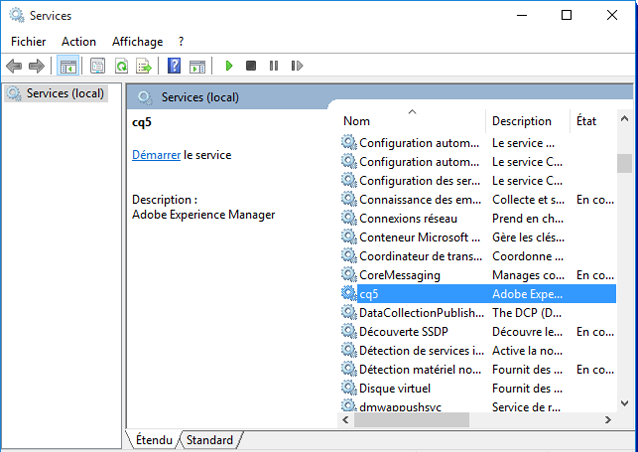
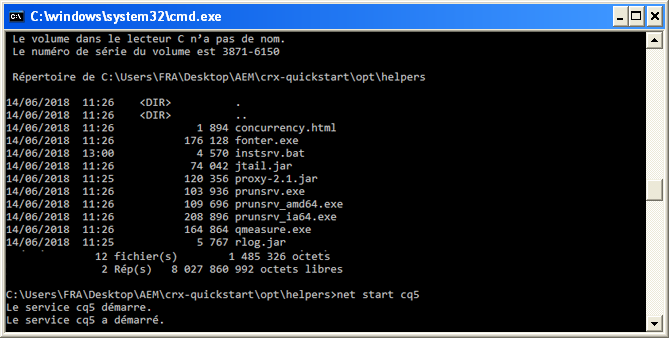
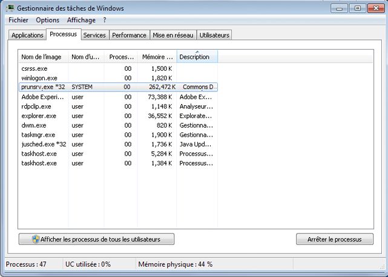
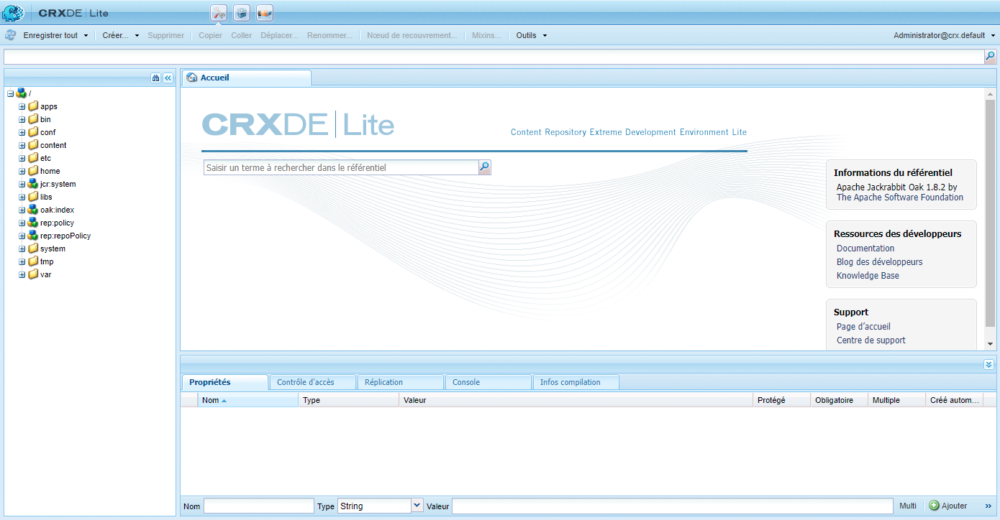

# Installation autonome personnalisée{#custom-standalone-install}

Cette section décrit les options disponibles lors de l’installation d’une instance AEM autonome. Vous pouvez également consulter [Éléments de stockage](/help/sites-deploying/storage-elements-in-aem-6.md) pour plus d’informations sur le choix du type de stockage principal après avoir installé AEM 6.

## Modification du numéro de port en renommant le fichier {#changing-the-port-number-by-renaming-the-file}

Le port par défaut pour AEM est 4502. Si ce port n&#39;est pas disponible ou est déjà utilisé, Quickstart se configure automatiquement pour utiliser le premier numéro de port disponible comme suit : 4502, 8080, 8081, 8082, 8083, 8084, 8085, 8888, 9362, `<*random*>`.

Vous pouvez également définir le numéro de port en renommant le fichier jar de démarrage rapide, de sorte que le nom du fichier inclut le numéro de port ; par exemple, `cq5-publish-p4503.jar` ou `cq5-author-p6754.jar`.

Les différentes règles suivantes s’appliquent lorsque vous renommez le fichier jar de démarrage rapide :

* Lorsque vous renommez le fichier, il doit être début avec `cq;` comme dans `cq5-publish-p4503.jar`.

* Nous vous recommandons d’ajouter *systématiquement* un préfixe au numéro de port sous la forme suivante : « -p », par exemple cq5-publish-p4503.jar ou cq5-author-p6754.jar.

>[!NOTE]
>
>Cet ajout garantit que vous n’avez pas à vous soucier d’appliquer les règles utilisées pour l’extraction du numéro de port :
>
>* le numéro de port doit comporter 4 ou 5 chiffres
>* ces chiffres doivent figurer après un tiret
>* si le nom du fichier comporte d’autres chiffres, alors le numéro du port doit comporter le préfixe `-p`
>* le préfixe « cq5 » au début du nom du fichier est ignoré

>


>[!NOTE]
>
>Vous pouvez également modifier le numéro de port en utilisant l&#39;option `-port` de la commande début.

### Remarques concernant Java 11 {#java-considerations}

Si vous exécutez Oracle Java 11 (ou en général les versions de Java ultérieures à la version 8), des modifications supplémentaires doivent être ajoutées à votre ligne de commande lors du démarrage d’AEM.

* Les commutateurs `-add-opens` suivants doivent être ajoutés afin d&#39;empêcher les messages d&#39;avertissement d&#39;accès de réflexion connexes dans l&#39;`stdout.log`

```shell
--add-opens=java.desktop/com.sun.imageio.plugins.jpeg=ALL-UNNAMED --add-opens=java.base/sun.net.www.protocol.jrt=ALL-UNNAMED --add-opens=java.naming/javax.naming.spi=ALL-UNNAMED --add-opens=java.xml/com.sun.org.apache.xerces.internal.dom=ALL-UNNAMED --add-opens=java.base/java.lang=ALL-UNNAMED --add-opens=java.base/jdk.internal.loader=ALL-UNNAMED --add-opens=java.base/java.net=ALL-UNNAMED -Dnashorn.args=--no-deprecation-warning
```

* De plus, vous devez utiliser le commutateur `-XX:+UseParallelGC` pour atténuer tout problème de performances potentiel.

Voici à quoi dpot ressembler les paramètres supplémentaires JVM au démarrage d’AEM sur Java 11 :

```shell
-XX:+UseParallelGC --add-opens=java.desktop/com.sun.imageio.plugins.jpeg=ALL-UNNAMED --add-opens=java.base/sun.net.www.protocol.jrt=ALL-UNNAMED --add-opens=java.naming/javax.naming.spi=ALL-UNNAMED --add-opens=java.xml/com.sun.org.apache.xerces.internal.dom=ALL-UNNAMED --add-opens=java.base/java.lang=ALL-UNNAMED --add-opens=java.base/jdk.internal.loader=ALL-UNNAMED --add-opens=java.base/java.net=ALL-UNNAMED -Dnashorn.args=--no-deprecation-warning
```

Enfin, si vous exécutez une instance mise à jour d’AE  6.3, assurez-vous que la propriété suivante est définie sur **true** sous `sling.properties` :

* `felix.bootdelegation.implicit`

## Modes d’exécution {#run-modes}

Les **modes d’exécution** (runmode) permettent d’ajuster l’instance AEM à un objectif spécifique, par exemple la création ou la publication, le test, le développement, l’intranet, etc. Ces modes permettent également de contrôler l’utilisation de l’échantillon de contenu. Cet échantillon de contenu est défini avant que le démarrage rapide ne soit créé et peut inclure des modules, configurations, etc. Il peut être particulièrement utile pour les installations prêtes pour la production lorsque vous souhaitez que votre installation reste épurée et sans échantillon de contenu. Pour plus d’informations, voir :

* [Modes d’exécution](/help/sites-deploying/configure-runmodes.md)

## Ajout d’un utilitaire d’installation de fichiers  {#adding-a-file-install-provider}

Par défaut, le dossier `crx-quickstart/install` est surveillé pour les fichiers.
Ce dossier n’existe pas, mais peut être simplement créé au moment de l’exécution.

En présence d’un lot, la configuration ou le module de contenu est placé dans ce répertoire. Il est automatiquement sélectionné et installé. S’il est supprimé, il est désinstallé.
Il s’agit d’une autre méthode pour placer des lots, des modules de contenu ou des configurations dans le référentiel.

Cette méthode est tout particulièrement intéressante dans plusieurs cas d’emploi :

* Au cours du développement, il peut être plus facile de placer un élément dans le système de fichiers.
* Si un problème survient, la console Web et le référentiel sont inaccessibles. Avec cette méthode, vous pouvez placer des lots supplémentaires dans ce répertoire et ils devraient s’installer.
* Vous pouvez créer le dossier `crx-quickstart/install` avant le lancement du démarrage rapide et vous pouvez y placer des modules supplémentaires.

>[!NOTE]
>
>Voir aussi [Comment installer automatiquement les packages CRX au démarrage du serveur](https://helpx.adobe.com/experience-manager/kb/HowToInstallPackagesUsingRepositoryInstall.html) pour obtenir des exemples.

## Installation et démarrage d’Adobe Experience Manager en tant que service Windows {#installing-and-starting-adobe-experience-manager-as-a-windows-service}

>[!NOTE]
>
>Assurez-vous de suivre la procédure suivante en étant connecté en tant qu’administrateur ou démarrez/exécutez les étapes suivantes à l’aide de la sélection du menu contextuel **Exécuter en tant qu’administrateur**.
>
>La connexion en tant qu’utilisateur avec des privilèges d’administrateur est **insuffisante**. Si vous n’êtes pas connecté en tant qu’administrateur lors de la réalisation des étapes, vous recevez des erreurs **Accès refusé**.

Pour installer et démarrer AEM en tant que service Windows :

1. Ouvrez le fichier crx-quickstart\opt\helpers\instsrv.bat dans un éditeur de texte.
1. Si vous configurez un serveur Windows 64 bits, remplacez toutes les instances de prunsrv par l’une des commandes suivantes, selon votre système d’exploitation :

   * prunsrv_amd64 
   * prunsrv_ia64 

   Cette commande appelle le script approprié qui début le démon de service Windows dans Java 64 bits au lieu de Java 32 bits.

1. Pour empêcher le processus de se diviser en plusieurs processus, augmentez la taille maximale du tas ainsi que les paramètres JVM PermGen. Recherchez la commande `set jvm_options` et définissez la valeur comme suit :

   `set jvm_options=-XX:MaxPermSize=256M;-Xmx1792m`

1. Ouvrez l’invite de commandes, définissez le répertoire courant sur le dossier crx-quickstart/opt/helpers de l’installation AEM et saisissez la commande suivante afin de créer le service :

   `instsrv.bat cq5`

   Pour vérifier que le service est créé, ouvrez Services dans le panneau de commande Outils d’administration ou tapez `start services.msc` dans l’invite de commandes. Le service cq5 s’affiche dans la liste.

1. Démarrez le service en procédant comme suit :

   * Dans le panneau de commande Services, cliquez sur cq5, puis sur Démarrer.

   

   * Sur la ligne de commande, tapez net start cq5.

   

1. Windows indique que le service est en cours d’exécution. AEM démarre et l’exécutable prunsrv apparaît dans le gestionnaire de tâches. Dans le navigateur Web, accédez à AEM, par exemple `https://localhost:4502` pour commencer à l’utiliser.

   

>[!NOTE]
>
>Les valeurs des propriétés du fichier instsrv.bat sont utilisées lors de la création du service Windows. Si vous modifiez les valeurs des propriétés de instsrv.bat, vous devez désinstaller, puis réinstaller le service.

>[!NOTE]
>
>Lors de l’installation d’AEM en tant que service, vous devez indiquer le chemin d’accès absolu au répertoire des journaux dans `com.adobe.xmp.worker.files.ncomm.XMPFilesNComm` à partir de Configuration Manager.

Pour désinstaller le service, cliquez sur **Arrêter** dans le panneau de commande **Services** ou dans la ligne de commande, accédez au dossier et saisissez `instsrv.bat -uninstall cq5`. Le service est supprimé de la liste du panneau de commande **Services** ou de la liste de la ligne de commande lorsque vous saisissez `net start`.

## Redéfinition de l’emplacement du répertoire de travail temporaire {#redefining-the-location-of-the-temporary-work-directory}

L’emplacement par défaut du dossier temporaire de la machine java est `/tmp`. AEM utilise également ce dossier, par exemple lors de la création de modules.

Si vous souhaitez modifier l’emplacement du dossier temporaire (par exemple, si vous avez besoin d’un répertoire avec plus d’espace libre), définissez un * `<new-tmp-path>`* en ajoutant le paramètre JVM :

`-Djava.io.tmpdir="/<*new-tmp-path*>"`

à :

* la ligne de commande de démarrage du serveur
* au paramètre d’environnement CQ_JVM_OPTS du script serverctl ou start

## Autres options disponibles à partir du fichier de démarrage rapide  {#further-options-available-from-the-quickstart-file}

D&#39;autres options et conventions de changement de nom sont décrites dans le fichier d&#39;aide Quickstart, disponible via l&#39;option -help. Pour accéder à l’aide, tapez :

* `java -jar cq5-<*version*>.jar -help`

```shell
Loading quickstart properties: default
Loading quickstart properties: instance
Setting properties from filename '/Users/Desktop/AEM/cq-quickstart-5.6.0.jar'
--------------------------------------------------------------------------------
Adobe Experience Manager Quickstart (build 20130129)
--------------------------------------------------------------------------------
Usage:
 Use these options on the Quickstart command line.
--------------------------------------------------------------------------------

-help (--help,-h)
         Show this help message
-quickstart.server.port (-p,-port) <port>
         Set server port number
-contextpath (-c,-org.apache.felix.http.context_path) <contextpath>
         Set context path
-debug <port>
         Enable Java Debugging on port number; forces forking
-gui
         Show GUI if running on a terminal
-nobrowser (-quickstart.nobrowser)
         Do not open browser at startup
-unpack
         Unpack installation files only, do not start the server (implies
         -verbose)
-v (-verbose)
         Do not redirect stdout/stderr to files and do not close stdin
-nofork
         Do not fork the JVM, even if not running on a console
-fork
         Force forking the JVM if running on a console, using recommended
         default memory settings for the forked JVM.
-forkargs <args> [<args> ...]
         Additional arguments for the forked JVM, defaults to '-Xmx1024m
         -XX:MaxPermSize=256m '.  Use -- to specify values starting with -,
         example: '-forkargs -- -server'
-a (--interface) <interface>
         Optional IP address (interface) to bind to
-pt <string>
         Process type (main/fork) - do not use directly, used when forking a
         process
-r <string> [<string> [<string> [<string> [<string> [<string> [<string> [<string> [<string> [<string>]]]]]]]]]
         Runmode(s) - Use this to define the run mode(s)
-b <string>
         Base folder - defines the path under which the quickstart work folder
         is created
-low-mem-action <string>
         Low memory action - what to do if memory is insufficient at startup
-use-control-port
         Start a control port
-ll <level>
         Define launchpad log level (1 = error...4 = debug)
--------------------------------------------------------------------------------
Quickstart filename options
--------------------------------------------------------------------------------
Usage:
 Rename the jar file, including one of the patterns shown below, to set the
corresponding option. Command-line options have priority on these filename
patterns.
--------------------------------------------------------------------------------

-NNNN
         Include -NNNN.jar or -pNNNN in the renamed jar filename to run on port
         NNNN, for example: quickstart-8085.jar
-nobrowser
         Include -nobrowser in the renamed jar filename to avoid opening the
         browser at startup, example: quickstart-nobrowser-8085.jar
-publish
         Include -publish in the renamed jar filename to run cq5 in "publish"
         mode, example: cq5-publish-7502.jar
--------------------------------------------------------------------------------
The license.properties file
--------------------------------------------------------------------------------
  The license.properties file stores licensing information, created from the
  licensing form displayed on first startup and stored in the folder from where
  Quickstart is run.
--------------------------------------------------------------------------------
Log files
--------------------------------------------------------------------------------
  Once Quickstart has been unpacked and started, log files can be found under
  ./crx-quickstart/logs.
--------------------------------------------------------------------------------
```

## Installation d’AEM dans l’environnement Amazon EC2 {#installing-aem-in-the-amazon-ec-environment}

Lors de l’installation d’AEM sur une instance Amazon Elastic Compute Cloud (EC2), si vous installez à la fois l’instance de création (author) et l’instance de publication (publish) sur l’instance EC2, l’instance de création est installée correctement en suivant la procédure [Installation des instances d’AEM Manager](#installinginstancesofaemmanager) ; par contre l’instance de publication devient une instance de création.

Avant d’installer l’instance de publication sur l’environnement EC2, procédez comme suit :

1. Décompressez le fichier jar de l’instance de publication avant de démarrer l’instance pour la première fois. Pour décompresser le fichier, utilisez la commande suivante :

   ```xml
   java -jar quickstart.jar -unpack
   ```

   >[!NOTE]
   >
   >Si vous modifiez le mode **après** avoir démarré l’instance pour la première fois, vous ne pouvez plus modifier le mode d’exécution.

1. Démarrez l’instance en exécutant :

   ```xml
   java -jar quickstart.jar -r publish
   ```

   >[!CAUTION]
   >
   >Veillez à exécuter l’instance après l’avoir décompressée en exécutant la commande ci-dessus. Sinon, le remplissage de quickstart.properties ne sera pas généré. Sans ce fichier, toutes les prochaines mises à niveau d’AEM échoueront.

1. Dans le dossier **bin**, ouvrez le script **start** et vérifiez la section suivante :

   ```xml
   # runmode(s)
   if [ -z "$CQ_RUNMODE" ]; then
    CQ_RUNMODE='author'
   fi
   ```

1. Définissez le mode d’exécution sur **publish** et enregistrez le fichier.

   ```xml
   # runmode(s)
   if [ -z "$CQ_RUNMODE" ]; then
    CQ_RUNMODE='publish'
   fi
   ```

1. Arrêtez l’instance puis redémarrez-la en exécutant le script **start**.

## Vérification de l’installation  {#verifying-the-installation}

Vous pouvez utiliser les liens suivants afin de vérifier que l’installation fonctionne (tous les exemples présument que l’instance s’exécute sur le port 8080 de localhost, que CRX est installé sous /crx et Launchpad sous /) :

* `https://localhost:8080/crx/de`
Console du CRXDE Lite.

* `https://localhost:8080/system/console`
Console Web.

## Actions après l’installation {#actions-after-installation}

Bien qu’il existe de nombreuses possibilités pour configurer la gestion de contenu web d’AEM, certaines actions doivent être entreprises ou, au moins, vérifiées immédiatement après l’installation :

* Consultez la [liste de contrôle de sécurité](/help/sites-administering/security-checklist.md) pour connaître les tâches nécessaires pour vous assurer que votre système reste sécurisé.
* Vérifiez la liste des utilisateurs et groupes par défaut qui sont installés avec la gestion de contenu web d’AEM. Vérifiez si vous souhaitez entreprendre des actions sur d’autres comptes - voir [Sécurité et administration des utilisateurs](/help/sites-administering/security.md) pour plus d’informations.

## Accès à CRXDE Lite et à la console Web  {#accessing-crxde-lite-and-the-web-console}

Une fois que vous avez démarré la gestion de contenu web d’AEM, vous pouvez également accéder à :

* [CRXDE Lite](#accessing-crxde-lite) : application utilisée pour accéder et gérer le référentiel
* [Console Web](#accessing-the-web-console) : utilisée pour gérer ou configurer les lots OSGi (connue également sous le nom de console OSGi)

### Accès à CRXDE Lite  {#accessing-crxde-lite}

Pour ouvrir le CRXDE Lite, vous pouvez sélectionner **CRXDE Lite** dans l’écran de bienvenue ou utiliser votre navigateur pour naviguer jusqu’à

```
 https://<<i>host</i>>:<<i>port</i>>/crx/de/index.jsp
```

Par exemple:
`https://localhost:4502/crx/de/index.jsp`



#### Accès à la console Web {#accessing-the-web-console}

Pour accéder à la console Web Adobe CQ, vous pouvez sélectionner **Console OSGi** à partir de l’écran de bienvenue ou utiliser votre navigateur pour accéder à

```
 https://<host>:<port>/system/console
```

Par exemple :
`https://localhost:4502/system/console`
ou pour la page Bundles
`https://localhost:4502/system/console/bundles`


Pour plus d’informations, voir [Configuration OSGi avec la console Web](/help/sites-deploying/configuring-osgi.md#osgi-configuration-with-the-web-console).

## Résolution des incidents {#troubleshooting}

Pour plus d’informations sur la résolution des problèmes qui peuvent survenir en cours d’installation, voir :

* [Résolution des incidents](/help/sites-deploying/troubleshooting.md)

## Désinstallation d’Adobe Experience Manager  {#uninstalling-adobe-experience-manager}

Dans la mesure où AEM est installé dans un seul répertoire, un utilitaire de désinstallation n’est pas nécessaire. La désinstallation peut consister uniquement à supprimer l’intégralité du répertoire d’installation, bien que la désinstallation d’AEM dépende du résultat que vous souhaitez obtenir et du type de stockage persistent utilisé.

Si le stockage persistent est incorporé dans le répertoire d’installation (dans l’installation TarPM par défaut, par exemple), la suppression des dossiers entraîne également celle des données.

>[!NOTE]
>
>Adobe conseille vivement de sauvegarder le référentiel avant de supprimer AEM. Si vous supprimez l’intégralité du répertoire &lt;cq-installation-directory>, vous supprimez le référentiel. Pour conserver les données du référentiel avant la suppression, déplacez ou copiez le dossier &lt;cq-installation-directory>/crx-quickstart/repository dans un autre emplacement avant de supprimer les autres dossiers.

Si votre installation AEM utilise un système de stockage externe, comme un serveur de base de données, la suppression du dossier n’entraîne pas la suppression automatique des données, mais elle supprime la configuration du stockage, ce qui rend difficile la restauration du contenu JCR.
