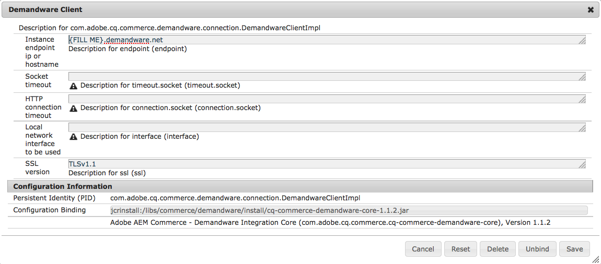

# Salesforce Commerce Cloud{#salesforce-commerce-cloud}

Le déploiement des packs eCommerce nécessaires fournira la fonctionnalité complète de la structure eCommerce, ainsi qu&#39;une implémentation de référence de la fonctionnalité eCommerce telle qu&#39;elle est fournie avec une implémentation Salesforce Commerce Cloud / Demandware (y compris un catalogue de démonstration).

## Modules nécessaires à eCommerce avec Salesforce Commerce Cloud {#packages-needed-for-ecommerce-with-salesforce-commerce-cloud}

Pour installer la fonctionnalité eCommerce, vous devez disposer des éléments suivants :

* Structure d’AEM eCommerce :

   * fait partie d’une installation AEM standard

* Module de contenu d’AEM Demandware Commerce

   * cq-6.4.0-featurepack-10262

>[!NOTE]
>
>Cette intégration prend en charge les instances Salesforce Commerce Cloud/Demandware configurées pour utiliser la version 17.6 ou ultérieure d’OCAPI.

### Installation d’eCommerce avec Salesforce Commerce Cloud {#installation-of-ecommerce-with-salesforce-commerce-cloud}

Pour installer AEM avec une intégration Demandware Commerce (à l’aide du catalogue de démonstration, Geometrixx Outdoors), les étapes de base sont les suivantes :

1. [Installation d’AEM](/help/sites-deploying/deploy.md).
1. Installez le package de contenu à l’aide du [gestionnaire de packages](/help/sites-administering/package-manager.md) :
1. [Créez](/help/sites-authoring/page-authoring.md) les pages supplémentaires dont vous avez besoin dans AEM.

>[!NOTE]
>
>Pour télécharger les packages, accédez à [Package Share](/help/sites-administering/package-manager.md#package-share).

La connexion serveur entre AEM et le sandbox Demandware doit être configurée. La majeure partie de la configuration est déjà configurée pour fonctionner avec le module de contenu de démonstration SiteGenisis fourni à l’aide des chemins d’accès, des bibliothèques, etc. par défaut. Si le connecteur est utilisé avec d’autres sites et bibliothèques, vous devez mettre cette configuration à jour.

1. Accédez à [https://localhost:4502/system/console/configMgr](https://localhost:4502/system/console/configMgr).
1. Cliquez sur **Demandware Client**.
1. Saisissez l’**adresse IP ou le nom d’hôte du point de terminaison de l’instance**, au besoin.

   

1. Cliquez sur **Enregistrer**.
1. Cliquez sur **Demandware TransportHandler Plugin for WebDAV**.
1. Définissez l’**utilisateur WebDAV** et le **mot de passe utilisateur WebDAV**.

   

1. Cliquez sur **Enregistrer**.

#### Réplication {#replication}

La réplication doit être activée après l’installation du package. Vous pouvez vérifier que : [https://localhost:4502/etc/replication/agents.author/demandware.html](https://localhost:4502/etc/replication/agents.author/demandware.html)

>[!NOTE]
>
>L’agent de réplication est configuré au niveau du journal d’informations par défaut. Si vous souhaitez disposer d’informations supplémentaires, vous pouvez définir le niveau du journal sur Débogage.

#### OAuth {#oauth}

Le client OAuth est configuré de manière à fonctionner avec une instance de sandbox Demandware. À des fins de test, aucune modification n’est nécessaire.

Pour les systèmes de transit et de production, les clients OAuth doivent être configurés avec l’ID client et le mot de passe appropriés.

1. Accédez à [https://localhost:4502/system/console/configMgr](https://localhost:4502/system/console/configMgr).
1. Cliquez sur **Demandware Jeton d&#39;accès provider**.

   

1. Modifiez les valeurs, au besoin, et cliquez sur **Enregistrer** (Save).

### Sandbox Salesforce Commerce Cloud  {#salesforce-commerce-cloud-sandbox}

Le sandbox Demandware doit être configuré de manière à exécuter le nouveau moteur de modèles Velocity.

>[!NOTE]
>
>L’Assistant ci-dessous ne fait pas partie du connecteur AEM Demandware. Il est fourni en l’état dans le cadre du module de contenu de démonstration pour vous aider à configurer rapidement les pages de démonstration de SiteGenesis.

1. Accédez à [https://localhost:4502/etc/demandware/init.html](https://localhost:4502/etc/demandware/init.html).
1. Cliquez sur **Modifier** (Edit).
1. Vérifiez les valeurs et cliquez sur **OK**.
1. Cliquez sur **Initialiser** (Initialize).
1. Accédez au dossier WebDAV et recherchez les fichiers de modèle publiés, par exemple sous `adobe01-tech-prtnr-na01-dw.demandware.net/on/demandware.servlet/webdav/Sites/Dynamic/SiteGenesis`.

   >[!NOTE]
   >
   >L&#39;extension sera `.vs`.

1. Recherchez également les fichiers JS et CSS exportés, par exemple sous `adobe01-tech-prtnr-na01-dw.demandware.net/on/demandware.servlet/webdav/Sites/Libraries/SiteGenesisSharedLibrary`.

