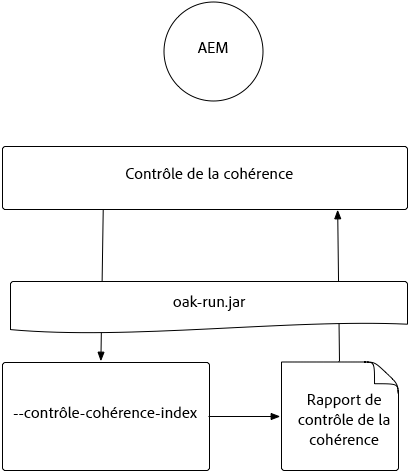
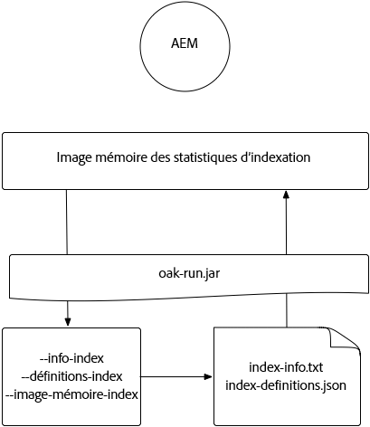
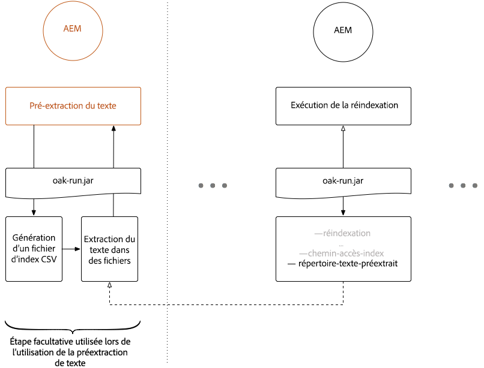
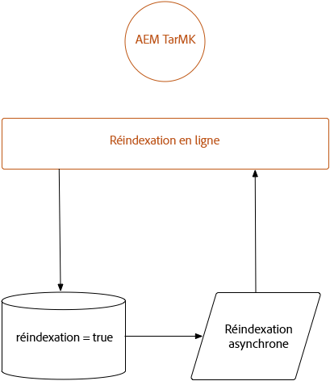
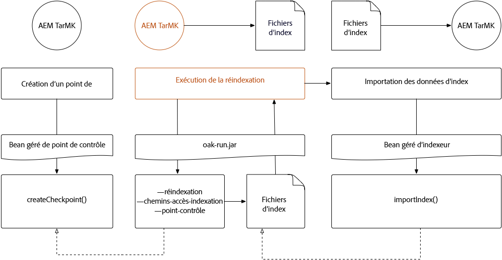
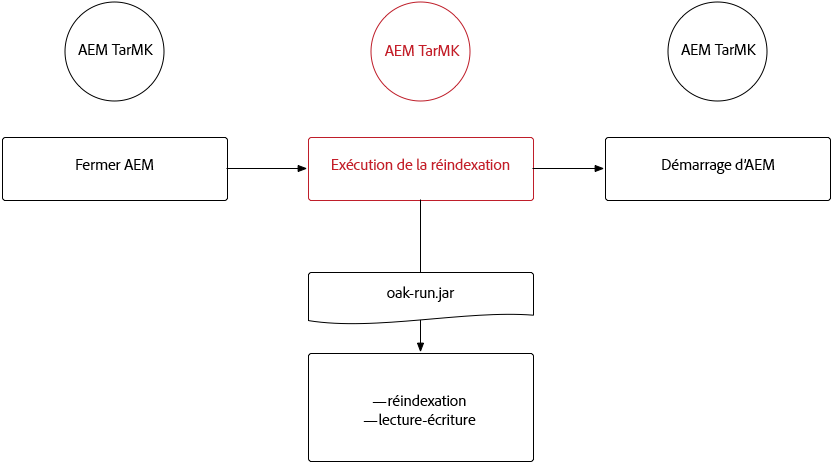
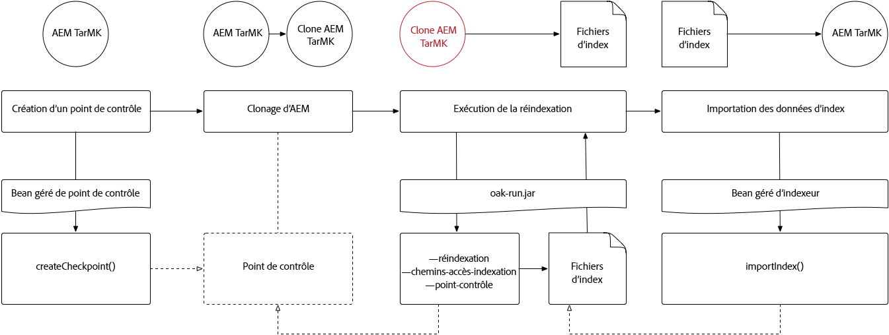
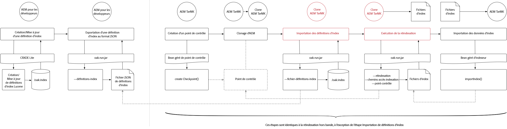
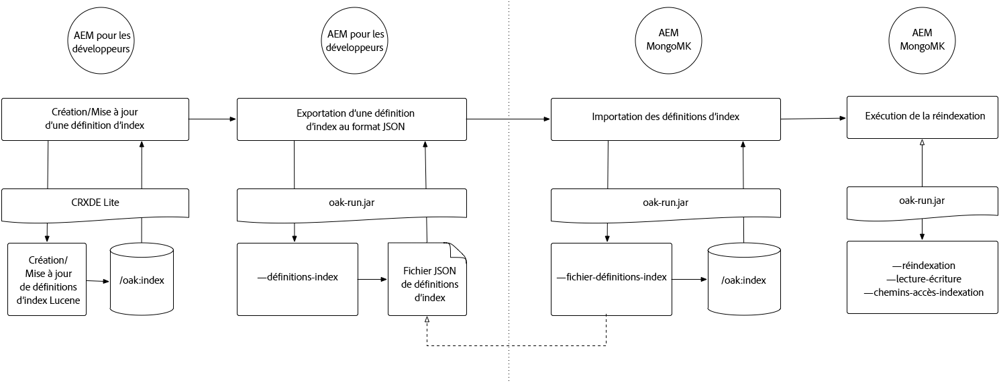

# Indexation par l’intermédiaire du fichier Jar d’Oak-run {#indexing-via-the-oak-run-jar}

Oak-run prend en charge tous les scénarios d’indexation sur la ligne de commande, sans qu’il faille opérer à partir du niveau JMX. Les avantages de la méthode oak-run sont les suivants :

1. Il s’agit d’un nouvel ensemble d’outils d’indexation pour AEM 6.4.
1. Il réduit la durée de réindexation, ce qui a un effet bénéfique sur les délais de réindexation des référentiels de grande taille.
1. Il réduit la consommation des ressources au cours de la réindexation dans AEM, ce qui se traduit par de meilleures performances du système pour d’autres activités AEM.
1. Oak-run fournit une prise en charge hors-bande : si les conditions de production ne permettent pas d’exécuter une réindexation sur les instances de production, un environnement cloné peut être utilisé à cette fin afin d’éviter un impact critique sur les performances.

Vous trouverez, ci-dessous, la liste des scénarios d’utilisation qui peuvent être appliqués lors de l’exécution d’opérations d’indexation par le biais de l’outil `oak-run`.

## Contrôles de cohérence d’index {#indexconsistencychecks}

>[!NOTE]
>
>Pour plus d’informations sur ce scénario, voir [Cas d’utilisation 1 - Contrôle de cohérence de l’index](/help/sites-deploying/oak-run-indexing-usecases.md#usercase1indexconsistencycheck).

* `oak-run.jar`détermine rapidement si les index lucene oak sont corrompus.
* Il est recommandé de lancer l’exécution sur une instance en cours d’utilisation pour les niveaux de contrôle de cohérence 1 et 2.

## Statistiques sur les index {#indexstatistics}

>[!NOTE]
>
>Pour obtenir des informations détaillées sur ce scénario, voir [Cas d’utilisation 2 – Statistiques sur les index](/help/sites-deploying/oak-run-indexing-usecases.md#usecase2indexstatistics).

* `oak-run.jar` vide toutes les définitions d’index, toutes les statistiques d’index importantes et tout le contenu d’index en vue d’une analyse hors ligne.
* Son exécution est recommandée sur une instance AEM en cours d’utilisation.

## Re-indexing Approach Decision Tree {#reindexingapproachdecisiontree}

Ce diagramme illustre une arborescence de décision concernant l’utilisation des diverses méthodes de réindexation.

## Réindexation de MongoMK/RDMBMK {#reindexingmongomk}

>[!NOTE]
>
>Pour obtenir des informations détaillées sur ce scénario, voir [Cas d’utilisation 3 – Réindexation](/help/sites-deploying/oak-run-indexing-usecases.md#usecase3reindexing).

### Pré-extraction de texte pour SegmentNodeStore et DocumentNodeStore {#textpre-extraction}

La [pré-extraction de texte](/help/sites-deploying/best-practices-for-queries-and-indexing.md#how-to-perform-text-pre-extraction) (une fonctionnalité qui existait déjà dans AEM 6.3) permet de réduire la durée de réindexation. Elle peut être utilisée avec toutes les méthodes de réindexation.

En fonction de la méthode d’indexation du fichier `oak-run.jar`, diverses étapes seront effectuées de part et d’autre de l’étape « Procéder à la réindexation » dans le diagramme ci-dessous.

>[!NOTE]
>
>La couleur orange indique des activités dans lesquelles AEM doit se trouver dans une fenêtre de maintenance.

### Réindexation en ligne pour MongoMK ou RDBMK à l’aide du fichier oak-run.jar {#onlinere-indexingformongomk}

>[!NOTE]
>
>Pour obtenir des informations détaillées sur ce scénario, voir [Réindexation – DocumentNodeStore](/help/sites-deploying/oak-run-indexing-usecases.md#reindexdocumentnodestore).

Il s’agit de la méthode recommandée pour réindexer les installations AEM MongoMK (et RDBMK). Aucune autre méthode ne doit être utilisée.

Ce processus ne doit être exécuté que sur une seule instance AEM du cluster.

## Réindexation de TarMK {#re-indexingtarmk}

>[!NOTE]
>
>Pour obtenir des informations détaillées sur ce scénario, voir [Réindexation – SegmentNodeStore](/help/sites-deploying/oak-run-indexing-usecases.md#reindexsegmentnodestore).

* **Observations relatives à Cold Standby (TarMK)**

   * Il n’existe aucune considération particulière concernant Cold Standby ; les instances Cold Standby synchroniseront les modifications comme d’habitude.

* **Fermes de publication AEM (les fermes de publication AEM doivent toujours être TarMK)**

   * Dans le cas de la ferme de publication, le processus doit être exécuté pour l’ensemble des instances de publication. Une autre possibilité consiste à effectuer cette opération pour une instance de publication, puis de cloner la configuration pour les autres (en prenant toutes les précautions d’usage lors du clonage des instances AEM ; sling.id ; devrait pointer vers quelque chose ici).

### Réindexation en ligne pour TarMK {#onlinere-indexingfortarmk}

>[!NOTE]
>
>Pour obtenir des informations détaillées sur ce scénario, voir [Réindexation en ligne – SegmentNodeStore](/help/sites-deploying/oak-run-indexing-usecases.md#onlinereindexsegmentnodestore).

Il s’agit de la méthode utilisée avant l’introduction des nouvelles fonctionnalités d’indexation du fichier oak-run.jar. Elle peut être exécutée en définissant la propriété `reindex=true` sur l’index Oak.

Cette méthode peut être utilisée si le client juge acceptables les effets sur l’index, du point de vue de la durée et des performances. C’est généralement le cas pour les installations AEM de petite taille et de taille moyenne.

### Réindexation en ligne de TarMK à l’aide du fichier oak-run.jar {#onlinere-indexingtarmkusingoak-run-jar}

>[!NOTE]
>
>Pour obtenir des informations détaillées sur ce scénario, voir [Réindexation en ligne – SegmentNodeStore – L’instance AEM est en cours d’exécution](/help/sites-deploying/oak-run-indexing-usecases.md#onlinereindexsegmentnodestoretheaeminstanceisrunning).

La réindexation en ligne de TarMK s’avère plus rapide que la réindexation TarkMK en ligne décrite ci-dessus. Cependant, elle exige également d’être exécutée au cours d’une fenêtre de maintenance, en sachant que cette fenêtre sera plus étroite. Son exécution s’accompagne, en outre, d’étapes supplémentaires.

>[!NOTE]
>
>La couleur orange indique les opérations au cours desquelles AEM doit être exécuté dans une fenêtre de maintenance.

### Réindexation hors ligne de TarMK à l’aide du fichier oak-run.jar {#offlinere-indexingtarmkusingoak-run-jar}

>[!NOTE]
>
>Pour obtenir des informations détaillées sur ce scénario, voir [Réindexation en ligne – SegmentNodeStore – L’instance AEM est arrêtée](/help/sites-deploying/oak-run-indexing-usecases.md#onlinereindexsegmentnodestoreaeminstanceisdown).

La réindexation hors ligne de TarMK est la méthode de réindexation la plus simple basée sur le fichier `oak-run.jar`, en ce sens qu’elle ne nécessite qu’un seul commentaire `oak-run.jar` . Cependant, elle exige que l’instance AEM soit arrêtée.

>[!NOTE]
>
>La couleur rouge indique les opérations pour lesquelles AEM doit être arrêté.

### Réindexation hors-bande de TarMK à l’aide du fichier oak-run.jar  {#out-of-bandre-indexingtarmkusingoak-run-jar}

>[!NOTE]
>
>Pour obtenir des informations détaillées sur ce scénario, voir [ Réindexation hors-bande – SegmentNodeStore](/help/sites-deploying/oak-run-indexing-usecases.md#outofbandreindexsegmentnodestore).

La réindexation hors-bande réduit l’incidence de la réindexation sur les instances AEM en cours d’utilisation.

>[!NOTE]
>
>La couleur rouge indique les opérations pour lesquelles AEM peut être arrêté.

## Mise à jour des définitions d’indexation {#updatingindexingdefinitions}

>[!NOTE]
>
>Pour obtenir des informations détaillées sur ce scénario, voir [Cas d’utilisation 4 – Mise à jour des définitions d’indexation](/help/sites-deploying/oak-run-indexing-usecases.md#usecase4updatingindexdefinitions).

### Création et mise à jour des définitions d’index sur TarMK à l’aide d’ACS Ensure Index {#creatingandupdatingindexdefinitionsontarmkusingacsensureindex}

>[!NOTE]
>
>ACS Ensure Index est un projet soutenu par la communauté, mais pas par Adobe Support.

Cela vous permet d’envoyer une définition d’index via un module de contenu, ce qui se traduit, par la suite, par la possibilité d’effectuer une réindexation en définissant l’indicateur de réindexation sur `true`. Cela fonctionne avec les plus petites configurations pour lesquelles la réindexation est de courte durée.

Pour plus d’informations, consultez la [documentation d’ACS Ensure Index](https://adobe-consulting-services.github.io/acs-aem-commons/features/ensure-oak-index/index.html).

### Création et mise à jour des définitions d’index sur TarMK à l’aide du fichier oak-run.jar {#creatingandupdatingindexdefinitionsontarmkusingoak-run-jar}

Si l’exécution d’une réindexation à l’aide de méthodes autres que `oak-run.jar` s’avère trop pénalisante sur le plan de la durée et des performances, vous pouvez adopter l’approche suivante basée sur `oak-run.jar` pour importer et réindexer des définitions d’index Lucene dans une installation AEM basée sur TarMK.

### Création et mise à jour des définitions d’index sur MongoMK à l’aide du fichier oak-run.jar {#creatingandupdatingindexdefinitionsonmonogmkusingoak-run-jar}

Si l’exécution d’une réindexation à l’aide de méthodes autres que `oak-run.jar` s’avère trop pénalisante sur le plan de la durée et des performances, vous pouvez adopter l’approche suivante basée sur `oak-run.jar` pour importer et réindexer des définitions d’index Lucene dans des installations AEM basées sur MongoMK.

