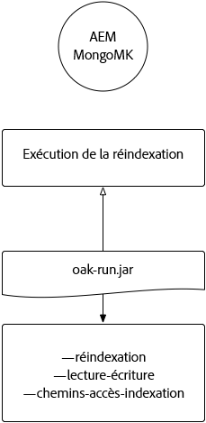

# Indexation par l’intermédiaire du fichier Jar d’Oak-run {#indexing-via-the-oak-run-jar}

Oak-run prend en charge tous les cas d’utilisation d’indexation sur la ligne de commande sans avoir à opérer au niveau JMX. Les avantages de l’approche oak-run sont les suivants :

1. Elle constitue un nouvel ensemble d’outils d’indexation pour AEM 6.4.
1. Elle réduit la durée de réindexation, ce qui a un effet bénéfique sur les délais de réindexation des référentiels de grande taille.
1. Elle réduit la consommation des ressources au cours de la réindexation dans AEM, ce qui se traduit par de meilleures performances du système pour d’autres activités AEM.
1. Oak-run fournit une prise en charge hors-bande : si les conditions d’exploitation ne vous permettent pas d’exécuter une réindexation sur les instances d’exploitation, un environnement cloné peut être utilisé à cette fin afin d’éviter un impact critique sur les performances.

Vous trouverez ci-dessous une liste de cas d’utilisation qui peuvent être utilisés lors de l’exécution d’opérations d’indexation au moyen de l’outil `oak-run`.

## Contrôles de cohérence d’index {#indexconsistencychecks}

>[!NOTE]
>
>Pour obtenir des informations détaillées sur ce scénario, consultez le [Cas d’utilisation 1 - Contrôle de cohérence d’index](/help/sites-deploying/oak-run-indexing-usecases.md#usercase1indexconsistencycheck).

* `oak-run.jar` détermine rapidement si les index Lucene Oak sont corrompus.
* Il est recommandé de lancer l’exécution sur une instance AEM en cours d’utilisation pour les niveaux de contrôle de cohérence 1 et 2.

## Statistiques d’index {#indexstatistics}

>[!NOTE]
>
>Pour obtenir des informations détaillées sur ce scénario, consultez le [Cas d’utilisation 2 - Statistiques d’index](/help/sites-deploying/oak-run-indexing-usecases.md#usecase2indexstatistics).

* `oak-run.jar` vide toutes les définitions d’index, toutes les statistiques d’index importantes, ainsi que tout le contenu d’index en vue d’une analyse hors ligne.
* Son exécution est recommandée sur une instance AEM en cours d’utilisation.

## Arborescence décisionnelle d’approche de réindexation {#reindexingapproachdecisiontree}

Ce diagramme illustre une arborescence de décision concernant l’utilisation des diverses approches de réindexation.

## Réindexation de MongoMK/RDMBMK {#reindexingmongomk}

>[!NOTE]
>
>Pour obtenir des informations détaillées sur ce scénario, consultez le [Cas d’utilisation 3 - Réindexation](/help/sites-deploying/oak-run-indexing-usecases.md#usecase3reindexing).

### Pré-extraction de texte pour SegmentNodeStore et DocumentNodeStore {#textpre-extraction}

La [pré-extraction de texte](/help/sites-deploying/best-practices-for-queries-and-indexing.md#how-to-perform-text-pre-extraction) (fonctionnalité d’AEM 6.3) peut être utilisée pour réduire le temps de réindexation. La pré-extraction de texte peut être utilisée avec toutes les approches de réindexation.

En fonction de l’approche d’indexation du fichier `oak-run.jar`, diverses étapes sont effectuées de part et d’autre de l’étape « Procéder à la réindexation » dans le diagramme ci-dessous.

>[!NOTE]
>
>La couleur orange indique les activités pour lesquelles AEM doit être exécuté dans une fenêtre de maintenance.

### Réindexation en ligne pour MongoMK ou RDBMK à l’aide du fichier oak-run.jar {#onlinere-indexingformongomk}

>[!NOTE]
>
>Pour obtenir des informations détaillées sur ce scénario, voir [Réindexation - DocumentNodeStore](/help/sites-deploying/oak-run-indexing-usecases.md#reindexdocumentnodestore).

Il s’agit de la méthode recommandée pour réindexer les installations AEM MongoMK (et RDBMK). Aucune autre méthode ne doit être utilisée.

Exécutez ce processus uniquement sur une seule instance AEM du cluster.

## Réindexation de TarMK {#re-indexingtarmk}

>[!NOTE]
>
>Pour obtenir des informations détaillées sur ce scénario, voir [Réindexation - SegmentNodeStore](/help/sites-deploying/oak-run-indexing-usecases.md#reindexsegmentnodestore).

* **Observations relatives à Cold Standby (TarMK)**

   * Il n’existe aucune considération spéciale pour les reprises à froid (Cold Standby). La synchronisation des instances Cold Standby change comme d’habitude.

* **Fermes de publication AEM (les fermes de publication AEM doivent toujours être TarMK)**

   * Dans le cas de fermes de publication, veuillez exécuter les étapes sur la totalité des publications OU sur une seule publication. Ensuite, clonez la configuration pour les autres publications (en prenant toutes les précautions habituelles lors du clonage d’instances AEM ; sling.id - doit ici pointer vers un élément).

### Réindexation en ligne pour TarMK {#onlinere-indexingfortarmk}

>[!NOTE]
>
>Pour obtenir des informations détaillées sur ce scénario, voir [Réindexation en ligne - SegmentNodeStore](/help/sites-deploying/oak-run-indexing-usecases.md#onlinereindexsegmentnodestore).

Il s’agit de la méthode utilisée avant l’introduction des nouvelles fonctionnalités d’indexation du fichier oak-run.jar. Elle peut être exécutée en définissant la propriété `reindex=true` sur l’index Oak.

Cette approche peut être utilisée si les effets sur le temps et les performances à indexer sont acceptables pour la clientèle. C’est souvent le cas pour les installations AEM de petite et de moyenne tailles.

### Réindexation en ligne de TarMK à l’aide du fichier oak-run.jar {#onlinere-indexingtarmkusingoak-run-jar}

>[!NOTE]
>
>Pour obtenir des informations détaillées sur ce scénario, consultez la section [Réindexation en ligne – SegmentNodeStore – L’instance AEM est en cours d’exécution](/help/sites-deploying/oak-run-indexing-usecases.md#onlinereindexsegmentnodestoretheaeminstanceisrunning).

La réindexation en ligne de TarMK à l’aide du fichier oak-run.jar est plus rapide que la [Réindexation en ligne pour TarMK](#onlinere-indexingfortarmk) décrite ci-dessus. Cependant, elle exige également d’être exécutée au cours d’une fenêtre de maintenance, en sachant que cette fenêtre sera plus étroite. Son exécution s’accompagne, en outre, d’étapes supplémentaires.

>[!NOTE]
>
>La couleur orange indique les opérations au cours desquelles AEM doit être exécuté au cours d’une session de maintenance.

### Réindexation hors ligne de TarMK à l’aide du fichier oak-run.jar {#offlinere-indexingtarmkusingoak-run-jar}

>[!NOTE]
>
>Pour plus d’informations à propos de ce scénario, reportez-vous à [Réindexation en ligne - SegmentNodeStore - L’instance AEM est arrêtée](/help/sites-deploying/oak-run-indexing-usecases.md#onlinereindexsegmentnodestoreaeminstanceisdown).

La réindexation hors ligne de TarMK est la méthode de réindexation la plus simple basée sur le fichier `oak-run.jar`, en ce sens qu’elle ne nécessite qu’un seul commentaire `oak-run.jar`. Toutefois, elle nécessite que l’instance AEM soit arrêtée.

>[!NOTE]
>
>La couleur rouge indique les opérations pour lesquelles AEM doit être arrêté.

### Réindexation hors-bande de TarMK à l’aide du fichier oak-run.jar  {#out-of-bandre-indexingtarmkusingoak-run-jar}

>[!NOTE]
>
>Pour obtenir des informations détaillées sur ce scénario, voir [Réindexation hors-bande – SegmentNodeStore](/help/sites-deploying/oak-run-indexing-usecases.md#outofbandreindexsegmentnodestore).

L’indexation hors bande réduit l’impact de l’indexation sur les instances AEM en cours d’utilisation.

>[!NOTE]
>
>La couleur rouge indique les opérations pour lesquelles AEM peut être arrêté.

## Mise à jour des définitions d’indexation {#updatingindexingdefinitions}

>[!NOTE]
>
>Pour obtenir des informations détaillées sur ce scénario, consultez le [Cas d’utilisation 4 – Mise à jour des définitions d’indexation](/help/sites-deploying/oak-run-indexing-usecases.md#usecase4updatingindexdefinitions).

### Création et mise à jour des définitions d’index sur TarMK à l’aide d’ACS Ensure Index {#creatingandupdatingindexdefinitionsontarmkusingacsensureindex}

>[!NOTE]
>
>ACS Ensure Index est un projet géré par la communauté, il n’est pas pris en charge par l’assistance Adobe.

Celui-ci permet d’envoyer la définition d’index par le biais du package de contenu, ce qui entraîne une réindexation en définissant l’indicateur reindex sur `true`. Cela fonctionne avec des petites configurations pour lesquelles la réindexation prend peu de temps.

Pour plus d’informations, reportez-vous à [Documentation d’ACS Ensure Index](https://adobe-consulting-services.github.io/acs-aem-commons/features/ensure-oak-index/index.html).

### Création et mise à jour des définitions d’index sur TarMK à l’aide du fichier oak-run.jar {#creatingandupdatingindexdefinitionsontarmkusingoak-run-jar}

Si l’exécution d’une réindexation à l’aide de méthodes autres que `oak-run.jar` s’avère trop pénalisante sur le plan de la durée et des performances, vous pouvez adopter l’approche suivante basée sur `oak-run.jar` pour importer et réindexer des définitions d’index Lucene dans une installation AEM basée sur TarMK.

### Création et mise à jour des définitions d’index sur MongoMK à l’aide du fichier oak-run.jar {#creatingandupdatingindexdefinitionsonmonogmkusingoak-run-jar}

Si l’exécution d’une réindexation à l’aide de méthodes autres que `oak-run.jar` s’avère trop pénalisante sur le plan de la durée et des performances, vous pouvez adopter l’approche suivante basée sur `oak-run.jar` pour importer et réindexer des définitions d’index Lucene dans une installation AEM basée sur MongoMK.

