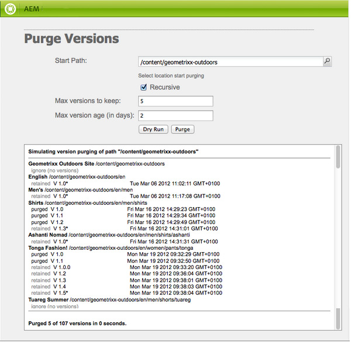
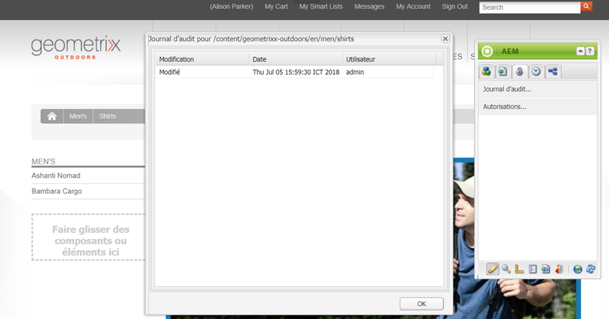
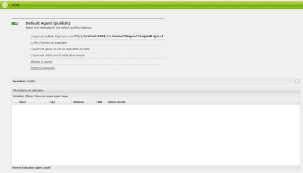

# Contrôle et maintien de votre instance AEM{#monitoring-and-maintaining-your-aem-instance}

Une fois les instances AEM déployées, certaines tâches sont nécessaires pour surveiller et conserver leur fonctionnalité, leur performance et leur intégrité.

Un facteur clé est qu’en vue d’identifier des problèmes potentiels, vous devez savoir comment vos systèmes fonctionnent dans des conditions normales. Le meilleur moyen pour cela est de surveiller le système et de collecter des informations sur une période donnée.

| Vérification | Considérations | Commentaires/actions |
|---|---|---|
| Plan de sauvegarde. |  | Découvrez comment [sauvegarder votre instance](/help/sites-deploying/monitoring-and-maintaining.md#backups). |
| Plan de reprise sur sinistre. | Consignes de reprise sur sinistre de votre entreprise. |  |
| Un système de suivi des erreurs est disponible pour signaler des problèmes. | Par exemple, [bugzilla](https://www.bugzilla.org/), [jira](https://www.atlassian.com/software/jira/), ou plusieurs autres. |  |
| Les systèmes de fichier sont surveillés. | Le référentiel CRX se « bloque » s’il n’y a pas suffisamment d’espace disque disponible. Il reprendra une fois qu’il y aura suffisamment d’espace disponible. | &quot; `*ERROR* LowDiskSpaceBlocker`&quot; De tels messages s’affichent dans le fichier journal lorsque l’espace disque est faible. |
| Les [fichiers journaux](/help/sites-deploying/monitoring-and-maintaining.md#working-with-audit-records-and-log-files) sont surveillés. |  |  |
| Le contrôle du système s’exécute (constamment) en arrière-plan. | Cela comprend l’usage du processeur, de la mémoire, du disque et du réseau. En utilisant, par exemple, iostat / vmstat / perfmon. | Les données enregistrées sont visualisées et peuvent être utilisées pour suivre les problèmes de performance. Les données brutes sont accessibles. |
| [Les performances d’AEM sont surveillées](/help/sites-deploying/monitoring-and-maintaining.md#monitoring-performance). | Cela comprend le [décompte des demandes](/help/sites-deploying/monitoring-and-maintaining.md#request-counters) pour surveiller les niveaux de trafic. | Si une perte de performance significative ou sur le long terme est constatée, il convient d’entreprendre une investigation approfondie. |
| Vous surveillez vos [agents de réplication](/help/sites-deploying/monitoring-and-maintaining.md#monitoring-your-replication-agents). |  |  |
| Purge régulière des instances de workflow. | Taille du référentiel et performance des workflows. | Voir [Purge régulière des instances de workflow](/help/sites-administering/workflows-administering.md#regular-purging-of-workflow-instances). |

## Sauvegardes {#backups}

Il est recommandé de sauvegarder :

* L’installation de votre logiciel, avant ou après des modifications importantes dans la configuration
* Le contenu conservé dans le référentiel - régulièrement

Votre entreprise a probablement établi un protocole de sauvegarde que vous devez suivre, des considérations supplémentaires sur ce qui doit être sauvegardé et quand inclure :

* L’importance du système et des données.
* À quelle fréquence les modifications sont-elles apportées au logiciel ou aux données ?
* Le volume de données ; la capacité peut parfois poser problème, de même que la durée nécessaire pour effectuer la sauvegarde.
* Si votre sauvegarde peut être effectuée au moment où les utilisateurs sont en ligne ; et si possible, quel est l’impact sur la performance.
* La position géographique des utilisateurs ; quel est le meilleur moment pour effectuer la sauvegarde (pour minimiser l’impact) ?
* Votre stratégie de reprise après sinistre; y a-t-il des directives sur l’emplacement du stockage de données de sauvegarde (par exemple, hors site et médias spécifiques etc.).

Une sauvegarde complète est souvent effectuée à intervalles réguliers (par exemple de manière quotidienne, hebdomadaire ou mensuelle), avec des sauvegardes incrémentielles (par exemple par heure, jour ou semaine).

>[!CAUTION]
>
>Lors de l’exécution des sauvegardes de vos instances de production, des tests *doivent* être effectués pour vous assurer que la sauvegarde peut être restaurée.
>
>Sans cela, la sauvegarde est potentiellement inutile (au pire des cas).

>[!NOTE]
>
>Pour plus d’informations sur les performances de sauvegarde, consultez la section [Performance de sauvegarde](/help/sites-deploying/configuring-performance.md#backup-performance).

### Prise en charge de votre installation logicielle {#backing-up-your-software-installation}

Après l’installation de votre configuration ou des modifications importantes au sein de celle-ci, effectuez une sauvegarde de votre installation logicielle. 

Pour ce faire, vous devez [sauvegarder entièrement votre référentiel](#backing-up-your-repository), puis :

1. Arrêtez AEM.
1. Back up the entire `<cq-installation-dir>` from your file system.

>[!CAUTION]
>
>Si vous gérez un serveur d’application tiers, des fichiers supplémentaires peuvent se trouver sur un emplacement différent et doivent galement être pris en charge. Découvrez [comment installer AEM avec un serveur d’application](/help/sites-deploying/application-server-install.md) pour plus d’informations sur la configuration des serveurs d’applications. [](/content/docs/en/aem/6-3/deploy/installing.md#installing adobe experience manager with an application server)

>[!CAUTION]
>
>La sauvegarde incrémentielle de l’entrepôt de données de fichier est prise en charge ; lorsque vous utilisez la sauvegarde incrémentielle pour d’autres composants (tels que l’index Lucene), assurez-vous que les fichiers supprimés sont également marqués comme supprimé dans la sauvegarde.

>[!NOTE]
>
>La duplication du disque peut également être utilisée comme mécanisme de sauvegarde.

### Sauvegarde de votre référentiel {#backing-up-your-repository}

La section [Sauvegarde et restauration](/help/sites-administering/backup-and-restore.md) de la documentation CRX permet de couvrir tous les problèmes liés aux sauvegardes du référentiel CRX.

Pour des détails sur l’exécution d’une sauvegarde « à chaud » en ligne, voir [Création d’une sauvegarde en ligne](/help/sites-administering/backup-and-restore.md#online-backup).

## Purge de version {#version-purging}

L’outil **Purge de versions** est prévu pour la purge des versions d’un nœud ou d’une hiérarchie de nœuds dans votre référentiel. Son principal objectif est de vous aider à réduire la taille du référentiel en supprimant les anciennes versions de vos nœuds. 

Cette section traite des opérations de maintenance liées à la fonctionnalité de création de versions d’AEM. L’outil **Purge de versions** est prévu pour la purge des versions d’un nœud ou d’une hiérarchie de nœuds dans votre référentiel. Son principal objectif est de vous aider à réduire la taille du référentiel en supprimant les anciennes versions de vos nœuds. 

### Présentation {#overview}

L’outil **Purge de versions** est disponible dans la console **[Outils](/help/sites-administering/tools-consoles.md)** sous **Versions** ou directement à l’adresse :

`https://<server>:<port>/etc/versioning/purge.html`


**Chemin** du début Chemin absolu sur lequel la purge doit être effectuée. Vous pouvez sélectionner le chemin de début en cliquant sur le navigateur d’arborescence du référentiel. 

**Récursif** Lors de la purge de données, vous pouvez choisir entre exécuter l’opération sur un noeud ou sur une hiérarchie entière en sélectionnant Recursif.  Dans ce cas, le chemin donné définit le nœud racine de la hiérarchie. 

**Nombre maximal de versions à conserver** Nombre maximal de versions à conserver pour un noeud. Lorsque ce nombre dépasse la valeur, les versions les plus anciennes sont purgées.

**Âge** maximal de la version L’âge maximal de la version d’un noeud. Lorsque l’âge d’une version dépasse cette valeur, elle est purgée. 

**Exécution** à sec Comme la suppression de versions de votre contenu est définitive et ne peut pas être annulée sans restauration d’une sauvegarde, l’outil Purger les versions fournit un mode d’exécution à sec qui vous permet de prévisualisation des versions purgées. Pour lancer le mode Exécution d’essai du processus de purge, cliquez sur Exécution d’essai.

**Purger** Lancez la purge des versions sur le noeud défini par le chemin d’accès au Début.

### Purge des versions d’un site web {#purging-versions-of-a-web-site}

Pour purger les versions d’un site web, procédez comme suit :

1. Accédez à la console **[Outils](/help/sites-administering/tools-consoles.md)******, sélectionnez **Versions** et double-cliquez sur **Purger les versions.**
1. Set the start path of the content to be purged (e.g. `/content/geometrixx-outdoors`).

   * Si vous souhaitez purger uniquement le nœud défini par le chemin, désélectionner **Récursif**.
   * Si vous souhaitez purger le nœud défini par le chemin et ses descendants, sélectionnez **Récursif**.

1. Définissez le nombre maximal de versions (pour chaque nœud) que vous souhaitez conserver. Laissez le paramètre vide si vous ne souhaitez pas l’utiliser.

1. Définissez l’âge maximal de la version en jours (pour chaque nœud) que vous souhaitez conserver. Laissez le paramètre vide si vous ne souhaitez pas l’utiliser.

1. Cliquez sur **Exécution d’essai** pour prévisualiser le processus de purge.
1. Cliquez sur **Purge** pour lancer le processus.

>[!CAUTION]
>
>Les nœuds purgés ne peuvent pas être rétablis sans restaurer le référentiel. Vous devez veiller à votre configuration. Nous vous recommandons de toujours lancer une exécution d’essai avant la purge. 

### Analyse de la console {#analyzing-the-console}

Les processus **Exécution d’essai** et **Purge** répertorient tous les noeuds qui ont été traités. Au cours du processus, un nœud peut avoir l’un des états suivants :

* `ignore (not versionnable)`: le noeud ne prend pas en charge le contrôle de version et est ignoré pendant le processus.

* `ignore (no version)`: le noeud n’a aucune version et est ignoré pendant le processus.

* `retained`: le noeud n’est pas purgé.
* `purged`: le noeud est purgé.

Par ailleurs, la console affiche des informations utiles sur les versions :

* `V 1.0`: numéro de version.
* `V 1.0.1` * : l’étoile indique que la version est active.

* `Thu Mar 15 2012 08:37:32 GMT+0100`: date de la version.

Dans l’exemple suivant :

* Les versions **[!DNL Shirts]** sont purgées parce que leur âge de version est supérieur à 2 jours.
* The **[!DNL Tonga Fashions!]** versions are purged because their number of versions is greater than 5.



## Utilisation des enregistrements et des fichiers journaux d’audit {#working-with-audit-records-and-log-files}

Les enregistrements et les fichiers journaux d’audit associés à Adobe Experience Manager (AEM) sont disponibles dans différents emplacements. Ce qui suit vise à vous donner un aperçu de ce que vous pouvez trouver, à quels emplacements.

### Utilisation des journaux {#working-with-logs}

La gestion du contenu web d’AEM permet d’enregistrer de manière détaillée les journaux. Après avec décompressé et démarré Quickstart, vous pouvez trouver les journaux à l’adresse suivante :

* `<cq-installation-dir>/crx-quickstart/logs/`

* `<cq-installation-dir>/crx-quickstart/repository/`

#### Rotation de fichier journal {#log-file-rotation}

La rotation de fichier journal fait référence au processus qui limite la croissance du fichier par la création régulière d’un nouveau fichier. Dans AEM, un fichier journal appelé `error.log` est activé une fois par jour, selon les règles en place :

* Le fichier `error.log` est renommé selon le modèle {original_filename} `.yyyy-MM-dd`. Par exemple, le 11 juillet , le fichier journal actuel est renommé `error.log-2010-07-10`-2010-, , puis un nouveau fichier `error.og` est créé.

* Les fichiers journaux précédents ne sont pas supprimés, il est donc de votre responsabilité de nettoyer régulièrement les anciens fichiers journaux afin de limiter l&#39;utilisation du disque.

>[!NOTE]
>
>Si vous mettez à niveau votre installation d’AEM, notez que tout fichier journal existant qui n’est plus utilisé par AEM restera sur le disque. Vous pouvez les supprimer en toute sécurité. Toutes les nouvelles entrées de journal seront écrites dans les nouveaux fichiers journaux.

### Recherche de fichiers journaux {#finding-the-log-files}

Divers fichiers journaux sont conservés sur le serveur de fichiers sur lequel vous avez installé AEM :

* `<cq-installation-dir>/crx-quickstart/logs`

   * `access.log`
Toutes les demandes d’accès à la gestion du contenu web d’AEM et au référentiel sont enregistrées ici.

   * `audit.log`
Les actions de modération sont enregistrées ici.

   * `error.log`
Les messages d’erreur (de différents niveaux de gravité) sont enregistrés ici.

   * [ `ImageServer-<PortId>-yyyy>-<mm>-<dd>.log`](https://docs.adobe.com/content/help/en/dynamic-media-developer-resources/image-serving-api/image-serving-api/config-admin/server-logging/c-image-server-log.html)
Ce journal n&#39;est utilisé que si [!DNL Dynamic Media] est activé. Il fournit des statistiques et des informations analytiques utilisées pour analyser le comportement du processus interne ImageServer.

   * `request.log`
Chaque demande d’accès est enregistrée ici en même temps que la réponse.

   * [ `s7access-<yyyy>-<mm>-<dd>.log`](https://docs.adobe.com/content/help/en/dynamic-media-developer-resources/image-serving-api/image-serving-api/config-admin/server-logging/c-access-log.html)
Ce journal n&#39;est utilisé que si [!DNL Dynamic Media] est activé. The s7access log records each request made to [!DNL Dynamic Media] through `/is/image` and `/is/content`.

   * `stderr.log`
Contient les messages d’erreur, de différents niveaux de gravité, générés lors du démarrage. Par défaut, le niveau de journal est défini sur 
`Warning` (`WARN`)

   * `stdout.log`
Contient des messages de journaux indiquant les événements pendant le démarrage.

   * `upgrade.log`
Fournit un journal de toutes les opérations de mise à niveau qui s’exécutent à partir de la variable 
`com.day.compat.codeupgrade` et `com.adobe.cq.upgradesexecutor` packages.

* `<cq-installation-dir>/crx-quickstart/repository`

   * `revision.log`
Révision des informations de journalisation.

>[!NOTE]
>
>Les journaux ImageServer et s7access ne sont pas inclus dans le **Télécharger le **package complet généré à partir de la **page **system/console/status-Bundlelist **page. For support purposes, if you have [!DNL Dynamic Media] issues, please also append the ImageServer and s7access logs when you contact Customer Support.

### Activation du niveau de journalisation DEBUG {#activating-the-debug-log-level}

Le niveau de journalisation par défaut ([configuration des journaux Apache Sling](/help/sites-deploying/osgi-configuration-settings.md#apacheslingloggingconfiguration)) consiste en des informations, les messages de débogage n’y sont donc pas consignés.

Pour activer le niveau de journalisation de débogage pour un journal, définissez la propriété `org.apache.sling.commons.log.level` pour le débogage dans le référentiel. For example, on `/libs/sling/config/org.apache.sling.commons.log.LogManager` to configure the [global Apache Sling Logging](/help/sites-deploying/osgi-configuration-settings.md#apacheslingloggingconfiguration).

>[!CAUTION]
>
>Ne laissez pas le journal au niveau de débogage plus longtemps que nécéssaire, car cela génère un grand nombre d’entrées, causant ainsi du gaspillage de ressources.

Une ligne dans le fichier de débogage commence généralement par DEBUG, puis fournit le niveau de journalisation, l’action d’installation et le message du journal. Par exemple :

```shell
DEBUG 3 WebApp Panel: WebApp successfully deployed
```

Les niveaux de journalisation sont les suivants :

| 0 | Erreur fatale | L’action a échoué et le programme d’installation ne peut pas continuer. |
|---|---|---|
| 1 | Erreur | L’action a échoué. L’installation se poursuit, mais une partie de la gestion du contenu web d’AEM n’a pas été installée correctement et ne fonctionnera pas. |
| 2 | Avertissement | L’action a réussi, mais a rencontré des problèmes. La gestion du contenu web d’AEM risque de ne pas fonctionner correctement. |
| 3 | Informations | L’action a réussi. |

### Création d’un fichier journal personnalisé {#create-a-custom-log-file}

>[!NOTE]
>
>Lorsque vous utilisez Adobe Experience Manager, vous disposez de plusieurs méthodes pour gérer les paramètres de configuration pour ces services. Consultez [Configuration OSGi](/help/sites-deploying/configuring-osgi.md) pour obtenir plus de détails et les pratiques recommandées.

Dans certains cas, vous pouvez créer un fichier journal personnalisé avec un niveau de journalisation différent. Vous pouvez le faire depuis le référentiel en procédant comme suit :

1. S’il n’existe pas déjà, créez un dossier de configuration (`sling:Folder`) pour votre projet `/apps/<project-name>/config`.
1. Under `/apps/<project-name>/config`, create a node for the new [Apache Sling Logging Logger Configuration](/help/sites-deploying/osgi-configuration-settings.md#apacheslingloggingloggerconfigurationfactoryconfiguration):

   * Nom : `org.apache.sling.commons.log.LogManager.factory.config-<identifier>` (s’agissant d’un enregistreur)

      Où `<identifier>` est remplacé par du texte libre que vous devez entrer pour l’instance (vous ne pouvez pas omettre cette information).

      Par exemple, `org.apache.sling.commons.log.LogManager.factory.config-MINE`

   * Type : `sling:OsgiConfig`
   >[!NOTE]
   >
   >Bien que cela ne constitue pas une exigence technique, il est recommandé de rendre `<identifier>` unique.

1. Définissez les propriétés suivantes sur ce nœud :

   * Nom (name) : `org.apache.sling.commons.log.file`

      Type : Chaîne

      Valeur : spécifiez le fichier journal ; par exemple, `logs/myLogFile.log`

   * Nom (name) : `org.apache.sling.commons.log.names`

      Type : Chaîne[] (Chaîne + Multi)

      Valeur : spécifiez les services OSGi pour lesquels le journal doit enregistrer les messages ; par exemple, tous les éléments suivants :

      * `org.apache.sling`
      * `org.apache.felix`
      * `com.day`
   * Nom (name) : `org.apache.sling.commons.log.level`

      Type : Chaîne

      Valeur : spécifier le niveau de journal requis ( `debug`, `info`, `warn` ou `error`); par exemple `debug`

   * Configurez les autres paramètres en fonction de vos besoins :

      * Nom : `org.apache.sling.commons.log.pattern`

         Type : `String`

         Valeur : spécifier le modèle du message du journal selon les besoins ; par exemple,

         `{0,date,dd.MM.yyyy HH:mm:ss.SSS} *{4}* [{2}] {3} {5}`
   >[!NOTE]
   >
   >`org.apache.sling.commons.log.pattern` prend en charge jusqu’à six arguments.
   >
   >{0} Horodatage de type `java.util.Date`
   >
   >{1} le marqueur de journal
   >
   >{2} nom du thread actuel
   >
   >{3} nom de la journalisation
   >
   >{4} au niveau du journal
   >
   >{5} le message du journal
   >
   >Si l’appel de journal comprend un `Throwable`, la trace de pile est ajoutée au message. 

   >[!CAUTION]
   >
   >org.apache.sling.commons.log.names doit avoir une valeur.

   >[!NOTE]
   >
   >Log writer paths are relative to the `crx-quickstart` location.
   >
   >Par conséquent, un fichier journal spécifié en tant que :
   >
   >`logs/thelog.log`
   >
   >écrit à :
   >
   >`<cq-installation-dir>/crx-quickstart/logs/thelog.log`.
   >
   >Et un fichier journal spécifié en tant que :
   >
   >`../logs/thelog.log`
   >
   >écrit à un répertoire :
   >
   >`<cq-installation-dir>/logs/`\
   >(c’est-à-dire à côté de `<cq-installation-dir>/crx-quickstart/`)

1. Cette étape est nécessaire uniquement lorsqu’un nouvel auteur est nécessaire (c’est-à-dire avec une configuration différente de l’auteur par défaut).

   >[!CAUTION]
   >
   >Une nouvelle configuration d’auteur de journalisation est uniquement nécessaire lorsque celle par défaut n’est pas appropriée. 
   >
   >Si aucun auteur explicite n’est configuré, le système génère automatiquement un auteur implicite par défaut.

   Under `/apps/<project-name>/config`, create a node for the new [Apache Sling Logging Writer Configuration](/help/sites-deploying/osgi-configuration-settings.md#apacheslingloggingwriterconfigurationfactoryconfiguration):

   * Name: `org.apache.sling.commons.log.LogManager.factory.writer-<identifier>` (as this is a Writer)

      As with the Logger, `<identifier>` is replaced by free text that you (must) enter to identify the instance (you cannot omit this information). Par exemple, `org.apache.sling.commons.log.LogManager.factory.writer-MINE`

   * Type : `sling:OsgiConfig`
   >[!NOTE]
   >
   >Bien que cela ne constitue pas une exigence technique, il est recommandé de rendre `<identifier>` unique.

   Définissez les propriétés suivantes sur ce nœud :

   * Nom : `org.apache.sling.commons.log.file`

      Type : `String`

      Valeur : spécifiez le fichier journal de sorte qu&#39;il corresponde au fichier spécifié dans le journal ;

      pour cet exemple, `../logs/myLogFile.log`.

   * Configurez les autres paramètres en fonction de vos besoins :

      * Nom : `org.apache.sling.commons.log.file.number`

         Type : `Long`

         Value: specify the number of log files you want kept; for example, `5`

      * Nom : `org.apache.sling.commons.log.file.size`

         Type : `String`

         Value: specify as required to control file rotation by size/date; for example, `'.'yyyy-MM-dd`
   >[!NOTE]
   >
   >`org.apache.sling.commons.log.file.size` contrôle la rotation du fichier journal en fonction du paramètre suivant :
   >
   >* une taille maximale de fichier
   >* une planification heure/date

   >
   >pour indiquer quand un nouveau fichier sera créé (et le fichier existant renommé selon le modèle de nom). 
   >
   >* Une taille maximale peut être spécifiée par un nombre. If no size indicator is given, then this is taken as the number of bytes, or you can add one of the size indicators - `KB`, `MB`, or `GB` (case is ignored).
   >* Une planification heure/date peut être spécifiée sous la forme d’un modèle `java.util.SimpleDateFormat`. Cela définit le délai au bout duquel le fichier subit une rotation ; de même que le suffixe ajouté au fichier pivoté (pour identification). 

   >
   >La valeur par défaut est de &#39;.&#39;yyyy-MM-dd (pour la rotation quotidienne du journal).
   >
   >Par exemple, à minuit le 20 janvier 2010 (ou pour être précis, lorsque le premier message de journal après cette heure est envoyé), ../logs/error.log sera renommé ../logs/error.log.2010-01-20. La journalisation du 21 janvier sera générée vers ../logs/error.log (nouveau et vide) jusqu’à ce qu’elle soit remplacée lors de la prochaine modification quotidienne.
   >
   >| `'.'yyyy-MM` | Rotation au début de chaque mois |
   >|---|---|
   >| `'.'yyyy-ww` | Rotation au premier jour de chaque semaine (dépend du paramètre régional). |
   >| `'.'yyyy-MM-dd` | Rotation à minuit tous les jours. |
   >| `'.'yyyy-MM-dd-a` | Rotation à minuit et midi de chaque jour. |
   >| `'.'yyyy-MM-dd-HH` | Rotation au sommet de chaque heure. |
   >| `'.'yyyy-MM-dd-HH-mm` | Rotation au début de chaque minute. |
   >
   >Remarque : Lorsque vous spécifiez une heure/date :
   > 1. Vous devez placer le texte littéral &quot;escape&quot; dans une paire de guillemets simples (&#39; &#39;);
      >
      >     
      pour éviter que certains caractères ne soient interprétés comme des lettres types.
      >
      >  
   1. Utilisez uniquement les caractères autorisés pour un nom de fichier valide n’importe où dans l’option.


1. Lisez votre nouveau fichier journal avec l’outil sélectionné.

   The log file created by this example will be `../crx-quickstart/logs/myLogFile.log`.

The Felix Console also provides information about Sling Log Support at `../system/console/slinglog`; for example `https://localhost:4502/system/console/slinglog`.

### Recherche des enregistrements d’audit {#finding-the-audit-records}

Les enregistrements d’audit sont effectués pour fournir un registre de qui a fait quoi et quand. Les enregistrements d’audit sont générés pour les événements de gestion du contenu web d’AEM et OSGi. 

#### Enregistrements d’audit de la gestion du contenu web d’AEM affiché lors de la création de page {#aem-wcm-audit-records-shown-when-page-authoring}

1. Ouvrez une page.
1. Depuis le sidekick, vous pouvez sélectionner l’onglet avec l’icône de verrouillage, puis double-cliquer sur **Journal d’audit…**
1. Une nouvelle fenêtre s’affiche et présente la liste des enregistrements d’audit pour la page en cours. 

   

1. Cliquez sur **OK** pour fermer la fenêtre. 

#### Enregistrements d’audit de la gestion du contenu web d’AEM dans le référentiel {#aem-wcm-auditing-records-within-the-repository}

Within the `/var/audit` folder, audit records are held according to the resource. Vous pouvez faire défiler la page vers le bas jusqu’à ce que vous puissiez voir les différents enregistrements et les informations qu’ils contiennent. 

Ces entrées contiennent les mêmes informations que lors de la modification d’une page.

#### Enregistrements d’audit OSGi dans la console web {#osgi-audit-records-from-the-web-console}

Les événements OSGi produisent également des enregistrements d’audit pouvant être affichés dans l’onglet **État de la configuration** tab -> **Fichiers journaux** dans la console web Adobe AEM : 


## Surveillance de vos agents de réplication {#monitoring-your-replication-agents}

Vous pouvez surveiller vos [files d’attente de réplication](/help/sites-deploying/replication.md) pour détecter le moment où une file d’attente est arrêtée ou a bloquée, ce qui peut indiquer un problème avec une instance de publication ou le système externe :

* toutes les files d’attente requises sont-elles activées ?
* les files d’attente désactivées sont-elles à nouveau requises ?
* all `enabled` queues should have the status `idle` or `active`, which indicate normal operation; no queues should be `blocked`, which is often a sign of problems on the receivers side.

* Si la taille de la file d’attente augmente au fil du temps, cela peut indiquer qu’elle est bloquée.

Pour surveiller un agent de réplication :

1. Accédez à l’onglet **Outils** dans AEM.
1. Cliquez sur **Réplication**.
1. Double-cliquez sur le lien vers les agents pour l’environnement approprié (le volet à gauche ou le volet de droite) ; par exemple **Agents sur l’auteur**.

   La fenêtre affiche une présentation de tous vos agents de réplication pour l’environnement de création, y compris leur cible et leur état.

1. Cliquez sur le nom de l’agent appropriée (qui est un lien) pour afficher des informations détaillées sur cet agent :

   

   Vous pouvez effectuer les opérations suivantes :

   * Vérifier si l’agent est activé.
   * Afficher les cibles des réplications.
   * Vérifier si la file d’attente de réplication est activée.
   * Vérifier s’il existe des éléments dans la file d’attente. 
   * **Actualiser** ou **effacer** pour mettre à jour l’affichage des entrées de file d’attente ; cela vous permet de voir les éléments entrer et sortir de la file d’attente.

   * **Consulter le journal** pour accéder au journal de toutes actions de l’agent de réplication.
   * **Tester la connexion** à l’instance cible.
   * **Forcer un nouvel essai** sur tous les éléments de la file d’attente si nécessaire.

   >[!CAUTION]
   >
   >N’utilisez pas le lien « Tester la connexion » pour la boîte d’envoi de la réplication inverse sur l’instance de publication. 
   >
   >Si un test de réplication est effectué pour une file d’attente de la boîte d’envoi, les éléments qui sont plus anciens que la réplication de test sont retraités avec chaque réplication inverse.
   >
   >Si de tels éléments existent déjà dans la file d’attente, ils peuvent être recherchés avec la requête XPath JCR suivante et doivent être supprimés.
   >
   >`/jcr:root/var/replication/outbox//*[@cq:repActionType='TEST']`

Again you can develop a solution to detect all replication agents (located under `/etc/replication/author` or `/etc/replication/publish`), then check the status of the agent ( `enabled`, `disabled`) and the underlying queue ( `active`, `idle`, `blocked`).

## Surveillance de la performance {#monitoring-performance}

[L’optimisation de la performance](/help/sites-deploying/configuring-performance.md) est un processus interactif bénéficiant d’une attention particulière pendant le développement. Après le déploiement, ce point est généralement révisé à intervalle régulier ou après des événements spécifiques.

Les méthodes utilisées lors de la collecte des informations pour le ciblage peuvent également être utilisées pour une surveillance continue.

>[!NOTE]
>
>Les configurations[ spécifiques disponibles pour améliorer la performance](/help/sites-deploying/configuring-performance.md#configuring-for-performance) peuvent également être vérifiées.

Vous trouverez ci-après une liste des problèmes de performance qui surviennent de temps à autre, ainsi que des solutions potentielles sur la façon de les repérer et de les résoudre.

| Domaine | Symptôme(s) | Pour augmenter la capacité… | Pour réduire le volume... |
|---|---|---|---|
| Client | Usage processeur intensif du client. | Installez un processeur client avec de meilleures performances. | Simplifiez la mise en page (HTML). |
|  | Faible usage du processeur de serveur. | Effectuez une mise à jour vers un navigateur plus rapide. | Améliorez le cache côté client. |
|  | Certains clients rapides, d’autres lents. |  |  |
| Serveur |  |  |  |
| Réseau | Faible usage du processeur sur les serveurs et les clients. | Supprimez tous les goulets d’étranglement du réseau. | Améliorez/optimisez la configuration du cache client. |
|  | La navigation en local sur le serveur est rapide (en comparaison). | Augmentez la bande passante du réseau. | Réduisez le « poids » de vos pages web (par exemple moins d’images, HTML optimisé). |
| Serveur web | Usage élevé du processeur sur le serveur web. | Mettez vos serveurs web en cluster. | Réduisez le nombre d’accès par page (visite). |
|  |  | Utilisez un équilibreur de charge matériel. |  |
| Application | Usage élevé du processeur du serveur. | Mettez vos instances AEM en cluster. | Recherchez, et éliminez les monopoles de processeur et de mémoire (utiliser la révision du code, la sortie d’expiration, etc). |
|  | Consommation de mémoire élevée. |  | Améliorez la mise en cache à tous les niveaux. |
|  | Faibles délais de réponse. |  | Optimisez les modèles et les composants (par exemple la structure, la logique). |
| Référentiel |  |  |  |
| Cache |  |  |  |

Des problèmes de performances peuvent être causés par des éléments qui n’ont rien à voir avec votre site web, y compris des ralentissements temporaires de la vitesse de connexion, le chargement du processeur, et bien plus encore.

Cela peut également impacter tous vos visiteurs, ou uniquement un partie d’entre eux.

Toutes ces informations doivent être obtenues, classées et analysées avant que vous ne puissiez optimiser la performance générale ou résoudre des problèmes spécifiques.

* Avant d’être confronté à des problèmes de performance :

   * Collectez autant d’informations que possible afin d’avoir une bonne maîtrise du système dans des circonstances normales.

* Lorsque vous êtes confronté à un problème de performance :

   * Essayez de le répliquer avec un navigateur web standard (de préférence plusieurs), sur un autre client qui dispose d’une bonne performance générale et/ou sur le serveur lui-même (si possible)
   * Vérifiez si un élément (associé au système) a récemment changé, et si ces modifications n’ont pas affecté la performance
   * Posez-vous des questions telles que :

      * Ce problème arrive-t-il à des moments spécifiques ?
      * Se reproduit-t-il uniquement sur des pages spécifiques ?
      * D’autres demandes sont-elles impactées ?
   * Collectez autant d’informations que possible à comparer à votre connaissance du système dans des circonstances normales :


### Outils pour surveiller et analyser les performances {#tools-for-monitoring-and-analyzing-performance}

Les sections suivantes vous offrent un bref aperçu des outils disponibles pour surveiller et analyser les performances.

Certains d’entre eux varient en fonction de votre système d’exploitation.

<table>
 <tbody>
  <tr>
   <td>Outil</td>
   <td>Utilisé pour analyser…</td>
   <td>Utilisation/plus d’informations…</td>
  </tr>
  <tr>
   <td>request.log</td>
   <td>Les temps de réponse et la simultanéité.</td>
   <td><a href="#interpreting-the-request-log">Interprétation de request.log</a>.</td>
  </tr>
  <tr>
   <td>truss/strace</td>
   <td>Chargements de page</td>
   <td><p>Commandes Unix/Linux pour tracer les appels et les signaux du système. Augmentez le niveau de journalisation sur <code>INFO</code>.</p> <p>Analysez le nombre de chargements de pages par demande, quelles pages, etc.</p> </td>
  </tr>
  <tr>
   <td>Images mémoire de threads</td>
   <td>Observez les threads JVM. Identifiez les contentions, les verrouillages et les exécutions longues.</td>
   <td><p>Dependent on the operating system:<br /> - Unix/Linux: <code>kill -QUIT &lt;<em>pid</em>&gt;</code><br /> - Windows (console mode): Ctrl-Break<br /> </p> <p>Des outils d’analyse sont disponibles, tels que <a href="https://java.net/projects/tda/">TDA</a>.<br /> </p> </td>
  </tr>
  <tr>
   <td>Vidages de tas</td>
   <td>Problèmes d’insuffisance de mémoire affectant la vitesse de performance.</td>
   <td><p>Add the:<br /> <code>-XX:+HeapDumpOnOutOfMemoryError</code><br /> option to the java call to AEM.</p> <p>Voir le <a href="https://java.sun.com/javase/6/webnotes/trouble/TSG-VM/html/clopts.html#gbzrr">Guide de dépannage pour Java SE 6 avec HotSpot VM</a>.</p> </td>
  </tr>
  <tr>
   <td>Appels système</td>
   <td>Identifier les problèmes de durée.</td>
   <td><p>Calls to <code>System.currentTimeMillis()</code> or <code>com.day.util</code>.Timing are used to generate timestamps from your code, or via <a href="#html-comments">HTML-comments</a>.</p> <p><strong>Remarque :</strong> ils doivent être mis en place afin de pouvoir être activés/désactivés si nécessaire. Lorsqu’un système fonctionne parfaitement, il n’est pas nécessaire de perdre du temps à collecter des statistiques.</p> </td>
  </tr>
  <tr>
   <td>Apache Bench</td>
   <td>Identifier les fuites de mémoire, analyser les temps de réponse de manière sélective.</td>
   <td><p>L’utilisation de base est :</p> <p><code>ab -k -n &lt;<em>requests</em>&gt; -c &lt;<em>concurrency</em>&gt; &lt;<em>url</em>&gt;</code></p> <p>See <a href="#apache-bench">Apache Bench</a> and the <a href="https://httpd.apache.org/docs/2.2/programs/ab.html">ab man page</a> for full details.</p> </td>
  </tr>
  <tr>
   <td>Analyse de la recherche</td>
   <td> </td>
   <td>Exécuter les recherches hors ligne, identifier le délai de réponse de la demande, tester et confirmer les résultats.<br /> </td>
  </tr>
  <tr>
   <td>JMeter</td>
   <td>Tests de chargement et tests fonctionnels.</td>
   <td><a href="https://jakarta.apache.org/jmeter/">https://jakarta.apache.org/jmeter/</a></td>
  </tr>
  <tr>
   <td>JProfiler</td>
   <td>Profilage complet du processeur et de la mémoire.</td>
   <td><a href="https://www.ej-technologies.com/">https://www.ej-technologies.com/</a></td>
  </tr>
  <tr>
   <td>JConsole</td>
   <td>Observer les threads et les métriques JVM.</td>
   <td><p>Utilisation : jconsole</p> <p>Voir <a href="https://java.sun.com/developer/technicalArticles/J2SE/jconsole.html"> jconsole</a> et <a href="#monitoring-performance-using-jconsole">Surveillance de la performance en utilisant JConsole</a>.</p> <p><strong>Remarque :</strong> avec JDK 1.6, JConsole est extensible avec des modules complémentaires ; par exemple, Top ou TDA (Thread Dump Analyzer).</p> </td>
  </tr>
  <tr>
   <td>Java VisualVM</td>
   <td>Observer les métriques, les threads, la mémoire et le profilage JVM.</td>
   <td><p>Utilisation : jvisualvm ou visualvm<br /> </p> <p>Voir <a href="https://java.sun.com/javase/6/docs/technotes/tools/share/jvisualvm.html"> jvisualvm</a>, <a href="https://visualvm.dev.java.net/"> visualvm</a> et <a href="#monitoring-performance-using-j-visualvm">Surveillance de la performance à l’aide de (J)VisualVM</a>.</p> <p><strong>Remarque :</strong> avec JDK 1.6, VisualVM est extensible avec des modules complémentaires.</p> </td>
  </tr>
  <tr>
   <td>truss/strace, lsof</td>
   <td>Appel du noyau en profondeur et analyse des processus (Unix).</td>
   <td>Commandes Unix/Linux.</td>
  </tr>
  <tr>
   <td>Statistiques de durée</td>
   <td>Voir les statistiques de durée pour le rendu de page.</td>
   <td><p>To see timing statistics for page rendering you can use <strong>Ctrl-Shift-U</strong> together with <code>?debugClientLibs=true</code> set in the URL.</p> </td>
  </tr>
  <tr>
   <td>Outil de profilage du processeur et de la mémoire<br /> </td>
   <td><a href="#interpreting-the-request-log"> Utilisé pour l’analyse des demandes lentes pendant le développement.</a>.</td>
   <td>Par exemple, <a href="https://www.yourkit.com/">YourKit</a>.</td>
  </tr>
  <tr>
   <td><a href="#information-collection">Collecte des informations</a></td>
   <td>L’état actuel de votre installation.</td>
   <td>Apprendre le plus possible sur votre installation peut également vous aider à détecter ce qui a pu causer un changement au niveau de la performance et si ces changements sont justifiés. Ces informations doivent être collectées de façon régulière, afin que vous puissiez facilement identifier des modifications importantes.</td>
  </tr>
 </tbody>
</table>

### Interprétation de request.log {#interpreting-the-request-log}

Ce fichier permet d’enregistrer des données de base sur chaque demande envoyée à AEM. Vous pouvez en tirer des conclusions précieuses.

`request.log` fournit une méthode intégrée pour identifier la durée des demandes. For development purposes it is useful to `tail -f` the `request.log` and watch for slow response times. Pour analyser un fichier `request.log`   de plus grande envergure, nous vous recommandons [l’utilisation de `rlog.jar`, qui permet de trier et de filtrer les délais de réponse](#using-rlog-jar-to-find-requests-with-long-duration-times).

Nous vous recommandons d’isoler les pages « lentes » de `request.log`, puis de les régler individuellement pour une meilleure performance. Cette opération est généralement effectuée en incorporant des mesures de performance par composant, ou en utilisant un outil de profilage des performances tel que ` [yourkit](https://www.yourkit.com/)`.

#### Surveillance du trafic sur votre site web {#monitoring-traffic-on-your-website}

Le journal des demandes permet d’enregistrer chaque demande effectuée, ainsi que la réponse donnée :

```xml
09:43:41 [66] -> GET /author/y.html HTTP/1.1
09:43:41 [66] <- 200 text/html 797ms
```

En totalisant toutes les entrées GET d’une période spécifique (par exemple plus de 24 heures), vous pouvez informer sur le temps moyen passé sur votre site web.

#### Surveillance des délais de réponse avec request.log {#monitoring-response-times-with-the-request-log}

Le journal des demande est un point de départ intéressant pour l’analyse de performances :

`<cq-installation-dir>/crx-quickstart/logs/request.log`

Le journal se présente comme suit (les lignes sont raccourcis pour plus de simplificité) :

```xml
31/Mar/2009:11:32:57 +0200 [379] -> GET /path/x HTTP/1.1
31/Mar/2009:11:32:57 +0200 [379] <- 200 text/html 33ms
31/Mar/2009:11:33:17 +0200 [380] -> GET /path/y HTTP/1.1
31/Mar/2009:11:33:17 +0200 [380] <- 200 application/json 39ms
```

Ce journal dispose d’une ligne par requête ou réponse :

* La date à laquelle chaque requête ou réponse a été effectuée.
* Le nombre de requêtes, entre crochets. Ce numéro correspond à la requête et à la réponse. 
* Une flèche indiquant s’il s’agit d’une requête (flèche vers la droite) ou d’une réponse (flèche vers la gauche). 
* Pour les demandes, la ligne contient :

   * la méthode (généralement, GET, HEAD ou POST)
   * la page demandée
   * le protocole

* Pour les réponses, la ligne contient :

   * le code d’état (200 signifie « réussite », 404 signifie « page non trouvée »
   * le type MIME
   * le temps de réponse

L’utilisation de petits scripts vous permet d’extraire les informations requises du fichier journal et de compiler les statistiques de votre choix. Par ailleurs, vous pouvez voir quelles pages ou quels types de pages sont lents et si la performance générale est satisfaisante.

#### Surveillance des temps de réponse de la recherche avec request.log {#monitoring-search-response-times-with-the-request-log}

Les requêtes de recherche sont également enregistrées dans le fichier journal :

```xml
31/Mar/2009:11:35:34 +0200 [338] -> GET /author/playground/en/tools/search.html?query=dilbert&size=5&dispenc=utf-8 HTTP/1.1
31/Mar/2009:11:35:34 +0200 [338] <- 200 text/html 1562ms
```

Par conséquent, comme indiqué ci-dessus, vous pouvez utiliser des scripts pour extraire les informations nécessaires et établir des statistiques.

Toutefois, une fois que vous avez déterminé le délai de réponse, vous pourriez avoir besoin d’analyser pourquoi la requête prend autant temps et de déterminer les mesures à prendre pour améliorer la réponse.

#### Surveillance du nombre et de l’impact des utilisateurs simultanés {#monitoring-the-number-and-impact-of-concurrent-users}

`request.log`   peut encore être utilisé pour surveiller les accès simultanés et la réaction du système.

Des tests doivent être effectués pour déterminer le nombre d’utilisations simultanées pouvant être traitées par le système avant qu’il n y ait un impact négatif. Des scripts peuvent encore être utilisés pour extraire les résultats du fichier journal :

* Surveillez le nombre de demandes effectuées dans un certain laps de temps, par exemple une minute
* Testez l’impact d’un certain nombre d’utilisateurs effectuant tous les mêmes demandes (aussi proches que possible) au même moment, par exemple 30 utilisateurs cliquant sur **Enregistrer** en même temps.

```xml
31/Mar/2009:11:45:29 +0200 [333] -> GET /author/libs/Personalize/content/statics.close.gif HTTP/1.1
31/Mar/2009:11:45:29 +0200 [334] -> GET /author/libs/Personalize/content/statics.detach.gif HTTP/1.1
31/Mar/2009:11:45:30 +0200 [335] -> GET /author/libs/CFC/content/imgs/logo.rZMNURccynWcTpCxyuBNiTCoiBMmw000.default.gif HTTP/1.1
31/Mar/2009:11:45:32 +0200 [335] <- 304 text/html 0ms
31/Mar/2009:11:45:33 +0200 [334] <- 200 image/gif 31ms
31/Mar/2009:11:45:38 +0200 [333] <- 200 image/gif 31ms
31/Mar/2009:11:45:42 +0200 [336] -> GET /author/libs/CFC/content/imgs/logo.rZMNURccynWcTZRXunQbbQtvuuCMbRRBuWXz0000.default.gif HTTP/1.1
31/Mar/2009:11:45:43 +0200 [337] -> GET /author/titlebar_bg.gif HTTP/1.1
31/Mar/2009:11:45:43 +0200 [336] <- 304 text/html 0ms
31/Mar/2009:11:45:44 +0200 [337] <- 304 text/html 0ms
```

### Utilisation de rlog.jar pour trouver des demandes avec de longues durées {#using-rlog-jar-to-find-requests-with-long-duration-times}

AEM includes various helper tools located in:
`<cq-installation-dir>/crx-quickstart/opt/helpers`

L’un de ces outils, `rlog.jar` , , peut être utilisé pour trier rapidement `request.log` de sorte que les demandes soient affichées selon la durée, c’est-à-dire de la plus longue à la plus courte.

La commande suivante affiche les arguments possibles :

```shell
$java -jar rlog.jar
Request Log Analyzer Version 21584 Copyright 2005 Day Management AG
Usage:
  java -jar rlog.jar [options] <filename>
Options:
  -h               Prints this usage.
  -n <maxResults>  Limits output to <maxResults> lines.
  -m <maxRequests> Limits input to <maxRequest> requests.
  -xdev            Exclude POST request to CRXDE.
```

Par exemple, vous pouvez l’exécuter en spécifiant le fichier `request.log` en tant que paramètre et afficher les 10 premières demandes ayant la plus longue durée :

```shell
$ java -jar ../opt/helpers/rlog.jar -n 10 request.log
*Info * Parsed 464 requests.
*Info * Time for parsing: 22ms
*Info * Time for sorting: 2ms
*Info * Total Memory: 1mb
*Info * Free Memory: 1mb
*Info * Used Memory: 0mb
------------------------------------------------------
     18051ms 31/Mar/2009:11:15:34 +0200 200 GET /content/geometrixx/en/company.html text/ html
      2198ms 31/Mar/2009:11:15:20 +0200 200 GET /libs/cq/widgets.js application/x-javascript
      1981ms 31/Mar/2009:11:15:11 +0200 200 GET /libs/wcm/content/welcome.html text/html
      1973ms 31/Mar/2009:11:15:52 +0200 200 GET /content/campaigns/geometrixx.teasers..html text/html
      1883ms 31/Mar/2009:11:15:20 +0200 200 GET /libs/security/cq-security.js application/x-javascript
      1876ms 31/Mar/2009:11:15:20 +0200 200 GET /libs/tagging/widgets.js application/x-javascript
      1869ms 31/Mar/2009:11:15:20 +0200 200 GET /libs/tagging/widgets/themes/default.js application/x-javascript
      1729ms 30/Mar/2009:16:45:56 +0200 200 GET /libs/wcm/content/welcome.html text/html; charset=utf-8
      1510ms 31/Mar/2009:11:15:34 +0200 200 GET /bin/wcm/contentfinder/asset/view.json/ content/dam?_dc=1238490934657&query=&mimeType=image&_charset_=utf-8 application/json
      1462ms 30/Mar/2009:17:23:08 +0200 200 GET /libs/wcm/content/welcome.html text/html; charset=utf-8
```

Vous pouvez avoir à concaténer les différents fichiers `request.log` si vous devez effectuer cette opération sur un grand échantillon de données.

### Apache Bench {#apache-bench}

Pour minimiser l’impact des cas particuliers (tels que le nettoyage, etc.), il est recommandé d’utiliser un outil tel que `apachebench` (voir par exemple [ab](https://httpd.apache.org/docs/2.2/programs/ab.html) pour obtenir plus d’informations) pour vous aider à identifier les fuites de mémoire et à analyser de manière sélective le délai de réponse.

Apache Bench peut être utilisé de la manière suivante :

```shell
$ ab -c 5 -k -n 1000 "https://localhost:4503/content/geometrixx/en/company.html"
This is ApacheBench, Version 2.3 <$Revision: 655654 $>
Copyright 1996 Adam Twiss, Zeus Technology Ltd, https://www.zeustech.net/
Licensed to The Apache Software Foundation, https://www.apache.org/

Benchmarking localhost (be patient)
Completed 100 requests
Completed 200 requests
Completed 300 requests
Completed 400 requests
Completed 500 requests
Completed 600 requests
Completed 700 requests
Completed 800 requests
Completed 900 requests
Completed 1000 requests
Finished 1000 requests

Server Software: Day-Servlet-Engine/4.1.52
Server Hostname: localhost
Server Port: 4503

Document Path: /content/geometrixx/en/company.html
Document Length: 24127 bytes

Concurrency Level: 5
Time taken for tests: 69.766 seconds
Complete requests: 1000
Failed requests: 998
(Connect: 0, Receive: 0, Length: 998, Exceptions: 0)
Write errors: 0
Keep-Alive requests: 0
Total transferred: 24160923 bytes
HTML transferred: 24010923 bytes
Requests per second: 14.33 /sec (mean)
Time per request: 348.828 [ms] (mean)
Time per request: 69.766 [ms] (mean, across all concurrent requests)
Transfer rate: 338.20 [Kbytes/sec] received

Connection Times (ms)
min mean[+/-sd] median max
Connect: 0 1 3.9 0 58
Processing: 138 347 568.5 282 8106
Waiting: 137 344 568.1 281 8106
Total: 139 348 568.4 283 8106

Percentage of the requests served within a certain time (ms)
50% 283
66% 323
75% 356
80% 374
90% 439
95% 512
98% 1047
99% 1132
100% 8106 (longest request)
```

Les chiffres ci-dessus sont extraits d’un ordinateur portable standard MacBook Pro (mi-2010) avec accès à la page d’entreprise geometrixx, comme inclus dans une installation d’AEM par défaut. La page est très simple, mais non optimisée pour la performance. 

`apachebench` affiche également le temps par demande comme moyenne, pour toutes les demandes simultanées ; voir `Time per request: 54.595 [ms]` (moyenne, entre toutes les demandes simultanées). You can change the value of the concurrency parameter `-c` (number of multiple requests to perform at a time) to see any effects.

### Compteurs de demandes {#request-counters}

Les informations sur le trafic de demandes (nombre de demandes au cours d’une période déterminée) vous donnent une indication du chargement de votre instance. Ces informations peuvent être extraites de [ request.log](#interpreting-the-request-log) à l’aide des compteurs, automatisant ainsi la collecte de données pour vous permettre de constater :

* les différences considérables d’activité (c’est-à-dire la différence entre « nombreuses demandes » et « faible activité »
* lorsqu’une instance n’est pas en cours d’utilisation
* chaque redémarrage (les compteurs sont réinitialisés à 0)

Pour automatiser la collecte des informations, vous pouvez également installer un RequestFilter (filtre de demandes) pour compter chaque demande de manière incrémentale. Plusieurs compteurs peuvent être utilisés pour des périodes différentes.

Les informations collectées peuvent être utilisées pour indiquer :

* les changements importants de l’activité
* une instance redondante
* chaque redémarrage (le compteur est réinitialisé à 0)

### Commentaires HTML {#html-comments}

It is recommended that every project includes `html comments` for server performance. Vous pouvez trouver de nombreux exemples pertinents dans la sphère publique ; sélectionnez une page, ouvrez la source de la page pour l’afficher, faites-la ensuite défiler vers le bas, et le code suivant peut ensuite être consulté :

```xml
</body>
 </html>
        <!--
        Page took 58 milliseconds to be rendered by server
         -->
```

### Surveillance de la performance à l’aide JConsole {#monitoring-performance-using-jconsole}

La commande d’outil `jconsole` est disponible avec JDK.

1. Démarrez votre instance AEM.
1. Exécuter `jconsole.`
1. Sélectionnez votre instance AEM et **connectez-vous**.

1. From within the `Local` application, double-click `com.day.crx.quickstart.Main`; the Overview will be shown as default:

   

   Après cela, vous pouvez sélectionner d’autres options.

### Surveillance de la performance à l’aide de (J)VisualVM {#monitoring-performance-using-j-visualvm}

Depuis JDK 1.6, la commande d’outil `jvisualvm` est disponible. Une fois que vous avez installé JDK 1.6, vous pouvez :

1. Démarrez votre instance AEM.

   >[!NOTE]
   >
   >If using Java 5 you can add the `-Dcom.sun.management.jmxremote` argument to the java command line that starts your JVM. JMX est activé par défaut avec Java 6.

1. Exécutez l’une des deux options suivantes :

   * `jvisualvm` : dans le dossier bin JDK 1.6 (version testée)
   * `visualvm` : peut être téléchargé à partir de [VisualVM](https://visualvm.dev.java.net/) (la version la plus à la pointe)

1. From within the `Local` application, double-click `com.day.crx.quickstart.Main`; the Overview will be shown as default:

   

   Après cela, vous pouvez sélectionner d’autres options, y compris le moniteur :

   

Vous pouvez utiliser cet outil pour générer des images mémoire de threads et des images mémoire d’en-tête. Ces informations sont souvent demandées par l’équipe technique.

### Collecte des informations {#information-collection}

Une connaissance approfondie de votre installation peut vous aider à déterminer ce qui a pu causer un changement de performance et si ces changements sont justifiés. Ces informations doivent être collectées de façon régulière, afin que vous puissiez facilement identifier des modifications importantes.

Les informations suivantes peuvent s’avérer utiles :

* [Combien d’auteurs travaillent avec le système ?](#how-many-authors-are-working-with-the-system)
* [Quel est le nombre moyen d’activations de pages par jour ?](#what-is-the-average-number-of-page-activations-per-day)
* [Combien de pages maintenez-vous actuellement sur ce système ?](#how-many-pages-do-you-currently-maintain-on-this-system)
* [Si vous utilisez MSM, quel est le nombre moyen de déploiements par mois ?](#if-you-use-msm-what-is-the-average-number-of-rollouts-per-month)
* [Quel est le nombre moyen de Live Copies par mois ?](#what-is-the-average-number-of-live-copies-per-month)
* [ Si vous utilisez AEM Assets, combien de ressources y maintenez-vous actuellement ?](#ifyouusecqdamhowmanyassetsdoyoucurrentlymaintainincqdam)
* [Quelle est la taille moyenne des ressources ?](#what-is-the-average-size-of-the-assets)
*  [Combien de modèles sont actuellement utilisés ?](#how-many-templates-are-currently-used)
* [Combien de composants sont actuellement utilisés ?](#how-many-components-are-currently-used)
* [Combien de demandes par heure recevez-vous sur le système de création lorsque le niveau d’activité est élevé ?](#how-many-requests-per-hour-do-you-have-on-the-author-system-at-peak-time)
* [Combien de demandes par heure recevez-vous sur le système de publication lorsque le niveau d’activité est élevé ?](#how-many-requests-per-hour-do-you-have-on-the-publish-system-at-peak-time)

#### Combien d’auteurs travaillent avec le système ? {#how-many-authors-are-working-with-the-system}

Pour afficher le nombre d’auteurs qui ont utilisé le système depuis l’installation, utilisez la ligne de commande :

```shell
cd <cq-installation-dir>/crx-quickstart/logs
cut -d " " -f 3 access.log | sort -u | wc -l
```

Pour afficher le nombre d’auteurs à une date spécifique :

```shell
grep "<date>" access.log | cut -d " " -f 3 | sort -u | wc -l
```

#### Quel est le nombre moyen d’activations de page par jour ? {#what-is-the-average-number-of-page-activations-per-day}

Pour voir nombre total d’activation de page depuis l’installation du serveur, utilisez une requête de référentiel ; via CRXDE - Outils - Requête :

* **Type** `XPath`

* **Chemin** `/`

* **Requête** `//element(*, cq:AuditEvent)[@cq:type='Activate']`

Calculez ensuite le nombre de jours écoulés depuis l’installation pour calculer la moyenne.

#### Combien de pages maintenez-vous actuellement sur ce système ?{#how-many-pages-do-you-currently-maintain-on-this-system}

Pour voir nombre de pages actuellement sur le serveur, utilisez une requête de référentiel ; via CRXDE- outils- requête : 

* **Type** `XPath`

* **Chemin** `/`

* **Requête** `//element(*, cq:Page)`

#### Si vous utilisez MSM, quel est le nombre moyen de déploiements par mois ?{#if-you-use-msm-what-is-the-average-number-of-rollouts-per-month}

Pour déterminer le nombre total de déploiements depuis l’installation, utilisez une requête de référentiel ; via CRXDE - Outils - Requête :

* **Type** `XPath`

* **Chemin** `/`

* **Requête** `//element(*, cq:AuditEvent)[@cq:type='PageRolledOut']`

Calculez le nombre de mois écoulés depuis l’installation pour calculer la moyenne.

#### Quel est le nombre moyen de Live Copies par mois ?{#what-is-the-average-number-of-live-copies-per-month}

Pour déterminer le nombre total des Live Copies effectuées depuis l’installation utilisent une requête de référentiel ; via CRXDE- outils- requête : 

* **Type** `XPath`

* **Chemin** `/`

* **Requête** `//element(*, cq:LiveSyncConfig)`

Utilisez toujours le nombre de mois écoulés depuis l’installation pour calculer la moyenne.

####  Si vous utilisez AEM Assets, combien de ressources y maintenez-vous actuellement ?{#if-you-use-aem-assets-how-many-assets-do-you-currently-maintain-in-assets}

Pour voir le nombre de ressource de gestion des actifs numériques que vous conservez actuellement, utilisez une requête de référentiel ; via CRXDE - Outils - Requête :

* **Type** `XPath`
* **Chemin** `/`
* **Requête** `/jcr:root/content/dam//element(*, dam:Asset)`

#### Quelle est la taille moyenne des ressources ?{#what-is-the-average-size-of-the-assets}

To determine the total size of the `/var/dam` folder:

1. Utilisez WebDAV pour mapper le référentiel dans le système de fichiers local.

1. Utilisez la ligne de commande :

   ```shell
   cd /Volumes/localhost/var
   du -sh dam/
   ```

   To get the average size, divide the global size by the total number of assets in `/var/dam` (obtained above).

####  Combien de modèles sont actuellement utilisés ?{#how-many-templates-are-currently-used}

Pour identifier le nombre de modèles actuellement sur le serveur, utilisez une requête de référentiel ; via CRXDE - Outils - Requête :

* **Type** `XPath`
* **Chemin** `/`
* **Requête** `//element(*, cq:Template)`

#### Combien de composants sont actuellement utilisés ?{#how-many-components-are-currently-used}

Pour voir nombre de composants actuellement sur le serveur, utilisez une requête de référentiel ; via CRXDE - Outils - Requête :

* **Type** `XPath`
* **Chemin** `/`
* **Requête** `//element(*, cq:Component)`

#### Combien de demandes par heure recevez-vous sur le système de création lorsque le niveau d’activité est élevé ?{#how-many-requests-per-hour-do-you-have-on-the-author-system-at-peak-time}

Pour déterminer le nombre de demandes par heure que vous recevez sur le système de création lorsque le niveau d’activité est élevé :

1. Pour déterminer le nombre total de demandes depuis l’installation, utilisez la ligne de commande :

   ```shell
   cd <cq-installation-dir>/crx-quickstart/logs
   grep -R "\->" request.log | wc -l
   ```

1. Pour déterminer les dates de début et de fin :

   ```shell
   vim request.log
   G / 1G: for the last/first lines
   ```

   Utilisez ces valeurs pour calculer le nombre d’heures qui se sont écoulées depuis l’installation, puis le nombre moyen de demandes par heure. 

#### Combien de demandes par heure recevez-vous sur le système de publication lorsque le niveau d’activité est élevé ? {#how-many-requests-per-hour-do-you-have-on-the-publish-system-at-peak-time}

Répétez la procédure ci-dessus sur votre instance de publication.

## Analyse de scénarios spécifiques {#analyzing-specific-scenarios}

Voici une liste de suggestions des éléments à vérifier si vous commencez à rencontrer certains problèmes de performance. La liste n’est (malheureusement) pas tout à fait complète.

>[!NOTE]
>
>Consultez les articles suivants pour plus d’informations :
>
>* [Images de mémoire de threads](https://helpx.adobe.com/experience-manager/kb/TakeThreadDump.html)
>* [Analyse des problèmes de mémoire](https://helpx.adobe.com/experience-manager/kb/AnalyzeMemoryProblems.html)
>* [Analyse à l’aide du profileur intégré](https://helpx.adobe.com/experience-manager/kb/AnalyzeUsingBuiltInProfiler.html)
>* [Analyse des processus lents et bloqués](https://helpx.adobe.com/experience-manager/kb/AnalyzeSlowAndBlockedProcesses.html)

>


### Processeur à 100 % {#cpu-at}

Si le processeur de votre système fonctionne en permanence à 100 %, voir :

* La base de connaissances :

   * [Analyse des processus lents et bloqués](https://helpx.adobe.com/experience-manager/kb/AnalyzeSlowAndBlockedProcesses.html) 

### Mémoire insuffisante {#out-of-memory}

Bien que ces erreurs doivent être détectées au cours du développement et des tests, certains scénarios peuvent vous échapper.

Si votre système ne dispose pas de suffisamment de mémoire, cela peut vous être signalé de différentes façons, notamment une détérioration des performances et des messages d’erreur comprenant le sous-texte :

`java.lang.OutOfMemoryError`

Dans ce cas, vérifiez :

* The JVM settings used to [start AEM](/help/sites-deploying/deploy.md#getting-started)
* La base de connaissances :

   * [Analyse des problèmes de mémoire](https://helpx.adobe.com/experience-manager/kb/AnalyzeMemoryProblems.html)

### I/O des disques {#disk-i-o}

Si votre système ne dispose pas de suffisamment d’espace de disque ou que le disque est en train de se détériorer, commencez par voir :

* Si vous avez désactivé la collecte d’informations de débogage ; elle peut être configurée dans divers emplacements, y compris :

   * [Gestionnaire de scripts Apache Sling JSP](/help/sites-deploying/osgi-configuration-settings.md#apacheslingjspscripthandler)
   * [Gestionnaire de script Apache Sling Java ](/help/sites-deploying/osgi-configuration-settings.md#apacheslingjavascripthandler)
   * [Configuration de journalisation Apache Sling](/help/sites-deploying/osgi-configuration-settings.md#apacheslingloggingconfiguration)
   * [Gestionnaire de bibliothèques HTML CQ](/help/sites-deploying/osgi-configuration-settings.md#daycqhtmllibrarymanager)
   * [Filtre de débogage de la gestion du contenu web CQ](/help/sites-deploying/osgi-configuration-settings.md#daycqwcmdebugfilter)
   * [Enregistreurs](/help/sites-deploying/monitoring-and-maintaining.md#activating-the-debug-log-level) [](/help/sites-deploying/configuring.md#loggersandwritersforindividualservices)

* Si et comment vous avez configuré [la purge de version](/help/sites-deploying/version-purging.md)
* La base de connaissances :

   * [Trop de fichiers ouverts](https://helpx.adobe.com/experience-manager/kb/TooManyOpenFiles.html)
   *  [Le journal consomme trop d’espace disque](https://helpx.adobe.com/experience-manager/kb/JournalTooMuchDiskSpace.html)

### Détérioriation régulière des performances {#regular-performance-degradation}

Si vous voyez la performance de votre instance se détériorer après chaque réinitialisation (parfois après une semaine ou plus), ce qui suit peut être vérifié :

* [Mémoire insuffisante](#outofmemory)
* La base de connaissances :

   * [Sessions non fermées](https://helpx.adobe.com/experience-manager/kb/AnalyzeUnclosedSessions.html)

### Réglage de JVM {#jvm-tuning}

La capacité de réglage de Java Virtual Machine (JVM) a été considérablement améliorée (surtout depuis Java 7). Pour cette raison, la spécification d’une taille fixe raisonnable de JVM et l’utilisation des paramètres par défaut sera souvent convenable.

Si les paramètres par défaut ne sont pas adéquats, il est important de créer une méthode pour surveiller et évaluer la performance de GC avant de tenter d’effectuer un réglage de JVM ; cela peut impliquer de surveiller des facteurs comme la taille du tas, l’algorithme et d’autres aspects.

Autres options courantes :

* VerboseGC :

   ```
   -verbose:gc \
    -Xloggc:$LOGS/verbosegc.log \
    -XX:+PrintGCDetails \
    -XX:+PrintGCDateStamps
   ```

Le rapport résultant peut être assimilé par un visualiseur GC comme :

` [https://www.ibm.com/developerworks/library/j-ibmtools2/](https://www.ibm.com/developerworks/library/j-ibmtools2/)`

Ou JConsole :

* Ces paramètres sont définis pour une connexion JMX &quot;large ouverte&quot; :

   ```
   -Dcom.sun.management.jmxremote \
    -Dcom.sun.management.jmxremote.port=8889 \
    -Dcom.sun.management.jmxremote.authenticate=false \
    -Dcom.sun.management.jmxremote.ssl=false
   ```

* Connectez-vous ensuite à la JVM avec la console JConsole ; voir :
   ` [https://docs.oracle.com/javase/6/docs/technotes/guides/management/jconsole.html](https://docs.oracle.com/javase/6/docs/technotes/guides/management/jconsole.html)`

Cela vous aidera à déterminer la quantité de mémoire utilisée, les algorithmes GC utilisés, leur durée d’exécution et l’impact sur la performance de l’application. Sans cela, le réglage n&#39;est que des &quot;boutons à bascule aléatoire&quot;.

>[!NOTE]
>
>Pour la machine virtuelle d’Oracle, il existe également des informations à l’adresse suivante : 
>
>[https://docs.oracle.com/javase/7/docs/technotes/guides/vm/server-class.html](https://docs.oracle.com/javase/7/docs/technotes/guides/vm/server-class.html)
