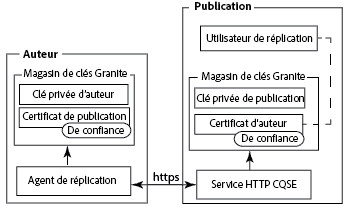
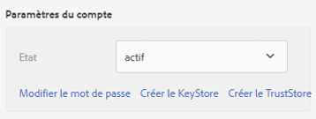
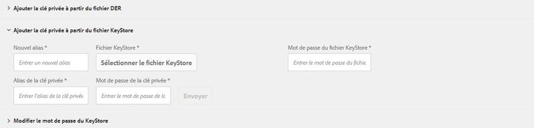
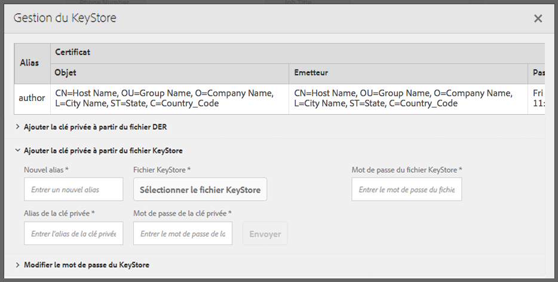
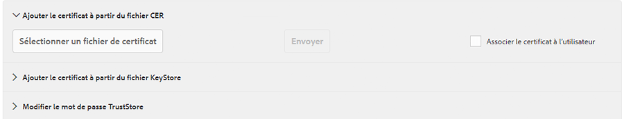
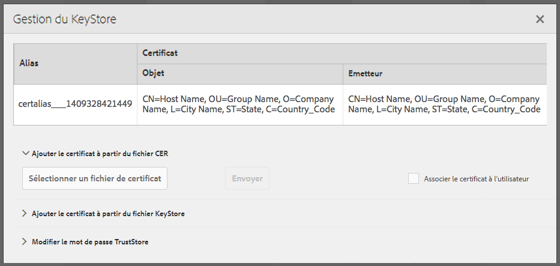
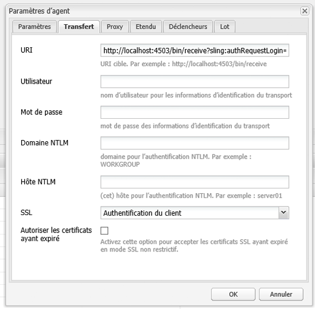

# Réplication à l’aide du SSL mutuel{#replicating-using-mutual-ssl}

Configurez AEM de sorte qu’un agent de réplication sur les instances d’auteur utilise le SSL mutuel (MSSL) pour se connecter à l’instance de publication. En utilisant le MSSL, l’agent de réplication et le service HTTP sur l’instance de publication utilisent des certificats pour s’authentifier.

La configuration du MSSL pour la réplication implique la rélalisation des étapes suivantes :

1. Créez ou obtenez des clés privées et des certificats pour les instances d’auteur et de publication.
1. Installez les clés et les certificats sur les instances d’auteur et de publication :

   * Auteur : La clé privée de l’auteur et le certificat de publication. 
   * Publication : La clé privée de publication et le certificat de l’auteur. Le certificat est associé au compte d’utilisateur authentifié avec l’agent de réplication.

1. Configurez le service HTTP basé sur Jetty sur l’instance de publication.
1. Configurez le transport et les propriétés SSL de l’agent de réplication.



Vous devez déterminer quel compte d’utilisateur exécute la réplication. Lors de la configuration du certificat d’auteur sur l’instance de publication, le certificat est associé à ce compte d’utilisateur.

## Obtenir ou créer des informations d’identification pour MSSL {#obtaining-or-creating-credentials-for-mssl}

Vous avez besoin d’une clé privée et d’un certificat public pour les instances d’auteur et de publication :

* Les clés privées doivent être au format pkcs#12 ou JKS. 
* Les certificats doivent être contenus au format pkcs#12 ou JKS. En outre, le certificat contenu dans le format « CER » peut également être ajouté à Granite Truststore.
* Les certificats peuvent être auto-signés ou signés par une autorité de certification reconnue.

### Format JKS {#jks-format}

Générez une clé privée et un certificat au format JKS. La clé privée est stockée dans un fichier KeyStore, et le certificat est stocké dans un fichier TrustStore. Utilisez l’utilitaire [Java`keytool` ](https://docs.oracle.com/javase/7/docs/technotes/tools/solaris/keytool.html) pour les créer.

Effectuez les étapes suivantes en utilisant l’utilitaire Java `keytool` pour créer la clé privée et les informations d’identification :

1. Générez une paire de clés publiques/privées dans un Keystore. 
1. Créez ou obtenez le certificat :

   * Autosigné : exportez le certificat à partir de Keystore.
   * Signé par l’autorité de certification : générez une demande de certificat et envoyez-la à une autorité de certification. 

1. Importez le certificat dans un TrustStore. 

Utilisez la procédure suivante pour créer une clé privée et un certificat autosigné pour les instances d’auteur et de publication. Utilisez des valeurs différentes pour les options de commande en conséquence.

1. Ouvrez une fenêtre ou un terminal de ligne de commande. Pour créer la paire de clés publiques/privées, saisissez la commande suivante, à l’aide des valeurs d’option dans le tableau ci-dessous :

   ```shell
   keytool -genkeypair -keyalg RSA -validity 3650 -alias alias -keystore keystorename.keystore  -keypass key_password -storepass  store_password -dname "CN=Host Name, OU=Group Name, O=Company Name,L=City Name, S=State, C=Country_ Code"
   ```

   | Option | Création | Publication |
   |---|---|---|
   | -alias | Auteur  | publish |
   | -keystore | author.keystore | publish.keystore |

1. Pour exporter le certificat, saisissez la commande suivante à l’aide des valeurs d’option dans le tableau ci-dessous :

   ```shell
   keytool -exportcert -alias alias -file cert_file -storetype jks -keystore keystore -storepass store_password
   ```

   | Option | Création | Publication |
   |---|---|---|
   | -alias | Auteur  | publier |
   | -file | author.cer | publish.cer |
   | -keystore | author.keystore | publish.keystore |

### Format pkcs#12 {#pkcs-format}

Générez une clé privée et un certificat au format pkcs#12. Utilisez [openSSL](https://www.openssl.org/) pour les générer. Utilisez la procédure suivante pour générer une clé privée et une demande de certificat. Pour obtenir le certificat, signez la requête avec votre clé privée (certificat autosigné) ou envoyez la requête à une autorité de certification. Générez ensuite une archive pkcs#12 contenant la clé privée et le certificat.

1. Ouvrez une fenêtre ou un terminal de ligne de commande. Pour créer la clé privée, saisissez la commande suivante à l’aide des valeurs d’option du tableau ci-dessous :

   ```shell
   openssl genrsa -out keyname.key 2048
   ```

   | Option | Création | Publication |
   |---|---|---|
   | -out | author.key | publish.key |

1. Pour générer une demande de certificat, saisissez la commande suivante à l’aide des valeurs d’option du tableau ci-dessous :

   ```shell
   openssl req -new -key keyname.key -out key_request.csr
   ```

   | Option | Création | Publication |
   |---|---|---|
   | -key | author.key | publish.key |
   | -out | author_request.csr | publish_request.csr |

   Signez la demande de certificat ou envoyez-la à une autorité de certification.

1. Pour signer la demande de certificat, saisissez la commande suivante à l’aide des valeurs d’option du tableau ci-dessous :

   ```shell
   openssl x509 -req -days 3650 -in key_request.csr -signkey keyname.key -out certificate.cer
   ```

   | Option | Création | Publication |
   |---|---|---|
   | -signkey | author.key | publish.key |
   | -in | author_request.csr | publish_request.csr |
   | -out | author.cer | publish.cer |

1. Pour ajouter la clé privée et le certificat signé à un fichier pkcs#12, saisissez la commande suivante à l’aide des valeurs d’option du tableau ci-dessous :

   ```shell
   openssl pkcs12 -keypbe PBE-SHA1-3DES -certpbe PBE-SHA1-3DES -export -in certificate.cer -inkey keyname.key -out pkcs12_archive.pfx -name "alias"
   ```

   | Option | Création | Publication |
   |---|---|---|
   | -inkey | author.key | publish.key |
   | -out | author.pfx | publish.pfx |
   | -in | author.cer | publish.cer |
   | -name | Auteur  | publier |

## Installation de la clé privée et du TrustStore sur l’auteur {#install-the-private-key-and-truststore-on-author}

Installez les éléments suivants sur l’instance d’auteur :

* La clé privée de l’instance d’auteur.
* Le certificat de l’instance de publication.

Pour exécuter la procédure ci-après, vous devez être connecté en tant qu’administrateur de l’instance d’auteur.

### Installation de la clé d’auteur privée  {#install-the-author-private-key}

1. Ouvrez la page de gestion des utilisateurs pour l’instance d’auteur. ([http://localhost:4502/libs/granite/security/content/useradmin.html](http://localhost:4502/libs/granite/security/content/useradmin.html))
1. Pour ouvrir les propriétés de votre compte utilisateur, appuyez ou cliquez sur votre nom d’utilisateur.
1. Si le lien Créer le TrustStore apparaît dans la zone Paramètres de compte, cliquez dessus. Configurez un mot de passe, puis cliquez sur OK. 
1. Dans la zone Paramètres du compte, cliquez sur Gérer le KeyStore.

   

1. Cliquez sur Ajouter la clé privée à partir du fichier de magasin de clés.

   

1. Cliquez sur Sélectionner le fichier du magasin de clés, puis recherchez et sélectionnez le fichier author.keystore ou author.pfx si vous utilisez pkcs#12, puis cliquez sur Ouvrir.
1. Saisissez le nom de l’alias et le mot de passe du magasin de clés. Saisissez le nom de l’alias et le mot de passe de la clé privée, puis cliquez sur Envoyer.
1. Fermez la boîte de dialogue Gestion du Keystore. 

   

### Installation du certificat de publication {#install-the-publish-certificate}

1. Ouvrez la page de gestion des utilisateurs pour l’instance d’auteur. ([http://localhost:4502/libs/granite/security/content/useradmin.html](http://localhost:4502/libs/granite/security/content/useradmin.html))
1. Pour ouvrir les propriétés de votre compte utilisateur, appuyez ou cliquez sur votre nom d’utilisateur.
1. Si le lien Créer le TrustStore apparaît dans la zone Paramètres de compte, cliquez dessus, créez un mot de passe pour TrustSore, puis cliquez sur OK.
1. Dans la zone Paramètres de compte, cliquez sur Gérer le TrustStore. 
1. Cliquez sur Ajouter le certificat à partir du fichier CER.

   

1. Effacez l’option Associer le certificat à l’utilisateur. Cliquez sur Sélectionner le fichier de certificat, sélectionnez publish.cer, puis cliquez sur Ouvrir.
1. Fermez la boîte de dialogue Gestion du Trust Store. 

   

## Installation de la clé privée et TrustStore sur la publication {#install-private-key-and-truststore-on-publish}

Installez les éléments suivants sur l’instance de publication :

* La clé privée de l’instance de publication.
* Le certificat de l’instance d’auteur. Associez le certificat à l’utilisateur qui est utilisé pour exécuter des demandes de réplication. 

Pour exécuter la procédure suivante, vous devez être connecté en tant qu’administrateur de l’intance de publication.

### Installation de la clé de publication privée  {#install-the-publish-private-key}

1. Ouvrez la page de gestion des utilisateurs pour l’instance de publication. ([http://localhost:4503/libs/granite/security/content/useradmin.html](http://localhost:4503/libs/granite/security/content/useradmin.html))
1. Pour ouvrir les propriétés de votre compte utilisateur, appuyez ou cliquez sur votre nom d’utilisateur. 
1. Si le lien Créer le TrustStore apparaît dans la zone Paramètres de compte, cliquez dessus. Configurez un mot de passe, puis cliquez sur OK. 
1. Dans la zone Paramètres du compte, cliquez sur Gérer le KeyStore.
1. Cliquez sur Ajouter la clé privée à partir du fichier de magasin de clés.
1. Cliquez sur Sélectionner le fichier du magasin de clés, puis recherchez et sélectionnez le fichier publish.keystore ou publish.pfx si vous utilisez pkcs#12, puis cliquez sur Ouvrir.
1. Saisissez le nom de l’alias et le mot de passe du magasin de clés. Saisissez le nom de l’alias et le mot de passe de la clé privée, puis cliquez sur Envoyer.
1. Fermez la boîte de dialogue Gestion du Keystore. 

### Installation du certificat d’auteur  {#install-the-author-certificate}

1. Ouvrez la page de gestion des utilisateurs pour l’instance de publication. ([http://localhost:4503/libs/granite/security/content/useradmin.html](http://localhost:4503/libs/granite/security/content/useradmin.html))
1. Recherchez le compte utilisateur que vous utilisez pour exécuter les demandes de réplication et cliquez ou appuyez sur le nom de l’utilisateur.
1. Si le lien Créer le TrustStore apparaît dans la zone Paramètres de compte, cliquez dessus, créez un mot de passe pour TrustSore, puis cliquez sur OK.
1. Dans la zone Paramètres de compte, cliquez sur Gérer le TrustStore. 
1. Cliquez sur Ajouter le certificat à partir du fichier CER.
1. Assurez-vous que l’option Associer le certificat à l’utilisateur est sélectionnée. Cliquez sur Sélectionner le fichier de certificat, sélectionnez author.cer sélectionné, puis cliquez sur Ouvrir. 
1. Cliquez sur Envoyer, puis fermez le boîte de dialogue Gestion de TrustStore. 

## Configuration du service HTTP sur la publication  {#configure-the-http-service-on-publish}

Configurez les propriétés du service HTTP basé sur Apache Felix Jetty sur l’instance de publication de sorte qu’il utilise HTTPS lors de l’accès à Granite Keystore. Le PID du service est `org.apache.felix.http`.

Le tableau suivant répertorie les propriétés OSGi que vous devez configurer si vous utilisez la console web. 

| Nom de propriété sur la console Web | Nom de propriété OSGi | Valeur |
|---|---|---|
| Activer HTTPS | org.apache.felix.https.enable | true |
| Activer HTTPS pour utiliser Granite KeyStore | org.apache.felix.https.use.granite.keystore | true |
| Port HTTPS | org.osgi.service.http.port.secure | 8443 (ou tout autre port souhaité) |
| Certificat client | org.apache.felix.https.clientcertificate | &quot;Certificat client recherché&quot; |

## Configuration de l’agent de réplication sur l’auteur {#configure-the-replication-agent-on-author}

Configurez l’agent de réplication sur l’instance d’auteur pour utiliser le protocole HTTPS lors de la connexion à l’instance de publication. Pour obtenir des informations complètes sur la configuration des agents de réplication, reportez-vous à la rubrique [Configuration de vos agents de réplication](/help/sites-deploying/replication.md#configuring-your-replication-agents).

Pour activer MSSL, configurez les propriétés sur l’onglet Transport en fonction du tableau suivant :

<table>
 <tbody>
  <tr>
   <th>Propriétés</th>
   <th>Valeur</th>
  </tr>
  <tr>
   <td>URI</td>
   <td><p>https://server_name:SSL_port/bin/receive?sling:authRequestLogin=1</p> <p>Par exemple :</p> <p>http://localhost:8443/bin/receive?sling:authRequestLogin=1</p> </td>
  </tr>
  <tr>
   <td>User</td>
   <td>Aucune valeur</td>
  </tr>
  <tr>
   <td>Mot de passe</td>
   <td>Aucune valeur</td>
  </tr>
  <tr>
   <td>SSL</td>
   <td>Authentification du client</td>
  </tr>
 </tbody>
</table>



Une fois que vous avez configuré l’agent de réplication, testez la connexion pour déterminer si MSSL est configuré correctement.

```xml
29.08.2014 14:02:46 - Create new HttpClient for Default Agent
29.08.2014 14:02:46 - * HTTP Version: 1.1
29.08.2014 14:02:46 - * Using Client Auth SSL configuration *
29.08.2014 14:02:46 - adding header: Action:Test
29.08.2014 14:02:46 - adding header: Path:/content
29.08.2014 14:02:46 - adding header: Handle:/content
29.08.2014 14:02:46 - deserialize content for delivery
29.08.2014 14:02:46 - No message body: Content ReplicationContent.VOID is empty
29.08.2014 14:02:46 - Sending POST request to http://localhost:8443/bin/receive?sling:authRequestLogin=1
29.08.2014 14:02:46 - sent. Response: 200 OK
29.08.2014 14:02:46 - ------------------------------------------------
29.08.2014 14:02:46 - Sending message to localhost:8443
29.08.2014 14:02:46 - >> POST /bin/receive HTTP/1.0
29.08.2014 14:02:46 - >> Action: Test
29.08.2014 14:02:46 - >> Path: /content
29.08.2014 14:02:46 - >> Handle: /content
29.08.2014 14:02:46 - >> Referer: about:blank
29.08.2014 14:02:46 - >> Content-Length: 0
29.08.2014 14:02:46 - >> Content-Type: application/octet-stream
29.08.2014 14:02:46 - --
29.08.2014 14:02:46 - << HTTP/1.1 200 OK
29.08.2014 14:02:46 - << Connection: Keep-Alive
29.08.2014 14:02:46 - << Server: Day-Servlet-Engine/4.1.64
29.08.2014 14:02:46 - << Content-Type: text/plain;charset=utf-8
29.08.2014 14:02:46 - << Content-Length: 26
29.08.2014 14:02:46 - << Date: Fri, 29 Aug 2014 18:02:46 GMT
29.08.2014 14:02:46 - << Set-Cookie: login-token=3529326c-1500-4888-a4a3-93d299726f28%3ac8be86c6-04bb-4d18-80d6-91278e08d720_98797d969258a669%3acrx.default; Path=/; HttpOnly; Secure
29.08.2014 14:02:46 - << Set-Cookie: cq-authoring-mode=CLASSIC; Path=/; Secure
29.08.2014 14:02:46 - <<
29.08.2014 14:02:46 - << R
29.08.2014 14:02:46 - << eplicationAction TEST ok.
29.08.2014 14:02:46 - Message sent.
29.08.2014 14:02:46 - ------------------------------------------------
29.08.2014 14:02:46 - Replication (TEST) of /content successful.
Replication test succeeded
```

