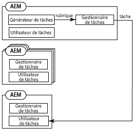
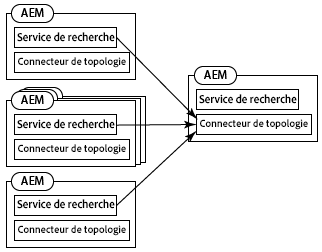
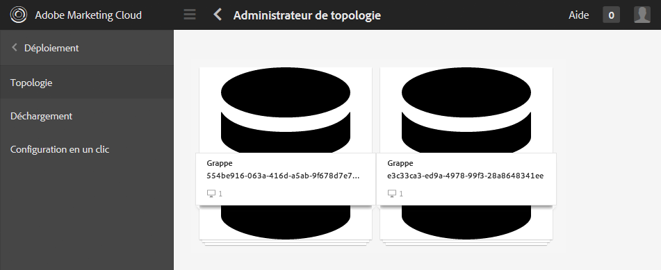
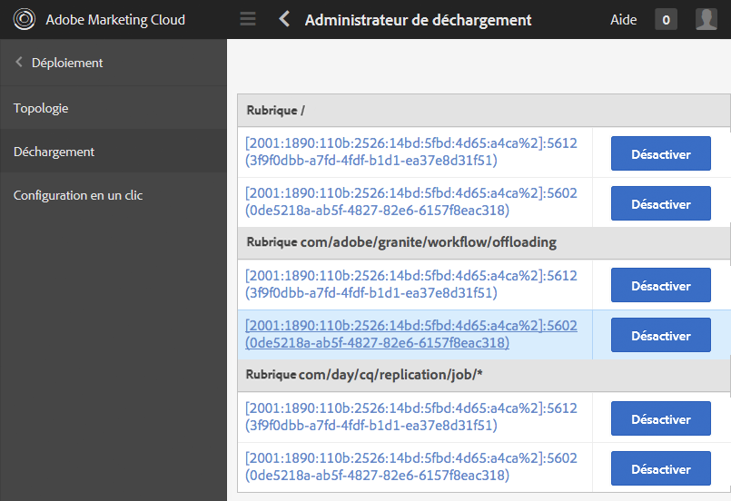
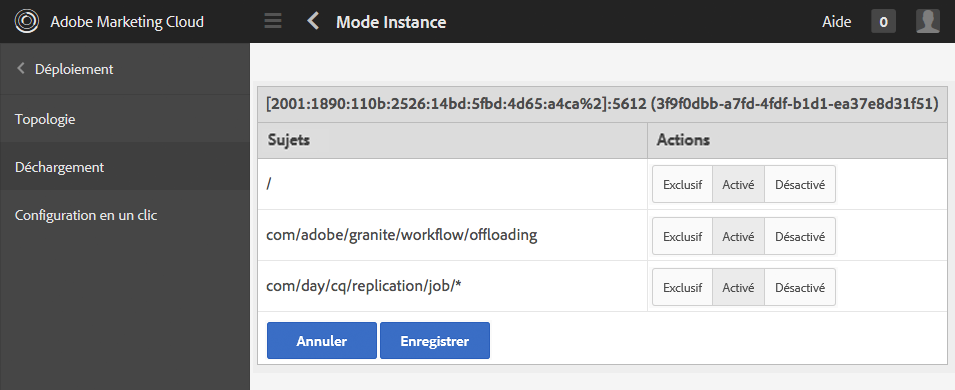
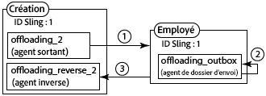
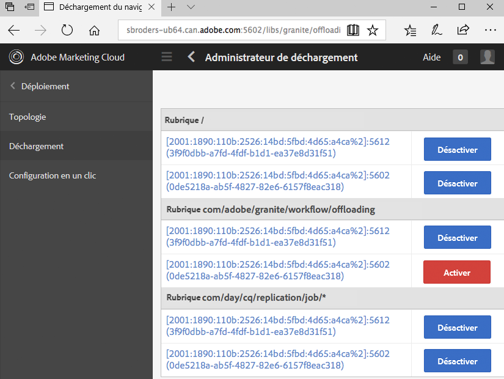

# Tâches de déchargement{#offloading-jobs}

## Présentation {#introduction}

Le déchargement répartit les tâches de traitement entre les instances de Experience Manager dans une topologie. Avec le déchargement, vous pouvez utiliser des instances spécifiques d’Experience Manager pour exécuter des types de traitement spécifiques. Le traitement spécialisé permet d’optimiser l’utilisation des ressources disponibles sur le serveur.

Le déchargement est basé sur les fonctionnalités [Apache Sling Discovery](https://sling.apache.org/documentation/bundles/discovery-api-and-impl.html) et Sling JobManager. Pour utiliser le déchargement, ajoutez des clusters Experience Manager à une topologie, puis identifiez les rubriques de tâche devant être traitées par le cluster. Les clusters sont composés d’une ou de plusieurs instances Experience Manager, de sorte qu’une instance unique soit considérée comme un cluster.

Pour plus d’informations sur l’ajout d’instances à une topologie, voir [Administration des topologies](/help/sites-deploying/offloading.md#administering-topologies).

### Distribution des tâches {#job-distribution}

SlingJobManager et JobConsumer permettent la création de tâches qui sont traitées dans une topologie :

* JobManager : un service qui crée des tâches pour des rubriques spécifiques.
* JobConsumer : un service qui exécute les tâches d’une ou de plusieurs rubriques. Plusieurs services JobConsumer peuvent être enregistrés dans la même rubrique.

Lorsque JobManager crée une tâche, la structure de déchargement sélectionne un cluster Experience Manager dans la topologie pour exécuter la tâche :

* Le cluster doit inclure une ou plusieurs instances exécutant un JobConsumer enregistré pour la rubrique de tâche.
* La rubrique doit être activée pour au moins une instance du cluster.

Voir [Configuration de la consommation de rubrique](/help/sites-deploying/offloading.md#configuring-topic-consumption) pour plus de détails sur l’amélioration de la distribution des tâches.

Lorsque la structure de déchargement sélectionne une grappe pour exécuter une tâche et que la grappe comprend plusieurs instances, Sling Distribution détermine l’instance de la grappe qui exécute la tâche.

### Charges utiles de la tâche {#job-payloads}

La structure de déchargement prend en charge les charges utiles de la tâche qui associent des tâches aux ressources du référentiel. Les charges de la tâche sont utiles lorsque des tâches sont créées pour le traitement des ressources et que la tâche est déchargée sur un autre ordinateur.

Après la création d’une tâche, la charge utile n’a l’assurance que d’être située sur l’instance qui crée la tâche. En déchargeant la tâche, les agents de réplication garantissent que la charge est créée sur l’instance qui va consommer la tâche par la suite. Lorsque l’exécution d’une tâche est terminée, la réplication inverse entraîne la copie de la charge utile sur l’instance qui a créé la tâche.

## Administration des topologies {#administering-topologies}

Les topologies sont des clusters Experience Manager légèrement interconnectées qui participent au déchargement. Un cluster est composée d’une ou de plusieurs instances de serveur Experience Manager (une instance unique est considérée comme un cluster).

Chaque instance Experience Manager exécute les services liés au déchargement suivants :

* Service Discovery (service de recherche) : envoie les demandes à un connecteur de topologie pour rejoindre la topologie.
* Topology Connector (connecteur de topologie) : reçoit les demandes d’accès et accepte ou refuse chaque demande.

Le service de recherche de tous les membres du point de topologie pointe vers le connecteur de topologie de l’un des membres. Dans les sections qui suivent, ce membre est désigné sous le nom d’acteur principal.

Chaque cluster de la topologie contient une instance qui est identifiée en tant que leader. Le leader du cluster interagit avec la topologie au nom des autres membres du cluster. Lorsque le leader quitte le cluster, un nouveau leader du cluster est automatiquement sélectionné.

### Affichage de la topologie {#viewing-the-topology}

Utilisez le navigateur de topologies pour explorer l’état de la topologie à laquelle l’instance d’Experience Manager participe. Le navigateur de topologies présente les clusters et les instances de la topologie.

Pour chaque grappe, une liste de membres indique l’ordre dans lequel chaque membre a rejoint la grappe et quel membre est le responsable. La propriété actuelle indique l’instance que vous êtes en train de gérer.

Pour chaque instance de cluster, vous pouvez voir plusieurs propriétés liées à la topologie :

* liste autorisée de rubriques pour le client de travaux de l’instance.
* Les points de terminaison exposés pour la connexion à la topologie.
* Les rubriques de tâche pour lesquelles l’instance est enregistrée pour le déchargement.
* Les rubriques de tâches que l’instance traite.

1. À l’aide de l’interface tactile, cliquez sur l’onglet Outils. ([http://localhost:4502/tools.html](http://localhost:4502/tools.html))
1. Dans la zone Opérations Granite, cliquez sur Navigateur de déchargement.
1. Dans le panneau de navigation, cliquez sur Navigateur de topologies.

   Les clusters qui participent à la topologie s’affichent.

   

1. Cliquez sur un cluster pour afficher la liste des instances du cluster et leur identifiant, leur état actuel et l’état du leader.
1. Cliquez sur l’identifiant d’une instance pour afficher des informations plus détaillées.

Vous pouvez également utiliser la console web pour afficher les informations de topologie. La console fournit des informations supplémentaires sur les clusters de topologie :

* Quelle instance est l’instance locale. 
* Les services Topology Connector que cette instance utilise pour se connecter à la topologie (sortie) et les services qui se connectent à cette instance (entrée).
* Modification de l’historique des propriétés de topologie et d’instance.

Utilisez la procédure suivante pour ouvrir la page Topology Management de la console web :

1. Ouvrez la console web dans votre navigateur. ([http://localhost:4502/system/console](http://localhost:4502/system/console))
1. Cliquez sur Général > Gestion de la topologie. 

   

### Configuration de l’appartenance de la topologie {#configuring-topology-membership}

Le service de recherche basé sur les ressources Apache Sling s’exécute sur chaque instance pour contrôler la façon dont les instances d’Experience Manager interagissent avec une topologie.

Le service de recherche (Discovery Service) envoie des demandes POST périodiques (heartbeats) aux services du connecteur de topologie (Topology Connector) pour établir et gérer les connexions avec une topologie. Le service Topology Connector conserve une liste autorisée d’adresses IP ou de noms d’hôtes autorisés à rejoindre la topologie :

* Pour joindre une instance à une topologie, précisez l’URL du service Topology Connector du membre racine.
* Pour permettre à une instance de rejoindre une topologie, ajoutez-la à la liste autorisée du service Topology Connector du membre racine.

Utilisez la console web ou un nœud sling:OsgiConfig pour configurer les propriétés suivantes du service org.apache.sling.discovery.impt.Config :

<table>
 <tbody>
  <tr>
   <th>Nom de la propriété</th>
   <th>Nom OSGi</th>
   <th>Description</th>
   <th>Valeur par défaut</th>
  </tr>
  <tr>
   <td>Délai d’expiration de pulsation (en secondes)</td>
   <td>heartbeatTimeout</td>
   <td>Durée, en secondes, d’attente d’une réponse de pulsation avant que l’instance ciblée ne soit considérée comme non disponible. </td>
   <td>20</td>
  </tr>
  <tr>
   <td>Intervalle de pulsation (en secondes)</td>
   <td>heartbeatInterval</td>
   <td>Durée, en secondes, entre les pulsations.</td>
   <td>15</td>
  </tr>
  <tr>
   <td>Délai minimal de l’événement (en secondes)</td>
   <td>minEventDelay</td>
   <td>
Lorsqu’une modification est apportée à la topologie, délai nécessaire pour retarder le changement d’état de TOPOLOGY_CHANGING à TOPOLOGY_CHANGED. Chaque modification qui se produit lorsque l’état est TOPOLOGY_CHANGING augmente ce délai. 
 
Ce délai empêche les écouteurs d’être submergés par les événements. 
 
Pour n’utiliser aucun délai, spécifiez 0 ou un chiffre négatif.
 </td>
   <td>3</td>
  </tr>
  <tr>
   <td>URL de Topology Connector</td>
   <td>topologyConnectorUrls</td>
   <td>URL des services Topology Connector pour envoyer des messages de pulsation.</td>
   <td>http://localhost:4502/libs/sling/topology/connector</td>
  </tr>
  <tr>
   <td>liste autorisée du connecteur de topologie</td>
   <td>topologyConnectorWhitelist</td>
   <td>Liste d’adresses IP ou de noms d’hôtes autorisés par le service Topology Connector dans la topologie. </td>
   <td>
localhost
 
127.0.0.1
 </td>
  </tr>
  <tr>
   <td>Nom du descripteur du référentiel</td>
   <td>leaderElectionRepositoryDescriptor</td>
   <td> </td>
   <td>&lt;aucune valeur&gt;</td>
  </tr>
 </tbody>
</table>

Utilisez la procédure suivante pour connecter une instance CQ au membre racine d’une topologie. La procédure indique une instance l’URL de Topology Connector du membre racine de la topologie. Exécutez cette procédure pour tous les membres de la topologie.

1. Ouvrez la console web dans votre navigateur. ([http://localhost:4502/system/console](http://localhost:4502/system/console))
1. Cliquez sur Général > Gestion de la topologie.
1. Cliquez sur Configurer Discovery Service (le service de recherche). 
1. Ajoutez un élément à la propriété des URL de Topology Connector, puis spécifiez l’URL du service Topology Connector du membre racine de la topologie. L’URL se présente sous la forme https://rootservername:4502/libs/sling/topology/connector.

Effectuez la procédure suivante sur le membre racine de la topologie. La procédure ajoute les noms des autres membres de la topologie à sa liste autorisée Discovery Service.

1. Ouvrez la console web dans votre navigateur. ([http://localhost:4502/system/console](http://localhost:4502/system/console))
1. Cliquez sur Général > Gestion de la topologie.
1. Cliquez sur Configurer Discovery Service (le service de recherche). 
1. Pour chaque membre de la topologie, ajoutez un élément à la propriété de liste autorisée du connecteur de topologie et spécifiez le nom d’hôte ou l’adresse IP du membre de la topologie.

## Configuration de la consommation de rubrique {#configuring-topic-consumption}

Utiliser le navigateur de déchargement pour configurer la consommation de rubrique pour les instances Experience Manager dans la topologie. Pour chaque instance, vous pouvez spécifier les rubriques qu’elle consomme. Par exemple, pour configurer votre topologie de sorte qu’une seule instance consomme les rubriques d’un type spécifique, désactivez la rubrique pour toutes les instances sauf une. 

Les tâches sont réparties entre les instances pour lesquelles la rubrique associée est activée à l’aide d’une logique séquentielle.

1. À l’aide de l’interface tactile, cliquez sur l’onglet Outils. ([http://localhost:4502/tools.html](http://localhost:4502/tools.html))
1. Dans la zone Opérations Granite, cliquez sur Navigateur de déchargement.
1. Dans le panneau de navigation, cliquez sur Navigateur de déchargement.

   Les rubriques de déchargement et les instances de serveur qui peuvent utiliser les rubriques s’affichent.

   

1. Pour désactiver la consommation d’une rubrique pour une instance, sous le nom de la rubrique, cliquez sur Désactiver en regard de l’instance.
1. Pour configurer toutes les consommations de rubrique pour une instance, cliquez sur l’identificateur de l’instance au-dessous d’une rubrique.

   

1. Cliquez sur l’un des boutons suivants à côté d’une rubrique pour configurer le comportement de consommation pour une instance, puis cliquez sur enregistrer :

   * Activé : cette instance consomme les tâches de cette rubrique. 
   * Désactivé : cette instance ne consomme pas les tâches de cette rubrique.
   * Exclusif : cette instance consomme uniquement les tâches de cette rubrique.
   **Remarque :** Lorsque vous sélectionnez Exclusif pour une rubrique, toutes les autres rubriques sont automatiquement réglées sur Désactivé.

### Consommateurs de tâches installés {#installed-job-consumers}

Plusieurs implémentations de JobConsumer sont installées avec Experience Manager. Les rubriques auxquelles ces JobConsumers sont inscrits sont affichées dans le navigateur de déchargement. Les rubriques supplémentaires qui s’affichent sont celles que les JobConsumers personnalisés ont enregistrées. Le tableau ci-dessous décrit les JobConsumers par défaut.

| Rubrique de tâche | Service PID | Description |
|---|---|---|
| / | org.apache.sling.event.impl.jobs.deprecated.EventAdminBridge | Installé avec Apache Sling. Tâches de traitement générées par l’administrateur d’événements OSGi, à des fins de rétrocompatibilité. |
| com/day/cq/réplication/job/&amp;amp ; ast; | com.day.cq.replication.impl.AgentManagerImpl | Agent de réplication qui reproduit les charges de travail. |

<!--
| com/adobe/granite/workflow/offloading |com.adobe.granite.workflow.core.offloading.WorkflowOffloadingJobConsumer |Processes jobs that the DAM Update Asset Offloader workflow generates. |
-->

### Désactivation et activation des rubriques pour une instance {#disabling-and-enabling-topics-for-an-instance}

Le service Apache Sling Job Consumer Manager fournit les propriétés de liste autorisée et de liste bloquée des rubriques. Configurez ces propriétés pour activer ou désactiver le traitement de rubriques spécifiques sur une instance Experience Manager.

**Remarque :** Si l’instance appartient à une topologie, vous pouvez également utiliser le navigateur de déchargement sur tout ordinateur de la topologie pour activer ou désactiver les rubriques.

La logique qui crée la liste des rubriques activées autorise d’abord toutes les rubriques qui se trouvent dans la liste autorisée, puis supprime les rubriques qui se trouvent dans la liste bloquée. By default, all topics are enabled (the allow list value is `*`) and no topics are disabled (the block list has no value).

Utilisez le console web ou le nœud `sling:OsgiConfig` pour configurer les propriétés suivantes. Pour les nœuds `sling:OsgiConfig`, le paramètre PID du service Job Consumer Manager est org.apache.sling.event.impl.jobs.JobConsumerManager.

| Nom de propriété dans la console web | ID OSGi | Description |
|---|---|---|
| liste autorisée de rubrique | job.consumermanager.whitelist | Liste de rubriques traitées par le service JobManager local. La valeur par défaut de &amp;ast; envoie toutes les rubriques au service TopicConsumer enregistré. |
| liste bloquée de rubrique | job.consumermanager.blacklist | Liste de rubriques que le service JobManager local ne traite pas. |

## Création des agents de réplication pour le déchargement {#creating-replication-agents-for-offloading}

La structure de déchargement utilise la réplication pour transférer des ressources entre l’auteur et le programme de traitement. La structure de déchargement crée automatiquement des agents de réplication lorsque les instances rejoignent la topologie. Les agents sont créés avec des valeurs par défaut. Vous devez modifier manuellement le mot de passe que les agents utilisent pour l’authentification. 

>[!CAUTION]
>
>Un problème connu avec les agents de réplication générés automatiquement est le fait que vous devez créer manuellement de nouveaux agents de réplication. Suivez la procédure décrite dans [Problèmes concernant l’utilisation des agents de réplication générés automatiquement](/help/sites-deploying/offloading.md#problems-using-the-automatically-generated-replication-agents) avant de créer les agents pour le déchargement.

Créez des agents de réplication qui transportent les charges utiles des tâches entre les instances pour le déchargement. Les illustrations suivantes présentent les agents nécessaires pour le déchargement de l’auteur vers une instance de travail. L’auteur a un ID Sling de 1 et l’instance de travail un ID Sling de 2 :

Cette configuration nécessite les trois agents suivants :

1. Un agent sortant sur l’instance d’auteur qui effectue la réplication vers l’instance de travail.
1. Un agent inverse sur l’instance d’auteur qui sort du dossier d’envoi sur l’instance de travail.
1. Un agent d’envoi sur l’instance de travail.

Ce modèle de réplication est similaire à celui utilisé entre les instances d’auteur et de publication. Toutefois, dans le cas du déchargement, toutes les instances impliquées sont des instances de création.

>[!NOTE]
>
>La structure de déchargement utilise la topologie pour obtenir les adresses IP des instances de déchargement. La structure crée alors automatiquement des agents de réplication en fonction de ces adresses IP. Si les adresses IP des instances de déchargement changent ultérieurement, la modification est automatiquement propagée sur la topologie après le redémarrage de l’instance. Toutefois, la structure de déchargement ne met pas automatiquement à jour les agents de réplication pour refléter les nouvelles adresses IP. Pour éviter cette situation, utilisez des adresses IP fixes pour toutes les instances de la topologie.

### Nommage des agents de réplication pour le déchargement {#naming-the-replication-agents-for-offloading}

Use a specific format for the ***Name*** property of the replication agents so that the offloading framework automatically uses the correct agent for specific worker instances.

**Nommer un agent sortant sur l’instance d’auteur :** 

`offloading_<slingid>`, où `<slingid>` est l’identifiant Sling de l’instance de travail.

Exemple: `offloading_f5c8494a-4220-49b8-b079-360a72f71559`

**Nommer l’agent inverse sur l’instance d’auteur :** 

`offloading_reverse_<slingid>`, où `<slingid>` est l’identifiant Sling de l’instance de travail.

Exemple: `offloading_reverse_f5c8494a-4220-49b8-b079-360a72f71559`

**Nommer le dossier d’envoi sur l’instance de travail :**

`offloading_outbox`

### Création de l’agent sortant {#creating-the-outgoing-agent}

1. Créez un **agent de réplication** sur l’auteur. (See the [documentation for replication agents](/help/sites-deploying/replication.md)). Specify any **Title**. The **Name** must follow the naming convention.
1. Créez un agent en utilisant les propriétés suivantes :

   | Propriétés | Valeur |
   |---|---|
   | Paramètres > Type de sérialisation | Valeur par défaut |
   | Transport > URI de transport | https://*`<ip of target instance>`*:*`<port>`*`/bin/receive?sling:authRequestLogin=1` |
   | Transport > Utilisateur du transport | Utilisateur de réplication sur une instance de cible |
   | Transport > Mot de passe de transport | Mot de passe utilisateur de réplication sur l’instance de cible |
   | Extended > Méthode HTTP | POST |
   | Déclencheurs > Ignorer les valeurs par défaut | True |

### Création de l’agent inverse {#creating-the-reverse-agent}

1. Create a **Reverse Replication Agent** on author. (See the [documentation for replication agents](/help/sites-deploying/replication.md).) Specify any **Title**. The **Name** must follow the naming convention.
1. Créez un agent en utilisant les propriétés suivantes :

   | Propriétés | Valeur |
   |---|---|
   | Paramètres > Type de sérialisation | Valeur par défaut |
   | Transport > URI de transport | https://*`<ip of target instance>`*:*`<port>`*`/bin/receive?sling:authRequestLogin=1` |
   | Transport > Utilisateur du transport | Utilisateur de réplication sur une instance de cible |
   | Transport > Mot de passe de transport | Mot de passe utilisateur de réplication sur l’instance de cible |
   | Extended > Méthode HTTP | GET |

### Création de l’agent de dossier d’envoi {#creating-the-outbox-agent}

1. Create a **Replication Agent** on the worker instance. (See the [documentation for replication agents](/help/sites-deploying/replication.md).) Specify any **Title**. The **Name** must be `offloading_outbox`.
1. Créez l’agent en utilisant les propriétés suivantes.

   | Propriétés | Valeur |
   |---|---|
   | Paramètres > Type de sérialisation | Valeur par défaut |
   | Transport > URI de transport | repo://var/replication/outbox |
   | Déclencheur > Ignorer les valeurs par défaut | True |

###  Recherche de l’identifiant Sling{#finding-the-sling-id}

Obtenez l’identifiant Sling d’une instance Experience Manager en utilisant l’une des méthodes suivantes :

* Open the Web Console and, in the Sling Settings, find the value of the Sling ID property ([http://localhost:4502/system/console/status-slingsettings](http://localhost:4502/system/console/status-slingsettings)). Cette méthode est utile si l’instance ne fait pas encore partie de la topologie.
* Utilisez le navigateur de topologies si l’instance fait déjà partie de la topologie.

<!--
## Offloading the Processing of DAM Assets {#offloading-the-processing-of-dam-assets}

Configure the instances of a topology so that specific instances perform the background processing of assets that are added or updated in DAM.

By default, Experience Manager executes the [!UICONTROL DAM Update Asset] workflow when a DAM asset changes or one is added to DAM. Change the default behavior so that Experience Manager instead executes the [!UICONTROL DAM Update Asset Offloader] workflow. This workflow generates a JobManager job that has a topic of `com/adobe/granite/workflow/offloading`. Then, configure the topology so that the job is offloaded to a dedicated worker.

>[!CAUTION]
>
>No workflow should be transient when used with workflow offloading. For example, the [!UICONTROL DAM Update Asset] workflow must not be transient when used for asset offloading. To set/unset the transient flag on a workflow, see [Transient Workflows](/help/assets/performance-tuning-guidelines.md#workflows).

The following procedure assumes the following characteristics for the offloading topology:

* One or more Experience Manager instance are authoring instances that users interact with for adding or updating DAM assets.
* Users to do not directly interact with one or more Experience Manager instances that process the DAM assets. These instances are dedicated to the background processing of DAM assets.

1. On each Experience Manager instance, configure the Discovery Service so that it points to the root Topography Connector. (See [Configuring Topology Membership](#title4).)
1. Configure the root Topography Connector so that the connecting instances are on the allow list.
1. Open Offloading Browser and disable the `com/adobe/granite/workflow/offloading` topic on the instances with which users interact to upload or change DAM assets.

   

1. On each instance that users interact with to upload or change DAM assets, configure workflow launchers to use the [!UICONTROL DAM Update Asset Offloading] workflow:

    1. Open the Workflow console.
    1. Click the Launcher tab.
    1. Locate the two Launcher configurations that execute the [!UICONTROL DAM Update Asset] workflow. One launcher configuration event type is Node Created, and the other type is Node Modified.
    1. Change both event types so that they execute the [!UICONTROL DAM Update Asset Offloading] workflow. (For information about launcher configurations, see [Starting Workflows When Nodes Change](/help/sites-administering/workflows-starting.md).)

1. On the instances that perform the background processing of DAM assets, disable the workflow launchers that execute the [!UICONTROL DAM Update Asset] workflow.
-->

## Informations complémentaires {#further-reading}

En plus des informations présentées sur cette page, vous pouvez également lire ce qui suit :

* For information about using Java APIs to create jobs and job consumers, see [Creating and Consuming Jobs for Offloading](/help/sites-developing/dev-offloading.md).
