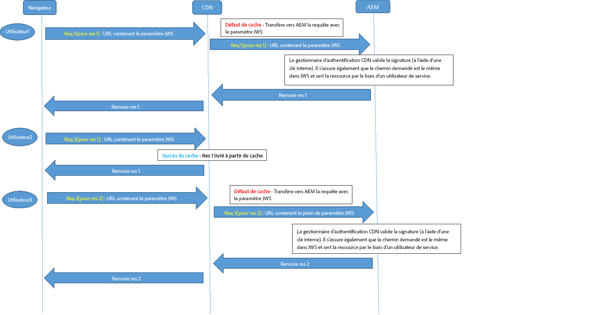

# Paramètres de configuration OSGi{#osgi-configuration-settings}

[](https://www.osgi.org/) OSGiest un élément fondamental de la pile technologique de l&#39;AEM. Il est utilisé pour contrôler les lots composites d’AEM et leur configuration.

OSGi « *fournit les primitives normalisées qui permettent de construire des applications à partir de petits composants, réutilisables et collaboratifs. Ces composants peuvent être créés dans une application et déployés*&quot;.

Cela permet une gestion conviviale des lots , car ils peuvent être arrêtés, installés et démarrés individuellement. Les interdépendances sont gérées automatiquement. Chaque composant OSGi (voir [Spécifications OSGi](https://www.osgi.org/Specifications/HomePage)) se trouve dans l’un des lots. Lorsque vous utilisez AEM, plusieurs méthodes permettent de gérer les paramètres de configuration de ces lot ; voir [Configuration OSGi](/help/sites-deploying/configuring-osgi.md) pour plus de détails et les pratiques recommandées.

Les paramètres de configuration OSGi suivants (répertoriés selon le lot) sont pertinents à la réalisation du projet. Les paramètres répertoriés ne doivent pas tous être ajustés, certains sont mentionnés pour vous aider à comprendre comment fonctionne AEM.

>[!CAUTION]
>
>La liste sert de ligne directrice et n’est pas exhaustive. Tous les lots ne sont pas répertoriés, ni tous les paramètres de lots.
>
>La configuration nécessaire varie d’un projet à l’autre. 
>
>Consultez la console web pour les valeurs utilisées et des informations détaillées sur les paramètres. 

>[!NOTE]
>
>L&#39;outil OSGi Configuration Diff, qui fait partie des [AEM Tools](https://helpx.adobe.com/experience-manager/kb/tools/aem-tools.html), peut être utilisé pour liste les configurations OSGi par défaut.

>[!NOTE]
>
>D’autres lots peuvent être nécessaires pour des zones spécifiques de fonctionnalité dans AEM. Dans ce cas, les informations de configuration figurent sur la page liée à la fonctionnalité en question.

**AEM Événement de réplication** ListenerConfigurer :

* **Exécuter les modes**, dans lesquels les événements de réplication seront distribués aux auditeurs. Par exemple, s’il est défini comme auteur, il s’agit du système qui &quot;lance&quot; la réplication.

* Le mode d&#39;exécution **publish** doit être ajouté si le code du projet traite les événements de réplication (réplication inverse) dans un environnement de publication. Par exemple, lorsque le répartiteur est utilisé pour vider de l’environnement de publication ou lorsque la réplication standard vers d’autres instances de publication se produit.

**AEM Repository change** listenerConfigure :

* Les **Chemins**, emplacements où écouter les événements de référentiel prêts à être distribués.

**CRX Sling Client** RepositoryConfigurez l’accès au référentiel de contenu sous-jacent.

* Le **mot de passe d&#39;administrateur** doit être modifié après l&#39;installation afin d&#39;assurer la [sécurité](/help/sites-administering/security-checklist.md) de votre instance.
* D&#39;autres modifications ne devraient pas être nécessaires et doivent être prises en compte car elles peuvent affecter l&#39;accès au référentiel.

**Wiki Mail** ServiceConfigurez les paramètres d&#39;e-mail pour les e-mails envoyés par un wiki.

**Apache Felix OSGi Management** ConsoleConfigurer :

* **Des modules complémentaires**, les éléments de navigation principale (modules complémentaires de la console) disponibles dans la **Console de gestion web Apache Felix** en tant que commandes de menu de niveau supérieur. Désactivez tous les éléments dont vous n’avez pas besoin, car chacun d’entre eux requiert de l’espace et des ressources. 

>[!CAUTION]
>
>Veillez à configurer ce qui suit :
>
>**Nom d’utilisateur** et **mot de passe**, les informations d’identification pour accéder à la console de gestion web Apache Felix.
>Le mot de passe doit être modifié après l’installation initiale pour garantir[ la sécurité](/help/sites-administering/security-checklist.md) de votre instance. 

>[!NOTE]
>
>Cette configuration doit être effectuée par le biais de la console Felix, car elle est nécessaire au démarrage (avant que le référentiel ne soit disponible).

**Apache Sling Custom Request Data** LoggerConfigurer :

* **Nom de l’enregistreur** et **Format de journal** pour configurer l’emplacement et le format de la demande et de la journalisation des accès (valeur par défaut : `request.log`). Ce fichier journal est essentiel pour analyser la performance ou déboguer les fonctionnalités liées à la chaîne web. Cela est associé à [l’enregistreur de demandes Apache Sling](#apacheslingrequestlogger).

Pour plus d’informations, reportez-vous à [Journalisation AEM](/help/sites-deploying/configure-logging.md) et [Journalisation Sling](https://sling.apache.org/site/logging.html).

**Apache Sling Évolution du** pool de threadsConfiguration :

* **Taille** minimale du pool et Taille **** maximale du pool, taille du pool utilisée pour contenir les threads de événement.

* **Taille** de la file d&#39;attente, taille maximale de la file d&#39;attente de thread si le pool est épuisé.
La valeur recommandée est `-1`, car la file d&#39;attente est définie sur illimitée ; si une limite est définie, des pertes peuvent survenir lorsqu&#39;elle est dépassée.

* La modification de ces paramètres peut améliorer les performances dans les scénarios présentant un grand nombre de événements ; par exemple, une utilisation importante de la gestion des actifs numériques AEM ou du flux de travail.
* Les valeurs spécifiques à votre scénario doivent être établies à l’aide de tests.
* Ces paramètres peuvent affecter les performances de votre instance. Ne les modifiez donc pas sans raison et sans considération.

**Apache Sling GET** ServletConfigurez certains aspects du rendu :

* **Auto index (Index automatique)** pour activer/désactiver le rendu du répertoire pour la navigation. 
* **Activez** (ou désactivez) les rendus par défaut, tels que **HTML**, **texte brut**, **JSON** ou **XML**.
Ne désactivez pas le JSON.

>[!NOTE]
>
>Ce paramètre est automatiquement configuré pour les instances de production si vous exécutez AEM en [mode prêt pour la production](/help/sites-administering/production-ready.md).

**Apache Sling Java Script** HandlerConfigurez les paramètres pour la compilation des fichiers .java en tant que scripts (servlets).

Certains paramètres peuvent nuire aux performances et doivent être désactivés dans la mesure du possible, en particulier pour une instance de production. 

* La **machine virtuelle source** et la **machine virtuelle cible** définissent la version du JDK utilisée comme mode d’exécution JVM

* Pour les instances de production :

   * Désactivez **Generate Debug Info (Générer les informations de débogage)**

**Apache Sling JCR** InstallerCes paramètres n&#39;ont probablement pas besoin d&#39;être configurés, mais peuvent s&#39;avérer utiles lors du développement ou du débogage. Par exemple, le dossier d’installation peut être utile pour archiver/extraire ou créer un module.

* **Installation folders name regexp (Regexp nom de dossiers d’installation)** et **Max hierarchy depth of install folders (Profondeur de hiérarchie maximale des fichiersd’installation)** - spécifiez où et à quel niveau les fichiers de référentiel sont recherchées pour que les ressources soient installées. Lorsqu’un caractère générique est utilisé (comme dans .*/install) toutes les correspondances appropriées seront recherchées, par exemple, `/libs/sling/install` et `/libs/cq/core/install`.

* **Search Path (Chemin de recherche)** : la liste des chemins d’accès recherchés par jcrinstall pour l’installation des ressources, ainsi qu’un nombre indiquant le facteur de pondération pour ce chemin. 

**Gestionnaire de Événement de travaux Apache SlingConfigurez les paramètres qui gèrent la planification des tâches :** 

* **Intervalle** de nouvelle tentative, Reprises **** maximales, Tâches **parallèles** maximales,  **Reconnaître le temps d’attente**, entre autres.

* La modification de ces paramètres peut améliorer les performances dans les scénarios comportant un grand nombre de tâches ; par exemple, une utilisation intensive de la gestion des actifs numériques AEM et des Workflows.
* Les valeurs spécifiques à votre scénario doivent être établies à l’aide de tests.
* Ne modifiez pas ces paramètres sans raison, mais modifiez-les uniquement après mûre réflexion.

**Apache Sling JSP Script** HandlerConfigurez les paramètres de performances correspondant au gestionnaire de script JSP. Pour améliorer les performances, vous devez en désactiver autant que possible. 

Cela concerne surtout les instances de production :

* Désactivez **Generate Debug Info (Générer les informations de débogage)**
* Désactivez **Keep Generated Java (Conserver le Java généré)**
* Désactivez **Mapped Content (Contenu mappé)**
* Désactivez **Display Source Fragments (Afficher les fragments source)**

>[!NOTE]
>
>Ce paramètre est automatiquement configuré pour les instances de production si vous exécutez AEM en [mode prêt pour la production](/help/sites-administering/production-ready.md).

**Configuration** de la journalisation Apache SlingConfiguration :

* **Niveau de journal** et **fichier journal**, pour définir l’emplacement et le niveau de journal de la configuration de journalisation centrale (error.log). Le niveau peut être défini sur `DEBUG`, `INFO`, `WARN`, `ERROR` et `FATAL`.

* **Le nombre de fichiers journaux** et **le seuil du fichier journal** pour définir la rotation de taille et de version du fichier journal. 

* **Le modèle de message** définit le format des messages du journal.

Pour plus d’informations, reportez-vous à [Journalisation AEM](/help/sites-deploying/configure-logging.md#global-logging) et [Journalisation Sling](https://sling.apache.org/site/logging.html).

**Configuration du journal de journalisation Apache Sling (configuration en usine)** Configurer :

* **Niveau de journal**, **Fichier journal** et **Format de message** pour définir les détails du fichier journal et des messages. 

*  **Enregistreur** pour définir la catégorie ; par exemple, uniquement le journal pour com.day.cq.

* À l’aide des **configurations de fabrique**, un certain nombre de configurations supplémentaires peuvent être ajoutées pour gérer les divers niveaux de journal et les catégories requises.
* Ces fonctionnalités sont utiles lors du développement ; par exemple, pour consigner des messages TRACE pour un service spécifique dans un fichier journal spécifié. 
* Ces fonctionnalités sont utiles dans un environnement de production ; par exemple, pour recevoir des messages concernant un service spécifique connecté à un fichier journal individuel pour une surveillance plus facile. 

Pour plus d’informations, reportez-vous à [Journalisation AEM](/help/sites-deploying/configure-logging.md) et [Journalisation Sling](https://sling.apache.org/site/logging.html).

**Configuration de l&#39;enregistreur de journalisation Apache Sling (configuration en usine)** Configurer :

* **Fichier journal** pour définir l’existence d’un fichier journal.
* **Le nombre de fichiers journaux** pour définir la rotation des versions.

* L’auteur peut être utilisé par une **configuration d’enregistreur de journaux Apache Sling**.

* Ces fonctionnalités sont utiles lors du développement ; par exemple, pour consigner des messages TRACE pour un service spécifique dans un fichier journal spécifié. 
* Ces fonctionnalités sont utiles dans un environnement de production ; par exemple, pour recevoir des messages concernant un service spécifique connecté à un fichier journal individuel pour une surveillance plus facile. 

Pour plus d’informations, reportez-vous à [Journalisation AEM](/help/sites-deploying/configure-logging.md) et [Journalisation Sling](https://sling.apache.org/site/logging.html).

**Apache Sling Main** ServletConfigure :

* **Nombre d’appels par demande** et **Profondeur de récursion** pour protéger votre système contre la récursivité infinie et les appels excessifs de script.

**Apache Sling MIME Type** ServiceConfigurer :

* **les types MIME** pour ajouter ceux requis par votre projet dans le système. Cela permet d’effectuer une demande `GET` sur un fichier pour définir l’en-tête du type de contenu approprié pour lier le type de fichier et l’application. 

**Apache Sling Parrain** FilterPour résoudre des problèmes de sécurité connus avec la saisie de requête multisite (CSRF) dans CRX WebDAV et Apache Sling, vous devez configurer le filtre de Parrain.

Le service de filtre de référent est un service OSGi qui permet de configurer :

* les méthodes HTTP à filtrer ;
* si un en-tête de référent vide est permis ;
* et une liste de serveurs à autoriser en plus de l’hôte du serveur.

Reportez-vous à la section [Liste de contrôle de sécurité - Problèmes de falsification des demandes cross-site](/help/sites-administering/security-checklist.md#protect-against-cross-site-request-forgery) pour plus de détails.

>[!NOTE]
>
>Le filtre de référent Apache Sling dépend de l’installation d’un module de correctif rapide.

**Apache Sling Request** LoggerConfigure :

* Divers paramètres pour définir comment les requêtes sont consignées. 
* **Activer le journal de requête**, pour activer ou désactiver.

* **Activer le journal d’accès**, pour activer ou désactiver. 

Cela est associé à l’[enregistreur de données de demandes personnalisables Apache Sling](#apacheslingcustomizablerequestdatalogger).

Pour plus d’informations, reportez-vous à [Journalisation AEM](/help/sites-deploying/configure-logging.md) et [Journalisation Sling](https://sling.apache.org/site/logging.html).

**Apache Sling Resource Resolver** FactoryConfigurez les aspects centraux de la résolution des ressources Sling :

* **Chemins** de recherche de ressources, ajoutez des chemins spécifiques au projet (mais ne supprimez  `/libs` ni  `/apps`ne supprimez).

* **URL virtuelles** pour définir vos mappages URL Vanity.

* **Mappages d’URL** pour définir des alias éventuels ; par exemple de  `/content` à  `/`.

* **Emplacement** de mappage, la configuration du mappeur externalisée dans  `/etc/map`.

* Utilisez votre installation locale (par exemple, utilisez `https://localhost:4502/system/console/jcrresolver`) pour déterminer quel Resource Resolver est principal.

Pour plus d’informations, voir : [https://cwiki.apache.org/confluence/display/SLING/Flexible+Resource+Resolution](https://cwiki.apache.org/confluence/display/SLING/Flexible+Resource+Resolution).

>[!CAUTION]
>
>Ces options en particulier doivent être configurées dans le référentiel.
>
>Dans le cas contraire, les modifications apportées aux **mappages d’URL** à l’aide de la console Felix peuvent être écrasées par AEM au prochain démarrage. 

**Apache Sling Servlet/Script Resolver and Error** HandlerLe Sling Servlet et le Script Resolver ont plusieurs tâches :

1. Il est utilisé comme `ServletResolver` pour sélectionner le servlet ou le script à appeler pour traiter la demande.

1. Il agit en tant que `SlingScriptResolver`.

1. Il assure la gestion des erreurs en implémentant l’interface `ErrorHandler` à l’aide du même algorithme pour sélectionner les servlets et les scripts assurant la gestion des erreurs, comme ceux utilisés pour résoudre les servlets et scripts assurant le traitement des demandes.

Divers paramètres peuvent être définis, notamment :

* L’option **Execution Paths (Chemins d’exécution)** répertorie les mappages pour rechercher des scripts exécutables ; en configurant des mappages spécifiques, vous pouvez limiter les scripts pouvant être exécutés. Si aucun chemin d’accès n’est configuré, la valeur par défaut est utilisée ( `/` = root), ce qui permet l’exécution de tous les scripts.
Si une valeur de chemin configurée se termine par une barre oblique, la recherche porte sur toute la sous-arborescence. En l’absence de barre oblique, le script est exécuté uniquement s’il existe une correspondance exacte.

* **Script User (Utilisateur de script)** : cette propriété facultative peut spécifier le compte utilisateur utilisé pour lire les scripts. Si aucun nombre n’est spécifié, l’utilisateur `admin` est utilisé par défaut.

* **Default Extensions (Extensions par défaut)** La liste des extensions pour lesquelles le comportement par défaut est utilisé. Cela signifie que le dernier segment de chemin du type de ressource peut être utilisé comme nom du script.

**Day Commons GFX Font** HelperLors du rendu de graphiques, vous pouvez utiliser DrawText pour incorporer du texte. Pour cela, vous pouvez également installer vos propres polices :

* Définissez le **chemin de police** à rechercher pour les polices spécifiques au projet.
Par exemple, `/apps/myapp/fonts`.

**Apache HTTP Components Proxy** ConfigurationProxy configuration pour tout le code utilisant le client Apache HTTP, utilisé lors de la création d&#39;un HTTP ; par exemple lors de la réplication.

Lors de la création d’une configuration, n’apportez pas de modifications à la configuration d’usine, mais créez plutôt une configuration d’usine pour ce composant à l’aide du gestionnaire de configuration disponible ici : **https://localhost:4502/system/console/configMgr/**. La configuration du proxy est disponible dans **org.apache.http.proxyconfigurator.**

>[!NOTE]
>
>Dans AEM 6.0 et versions antérieures, le proxy était configuré dans le client HTTP Day Commons. Depuis AEM 6.1 et versions ultérieures, la configuration proxy a été déplacée vers·« Configuration proxy des composants HTTP Apache » au lieu de la configuration « Client HTTP Day Commons ».

**Day CQ** AntispamConfigurez le service antispam (Akismet) utilisé. Pour ce faire, vous devez enregistrer les éléments suivants :

* **Fournisseur**
* **Clé d’API**
* **URL enregistrée**

**Adobe** Gestionnaire de bibliothèques HTML GraniteConfigurez cette option pour contrôler la gestion des bibliothèques client (css ou js); par exemple, la façon dont la structure sous-jacente est vue.

* Pour les instances de production :

   * Activez l’option **Minify (Réduire)** (pour supprimer CRLF et les espaces).
   * Activez l’option **Gzip** (pour permettre de compresser les fichiers et d’y accéder dans une demande).
   * Désactivez l’option **Déboguer**.
   * Désactivez **Timing (Minutage)**

* Pour le développement JS (particulièrement lors de l’utilisation de Firebug ou du débogage) :

   * Désactivez l’option **Minify (Réduire)**
   * Activez l’option **Debug (Déboguer)** pour séparer les fichiers du débogage et de l’utilisation avec Firebug. 
   * Activez l’option **Timing (Minutage)** si le minutage vous intéresse.
   * Activez la console **de débogage** pour voir les messages de journal de la console JS. 

>[!CAUTION]
>
>Lorsque vous changez le paramètre sur **Minify (Réduire)** ou **Gzip**, vous devez également supprimer le contenu de `/var/clientlibs`. Il s’agit d’une version mise en cache des clientlibs, qui sera recréée lors de la prochaine demande. 

>[!NOTE]
>
>Ce paramètre est automatiquement configuré pour les instances de production si vous exécutez AEM en [mode prêt pour la production](/help/sites-administering/production-ready.md).

**Day CQ HTTP Header Authentication** HandlerSystem, paramètres généraux pour la méthode d&#39;authentification de base de la requête HTTP.

Lorsque vous utilisez des [groupes d’utilisateurs fermés](/help/sites-administering/cug.md), vous pouvez configurer (entre autres) :

* Le **domaine de HTTP**
* La **page de connexion par défaut**

**Service** de vérification des liens Day CQ et, si nécessaire, configurez :

* La **période du planificateur** pour définir l’intervalle auquel les liens externes doivent être automatiquement vérifiés.

* Testez **l’intervalle de tolérance des mauvais liens** pour déterminer la période après laquelle un lien externe ayant échoué est considéré comme étant mauvais.
* Les **modèles de priorité de vérification des liens** pour définir les chemins d’accès à exclure de la vérification des liens. 

**Vérificateur de liens Day CQ** TâcheConfigurez les paramètres d&#39;une tâche de vérification de liens unique (tâche qui vérifie un lien externe) :

* Vérifiez les intervalles définis dans les options **Intervalle de test d’un bon lien** et **Intervalle de test d’un mauvais lien**

* Les différents paramètres liés aux proxys pour l’accès Internet et les NTLM nécessaires pour les accès externes lors de la vérification d’un lien.

**Day CQ Mail** ServiceConfigurez le nom d&#39;hôte et les détails d&#39;accès du serveur de messagerie. Reportez-vous à la section Configuration du service de messagerie.

**Bulletin MCM Day CQ** Configurez les différents paramètres utilisés avec le bulletin.

**Mappage des racines Day CQ** Configurer :

* **Chemin d’accès de la cible** pour définir à quel emplacement une requête à &quot;  `/`&quot; sera redirigée.

Il existe deux interfaces utilisateur disponibles dans AEM :

* L’IU tactile est l’IU standard
* et l’IU classique obsolète est toujours pleinement opérationnelle

En utilisant le mappage racine d’AEM, vous pouvez configurer l’IU que vous souhaitez utiliser en tant que valeur par défaut pour votre instance :

* Pour que l&#39;interface utilisateur tactile soit définie comme interface utilisateur par défaut, le **chemin de Cible** doit pointer sur :

   ```
      /projects.html
   ```

* Pour que l&#39;interface utilisateur classique soit l&#39;interface utilisateur par défaut, le **chemin de Cible** doit pointer vers :

   ```
      /welcome.html
   ```

>[!NOTE]
>
>Pour une installation standard, l’IU optimisée pour les écrans tactiles est l’UI par défaut.

**Adobe** Gestionnaire d&#39;authentification SSO GraniteConfiguration des détails d&#39;authentification unique (SSO); elles sont souvent nécessaires dans les configurations des auteurs d’entreprise, souvent conjointement avec LDAP.

Différentes propriétés de configuration sont disponibles :

* **Path** Chemin pour lequel ce gestionnaire d’authentification est actif. Si ce paramètre n’est pas renseigné, le gestionnaire d’authentification est désactivé. Par exemple, si vous utilisez le chemin /, le gestionnaire d’authentification est utilisé pour l’ensemble du référentiel.

* **Service Ranking** La valeur de classement du service OSGi Framework est utilisée pour indiquer l’ordre d’appel de ce service. Il s’agit d’un 
`int` lorsque des valeurs supérieures désignent une priorité plus élevée.
La valeur par défaut est `0`.

* **Noms des en-têtes** Les noms des en-têtes qui peuvent contenir un identifiant utilisateur.

* **Noms de cookies** Les noms des cookies pouvant contenir un identifiant utilisateur.

* **Nom des paramètres** Les noms des paramètres de requête pouvant fournir l’identifiant utilisateur.

* **La carte utilisateur** Pour les utilisateurs sélectionnés, le nom d’utilisateur extrait de la requête HTTP peut être remplacé par un nom différent dans l’objet des informations d’authentification. Le mappage est défini ici. Si le nom d’utilisateur 
`admin` s’affiche de chaque côté de la carte, le mappage est ignoré. N’oubliez pas que le caractère « = » doit être précédé de « \ ».

* **Format** indique le format dans lequel l’identifiant utilisateur est fourni. Utilisez:

   * `Basic` si l’identifiant utilisateur est codé au format d’authentification HTTP de base. 
   * `AsIs` si l’identifiant utilisateur est fourni en texte brut ou si une valeur appliquée d’expression régulière doit être utilisée telle quelle ou une expression régulière

**Day CQ WCM Debug** Filter (Filtre de débogage WCM Day CQ) Cette option est utile pour le développement car elle permet l’utilisation de suffixes tels que ?debug=layout lors de l’accès à une page. Par exemple, https://localhost:4502/cf#/content/geometrixx/en/support.html?debug=layout fournira des informations de mise en page susceptibles d’intéresser le développeur.

* Désactivez cette option sur les instances de production pour garantir performance et sécurité.

**Filtre WCM Day CQ** Configure :

* **Mode WCM **pour définir le mode par défaut.
* Sur une instance d’auteur, il peut s’agir de `edit`, `disable,preview` ou `analytics`.
Les autres modes sont accessibles à partir du sidekick, ou le suffixe `?wcmmode=disabled` peut être utilisé pour émuler un environnement de production.

* Sur une instance de publication, cette valeur doit être définie sur `disabled` pour garantir qu’aucun autre mode n’est accessible.

>[!NOTE]
>
>Ce paramètre est automatiquement configuré pour les instances de production si vous exécutez AEM en [mode prêt pour la production](/help/sites-administering/production-ready.md).

**Configurateur du vérificateur de liens WCM Day CQ** Configurer :

* **Liste de configuration des réécritures** pour spécifier une liste d’emplacements pour les configurations des vérifications de liens basées sur le contenu. Les configurations peuvent être basées sur un mode d’exécution ; c’est pour cela qu’il est important de distinguer les environnement d’auteur et de publication, étant donné que les paramètre de vérification de lien peuvent varier de l’un à l’autre.

**Processeur de page WCM Day CQ** Configurer :

* **Paths (chemins d’accès)**, une liste d’emplacements où le système détecte des modifications de page avant de déclencher `jcr:Event`.

**Adobe Page Impressions** TrackerPour une instance d&#39;auteur, configurez :

* **sling.auth.requirements** : définissez la valeur de cette propriété sur  `-/libs/wcm/stats/tracker`

>[!CAUTION]
>
>Cette configuration permet d’envoyer des demandes anonymes au service du suivi.

>[!NOTE]
>
>Voir [Impressions de page](/help/sites-deploying/configuring.md#enabling-page-impressions) pour plus d’informations.

**Statistiques** de la page WCM Day CQPour une instance de publication, configurez :

* **URL to send data (URL pour envoyer des données)** pour configurer l’URL utilisée pour suivre les statistiques de page (essentiel si la demande d’un outil de suivi passe par le dispatcher) ; par exemple, l’URL par défaut est `https://localhost:4502/libs/wcm/stats/tracker`.

* **Tracking script enabled (Script de suivi activé)** pour activer (`true`) ou désactiver (`false`) l’intégration du script de suivi sur les pages. La valeur par défaut est `false`.

>[!NOTE]
>
>Voir [Impressions de page](/help/sites-deploying/configuring.md#enabling-page-impressions) pour plus d’informations.

**Day CQ WCM Version** ManagerControl si et comment les versions sont gérées dans votre système :

* **Create Version on Activation (Créer une version lors de l’activation)**, activé dans une installation standard
* **Enable Purging (Activer la purge)**

* **Purge Paths (Purger les chemins d’accès)**, les chemins d’accès qui seront recherchés suite à une action de recherche
* **Implicit Versioning Paths (Chemins de version implicites)**, les chemins d’accès pour lesquels la création de version implicite est active.

* **Max Version Age (Âge de version maximal)**, l’âge maximale (en jours) d’une version

* **Max Number Versions (Nombre maximal de versions)**, le nombre maximal de versions à conserver

Voir [Purge des version](/help/sites-deploying/version-purging.md) pour plus d’informations.

**Service de notification par courrier électronique de Workflow Day CQ** Configurez les paramètres de courrier électronique pour les notifications envoyées par un Workflow.

**Day CQSE HTTP** ServiceControl the CQ Servlet Engine :

* **NIO pour HTTP, **Indique s’il faut utiliser NIO ou non pour HTTP. La valeur par défaut est « true ». Utilisé uniquement si HTTP est activé.
* **Délai de connexion, **Délai de connexion en millisecondes. Cette propriété s’applique aux connexions HTTP et HTTPS. Valeur par défaut : 60 secondes.

* **Activez HTTPS,** que HTTPS soit activé ou non. La valeur par défaut est false.
* **Délai d’expiration** de session, durée de vie par défaut d’une session HTTP spécifiée en minutes. Si le délai d’attente est égal ou inférieur à 0, les sessions n’expireront jamais. Valeur par défaut : 10 minutes.
* **Débogage de la journalisation**, écrire ou non des messages au niveau DEBUG. La valeur par défaut est false.
* **Taille** de la mémoire tampon de la requête, Taille de la mémoire tampon des requêtes en octets. La valeur par défaut est 8 Ko.
* **Nombre maximal de threads**, Nombre maximal de threads à utiliser pour traiter les requêtes. La valeur par défaut est 200.

Les propriétés suivantes ne s’appliquent que si HTTPS est activé.

* **Port** HTTPS, Port pour écouter la demande HTTPS. La valeur par défaut est 433.
* **NIO pour HTTPS**, indique s’il faut utiliser NIO pour HTTP. Valeur par défaut de la propriété NIO pour HTTP.
* **Keystore**, chemin d’accès absolu au Keystore à utiliser pour HTTPS. Obligatoire si HTTPS est activé.
* **Mot de passe** de stockage de clés, Mot de passe pour accéder au fichier de stockage de clés.
* **Alias** clé, alias de la clé secrète dans le fichier de stockage des clés.
* **Mot de passe** clé, Mot de passe pour déverrouiller la clé secrète dans le fichier de stockage des clés.
* **Certificat** client, exigence pour le client de fournir un certificat valide. La valeur par défaut est none.

Voir aussi [Activation du protocole HTTP sur SSL](/help/sites-administering/ssl-by-default.md) pour plus d&#39;informations sur les options liées au protocole SSL et pour obtenir une description complète de l&#39;activation du protocole HTTPS pour CQSE.

**Fabrique d’analyseur HTML pour le module de réécriture CQ**

Permet de contrôler l’analyseur HTML pour le module de réécriture CQ.

* **Balises supplémentaires à traiter** - Vous pouvez ajouter ou supprimer des balises HTML à traiter par l’analyseur. Les balises suivantes sont traitées par défaut : A,IMG,AREA,FORM,BASE,LINK,SCRIPT,BODY,HEAD.
* **Conserver la casse**  du chameau : par défaut, l&#39;analyseur HTML convertit les attributs en majuscules (eBay, par exemple) en minuscules (eBay, par exemple). Vous pouvez désactiver ce paramètre pour conserver les attributs en majuscules. Cela est utile lorsque vous utilisez des structures frontend telles qu’Angular 2.

**Pool de connexions JDBC Day Commons** Configurez l&#39;accès à une base de données externe utilisée comme source de contenu.

Comme c’est une configuration d’usine, plusieurs instances peuvent être configurées.

**Adobe CQ Media DPS Sessions** ServiceGérez les sessions DPS à utiliser avec les publications.

Vous pouvez notamment définir `dps.session.service.url.name` : la valeur par défaut est définie sur [https://dpsapi2.digitalpublishing.acrobat.com/webservices/sessions](https://dpsapi2.digitalpublishing.acrobat.com/webservices/sessions)

**CDN** RewriterLa communication entre l’AEM et un CDN doit être assurée afin que les ressources/binaires soient distribués à l’utilisateur final de manière sécurisée. Cela implique deux opérations :

* Accédez à la ressource AEM via CDN la toute première fois (ou après son expiration dans le cache).
* Accédez à la ressource mise en cache dans le CDN en toute sécurité, car une fois que la ressource est mise en cache dans le CDN, la demande ne sera pas envoyée à AEM et tous les utilisateurs qui ont accès à cette ressource doivent être servis à partir du CDN.

AEM propose un module de réécriture pour réécrire les URL des ressources internes en des URL CDN externes. Il réécrit les liens devant être transmis au CDN avec une signature JWS, ainsi qu’un délai d’expiration pour permettre à la ressource d’être accessible en toute sécurité. Cette fonctionnalité doit être utilisée sur les instance d’auteur.

Le flux global est le suivant :

1. L’utilisateur final s’authentifie avec AEM et demande une page contenant des ressources. 
1. La page demandée contient une ressource similaire à `/content/dam/geometrixx-media/articles/paladin_trailer.jpg/jcr:content/renditions/cq5dam.thumbnail.319.319.png`
1. Rewriter transforme le lien en URL CDN contenant une signature JWS :
   `CDN_domain/content/dam/geometrixx-media/articles/paladin_trailer.jpg/_jcr_content/renditions/cq5dam.thumbnail.319.319.png?cdn_sign=JWS_SIGNATURE`

1. Le navigateur de l’utilisateur, puis transfère la demande de ressource au serveur CDN
1. Le CDN doit être configuré pour transférer la demande à AEM avec le paramètre `cdn_sign`.
1. Un gestionnaire d’authentification valide le paramètre `cdn_sign`, puis renvoie la ressource au CDN, qui est ensuite renvoyée à l’utilisateur

Le flux entre le navigateur de l’utilisateur, le CDN et AEM peut être visualisée comme suit. 



>[!NOTE]
>
>Cette fonctionnalité est actuellement disponible uniquement pour les instances d’auteur AEM. 

**** CDNConfigServiceImplFournit des configurations CDN

La fonction de réécriture CDN peut être activée en fournissant **nom de domaine de distribution CDN** dans la configuration de com.adobe.cq.cdn.rewriter.impl.CDNConfigServiceImpl.

Le service contient également d’autres options de configuration comme activer/désactiver la réécriture du CDN, les préfixes de chemin pour lesquels la réécriture CDN est exécutée, les valeurs TTL et le protocole (HTTP ou HTTPS).

**** CDNRewriterRéécriture pour la réécriture d’URL d’image internes en URL CDN

La valeur **Attributs de balise** de com.adobe.cq.cdn.rewriter.impl.CDNRewriter peut être définie de sorte que seuls les liens d’image sélectifs soient réécrits.
