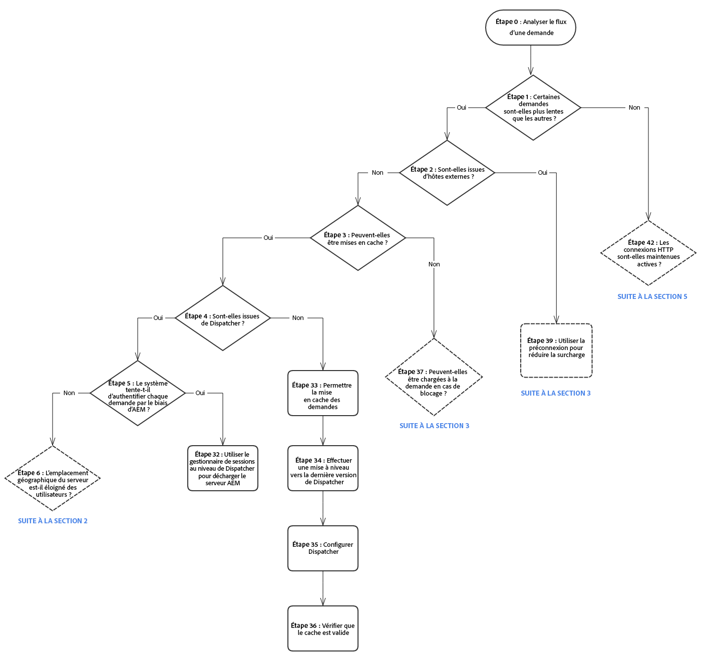
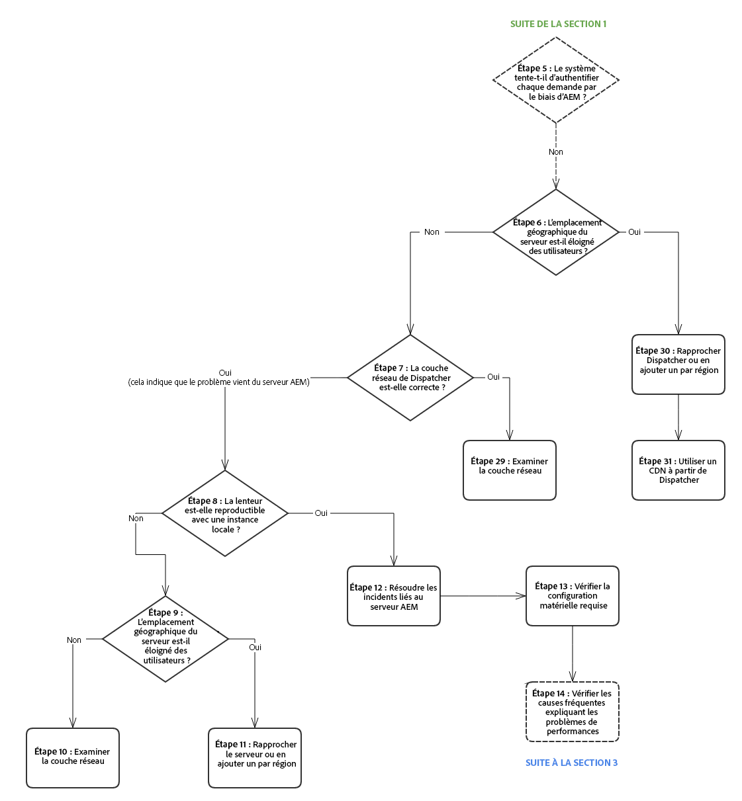
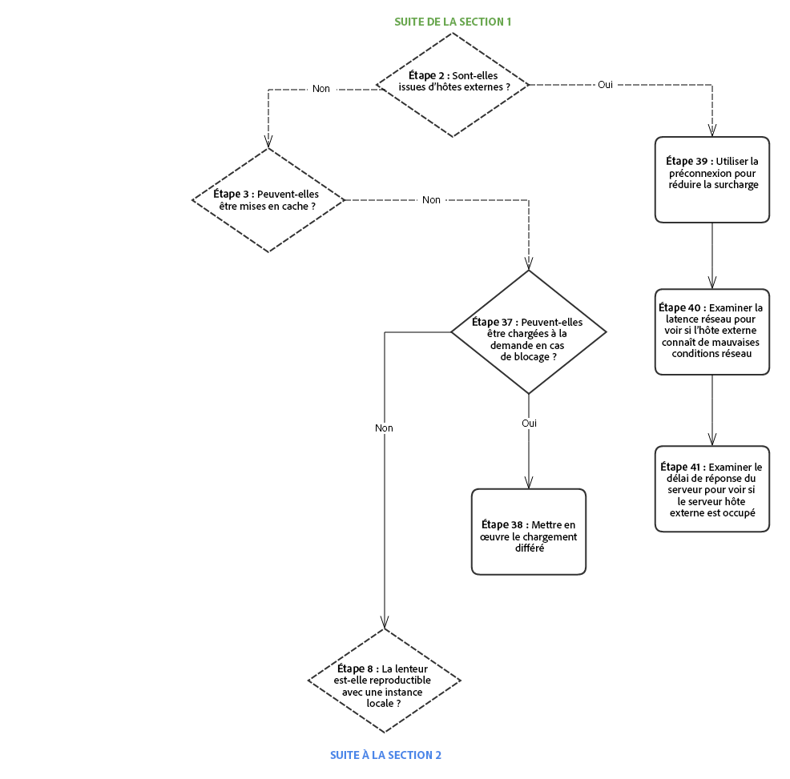
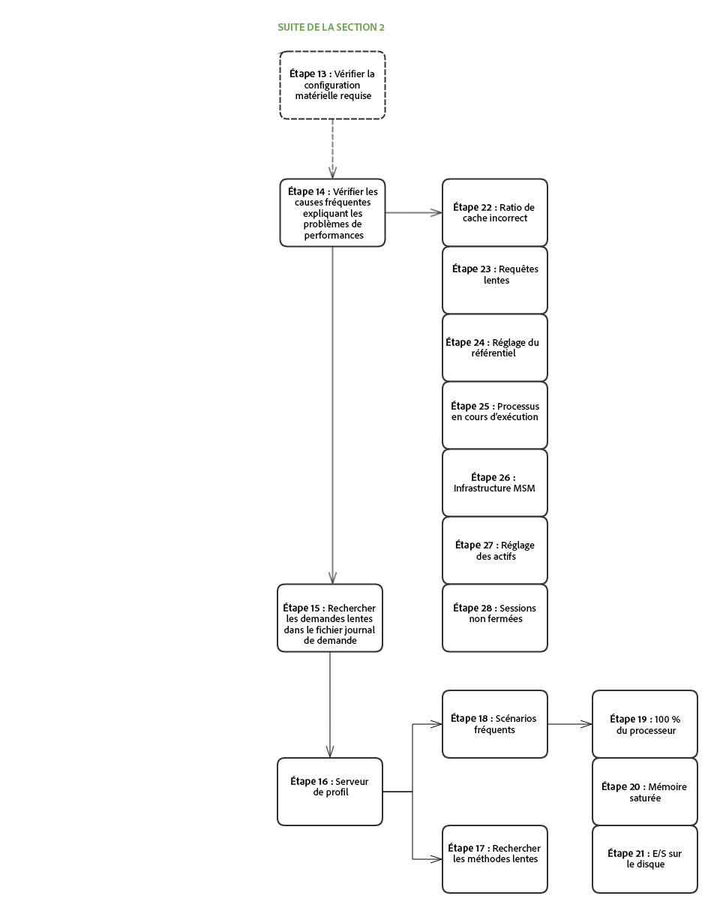
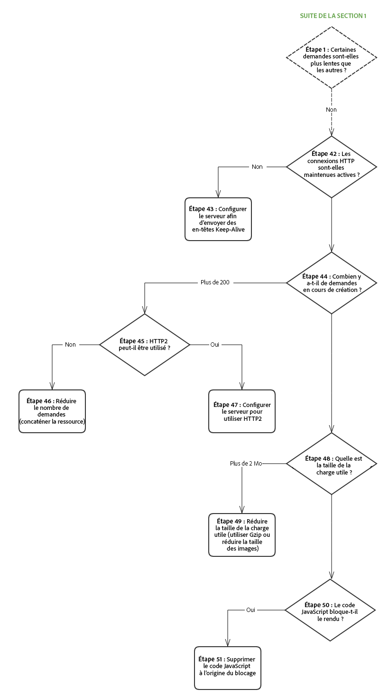

# Arborescence de la performance{#performance-tree}

## Portée {#scope}

Le diagramme ci-dessous est conçu pour fournir des directives sur les étapes qui doivent être suivies pour résoudre les problèmes de performances. Il est divisé en 5 sections pour en simplifier la lecture. 

Chaque étape du diagramme est associée à une ressource ou à une recommandation.

## Conditions préalables et hypothèses {#prerequisites-and-assumptions}

L’hypothèse est qu’un problème de performance est observé sur une page donnée (soit sur une console AEM, soit sur une page web) et peut être reproduit systématiquement. La condition préalable est de posséder une façon de tester ou de surveiller la performance avant de lancer l’investigation.

L’analyse commence à l’étape 0. L’objectif est de déterminer les entités (dispatcher, hôte externe ou AEM) responsables du problème de performance, puis de déterminer la zone (serveur ou réseau) qui doit être étudiée.

### Section 1 {#section}

### Section 2 {#section-1}

### Section 3 {#section-2}

### Section 4 {#section-3}

### Section 5 {#section-4}

## Liens de référence {#reference-links}

<table>
 <tbody>
  <tr>
   <td><strong>Étape</strong></td>
   <td><strong>Title (Titre)</strong></td>
   <td><strong>Ressources</strong></td>
  </tr>
  <tr>
   <td><strong>Étape 0</strong></td>
   <td>Analyse du flux de demandes</td>
   <td>
Vous pouvez utiliser l’analyse de demandes HTTP standard dans le navigateur afin d’analyser le flux de demandes. Pour plus d’informations sur la façon de procéder sur Chrome, voir :  
 
<a href="https://developers.google.com/web/tools/chrome-devtools/profile/network-performance/resource-loading">https://developers.google.com/web/tools/chrome-devtools/profile/network-performance/resource-loading</a><a href=" https://developers.google.com/web/tools/chrome-devtools/profile/network-performance/understanding-resource-timing">  https://developers.google.com/web/tools/chrome-devtools/profile/network-performance/understanding-resource-timing</a>  
 </td>
  </tr>
  <tr>
   <td><strong>Étape 2</strong></td>
   <td>Les demandes proviennent-elles des hôtes externes ?</td>
   <td>Vous pouvez utiliser l’analyse de demandes HTTP standard dans le navigateur afin d’analyser le flux de demandes. Consultez les liens ci-dessus sur la façon de procéder sur Chrome.  </td>
  </tr>
  <tr>
   <td><strong>Étape 3</strong></td>
   <td>Les demandes peuvent-elles être mises en cache ?</td>
   <td>Pour plus d’informations sur les demandes pouvant être mises en cache et pour lire les conseils généraux d’optimisation des performances de dispatcher, voir <a href="/help/sites-deploying/configuring-performance.md#optimizing-performance-when-using-the-dispatcher">Optimisation des performances du dispatcher</a>.</td>
  </tr>
  <tr>
   <td><strong>Étape 4</strong></td>
   <td>Les demandes proviennent-elles du dispatcher ?</td>
   <td>
Reportez-vous<a href="https://helpx.adobe.com/experience-manager/dispatcher/using/dispatcher-configuration.html#debugging"> à la documentation de débogage de dispatcher</a> afin de déterminer si les demandes sont correctement mises en cache.   
 </td>
  </tr>
  <tr>
   <td><strong>Étape 5</strong></td>
   <td>Le dispatcher essaie-t-il d’authentifier chaque demande via AEM ?</td>
   <td>Vérifiez si le dispatcher envoie les demandes <code>HEAD</code> à AEM pour authentification avant de diffuser la ressource mise en cache. Vous pouvez effectuer cette opération en recherchant les demandes <code>HEAD</code> dans le fichier <code>access.log</code> . d’AEM. Pour plus d’informations, voir <a href="/help/sites-deploying/configure-logging.md">Journalisation</a>.  </td>
  </tr>
  <tr>
   <td><strong>Étape 6</strong></td>
   <td>L’emplacement géographique du dispatcher est-il éloigné des utilisateurs ?</td>
   <td>Rapprochez le dispatcher des utilisateurs.</td>
  </tr>
  <tr>
   <td><strong>Étape 7</strong></td>
   <td>La couche réseau du dispatcher est-elle normale ?</td>
   <td>  Examinez la couche réseau pour les problèmes de saturation et de latence.
 
 </td>
  </tr>
  <tr>
   <td><strong>Étape 8</strong></td>
   <td>La lenteur est-elle reproductible avec une instance locale ?</td>
   <td>  
Utilisez <a href="/help/sites-developing/tough-day.md">Tough Day</a> pour répliquer les conditions « réelles » des instances de production. Si cela n’est pas réaliste dans le cadre de votre développement, assurez-vous de tester une instance de production (ou une instance d’évaluation identique) dans un autre contexte réseau.  
 </td>
  </tr>
  <tr>
   <td><strong>Étape 9</strong></td>
   <td>Le serveur est-il éloigné des utilisateurs ?</td>
   <td>Rapprochez le serveur des utilisateurs.</td>
  </tr>
  <tr>
   <td><strong>Étapes 10 et 29</strong></td>
   <td>Examen de la couche réseau</td>
   <td>
Examinez la couche réseau pour les problèmes de saturation et de latence.
 
Pour le niveau de l’auteur, il est recommandé d’utiliser une latence ne dépassant pas 100 millisecondes.
 
Pour plus d’informations sur les conseils d’optimisation des performances, reportez-vous<a href="https://helpx.adobe.com/fr/experience-manager/kb/performance-tuning-tips.html"> à cette page</a>.
 </td>
  </tr>
  <tr>
   <td><strong>Étape 11</strong></td>
   <td>Rapprochez le serveur ou ajoutez-en un par région</td>
   <td> </td>
  </tr>
  <tr>
   <td><strong>Étape 12</strong></td>
   <td>Dépannage du serveur AEM</td>
   <td>Consultez les étapes suivantes du diagramme pour plus d’informations.</td>
  </tr>
  <tr>
   <td><strong>Étape 13</strong></td>
   <td>Vérification des exigences en matière de matériel</td>
   <td>Consultez la documentation sur <a href="/help/managing/hardware-sizing-guidelines.md">les conseils de dimensionnement du matériel</a>.  </td>
  </tr>
  <tr>
   <td><strong>Étape 14</strong></td>
   <td>Vérification des causes fréquentes des problèmes de performances</td>
   <td> </td>
  </tr>
  <tr>
   <td><strong>Étape 15</strong></td>
   <td>Identification des demandes lentes</td>
   <td>
Vous pouvez identifier les demandes lentes en analysant le fichier <code>request.log</code> ou à l’aide de <code>rlog.jar</code>.
 
Pour plus d’informations sur l’utilisation de rlog.jar, consultez cette page.
 
Voir <a href="/help/sites-deploying/monitoring-and-maintaining.md#using-rlog-jar-to-find-requests-with-long-duration-times">Utilisation de rlog.jar pour rechercher les demandes avec de longs temps d’attente</a>.  
 
 
 </td>
  </tr>
  <tr>
   <td><strong>Étape 16</strong></td>
   <td>Serveur de profil</td>
   <td>
Pour plus d’informations sur les outils de profilage que vous pouvez utiliser avec AEM, voir <a href="/help/sites-deploying/monitoring-and-maintaining.md#tools-for-monitoring-and-analyzing-performance">Outils de surveillance et d’analyse des performances</a>.  
 </td>
  </tr>
  <tr>
   <td><strong>Étape 17</strong></td>
   <td>Recherche de méthodes lentes dans le profilage</td>
   <td> </td>
  </tr>
  <tr>
   <td><strong>Étape 18</strong></td>
   <td>Scénarios de profilage courants</td>
   <td>Voir <a href="/help/sites-deploying/monitoring-and-maintaining.md#analyzing-specific-scenarios">Analyse les scénarios spécifiques</a> dans la section Optimisation des performances.  </td>
  </tr>
  <tr>
   <td><strong>Étape 19</strong></td>
   <td>Processeur à 100 %</td>
   <td><a href="/help/sites-deploying/monitoring-and-maintaining.md#monitoring-performance">https://helpx.adobe.com/experience-manager/6-3/sites-deploying/monitoring-and-maintaining.html#MonitoringPerformance</a></td>
  </tr>
  <tr>
   <td><strong>Étape 20</strong></td>
   <td>Mémoire insuffisante</td>
   <td> 
    <ol>
     <li><a href="/help/sites-deploying/monitoring-and-maintaining.md#out-of-memory">Mémoire insuffisante</a></li>
     <li><a href="/help/sites-deploying/troubleshooting.md">Mon application renvoie des erreurs de mémoire insuffisante</a></li>
     <li> <a href="https://helpx.adobe.com/experience-manager/kb/AnalyzeMemoryProblems.html">Analysez les problèmes de mémoire sur le site d’aide Adobe.</a>    </li>
    </ol> </td>
  </tr>
  <tr>
   <td><strong>Étape 21</strong></td>
   <td>I/O des disques</td>
   <td>
Voir la section <a href="/help/sites-deploying/monitoring-and-maintaining.md#disk-i-o">I/O des disques</a> dans la documentation sur la surveillance et la maintenance.
 </td>
  </tr>
  <tr>
   <td><strong>Étapes 22 et 22.1</strong></td>
   <td>Ratio de cache</td>
   <td>Voir <a href="/help/sites-deploying/configuring-performance.md#calculating-the-dispatcher-cache-ratio">Calcul du ratio cache/dispatcher</a>.    </td>
  </tr>
  <tr>
   <td><strong>Étape 23</strong></td>
   <td>Requêtes lentes</td>
   <td><a href="/help/sites-deploying/best-practices-for-queries-and-indexing.md">Bonnes pratiques relatives aux requêtes et à l’indexation</a></td>
  </tr>
  <tr>
   <td><strong>Étape 24</strong></td>
   <td>Réglage du référentiel</td>
   <td>
    <ul>
     <li><a href="https://helpx.adobe.com/fr/experience-manager/kb/performance-tuning-tips.html">Conseils de réglage de la performance</a></li>
     <li><a href="/help/sites-deploying/configuring-performance.md#configuring-for-performance">Configuration des performances</a></li>
     <li><a href="https://www.slideshare.net/jukka/repository-performance-tuning">Réglage de la performance du référentiel</a></li>
    </ul> </td>
  </tr>
  <tr>
   <td><strong>Étape 25</strong></td>
   <td>Workflows en cours d’exécution</td>
   <td>
    <ul>
     <li><a href="/help/sites-deploying/configuring-performance.md#concurrent-workflow-processing">Traitement de processus simultanés</a></li>
     <li><a href="/help/sites-deploying/configuring-performance.md#configure-the-queue-for-a-specific-workflow">Configuration de la file d’attente pour un workflow spécifique</a></li>
     <li><a href="/help/sites-administering/workflows-administering.md#regular-purging-of-workflow-instances">Purge régulière des instances de workflows</a></li>
     <li><a href="/help/sites-developing/workflows.md#transient-workflows">Workflows transitoires</a>  </li>
    </ul> 
 
 </td>
  </tr>
  <tr>
   <td><strong>Étape 26</strong></td>
   <td>Infrastructure MSM</td>
   <td>
<a href="/help/sites-administering/msm-best-practices.md">Meilleures pratiques relatives au gestionnaire multi-site</a>  
 </td>
  </tr>
  <tr>
   <td><strong>Étape 27</strong></td>
   <td>Réglage des ressources</td>
   <td>
    <ol>
     <li><a href="/help/sites-deploying/configuring-performance.md#cq-dam-asset-synchronization-service">Service de synchronisation des ressources</a></li>
     <li><a href="/help/sites-deploying/configuring-performance.md#multiple-dam-instances">Plusieurs instances de gestion des actifs numériques</a></li>
     <li>Articles contenant des conseils pratiques d’amélioration de la performance <a href="https://helpx.adobe.com/fr/experience-manager/kb/performance-tuning-tips.html">ici</a> et <a href="https://helpx.adobe.com/fr/experience-manager/kb/performance-tuning-tips.html">ici</a>.   </li>
    </ol> </td>
  </tr>
  <tr>
   <td><strong>Étape 28</strong></td>
   <td>Sessions Non fermées</td>
   <td>
 
 
<a href="/help/sites-administering/troubleshoot.md#checking-for-unclosed-jcr-sessions">Contrôle des sessions JCR non fermées</a>
 
 
 </td>
  </tr>
  <tr>
   <td><strong>Étape 30</strong></td>
   <td>Rapprochement du dispatcher (ou ajout d’un par « région » ?)</td>
   <td> </td>
  </tr>
  <tr>
   <td><strong>Étape 31</strong></td>
   <td>Utilisation du CDN devant le dispatcher</td>
   <td><a href="https://helpx.adobe.com/experience-manager/dispatcher/using/dispatcher.html#using-dispatcher-with-a-cdn">Utilisation de Dispatcher avec un CDN </a>  </td>
  </tr>
  <tr>
   <td><strong>Étape 32</strong></td>
   <td>Utilisation de la gestion de session au niveau du dispatcher pour décharger le serveur AEM</td>
   <td>
<a href="https://helpx.adobe.com/experience-manager/dispatcher/using/dispatcher-configuration.html#enabling-secure-sessions-sessionmanagement">Activation des sessions sécurisées</a>
 </td>
  </tr>
  <tr>
   <td><strong>Étape 33</strong></td>
   <td>Activation de la mise en cache potentielle des demandes</td>
   <td>
    <ol>
     <li><a href="https://helpx.adobe.com/experience-manager/dispatcher/using/dispatcher.html">Configuration générale du dispatcher</a></li>
     <li><a href="https://helpx.adobe.com/experience-manager/dispatcher/using/dispatcher-configuration.html#configuring-the-dispatcher-cache-cache">Configuration du cache du dispatcher</a></li>
    </ol> 
Amélioration du ratio de cache ; activation de la mise en cache potentielle des demandes (meilleures pratiques de dispatcher)
 
En outre, tenez compte des paramètres ci-dessous afin d’optimiser vos configurations de mise en cache  

    <ol>
     <li>Définissez une règle de non mise en cache des demandes HTTP qui ne sont pas en GET</li>
     <li>Configurez les chaînes de requête de sorte qu’elles ne puissent pas être mises en cache</li>
     <li>Ne mettez pas en cache les URL avec des extensions manquantes</li>
     <li>En-têtes d’authentification du cache (possibles depuis la version 4.1.10 du dispatcher) </li>
    </ol> </td>
  </tr>
  <tr>
   <td><strong>Étape 34</strong></td>
   <td>Mise à niveau de la version du dispatcher </td>
   <td>
Vous pouvez télécharger la dernière version du Dispatcher à cet emplacement :
 
<a href="https://helpx.adobe.com/experience-manager/dispatcher/release-notes.html">Suivi du lien</a>
 </td>
  </tr>
  <tr>
   <td><strong>Étape 35</strong></td>
   <td>Configuration du dispatcher</td>
   <td><a href="https://helpx.adobe.com/fr/experience-manager/dispatcher/using/dispatcher-configuration.html">Configuration du dispatcher</a>  </td>
  </tr>
  <tr>
   <td><strong>Étape 36</strong></td>
   <td>Vérification de l’invalidation du cache</td>
   <td> 
    <ul>
     <li><a href="https://helpx.adobe.com/experience-manager/dispatcher/using/page-invalidate.html#invalidating-dispatcher-cache-from-the-authoring-environment">Invalidation du cache pour le niveau d’auteur ;</a></li>
     <li><a href="https://helpx.adobe.com/experience-manager/dispatcher/using/page-invalidate.html#invalidating-dispatcher-cache-from-a-publishing-instance">Invalidation du cache pour le niveau de publication.</a></li>
    </ul> </td>
  </tr>
  <tr>
   <td><strong>Étapes 37 et 38</strong></td>
   <td>Chargement différé</td>
   <td><a href="https://docs.adobe.com/ddc/fr/gems/aem-web-performance.html ">Voir la session sur la performance web d’AEM.</a>  </td>
  </tr>
  <tr>
   <td><strong>Étape 39</strong></td>
   <td>Utilisation d’une préconnexion pour réduire la surcharge de connexion</td>
   <td>Voir la session indiqués ci-dessus. En outre, voir la documentation supplémentaire sur les préconnexions du W3C : <a href="https://www.w3.org/TR/resource-hints/#dfn-preconnect">https://www.w3.org/TR/resource-hints/#dfn-preconnect</a></td>
  </tr>
  <tr>
   <td><strong>Étapes 40 et 41</strong>  </td>
   <td>Latence des hôtes externes et délai de réponse</td>
   <td>Examinez la latence et le délai de réponse des hôtes externes. </td>
  </tr>
  <tr>
   <td><strong>Étapes 45  et 47</strong>  </td>
   <td>Utilisation de HTTP/2</td>
   <td>Voir la session des étapes 37,38 et 39. Also, check out <a href="https://help-forums.adobe.com/content/adobeforums/en/experience-manager-forum/adobe-experience-manager.topic.html/forum__kdzc-does_anyoneknowwhe.html">this</a> forum post on HTTP/2 support.  </td>
  </tr>
  <tr>
   <td><strong>Étape 49</strong></td>
   <td>Réduction de la taille de la charge utile</td>
   <td><a href="/help/sites-deploying/osgi-configuration-settings.md">Activez Gzip</a> et<a href="https://docs.adobe.com/ddc/fr/gems/aem-web-performance.html "> réduisez la taille de l’image</a>.  </td>
  </tr>
  <tr>
   <td><strong>Étapes 42 et 43</strong></td>
   <td>Keep-Alive</td>
   <td>
L’en-tête<code>Keep-Alive</code>   est-elle présente dans les différentes demandes pour réutiliser les connexions ? Autrement, cela signifie que chaque demande entraîne l’établissement d’une autre connexion, ce qui génère des frais d’opération inutiles. (Analyse de requête HTTP standard dans le navigateur)
 
Vous pouvez utiliser l’<a href="/help/sites-administering/proxy-jar.md">Outil Proxy Server</a> pour vérifier les connexions Keep-Alive.   
 </td>
  </tr>
  <tr>
   <td><strong>Étape 44</strong></td>
   <td>Combien de demandes sont-elles effectuées ?</td>
   <td>Effectuez une analyse des demandes HTTP standard dans le navigateur.</td>
  </tr>
  <tr>
   <td><strong>Étape 46</strong></td>
   <td>Réduction du nombre de demandes</td>
   <td>
    <ol>
     <li>Concaténez les ressources (images, sprite CSS, JSON, etc.)  </li>
     <li>Incorporation de Clientlibs :
      <ol>
       <li><a href="/help/sites-developing/clientlibs.md#creating-client-library-folders">Création de dossiers</a> de bibliothèque client - voir Utilisation de l’en-tête Intégration pour réduire les requêtes</li>
      </ol> </li>
    </ol> </td>
  </tr>
  <tr>
   <td><strong>Étape 48</strong></td>
   <td>Quelle est la taille de la charge utile ?</td>
   <td>Analyse des demandes HTTP standard dans le navigateur</td>
  </tr>
  <tr>
   <td><strong>Étapes 50 et 51</strong></td>
   <td>Blocage du code JS</td>
   <td><a href="https://docs.Adobe.com/ddc/fr/gems/aem-web-performance.html">https://docs.adobe.com/ddc/fr/gems/aem-web-performance.html </a></td>
  </tr>
 </tbody>
</table>

