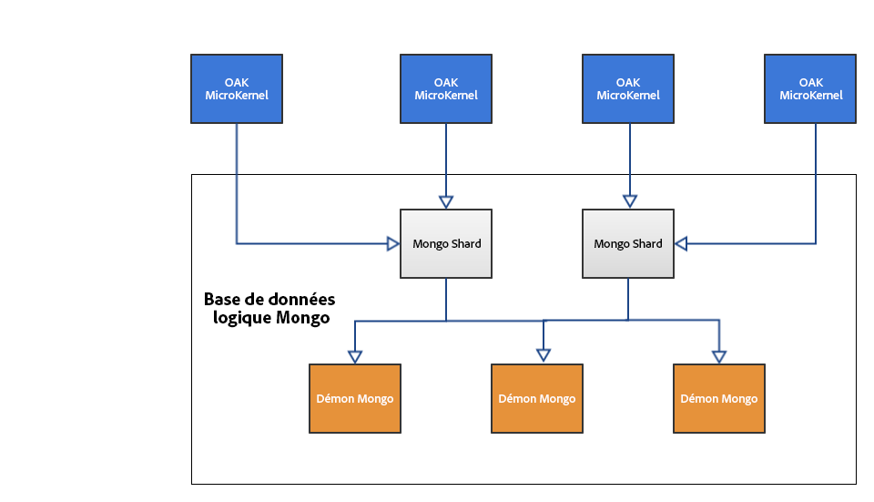

# Introduction à la plateforme AEM{#introduction-to-the-aem-platform}

La plateforme AEM dans AEM 6 est basée sur Apache Jackrabbit Oak.

Apache Jackrabbit Oak vise à implémenter un référentiel de contenu hiérarchique évolutif et performant pour l’utiliser comme fondation des sites web modernes de classe mondiale et d’autres applications de contenu exigentes.

Il succède à Jackrabbit 2 et est utilisé par AEM 6 comme serveur principal par défaut pour son référentiel de contenu, CRX.

## Principes de conception et objectifs {#design-principles-and-goals}

Oak met en œuvre les spécifications [JSR-283](https://www.day.com/day/en/products/jcr/jsr-283.html) (JCR 2.0). Ses principaux objectifs de création sont les suivants :

* Meilleure prise en charge de référentiels volumineux
* Plusieurs noeuds de cluster répartis pour une grande disponibilité
* Performances optimisées
* Prise en charge de nombreux noeuds enfants et de niveaux de contrôle d’accès

## Concept de l’architecture {#architecture-concept}

### Stockage {#storage}

L’objectif du calque de stockage est le suivant :

* Mettre en œuvre un modèle d’arborescence
* Rendre possible l’alimentation du·stockage
* Fournir un mécanisme de mise en cluster

### Cœur Oak {#oak-core}

Le cœur Oak ajoute plusieurs niveaux au niveau de stockage :

* Contrôles de niveau d’accès
* Recherche et indexation
* Observation

### Oak JCR  {#oak-jcr}

Le principal objectif de Oak JCR est de transformer la sémantique de JCR en opérations d’arborescence. Il est aussi chargé de :

* Mettre en œuvre l’API JCR
* Contenir les commit hooks qui mettent en œuvre les contraintes JCR

En outre, les implémentations non Java sont désormais possibles et font partie du concept Oak JCR. 

## Présentation du stockage {#storage-overview}

Le niveau de stockage Oak fournit un niveau d’abstraction pour le stockage de contenu.

Actuellement, il existe deux implémentations d’enregistrement disponibles dans AEM6 : **Enregistrement Tar** et **Enregistrement MongoDB**.

### Stockage tar {#tar-storage}

Le stockage Tar utilise des fichiers tar. Il stocke le contenu comme divers types d’enregistrements dans des segments plus volumineux. Les journaux sont utilisés pour effectuer le suivi du dernier état du référentiel. 

Il existe plusieurs principes de conception clés à partir desquels il est créé :

* **Segments inaltérables**

Le contenu est stocké dans les segments avec une taille pouvant aller jusqu’à 256 Ko. Ils sont inaltérables, ce qui permet de mettre en cache les segments utilisés fréquemment et de réduire les erreurs système susceptibles de compromettre le référentiel.

Chaque segment est identifié par un identifiant unique (UUID) et contient un sous-ensemble continu de l’arborescence de contenu. En outre, les segments peuvent référencer d’autres contenus. Chaque segment conserve une liste des UUID des autres segments référencés. 

* **Localité**

Les enregistrements associés comme un noeud et ses enfants immédiats sont habituellement stockés dans le même segment. Cela permet d’accélerer la recherche dans le référentiel et d’assurer la plupart des mises en cache pour les clients qui accèdent à plus d’un nœud relatif par session.

* **Compacité**

Le formatage des enregistrements est optimisé pour la taille de sorte à réduire les coûts E/S et pour accueillir le plus de contenu possible dans les caches.

### Stockage Mongo  {#mongo-storage}

Le stockage de MongoDB exploite MongoDB pour la fragmentation et la mise en cluster. L’arborescence du référentiel est conservée dans une base de données MongoDB où chaque nœud est un document distinct.

Il existe plusieurs particularités :

* Révisions

Pour chaque mise à jour (commit) du contenu, une nouvelle révision est créée. Une révision, finalement, est une chaîne qui se compose de trois éléments :

1. Un horodatage dérivé de l’heure système de l’ordinateur sur lequel il a été généré
1. Une alternative à la différenciation des révisions créées avec le même horodatage
1. L’ID de noeud du cluster où la révision a été créée

* Branches

Les branches sont prises en charge, ce qui permet au client de présenter de nombreuses modifications et de les rendre visibles à l’aide d’un simple appel de fusion.

* Documents précédents

Le stockage de MongoDB ajoute des données à un document avec chaque modification. Toutefois, il supprime uniquement les données si un nettoyage est explicitement déclenché. Les anciennes données sont déplacées lorsqu’un certain seuil est atteint. Les documents précédents contiennent uniquement des données inaltérables, ce qui signifie qu’elles contiennent uniquement des modifications validées et fusionnées.

* Métadonnées de noeud du cluster

Les données sur les noeuds de cluster actifs et inactifs sont conservées dans la base de données pour faciliter les opérations de mise en cluster.

Une configuration en cluster AEM typique avec un stockage MongoDB :

## Qu&#39;est-ce qui diffère de Jackrabbit 2 ? {#what-is-different-from-jackrabbit}

Étant donné qu’Oak est conçu pour être rétrocompatible avec le standard de JCR 1.0, il n’y a quasiment aucune modification au niveau de l’utilisateur. Toutefois, il existe des différences perceptibles à prendre en compte lors de la configuration d’un Oak basé sur l’installation AEM :

* Oak ne crée pas d’index automatiquement. Pour cette raison, les index personnalisés doivent être créés si nécessaire.
* Contrairement à Jackrabbit 2 où les sessions reflètent toujours le dernier état du référentiel, une session Oak reflète un point de vue stable du référentiel de l’heure à laquelle la session a été détectée. Cela est dû au modèle MVCC sur lequel Oak est basé.
* Les frères de même nom (SNS) ne sont pas pris en charge dans Oak. 

## Autre documentation relative à la plateforme {#other-platform-related-documentation}

Pour plus d’informations sur la plateforme AEM, vérifiez également les articles ci-dessous :

* [Configuration des stocks de nœuds et des entrepôts de données dans AEM 6](/help/sites-deploying/data-store-config.md)
* [Requêtes et indexation Oak](/help/sites-deploying/queries-and-indexing.md)
* [Éléments de stockage dans AEM 6](/help/sites-deploying/storage-elements-in-aem-6.md) 
* [AEM avec MongoDB](/help/sites-deploying/aem-with-mongodb.md)

