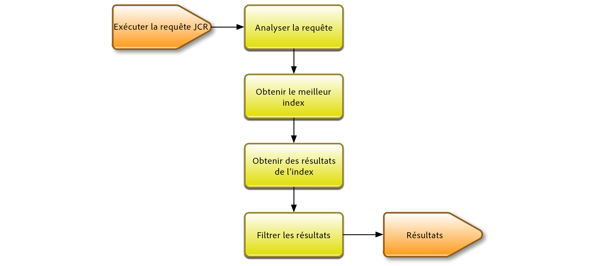

# Requêtes et indexation Oak{#oak-queries-and-indexing}

>[!NOTE]
>
>Cet article porte sur la configuration des index dans AEM 6. Pour connaître les meilleures pratiques sur l’optimisation des requêtes et l’indexation des performances, voir [Meilleures pratiques pour les requêtes et l’indexation](/help/sites-deploying/best-practices-for-queries-and-indexing.md).

## Présentation {#introduction}

Contrairement à Jackrabbit 2, Oak n’indexe pas le contenu par défaut. Des index personnalisés doivent être créés si nécessaire, comme pour les bases de données relationnelles classiques. S’il n’existe aucun index pour une requête spécifique, plusieurs nœuds seront probablement parcourus. La requête peut toujours fonctionner, mais sera probablement très lente.

Si Oak rencontre une requête sans index, un message de journal de niveau WARN s’affiche :

```xml
*WARN* Traversed 1000 nodes with filter Filter(query=select ...) consider creating an index or changing the query
```

## Langages de requête pris en charge {#supported-query-languages}

Le moteur de requête Oak prend en charge les langages suivants :

* XPath (recommandé)
* SQL-2
* SQL (obsolète)
* JQOM

## Types d’indexeur et calcul du coût  {#indexer-types-and-cost-calculation}

Le backend basé sur Apache Oak permet aux différents indexeurs d’être branchés au référentiel.

Un l’indexeur est **l’index des propriétés**, pour lequel la définition d’index est stockée dans le référentiel. 

Les implémentations d’**Apache Lucene** et **Solr** sont également disponibles par défaut, et prennent en charge l’indexation du texte intégral.

**L&#39;index de tendance** est utilisé si aucun autre indexeur n&#39;est disponible. Cela signifie que le contenu n’est pas indexé et que les nœuds de contenu sont parcourus pour trouver des correspondances à la requête.

Si plusieurs indexeurs sont disponibles pour une requête, chaque indexeur disponible calcule le coût d’exécution de la requête. Oak sélectionne ensuite l’indexeur avec le coût estimé le plus bas.



Le diagramme ci-dessus est une représentation de haut niveau du mécanisme d’exécution des requêtes Apache Oak. 

D’abord, la requête est analysée dans une arborescence de syntaxe abstraite. Ensuite, la requête est vérifiée et transformée en SQL-2, qui est le langage natif des requêtes Oak. 

Ensuite, chaque index est consulté pour estimer le coût de la requête. Une fois cette étape terminée, les résultats de l’index le plus économique sont récupérés. Enfin, les résultats sont filtrés, pour garantir que l’utilisateur actuel bénéficie de l’accès en lecture au résultat, et que le résultat correspond à la requête complète.

## Configuration des index  {#configuring-the-indexes}

>[!NOTE]
>
>Pour un référentiel volumineux, la création d’un index prend du temps. Cela vaut aussi bien pour la création initiale d’un index que pour la réindexation (reconstruction d’un index après avoir modifié la définition). Voir aussi [Résolution des problèmes liés aux index en chêne](/help/sites-deploying/troubleshooting-oak-indexes.md) et [Prévention de la réindexation lente](/help/sites-deploying/troubleshooting-oak-indexes.md#preventing-slow-re-indexing).

Si une réindexation s’avère nécessaire dans des référentiels très volumineux, en particulier lorsque vous utilisez MongoDB et des index en texte intégral, pensez à recourir à la pré-extraction de texte, ainsi qu’à utiliser la commande oak-run pour générer l’index initial et procéder à la réindexation.

Les index sont configurés en tant que nœuds dans le référentiel sous le nœud **oak:index**.

Le type du nœud d’index doit être **oak:QueryIndexDefinition.** Plusieurs options de configuration sont disponibles pour chaque indexeur en tant que propriétés de nœud. Pour plus d’informations, voir les détails de configuration pour chaque type d’indexeur ci-dessous.

### Index de propriété  {#the-property-index}

L’index de propriété est généralement utile pour les requêtes limitées par la propriété, mais qui ne sont pas en texte intégral. Il peut être configuré en suivant la procédure ci-dessous :

1. Ouvrez CRXDE en accédant à `http://localhost:4502/crx/de/index.jsp`
1. Créez un nœud sous **oak:index**
1. Nommez le nœud **PropertyIndex**, puis définissez le type de nœud sur **oak:QueryIndexDefinition**
1. Définissez les propriétés suivantes pour le nouveau nœud :

   * **type:**  `property` (de type String)
   * **propertyNames:**  `jcr:uuid` (de type Name)

   Cet exemple particulier indexera la propriété `jcr:uuid`, dont la tâche est de présenter l’UUID (universally unique identifier) du nœud associé.

1. Enregistrez les modifications.

L’index de propriété dispose des options de configuration suivantes :

* La propriété **type** spécifie le type d’index. Dans ce cas, il doit être défini sur **property**

* La propriété **propertyNames** indique la liste des propriétés qui seront stockées dans l’index. Si ces informations sont manquantes, le nom du noeud sera utilisé comme valeur de référence pour le nom de propriété. Dans cet exemple, la propriété **jcr:uuid**, dont la tâche est de présenter l’UUID (universally unique identifier) de son nœud, est ajoutée à l’index.

* L’indicateur **unique**, qui, défini sur **true**, ajoute une limite d’unicité à l’index de propriété.

* La propriété **declaringNodeTypes** vous permet de spécifier un certain type de nœud que l’index appliquera uniquement.
* L’indicateur **reindex**, si défini sur **true**, déclenchera une réindexation de l’ensemble du contenu.

### Index organisé  {#the-ordered-index}

L’index organisé est une extension de l’index de propriété. Toutefois, il est obsolète. Les index de ce type doivent être remplacés par l&#39;index [Lucene Property Index](#the-lucene-property-index).

### Index de texte intégral Lucene {#the-lucene-full-text-index}

L’indexeur de texte intégral basé sur Apache Lucene est disponible dans AEM 6.

Si un index de texte intégral est configuré, alors toutes les requêtes présentant une situation de texte intégral utilisent l’index de texte intégral, qu’il y ait d’autres états indexés ou pas, qu’il existe une restriction de chemin ou pas.

Si aucun index de texte intégral n’est configuré, les requêtes avec des situations de texte intégral ne fonctionneront pas comme prévu. 

Étant donné que l’index est mis à jour par le biais d’un thread asynchrone d’arrière-plan, certaines recherches de texte intégral ne seront pas disponibles pendant une courte durée, jusqu’à ce que les processus d’arrière-plan soient terminés.

Vous pouvez configurer un index de texte intégral Lucene en suivant la procédure ci-dessous : 

1. Ouvrez CRXDE et créez un nœud sous **oak:index**.
1. Nommez le nœud **LuceneIndex** et définissez le type de nœud sur **oak:QueryIndexDefinition**
1. Ajoutez les propriétés suivantes au nœud  :

   * **type:**  `lucene` (de type String)
   * **async:**  `async` (de type String)

1. Enregistrez les modifications.

L’index Lucene présente les options de configuration suivantes :

* La propriété **type**, qui spécifie le type d’index, doit être définie sur **lucene**
* La propriété **async** doit être définie sur **async**. Cela permettra d’envoyer le processus de mise à jour de l’index à un thread en arrière-plan.
* La propriété **includePropertyTypes**, qui définira le sous-ensemble de types de propriétés qui sera inclus dans l’index.
* La propriété **excludePropertyNames** qui définira une liste de noms de propriétés - propriétés qui doivent être exclues de l&#39;index.
* L’indicateur **reindex**, qui, défini sur **true**, déclenche une réindexation de l’ensemble du contenu.

### Index de propriété Lucene  {#the-lucene-property-index}

Depuis **Oak 1.0.8**, Lucene peut être utilisé pour créer des indexes qui impliquent des limites de propriété qui ne sont pas du texte intégral.

Pour obtenir un index de propriété Lucene, la propriété **fulltextEnabled** doit toujours être définie sur false. 

Voir l’exemple de requête suivant :

```xml
select * from [nt:base] where [alias] = '/admin'
```

Pour définir un index de propriété Lucene pour la requête ci-dessus, vous pouvez ajouter la définition suivante en créant un nœud sous **oak:index:**

* **Nom :**`LucenePropertyIndex`
* **Type:** `oak:QueryIndexDefinition`

Une fois que le nœud a été créé, ajoutez les propriétés suivantes :

* **type:**

   ```
   lucene (of type String)
   ```

* **asynchrone:**

   ```
   async (of type String)
   ```

* **fulltextEnabled :**

   ```
   false (of type Boolean)
   ```

* **includePropertyNames :** `["alias"] (of type String)`

>[!NOTE]
>
>Par rapport à l’index standard de propriété, l’index de propriété Lucene est toujours configuré en mode asynchrone. Par conséquent, les résultats renvoyés par l’index peuvent ne pas toujours refléter la version la plus récente du référentiel.

>[!NOTE]
>
>Pour obtenir des informations plus détaillées sur l’index de propriété Lucene, reportez-vous à la page de documentation [Apache Jackrabbit Oak Lucene ](https://jackrabbit.apache.org/oak/docs/query/lucene.html).

### Analyseurs Lucene {#lucene-analyzers}

Depuis la version 1.2.0, Oak prend en charge les analyseurs Lucene. 

Les analyseurs sont utilisés lorsqu’un document est indexé, au moment de la requête. Un analyseur examine le texte des champs et génère un flux de jeton. Les analyseurs Lucene se composent de séries de jetons et de classes de filtres.

Les analyseurs peuvent être configurés via le noeud `analyzers` (de type `nt:unstructured`) dans la définition `oak:index`.

L&#39;analyseur par défaut pour un index est configuré dans l&#39;enfant `default` du noeud analyzers.


>[!NOTE]
>
>Pour obtenir une liste des analyseurs disponibles, veuillez consulter la documentation des API de la version Lucene que vous utilisez. 

#### Spécification directe de la classe de l’analyseur  {#specifying-the-analyzer-class-directly}

Si vous souhaitez utiliser l’analyseur prêt à l’emploi, vous pouvez le configurer en suivant la procédure ci-dessous :

1. Localisez l’index avec lequel vous souhaitez utiliser l’analyseur sous le nœud `oak:index`.

1. Sous l’index, créez un noeud enfant appelé `default` de type `nt:unstructured`.

1. Ajouter une propriété au nœud par défaut avec les propriétés suivantes :

   * **Nom :**`class`
   * **Type :** `String`
   * **Valeur:** `org.apache.lucene.analysis.standard.StandardAnalyzer`

   La valeur est le nom de la classe d’analyseur que vous souhaitez utiliser. 

   Vous pouvez également définir l’analyseur à utiliser avec une version spécifique de Lucene à l’aide de la propriété de chaîne facultative `luceneMatchVersion`. Un syntaxe valide pour l’utiliser avec Lucene 4.7 serait :

   * **Nom :**`luceneMatchVersion`
   * **Type :** `String`
   * **Valeur:** `LUCENE_47`

   Si `luceneMatchVersion` n’est pas spécifié, Oak utilise la version Lucene avec laquelle il est envoyée. 

1. Si vous souhaitez ajouter un fichier de mots de passe aux configurations de l&#39;analyseur, vous pouvez créer un nouveau noeud sous `default` avec les propriétés suivantes :

   * **Nom :**`stopwords`
   * **Type :** `nt:file`

#### Création d’analyseurs via la composition {#creating-analyzers-via-composition}

Les analyseurs peuvent également être composés en fonction de `Tokenizers`, `TokenFilters` et `CharFilters`. Vous pouvez effectuer cette opération en spécifiant un programme d’analyse et en créant des nœuds enfants de ces jetons et filtres facultatifs, qui seront appliqués dans l’ordre indiqué. Voir aussi [https://wiki.apache.org/solr/AnalyzersTokenizersTokenFilters#Specifying_an_Analyzer_in_the_schema](https://wiki.apache.org/solr/AnalyzersTokenizersTokenFilters#Specifying_an_Analyzer_in_the_schema)

Prenez cette structure de nœud comme exemple :

* **Nom :**`analyzers`

   * **Nom :**`default`

      * **Nom :**`charFilters`
      * **Type :** `nt:unstructured`

         * **Nom :**`HTMLStrip`
         * **Nom :**`Mapping`
      * **Nom :**`tokenizer`

         * **Nom de la propriété:** `name`

            * **Type :** `String`
            * **Valeur:** `Standard`
      * **Nom :**`filters`
      * **Type :** `nt:unstructured`

         * **Nom :**`LowerCase`
         * **Nom :**`Stop`

            * **Nom de la propriété:** `words`

               * **Type :** `String`
               * **Valeur:** `stop1.txt, stop2.txt`
            * **Nom :**`stop1.txt`

               * **Type :** `nt:file`
            * **Nom :**`stop2.txt`

               * **Type :** `nt:file`


Les noms de filtres, charFilters et jetons sont créés en supprimant les suffixes de fabrique. Ainsi :

* `org.apache.lucene.analysis.standard.StandardTokenizerFactory` devient  `standard`

* `org.apache.lucene.analysis.charfilter.MappingCharFilterFactory` devient  `Mapping`

* `org.apache.lucene.analysis.core.StopFilterFactory` devient  `Stop`

Tout paramètre de configuration requis pour la fabrique est spécifié comme propriété du code en question.

Dans des cas tels que le chargement des mots vides quand le contenu des fichiers externes doit être chargé, le contenu peut être diffusé en créant un noeud enfant `nt:file` pour le fichier en question.

### Index Solr {#the-solr-index}

L’objectif de l’index Solr est principalement la recherche de texte intégral, mais il peut également être utilisé pour indexer par chemin, limite de propriété et restrictions de type principal. Cela signifie que l’index Solr dans Oak peut être utilisé pour n’importe quel type de requête JCR. 

L’intégration dans AEM se produit au niveau du référentiel. Ainsi, Solr est l’un des index pouvant être utilisés dans Oak, la nouvelle implémentation de référentiel fournie avec AEM.

Il peut être configuré pour fonctionner comme serveur intégré avec les instances AEM ou en tant que serveur distant.

### Configuration d’AEM avec un serveur Solr intégré  {#configuring-aem-with-an-embedded-solr-server}

>[!CAUTION]
>
>N’utilisez pas de serveur Solr incorporé dans un environnement de production. Il doit uniquement être utilisé dans un environnement de développement.

AEM peut être utilisée avec un serveur Solr intégré qui peut être configuré par le biais de la console web. Dans ce cas, le serveur Solr fonctionnera dans le même JVM que l’instance AEM sur laquelle il est intégré.

Vous pouvez configurer le serveur Solr intégré en procédant comme suit :

1. Accéder à la console Web à `https://serveraddress:4502/system/console/configMgr`
1. Recherchez « **Oak Solr server provider** » (fournisseur du serveur Oak Solr). 
1. Appuyez sur le bouton Modifier, puis, dans la fenêtre suivante, définissez le type de serveur sur **Embedded Solr (Solr intégré)** dans la liste déroulante.

1. Ensuite, modifiez la configuration «**Oak Solr embedded server configuration**» (Configuration de serveur intégré Oak Solr) et créez une configuration. Pour plus d’informations sur les options de configuration, consultez [le site web d’Apache Solr](https://lucene.apache.org/solr/documentation.html).

   >[!NOTE]
   >
   >La configuration du répertoire Solr (solr.home.path) recherchera un fichier portant le même nom dans le dossier d’installation d’AEM.

1. Ouvrez CRXDE et connectez-vous en tant qu’administrateur.
1. Ajoutez un nœud nommé **solrlndex** de type **oak:QueryIndexDefinition** sous **oak:index** avec les propriétés suivantes :

   * **type:** `solr`(de type String)
   * **async:** `async`(de type String)
   * **réindex:** `true`(de type Boolean)

1. Enregistrez les modifications.

### Configuration d’AEM avec un seul serveur distant Solr  {#configuring-aem-with-a-single-remote-solr-server}

AEM peut également être configuré pour travailler avec une instance de serveur distant Solr :

1. Téléchargez et extrayez la version la plus récente de Solr. Pour plus d’informations sur la façon de procéder, consultez [la documentation d’installation Apache Solr](https://cwiki.apache.org/confluence/display/solr/Installing+Solr).
1. Créez deux partitions Solr. Pour ce faire, vous devez créer des dossiers pour chaque partition dans le dossier dans lequel Solr a été décompressé :

   * Pour la première partition, créez le dossier :

   `<solrunpackdirectory>\aemsolr1\node1`

   * Pour la seconde partition, créez le dossier :

   `<solrunpackdirectory>\aemsolr2\node2`

1. Recherchez un exemple d’instance dans le package Solr. Cet environnement se situe généralement dans un dossier nommé « `example` » dans la racine du module.
1. Copiez les dossiers suivants de l’exemple d’instance dans les deux dossiers partagés ( `aemsolr1\node1` et `aemsolr2\node2`) :

   * `contexts`
   * `etc`
   * `lib`
   * `resources`
   * `scripts`
   * `solr-webapp`
   * `webapps`
   * `start.jar`

1. Créez un dossier appelé « `cfg` » dans chacun des deux dossiers des partitions. 
1. Définissez vos fichiers de configuration Solr et Zookeeper dans les dossiers nouvellement créés `cfg`.

   >[!NOTE]
   >
   >Pour plus d’informations sur la configuration de Solr et ZooKeeper, consultez la [documentation sur la configuration de Solr](https://wiki.apache.org/solr/ConfiguringSolr) et le [Guide de démarrage pour ZooKeeper](https://zookeeper.apache.org/doc/r3.1.2/zookeeperStarted.html).

1. Démarrez la première partition avec la prise en charge de ZooKeeper en accédant à `aemsolr1\node1` et en exécutant la commande suivante :

   ```xml
   java -Xmx2g -Dbootstrap_confdir=./cfg/oak/conf -Dcollection.configName=myconf -DzkRun -DnumShards=2 -jar start.jar
   ```

1. Démarrez la deuxième partition en accédant à `aemsolr2\node2` et en exécutant la commande suivante :

   ```xml
   java -Xmx2g -Djetty.port=7574 -DzkHost=localhost:9983 -jar start.jar
   ```

1. Une fois les deux partitions démarrées, vérifiez que tout est en état de marche en vous connectant à l’interface à l’adresse `http://localhost:8983/solr/#/`/solr/#/
1. Début AEM et accédez à la console Web à `http://localhost:4502/system/console/configMgr`
1. Définissez la configuration suivante dans la **configuration du serveur distant Solr Oak** :

   * URL HTTP solr : `http://localhost:8983/solr/`

1. Sélectionnez **Remote Solr (Solr distant)** dans la liste déroulante sous le fournisseur de serveurs **Oak Solr**.

1. Accédez à CRXDE et connectez-vous en tant qu’administrateur. 
1. Créez un nœud appelé **solrIndex** sous **oak:index** et définissez les propriétés suivantes :

   * **type :** solr (de type Chaîne)
   * **async :** async (de type Chaîne)
   * **reindex :** true (de type booléen)

1. Enregistrez les modifications.

#### Configuration recommandée pour Solr  {#recommended-configuration-for-solr}

Voici un exemple de configuration de base qui peut être utilisée avec les trois déploiements Solr décrits dans cet article. Il s’adapte aux index de propriété dédiés qui sont déjà présents dans AEM et ne doivent pas être utilisés avec d’autres applications.

Pour l’utiliser correctement, vous devez placer le contenu de l’archive directement dans le répertoire d’accueil Solr. Dans le cas de déploiements avec plusieurs nœuds, il doit être placé directement sous le dossier racine de chaque nœud.

Fichiers de configuration recommandés pour Solr

[Obtenir le fichier](assets/recommended-conf.zip)

### Outils d’indexation AEM {#aem-indexing-tools}

AEM 6.1 intègre également deux outils d’indexation présents dans AEM 6.0 dans le cadre de l’ensemble d’outils d’Adobe Consulting Services Commons :

1. **Explain Query**, un outil conçu pour aider les administrateurs à comprendre la manière dont les applications sont exécutées ;
1. **Oak Index Manager**, une interface web assurer la maintenance des index existants. 

Vous pouvez désormais y accéder en vous rendant dans **Outils - Opérations - Tableau de bord- Diagnostic** à partir de l’écran de bienvenue d’AEM.

Pour plus d’informations sur la manière de les utiliser, reportez-vous à la [documentation du tableau de bord des opérations](/help/sites-administering/operations-dashboard.md). 

#### Création d’index de propriétés via OSGi  {#creating-property-indexes-via-osgi}

Les modules ACS Commons présentent également des configurations OSGi qui peuvent être utilisées pour créer des index de propriété.

Vous pouvez y accéder à partir de la console web en recherchant « **Ensure Oak Property Index** » (Assurer l’index de propriété Oak).


### Dépannage des problèmes d’indexation {#troubleshooting-indexing-issues}

Vous pouvez être confronté à des situations au cours desquelles les requêtes prennent du temps à s’exécuter et le délai de réponse système est lent.

Cette section présente un ensemble de recommandations sur la marche à suivre pour trouver la cause de ces problèmes et présente des conseils sur la manière d’y remédier.

#### Préparation des informations de débogage pour l’analyse {#preparing-debugging-info-for-analysis}

La façon la plus simple d’obtenir les informations requises pour la requête en cours d’exécution est via l’[outil Explain Query ](/help/sites-administering/operations-dashboard.md#explain-query). Il vous permet de collecter les informations nécessaires pour corriger une requête lente sans avoir besoin de consulter les informations au niveau du journal. Ceci est souhaitable si vous connaissez la requête en cours de débogage.

Si cela n’est pas possible pour une raison quelconque, vous pouvez rassembler les journaux d’indexation dans un seul fichier, puis les utiliser pour résoudre votre problème particulier.

#### Activation de la journalisation  {#enable-logging}

Pour activer la journalisation, vous devez activer les journaux de niveau **DEBUG** pour les catégories concernant l’indexation et les requêtes Oak. Ces catégories sont les suivants :

* org.apache.jackrabbit.oak.plugins.index
* org.apache.jackrabbit.oak.query
* com.day.cq.search

La catégorie **com.day.cq.search** s’applique uniquement si vous utilisez l’utilitaire QueryBuilder fourni par AEM.

>[!NOTE]
>
>Il est important que les journaux soient uniquement définis sur DEBUG pendant que la requête que vous voulez résoudre est en cours d’exécution, sinon un grand nombre d’événements seront générés dans les journaux au fil du temps. Pour cette raison, une fois que les journaux requis sont collectés, revenez à la journalisation au niveau INFO pour les catégories mentionnées ci-dessus.

Vous pouvez activer la journalisation en suivant cette procédure :

1. Pointez votre navigateur sur `https://serveraddress:port/system/console/slinglog`
1. Cliquez sur le bouton **Add new Logger** (Ajouter un enregistreur) dans la partie inférieure de la console.
1. Dans la ligne que vous venez de créer, ajoutez les catégories mentionnées ci-dessus. Vous pouvez utiliser le signe **+** pour ajouter plus d’une catégorie à un seul journal.
1. Sélectionnez **DEBUG** dans la liste déroulante **la liste déroulante** Log level (Niveau de journal).
1. Définissez le fichier de sortie sur `logs/queryDebug.log`. Cela corrélera tous les événements DEBUG dans un seul fichier journal.
1. Exécutez la requête ou effectuez le rendu de la page qui utilise la requête que vous souhaitez déboguer.
1. Une fois que vous avez exécuté la requête, revenez à la console de journalisation et modifiez le niveau du journal nouvellement créé en le passant sur **INFO**.

#### Configuration de l’index {#index-configuration}

La façon dont la requête est évaluée est largement affectée par la configuration de l’index. Il est donc important d’obtenir la configuration d’index pour l’analyser ou l’envoyer à l’assistance. Vous pouvez obtenir la configuration en tant que module de contenu ou en tant que rendu JSON.

Dans la plupart des cas, la configuration d’indexation est stockée sous le noeud `/oak:index` dans CRXDE. Vous pouvez donc obtenir la version JSON à l’adresse suivante :

`https://serveraddress:port/oak:index.tidy.-1.json`

Si l’index est configuré à un emplacement différent, modifiez le chemin en conséquence. 

#### Sortie MBean  {#mbean-output}

Dans certains cas, il s’avère utile de fournir la sortie des Mbeans liés à l’index pour le débogage. Vous pouvez le faire en procédant comme suit :

1. Accédez à la console JMX à l’adresse :
   `https://serveraddress:port/system/console/jmx`

1. Recherches les MBeans suivants :

   * Statistiques sur les index Lucene
   * Statistiques de support CopyOnRead 
   * Statistiques de requête Oak
   * IndexStats

1. Cliquez sur chacun des MBeans pour obtenir les statistiques de performances. Créez une capture d’écran ou notez-les au cas où vous devez les envoyer au service d’assistance.

Vous pouvez également obtenir la variante JSON de ces statistiques en accédant aux URL suivantes :

* `https://serveraddress:port/system/sling/monitoring/mbeans/org/apache/jackrabbit/oak/%2522LuceneIndex%2522.tidy.-1.json`
* `https://serveraddress:port/system/sling/monitoring/mbeans/org/apache/jackrabbit/oak/%2522LuceneIndex%2522.tidy.-1.json`
* `https://serveraddress:port/system/sling/monitoring/mbeans/org/apache/jackrabbit/oak/%2522LuceneIndex%2522.tidy.-1.json`
* `https://serveraddress:port/system/sling/monitoring/mbeans/org/apache/jackrabbit/oak/%2522LuceneIndex%2522.tidy.-1.json`

Vous pouvez également fournir une sortie JMX consolidée via `https://serveraddress:port/system/sling/monitoring/mbeans/org/apache/jackrabbit/oak.tidy.3.json`. Cela inclut tous les détails liés à MBean Oak au format JSON.

#### Informations complémentaires {#other-details}

Vous pouvez rassembler des informations supplémentaires afin de résoudre le problème, par exemple :

1. La version Oak sur laquelle votre instance est exécutée. Vous pouvez l’afficher en ouvrant CRXDE et en affichant la version dans le coin inférieur droit de la page d’accueil ou en vérifiant la version du lot `org.apache.jackrabbit.oak-core`.
1. La sortie du débogueur QueryBuilder de la requête posant problème. Le débogueur est accessible à l&#39;adresse suivante : `https://serveraddress:port/libs/cq/search/content/querydebug.html`

