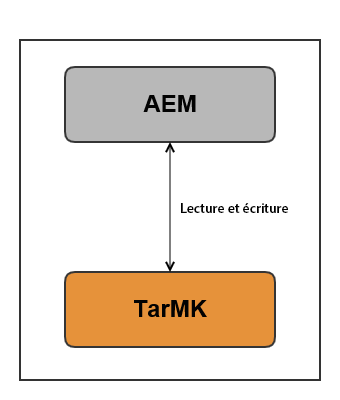
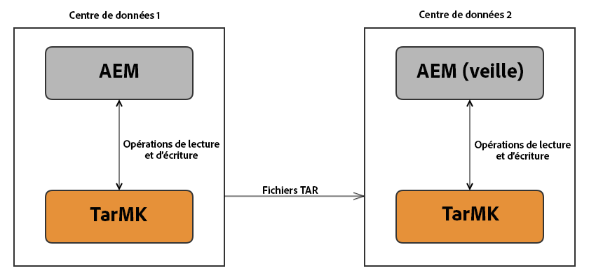
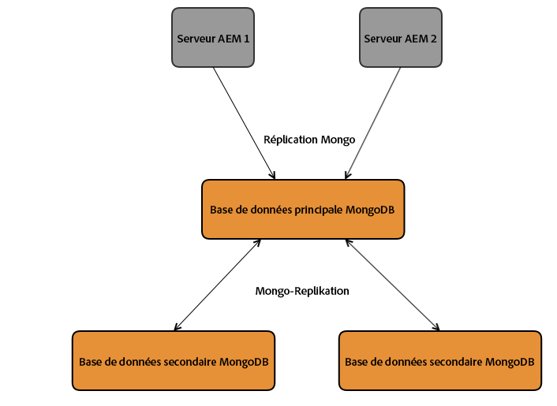
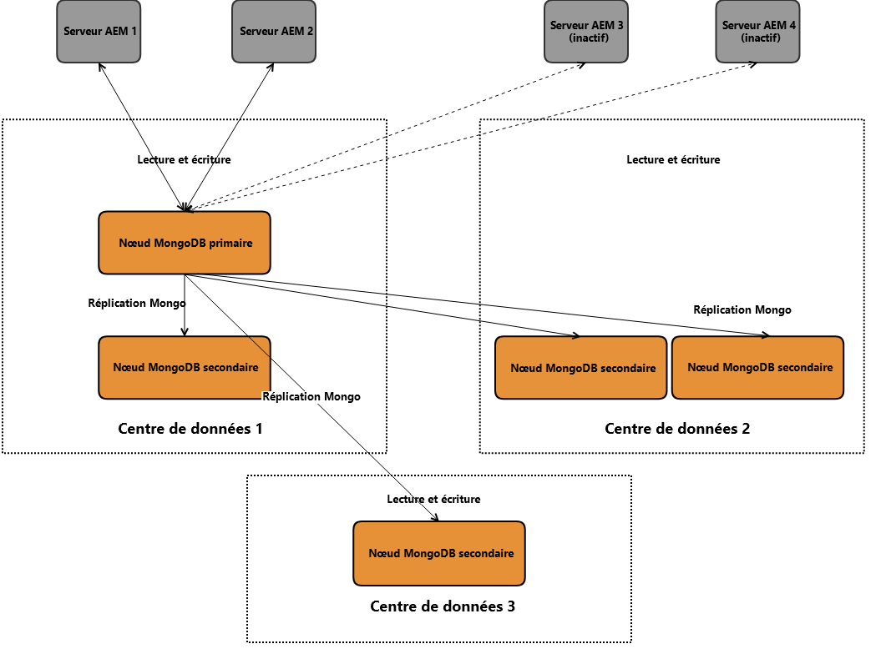
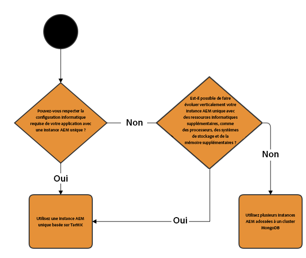
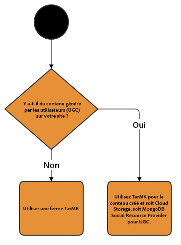

# Déploiements recommandés{#recommended-deployments}

>[!NOTE]
>
>Cette page se rapporte aux topologies recommandées pour AEM. Pour plus d’informations sur les fonctionnalités de mise en cluster et sur leur configuration, reportez-vous[ à la documentation sur les API Apache Sling Discovery](https://sling.apache.org/documentation/bundles/discovery-api-and-impl.html). 

MicroKernels agit en tant que gestionnaires de persistance à partir de AEM 6.2. Le choix de l&#39;un d&#39;eux en fonction de vos besoins dépend de l&#39;objectif de votre instance et du type de déploiement que vous envisagez.

Les exemples ci-dessous ont pour objectif de vous donner une indication des utilisations recommandées pour les configurations d’AEM les plus courantes.

## Scénarios de déploiement {#deployment-scenarios}

### Instance TarMK unique {#single-tarmk-instance}

Dans ce cas, une instance TarMK unique s’exécute sur un serveur unique. 

**Il s’agit du déploiement par défaut des instances d’auteur.**

Les avantages :

* Maintenance simple 
* et facile
* Bonne performance

Les inconvénients :

* N’est pas adaptable au-delà des limites de la capacité du serveur
* Aucune capacité de basculement

### TarMK Cold Standby {#tarmk-cold-standby}

Une instance TarMK agit en tant qu’instance principale. Le référentiel du de l’instance principale est bien reproduit vers un système de basculement de secours.

Le mécanisme Cold Standby peut également être utilisé comme sauvegarde, car le référentiel complet est reproduit constamment vers le serveur de basculement. Le serveur de basculement s’exécute en mode Cold Standby, ce qui signifie que seul le récepteur HTTP de l’instance est en cours d’exécution.

Les avantages :

* Simplicité 
* Maintenabilité
* Performances
* Basculement

Les inconvénients :

* Non adaptable au-delà des limites de la capacité du serveur
* Un serveur est inactif la plupart du temps
* Le basculement n’est pas automatique. Il doit être détecté en externe avant que le système de basculement puisse commencer à traiter les requêtes.

>[!NOTE]
>
>Pour plus d’informations sur la configuration d’AEM avec TarMK Cold Standby, reportez-vous[ à cet](/help/sites-deploying/tarmk-cold-standby.md) article.

>[!NOTE]
>
>Le déploiement du mécanisme Cold Standby dans cet exemple de TarMK exige que les instances principales et de secours disposent de licences distinctes, en raison de la réplication constante vers le serveur de basculement. For more information about licensing, please consult the [Adobe General Licensing Terms](https://www.adobe.com/fr/legal/terms/enterprise-licensing.html).

### La ferme TarMK {#tarmk-farm}

Plusieurs instances Oak s’exécutent chacun avec une instance TarMK. Les référentiels TarMK sont indépendants et doivent être synchronisés.

En plus de la synchronisation des référentiels, le serveur de l’auteur publie le même contenu à chaque membre de la ferme. Pour plus d’informations, voir [Réplication](/help/sites-deploying/replication.md).

Pour AEM Communities, le contenu généré par l’utilisateur (CGU) n’est jamais été répliqué. Pour toutes questions concernant la prise en charge du contenu généré par l’utilisateur dans une ferme TarMK, reportez-vous à la section [Remarques relatives à AEM Communities](#considerations-for-aem-communities).

**Il s’agit du déploiement par défaut pour les environnements de publication.**

Les avantages :

* Performances
* Évolutivité pour l’accès en lecture
* Basculement

### Le cluster Oak avec le basculement MongoMK pour un haut niveau de disponibilité dans un seul data center {#oak-cluster-with-mongomk-failover-for-high-availability-in-a-single-datacenter}

Cette approche implique que plusieurs instances Oak accèdent à un ensemble de réplications MongoDB dans un data center, créant ainsi un cluster actif-actif pour l’environnement de création AEM. Les ensembles de réplications de MongoDB sont utilisés pour fournir un haut niveau de disponibilité et de redondance en cas de panne de matériel ou de réseau.

Les avantages :

* Possibilité de mise à l’échelle horizontale avec de nouvelles instances d’auteur AEM
* Haut niveau de disponibilité et de redondance, et basculement automatisé de la couche de données

Les inconvénients :

* Les performances risquent d’être réduites par rapport à TarMK dans certains scénarios

### Le cluster Oak avec basculement MongoMK via plusieurs data centers {#oak-cluster-with-mongomk-failover-across-multiple-datacenters}

Cette approche implique que plusieurs instances Oak accèdent à un ensemble de réplications MongoDB défini sur plusieurs data centers, créant ainsi un cluster actif-actif pour l’environnement de création AEM. Avec plusieurs data centers, la réplication MongoDB fournit le même niveau élevé de disponibilité et de redondance, mais inclut désormais la capacité de gérer une éventuelle panne de courant du data center.

Les avantages :

* Possibilité de mise à l’échelle horizontale avec de nouvelles instances d’auteur AEM
* Haut niveau de disponibilité et de redondance, et basculement automatisé de la couche de données (y compris les pannes de courant du data center)

>[!NOTE]
>
>In the diagram above, AEM Server 3 and AEM Server 4 are presented with an inactive status assuming a network latency in between the AEM Servers in Data Center 2 and the MongoDB primary node in Data Center 1 that is higher than the requirement documented [here](/help/sites-deploying/aem-with-mongodb.md#checklists). Si la latence maximum est compatible avec les exigences, par exemple en utilisant les zones de disponibilité, les serveurs AEM dans le data center 2 peuvent être actifs également, créant un cluster AEM actif-actif dans plusieurs data centers.

>[!NOTE]
>
>For additional information on the MongoDB architectural concepts described in this section, see [MongoDB Replication](https://docs.mongodb.org/manual/replication/).

## Quel micronoyau utiliser ?{#microkernels-which-one-to-use}

Le principe de base devant être pris en compte lorsque vous choisissez entre les deux micronoyaux disponibles est que TarMK est conçu pour la performance, alors que MongoMK est privilégié pour son évolutivité. 

Vous pouvez utiliser ces matrices décisionnelles afin de déterminer le type de déploiement le plus adapté à vos besoins.

Adobe recommande vivement d’utiliser TarMK en tant que technologie de persistance par défaut dans tous les scénarios de déploiement, aussi bien pour l’auteur que pour les instances de publication AEM, sauf dans les cas d’utilisation décrits ci-dessous.

### Cas d’exceptions pour le choix d’AEM MongoMK plutôt que TarMK sur les instances d’auteur {#exceptions-for-choosing-aem-mongomk-over-tarmk-on-author-instances}

La raison principale pour choisir la persistance MongoMK plutôt que TarMK est sa capacité à faire évoluer les instances horizontalement. Cela permet d’avoir au moins deux instances d’auteur actives s’exécutant à tout moment et d’utiliser MongoDB en tant que système de stockage de persistance. La nécessité d’exécuter plus d’une instance d’auteur découle en général du fait que la capacité du processeur et de la mémoire d’un serveur unique, prenant en charge toutes les activités de création simultanées, n’est plus suffisante.

Il est pratiquement impossible de prévoir quel sera le modèle exact de concurrence après le lancement du nouveau site. Par conséquent, Adobe vous recommande de tenir compte des critères suivants lorsque vous considérez d’utiliser MongoMK et au moins deux nœuds actifs d’auteur :

1. Nombre d’utilisateurs nommés connectés au cours de la journée : des milliers ou plus.
1. Nombre d&#39;utilisateurs simultanés : par centaines ou plus.
1. Volume d’assimilation de ressources par jour : des centaines de milliers, voire plus.
1. Volume de modifications de pages par jour : des centaines de milliers (y compris les mises à jour automatisées via le gestionnaire multi-site ou des assimilations de flux d’actualité, par exemple).
1. Volume de recherches par jour : des dizaines de milliers, voire plus.

>[!NOTE]
>
>Tough Day peut être utilisée pour évaluer la performance de l’application du client dans le cadre de la configuration matérielle déployée. Plus d’informations sur cet outil sont disponibles[ ici](/help/sites-developing/tough-day.md). 

Un déploiement minimal avec MongoDB implique en général la topologie suivante :

* Un ensemble de réplications MongoDB composé d’un nœud principal, de deux nœuds secondaires avec chacune des instances MongoDB s’exécutant dans une zone de disponibilité avec une latence de moins de 15 millisecondes entre chaque nœud ; 
* Un cluster d’instances d’auteur avec un nœud principal, un nœud secondaire, tous les deux actifs à tout moment, chaque instances d’auteur s’exécutant dans chacun des data centers, les instances MongoDB primaires et secondaires étant exécutées.

En outre, il est fortement recommandé de configurer la banque de données sur un système de fichier partagé ou Amazon S3, de sorte que les ressources ou les fichiers binaires ne soient pas stockés dans MongoDB. Cela garantit des performances optimales pendant le déploiement.

Un des autres avantages du déploiement d’un ensemble de réplications MongoDB avec un cluster de deux instances d’auteur ou plus est d’avoir un scénario de restauration automatisé avec un temps d’interruption minimal en cas de panne des instances d’auteur, de la réplication de MongoDB ou du data center. Toutefois, le choix de MongoMK plutôt que de TarMK ne doit pas être uniquement motivé par les conditions de restauration, car TarMK peut également fournir une solution de temps d’interruption minimal avec un mécanisme de basculement contrôlé.

Si vous ne pensez pas rencontrer les conditions ci-dessus lors des dix-huit premiers mois du déploiement, il est recommandé de d’abord déployer AEM à l’aide de TarMK, puis de réévaluer votre configuration ultérieurement lorsque les conditions ci-dessus s’appliquent, pour finalement déterminer si vous devez continuer d’utiliser TarMK ou passer à MongoMK.

### Cas d’exceptions pour le choix d’AEM MongoMK plutôt que TarMK sur les instances de publication {#exceptions-for-choosing-aem-mongomk-over-tarmk-on-publish-instances}

Il n’est pas recommandé de déployer MongoMK pour les instances de publication. Le niveau de publication du déploiement est presque toujours déployé en tant que ferme ou instances de plublication exécutant TarMK, synchronisées en répliquant le contenu des instances d’auteur. Cette architecture de « non partage », adaptée aux instances de publication, permet au déploiement du niveau de publication d’évoluer horizontalement d’une manière linéaire. La topologie de ferme permet également d’appliquer toute mise à jour ou mise à niveau vers des instances de publication au fur et à mesure, de sorte que les modifications au niveau de la publication ne nécessitent pas de temps d’interruption.

Ceci ne s’applique pas à AEM Communities, qui utilise les clusters MongoMK sur le niveau de publication lorsqu’il y a plus d’un éditeur. Si vous choisissez JSRP (voir [Stockage du de contenu de la communauté](/help/communities/working-with-srp.md)), un cluster MongoMK est approprié, comme le serait tout cluster côté publication, quel que soit le MK sélectionné, comme MongoDB ou RDB.

### Conditions préalables et recommandations de déploiement d’AEM avec MongoMK {#prerequisites-and-recommendations-when-deploying-aem-with-mongomk}

Certaines conditions préalables et des recommandations sont disponibles si vous envisagez un déploiement MongoMK pour AEM :

**Conditions préalables obligatoires pour les déploiements MongoDB :**

1. L’architecture et le dimensionnement du déploiement de MongoDB doivent faire partie de l’exécution du projet avec l’aide des architectes d’Adobe Consulting ou de MongoDB, familiarisés avec AEM ;
1. L’expertise de MongoDB doit être représenté au sein de l’équipe partenaire ou du service client en vue d’assurer le maintien d’un environnement MongoDB nouveau ou existant ;
1. Vous pouvez choisir de déployer la version commerciale ou Open Source de MongoDB (AEM prend en charge les deux), mais vous devez souscrire au contrat de maintenance et d’assistance directement auprès de MongoDB Inc ;
1. Les architectures et infrastructures d’ensemble d’AEM et de MongoDB doivent être correctement configurées et validées par un architecte Adobe AEM ; 
1. Vous devez passer en revue le modèle de prise en charge des déploiements AEM qui incluent MongoDB.

**Recommandations strictes pour les déploiements de MongoDB :**

* Consultez l’article sur MongoDB pour [Adobe Experience Manager](https://www.mongodb.com/lp/contact/mongodb-adobe-experience-manager) ;
* Passez en revue la liste de contrôle de production [MongoDB](https://docs.mongodb.org/manual/administration/production-checklist/) ;
* Participez à une formation en ligne sur MongoDB [ici](https://university.mongodb.com/).

>[!NOTE]
>
>Pour toute question supplémentaire concernant les consignes, les conditions préalables et les recommandations, veuillez contacter le [service cientèle d’Adobe](https://helpx.adobe.com/fr/marketing-cloud/contact-support.html).

### Remarques pour AEM Communities {#considerations-for-aem-communities}

Pour les sites qui prévoient de déployer [AEM Communities](/help/communities/overview.md), il est recommandé[ de choisir un déploiement](/help/communities/working-with-srp.md#characteristicsofstorageoptions) optimisé pour gérer le contenu publié par des membres de la communauté de l’environnement de publication.

En utilisant un [entrepôt commun](/help/communities/working-with-srp.md), le contenu généré par l’utilisateur n’a plus besoin d’être répliqué entre les instances d’auteur et de publication pour obtenir une vue cohérente d’ensemble.

Vous trouverez ci-dessous un ensemble de matrices décisionnelles pour vous aider à choisir le meilleur type de persistence pour votre déploiement :

#### Choix du type de déploiement pour les instances d’auteur {#choosing-the-deployment-type-for-author-instances}

#### Choix du type de déploiement pour les instances de publication {#choosing-the-deployment-type-for-publish-instances}

>[!NOTE]
>
>MongoDB est un logiciel tiers qui n’est pas inclus dans le pack de licences AEM. Pour plus d’informations, consultez la page relative à la stratégie de gestion des licences MongoDB ([MongoDB licensing policy](https://www.mongodb.org/about/licensing/)).
>
>Pour tirer pleinement parti de votre déploiement AEM, Adobe conseille d’utiliser la version MongoDB Enterprise sous licence afin de bénéficier d’une assistance professionnelle.
>
>La licence comprend un ensemble de répliques, composé d’une instance principale et de deux instances secondaires qui peuvent être utilisées pour les déploiements de création ou de publication.
>
>Si vous souhaitez créer des déploiements de création et de publication sur MongoDB, vous devez acheter deux licences distinctes.
>
>Pour plus d’informations, consultez la page [MongoDB pour Adobe Experience Manager](https://www.mongodb.com/lp/contact/mongodb-adobe-experience-manager).

