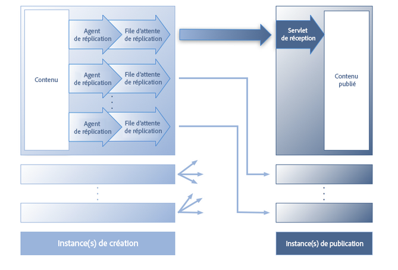
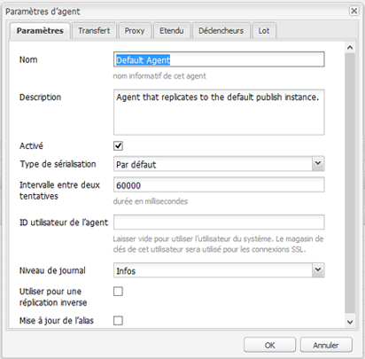
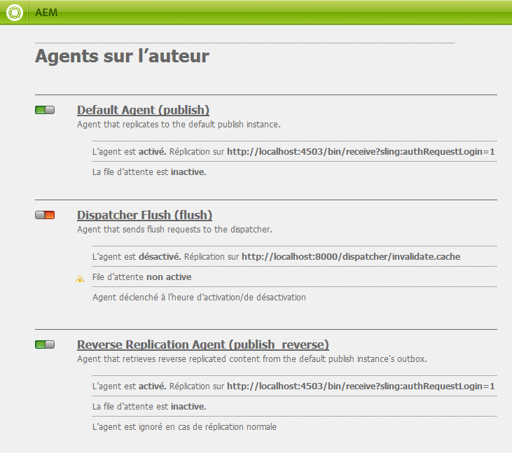
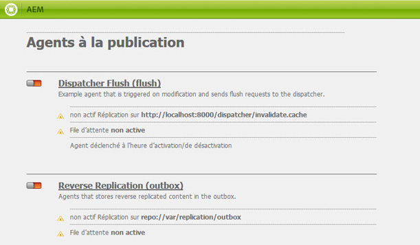
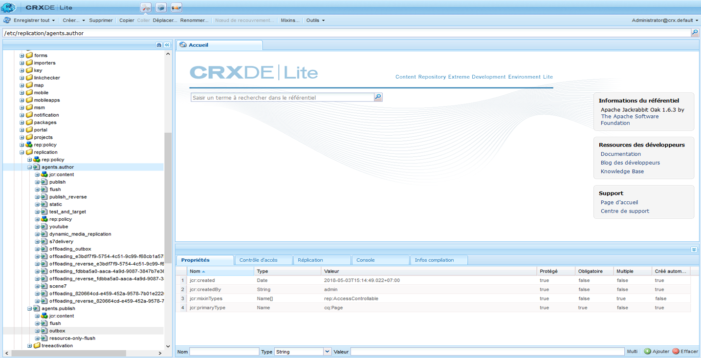
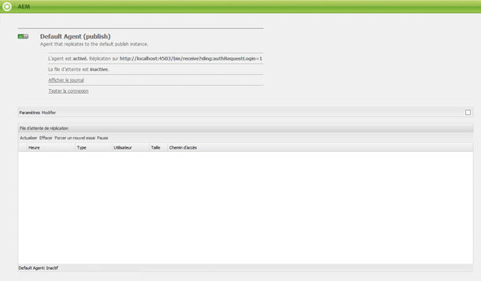
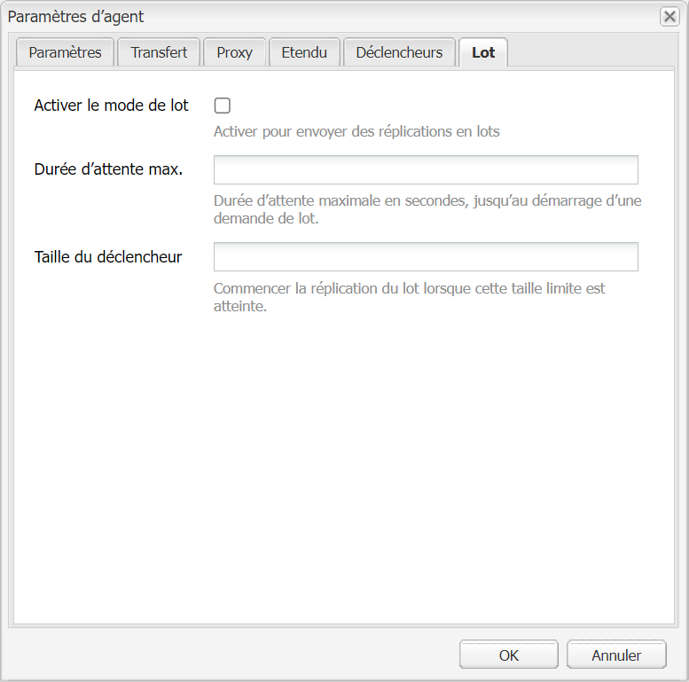

# Réplication{#replication}

Les agents de réplication sont essentiels à Adobe Experience Manager (AEM) en tant que mécanisme utilisé pour :

* [Publier (activer)](/help/sites-authoring/publishing-pages.md#activatingcontent) le contenu d’un auteur sur l’environnement de publication.
* vider explicitement le contenu de la mémoire cache de Dispatcher ;
* Déplacer l’entrée de l’utilisateur (par exemple, entrée de formulaire) de l’environnement de publication à l’environnement de création (sous le contrôle de l’environnement de création).

Les demandes[ sont placées en file d’attente](/help/sites-deploying/osgi-configuration-settings.md#apacheslingjobeventhandler) pour l’agent approprié pour le traitement. 

>[!NOTE]
>
>Les données utilisateur (utilisateurs, groupes d’utilisateurs et profils utilisateurs) ne sont pas répliquées entre les instances d’auteur et de publication.
>
>Pour plusieurs instances de publication, les données utilisateur sont distribués par Sling lorsque[ la synchronisation des utilisateurs](/help/sites-administering/sync.md) est activée.

## Réplication de l’auteur à la publication {#replicating-from-author-to-publish}

La réplication vers une instance de publication ou le dispatcher s’effectue en plusieurs étapes :

* L’auteur demande qu’une partie du contenu soit publiée (activée) ; cela peut être initié par une demande manuelle ou par des déclencheurs automatiques qui ont été préconfigurés.
* La requête est transmise à l’agent de réplication par défaut approprié. Un environnement peut avoir plusieurs agents par défaut qui seront toujours sélectionnés pour de telles actions.
* L’agent de réplication « regroupe » le contenu et le place dans la file d’attente de réplication.
* Dans l’onglet sites web, [l’indicateur d’état coloré](/help/sites-authoring/publishing-pages.md#determiningpagepublicationstatus) est défini pour les pages individuelles.
* Le contenu est déplacé de la file d’attente et est acheminé vers l’environnement de publication à l’aide du protocole configuré ; il s’agit généralement du HTTP. 
* Un servlet dans l’environnement de publication reçoit la demande et publie le contenu reçu ; le servlet par défaut est `https://localhost:4503/bin/receive`.

* Plusieurs environnement de création et de publication peuvent être configurés.

### Réplication de la publication à l’auteur {#replicating-from-publish-to-author}

Certaines fonctions permettent aux utilisateurs de saisir des données sur l’instance de publication.

Dans certains cas, un type de réplication connu sous le nom de réplication inverse est nécessaire pour renvoyer ces données à l’environnement de création où il est redistribué à d’autres environnements de publication. En raison de contraintes de sécurité, tout trafic à partir de la publication vers l’environnement de création doit être strictement contrôlé.

La réplication inverse utilise un agent de l’environnement de publication qui fait référence à l’environnement de création. Cet agent place les données dans la boîte d’envoi. Cette boîte d’envoi est mis en correspondance avec les écouteurs de réplication dans l’environnement de création. Les écouteurs sont connectés aux boîtes d’envoi pour collecter toutes les données saisies pour ensuite les distribuer selon les besoins divers. Cela garantit que l’environnement de création puisse contrôler tout le trafic.

Dans d’autres cas, notamment pour les fonctionnalités de communautés (par exemple, les forums, les blogs, les commentaires et les avis), l’environnement de publication est difficile à synchroniser efficacement à travers les instances AEM utilisant la replicaiton.

AEM [Communities](/help/communities/overview.md) never uses replication for UGC. Au lieu de cela, le déploiement de Communities nécessite un stock commun pour le contenu généré par les utilisateurs (voir [Stockage de contenu des communautés](/help/communities/working-with-srp.md)).

### Réplication prête à l’emploi {#replication-out-of-the-box}

Le site Web de vente au détail Web inclus dans une installation standard d&#39;AEM peut servir à illustrer la réplication.

To follow this example and use the default replication agents you need to [Install AEM](/help/sites-deploying/deploy.md) with:

* l’environnement de création sur le port`4502` 
* l’environnement de publication sur le port`4503` 

>[!NOTE]
>
>Activé par défaut :
>
>* Agents sur l’auteur : agent par défaut (publication)
>
>
désactivé par défaut (depuis AEM 6.1) :
>
>* Agents sur l&#39;auteur : Agent de réplication inverse (publish_reverse)
>* Agents en publication : Réplication inverse (boîte d’envoi)

>
>
Pour vérifier l’état de l’agent ou de la file d’attente, utilisez la console **Outils**.
>Voir [Surveillance de vos agents de réplication ](#monitoring-your-replication-agents).

#### Réplication (de l’auteur à la publication) {#replication-author-to-publish}

1. Accédez à la page d’assistance dans l’environnement de création.
   **https://localhost:4502/content/we-retail/us/en/experience.html** `<pi>`
1. Modifier la page pour ajouter du nouveau texte.
1. **Activez la page** pour publier les modifications.
1. Ouvrez la page d’assistance sur l’environnement de publication :
   **https://localhost:4503/content/we-retail/us/en/experience.html**
1. Vous pouvez maintenant voir les modifications que vous avez saisies sur l’auteur.

Cette réplication est effectuée depuis de l’environnement de création par :

* **L’agent par défaut (publication)** Cet agent reproduit le contenu vers l’instance de publication par défaut.
Les détails de cette opération (configuration et journaux) sont accessibles à partir de la console Outils de l&#39;environnement auteur ; ou :

   `https://localhost:4502/etc/replication/agents.author/publish.html`.

#### Agents de réplication prêts à l’emploi {#replication-agents-out-of-the-box}

Les agents suivants sont disponibles dans une installation AEM standard :

* [Agent par défaut](#replication-author-to-publish) Utilisé pour effectuer une réplication de l’auteur à la publication.

* Le dispatcher Flush Utilisé pour gérer le cache du dispatcher. Voir [Invalidation du cache du dispatcher depuis l’environnement de création](https://helpx.adobe.com/experience-manager/dispatcher/using/page-invalidate.html#invalidating-dispatcher-cache-from-the-authoring-environment) et [Invalidation du cache du dispatcher depuis l’nstance de publication](https://helpx.adobe.com/experience-manager/dispatcher/using/page-invalidate.html#invalidating-dispatcher-cache-from-a-publishing-instance) pour plus d’informations.

* [La réplication inverse](#reverse-replication-publish-to-author) Utilisée pour effectuer une réplication de la publication à l’auteur. La réplication inverse n’est pas utilisée pour les fonctionnalités de communautés, telles que les forums, les blogs et les commentaires. Elle est désactivée, puisque la boîte d’envoi n’est pas activée. L&#39;utilisation de la réplication inverse nécessiterait une configuration personnalisée.

* Agent statiqueAgent qui stocke une représentation statique d&#39;un noeud dans le système de fichiers.
For example with the default settings, content pages and dam assets are stored under `/tmp`, either as HTML or the appropriate asset format. See the `Settings` and `Rules` tabs for the configuration.
Cette demande a été faite pour que lorsque la page est demandée directement depuis le serveur d’application, le contenu devienne visible. Il s’agit d’un agent spécialisé qui ne sera (probablement) pas nécessaire pour la plupart des instances.

## Agents de réplication - Paramètres de configuration {#replication-agents-configuration-parameters}

Lors de la configuration d’un agent de réplication depuis le console Outils, quatre onglets sont disponibles dans la boîte de dialogue :

### Paramètres {#settings}

* **Nom**

   Un nom unique pour l’agent de réplication.

* **Description**

   Une description du rôle de cet agent de réplication.

* **Activé**

   Indique si l’agent de réplication est actuellement activé.

   Lorsque l’agent **est activé**, la file d’attente s’affiche comme suit :

   * **Actif** lorsque des éléments sont en cours de traitement.
   * **Inactif** lorsque la file d’attente est vide.
   * **Bloqué** lorsque les éléments sont dans la file d’attente, mais ne peuvent pas être traités ; par exemple, lorsque la file d’attente de réception est désactivée.

* **Type de sérialisation**

   Le type de sérialisation :

   * **Valeur par défaut** : définie si l’utilisateur doit être sélectionné automatiquement.
   * **Dispatcher Flush** : sélectionnez cette option si l’utilisateur doit être utilisé pour vider le cache du dispatcher. 

* **Intervalle entre deux tentatives**

   Le délai (durée d’attente en millisecondes) entre deux tentatives, si un problème se produit.

   Valeur par défaut: `60000`

* **ID utilisateur de l’agent**

   Selon l’environnement, l’agent utilisera ce compte d’utilisateur pour :

   * collecter et regrouper le contenu à partir de l’environnement d’auteur
   * créer et écrire le contenu dans l’environnement de publication

   Laissez ce champ vide pour utiliser le compte d’utilisateur du système (compte défini dans le sling en tant qu’utilisateur administrateur, `admin` par défaut).

   >[!CAUTION]
   >
   >Pour un agent dans l’environnement de création, ce compte *doit* avoir un accès en lecture à tous les chemins que vous souhaitez dupliquer. 

   >[!CAUTION]
   >
   >Pour un agent sur l’environnement de publication, ce compte *doit* avoir l’accès en création/écriture requis pour dupliquer le contenu.

   >[!NOTE]
   >
   >Cela peut être utilisé comme mécanisme pour sélectionner du contenu spécifique pour la réplication.

* **Niveau de journal**

   Indique le niveau de précision à utiliser pour les messages de journal.

   * `Error`: seules les erreurs seront consignées
   * `Info` : les erreurs, les avertissements et autres messages informatifs y figureront
   * `Debug`: un niveau élevé de détails sera utilisé dans les messages, principalement à des fins de débogage

   Valeur par défaut: `Info`

* **Utiliser pour une réplication inverse**

   Indique si cet agent sera utilisé pour la réplication inverse ; renvoie les entrées des utilisateurs de l’environnement de publication à celui de création.

* **Mise à jour de l’alias**

   La sélection de cette option active les demandes d’invalidation de chemin de l’alias ou vanity au dispatcher. Also, see [Configuring a Dispatcher Flush Agent](/help/sites-deploying/replication.md#configuring-a-dispatcher-flush-agent).

#### Transfert {#transport}

* **URI**

   Cette propriété spécifie le servlet de réception à l’emplacement cible. En particulier, vous pouvez spécifier le nom d’hôte (ou un alias) et le chemin du contexte vers l’instance cible.

   Par exemple :

   * A Default Agent may replicate to `https://localhost:4503/bin/receive`
   * A Dispatcher Flush agent may replicate to `https://localhost:8000/dispatcher/invalidate.cache`

   Le protocole spécifié ici (HTTP ou HTTPS) détermine la méthode de transport. 

   Pour les agents de vidage du répartiteur, la propriété URI n&#39;est utilisée que si vous utilisez des entrées d&#39;hôte virtuel basées sur le chemin pour différencier les fermes, vous utilisez ce champ pour cible la batterie à invalider. Par exemple, la ferme de serveurs n°1 dispose d’un hôte virtuel de `www.mysite.com/path1/*` et la ferme de serveurs n°2 d’un hôte virtuel de `www.mysite.com/path2/*`. Vous pouvez utiliser une URL de `/path1/invalidate.cache` pour cibler la première ferme de serveurs et `/path2/invalidate.cache` pour cibler la seconde ferme de serveurs.

* **User**

   Nom d’utilisateur du compte à utiliser pour accéder à la cible.

* **Mot de passe**

   Mot de passe pour que le compte soit utilisé pour accéder la cible.

* **Domaine NTLM**

   Domain pour l’authentification NTML.

* **Hôte NTLM**

   Hôte pour l’authentification NTML.

* **Activer Relaxed SSL**

   Activez cette option si vous voulez que les certificats SSL certifiés soient automatiquement acceptés.

* **Autoriser les certificats ayant expiré**

   Activez cette option si vous voulez que les certificats SSL obsolètes soient acceptés.

#### Proxy {#proxy}

Les paramètres suivants sont nécessaires uniquement si un proxy est requis :

* **Hôte du proxy**

   Nom d’hôte du proxy utilisé pour le transport.

* **Port du proxy**

   Port du proxy.

* **Utilisateur du proxy**

   Nom d’utilisateur du compte à utiliser.

* **Mot de passe du proxy**

   Mot de passe du compte à utiliser.

* **Domaine NTLM du proxy**

   Le domaine du proxy NTLM.

* **Hôte NTLM du proxy**

   Le domaine du proxy NTLM.

#### Étendu {#extended}

* **Interface**

   Vous pouvez définir ici l’interface de socket à relier.

   Cela définit une adresse locale à utiliser lors de la création de connexions. Si cette fonction n’est pas définie, l’adresse par défaut sera utilisée. Cela est utile pour spécifier l’interface à utiliser sur les systèmes multiples ou en cluster. 

* **Méthode HTTP**

   La méthode HTTP à utiliser.

   Pour un agent de dispatcher Flush, c’est presque toujours GET et ne doit pas être modifié (POST est une autre valeur possible).

* **En-têtes HTTP**

   Elles sont utilisées pour les agents de vidage du dispatcher et spécifient les éléments qui doivent être vidés.

   Pour un agent de vidage du dispatcher, les trois entrées standard n’ont pas besoin d’être modifiées :

   * `CQ-Action:{action}`
   * `CQ-Handle:{path}`
   * `CQ-Path:{path}`

   Elles sont utilisées, si nécessaire, pour indiquer l’action à utiliser lors du vidage du gestionnaire ou du chemin. Les sous-paramètres sont dynamiques :

   * `{action}` indique une action de réplication

   * `{path}` indique un chemin

   Ils sont remplacés par le chemin ou l’action adapté à la demande. Par conséquent, ils n’ont pas besoin d’être codés en dur :

   >[!NOTE]
   >
   >Si vous avez installé AEM dans un contexte autre que le contexte recommandé par défaut, vous devez enregistrer le contexte dans les en-têtes HTTP. Par exemple :
   >`CQ-Handle:/<*yourContext*>{path}`

* **Fermer la connexion**

   Activez cette option pour couper la connexion après chaque demande.

* **Dépassement du délai de connexion**

   Délai d’expiration (en millisecondes) à appliquer lors de l’établissement de la connexion.

* **Dépassement de délai du socket**

   Délai d’expiration (en millisecondes) à appliquer lors de l’attente du trafic après l’établissement d’une connexion.

* **Version du protocole**

   Version du protocole, par exemple, `1.0` pour HTTP/1.0.

#### Déclencheurs {#triggers}

Ces paramètres sont utilisés pour définir les déclencheurs pour la réplication automatisée :

* **Ignorer la valeur par défaut**

   Si cette option est cochée, l’agent est exclu de la réplication normale par défaut ; en d’autres termes, il n’est pas utilisé si un auteur de contenu émet une action de réplication.

* **En cas de modification**

   Une réplication par cet agent sera automatiquement déclenchée lorsqu’une page est modifiée. Cette option est essentiellement utilisée pour les agents de vidage du dispatcher, mais également pour la réplication inverse.

* **En cas de distribution**

   Si cette option est cochée, l’agent permet de répliquer automatiquement tout contenu marqué pour la distribution lorsqu’il est modifié. 

* **Heure d’activation/de désactivation atteinte**

   Cela déclenche la réplication automatique (pour activer ou désactiver une page selon le cas) lorsque les heures d’activation ou de désactivation définies pour une page sont atteintes. Cette option est essentiellement utilisée pour les agents de vidage du dispatcher.

* **À réception**

   Si cette option est cochée, l’agent crée des réplications en chaîne à chaque réception d’événements de réplication.

* **Aucune mise à jour de l’état**

   Si coché, l’agent ne force pas la mise à jour de l’état de réplication.

* **Aucune création de versions différentes**

   Si coché, l’agent ne force pas la création de versions différentes des pages activées.

## Configuration de vos agents de réplication  {#configuring-your-replication-agents}

Pour plus d’informations sur la connexion des agents de réplication à l’instance de publication à l’aide de MSSL, voir [Réplication en utilisant SSL réciproque](/help/sites-deploying/mssl-replication.md)

### Configuration de vos agents de réplication depuis l’environnement de création {#configuring-your-replication-agents-from-the-author-environment}

Depuis l’onglet Outils dans l’environnement de création, vous pouvez configurer les agents de réplication résidant dans l’environnement de création (**agents sur l’auteur**) ou l’environnement de publication (**agents à la publication**). Les procédures suivantes montrent la configuration d’un agent pour l’environnement de création, mais peuvent être utilisées pour les deux.

>[!NOTE]
>
>Lorsqu’un dispatcher traite les demandes HTTP pour les instances d’auteur ou de publication, la requête HTTP de agent de réplication doit inclure l’en-tête PATH. Outre la procédure suivante, vous devez ajouter l’en-tête PATH à la liste de dispatcher d’en-têtes de client. (Voir [/clientheaders (en-têtes client)](https://helpx.adobe.com/experience-manager/dispatcher/using/dispatcher-configuration.html#specifying-the-http-headers-to-pass-through-clientheaders). 

1. Accédez à l’onglet **Outils** dans AEM.
1. Cliquez sur **Réplication** (volet de gauche pour ouvrir le dossier). 
1. Double-cliquez sur **Agents sur l’auteur** (le volet de gauche ou de droite).
1. Cliquez sur le nom de l’agent appropriée (qui est un lien) pour afficher des informations détaillées sur cet agent. 
1. Cliquez sur **Modifier** pour ouvrir la boîte de dialogue de configuration :

   

1. Les valeurs fournies doivent être suffisantes pour une installation par défaut. If you make changes then click **OK** to save them (see [Replication Agents - Configuration Parameters](#replication-agents-configuration-parameters) for more details of the individual parameters).

>[!NOTE]
>
>L’installation AEM standard spécifie `admin` comme utilisateur des informations d’identifications de transfert dans les agents de réplication par défaut.
>
>Vous devez utiliser à la place un compte utilisateur de réplication specifique au site disposant des droits de réplication des chemins nécessaires.

### Configuration de la réplication inverse {#configuring-reverse-replication}

La réplication inverse est utilisée pour renvoyer le contenu généré par les utilisateurs de l’instance de publication vers une instance d’auteur. Cela est généralement utilisé pour des fonctionnalités telles que les enquêtes et les formulaires d’inscription.

Pour des raisons de sécurité, la plupart des topologies de réseau n’autorisent pas les connexions *à partir* d’une « zone démilitarisée » (un sous-réseau qui expose les services externes à un réseau non fiable tel qu’Internet).

Comme l’environnement de publication se trouve généralement dans la zone démilitarisée, pour renvoyer du contenu dans l’environnement de création, la connexion doit être lancée à partir de instance d’auteur. Cette opération s’effectue avec :

* une *boîte d’envoi* dans l’environnement de publication où le contenu est placé.
* un agent (publication) dans l’environnement de création qui interroge régulièrement la boîte d’envoi pour détecter du nouveau contenu.

>[!NOTE]
>
>For AEM [Communities](/help/communities/overview.md), replication is not used for user generated content on a publish instance. See [Community Content Storage](/help/communities/working-with-srp.md).

Pour cela vous aurez besoin des éléments suivants :

**Agent de réplication inverse dans l’environnement** d’auteur. Il s’agit du composant principal permettant de collecter des informations à partir de la boîte d’envoi dans l’environnement de publication :

Si vous souhaitez utiliser la réplication inverse, vérifiez que cet agent est activé.

**Agent de réplication inverse dans l’environnement de publication (une boîte d’envoi)** Il s’agit de l’élément passif puisqu’il agit comme une &quot;boîte d’envoi&quot;. L’entrée de l’utilisateur est placée ici, d’où elle est collectée par l’agent dans l’environnement de création.

### Configuration d’une réplication pour plusieurs instances de publication {#configuring-replication-for-multiple-publish-instances}

>[!NOTE]
>
>Seul le contenu est répliqué- les données utilisateur ne le sont pas (les utilisateurs, les groupes d’utilisateurs et les profils utilisateurs).
>
>To synchronize user data across multiple publish instances, enable [User Synchronization](/help/sites-administering/sync.md).

Durant l’installation, un agent par défaut est déjà configuré pour la réplication du contenu vers une instance de publication s’exécutant sur le port 4503 de l’hôte local.

Pour configurer la réplication du contenu pour un autre instance de publication, vous devez créer, puis configurer un nouvel agent de réplication :

1. Ouvrez l’onglet **Outils** dans AEM.
1. Sélectionnez **Réplication**, puis **Agents sur l’auteur** dans le panneau de gauche.
1. Sélectionnez **Nouveau…**.
1. Précisez le **titre** et le **nom**, puis sélectionnez **Agent de réplication**.
1. Cliquez sur **Créer** pour créer un agent.
1. Double-cliquez sur le nouvel élément de l’agent pour ouvrir le panneau de configuration.
1. Cliquez sur **Modifier**. La boîte de dialogue des **paramètres de l’agent** s’ouvre. Le **type de sérialisation** est déjà défini par défaut, et ne doit pas changer.

   * Dans l’onglet **Paramètres** :

      * Sélectionnez **Activé**.
      * Saisissez une **description**.
      * Définissez l’**intervalle entre deux tentatives** sur `60000`.

      * Leave the **Serialization Type** as `Default`.
   * Dans l’onglet **Transport** :

      * Saisissez l’URI requis pour la nouvelle instance de publication ; par exemple,
         `https://localhost:4504/bin/receive`.

      * Saisissez le compte utilisateur spécifique au site utilisé pour la réplication.
      * Vous pouvez configurer les autres paramètres selon vos besoins.

1. Cliquez sur **OK** pour enregistrer les paramètres.

Vous pouvez ensuite tester l’opération en mettant à jour, puis en publiant une page dans l’environnement de création.

Les mises à jour s’affichent sur toutes les instances de publication qui ont été configurées comme décrit ci-dessus.

Si vous rencontrez des problèmes, vous pouvez vérifier les journaux sur l’instance d’auteur. Depending on the level of detail required you can also set the **Log Level** to `Debug` using the **Agent Settings** dialog as above.

>[!NOTE]
>
>Cela peut être combiné avec l’utilisation de l’[ID d’utilisateur de l’agent](#agentuserid) pour sélectionner un contenu différent pour répliquer les environnements de publication individuels. Pour chaque environnement de publication :
>
>1. Configurez un agent de réplication pour répliquer sur cet environnement de publication.
>1. Configurez un compte d’utilisateur ; avec les droits d’accès requis pour lire le contenu qui sera répliqué sur cet environnement de publication spécifique.
>1. Attribuez le compte d’utilisateur comme **ID d’utilisateur de l’agent** pour l’agent de réplication.

>

### Configuration d’un agent de vidage du dispatcher {#configuring-a-dispatcher-flush-agent}

Les agents par défaut sont inclus dans l’installation. Toutefois, une certaine configuration est nécessaire. Il en va de même si vous définissez un nouvel agent :

1. Ouvrez l’onglet **Outils** dans AEM.
1. Cliquez sur **Déploiement**.
1. Select **Replication** and then **Agents on publish**.
1. Double-cliquez sur **Vidage du dispatcher** pour ouvrir l’aperçu.
1. Cliquez sur **Modifier**. La boîte de dialogue **Paramètres de l’agent** s’ouvre :

   * Dans l’onglet **Paramètres** :

      * Sélectionnez **Activé**.
      * Saisissez une **description**.
      * Leave the **Serialization Type** as `Dispatcher Flush`, or set it as such if creating a new agent.

      * (optional) Select **Alias update** to enable alias or vanity path invalidation requests to Dispatcher.
   * Dans l’onglet **Transport** :

      * Saisissez l’URI requis pour la nouvelle instance de publication ; par exemple,
         `https://localhost:80/dispatcher/invalidate.cache`.

      * Saisissez le compte utilisateur spécifique au site utilisé pour la réplication.
      * Vous pouvez configurer les autres paramètres selon vos besoins.

   Pour les agents de vidage du répartiteur, la propriété URI n&#39;est utilisée que si vous utilisez des entrées d&#39;hôte virtuel basées sur le chemin pour différencier les fermes, vous utilisez ce champ pour cible la batterie à invalider. Par exemple, la ferme de serveurs n°1 dispose d’un hôte virtuel de `www.mysite.com/path1/*` et la ferme de serveurs n°2 d’un hôte virtuel de `www.mysite.com/path2/*`. Vous pouvez utiliser une URL de `/path1/invalidate.cache` pour cibler la première ferme de serveurs et `/path2/invalidate.cache` pour cibler la seconde ferme de serveurs.

   >[!NOTE]
   >
   >Si vous avez installé AEM dans un contexte autre que le contexte recommandé par défaut, vous devez configurer[ les en-têtes HTTP](#extended) dans **l’onglet**&#x200B;Étendu.

1. Pour enregistrer les modifications, cliquez sur **OK.**
1. Retournez à l’onglet **Outils**, d’où vous pouvez **activer** l’agent de **vidage du dispatcher** (**agents sur la publication**).

L’agent de réplication du **vidage du dispatcher** n’est pas actif sur l’auteur. You can access the same page in the publish environment by using the equivalent URI; for example, `https://localhost:4503/etc/replication/agents.publish/flush.html`.

### Contrôle de l’accès aux agents de réplication {#controlling-access-to-replication-agents}

L’accès aux pages utilisées pour configurer les agents de réplication peut être contrôlé à l’aide des droits d’utilisateur et/ou de page de groupe sur le nœud `etc/replication`.

>[!NOTE]
>
>La configuration de ces autorisations n’affecte pas les utilisateurs qui répliquent du contenu (par exemple depuis la console Sites web ou l’option du sidekick). La structure de réplication n’utilise pas la « session utilisateur » ou l’utilisateur actuel pour accéder aux agents de réplication lors de la réplication des pages. 

### Configuration de vos agents de réplication depuis CRXDE Lite {#configuring-your-replication-agents-from-crxde-lite}

>[!NOTE]
>
>La création d&#39;agents de réplication n&#39;est prise en charge que dans l&#39;emplacement du `/etc/replication` référentiel. Cela est nécessaire pour que les listes ACL associées soient correctement gérées. La création d&#39;un agent de réplication à un autre emplacement de l&#39;arborescence peut conduire à un accès non autorisé.

Divers paramètres de vos agents de réplication peuvent être configurés à l’aide CRXDE Lite.

If you navigate to `/etc/replication` you can see the following three nodes:

* `agents.author`
* `agents.publish`
* `treeactivation`

Les deux`agents`   contiennent des informations de configuration concernant l’environnement approprié, et sont actifs uniquement lorsque cet environnement est en cours d’exécution. Par exemple, `agents.publish` sera uniquement utilisé dans l’environnement de publication. La capture d’écran suivante montre l’agent de publication dans l’environnement de création, comme inclus avec la gestion du contenu web d’AEM :

## Surveillance de vos agents de réplication {#monitoring-your-replication-agents}

Pour surveiller un agent de réplication :

1. Accédez à l’onglet **Outils** dans AEM.
1. Cliquez sur **Réplication**.
1. Double-cliquez sur le lien vers les agents pour l’environnement approprié (le volet à gauche ou le volet de droite) ; par exemple **Agents sur l’auteur**.

   La fenêtre affiche une présentation de tous vos agents de réplication pour l’environnement de création, y compris leur cible et leur état.

1. Cliquez sur le nom de l’agent appropriée (qui est un lien) pour afficher des informations détaillées sur cet agent :

   

   Vous pouvez effectuer les opérations suivantes :

   * Vérifier si l’agent est activé.
   * Afficher les cibles des réplications.
   * Vérifier si la file d’attente de réplication est activée.
   * Vérifier s’il existe des éléments dans la file d’attente. 
   * **Actualiser** ou **effacer** pour mettre à jour l’affichage des entrées de file d’attente ; cela vous permet de voir les éléments entrer et sortir de la file d’attente.

   * **Consulter le journal** pour accéder au journal de toutes actions de l’agent de réplication.
   * **Tester la connexion** à l’instance cible.
   * **Forcer un nouvel essai** sur tous les éléments de la file d’attente si nécessaire.

   >[!CAUTION]
   >
   >N’utilisez pas le lien « Tester la connexion » pour la boîte d’envoi de la réplication inverse sur l’instance de publication. 
   >
   >
   >Si un test de réplication est effectué pour une file d’attente de la boîte d’envoi, les éléments qui sont plus anciens que la réplication de test sont retraités avec chaque réplication inverse.

   >Si de tels éléments existent déjà dans la file d’attente, ils peuvent être recherchés avec la requête XPath JCR suivante et doivent être supprimés.
   >
   >
   >`/jcr:root/var/replication/outbox//*[@cq:repActionType='TEST']`

## Réplication par lots {#batch-replication}

La réplication par lot ne reproduit pas les pages ou ressources individuelles, mais attend que le premier seuil des deux, en fonction du temps ou de la taille, soit déclenché.

Il regroupe ensuite tous les éléments de réplication dans un package, qui est ensuite répliqué en un seul fichier à l’éditeur.

L’éditeur décompressera tous les éléments, les enregistrera et en rendra compte à l’auteur.

### Configuration de la réplication par lots {#configuring-batch-replication}

1. Accédez à `http://serveraddress:serverport/siteadmin`
1. Appuyez sur l’icône **[!UICONTROL Outils]** située dans la partie supérieure de l’écran.
1. Dans le rail de navigation de gauche, accédez à **[!UICONTROL Réplication - Agents sur l’auteur]** et doublon cliquez sur Agent **** par défaut.
   * Vous pouvez également atteindre l’agent de réplication de publication par défaut en accédant directement à `http://serveraddress:serverport/etc/replication/agents.author/publish.html`
1. Appuyez sur le bouton **[!UICONTROL Modifier]** au-dessus de la file d&#39;attente de réplication.
1. In the following window, go to the **[!UICONTROL Batch]** tab:
   
1. Configurez l&#39;agent.

### Paramètres {#parameters}

* `[!UICONTROL Enable Batch Mode]` - active ou désactive le mode de réplication par lots
* `[!UICONTROL Max Wait Time]` - Temps d&#39;attente maximal jusqu&#39;au démarrage d&#39;une demande de traitement par lot, en secondes. La valeur par défaut est de 2 secondes.
* `[!UICONTROL Trigger Size]` - Début de la réplication par lots lorsque cette limite de taille

## Ressources supplémentaires {#additional-resources}

Pour plus d’informations sur le dépannage, voir la page sur le [dépannage de réplication](/help/sites-deploying/troubleshoot-rep.md).

Pour plus d’informations, Adobe propose une série d’articles publiés sur la base de connaissances relatifs à la réplication :

[https://helpx.adobe.com/experience-manager/kb/ReplicationSiblingReordering.html](https://helpx.adobe.com/experience-manager/kb/ReplicationSiblingReordering.html)https://helpx.adobe.com/experience-manager/kb/ReplicationFailureAfterNewIP.htmlhttps://helpx.adobe.com/experience-manager/kb/LimitAccessToReplicationAgents.htmlhttps://helpx.adobe.com/experience-manager/kb/PagePermissionsNotReplicatedWithUser.htmlhttps://helpx.adobe.com/experience-manager/kb/HowToUseReverseReplication.htmlCaucailsailsailshttps://helpx.adobe.com/experience-manager/kb/CQ5ReplicateToSpecificAgents.htmlhttps://helpx.adobe.com/experience-manager/kb/ReplicationListener.htmlailsailshttps://helpx.adobe.com/experience-manager/kb/replication-stuck.htmlhttps://helpx.adobe.com/experience-manager/kb/replication-privileges-missing-after-upgrade-to-cq-5-5.htmlailshttps://helpx.adobe.com/experience-manager/kb/CQ53UnableToCreateJobQueueDueToMaxQueues.htmlhttps://helpx.adobe.com/experience-manager/kb/ACLReplication.htmlailshttps://helpx.adobe.com/experience-manager/kb/content-grow-due-reverse-replication.htmlailsailsailsailsailsailsailsailsailsailsailsailsailsailsailsailsailsailsailsailsailsailsailsailsailsailsailsailsailsailsailsailsailsailsailsailsailsailsailsailsailsailsailsailsailsailsailsailsailsailsailsailsailsailsailsailsailsailsailsailsailsailsailsailsailsailsailsailsailsailshttps://helpx.adobe.com/experience-manager/kb/ReplicationAgentUsingAnonUser.htmlhttps://helpx.adobe.com/experience-manager/kb/ReplicationSiblingReordering.htmlailshttps://helpx.adobe.com/experience-manager/kb/ReplicationFailureAfterNewIP.htmlhttps://helpx.adobe.com/experience-manager/kb/LimitAccessToReplicationAgents.htmlailshttps://helpx.adobe.com/experience-manager/kb/PagePermissionsNotReplicatedWithUser.htmlhttps://helpx.adobe.com/experience-manager/kb/HowToUseReverseReplication.htmlhttps://helpx.adobe.com/experience-manager/kb/CQ5ReplicateToSpecificAgents.htmlhttps://helpx.adobe.com/experience-manager/kb/ReplicationListener.htmlhttps://helpx.adobe.com/experience-manager/kb/replication-stuck.htmlhttps://helpx.adobe.com/experience-manager/kb/replication-privileges-missing-after-upgrade-to-cq-5-5.htmlhttps://helpx.adobe.com/experience-manager/kb/CQ53UnableToCreateJobQueueDueToMaxQueues.htmlhttps://helpx.adobe.com/experience-manager/kb/ACLReplication.html Looks