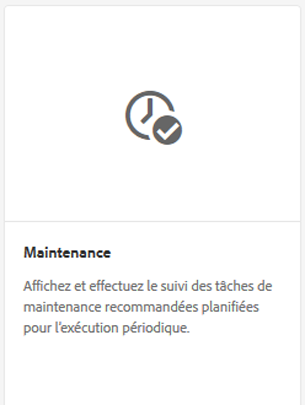
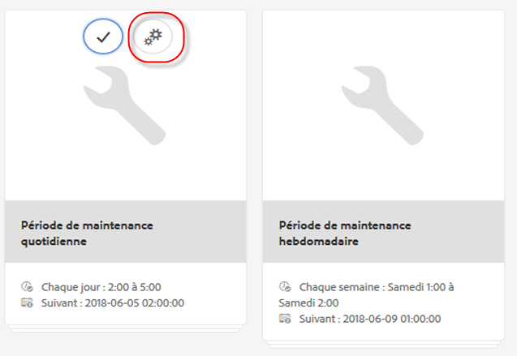
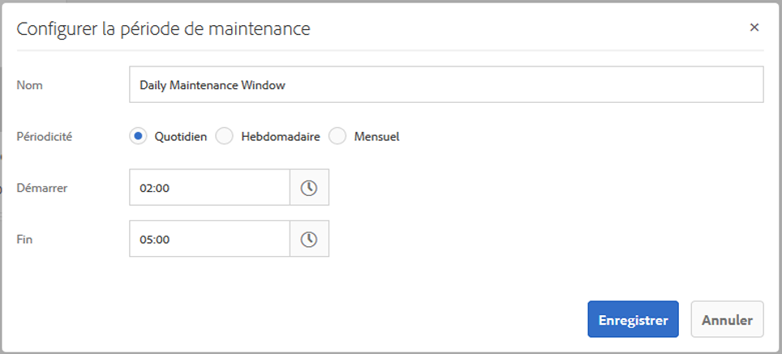
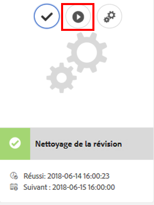
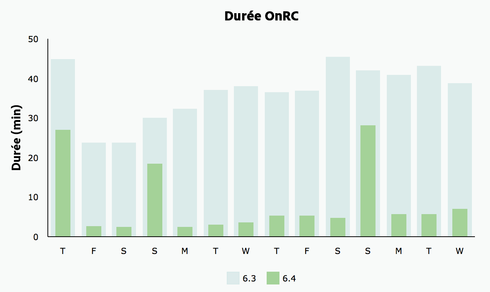
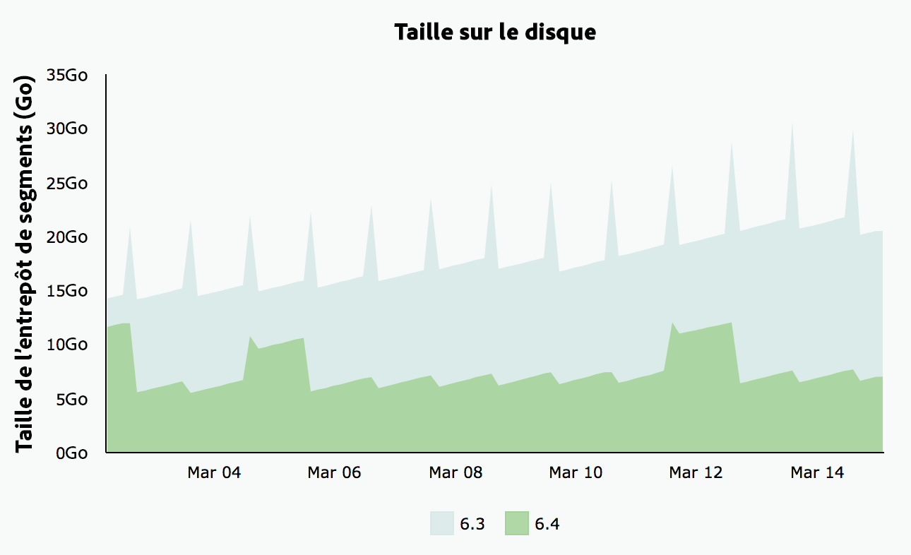

# Nettoyage de révision {#revision-cleanup}

## Présentation {#introduction}

Chaque mise à jour du référentiel crée une révision du contenu. Par conséquent, avec chaque mise à jour, la taille du référentiel augmente. Les anciennes révisions doivent être nettoyées pour libérer des ressources de disque. Ceci est important pour éviter une croissance incontrôlée du référentiel. Cette fonctionnalité de maintenance est appelée Nettoyage des révisions. Elle est disponible en tant que routine hors ligne depuis AEM 6.0.

Une version en ligne de cette fonctionnalité, appelée Nettoyage des révisions en ligne, a été introduite dans AEM 6.3 et les versions ultérieures. Par rapport au nettoyage des révisions hors ligne où l’instance AEM doit être arrêtée, le nettoyage des révisions en ligne peut être exécuté pendant que l’instance AEM est en ligne. Le nettoyage des révisions en ligne est activé par défaut. Il s’agit de la méthode recommandée pour effectuer un nettoyage des révisions.

**Remarque** : [Regardez la vidéo](https://helpx.adobe.com/experience-manager/kt/platform-repository/using/revision-cleanup-technical-video-use.html) pour découvrir comment utiliser le nettoyage des révisions en ligne.

Le processus de nettoyage des révisions se compose de trois phases : **estimation**, **compression** et **nettoyage**. L’estimation détermine si la phase suivante (compression) doit être exécutée ou non en fonction de la quantité d’espace mémoire pouvant être récupérée. Lors de la phase de compression, les segments et les fichiers tar sont réécrits sans aucun contenu inutilisé. La phase de nettoyage supprime par la suite les anciens segments, y compris l’espace mémoire qu’ils peuvent contenir. Le mode hors ligne peut généralement libérer de l’espace, car le mode en ligne doit tenir compte de la plage de travail d’AEM, qui empêche la collecte de segments supplémentaires.

Pour plus d’informations sur le nettoyage des révisions, cliquez sur les liens suivants :

* [Comment exécuter le nettoyage des révisions en ligne ?](/help/sites-deploying/revision-cleanup.md#how-to-run-online-revision-cleanup)
* [Foire aux questions sur le nettoyage des révisions en ligne](/help/sites-deploying/revision-cleanup.md#online-revision-cleanup-frequently-asked-questions)
* [Exécution du nettoyage des révisions hors ligne](/help/sites-deploying/revision-cleanup.md#how-to-run-offline-revision-cleanup)

Vous pouvez aussi consulter la [documentation Oak officielle.](https://jackrabbit.apache.org/oak/docs/nodestore/segment/overview.html)

### Quand utiliser le nettoyage des révisions en ligne plutôt que le nettoyage des révisions hors ligne ? {#when-to-use-online-revision-cleanup-as-opposed-to-offline-revision-cleanup}

**Le nettoyage des révisions en ligne est la méthode recommandée pour effectuer un nettoyage des révisions.** L’utilisation du nettoyage des révisions hors ligne doit être limitée à des cas exceptionnels, par exemple, avant d’effectuer une migration vers un nouveau format de stockage ou si le service clientèle d’Adobe vous demande de le faire.

## Comment exécuter le nettoyage des révisions en ligne {#how-to-run-online-revision-cleanup}

Le nettoyage des révisions en ligne est configuré par défaut pour s’exécuter automatiquement une fois par jour sur les instances de création et de publication AEM. Il vous suffit de définir la fenêtre de maintenance pendant une période où l’activité des utilisateurs et utilisatrices est la moins importante. Vous pouvez configurer la tâche de nettoyage des révisions en ligne comme suit :

1. Dans la fenêtre principale, accédez à **Outils - Opérations - Tableau de bord - Maintenance** ou sur : `https://serveraddress:serverport/libs/granite/operations/content/maintenance.html`

   

1. Déplacez le curseur au-dessus **de la fenêtre de maintenance quotidienne,** puis cliquez sur l’icône **Paramètres**.

   

1. Saisissez les valeurs souhaitées (répétition, heure de début, heure de fin) et cliquez sur **Enregistrer**.

   

Autrement, si vous désirez effectuer le nettoyage manuellement, procédez comme ceci :

1. Accédez à **Outils - Opérations - Tableau de bord- Maintenance** ou directement sur `https://serveraddress:serverport/libs/granite/operations/content/maintenance.html`.
1. Cliquez sur **la fenêtre de maintenance quotidienne**.
1. Déplacez le curseur au-dessus de l’icône **Nettoyage des révisions**.
1. Cliquez sur **Exécuter**.

   

### Exécuter le nettoyage des révisions en ligne après le nettoyage des révisions hors ligne {#running-online-revision-cleanup-after-offline-revision-cleanup}

Le processus de nettoyage des révisions récupère les anciennes révisions par génération. Cela signifie que chaque fois que vous exécutez le nettoyage des révisions, une nouvelle génération est créée et conservée sur le disque. Il existe cependant une différence entre les deux types de nettoyage des révisions : le processus hors ligne conserve une seule génération, alors que le processus en ligne en conserve deux. Voici donc ce qui se passe lorsque vous exécutez le nettoyage des révisions en ligne **après** le nettoyage hors ligne :

1. Après la première exécution du nettoyage des révisions en ligne, la taille du référentiel va doubler. Cela est dû au fait que deux générations sont à présent conservées sur le disque.
1. Au cours des exécutions ultérieures, la taille du référentiel augmentera temporairement pendant la création de la génération, puis reviendra à la taille qui était la sienne après la première exécution, étant donné que le processus de nettoyage des révisions en ligne récupère la génération précédente.

En outre, gardez à l’esprit que, selon le type et le nombre de validations, chaque génération peut avoir une taille différente de la précédente, de sorte que la taille finale peut varier d’une exécution à l’autre.

Il est donc recommandé d’opter pour une taille de disque au moins deux à trois fois supérieure à celle estimée initialement pour le référentiel.

## Modes de compression complète et partielle  {#full-and-tail-compaction-modes}

**AEM 6.5** s’accompagne de **deux nouveaux modes** pour la phase de **compression** du processus de nettoyage des révisions en ligne :

* Le mode **Compression complète** réécrit tous les segments et fichiers tar dans l’ensemble du référentiel. La phase de nettoyage suivante peut donc libérer la quantité maximale d’espace mémoire dans le référentiel. Étant donné que la compression complète affecte l’ensemble du référentiel, une quantité considérable de ressources système et un temps considérable sont nécessaires pour son exécution. La compression complète correspond à la phase de compression dans AEM 6.3.
* Le mode **Compression des révisions les plus récentes** ne réécrit que les segments et fichiers tar les plus récents dans le référentiel. Les segments et les fichiers tar les plus récents sont ceux qui ont été ajoutés depuis la dernière exécution de compression complète ou partielle. La phase de nettoyage suivante ne peut donc que libérer l’espace mémoire dans la partie récente du référentiel. Étant donné que ce mode de compression ne concerne qu’une partie du référentiel, il consomme beaucoup moins de ressources système qu’une compression complète et s’avère bien plus rapide.

Ces modes de compression constituent un compromis entre efficacité et consommation des ressources : bien que la compression partielle soit moins efficace, elle a également moins d’impact sur le fonctionnement normal du système. En revanche, la compression complète est plus efficace, mais a davantage de répercussions sur les opérations normales du système.

AEM 6.5 s’enrichit également d’un mécanisme de déduplication du contenu plus efficace au cours de la compression, ce qui a pour effet de réduire l’empreinte du référentiel sur le disque.

Les deux graphiques ci-dessous présentent les résultats des tests réalisés en laboratoire interne. Ils illustrent la réduction des délais d’exécution moyens et de l’empreinte moyenne sur le disque dans AEM 6.5 par rapport à AEM 6.3 :

 

### Configuration de la compression complète et partielle {#how-to-configure-full-and-tail-compaction}

La configuration par défaut exécute la compression partielle les jours de la semaine et la compression complète le dimanche. Vous pouvez modifier cette configuration par défaut en utilisant la nouvelle valeur de configuration `full.gc.days` de la [tâche de maintenance](/help/sites-deploying/revision-cleanup.md#how-to-run-online-revision-cleanup) `RevisionCleanupTask`.

Lorsque vous configurez la valeur `full.gc.days`, gardez à l’esprit que la compression complète sera exécutée le(s) jour(s) défini(s) dans la valeur, l’autre mode de compression étant exécuté les jours non définis. Par exemple, si vous configurez la compression complète pour qu’elle s’exécute le dimanche, la compression partielle s’exécutera du lundi au samedi. Si, par exemple, vous configurez la compression complète pour qu’elle s’exécute tous les jours de la semaine, la compression partielle ne s’exécute pas du tout.

En outre, prenez les éléments suivants en considération :

* La **compression des révisions les plus récentes** est moins efficace et a un impact moindre sur les opérations normales du système. Elle est donc destinée à être exécutée pendant les jours ouvrables.
* La **compression complète** est plus efficace, mais a davantage de répercussions sur les opérations normales du système. Elle est donc destinée à être exécutée pendant les jours ouvrables.
* La compression complète et la compression partielle doivent être planifiées pour fonctionner pendant les heures creuses.

### Résolution des problèmes {#troubleshooting}

Lors de l’utilisation des nouveaux modes de compression, gardez à l’esprit les points suivants :

* Vous pouvez surveiller l’activité d’entrée/sortie (E/S), par exemple : opérations d’E/S, processeur en attente d’E/S, taille de la file d’attente de validation. Cela permet de déterminer si le système devient lié aux E/S et nécessite une mise à niveau.
* La tâche `RevisionCleanupTaskHealthCheck` indique le statut d’intégrité global du nettoyage des révisions en ligne. Le fonctionnement est le même que dans AEM 6.3 et ne fait pas la distinction entre compression complète et partielle.
* Les messages du journal contiennent des informations pertinentes sur les modes de compression. Par exemple, lorsque le nettoyage des révisions en ligne démarre, les messages de journal correspondants indiquent le mode de compression. De plus, dans certains cas, le système rétablira la compression complète lorsqu’une compression partielle était prévue, et les messages du journal indiqueront cette modification. Les exemples de journaux ci-dessous indiquent le mode de compression et comment passer de la compression complète à la compression partielle :

```
TarMK GC: running tail compaction
TarMK GC: no base state available, running full compaction instead
```

### Limites connues {#known-limitations}

Dans certains cas, l’alternance entre le modes de compression complète et partielle retarde le processus de nettoyage. Plus précisément, le référentiel s’accroît après une compression complète (sa taille double). L’espace supplémentaire sera récupéré lors de la compression partielle suivante, lorsque le référentiel sera inférieur à la taille de compression pré-complète. Les exécutions de tâches de maintenance parallèles doivent également être évitées.

**Il est recommandé d’opter pour une taille de disque au moins deux à trois fois supérieure à celle estimée initialement pour le référentiel.**

## Foire aux questions sur le nettoyage des révisions en ligne {#online-revision-cleanup-frequently-asked-questions}

### Remarques concernant la mise à niveau AEM 6.5 {#aem-upgrade-considerations}

<table style="table-layout:auto">
 <tbody>
  <tr>
   <td>Questions </td>
   <td>Réponses</td>
  </tr>
  <tr>
   <td>De quoi dois-je tenir compte lorsque j’effectue une mise à niveau vers AEM 6.5 ?</td>
   <td><p>Le format de persistance de TarMK change avec AEM 6.5. Ces modifications ne nécessitent aucune étape de migration proactive. Les référentiels existants font l’objet d’une migration progressive, un processus totalement transparent. Le processus de migration est lancé la première fois qu’AEM 6.5 (ou les outils associés) accède(nt) au référentiel.</p> <p><strong>Une fois que la migration vers le format de persistance AEM 6.5 a été lancée, le référentiel ne peut plus revenir au format de persistance AEM 6.3 précédent.</strong></p> </td>
  </tr>
 </tbody>
</table>

### Migration vers Oak Segment Tar {#migrating-to-oak-segment-tar}

<table style="table-layout:auto">
 <tbody>
  <tr>
   <td><strong>Questions</strong></td>
   <td><strong>Réponses</strong></td>
   <td> </td>
  </tr>
  <tr>
   <td><strong>Pourquoi dois-je faire migrer le référentiel ?</strong></td>
   <td><p>Dans AEM 6.3, des modifications au niveau du format de stockage étaient nécessaires, notamment pour améliorer les performances et l’efficacité du nettoyage des révisions en ligne. Ces modifications ne sont pas rétrocompatibles et les référentiels créés avec l’ancien segment Oak (AEM 6.2 et versions antérieures) doivent être migrés.</p> <p>Autres avantages liés à la modification du format de stockage :</p>
    <ul>
     <li>Amélioration de l’évolutivité (taille du segment optimisée).</li>
     <li><a href="/help/sites-administering/data-store-garbage-collection.md" target="_blank">Récupération de l’espace mémoire du magasin de données</a> plus rapide.<br /> </li>
     <li>Travail de base pour les améliorations futures.</li>
    </ul> </td>
   <td> </td>
  </tr>
  <tr>
   <td><strong>Le format Tar précédent est-il toujours pris en charge ?</strong></td>
   <td>Seul le nouveau Oak Segment Tar est pris en charge dans AEM 6.3 ou les versions ultérieures.</td>
   <td> </td>
  </tr>
  <tr>
   <td><strong>La migration du contenu est-elle toujours obligatoire ?</strong></td>
   <td>Oui. À moins de commencer avec une nouvelle instance, vous devrez toujours migrer le contenu.</td>
   <td> </td>
  </tr>
  <tr>
   <td><strong>Puis-je effectuer la mise à niveau vers 6.3 ou une version ultérieure et effectuer la migration plus tard (par exemple, en utilisant une autre fenêtre de maintenance) ?</strong></td>
   <td>Non, comme nous l’avons expliqué ci-dessus, la migration du contenu est obligatoire.</td>
   <td> </td>
  </tr>
  <tr>
   <td><strong>Les temps d’interruption peuvent-ils être évités durant la migration ?</strong></td>
   <td>Non. Il s’agit d’une opération unique qui ne peut pas être effectuée sur une instance en cours d’exécution.</td>
   <td> </td>
  </tr>
  <tr>
   <td><strong>Que se passe-t-il si j’exécute accidentellement le mauvais format de référentiel ?</strong></td>
   <td>Si vous essayez d’exécuter le module oak-segment sur un référentiel oak-segment-tar (ou inversement), le démarrage échoue avec une <em>IllegalStateException</em>, avec le message « Format de segment invalide ». Il n’y aura aucune corruption de données.</td>
   <td> </td>
  </tr>
  <tr>
   <td><strong>Une réindexation des index de recherche est-elle nécessaire ?</strong></td>
   <td>Non. La migration de oak-segment vers oak-segment-tar introduit des modifications dans le format du conteneur. Les données contenues ne sont pas affectées et ne sont pas modifiées.</td>
   <td> </td>
  </tr>
  <tr>
   <td><strong>Comment calculer au mieux l’espace disque attendu pendant et après la migration ?</strong></td>
   <td>La migration équivaut à recréer le magasin de segments dans le nouveau format. Vous pouvez l’utiliser pour estimer l’espace disque supplémentaire nécessaire lors de la migration. Après la migration, l’ancien magasin de segments peut être supprimé pour libérer de l’espace.</td>
   <td> </td>
  </tr>
  <tr>
   <td><strong>Comment estimer au mieux la durée de la migration ?</strong></td>
   <td>Les performances de la migration peuvent être sensiblement améliorées si un <a href="/help/sites-deploying/revision-cleanup.md#how-to-run-offline-revision-cleanup">nettoyage des révisions hors ligne</a> est exécuté en amont. Nous conseillons à tous les clients de l’exécuter en tant que conditions préalables à la mise à niveau. En règle générale, la durée de la migration doit être similaire à celle de la tâche de nettoyage des révisions hors ligne, en supposant que cette dernière ait été effectuée avant la migration.</td>
   <td> </td>
  </tr>
 </tbody>
</table>

### Exécution du nettoyage des révisions en ligne {#running-online-revision-cleanup}

<table style="table-layout:auto">
 <tbody>
  <tr>
   <td><strong>Questions</strong></td>
   <td><strong>Réponses</strong></td>
   <td> </td>
  </tr>
  <tr>
   <td><strong>À quelle fréquence le nettoyage des révisions en ligne doit-il être exécuté ?</strong></td>
   <td>Une fois par jour. Il s’agit de la configuration par défaut dans le tableau de bord des opérations.</td>
   <td> </td>
  </tr>
  <tr>
   <td><strong>Comment puis-je configurer l’heure de début de la tâche de maintenance du nettoyage des révisions en ligne ?</strong></td>
   <td>Consultez la section <a href="/help/sites-deploying/revision-cleanup.md#how-to-run-online-revision-cleanup">Exécution du nettoyage des révisions en ligne</a>. </td>
   <td> </td>
  </tr>
  <tr>
   <td><strong>Existe-t-il une fréquence maximale ne devant pas être dépassée pour le nettoyage des révisions en ligne ?</strong></td>
   <td>Il est recommandé d’exécuter le nettoyage des révisions en ligne une fois par jour, tel que configuré par défaut.<br /> </td>
   <td> </td>
  </tr>
  <tr>
   <td><strong>Quels sont les indicateurs clés permettant de déterminer à quelle fréquence le nettoyage des révisions en ligne doit être effectué ?</strong></td>
   <td>Il n’est pas nécessaire de déterminer la fréquence, étant donné que le nettoyage des révisions en ligne est configuré en tant que tâche de maintenance et s’exécute automatiquement de façon quotidienne.</td>
   <td> </td>
  </tr>
  <tr>
   <td><strong>Pourquoi le nettoyage des révisions en ligne ne récupère-t-il pas de l’espace lorsqu’il est exécuté pour la première fois ?</strong></td>
   <td>Le nettoyage des révisions en ligne récupère les anciennes révisions par génération. Une nouvelle génération est générée chaque fois que le nettoyage des révisions s’exécute. Seul le contenu vieux d’au moins deux générations sera récupéré, ce qui signifie qu’il n’y a rien à récupérer lors d’une première exécution.</td>
   <td> </td>
  </tr>
  <tr>
   <td><strong>Pourquoi le premier nettoyage des révisions en ligne ne permet-il pas de récupérer de l’espace lorsqu’il est exécuté après le nettoyage des révisions hors ligne ?</strong></td>
   <td><p>Le nettoyage des révisions hors ligne récupère tout sauf la dernière génération par rapport aux deux dernières générations de nettoyage des révisions en ligne. Dans le cas d’un nouveau référentiel, le nettoyage des révisions en ligne ne récupère aucun espace lorsqu’il est exécuté pour la première fois après le nettoyage des révisions hors ligne, car aucune génération n’est suffisamment ancienne pour être récupérée.</p> <p>Lisez également la section « Exécution du nettoyage des révisions en ligne après le nettoyage des révisions hors ligne » de <a href="/help/sites-deploying/revision-cleanup.md#how-to-run-online-revision-cleanup">ce chapitre</a>.</p> </td>
   <td> </td>
  </tr>
  <tr>
   <td><strong>L’auteur et la publication ont-ils des fenêtres de nettoyage des révisions en ligne différentes ?</strong></td>
   <td>Cela dépend des heures de travail et des modèles de trafic de la présence en ligne du client. Les fenêtres de maintenance doivent être configurées en dehors des heures d’exploitation majeures pour garantir un nettoyage efficace. S’il existe plusieurs instances de publication AEM (ferme TarMK), les fenêtres de maintenance pour le nettoyage des révisions en ligne doivent être fragmentées.</td>
   <td> </td>
  </tr>
  <tr>
   <td><strong>Existe-t-il des conditions préalables pour exécuter le nettoyage des révisions en ligne ?</strong></td>
   <td><p>Le nettoyage des révisions en ligne est disponible uniquement avec AEM 6.3 et les versions ultérieures. Aussi, si vous utilisez une ancienne version d’AEM, vous devrez effectuer une migration vers le nouvel <a href="/help/sites-deploying/revision-cleanup.md#migrating-to-oak-segment-tar">Oak Segment Tar</a>.</p> </td>
   <td> </td>
  </tr>
  <tr>
   <td><strong>Quels sont les facteurs qui déterminent la durée du nettoyage des révisions en ligne ?</strong></td>
   <td>Les facteurs sont les suivants :<br />
    <ul>
     <li>Taille du référentiel</li>
     <li>Chargement sur le système (requêtes par minute, en particulier opérations d’écriture)</li>
     <li>Modèle d’activité (lectures et écritures)</li>
     <li>Spécifications matérielles (performances du processeur, mémoire, IOPS)</li>
    </ul> </td>
   <td> </td>
  </tr>
  <tr>
   <td><strong>Les auteurs peuvent-ils travailler pendant l’exécution du nettoyage des révisions en ligne ?</strong></td>
   <td>Oui, le nettoyage des révisions en ligne peut gérer les écritures simultanées. Cependant, le nettoyage des révisions en ligne fonctionne plus rapidement et plus efficacement sans transactions d’écriture simultanées. Il est recommandé de planifier la tâche de maintenance du nettoyage des révisions en ligne à un moment relativement calme sans beaucoup de trafic.</td>
   <td> </td>
  </tr>
  <tr>
   <td><strong>Quelles sont les conditions minimales requises en matière d’espace disque et de mémoire de tas lors de l’exécution du nettoyage des révisions en ligne ?</strong></td>
   <td><p>L’espace disque est surveillé en permanence lors du nettoyage des révisions en ligne. Si l’espace disque disponible tombe en dessous d’une valeur critique, le processus sera annulé. La valeur critique est de 25 % de l’empreinte disque actuelle du référentiel et elle n’est pas configurable.</p> <p><strong>Il est recommandé d’opter pour une taille de disque au moins deux à trois fois supérieure à celle estimée initialement pour le référentiel.</strong></p> <p>L’espace libre du tas est surveillé en permanence pendant le processus de nettoyage. Si l’espace libre du tas tombe sous une valeur critique, le processus est annulé. La valeur critique est configurée via org.apache.jackrabbit.oak.segment.SegmentNodeStoreService#MEMORY_THRESHOLD. La valeur par défaut est 15%.</p> <p>Les recommandations pour le dimensionnement minimal du tas de compression ne sont pas séparées des recommandations de dimensionnement de la mémoire d’AEM. En règle générale : <strong>si une instance AEM est suffisamment bien dimensionnée pour gérer les cas d’utilisation et la charge utile attendue, le processus de nettoyage obtiendra suffisamment de mémoire.</strong></p> </td>
   <td> </td>
  </tr>
  <tr>
   <td><strong>Quel est l’impact attendu sur les performances pendant l’exécution du nettoyage des révisions en ligne ?</strong></td>
   <td>Le nettoyage des révisions en ligne est un processus en arrière-plan qui lit et écrit dans le référentiel en même temps que les opérations système normales. En particulier, il peut être nécessaire d’acquérir un accès exclusif au référentiel pendant une courte période, ce qui empêche d’autres threads d’écrire dans le référentiel.</td>
   <td> </td>
  </tr>
  <tr>
   <td><strong>Quelle est la durée estimée d’exécution du nettoyage des révisions en ligne ?</strong></td>
   <td>Cela ne devrait pas prendre plus de 2 heures d’après les derniers tests de performance que nous avons réalisés en interne.</td>
   <td> </td>
  </tr>
  <tr>
   <td><strong>Que faire si le nettoyage des révisions en ligne dure plus longtemps ?</strong></td>
   <td>
    <ul>
     <li>Assurez-vous qu’il est exécuté tous les jours.<br /> </li>
     <li>Assurez-vous qu’il est exécuté lorsque les activités du référentiel sont minimales en configurant les fenêtres de maintenance dans le tableau de bord des opérations de manière adéquate.</li>
     <li>Faites évoluer les ressources du système (processeur, mémoire, E/S).</li>
    </ul> </td>
   <td> </td>
  </tr>
  <tr>
   <td><strong>Que se passe-t-il si le nettoyage des révisions en ligne dépasse la fenêtre de maintenance configurée ?</strong></td>
   <td>Assurez-vous que d’autres tâches de maintenance ne retardent pas son exécution. Cela peut être le cas si plus de tâches de maintenance que de nettoyage des révisions en ligne sont exécutées dans la même fenêtre de maintenance. Notez que les tâches de maintenance sont exécutées de manière séquentielle sans ordre configurable.</td>
   <td> </td>
  </tr>
  <tr>
   <td><strong>Pourquoi le nettoyage de la mémoire est-il ignoré ?</strong></td>
   <td><p>Le nettoyage des révisions repose sur une phase d’estimation pour décider s’il y a suffisamment d’espace mémoire à libérer. L’estimateur compare la taille actuelle à la taille du référentiel après sa dernière compression. Si la taille dépasse le delta configuré, le nettoyage s’exécute. La taille du delta est définie sur 1 Go. Cela signifie que si la taille du référentiel n’a pas augmenté de 1 Go depuis le dernier nettoyage, la nouvelle itération du nettoyage des révisions sera ignorée. </p> <p>Vous trouverez, ci-dessous, des entrées de journaux pertinentes pour la phase d’estimation :</p>
    <ul>
     <li>Revision GC will run: <em>Size delta is N% or N/N (N/N bytes), so running compaction</em></li>
     <li>Revision GC will <strong>not</strong> run: <em>Size delta is N% or N/N (N/N bytes), so skipping compaction for now</em></li>
    </ul> </td>
   <td> </td>
  </tr>
  <tr>
   <td><strong>Est-il possible d’annuler en toute sécurité la compression automatique si l’impact sur les performances est trop élevé ?</strong></td>
   <td>Oui. Depuis AEM 6.3, il est possible de l’arrêter en toute sécurité via la fenêtre des tâches de maintenance du tableau de bord des opérations ou via JMX.</td>
   <td> </td>
  </tr>
  <tr>
   <td><strong>Si l’instance AEM est arrêtée pendant une tâche de nettoyage programmée, le processus s’arrête-t-il de manière sécurisée ou l’arrêt est-il bloqué jusqu’à la réalisation complète de la compression ?</strong></td>
   <td>Le nettoyage des révisions est interrompu et le référentiel va s’arrêter en toute sécurité.</td>
   <td> </td>
  </tr>
  <tr>
   <td><strong>Que se passe-t-il si le système tombe en panne pendant le nettoyage des révisions en ligne ?</strong></td>
   <td>Dans de tels cas, il n’existe aucun risque de corruption des données. L’espace mémoire restant sera libéré lors d’une exécution ultérieure.</td>
   <td> </td>
  </tr>
  <tr>
   <td><strong>Qu’arrive-t-il lorsque vous n’effectuez pas le nettoyage des révisions en ligne ?</strong></td>
   <td>Le niveau de performances se dégrade au fil du temps.</td>
   <td> </td>
  </tr>
  <tr>
   <td><strong>Quelles révisions sont collectées ?</strong></td>
   <td>Par défaut, le nettoyage des révisions en ligne collecte uniquement les révisions datant d’au moins 24 heures.</td>
   <td> </td>
  </tr>
  <tr>
   <td><strong>Qu’arrive-t-il s’il y a beaucoup trop d’interférences des écritures simultanées avec le référentiel ?</strong></td>
   <td><p>S’il y a des écritures simultanées sur le système, le nettoyage des révisions en ligne peut nécessiter un accès exclusif à l’écriture pour pouvoir effectuer les changements à la fin d’un cycle de compression. Le système passera en <strong>mode forceCompact</strong>, comme expliqué de manière détaillée dans la <a href="https://jackrabbit.apache.org/oak/docs/nodestore/segment/overview.html" target="_blank">Documentation oak</a>. Lors de la compression forcée, un verrou d’écriture exclusif est acquis afin de valider enfin les modifications sans interférence d’écriture simultanée. Pour limiter l’impact sur les temps de réponse, une valeur de délai d’expiration peut être définie. Cette valeur est définie sur une minute par défaut, ce qui signifie que si la compression forcée ne se termine pas dans un délai d’une minute, le processus de compression sera abandonné au profit de validations simultanées.</p> <p>a durée de la compression forcée dépend des facteurs suivants :</p>
    <ul>
     <li>matériel : spécifiquement IOPS. La durée diminue avec davantage d’IOPS.</li>
     <li>taille de la banque de segments : la durée augmente avec la taille du magasin de segments.</li>
    </ul> </td>
   <td> </td>
  </tr>
  <tr>
   <td><p><strong>Comment le nettoyage des révisions en ligne est-il exécuté sur une instance de secours ?</strong></p> </td>
   <td><p>Dans une configuration Cold Standby, seule l’instance principale doit être configurée pour exécuter le nettoyage des révisions en ligne. Sur l’instance de secours, le nettoyage des révisions en ligne n’a pas besoin d’être programmé de manière spécifique.</p> <p>L’opération correspondante sur une instance de secours est le nettoyage automatique. Cela correspond à la phase de nettoyage du nettoyage des révisions en ligne. Le nettoyage automatique est exécuté sur l’instance secondaire après l’exécution du nettoyage des révisions en ligne sur l’instance principale.</p> <p>Les phases d’estimation et de compression ne seront pas exécutées sur une instance secondaire.</p> </td>
   <td> </td>
  </tr>
  <tr>
   <td><strong>Le nettoyage des révisions hors ligne peut-il libérer plus d’espace disque que le nettoyage des révisions en ligne ?</strong></td>
   <td><p>Le nettoyage des révisions hors ligne peut supprimer immédiatement les anciennes révisions, tandis que le nettoyage des révisions en ligne doit tenir compte des anciennes révisions toujours référencées par la pile d’applications. Le premier peut ainsi libérer de l’espace de manière plus agressive que le second où l’effet est amorti au cours de quelques cycles de récupération de l’espace mémoire.</p> <p>Lisez également la section « Exécution du nettoyage des révisions en ligne après le nettoyage des révisions hors ligne » de <a href="/help/sites-deploying/revision-cleanup.md#how-to-run-online-revision-cleanup">ce chapitre</a>.</p> </td>
   <td> </td>
  </tr>
  <tr>
   <td>Observations relatives aux opérations de fichiers mappés par la mémoire</td>
   <td>
    <ul>
     <li><strong>Dans les environnements Windows</strong>, ’accès standard aux fichiers est toujours appliqué ; l’accès mappé par la mémoire n’est donc pas utilisé. n règle générale, il est conseillé d’allouer toute la mémoire vive (RAM) disponible au tas et d’augmenter la taille de segmentCache. Pour augmenter la taille de segmentCache, ajoutez l’option segmentCache.size à org.apache.jackrabbit.oak.segment.SegmentNodeStoreService.config (par exemple : segmentCache.size=20480). N’oubliez pas de laisser de la mémoire vive pour le système d’exploitation et d’autres processus.</li>
     <li><strong>Dans les environnements non Windows</strong>, augmentez la taille de la mémoire physique pour améliorer le mappage de mémoire du référentiel.</li>
    </ul> </td>
   <td>
    <ul>
     <li> </li>
    </ul> </td>
  </tr>
 </tbody>
</table>

### Surveillance du nettoyage des révisions en ligne {#monitoring-online-revision-cleanup}

<table style="table-layout:auto">
 <tbody>
  <tr>
   <td><strong>Que doit-on surveiller pendant le nettoyage des révisions en ligne ?</strong></td>
   <td>
    <ul>
     <li>L’espace disque doit être surveillé lorsque le nettoyage des révisions en ligne est activé. S’il n’y a pas suffisamment d’espace disque, soit le processus de nettoyage ne sera pas lancé, soit il sera arrêté de manière préventive.</li>
     <li>Vérifiez les journaux pendant la durée d’exécution du nettoyage des révisions en ligne. Cela ne devrait pas durer plus de 2 heures.</li>
     <li>Nombre de points de contrôle. S’il existe plus de 3 points de contrôle durant l’exécution de la compression, il est recommandé de nettoyer les points de contrôle.</li>
    </ul> </td>
   <td> </td>
  </tr>
  <tr>
   <td><strong>Comment vérifier si le nettoyage des révisions en ligne s’est terminé avec succès ?</strong></td>
   <td><p>Vous pouvez vérifier si le nettoyage des révisions en ligne s’est terminé correctement en vérifiant les journaux.</p> <p>Par exemple, « <code>TarMK GC #{}: compaction completed in {} ({} ms), after {} cycles</code> » signifie que l’étape de compression a été effectuée avec succès, sauf si elle a été précédée du message « <code>TarMK GC #{}: compaction gave up compacting concurrent commits after {} cycles</code> », ce qui signifie qu’il y avait trop de charge simultanée.</p> <p>En conséquence, un message « <code>TarMK GC #{}: cleanup completed in {} ({} ms</code> » s’affiche lorsque l’étape de nettoyage est terminée.</p> </td>
   <td><p> </p> </td>
  </tr>
  <tr>
   <td><strong>Où trouver les statistiques des dernières exécutions de nettoyage des révisions en ligne ?</strong></td>
   <td><p>Le statut, la progression et les statistiques sont présentés via JMX (<code>SegmentRevisionGarbageCollection</code> MBean). Pour plus d’informations sur le MBean <code>SegmentRevisionGarbageCollection</code>, lisez le <a href="https://jackrabbit.apache.org/oak/docs/nodestore/segment/overview.html#monitoring-via-jmx" target="_blank">paragraphe suivant</a>.</p> <p>Les progrès peuvent être suivis à partir de l’attribut <code>EstimatedRevisionGCCompletion</code> de  <code>SegmentRevisionGarbageCollection MBean.</code></p> <p>Vous pouvez obtenir une référence du MBean à l’aide de la variable <code>ObjectName org.apache.jackrabbit.oak:name="Segment node store revision garbage collection",type="SegmentRevisionGarbageCollection"</code>.</p> <p>N’oubliez pas que les statistiques sont disponibles uniquement avec le dernier démarrage de système. L’outil de surveillance externe peut être utilisé pour conserver les données au-delà de la disponibilité d’AEM. Consultez la <a href="/help/sites-administering/operations-dashboard.md#monitoring-with-nagios" target="_blank">documentation AEM pour joindre les vérifications d’intégrité à Nagios en tant qu’exemple d’outil de surveillance externe</a>.</p> </td>
   <td> </td>
  </tr>
  <tr>
   <td><strong>Quelles sont les entrées de journal pertinentes ?</strong></td>
   <td>
    <ul>
     <li>Le nettoyage des révisions en ligne a démarré/s’est arrêté
      <ul>
       <li>Le nettoyage des révisions en ligne se compose de trois phases : estimation, compression et nettoyage. La phase d’estimation peut forcer l’omission des phases de compression et de nettoyage si le référentiel ne contient pas suffisamment de résidus. Dans la dernière version d’AEM, le message « <code>TarMK GC #{}: estimation started</code> » marque le début de l’estimation, « <code>TarMK GC #{}: compaction started, strategy={}</code> » marque le début de la compression et « T<code>arMK GC #{}: cleanup started. Current repository size is {} ({} bytes</code> » marque le début du nettoyage.</li>
      </ul> </li>
     <li>Espace disque gagné par le nettoyage de révision
      <ul>
       <li>L’espace n’est récupéré que lorsque la phase de nettoyage est terminée. La fin de la phase de nettoyage est marquée par le message du journal « T<code>arMK GC #{}: cleanup completed in {} ({} ms</code> ». La taille après nettoyage est {} ({} octets) et l’espace récupéré{} ({} octets). Le poids/la profondeur de la carte de compression est {}/{} ({} octets/{}).</li>
      </ul> </li>
     <li>Un problème s’est produit pendant le nettoyage des révisions.
      <ul>
       <li>Il existe de nombreuses conditions d’échec. Elles comportent toutes des messages AVERTISSEMENT ou ERREUR du journal commençant par « TarMK GC ».</li>
      </ul> </li>
    </ul> <p>Consultez également la section <a href="/help/sites-deploying/revision-cleanup.md#troubleshooting-based-on-error-messages">Dépannage basé sur les messages d’erreur</a> ci-dessous.</p> </td>
   <td> </td>
  </tr>
  <tr>
   <td><strong>Comment vérifier combien d’espace a été récupéré une fois le nettoyage des révisions en ligne terminé ?</strong></td>
   <td>Un message se trouve dans le journal à la fin du cycle de nettoyage : « <code>TarMK GC #3: cleanup completed</code> », incluant la taille du référentiel et la quantité de déchets récupérés.</td>
   <td> </td>
  </tr>
  <tr>
   <td><strong>Comment vérifier l’intégrité du référentiel une fois le nettoyage des révisions en ligne terminé ?</strong></td>
   <td><p>Une vérification de l’intégrité du référentiel n’est pas nécessaire après le nettoyage des révisions en ligne. </p> <p>Cependant, vous pouvez effectuer les actions suivantes pour vérifier le statut du référentiel après le nettoyage :</p>
    <ul>
     <li>Une <a href="/help/sites-deploying/consistency-check.md" target="_blank">vérification transversale</a> du référentiel</li>
     <li>Utilisez l’outil oak-run une fois le processus de nettoyage terminé pour rechercher les incohérences. Pour plus d’informations sur la procédure à suivre, consultez la section <a href="https://github.com/apache/jackrabbit-oak/blob/trunk/oak-doc/src/site/markdown/nodestore/segment/overview.md#check" target="_blank">Documentation Apache.</a> Il n’est pas nécessaire de désactiver AEM pour exécuter l’outil.</li>
    </ul> </td>
   <td> </td>
  </tr>
  <tr>
   <td><strong>Comment détecter si le nettoyage des révisions en ligne a échoué et quelles sont les étapes de récupération ?</strong></td>
   <td>Les conditions d’échec comportent des messages de journal AVERTISSEMENT ou ERREUR commençant par « TarMK GC ». Consultez également la section <a href="/help/sites-deploying/revision-cleanup.md#troubleshooting-based-on-error-messages">Dépannage basé sur les messages d’erreur</a> ci-dessous.</td>
   <td> </td>
  </tr>
  <tr>
   <td><strong>Quelles sont les informations présentées dans la vérification de l’intégrité du nettoyage des révisions ? Comment et quand contribue-t-elle aux niveaux de statut codés par des couleurs ?  </strong></td>
   <td><p>Le contrôle de l’intégrité du nettoyage des révisions est intégré au <a href="/help/sites-administering/operations-dashboard.md#health-reports" target="_blank">Tableau de bord des opérations</a>.<br /> </p> <p>Le statut apparaîtra en <strong>VERT</strong> si la dernière exécution de la tâche de maintenance en ligne de nettoyage des révisions a été effectuée avec succès.</p> <p>Il apparaîtra en <strong>JAUNE</strong> si la tâche de maintenance du nettoyage des révisions en ligne a été annulée une fois.<br /> </p> <p>Le statut apparaîtra en <strong>ROUGE</strong> si la tâche de maintenance du nettoyage des révisions en ligne a été annulée trois fois d’affilée. <strong>Dans ce cas, une interaction manuelle est nécessaire</strong> ou le nettoyage des révisions en ligne va probablement continuer à échouer. Pour plus d’informations, reportez-vous à la section <a href="/help/sites-deploying/revision-cleanup.md#troubleshooting-online-revision-cleanup">Dépannage</a> ci-dessous.<br /> </p> <p>Veuillez aussi noter que le statut de la vérification de l’intégrité sera réinitialisé après le redémarrage du système. Ainsi, une instance nouvellement redémarrée affichera un état vert sur le contrôle de l’intégrité du nettoyage des révisions. L’outil de surveillance externe peut être utilisé pour conserver les données au-delà de la disponibilité d’AEM. Consultez la <a href="/help/sites-administering/operations-dashboard.md#monitoring-with-nagios">documentation AEM pour joindre les vérifications d’intégrité à Nagios en tant qu’exemple d’outil de surveillance externe</a>.</p> </td>
   <td> </td>
  </tr>
  <tr>
   <td><p><strong>Comment surveiller le nettoyage automatique sur une instance secondaire ?</strong></p> </td>
   <td><p>Le statut, la progression et les statistiques sont présentés via JMX à l’aide de la variable MBean <code>SegmentRevisionGarbageCollection</code>. Consultez également la <a href="https://jackrabbit.apache.org/oak/docs/nodestore/segment/overview.html#monitoring-via-jmx" target="_blank">Documentation Oak</a> qui suit. </p> <p>Vous pouvez obtenir une référence du MBean à l’aide de <code>ObjectName org.apache.jackrabbit.oak:name="Segment node store revision garbage collection",type="SegmentRevisionGarbageCollection"</code>.</p> <p>Notez que les statistiques sont disponibles uniquement à partir du dernier démarrage du système. L’outil de surveillance externe peut être utilisé pour conserver les données au-delà de la disponibilité d’AEM. Consultez également la <a href="/help/sites-administering/operations-dashboard.md#monitoring-with-nagios" target="_blank">documentation AEM pour joindre les contrôles d’intégrité à Nagios en tant qu’exemple d’outil de surveillance externe</a>.</p> <p>Les fichiers de journal peuvent aussi être utilisés pour vérifier le statut, le progrès et les statistiques du nettoyage automatique.</p> </td>
   <td> </td>
  </tr>
  <tr>
   <td><p><strong>Que doit-on surveiller pendant le nettoyage automatique sur une instance secondaire ?</strong></p> </td>
   <td>
    <ul>
     <li>L’espace disque doit être surveillé lors de l’exécution du nettoyage automatique.</li>
     <li>Le délai d’exécution (via les journaux) pour vous assurer que 2 heures ne sont pas dépassées.</li>
     <li>La taille de l’entrepôt de segments après l’exécution du nettoyage automatique. La taille de l’entrepôt de segments sur l’instance de secours doit être à peu près le même que celle de l’instance principale.</li>
    </ul> </td>
   <td> </td>
  </tr>
 </tbody>
</table>

### Dépannage du nettoyage des révisions en ligne {#troubleshooting-online-revision-cleanup}

<table style="table-layout:auto">
 <tbody>
  <tr>
   <td><strong>Quel est le pire qui puisse arriver si vous n’exécutez pas le nettoyage des révisions en ligne ?</strong></td>
   <td>L’instance AEM ne disposera plus d’espace disque, ce qui causera des pannes d’exploitation.</td>
   <td> </td>
  </tr>
  <tr>
   <td><strong>Un trafic élevé d’utilisateurs risque-t-il de causer des problèmes d’exécution du nettoyage des révisions en ligne sur une instance de publication ?</strong></td>
   <td>Le trafic élevé d’utilisateurs peut impacter la réussite de l’exécution de la phase de compression.<br /> </td>
   <td> </td>
  </tr>
  <tr>
   <td><strong>D’après la vérification d’intégrité et les entrées du journal, le processus de nettoyage des révisions en ligne a échoué trois fois de suite. Que doit-on faire pour assurer le succès du nettoyage des révisions en ligne ?</strong></td>
   <td>Vous pouvez prendre plusieurs mesures pour trouver et résoudre le problème :<br />
    <ul>
     <li>Tout d’abord, vérifiez les entrées du journal.<br /> </li>
     <li>Selon les informations contenues dans les journaux, prenez les mesures appropriées :
      <ul>
       <li>Si les journaux montrent cinq cycles de compression ratés ainsi qu’un long délai du cycle <code>forceCompact</code>, programmez une fenêtre de maintenance pendant une période calme durant laquelle la quantité d’écriture du référentiel est faible. Vous pouvez vérifier les écritures du référentiel dans l’outil de surveillance des mesures du référentiel via <em>https://serveraddress:serverport/libs/granite/operations/content/monitoring/page.html</em>.</li>
       <li>Si le nettoyage s’est arrêté à la fin de la fenêtre de maintenance, assurez-vous que la configuration de la fenêtre de maintenance dans l’interface utilisateur Tâches de maintenance est suffisamment grande.</li>
       <li>Si la mémoire de tas disponible n’est pas suffisante, assurez-vous que l’instance dispose de suffisamment de mémoire.</li>
       <li>En cas de réaction tardive, le magasin de segments risque d’augmenter trop pour que le nettoyage des révisions en ligne se termine, même dans une fenêtre de maintenance plus longue. Par exemple, si aucun nettoyage des révisions en ligne n’a réussi au cours de la dernière semaine, il est recommandé de planifier une maintenance hors ligne et d’exécuter le nettoyage des révisions hors ligne afin de ramener le magasin de segments à une taille gérable.</li>
      </ul> </li>
    </ul> </td>
   <td> </td>
  </tr>
  <tr>
   <td><strong>Que doit-on faire une fois l’alerte de vérification d’intégrité activée ?</strong></td>
   <td>Voir le point précédent.</td>
   <td> </td>
  </tr>
  <tr>
   <td><strong>Que se passe-t-il lorsque le nettoyage des révisions en ligne est à court de temps pendant la fenêtre maintenance planifiée ?</strong></td>
   <td>Le nettoyage des révisions en ligne sera annulé et les restes seront supprimés. Elle recommence la prochaine fois que la fenêtre de maintenance est planifiée.</td>
   <td> </td>
  </tr>
  <tr>
   <td><strong>Qu’est-ce qui cause l’enregistrement des instances <code>SegmentNotFoundException</code> dans le fichier <code>error.log</code> et comment puis-je les récupérer ?</strong></td>
   <td><p>Un <code>SegmentNotFoundException</code> est enregistré par TarMK lorsqu’il tente d’accéder à une unité de stockage (un segment) qu’il ne peut pas localiser. Trois scénarios peuvent provoquer ce problème :</p>
    <ol>
     <li>Une application qui contourne les mécanismes d’accès recommandés (tels que Sling et l’API JCR) et utilise une API/SPI de niveau inférieur pour accéder au référentiel, puis dépasse la durée de conservation d’un segment. En d’autres termes, elle conserve une référence à une entité plus longue que la durée de conservation autorisée par le nettoyage des révisions en ligne (24 heures par défaut). Ce cas est transitoire et ne conduit pas à la corruption des données. Pour effectuer une restauration, l’outil exécuté par Oak doit être utilisé pour confirmer la nature transitoire de l’exception (la vérification exécutée par Oak ne doit signaler aucune erreur). Pour cela, cette instance doit être déconnectée et relancée plus tard.</li>
     <li>Un événement externe a provoqué la corruption des données sur le disque. Il peut s’agir d’une défaillance du disque, d’un manque d’espace disque ou d’une modification accidentelle des fichiers de données requis. Dans ce cas, l’instance doit être mise hors ligne et réparée à l’aide de la vérification oak-run. Pour plus d’informations sur la façon de procéder à la vérification exécutée par Oak, lisez la <a href="https://github.com/apache/jackrabbit-oak/blob/trunk/oak-doc/src/site/markdown/nodestore/segment/overview.md#check" target="_blank">documentation Apache</a> suivante.</li>
     <li>Pour tout autre cas, veuillez vous adresser au <a href="https://helpx.adobe.com/fr/marketing-cloud/contact-support.html" target="_blank">service clientèle d’Adobe</a>.</li>
    </ol> </td>
   <td> </td>
  </tr>
 </tbody>
</table>

### Dépannage basé sur les messages d’erreur {#troubleshooting-based-on-error-messages}

Le fichier error.log sera détaillé si des incidents surviennent pendant le processus de nettoyage des révisions en ligne. La matrice suivante vise à expliquer les messages les plus courants et à fournir des solutions possibles :

<!---| **Phase** |**Log Messages** |**Explanation** |**Next Steps** |
|---|---|---|---|
|   |  |  |  |
| Estimation |TarMK GC #2: estimation skipped because compaction is paused |The estimation phase is skipped when compaction is disabled on the system by configuration. |Enable Online Revision Cleanup. |
|   |TarMK GC #2: estimation interrupted: ${REASON}. Skipping compaction. |The estimation phase terminated prematurely. Some examples of events that could interrupt the estimation phase: not enough memory or disk space on the host system. |Depends on the given reason. |
| Compaction |TarMK GC #2: compaction paused |As long as the compaction phase is paused by configuration, neither the estimation phase nor the compaction phase will be executed. |Enable online revision cleanup. |
|   |TarMK GC #2: compaction cancelled: ${REASON}. |The compaction phase terminated prematurely. Some examples of events that could interrupt the compaction phase: not enough memory or disk space on the host system. Moreover, compaction can also be cancelled by shutting down the system or by explicitly cancelling it via administrative interfaces such as the Maintenance Window within the Operations Dashobard. |Depends on the given reason. |
|   |TarMK GC #2: compaction failed in 32.902 min (1974140 ms), after 5 cycles |This message doesn’t mean that there was an unrecoverable error, but only that compaction was terminated after a certain amount of attempts. Also, read the [following paragraph](https://jackrabbit.apache.org/oak/docs/nodestore/segment/overview.html#how-does-compaction-works-with-concurrent-writes). |Read the following [Oak documentation](https://jackrabbit.apache.org/oak/docs/nodestore/segment/overview.html#how-does-compaction-works-with-concurrent-writes), and the last question of the [Running Online Revision Cleanup](/help/sites-deploying/revision-cleanup.md#running-online-revision-cleanup) section. |
| Cleanup |TarMK GC #2: cleanup interrupted |Cleanup has been cancelled by shutting down the repository. No impact on consistency is expected. Also, disk space is most likely not reclaimed to full extent. It will be reclaimed during next revision cleanup cycle. |Investigate why repository has been shut down and going forward try to avoid shutting down the repository during maintenance windows. |-->

<table style="table-layout:auto">
 <tbody>
  <tr>
    <th>Phase</th>
    <th>Messages du journal</th>
    <th>Explication</th>
    <th>Étapes suivantes</th>
  </tr>  
  <tr>
    <td>Estimation</td>
    <td>TarMK GC #2 : estimation ignorée car la compression est suspendue.</td>
    <td>La phase d’estimation est ignorée lorsque la compression est désactivée par configuration sur le système.</td>
    <td>Activation du nettoyage des révisions en ligne.</td>
  </td>
  </tr>
  <tr>
    <td>S/O</td>
    <td>TarMK GC #2 : estimation interrompue : ${REASON}. Phase de compression ignorée.</td>
    <td>La phase d’estimation s’est interrompue prématurément. Quelques exemples d’événements qui peuvent interrompre la phase d’estimation : pas suffisamment de mémoire ou d’espace disque sur le système hôte.</td>
    <td>Dépend de la raison donnée.</td>
  </td>
  </tr>
  <tr>
    <td>Compression</td>
    <td>TarMK GC #2 : compression en pause.</td>
    <td>Tant que la phase de compression est mise en pause par la configuration, ni la phase d’estimation, ni la phase de compression ne seront exécutées.</td>
    <td>Activation du nettoyage des révisions en ligne.</td>
  </td>
  </tr>
   <tr>
    <td>S/O</td>
    <td>TarMK GC #2 : compression annulée : ${REASON}.</td>
    <td>La phase de compression s’est interrompue prématurément. Quelques exemples d’événements qui peuvent interrompre la phase de compression : pas suffisamment de mémoire ou d’espace disque sur le système hôte. De plus, vous pouvez annuler la compression en éteignant le système ou en l’annulant de façon explicite par le biais des interfaces d’administration telles que la fenêtre de maintenance du tableau de bord des opérations.</td>
    <td>Dépend de la raison donnée.</td>
  </td>
  </tr>
  <tr>
    <td>S/O</td>
    <td>TarMK GC #2 : la compression a échoué à la minute 32,902 (1 974 140 ms), après 5 cycles.</td>
    <td>Ce message ne signifie pas qu’il existe une erreur irrécupérable, mais seulement que la compression s’est terminée après un certain nombre de tentatives. Lisez également le <a href="https://jackrabbit.apache.org/oak/docs/nodestore/segment/overview.html#how-does-compaction-works-with-concurrent-writes">paragraphe suivant.</a></td>
    <td>Lisez la <a href="https://jackrabbit.apache.org/oak/docs/nodestore/segment/overview.html#how-does-compaction-works-with-concurrent-writes">Documentation Oak</a> suivante et la dernière question sur l’Exécution du nettoyage des révisions en ligne.</a></td>
  </td>
  </tr>
  <tr>
    <td>Nettoyage</td>
    <td>TarMK GC #2 : nettoyage interrompu.</td>
    <td>Le nettoyage a été annulé du fait de l’arrêt du référentiel. Aucun impact sur la cohérence n’est attendu. En outre, l’espace disque ne sera probablement pas récupéré dans sa totalité. Il sera récupéré lors du prochain cycle de nettoyage des révisions.</td>
    <td>Découvrez pourquoi le référentiel s’est arrêté et essayez d’éviter de l’éteindre pendant les périodes de maintenance.</td>
  </td>
  </tr>
  </tbody>
</table>

## Comment exécuter le nettoyage des révisions hors ligne {#how-to-run-offline-revision-cleanup}

>[!CAUTION]
>
>Utilisez une version de l’outil Oak-run dont le numéro de version (majeure et mineure) correspond à la version principale Oak de votre installation AEM. Par exemple, si votre instance AEM dispose de la version de base 1.22.x d’Oak, vous devez utiliser la dernière version de l’outil Oak-run 1.22.x.

Adobe propose un outil appelé **Oak-run** pour effectuer le nettoyage des révisions. Il peut être téléchargé à l’emplacement suivant :

[https://repo1.maven.org/maven2/org/apache/jackrabbit/oak-run/](https://repo1.maven.org/maven2/org/apache/jackrabbit/oak-run/)

L’outil est un fichier jar exécutable qui peut être exécuté manuellement pour compresser le référentiel. Le processus est appelé nettoyage des révisions hors ligne, car le référentiel doit être arrêté pour pouvoir exécuter correctement l’outil. Veillez à planifier le nettoyage en fonction de votre fenêtre de maintenance.

Pour obtenir des instructions sur la façon d’augmenter la performance du processus de nettoyage, reportez-vous à la section [Amélioration de la performance du nettoyage des révisions hors ligne](/help/sites-deploying/revision-cleanup.md#increasing-the-performance-of-offline-revision-cleanup).

>[!NOTE]
>
>Vous pouvez également effacer les anciens points de contrôle avant la maintenance (étapes 2 et 3 de la procédure ci-dessous). Cela est recommandé uniquement pour les instances qui comportent plus de 100 points de contrôle.

1. Assurez-vous toujours de disposer d’une sauvegarde récente de l’instance AEM.

   Arrêtez AEM.

1. (Facultatif) Utilisez l’outil pour rechercher les anciens points de contrôle :

   ```xml
   java -jar oak-run.jar checkpoints install-folder/crx-quickstart/repository/segmentstore
   ```

1. (Facultatif) Supprimez ensuite les points de contrôle non référencés :

   ```xml
   java -jar oak-run.jar checkpoints install-folder/crx-quickstart/repository/segmentstore rm-unreferenced
   ```

1. Exécutez la compression et attendez qu’elle soit terminée :

   ```xml
   java -jar -Dsun.arch.data.model=32 oak-run.jar compact install-folder/crx-quickstart/repository/segmentstore
   ```

### Amélioration des performances du nettoyage des révisions hors ligne {#increasing-the-performance-of-offline-revision-cleanup}

L’outil oak-run présente plusieurs fonctionnalités qui visent à améliorer les performances du processus de nettoyage des révisions et à réduire la fenêtre de maintenance autant que possible.

La liste comprend plusieurs paramètres de ligne de commande, comme décrit ci-dessous :

* **-mmap.** Vous pouvez le définir sur true ou false. S’il est défini sur true, l’accès mappé à la mémoire est utilisé. S’il est défini sur false, l’accès aux fichiers est utilisé. S’il n’est pas spécifié, l’accès mappé à la mémoire est utilisé sur les systèmes 64 bits et l’accès aux fichiers est utilisé sur les systèmes 32 bits. Sous Windows, l’accès aux fichiers standard est toujours appliqué et cette option est ignorée. **Ce paramètre remplace le paramètre -Dtar.memoryMapped.**

* **-Dupdate.limit**. Définit le seuil de vidage d’une transaction temporaire sur le disque. La valeur par défaut est 10000.

* **-Dcompress-interval**. Nombre d’entrées du mappage de compression à conserver jusqu’à la compression du mappage actuel. La valeur par défaut est 1000000. Si une mémoire de tas suffisante est disponible, vous devez augmenter cette valeur sur un nombre encore plus élevé pour accélérer le débit. **Ce paramètre a été supprimé dans Oak version 1.6 et est sans effet.**

* **-Dcompaction-progress-log**. Nombre de nœuds compactés qui seront consignés. La valeur par défaut est 150000, ce qui signifie que les 150000 premiers nœuds compacts figureront dans le journal pendant l’opération. Utilisez-la conjointement avec le paramètre suivant décrit ci-dessous.

* **-Dtar.PersistCompactionMap.** Définissez ce paramètre sur true pour utiliser l’espace disque plutôt que la mémoire disponible pour la persistance du plan de compression. Nécessite l’outil oak-run **1.4** ou une version ultérieure. Pour plus de détails, reportez-vous à la question 3 dans la section [FAQ sur le nettoyage des révisions hors ligne](/help/sites-deploying/revision-cleanup.md#offline-revision-cleanup-frequently-asked-questions). **Ce paramètre a été supprimé dans Oak version 1.6 et est sans effet.**

* **--force.** Force la compression et ignore une version d’entrepôt de segments sans correspondance.

>[!CAUTION]
>
>Le paramètre `--force` met à niveau l’entrepôt de segments vers la version la plus récente, qui est incompatible avec les versions précédentes d’Oak. Tenez également compte du fait qu’aucune rétrogradation n’est possible. En règle générale, vous devez utiliser ces paramètres avec précaution et uniquement si vous savez comment les utiliser.

Exemple des paramètres utilisés :

```xml
java -Dupdate.limit=10000 -Dcompaction-progress-log=150000 -Dlogback.configurationFile=logback.xml -Xmx8g -jar oak-run-*.jar checkpoints <repository>
```

### Autres méthodes de déclenchement du nettoyage des révisions {#additional-methods-of-triggering-revision-cleanup}

Outre les méthodes présentées ci-dessus, vous pouvez déclencher le mécanisme de nettoyage des révisions à l’aide de la console JMX comme suit :

1. Ouvrez la console JMX en accédant à [http://localhost:4502/system/console/jmx](http://localhost:4502/system/console/jmx).
1. Cliquez sur le MBean **RevisionGarbageCollection**.
1. Dans la fenêtre suivante, cliquez sur **startRevisionGC()**, puis sur **Appeler** pour démarrer la tâche de nettoyage de la mémoire.

### FAQ sur le nettoyage des révisions hors ligne {#offline-revision-cleanup-frequently-asked-questions}

<table style="table-layout:auto">
 <tbody>
  <tr>
   <td><strong>Quels sont les facteurs qui déterminent la durée du nettoyage des révisions hors ligne ?</strong></td>
   <td><p>La taille du référentiel et la quantité de révisions devant être nettoyées déterminent la durée du nettoyage.</p> </td>
  </tr>
  <tr>
   <td><strong>Quelle différence y a-t-il entre une révision et une version de page ?</strong></td>
   <td>
    <ul>
     <li><strong>Révision Oak</strong> : Oak organise tout le contenu dans une grande hiérarchie d’arborescence qui se compose de nœuds et de propriétés. Chaque instantané ou révision de cette arborescence de contenu est immuable et les modifications apportées à l’arborescence sont exprimées sous la forme d’une séquence de nouvelles révisions. En règle générale, chaque modification de contenu déclenche une nouvelle révision. Consultez également le <a href="https://jackrabbit.apache.org/dev/ngp.html" target="_blank">Lien de suivi</a>.</li>
     <li><strong>Version de page</strong> : le contrôle de version crée un « instantané » d’une page à un moment spécifique dans le temps. En règle générale, une nouvelle version est créée lorsqu’une page est activée. Pour plus d’informations, consultez la section <a href="/help/sites-authoring/working-with-page-versions.md" target="_blank">Utilisation des versions de page</a>.</li>
    </ul> </td>
  </tr>
  <tr>
   <td><strong>Comment accélérer la tâche de nettoyage des révisions hors ligne si elle n’est pas terminée au bout de 8 heures ?</strong></td>
   <td>Si la tâche de nettoyage n’est pas terminée au bout de 8 heures et que les <a href="/help/sites-administering/operations-dashboard.md#diagnosis-tools" target="_blank">images mémoire de threads</a> font apparaître que la zone réactive principale est <code>InMemoryCompactionMap.findEntry</code>, utilisez le paramètre suivant avec l’outil oak-run <strong>version 1.4</strong> ou une version ultérieure : <code>-Dtar.PersistCompactionMap=true</code>. Gardez à l’esprit que le paramètre <code>-Dtar.PersistCompactionMap</code> a été supprimé dans Oak version 1.6.</td>
  </tr>
 </tbody>
</table>
