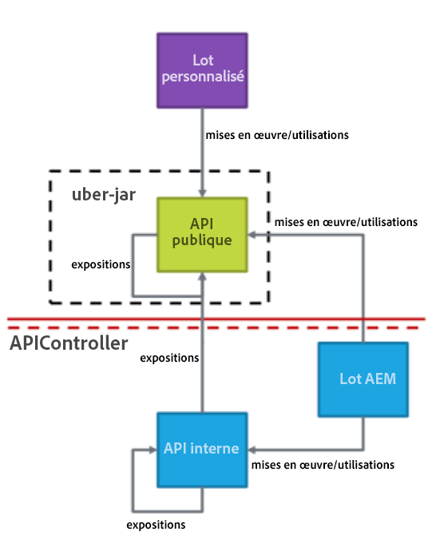
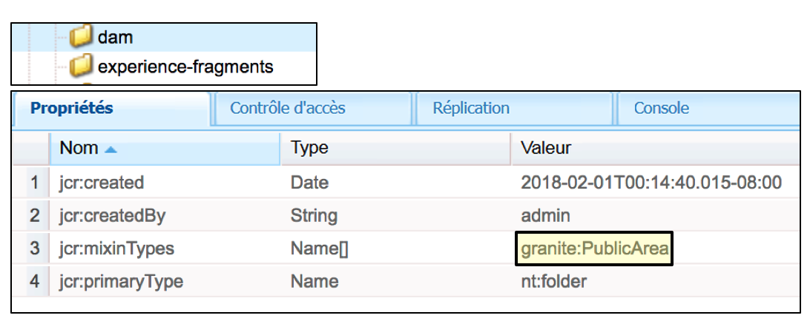
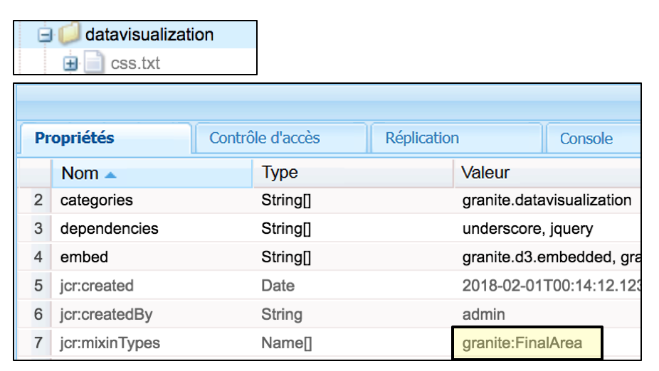
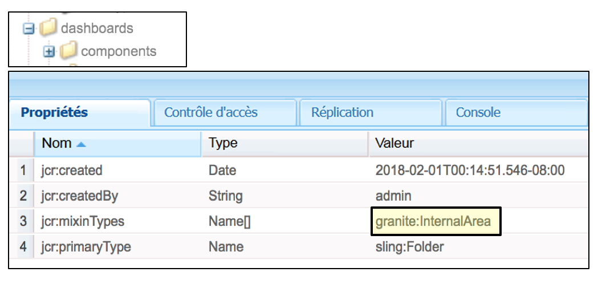
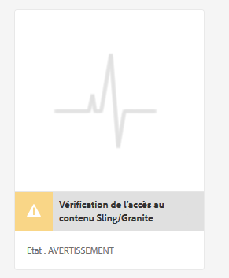
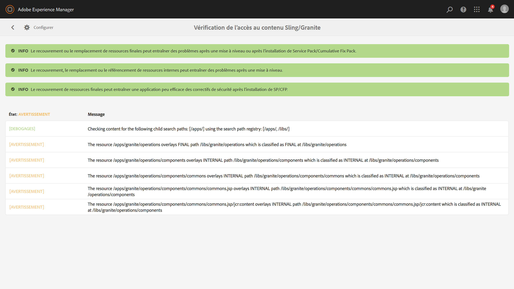
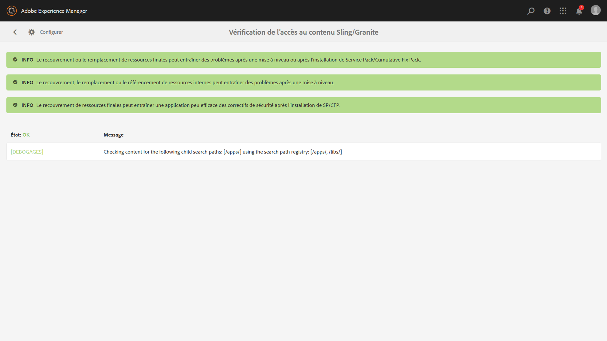

# Mises à niveau possibles{#sustainable-upgrades}

## Infrastructure de personnalisation {#customization-framework}

### Architecture (fonctionnelle/infrastructure/contenu/application)  {#architecture-functional-infrastructure-content-application}

La fonctionnalité Infrastructure de personnalisation est conçue pour vous aider à réduire les violations dans les zones non extensibles du code (comme APIs) ou du contenu (comme des incrustations) qui ne sont pas compatibles avec la mise à niveau.

L’infrastructure de personnalisation comprend deux composants : **Surface d’API** et **Classification du contenu**.

#### Surface d’API {#api-surface}

Dans les versions précédentes d’AEM, de nombreuses API étaient exposées par l’intermédiaire du jar Uber. Bien que certaines de ces API n’étaient pas destinées à être utilisées par les clients, elles étaient exposées afin de prendre en charge la fonctionnalité AEM entre les différents modules. Dorénavant, les API Java seront marquées comme étant publiques ou privées pour indiquer aux utilisateurs lesquelles peuvent être utilisées en toute sécurité dans le cadre des mises à niveau. Voici d’autres observations :

* Les API Java accompagnées de la mention `Public` peuvent être utilisées·et référencées par des modules d’implémentation personnalisés.

* Les API publiques seront rétrocompatibles avec l’installation d’un module de compatibilité.
* Le module de compatibilité contiendra un jar Uber de compatibilité pour garantir la compatibilité descendante.
* Java APIs marked as `Private` are intended to only be used by AEM internal bundles and should not be used by custom bundles.

>[!NOTE]
>
>The concept of `Private` and `Public` in this context should not be confused with Java notions of public and private classes.

#### Classifications de contenu {#content-classifications}

AEM utilise depuis longtemps le principe des incrustations et Sling Resource Merger pour permettre aux utilisateurs d’étendre et de personnaliser les fonctionnalités d’AEM. Les fonctionnalités prédéfinies qui alimentent les consoles AEM et l’interface utilisateur sont stockées sous **/libs**. Les utilisateurs ne doivent jamais rien modifier sous **/libs**, mais ils peuvent ajouter du contenu sous **/apps** afin d’étendre la fonctionnalité définie sous **/libs** (pour en savoir plus, voir Développement avec des incrustations). Cela occasionnait toutefois de nombreux problèmes lors de la mise à niveau d’AEM, dans la mesure où le contenu de **/libs** pouvait changer, provoquant ainsi des interruptions inattendues de la fonctionnalité d’incrustation. Les utilisateurs peuvent également étendre les composants AEM par le biais de l’héritage via `sling:resourceSuperType` ou simplement faire référence à un composant dans **/libs** via sling:resourceType. Des problèmes de mise à niveau similaires peuvent se produire avec les scénarios d’utilisation Référence et Remplacement.

Pour permettre aux utilisateurs de mieux comprendre les zones de **/libs** qui peuvent être utilisées et superposées en toute sécurité, le contenu de **/libs** a été classé avec les mixins suivants :

* **Public (granite:PublicArea)** : définit un nœud comme étant public afin qu’il puisse être superposé, hérité (`sling:resourceSuperType`) ou utilisé directement ( `sling:resourceType`). Les nœuds situés sous /libs marqués comme étant publics peuvent être mis à niveau en toute sécurité avec l’ajout d’un module de compatibilité. En règle générale, les utilisateurs doivent uniquement exploiter les nœuds publics.

* **Résumé (granite:AbstractArea)** : définit un nœud en tant que résumé. Nodes can be overlaid or inherited ( `sling:resourceSupertype`) but must not be used directly ( `sling:resourceType`).

* **Final (granite:FinalArea)** : définit un nœud comme étant final. Dans l&#39;idéal, les noeuds classés comme finaux ne doivent pas être superposés ou hérités. Final nodes can be used directly via `sling:resourceType`. Par défaut, les nœuds secondaires placés sous le nœud final sont considérés comme internes.

* ***Internal (granite:InternalArea)*** *- *Définit un noeud comme interne. Les nœuds classés dans la catégorie Interne ne peuvent pas être superposés, hérités, ni utilisés directement. Ces nœuds sont destinés uniquement aux fonctionnalités internes d’AEM.

* **Aucune annotation** : les nœuds héritent de la classification en fonction de la hiérarchie d’arborescence. Par défaut, /root est Public. **Les nœuds dont un parent est classé dans la catégorie Interne ou Final doivent également être traités comme étant internes.**

>[!NOTE]
>
>Ces stratégies ne sont appliquées que par rapport à des mécanismes basés sur un chemin de recherche Sling. Other areas of **/libs** like a client-side library may be marked as `Internal`, but could still be used with standard clientlib inclusion. Dans ce cas, il est essentiel que le client continue de respecter la classification Interne.

#### Indicateurs de type de contenu CRXDE Lite {#crxde-lite-content-type-indicators}

Mixins applied in CRXDE Lite will show content nodes and trees that are marked as `INTERNAL` as being greyed out. Pour la classification `FINAL`, seule l’icône est grisée. Les enfants de ces nœuds apparaissent également en grisé. Dans les deux cas, la fonctionnalité Nœud de recouvrement est désactivée.

**Public**

**Final**

**Interne**

**Contrôle de l’intégrité du contenu**

>[!NOTE]
>
>À partir de AEM 6.5, l’Adobe recommande d’utiliser le Détecteur de schémas pour détecter les violations d’accès au contenu. Les rapports des détecteurs de schémas sont plus détaillés, détectent plus de problèmes et réduisent la probabilité de faux positifs.
>
>Pour plus d’informations, voir [Evaluation de la complexité de la mise à niveau avec le Détecteur](/help/sites-deploying/pattern-detector.md)de schémas.

AEM 6.5 sera distribué avec un contrôle d’intégrité pour informer les clients si du contenu référencé ou superposé est utilisé d’une manière non conforme à la classification du contenu.

Le contrôle d&#39;accès au contenu** Sling/Granite est un nouveau contrôle d&#39;intégrité qui surveille le référentiel pour voir si le code du client accède incorrectement aux noeuds protégés dans AEM.

Ce contrôle analyse **/apps** et son exécution demande généralement quelques secondes.

Pour pouvoir accéder à ce nouveau contrôle d’intégrité, vous devez procéder comme suit :

1. Depuis l’écran d’accueil d’AEM, accédez à **Outils > Opérations > Rapports d’intégrité**.
1. Cliquez sur **Vérification de l’accès au contenu Sling/Granite** comme illustré ci-dessous :

   

Une fois l’analyse terminée, une liste d’avertissements s’affiche pour informer l’utilisateur final du nœud protégé qui est référencé de manière incorrecte :

Une fois que les problèmes ont été corrigés, l’état vert est rétabli :

Le contrôle d’intégrité affiche des informations collectées par un service en arrière-plan qui vérifie, de manière asynchrone, si un type de ressource ou d’incrustation est utilisé dans tous les chemins de recherche Sling. Si des mixins de contenu sont utilisés de manière incorrecte, une infraction est signalée.
