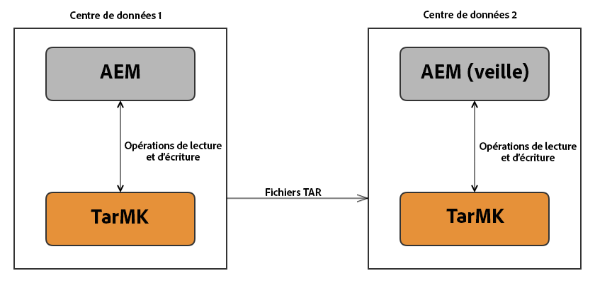

# Exécution d’AEM avec TarMK Cold Standby{#how-to-run-aem-with-tarmk-cold-standby}

## Présentation {#introduction}

La fonction Cold Standby du micronoyau Tar permet à une ou plusieurs instances AEM de secours de se connecter à une instance principale. Le processus de synchronisation est à sens unique, c’est à dire qu’il s’exécute de l’instance principale aux instances de secours.

Le but des instances de secours est de garantir une copie des données en direct du référentiel principal et de garantir un basculement rapide sans perte de données si le référentiel principal n’est plus disponible pour une raison quelconque.

Le contenu est synchronisé de façon linéaire entre une instance principale et les instances de secours, sans aucune vérification de l’intégrité pour la corruption de fichier ou du référentiel. En raison de cette conception, les instances de secours sont des copies exactes de l’instance principale et ne peuvent pas limiter les incohérences des instances principales.

>[!NOTE]
>
>La fonction Cold Standby permet de sécuriser les scénarios dans lesquels un niveau de disponibilité élevé est requis pour les instances d’**auteur**. Pour les situations où un niveau de disponibilité élevé est requis sur les instances de **publication** à l’aide du micronoyau Tar, Adobe recommande d’utiliser une ferme de publication.
>
>Pour plus d’informations sur les déploiements disponibles, consultez la page [Déploiements recommandés](/help/sites-deploying/recommended-deploys.md).

## Fonctionnement {#how-it-works}

Sur l’instance AEM principale, un port TCP s’ouvre pour écouter les messages entrants. Actuellement, il existe deux types de messages que les esclaves envoient au maître :

* Un message demandant l’ID de segment de l’en-tête actuelle
* Un message demandant les données de segment avec un ID spécifié

L’instance de secours demande de manière périodique l’ID de segment de l’en-tête actuelle de l’instance principale. Si le segment est inconnu au niveau local, il est récupéré. S’il est déjà présent, les segments sont comparés et les segments référencés sont également demandés, si nécessaire.

>[!NOTE]
>
>Les instances de secours ne reçoivent aucun type de requête, car elles fonctionnent uniquement en mode de synchronisation. La seule section disponible sur une instance de secours est la console web, afin de faciliter le regroupement et la configuration des services. 

Un déploiement classique du processus TarMK Cold Standby :



## Autres fonctionnalités {#other-characteristics}

### Robustesse {#robustness}

Le flux de données est conçu pour détecter et traiter automatiquement la connexion et les problèmes liés au réseau. Tous les modules sont regroupés avec des sommes de contrôle. Dès que vous rencontrez des problèmes liés à la connexion ou des modules endommagés, des mécanismes enclenchent de nouvelles tentatives. 

#### Performances {#performance}

L’activation du processus TarMK Cold Standby sur l’instance principale n’a presque aucun impact mesurable sur les performances. La consommation supplémentaire de processeur est très faible et le disque dur et le réseau E/S supplémentaires ne doivent pas poser de problème de performance.

Sur les instances de secours, attendez-vous à un niveau élevé de consommation de processeur pendant le processus de synchronisation. Comme la procédure ne comporte pas plusieurs threads, on ne peut pas l’accélérer en utilisant plusieurs cœurs. Si aucune donnée n’est modifiée ni transférée il n’y aura aucune activité mesurables. La vitesse de connexion varie selon l’environnement matériel et réseau, mais elle ne dépend pas de la taille du référentiel ou de l’utilisation SSL. Gardez cela à l’esprit lorsque vous évaluez le temps nécessaire pour la synchronisation initiale ou lorsque de nombreuses données ont été modifiées entre-temps sur le nœud principal. 

#### Sécurité {#security}

En supposant que toutes les instances s’exécutent dans la même zone de sécurité intranet, le risque d’une violation de la sécurité est considérablement réduit. Toutefois, vous pouvez ajouter une couche supplémentaire de sécurité en activant les connexions SSL entre les esclaves et le maître. Cela réduit le risque de compromission des données par un intermédiaire.

En outre, vous pouvez spécifier les instances de secours qui sont autorisées à se connecter en limitant l’adresse IP des requêtes entrantes. Cela devrait garantit que personne au sein de l’intranet ne peut copier le référentiel.

>[!NOTE]
>
>Il est recommandé d’ajouter un équilibreur de charge entre le dispatcher et les serveurs qui font partie de la configuration Coldy Standby. L’équilibreur de charge doit être configuré pour diriger le trafic des utilisateurs uniquement vers l’instance **principale**, pour assurer la régularité et empêcher la copie du contenu sur l’instance de secours par des moyens autres que le mécanisme Cold Standby.

## Création d’une configuration AEM TarMK Cold Standby {#creating-an-aem-tarmk-cold-standby-setup}

>[!CAUTION]
>
>Le PID de la boutique de nœuds de segment et le service de stockage Standby a changé dans AEM 6.3 par rapport aux versions précédentes :
>
>* de org.apache.jackrabbit.oak.**plugins**.segment.Secondaire.store.StandbyStoreService vers org.apache.jackrabbit.oak.segment.Secondaire.store.StandbyStoreService
>* de org.apache.jackrabbit.oak.**plugins**.segment.SegmentNodeStoreService vers org.apache.jackrabbit.oak.segment.SegmentNodeStoreService

>
>
Assurez-vous d’effectuer les réglages de configuration nécessaires pour refléter ces modifications.

Pour créer une configuration TarMK Cold Standby, vous devez d’abord créer des instances de secours en effectuant une copie du système de fichiers du dossier d’installation complet de l’instance principale vers un nouvel emplacement. Vous pouvez ensuite début chaque instance avec un mode d’exécution qui spécifiera son rôle ( `primary` ou `standby`).

Consultez ci-dessous la procédure devant être suivie afin de créer une installation avec un maître et une instance de secours : 

1. Installer AEM.

1. Fermez votre instance, puis copiez son dossier d’installation à l’emplacement où l’instance Cold Standby sera exécutée. Même si l’exécution s’effectue à partir de différents ordinateurs, veillez à donner à chaque dossier un nom descriptif (comme *aem-principal* ou *aem-de-secours*) pour différencier les instances.
1. Accédez au dossier d’installation de l’instance principale puis :

   1. Vérifier et supprimer les configurations OSGi précédentes que vous pouviez avoir sous `aem-primary/crx-quickstart/install`

   1. Créez un dossier appelé `install.primary` sous `aem-primary/crx-quickstart/install`

   1. Créez les configurations requises pour la banque de noeuds et la banque de données préférées sous `aem-primary/crx-quickstart/install/install.primary`
   1. Créez un fichier nommé `org.apache.jackrabbit.oak.segment.standby.store.StandbyStoreService.config` au même emplacement et configurez-le conformément aux exigences. Pour plus d’informations sur les options de configuration, voir [Configuration](/help/sites-deploying/tarmk-cold-standby.md#configuration). 

   1. Si vous utilisez une instance AEM TarMK avec un magasin de données externe, créez un dossier nommé `crx3` sous `aem-primary/crx-quickstart/install` nommé `crx3`

   1. Placez le fichier de configuration de l’entrepôt de données dans le dossier `crx3`. 

   Par exemple, si vous exécutez une instance AEM TarMK avec un entrepôt de données de fichiers externe, vous aurez besoin de ces fichiers de configuration :

   * `aem-primary/crx-quickstart/install/install.primary/org.apache.jackrabbit.oak.segment.SegmentNodeStoreService.config`
   * `aem-primary/crx-quickstart/install/install.primary/org.apache.jackrabbit.oak.segment.standby.store.StandbyStoreService.config`
   * `aem-primary/crx-quickstart/install/crx3/org.apache.jackrabbit.oak.plugins.blob.datastore.FileDataStore.config`

   Vous trouverez ci-dessous des exemples de configuration pour une instance principale :

   **Exemple de****org.apache.jackrabbit.oak.segment.SegmentNodeStoreService.config**

   ```xml
   org.apache.sling.installer.configuration.persist=B"false"
   customBlobStore=B"true"
   standby=B"false"
   ```

   **Exemple de org.apache.jackrabbit.oak.segment.standby.store.StandbyStoreService.config**

   ```xml
   org.apache.sling.installer.configuration.persist=B"false"
   mode="primary"
   port=I"8023"
   ```

   **Exemple de org.apache.jackrabbit.oak.plugins.blob.datastore.FileDataStore.config**

   ```xml
   org.apache.sling.installer.configuration.persist=B"false"
   path="./crx-quickstart/repository/datastore"
   minRecordLength=I"16384"
   ```

1. Démarrez l’instance principale en veillant à spécifier le mode d’exécution principal :

   ```shell
   java -jar quickstart.jar -r primary,crx3,crx3tar
   ```

1. Créez un enregistreur de journalisation Apache Sling pour module **org.apache.jackrabbit.oak.segment.**. Définissez le niveau du journal sur « Déboguer », puis orientez la sortie du journal vers un fichier journal distinct, tel que */logs/tarmk-coldstandby.log*. Pour plus d’informations, voir [Journalisation](/help/sites-deploying/configure-logging.md).
1. Accédez à l’emplacement de l’instance **de secours** et démarrez-la en exécutant le fichier jar.
1. Créez la même configuration de journalisation que pour l’instance principale. Ensuite, arrêtez l’instance.
1. Préparez l’instance de secours. Vous pouvez le faire en suivant le même processus que pour l’instance principale :

   1. Supprimez tous les fichiers que vous pouvez avoir sous `aem-standby/crx-quickstart/install`.
   1. Créez un nouveau dossier intitulé `install.standby` sous `aem-standby/crx-quickstart/install`

   1. Créez deux fichiers de configuration nommés :

      * `org.apache.jackrabbit.oak.segment.SegmentNodeStoreService.config`
      * `org.apache.jackrabbit.oak.segment.standby.store.StandbyStoreService.config`
   1. Créez un nouveau dossier intitulé `crx3` sous `aem-standby/crx-quickstart/install`

   1. Créez la configuration de stockage de données et placez-la sous `aem-standby/crx-quickstart/install/crx3`. Dans cet exemple, le fichier que vous devez créer est : 

      * org.apache.jackrabbit.oak.plugins.blob.datastore.FileDataStore.config
   1. Modifiez les fichiers et créez les configurations nécessaires.

   Vous trouverez ci-dessous des exemples fichiers de configuration pour une instance de secours standard : 

   **Exemple de org.apache.jackrabbit.oak.segment.SegmentNodeStoreService.config**

   ```xml
   org.apache.sling.installer.configuration.persist=B"false"
   name="Oak-Tar"
   service.ranking=I"100"
   standby=B"true"
   customBlobStore=B"true"
   ```

   **Exemple de org.apache.jackrabbit.oak.segment.standby.store.StandbyStoreService.config**

   ```xml
   org.apache.sling.installer.configuration.persist=B"false"
   mode="standby"
   primary.host="127.0.0.1"
   port=I"8023"
   secure=B"false"
   interval=I"5"
   standby.autoclean=B"true"
   ```

   **Exemple de org.apache.jackrabbit.oak.plugins.blob.datastore.FileDataStore.config**

   ```xml
   org.apache.sling.installer.configuration.persist=B"false"
   path="./crx-quickstart/repository/datastore"
   minRecordLength=I"16384"
   ```

1. Démarrez l’instance **de secours** à l’aide du mode d’exécution de secours :

   ```xml
   java -jar quickstart.jar -r standby,crx3,crx3tar
   ```

Le service peut également être configuré par le biais de la console web, comme suit :

1. Accédez à la console Web à l&#39;adresse suivante : *https://serveraddress:serverport/system/console/configMgr*
1. Vous recherchez un service appelé **Apache Jackrabbit Oak Segment Tar Cold Secondaire Service** et le doublon cliquez dessus pour modifier les paramètres.
1. Enregistrez les paramètres et redémarrez les instances pour que les nouveaux paramètres puissent prendre effet.

>[!NOTE]
>
>Vous pouvez vérifier le rôle d’une instance à tout moment en vérifiant la présence des modes d’exécution **principaux** ou **de secours** dans la console web des paramètres Sling.
>
>Pour ce faire, accédez à *https://localhost:4502/system/console/status-slingsettings* et vérifiez la ligne **&quot;Run Modes&quot;**.

## Première synchronisation {#first-time-synchronization}

Une fois que la préparation est complète et que l’instance de secours démarre pour la première fois, attendez-vous à un trafic de réseau élevé entre les instances, le temps que l’instance de secours se mette au niveau de l’instance principale. Vous pouvez consulter les journaux pour contrôler l’état de la synchronisation.

Sur l’instance de secours *tarmk-coldstandby.log*, vous verrez des entrées de ce type :

```xml
    *DEBUG* [defaultEventExecutorGroup-2-1] org.apache.jackrabbit.oak.segment.standby.store.StandbyStore trying to read segment ec1f739c-0e3c-41b8-be2e-5417efc05266

    *DEBUG* [nioEventLoopGroup-3-1] org.apache.jackrabbit.oak.segment.standby.codec.SegmentDecoder received type 1 with id ec1f739c-0e3c-41b8-be2e-5417efc05266 and size 262144

    *DEBUG* [defaultEventExecutorGroup-2-1] org.apache.jackrabbit.oak.segment.standby.store.StandbyStore got segment ec1f739c-0e3c-41b8-be2e-5417efc05266 with size 262144

    *DEBUG* [defaultEventExecutorGroup-2-1] org.apache.jackrabbit.oak.segment.file.TarWriter Writing segment ec1f739c-0e3c-41b8-be2e-5417efc05266 to /mnt/crx/author/crx-quickstart/repository/segmentstore/data00016a.tar
```

Dans le fichier *error.log* de l’instance de secours, vous devez voir une entrée de ce type :

```xml
*INFO* [FelixStartLevel] org.apache.jackrabbit.oak.segment.standby.store.StandbyStoreService started standby sync with 10.20.30.40:8023 at 5 sec.
```

Dans l’extrait de journal ci-dessus, *10.20.30.40* est l’adresse IP de l’instance principale.

Sur l’instance **principale** *tarmk-coldstandby.log*, vous verrez des entrées de ce type :

```xml
    *DEBUG* [nioEventLoopGroup-3-2] org.apache.jackrabbit.oak.segment.standby.store.CommunicationObserver got message ‘s.d45f53e4-0c33-4d4d-b3d0-7c552c8e3bbd’ from client c7a7ce9b-1e16-488a-976e-627100ddd8cd

    *DEBUG* [nioEventLoopGroup-3-2] org.apache.jackrabbit.oak.segment.standby.server.StandbyServerHandler request segment id d45f53e4-0c33-4d4d-b3d0-7c552c8e3bbd

    *DEBUG* [nioEventLoopGroup-3-2] org.apache.jackrabbit.oak.segment.standby.server.StandbyServerHandler sending segment d45f53e4-0c33-4d4d-b3d0-7c552c8e3bbd to /10.20.30.40:34998

    *DEBUG* [nioEventLoopGroup-3-2] org.apache.jackrabbit.oak.segment.standby.store.CommunicationObserver did send segment with 262144 bytes to client c7a7ce9b-1e16-488a-976e-627100ddd8cd
```

Dans ce cas, le « client » mentionné dans le journal est l’instance **de secours**.

Une fois que ces entrées cessent de s’afficher dans le journal, sachez que le processus de synchronisation est terminé.

Bien que les entrées ci-dessus indiquent que le mécanisme d’interrogation fonctionne correctement, il est souvent utile d’identifier s’il existe bien des données en cours de synchronisation pendant que le processus d’interrogation a lieu. Pour ce faire, recherchez des entrées comme celles-ci :

```xml
*DEBUG* [defaultEventExecutorGroup-156-1] org.apache.jackrabbit.oak.segment.file.TarWriter Writing segment 3a03fafc-d1f9-4a8f-a67a-d0849d5a36d5 to /<<CQROOTDIRECTORY>>/crx-quickstart/repository/segmentstore/data00014a.tar
```

De même, lorsque l’exécution a lieu avec un fichier `FileDataStore` non partagé, des messages comme celui-ci confirmeront que les fichiers binaires sont correctement transmis :

```xml
*DEBUG* [nioEventLoopGroup-228-1] org.apache.jackrabbit.oak.segment.standby.codec.ReplyDecoder received blob with id eb26faeaca7f6f5b636f0ececc592f1fd97ea1a9#169102 and size 169102
```

### Configuration {#configuration}

Les paramètres OSGi suivants sont disponibles pour le service Cold Standby :

* **Continuer la configuration :** si ce paramètre est activé, la configuration est stockée dans le référentiel plutôt que les fichiers de configuration OSGi traditionnels. Il est recommandé de garder ce paramètre désactivé sur des systèmes de production afin que la configuration principale ne soit pas effectuée par l’instance de secours.

* **Mode (`mode`) :** cette option permet de choisir le mode d’exécution de l’instance.

* **Port (port) :** le port à utiliser pour la communication. La valeur par défaut est de `8023`.

* **Hôte Principal (`primary.host`) :**  hôte de l’instance Principale. Ce paramètre s’applique uniquement à l’instance de secours.
* **Intervalle de synchronisation (`interval`) :**  ce paramètre détermine l’intervalle entre la demande de synchronisation et s’applique uniquement à l’instance Secondaire.

* **Plages IP autorisées (`primary.allowed-client-ip-ranges`) :**  les plages IP à partir desquelles la Principale autorise les connexions.
* **Sécurisé (`secure`) :** activez le chiffrement SSL. Pour que ce paramètre fonctionne, il doit être activé sur toutes les instances.
* **Délai d’expiration de lecture Secondaire (`standby.readtimeout`) :** Délai d’expiration pour les requêtes émises par l’instance Secondaire en millisecondes. La valeur recommandée pour le délai d’expiration est 43200000. Il est généralement recommandé de définir le délai d’expiration sur au moins 12 heures.

* **Nettoyage automatique Secondaire (`standby.autoclean`) :** Appelez la méthode de nettoyage si la taille de la banque augmente au cours d’un cycle de synchronisation.

>[!NOTE]
>
>Il est vivement conseillé d’attribuer des ID de référentiel différents aux instances principale et de secours pour pouvoir bien les identifier séparément pour les services comme le déchargement.
>
>La meilleure façon de procéder est de supprimer le fichier *sling.id* sur l’instance de secours, puis de redémarrer l’instance.

## Procédures de basculement  {#failover-procedures}

Si l’instance principale échoue, vous pouvez choisir l’une des instances de secours pour la remplacer, en modifiant le mode d’exécution de lancement, tel qu’expliqué ci-après :

>[!NOTE]
>
>Les fichiers de configuration doivent également être modifiés afin qu’ils correspondent aux paramètres utilisés pour une instance principale.

1. Accédez à l’emplacement de l’instance de secours sur votre ordinateur et arrêtez-la. 

1. Si vous avez un équilibreur de charge configuré, vous pouvez supprimer l’instance principale à partir de la configuration de l’équilibreur de charge.
1. Sauvegardez le dossier `crx-quickstart` depuis le dossier d’installation de secours. Cela peut être utilisé comme point de départ lors de la configuration d’une nouvelle instance de secours. 

1. Redémarrez l’instance à l’aide du mode d’exécution `primary` :

   ```shell
   java -jar quickstart.jar -r primary,crx3,crx3tar
   ```

1. Ajoutez une nouvelle instance principale à l’équilibreur de charge.
1. Créez et lancez une instance de secours. Pour plus d’informations, reportez-vous à la procédure ci-dessus de la section [Création d’une configuration AEM TarMK Cold Standby](/help/sites-deploying/tarmk-cold-standby.md#creating-an-aem-tarmk-cold-standby-setup).

## Application de correctifs à une configuration Cold Standby {#applying-hotfixes-to-a-cold-standby-setup}

La méthode recommandée pour appliquer des correctifs à une configuration Cold Stanbdy consiste à les installer sur l’instance principale, puis à la copier dans une nouvelle instance Cold Standby avec les correctifs installés.

Vous pouvez le faire en suivant les étapes décrites ci-dessous :

1. Arrêtez le processus de synchronisation sur l’instance Secondaire froide en accédant à la console JMX et en utilisant **org.apache.jackrabbit.oak : Statut (&quot;Secondaire&quot;)**bean. Pour plus d&#39;informations sur la façon de procéder, consultez la section [Surveillance](#monitoring).
1. Arrêtez l’instance Cold Standby.
1. Installez le correctif sur l’instance principale. Pour plus d&#39;informations sur l&#39;installation d&#39;un correctif logiciel, voir [Comment utiliser des packages](/help/sites-administering/package-manager.md).
1. Après l’installation, vérifiez si les problèmes persistent sur l’instance.
1. Supprimez l’instance Cold Standby en supprimant son dossier d’installation.
1. Arrêtez l’instance principal et clonez-la en copiant le système de fichiers de son dossier d’installation complet à l’emplacement de Cold Standby.
1. Reconfigurez le clone nouvellement créé pour qu’il se comporte comme une instance Cold Standby. Pour plus de détails, voir [Création d’une configuration AEM TarMK Cold Standby.](/help/sites-deploying/tarmk-cold-standby.md#creating-an-aem-tarmk-cold-standby-setup)
1. Démarrez les instances principale et de secours.

## Surveillance {#monitoring}

La fonction affiche les informations à l’aide de JMX ou des MBeans. Cela vous permet d’analyser l’état actuel de l’instance de secours et du maitre à l’aide de la [console JMX](/help/sites-administering/jmx-console.md). Les informations se trouvent dans un MBean de `type org.apache.jackrabbit.oak:type="Standby"`nom `Status`.

**Instance de secours**

L’observation d’une instance de secours vous permet d’identifier un nœud. L’ID est généralement un UUID générique. 

Ce nœud possède cinq attributs en lecture seule :

* `Running:` valeur booléenne indiquant si le processus de synchronisation est en cours d’exécution ou non.

* `Mode:` Client : suivi de l’UUID utilisé pour identifier l’instance. Notez que cet UUID change chaque fois que la configuration est mise à jour.

* `Status:` une représentation textuelle de l’état actuel (comme  `running` ou  `stopped`).

* `FailedRequests:`nombre d’erreurs consécutives.
* `SecondsSinceLastSuccess:` nombre de secondes écoulées depuis la dernière communication réussie avec le serveur. Il affiche `-1` si aucune communication réussie n&#39;a été effectuée.

Il existe également trois méthodes invocables : 

* `start():` début le processus de synchronisation.
* `stop():` arrête le processus de synchronisation.
* `cleanup():` exécute l&#39;opération de nettoyage sur le Secondaire.

**Instance principale**

L’observation de l’instance principale permet d’identifer certaines informations générales via un MBean dont la valeur ID correspond au numéro de port que le service de secours TarMK utilise (8023 par défaut). La plupart des méthodes et des attributs sont les mêmes que pour l’instance de secours, mais certains diffèrent : 

* `Mode:` affichera toujours la valeur  `primary`.

Des informations supplémentaires pour jusqu’à 10 clients (instances de secours) connectés au maître peuvent être récupérées. L’ID du MBean est l’UUID de l’instance. Il n’existe pas de méthode invocable pour ces MBeans, mais certains attributs en lecture seule très utiles :

* `Name:` l’identifiant du client.
* `LastSeenTimestamp:` horodatage de la dernière requête dans une représentation textuelle.
* `LastRequest:` la dernière demande du client.
* `RemoteAddress:` adresse IP du client.
* `RemotePort:` port utilisé par le client pour la dernière requête.
* `TransferredSegments:` nombre total de segments transférés à ce client.
* `TransferredSegmentBytes:`nombre total d&#39;octets transférés à ce client.

## Maintenance du référentiel Cold Standby {#cold-standby-repository-maintenance}

### Nettoyage des révisions {#revision-clean}

>[!NOTE]
>
>Si vous exécutez [Nettoyage des révisions en ligne](/help/sites-deploying/revision-cleanup.md) sur l’instance principale, la procédure manuelle présentée ci-dessous n’est pas nécessaire. De plus, si vous utilisez le nettoyage de révision en ligne, l&#39;opération `cleanup ()` sur l&#39;instance Secondaire est exécutée automatiquement.

>[!NOTE]
>
>N’exécutez pas le nettoyage de révisions hors ligne sur l’instance de secours. Cela n’est pas nécessaire et ne réduit pas la taille de l’entrepôt de segments.

Adobe recommande d&#39;exécuter régulièrement la maintenance afin d&#39;éviter une croissance excessive du référentiel au fil du temps. Pour exécuter manuellement la maintenance du référentiel Cold Standby, procédez comme suit :

1. Arrêtez le processus de secours sur l’instance de secours en accédant à la console JMX et en utilisant le bean **org.apache.jackrabbit.oak: Status (&quot;Standby&quot;)**. Pour plus d’informations sur cette procédure, reportez-vous à la section [Surveillance](/help/sites-deploying/tarmk-cold-standby.md#monitoring) ci-dessous.

1. Arrêtez l’instance principale AEM. 
1. Exécutez l’outil de compression Oak sur l’instance principale. Pour plus de détails, voir [Maintenance du référentiel](/help/sites-deploying/storage-elements-in-aem-6.md#maintaining-the-repository).
1. Démarrez l’instance principale.
1. Lancez le processus de secours sur l’instance de secours à l’aide du bean JMX décrit dans la première étape.
1. Observez les journaux et attendez la fin de la synchronisation. Il se peut qu’une augmentation substantielle au niveau du référentiel de secours se produise ce moment là.
1. Exécutez l’opération `cleanup()` sur l’instance Secondaire, en utilisant le même haricot JMX que celui décrit à la première étape.

Il se peut que la synchronisation de l’instance de secours avec l’instance principale prenne plus de temps que prévu, car la compression hors ligne consiste à réécrire l’historique du référentiel, augmentant ainsi substantiellement le temps de calcul des modifications du référentiel. Notez également qu’une fois ce processus terminé, le référentiel sur l’instance de secours aura approximativement la même taille que le référentiel sur l’instance principale.

Comme alternative, le référentiel principal peut être copié manuellement sur l’instance de secours après l’exécution de la compression sur l’instance principale. L’instance de secours est ainsi reconstituée à chaque compression.

### Nettoyage de la mémoire d’entrepôt de données  {#data-store-garbage-collection}

Il est important d’exécuter de temps en temps le nettoyage de la mémoire sur les instances de l’entrepôt de données des fichiers. Autrement, les fichiers binaires supprimés resteront sur le système de fichiers, ce qui contribue à surcharger le lecteur. Pour exécuter la collecte des déchets, procédez comme suit :

1. Exécutez la maintenance Secondaire du référentiel à froid comme décrit dans la section [ci-dessus](/help/sites-deploying/tarmk-cold-standby.md#cold-standby-repository-maintenance).
1. Une fois le processus de maintenance terminé et les instances relancées, procédez comme suit :

   * Sur la Principale, exécutez la collecte des déchets de la banque de données via le bean JMX approprié, comme décrit dans [cet article](/help/sites-administering/data-store-garbage-collection.md#running-data-store-garbage-collection-via-the-jmx-console).
   * Sur le Secondaire, la collecte des déchets de la banque de données est disponible uniquement par le biais de **BlobGarbageCollection** MBean - `startBlobGC()`. **RepositoryManagement **MBean n&#39;est pas disponible sur le Secondaire.

   >[!NOTE]
   >
   >Si vous n’utilisez pas d’entrepôt de données partagé, le nettoyage de la mémoire doit d’abord être exécuté sur l’instance principale, puis sur l’instance de secours.

