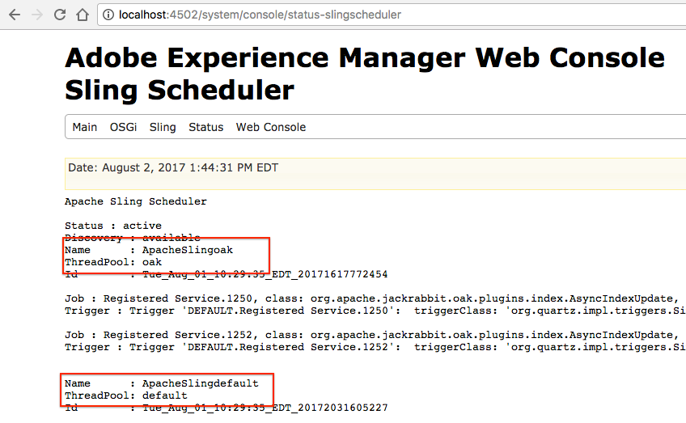

# Dépannage des index Oak{#troubleshooting-oak-indexes}

## Réindexation lente  {#slow-re-indexing}

Le processus de réindexation interne à AEM collecte les données du référentiel et les stocke dans les index Oak pour prendre en charge les requêtes de contenu de haute performance. Dans des cas exceptionnels, ce processus peut être lent, voire bloqué. Cette page servira de guide de dépannage pour vous aider à identifier si l’indexation est lente, rechercher la cause et résoudre le problème. 

Il est important de faire la distinction entre la réindexation qui prend beaucoup de temps de manière inopportune et la réindexation qui prend un certain temps, car elle indexe de grandes quantités de contenu. Par exemple, le temps nécessaire pour indexer le contenu augmente en fonction de la quantité de contenu. Par conséquent, la réindexation des grands référentiels de production va prendre plus de temps que celle des petits référentiels de développement.

Voir [Meilleures pratiques relatives aux requêtes et à l’indexation](/help/sites-deploying/best-practices-for-queries-and-indexing.md) pour obtenir des informations supplémentaires indiquant quand et comment réindexer le contenu. 

## Détection initiale {#initial-detection}

L’indexation lente de la détection initiale nécessite de parcourir les MBeans `IndexStats` JMX. Sur l’instance AEM affectée, procédez comme suit :

1. Ouvrez la console Web et cliquez sur l’onglet JMX ou accédez à https://&lt;hôte>:&lt;port>/system/console/jmx (par exemple, [http://localhost:4502/system/console/jmx](http://localhost:4502/system/console/jmx)).
1. Accédez aux mbeans `IndexStats`.
1. Ouvrez les `IndexStats` MBeans pour &quot; `async`&quot; et &quot; `fulltext-async`&quot;.

1. Pour les deux MBeans, vérifiez si l’horodatage **Done** et **LastIndexTime** sont inférieurs à 45 minutes de l’heure actuelle.

1. Pour un MBean, si la valeur temporelle (**Done** ou **LastIndexedTime**) date de plus de 45 minutes avant l’heure actuelle, alors la tâche d’index est défectueuse ou prend trop de temps. Les index asynchrones sont donc obsolètes.

## L’indexation est interrompue après une fermeture forcée {#indexing-is-paused-after-a-forced-shutdown}

Une fermeture forcée entraîne l’arrêt de l’indexation asynchrone par AEM pendant jusqu’à 30 minutes après le redémarrage et nécessite généralement 15 minutes supplémentaires pour terminer le premier passage de réindexation, pour un total d’environ 45 minutes (revenant à la durée [de détection initiale ](/help/sites-deploying/troubleshooting-oak-indexes.md#initial-detection)de 45 minutes). Si vous pensez que l’indexation est mise en pause après une fermeture forcée :

1. Tout d’abord, déterminez si une instance AEM a été arrêtée de manière forcée (le processus AEM a été interrompu de manière brutale ou une coupure de courant s’est produite), puis redémarrée. 

   * [AEM ](/help/sites-deploying/configure-logging.md) connexion peut être examinée à cette fin.

1. Si la fermeture forcée se produit, au redémarrage, AEM suspend automatiquement la réindexation pendant 30 minutes. 
1. Attendez environ 45 minutes pour qu’AEM reprenne les opérations d’indexation asynchrones normales. 

## Pool de threads surchargé  {#thread-pool-overloaded}

>[!NOTE]
>
>Pour AEM 6.1, assurez-vous que [AEM 6.1 CFP 11](https://helpx.adobe.com/experience-manager/release-notes-aem-6-1-cumulative-fix-pack.html) est installé.

Dans des cas exceptionnels, le pool de threads utilisé pour gérer l’indexation asynchrone risque d’être surchargé. Pour isoler le processus d’indexation, un pool de threads peut être configuré afin d’éviter qu’une autre tâche AEM interfère avec la capacité d’indexation du contenu en temps voulu d’Oak. Pour ce faire, vous devez :

1. Définir un pool de nouveaux threads isolés que le planificateur Apache Sling peut utiliser pour l’indexation asynchrone :

   * Sur l’instance AEM affectée, accédez à AEM OSGi Web Console>OSGi>Configuration>Apache Sling Planificateur ou à https://&lt;hôte>:&lt;port>/system/console/configMgr (par exemple, [http://localhost:4502/system/console/configMgr](http://localhost:4502/system/console/configMgr)).
   * Ajoutez une entrée au champ « Allowed Thread Pools » (Pools de threads autorisés), avec la valeur « oak ».
   * Cliquez sur Enregistrer en bas à droite pour enregistrer les modifications. 

   

1. Vérifiez que le nouveau pool de threads du planificateur Apache Sling est enregistré et s’affiche dans la console web d’état du planificateur Apache Sling. 

   * Accédez à l’AEM OSGi Web Console>Status>Sling Planificateur ou accédez à https://&lt;hôte>:&lt;port>/system/console/status-slingScheduler (par exemple, [http://localhost:4502/system/console/status-slingscheduler](http://localhost:4502/system/console/status-slingscheduler)).
   * Vérifiez que les entrées suivantes du pool existent :

      * ApacheSlingoak
      * ApacheSlingdefault

   

## La file d’attente d’observation est pleine {#observation-queue-is-full}

Si un trop grand nombre de modifications et de validations sont effectuées sur le référentiel en peu de temps, l’indexation peuvent être retardées à cause d’une file d’attente d’osbervation pleine. Tout d’abord, déterminez si la file d’attente est pleine :

1. Accédez à la console Web et cliquez sur l’onglet JMX ou accédez à https://&lt;hôte>:&lt;port>/system/console/jmx (par exemple, [http://localhost:4502/system/console/jmx](http://localhost:4502/system/console/jmx)).
1. Ouvrez le MBean Statistiques de référentiel Oak et déterminez si une valeur `ObservationQueueMaxLength` est supérieure à 10 000. 

   * Dans les opérations normales, cette valeur maximale doit toujours éventuellement être ramenée à zéro (en particulier dans la section `per second`) afin de vérifier que les mesures en secondes de `ObservationQueueMaxLength` sont égales à 0.
   * Si les valeurs sont de 10 000 ou plus et augmentent progressivement, cela signifie qu’au moins une file d’attente (probablement plusieurs) ne peut pas être traitée aussi rapidement pendant que de nouvelles modifications (commits) ont lieu.
   * Chaque file d’attente d’observation est limitée (10 000 par défaut), et si la file d’attente atteint cette limite, son traitement se détériore.
   * Lorsque vous utilisez MongoMK, comme la longueur des files d’attente augmente beaucoup, la performance du cache Oak interne se détériore. Cette corrélation est visible dans une augmentation de `missRate` pour le cache `DocChildren` dans le MBean des statistiques `Consolidated Cache`.

1. Pour éviter de dépasser les limites acceptables des files d’attente d’observation, il est recommandé de procéder comme suit :

   * Diminuer le débit constant des validations. De courts pics de validations sont acceptables, mais le rythme constant doit être réduit. 
   * Augmentez la taille de `DiffCache` comme décrit dans la section [Conseils de réglage des performances > Réglage de l’Enregistrement Mongo > Taille du cache de Document](https://helpx.adobe.com/experience-manager/kb/performance-tuning-tips.html#main-pars_text_3).

## Identification d’un processus de réindexation bloqué et résolution du problème {#identifying-and-remediating-a-stuck-re-indexing-process}

La réindexation peut être considérée comme « totalement bloquée » dans deux conditions :

* La réindexation est très lente, au point où aucune progression significative n’est signalée dans les fichiers journaux concernant le nombre de nœuds transmis. 

   * Par exemple, s’il n’y a aucun message pendant une heure, ou si la progression est tellement lente qu’elle prend une semaine ou plus à se terminer. 

* La réindexation est bloquée dans une boucle sans fin si des exceptions répétées apparaissent dans les fichiers journaux (par exemple, `OutOfMemoryException`) dans le thread d’indexation. La répétition des mêmes exceptions dans le journal indique qu’Oak tente d’indexer le même élément à plusieurs reprises, mais échoue sur le même problème. 

Pour identifier et résoudre un processus de réindexation bloqué, procédez comme suit :

1. Pour identifier la cause d’une indexation bloquée, les informations suivantes doivent être collectées :

   * Collectez 5 minutes de vidage des threads, un vidage de thread toutes les 2 secondes. 
   * [Définissez le niveau DEBUG et les journaux pour les appenders](/help/sites-deploying/configure-logging.md).

      * *org.apache.jackrabbit.oak.plugins.index.AsyncIndexUpdate*
      * *org.apache.jackrabbit.oak.plugins.index.IndexUpdate*
   * Collecte de données à partir du `IndexStats` MBean async :

      * Accédez à AEM console Web OSGi>Main>JMX>IndexStat>async

         ou accédez à [http://localhost:4502/system/console/jmx/org.apache.jackrabbit.oak%3Aname%3Dasync%2Ctype%3DIndexStats](http://localhost:4502/system/console/jmx/org.apache.jackrabbit.oak%3Aname%3Dasync%2Ctype%3DIndexStats)
   * Utilisez le mode console [oak-run.jar](https://github.com/apache/jackrabbit-oak/tree/trunk/oak-run) pour collecter les détails de ce qui existe sous le noeud * `/:async`*.
   * Collectez une liste de points de contrôle du référentiel à l&#39;aide du `CheckpointManager` MBean :

      * AEM Console Web OSGi>Main>JMX>CheckpointManager>listCheckpoints()

         ou accédez à [http://localhost:4502/system/console/jmx/org.apache.jackrabbit.oak%3Aname%3DSegment+node+store+checkpoint+management%2Ctype%3DCheckpointManager](http://localhost:4502/system/console/jmx/org.apache.jackrabbit.oak%3Aname%3DSegment+node+store+checkpoint+management%2Ctype%3DCheckpointManager)

1. Après avoir collecté toutes les informations décrites à l’étape 1, redémarrez AEM.

   * Le redémarrage d’AEM peut résoudre le problème dans le cas d’un chargement simultané élevé (un élément de la file d’attente d’observation ou élément similaire). 
   * Si un redémarrage ne résout pas le problème, ouvrez un problème avec [le service à la clientèle de l’Adobe ](https://helpx.adobe.com/fr/marketing-cloud/contact-support.html) et fournissez toutes les informations collectées à l’étape 1.

## Abandon sécurisé de la réindexation asynchrone {#safely-aborting-asynchronous-re-indexing}

La réindexation peut être interrompue en toute sécurité (arrêtée avant d&#39;être terminée) par les voies d&#39;indexation `async, async-reindex`et f `ulltext-async` ( `IndexStats` Mbean). Pour plus d’informations, consultez également la documentation d’Apache Oak sur [Comment annuler la réindexation](https://jackrabbit.apache.org/oak/docs/query/indexing.html#abort-reindex). En outre, il convient de tenir compte du fait que :

* La réindexation des index Lucene et Lucene Property peut être abandonnée, car ils sont naturellement asynchrones. 
* La réindexation des index de propriétés d&#39;Oak ne peut être abandonnée que si la réindexation a été initiée par l&#39;intermédiaire de `PropertyIndexAsyncReindexMBean`.

Pour abandonner la réindexation, procédez comme suit :

1. Identifiez le MBean IndexStats qui contrôle la piste de réindexation qui doit être désactivée. 

   * Accédez au MBean IndexStats approprié via la console JMX en accédant à AEM console Web OSGi>Main>JMX ou à https://&lt;hôte>:&lt;port>/system/console/jmx (par exemple, [http://localhost:4502/system/console/jmx](http://localhost:4502/system/console/jmx)).
   * Ouvrez le MBean IndexStats en fonction de la voie de réindexation que vous souhaitez arrêter ( `async`, `async-reindex` ou `fulltext-async`).

      * Pour identifier la voie appropriée et donc l’instance MBean IndexStats, consultez la propriété &quot;async&quot; des index Oak. La propriété &quot;async&quot; contient le nom de la voie : `async`, `async-reindex` ou `fulltext-async`.
      * La piste est également disponible en accédant au gestionnaire d’index d’AEM dans la colonne « Async ». Pour accéder au gestionnaire d’index, rendez-vous sur Opération > Diagnostic > Gestionnaire d’index.

   

1. Appelez la commande `abortAndPause()` sur le `IndexStats` MBean approprié.
1. Marquez correctement la définition de l&#39;index Oak pour empêcher la reprise de la réindexation lorsque la voie d&#39;indexation reprend.

   * Lors de la réindexation d’un index **existant**, définissez la propriété reindex sur false.

      * `/oak:index/someExistingIndex@reindex=false`
   * Pour un **nouvel** index, vous pouvez également :

      * Définir la propriété du type sur désactivée

         * `/oak:index/someNewIndex@type=disabled`
      * ou supprimer la définition d’index entièrement

   Lorsque cela est fait, validez les modifications dans le référentiel.

1. Enfin, reprenez l’indexation asynchrone sur la piste d’indexation abandonnée. 

   * Dans le `IndexStats` MBean qui a émis la commande `abortAndPause()` à l&#39;étape 2, appelez la commande `resume()`.

## Prévention de la réindexation lente {#preventing-slow-re-indexing}

Il est préférable de réindexer pendant les périodes de silence (par exemple, pas pendant un chargement de contenu important), et idéalement pendant les fenêtres de maintenance lorsque la charge AEM est connue et contrôlée. En outre, assurez-vous que la réindexation n’a pas lieu pendant d’autres activités de maintenance.
