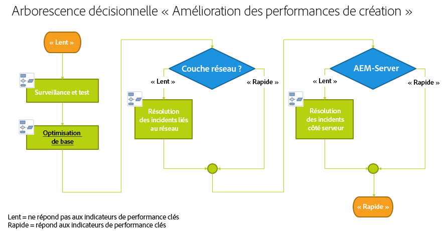
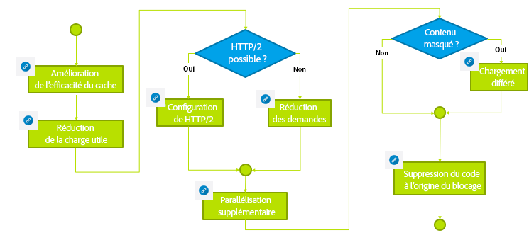

# Résolution des incidents{#troubleshooting}

Cette section comprend des informations détaillées sur les journaux qui vous permettent de résoudre les problèmes éventuels. Elle contient également des informations sur les problèmes que vous pouvez rencontrer avec AEM.

## Dépannage des performances d’auteur {#troubleshoot-author-performance}

L’analyse de la lenteur de la performance sur l’instance de création peut s’avérer compliquée. Il est tout d’abord nécessaire d’identifier sur quel niveau de la pile technologique la performance décroît.

L’arborescence décisionnelle suivante fournit les directives nécéssaires pour réduire le goulet d’étranglement.

## Optimisation de base {#basic-optimization}

## Configuration des fichiers journaux et des journaux d’audit {#configuring-log-files-and-audit-logs}

AEM enregistre des journaux détaillés que vous souhaiterez peut-être configurer pour résoudre les problèmes d’installation. Pour plus d’informations, voir la section [Utilisation des enregistrements d’audit et des fichiers journaux](/help/sites-deploying/monitoring-and-maintaining.md#working-with-audit-records-and-log-files).

## Utilisation de l’option d’informations détaillées {#using-the-verbose-option}

Lorsque vous début AEM WCM, vous pouvez ajouter l’option -v (verbose) à la ligne de commande comme dans : java -jar cq-wcm-quickstart-&lt;version>.jar -v.

L’option d’informations détaillées affiche une partie de la sortie du journal Quickstart sur la console. Elle peut donc être utilisée pour le dépannage.

## Problèmes d’installation courants {#common-installation-issues}

La section ci-après décrit quelques problèmes d’installation et les solutions pour les résoudre.

### Lorsque vous double-cliquez sur le fichier Quickstart jar, rien ne se produit ou le fichier s’ouvre dans un autre programme (par exemple, le gestionnaire d’archives). {#double-clicking-the-quickstart-jar-does-not-have-any-effect-or-opens-the-jar-file-with-another-program-for-example-archive-manager}

Cela indique généralement un problème de configuration de l’environnement de bureau de votre système d’exploitation pour l’ouverture de fichiers avec l’extension .jar. Elle peut également indiquer que Java n’est pas installé sur votre ordinateur ou que vous utilisez une version de Java qui n’est pas prise en charge.

Comme les fichiers jar utilisent le format ZIP très répandu, certains programmes d’archivage peuvent automatiquement configurer le poste de travail pour qu’il ouvre les fichiers .jar en tant que fichiers d’archive.

Pour résoudre ce problème, procédez comme suit :

* Vérifiez que Java version 1.6 est au moins installé sur votre ordinateur.
* Utilisez un menu contextuel (qui s’affiche généralement en cliquant avec le bouton droit de la souris) avec le fichier Quickstart de la gestion de contenu web AEM et sélectionnez la commande Ouvrir avec.
* Vérifiez si Java ou Sun Java est répertorié. Si c’est le cas, essayez d’exécuter la gestion de contenu web AEM avec ce programme. Si plusieurs versions de Java sont installées sur votre ordinateur, sélectionnez la version qui est prise en charge.

   À cette étape, si votre système d’exploitation affiche une option permettant de toujours utiliser le programme sélectionné pour exécuter les fichiers .jar; sélectionnez cette option. Lorsque vous double-cliquez sur le fichier .jar, il doit dorénavant s’ouvrir.

* Parfois, la réinstallation de la version de Java prise en charge peut permettre de restaurer l’association correcte.
* Vous pouvez toujours exécuter CRX à partir d’une ligne de commande ou de scripts start/stop, comme décrit précédemment dans ce document.

### Mon application qui s’exécute sur CRX génère des erreurs de mémoire insuffisante. {#my-application-running-on-crx-throws-out-of-memory-errors}

>[!NOTE]
>
>Voir également [Analyse des problèmes de mémoire](https://helpx.adobe.com/experience-manager/kb/AnalyzeMemoryProblems.html).

CRX nécessite peu de mémoire. Si les exigences en matière de mémoire de l’application qui s’exécute dans CRX sont plus élevées ou si l’application demande des opérations qui consomment beaucoup de mémoire, (des transactions volumineuses, par exemple), l’instance JVM dans laquelle s’exécute CRX doit être démarrée avec les paramètres de mémoire adéquats.

Utilisez les options de la commande Java pour définir les paramètres de mémoire de la JVM (par exemple, java -Xmx512m -jar crx&amp;ast;.jar pour définir la taille du tas sur 512 Mo).

Spécifiez l’option de paramétrage de la mémoire lors du démarrage de la gestion de contenu web AEM à partir d’une ligne de commande. Les scripts start/stop de la gestion de contenu web AEM ou les scripts personnalisés pour la gestion du démarrage de la gestion de contenu web AEM peuvent être également modifiés afin de définir les paramètres de mémoire requis.

Si vous avez déjà défini les segments de mémoire sur 512 Mo, vous souhaiterez peut-être analyser davantage l’erreur de mémoire en créant un vidage de segments de mémoire :

Pour créer automatiquement un vidage de segments de mémoire lorsque la mémoire est insuffisante, utilisez la commande suivante :

java -Xmx256m -XX:+HeapDumpOnOutOfMemoryError -jar &amp;ast;.jar

Cette commande génère un fichier de vidage de segments de mémoire (**java_...hprof**) dès que la mémoire du processus est insuffisante. Le processus peut continuer à s’exécuter après la génération du vidage de segments de mémoire. En règle générale, un fichier est suffisant pour analyser le problème.

### Après avoir double-cliqué sur Quickstart AEM, l’écran de bienvenue d’AEM ne s’affiche pas dans le navigateur. {#the-aem-welcome-screen-does-not-display-in-the-browser-after-double-clicking-aem-quickstart}

Dans certains cas, l’écran de bienvenue de la gestion de contenu web AEM ne s’affiche pas automatiquement bien que le référentiel s’exécute correctement. Ce problème peut être lié à la configuration du système d’exploitation ou du navigateur ou à d’autres facteurs similaires.

Dans ce cas, la fenêtre Quickstart affiche le message suivant : « Démarrage de la gestion de contenu web AEM. En attente du démarrage du serveur... » Si ce message s’affiche relativement longtemps, saisissez manuellement l’URL de la gestion de contenu web AEM dans la fenêtre du navigateur, en utilisant le port 4502 par défaut ou le port sur lequel s’exécute l’instance : http://localhost:4502/.

Les journaux peuvent également indiquer la raison pour laquelle le navigateur ne démarre pas.

Parfois, la fenêtre Quickstart de la gestion de contenu web AEM affiche le message « La gestion de contenu web AEM s’exécute sur http://localhost:port/ » et ne navigateur ne démarre pas automatiquement. Dans ce cas, cliquez sur l’URL dans la fenêtre Quickstart de la gestion de contenu web AEM (il s’agit d’un lien hypertexte) ou saisissez manuellement l’URL dans le navigateur.

Si toutes les autres solutions échouent, consultez les journaux pour déterminer ce qui s’est passé.

## Résolutions des problèmes d’installation avec un serveur d’applications {#troubleshooting-installations-with-an-application-server}

### Lorsqu’une page geometrixx-outdoor est demandée, l’erreur Page introuvable est renvoyée.{#page-not-found-returned-when-requesting-a-geometrixx-outdoor-page}

**S’applique à WebLogic 10.3.5 et JBoss 5.1**

Lorsqu’une demande de page geometrixx-outdoors/en renvoie une erreur 404 (Page introuvable), vérifiez que vous avez défini la propriété sling supplémentaire dans le fichier sling.properties de ces serveurs d’applications.

Pour plus d’informations, reportez-vous à la procédure *Déployer une application web AEM*.

### La taille de l’en-tête de réponse peut être supérieure à 4 Ko.{#response-header-size-can-be-greater-than-kb}

Les erreurs 502 peuvent indiquer que le serveur web n’est pas en mesure de gérer la taille de l’en-tête de réponse HTTP AEM. AEM peut générer des en-têtes de réponse HTTP qui comprennent des cookies dont la taille est supérieure à 4 Ko. Vérifiez que le conteneur de servlets est configuré de sorte à ce que la taille d’en-tête de réponse maximale puisse dépasser 4 Ko.

Par exemple, pour Tomcat 7.0, l’attribut maxHttpHeaderSize du [connecteur HTTP](https://tomcat.apache.org/tomcat-7.0-doc/config/http.html) contrôle les limites de la taille d’en-tête.

## Désinstallation d’Adobe Experience Manager {#uninstalling-adobe-experience-manager}

Dans la mesure où AEM est installé dans un seul répertoire, un utilitaire de désinstallation n’est pas nécessaire. La désinstallation peut consister uniquement à supprimer l’intégralité du répertoire d’installation, bien que la désinstallation d’AEM dépende du résultat que vous souhaitez obtenir et du type de stockage persistent utilisé.

Si le stockage persistent est incorporé dans le répertoire d’installation (dans l’installation TarPM par défaut, par exemple), la suppression des dossiers entraîne également celle des données.

>[!NOTE]
>
>Adobe conseille vivement de sauvegarder le référentiel avant de supprimer AEM. Si vous supprimez l’intégralité du répertoire &lt;cq-installation-directory>, vous supprimez le référentiel. Pour conserver les données du référentiel avant la suppression, déplacez ou copiez le dossier &lt;cq-installation-directory>/crx-quickstart/repository dans un autre emplacement avant de supprimer les autres dossiers.

Si votre installation AEM utilise un système de stockage externe, comme un serveur de base de données, la suppression du dossier n’entraîne pas la suppression automatique des données, mais elle supprime la configuration du stockage, ce qui rend difficile la restauration du contenu JCR.

### Les fichiers JSP ne sont pas compilés sur JBoss. {#jsp-files-are-not-compiled-on-jboss}

Si vous installez ou mettez à jour les fichiers JSP dans Experience Manager sur JBoss et si les servlets correspondants ne sont pas compilés, vérifiez que le compilateur JSP JBoss est correctement configuré. For information, see the
[JSP Compilation Issues in JBoss](https://helpx.adobe.com/experience-manager/kb/jsps-dont-compile-jboss.html) article.
