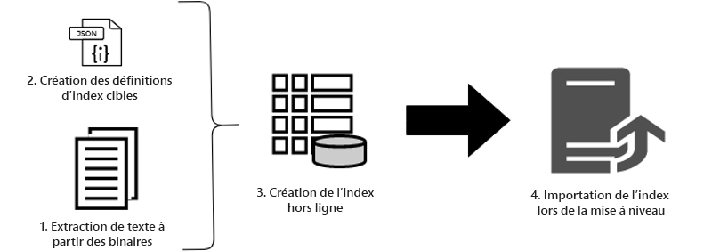
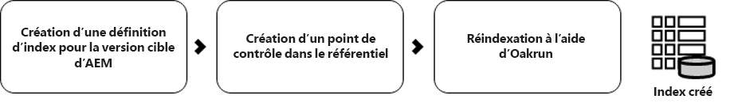

# Utilisation de la réindexation hors connexion pour réduire les temps d&#39;inactivité lors d&#39;une mise à niveau {#offline-reindexing-to-reduce-downtime-during-upgrades}

## Présentation {#introduction}

L’un des principaux défis de la mise à niveau de Adobe Experience Manager est le temps d’inactivité associé à l’environnement d’auteur lorsqu’une mise à niveau statique est effectuée. Les auteurs de contenu ne pourront pas accéder à l’environnement pendant une mise à niveau. Par conséquent, il est souhaitable de réduire au minimum le temps nécessaire à l’exécution de la mise à niveau. Pour les grands référentiels, en particulier les projets AEM Assets, qui disposent généralement de grands entrepôts de données et d’un niveau élevé de téléchargements de ressources par heure, la réindexation des index Oak prend une part significative du temps de mise à niveau.

Cette section décrit comment utiliser l&#39;outil d&#39;exécution Oak pour réindexer le référentiel **avant** d&#39;effectuer la mise à niveau, réduisant ainsi le temps d&#39;inactivité pendant la mise à niveau réelle. Les étapes présentées peuvent être appliquées aux index [Lucene](https://jackrabbit.apache.org/oak/docs/query/lucene.html) pour les versions AEM 6.4 et ultérieures.

## Présentation {#overview}

De nouvelles versions de l’AEM introduisent des modifications aux définitions d’index Oak au fur et à mesure que l’ensemble de fonctionnalités est développé. Les modifications apportées aux index Oak forcent la réindexation lors de la mise à niveau de l’instance AEM. La réindexation est coûteuse pour les déploiements de ressources, car le texte des ressources (par exemple, le texte du fichier pdf) est extrait et indexé. Avec les référentiels MongoMK, les données sont conservées sur le réseau, ce qui augmente encore le temps nécessaire à la réindexation.

Le problème auquel la plupart des clients sont confrontés au cours d’une mise à niveau est la réduction de la durée d’inactivité. La solution consiste à **ignorer** l’activité de réindexation au cours de la mise à niveau. Pour ce faire, vous pouvez créer les nouveaux index **antérieurs** pour effectuer la mise à niveau, puis simplement les importer pendant la mise à niveau.

## Approche {#approach}



L&#39;idée est de créer l&#39;index avant la mise à niveau, par rapport aux définitions d&#39;index de la version AEM cible à l&#39;aide de l&#39;outil [Oak-run](/help/sites-deploying/indexing-via-the-oak-run-jar.md). Le diagramme ci-dessus montre l&#39;approche de réindexation hors ligne.

En outre, il s&#39;agit de l&#39;ordre des étapes décrit dans l&#39;approche :

1. Le texte des binaires est extrait en premier.
2. Les définitions d&#39;index de cible sont créées
3. Les index hors ligne sont créés.
4. Les index sont ensuite importés pendant le processus de mise à niveau.

### Extraction de texte {#text-extraction}

Pour activer l’indexation complète dans l’AEM, le texte des fichiers binaires tels que PDF est extrait et ajouté à l’index. Il s&#39;agit généralement d&#39;une étape coûteuse du processus d&#39;indexation. L’extraction textuelle est une étape d’optimisation recommandée, en particulier pour la réindexation des référentiels de ressources lorsqu’ils stockent un grand nombre de fichiers binaires.


Le texte des binaires stockés dans le système peut être extrait à l&#39;aide d&#39;un outil de production de chêne avec la bibliothèque tika. Un clone des systèmes de production peut être pris avant la mise à niveau et peut être utilisé pour ce processus d&#39;extraction de texte. Ce processus crée ensuite la banque de texte en suivant les étapes suivantes :

**1. Parcourir le référentiel et rassembler les détails des binaires**

Cette étape génère un fichier CSV contenant un tuple de binaires, contenant un chemin d’accès et un ID de blob.

Exécutez la commande ci-dessous à partir du répertoire d&#39;où vous souhaitez créer l&#39;index. L’exemple ci-dessous suppose que le répertoire racine du référentiel est utilisé.

```
java java -jar oak-run.jar tika <nodestore path> --fds-path <datastore path> --data-file text-extraction/oak-binary-stats.csv --generate
```

Où `nodestore path` correspond à `mongo_ur` ou `crx-quickstart/repository/segmentstore/`

Utilisez le paramètre `--fake-ds-path=temp` au lieu de `–fds-path` pour accélérer le processus.

**2. Réutilisation de la banque de texte binaire disponible dans l’index existant**

Supprimez les données d’index du système existant et extrayez la banque de texte.

Vous pouvez vider les données d’index existantes à l’aide de la commande suivante :

```
java -jar oak-run.jar index <nodestore path> --fds-path=<datastore path> --index-dump
```

Où `nodestore path` correspond à `mongo_ur` ou `crx-quickstart/repository/segmentstore/`

Ensuite, utilisez le vidage d’index ci-dessus pour renseigner la boutique :

```
java -jar oak-run.jar tika --data-file text-extraction/oak-binary-stats.csv --store-path text-extraction/store --index-dir ./indexing-result/index-dumps/<oak-index-name>/data populate
```

Où `oak-index-name` est le nom de l&#39;index de texte complet, par exemple &quot;lucene&quot;.

**3. Exécutez le processus d’extraction de texte à l’aide de la bibliothèque tika pour les fichiers binaires manqués à l’étape suivante**

```
java -cp oak-run.jar:tika-app-1.21.jar org.apache.jackrabbit.oak.run.Main tika --data-file text-extraction/oak-binary-stats.csv --store-path text-extraction/store --fds-path <datastore path> extract
```

Où `datastore path` est le chemin d’accès au magasin de données binaire.

La banque de texte créée peut être mise à jour et réutilisée pour réindexer des scénarios futurs.

Pour plus d’informations sur le processus d’extraction de texte, consultez la [documentation à exécution automatique](https://jackrabbit.apache.org/oak/docs/query/pre-extract-text.html).

### Réindexation hors connexion {#offline-reindexing}



Créez l’index Lucene hors ligne avant la mise à niveau. Si vous utilisez MongoMK, il est recommandé de l’exécuter directement sur l’un des noeuds MongoMk, car cela évite la surcharge réseau.

Pour créer l&#39;index hors ligne, procédez comme suit :

**1. Générer des définitions d’index Oak Lucene pour la version AEM de l’cible**

Supprimez les définitions d’index existantes. Les définitions d&#39;index qui ont fait l&#39;objet de modifications ont été générées à l&#39;aide de l&#39;ensemble de référentiel Granite de l&#39;Adobe de la version AEM cible et de chêne-run.

Pour vider la définition d&#39;index de l&#39;instance d&#39;AEM **source**, exécutez la commande suivante :

>[!NOTE]
>
>Pour plus de détails sur les définitions des indices de dumping, consultez la [documentation sur les chênes](https://jackrabbit.apache.org/oak/docs/query/oak-run-indexing.html#async-index-data).

```
java -jar oak-run.jar index --fds-path <datastore path> <nodestore path> --index-definitions
```

Où `datastore path` et `nodestore path` proviennent de l&#39;instance d&#39;AEM **source**.

Ensuite, générez des définitions d&#39;index à partir de la version AEM **cible** à l&#39;aide du lot de référentiel Granite de la version de cible.

```
java -cp oak-run.jar:bundle-com.adobe.granite.repository.jar org.apache.jackrabbit.oak.index.IndexDefinitionUpdater --in indexing-definitions_source.json --out merge-index-definitions_target.json --initializer com.adobe.granite.repository.impl.GraniteContent
```

>[!NOTE]
>
> Le processus de création de définition d&#39;index ci-dessus n&#39;est pris en charge qu&#39;à partir de la version `oak-run-1.12.0`. Le ciblage est effectué à l’aide du lot de référentiel Granite `com.adobe.granite.repository-x.x.xx.jar`.

Les étapes ci-dessus créent un fichier JSON appelé `merge-index-definitions_target.json` qui est la définition d’index.

**2. Créer un point de contrôle dans le référentiel**

Créez un point de contrôle dans l’instance d’AEM de production **source** avec une longue durée de vie. Ceci doit être fait avant le clonage du référentiel.

Via la console JMX située à `http://serveraddress:serverport/system/console/jmx`, accédez à `CheckpointMBean` et créez un point de contrôle avec une durée de vie suffisante (par exemple, 200 jours). Pour ce faire, appelez `CheckpointMBean#createCheckpoint` avec `17280000000` comme argument pour la durée de vie en millisecondes.

Une fois cette opération effectuée, copiez l’identifiant de point de contrôle nouvellement créé et validez la durée de vie à l’aide de JMX `CheckpointMBean#listCheckpoints`.

>[!NOTE]
>
> Ce point de contrôle sera supprimé lors de l&#39;importation ultérieure de l&#39;index.

Pour plus d&#39;informations, consultez [création de points de contrôle](https://jackrabbit.apache.org/oak/docs/query/oak-run-indexing.html#out-of-band-create-checkpoint) dans la documentation de Oak.

**Exécution de l’indexation hors connexion pour les définitions d’index générées**

La réindexation de Lucene peut être effectuée hors ligne à l&#39;aide d&#39;une exécution au chêne. Ce processus crée des données d&#39;index dans le disque sous `indexing-result/indexes`. Il n&#39;écrit **pas** dans le référentiel et ne nécessite donc pas d&#39;arrêter l&#39;instance AEM en cours d&#39;exécution. La banque de texte créée est intégrée à ce processus :

```
java -Doak.indexer.memLimitInMB=500 -jar oak-run.jar index <nodestore path> --reindex --doc-traversal-mode --checkpoint <checkpoint> --fds-path <datastore path> --index-definitions-file merge-index-definitions_target.json --pre-extracted-text-dir text-extraction/store

Sample <checkpoint> looks like r16c85700008-0-8
—fds-path: path to data store.
--pre-extracted-text-dir: Directory of pre-extracted text.
merge-index-definitions_target: JSON file having merged definitions for the target AEM instance. indexes in this file will be re-indexed.
```

L&#39;utilisation du paramètre `--doc-traversal-mode` est pratique avec les installations MongoMK car elle améliore considérablement le temps de réindexation en faisant basculer le contenu du référentiel dans un fichier plat local. Cependant, il nécessite un espace disque supplémentaire de doublon de la taille du référentiel.

Dans le cas de MongoMK, ce processus peut être accéléré si cette étape est exécutée dans une instance plus proche de l’instance MongoDB. Si l&#39;exécution est effectuée sur le même ordinateur, la surcharge réseau peut être évitée.

Vous trouverez d&#39;autres détails techniques dans la [documentation relative à l&#39;indexation ](https://jackrabbit.apache.org/oak/docs/query/oak-run-indexing.html).

### Importation d&#39;index {#importing-indexes}

Avec AEM 6.4 et les versions plus récentes, AEM a la capacité intégrée d&#39;importer des index à partir du disque au démarrage. Le dossier `<repository>/indexing-result/indexes` est surveillé pour la présence de données d&#39;index au démarrage. Vous pouvez copier l’index précréé à l’emplacement ci-dessus pendant le processus de mise à niveau [](in-place-upgrade.md#performing-the-upgrade) avant de commencer avec la nouvelle version du fichier jar AEM **cible**. AEM l&#39;importe dans le référentiel et supprime le point de contrôle correspondant du système. Ainsi, un réindice est complètement évité.

## Autres conseils et dépannage {#troubleshooting}

Vous trouverez ci-dessous quelques conseils utiles et des instructions de dépannage.

### Réduire l&#39;impact sur le système de production en direct {#reduce-the-impact-on-the-live-production-system}

Il est recommandé de cloner le système de production et de créer l’index hors ligne à l’aide du clone. Cela élimine tout impact potentiel sur le système de production. Toutefois, le point de contrôle requis pour importer l&#39;index doit être présent dans le système de production. Par conséquent, la création d&#39;un point de contrôle avant de prendre le clone est critique.

### Préparation d’un Runbook et d’une série d’essais {#prepare-a-runbook-and-trial-run}

Il est recommandé de préparer un [Runbook](https://docs.adobe.com/content/help/en/experience-manager-65/deploying/upgrading/upgrade-planning.html#building-the-upgrade-and-rollback-runbook) et d&#39;effectuer quelques essais avant d&#39;exécuter la mise à niveau en production.

### Mode Doc Traversal Avec Indexation Hors Ligne {#doc-traversal-mode-with-offline-indexing}

L’indexation hors ligne nécessite plusieurs traversées de l’ensemble du référentiel. Avec les installations MongoMK, le référentiel est accessible via le réseau et a un impact sur les performances du processus d&#39;indexation. L&#39;une des options consiste à exécuter le processus d&#39;indexation hors ligne sur le réplica MongoDB lui-même, ce qui éliminera la surcharge réseau. Une autre option est l’utilisation du mode de traversée de documents.

Le mode de traversée de document peut être appliqué en ajoutant le paramètre de ligne de commande `—doc-traversal` à la commande oak-run pour l&#39;indexation hors ligne. Ce mode conserve une copie de l&#39;intégralité du référentiel sur le disque local en tant que fichier plat et l&#39;utilise pour exécuter l&#39;indexation.
