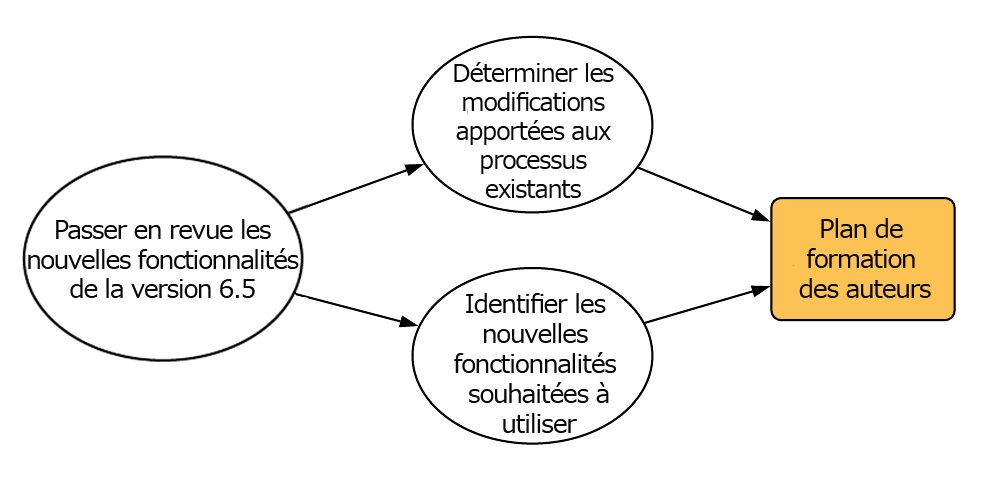
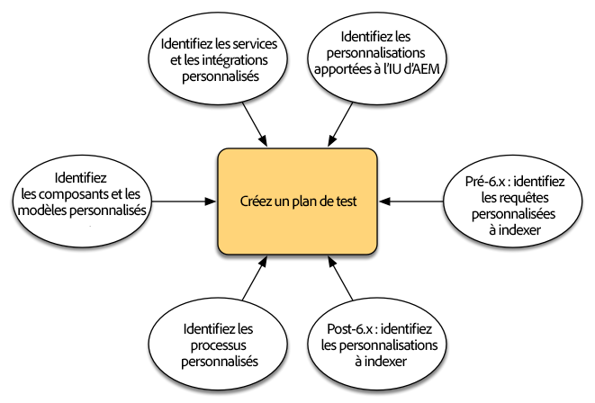
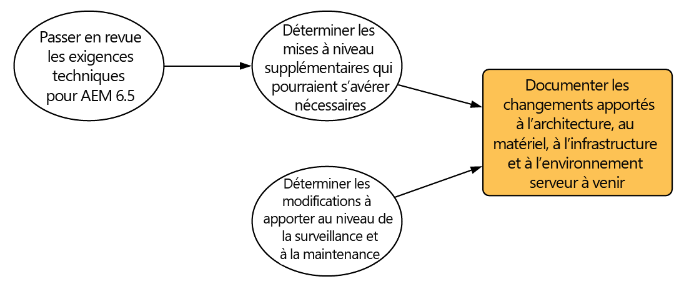
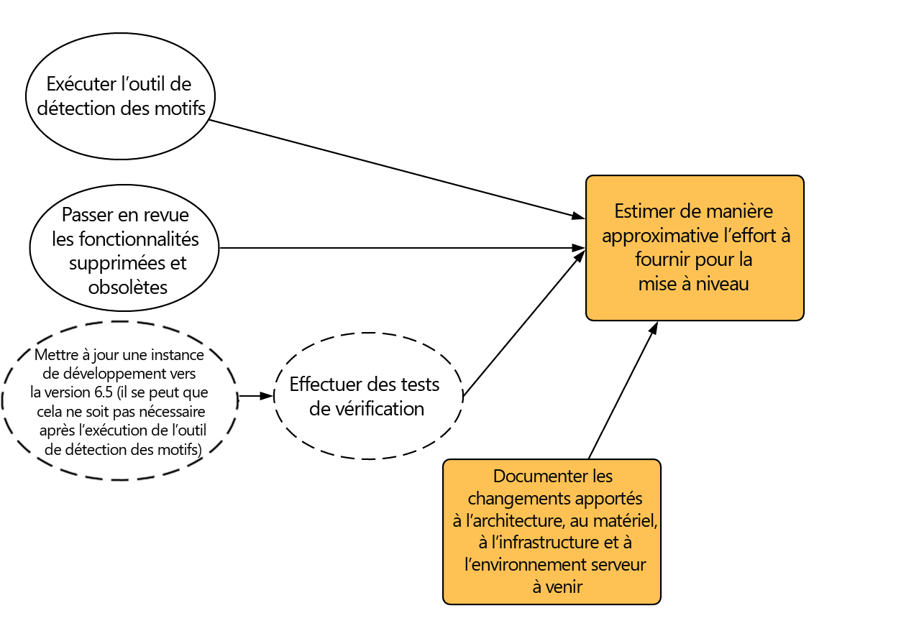
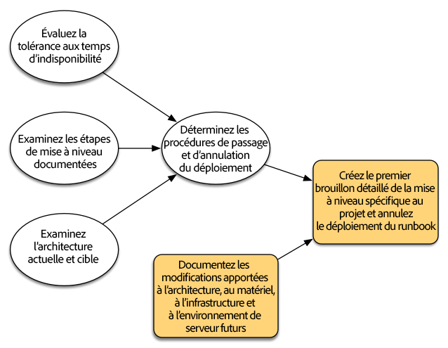
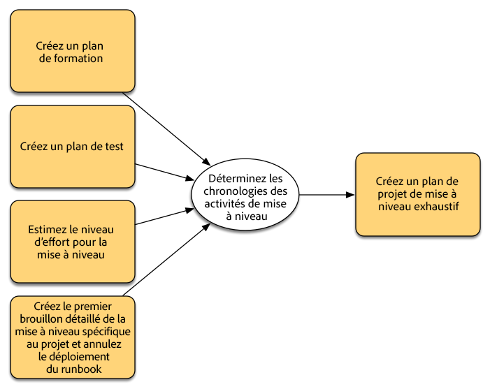
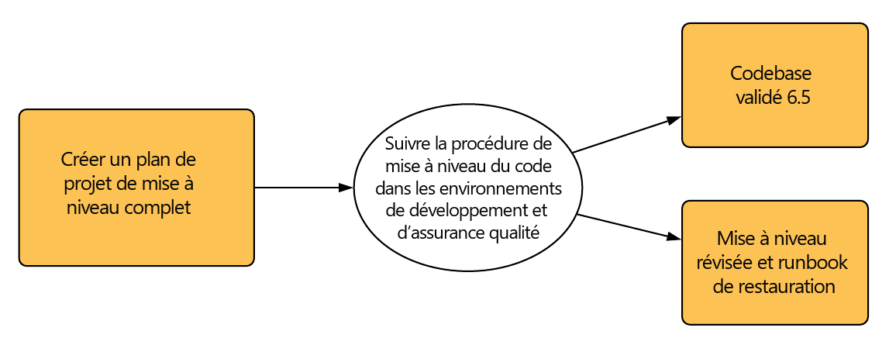
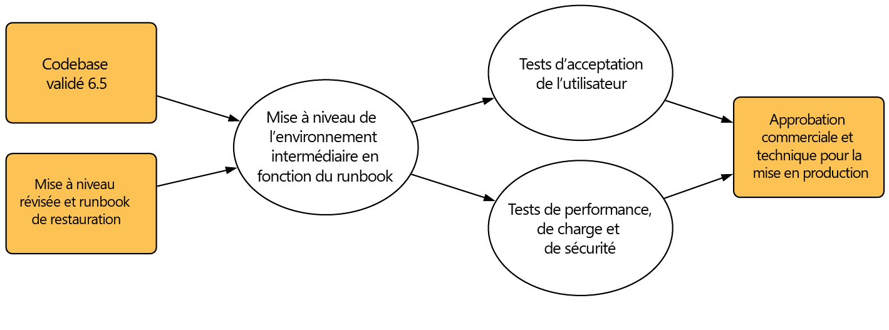
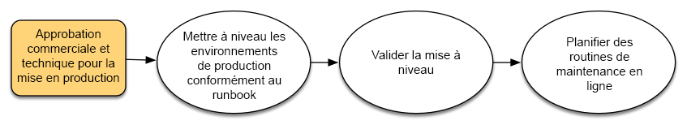

# Planification de la mise à niveau{#planning-your-upgrade}

## Présentation du projet AEM {#aem-project-overview}

AEM est souvent utilisé dans le cadre de déploiements à fort impact diffusés auprès de millions d’utilisateurs. Dans la plupart des cas, il existe des applications personnalisées déployées sur les instances, ce qui ajoute à la complexité. Tout effort de mise à niveau d’un tel déploiement doit être géré méthodiquement. 

Cet article permet d’établir des objectifs clairs, et d’identifier les phases et les documents nécessaires lors de la planification de la mise à niveau. Il se concentre sur l’exécution globale du projet et sur les recommandations. Il propose une vue d’ensemble des étapes de mise à niveau, mais il se réfère aux ressources techniques disponibles lorsque cela est approprié. Il doit être utilisé avec les ressources techniques disponibles citées dans le document.

Le processus de mise à niveau d’AEM nécessite une planification soigneuse, une analyse et des phases d’exécution avec des livrables clés définis pour chaque phase.

Notez qu&#39;il est possible de mettre à niveau directement AEM versions 6.0 et jusqu&#39;à 6.5. Les clients exécutant la version 5.6.x et antérieure doivent d&#39;abord effectuer la mise à niveau vers la version 6.0 ou ultérieure, avec la version 6.0(SP3) recommandée. Veuillez également noter que le nouveau format OAK Segment Tar est utilisé pour l’entrepôt de nœuds de segments depuis la version 6.3. Une migration du référentiel vers ce nouveau format est obligatoire, même pour les versions 6.0, 6.1 et 6.2.

>[!CAUTION]
>
>Si vous effectuez une mise à niveau d’AEM 6.2 vers AEM 6.3, vous devez effectuer la mise à niveau à partir des versions (**6.2-SP1-CFP1- -6.2SP1-CFP12.1**) ou des versions **6.2SP1-CFP15** et ultérieures. Dans le cas contraire, si vous **effectuez une mise à niveau de 6.2SP1-CFP13/6.2SP1CFP14** vers AEM 6.3, vous devez également effectuer une mise à niveau vers la version **6.3.2.2**. Sinon, AEM Sites ne fonctionnera plus après la mise à niveau.

## Portée et exigences de la mise à niveau {#upgrade-scope-requirements}

Vous trouverez ci-dessous la liste des domaines qui sont impactés dans un projet de mise à niveau AEM typique :

<table>
 <tbody>
  <tr>
   <td><strong>Composant</strong></td>
   <td><strong>Impact</strong></td>
   <td><strong>Description</strong></td>
  </tr>
  <tr>
   <td>Système d’exploitation</td>
   <td>Effets subtils, mais incertains</td>
   <td>Au moment de la mise à niveau d’AEM, il est aussi généralement temps de mettre à niveau le système d’exploitation, ce qui peut avoir un impact.</td>
  </tr>
  <tr>
   <td>Java Runtime</td>
   <td>Impact modéré </td>
   <td>AEM 6.3 nécessite JRE 1.7.x (64 bits) ou version ultérieure. JRE 1.8 est la seule version actuellement prise en charge par Oracle. </td>
  </tr>
  <tr>
   <td>Matériel</td>
   <td>Impact modéré</td>
   <td>Le nettoyage des révisions en ligne requiert de l’espace  disque égal à 25 % la taille du référentiel et à 15 % de l’epace cumulé disponible  pour être proprement effectué. Il se peut vous ayez besoin de mettre à niveau votre matériel  pour  garantir des ressources suffisantes, afin que le nettoyage des révisions en ligne puisse s’exécuter complètement. En outre, si la mise à niveau s’effectue à partir d’une version antérieure à AEM 6, des exigences de stockage supplémentaires peuvent être nécessaires. </td>
  </tr>
  <tr>
   <td>Référentiel de contenu (CRX ou Oak)</td>
   <td>Impact élevé</td>
   <td>À partir de la version 6.1, AEM ne prend pas en charge CRX2. Une migration  vers Oak (CRX3) est donc requise lorsque vous effectuez la mise à niveau à partir d’une ancienne version. AEM 6.3 a mis en place un nouvel entrepôt de nœuds de segments qui requiert également une migration.  L’outil crx2oak est utilisé dans ce but. </td>
  </tr>
  <tr>
   <td>Composants/contenu AEM</td>
   <td>Impact modéré </td>
   <td><code>/libs</code> et <code>/apps</code> sont facilement gérés par la mise à niveau, mais <code>/etc</code> nécessite généralement une réapplication manuelle des personnalisations.</td>
  </tr>
  <tr>
   <td>Services AEM</td>
   <td>Impact faible</td>
   <td>La plupart des services AEM principaux sont testés pour la mise à niveau. Il s’agit d’un domaine à faible impact.</td>
  </tr>
  <tr>
   <td>Services d’application personnalisée</td>
   <td>Impact faible à élevé</td>
   <td>En fonction de l’application et de la personnalisation, il peut exister  des dépendances dans JVM, les versions du système d’exploitation et quelques modifications associées à l’indexation,  car les index ne sont pas générés automatiquement dans Oak. </td>
  </tr>
  <tr>
   <td>Contenu d’application personnalisé</td>
   <td>Impact faible à élevé</td>
   <td>Le contenu qui n’est pas géré par la mise à niveau peut être sauvegardé  avant la mise à niveau, puis être à nouveau déplacé dans le référentiel.  La plupart du contenu peut être géré par l’outil de migration. </td>
  </tr>
 </tbody>
</table>

Il est important de vous assurer que votre système d’exploitation, Java Runtime, httpd et la version du dispatcher sont pris en charge. Pour plus d’informations, voir la page [Exigences techniques d’AEM 6.5](/help/sites-deploying/technical-requirements.md). La mise à niveau de ces composants doit être ajoutée à votre plan d’action et exécutée avant la mise à niveau d’AEM.

## Phases du projet {#project-phases}

La planification et l’exécution d’une mise à niveau AEM requiert un effort important. En vue de clarifier les différents efforts du processus, nous avons divisé les exercices de planification et d’exécution en des phases distinctes. Dans les sections ci-dessous, chaque phase entraîne la création d’un livrable, souvent exploité lors des étapes suivantes du projet.

### Planification pour la formation des auteurs  {#planning-for-author-training}

À chaque nouvelle version, de potentielles modifications de l’IU et des workflows de l’utilisateur peuvent être introduites. En outre, les nouvelles versions introduisent de nouvelles fonctionnalités dont l’entreprise peut tirer parti. Nous vous recommandons de passer en revue les modifications fonctionnelles qui ont été introduites et d’organiser un plan de formation des utilisateurs pour leurs permettre de les utiliser à bon escient. 

Les nouvelles fonctionnalités d’AEM 6.5 sont présentées dans [la section AEM d’adobe.com](/help/release-notes/release-notes.md). N’oubliez pas de noter toutes les modifications apportées aux interfaces utilisateur ou aux fonctionnalités des produits couramment utilisées dans vore organisation. Étudiez et notez toutes les nouvelles fonctionnalités pouvant être utiles à votre organisation. Après avoir étudié les changements d’AEM 6.5, élaborez un plan de formation pour vos auteurs. Cela peut impliquer l’exploitation de ressources disponibles, telles que les vidéos du site d’aide·ou la formation proposée via [les services d’apprentissage Adobe Digital](https://www.adobe.com/training.html).

### Création d’un plan de tests  {#creating-a-test-plan}

Chaque client effectue une implémentation d’AEM unique, personnalisée pour répondre aux besoins de son organisation. Par conséquent, il est important de définir toutes les personnalisations apportées au système pour pouvoir les inclure dans un plan de tests. Ce plan de tests va renforcer le processus de contrôle qualité réalisé sur l’instance mise à niveau.

L’environnement de production doit être dupliqué de manière exacte pour y effectuer les tests après la mise à niveau pour s’assurer que toutes les applications et codes personnalisés continuent de fonctionner comme il faut. Vous devez effectuer une regression avec toute vos personnalisations et exécuter des tests de performances, de chargement et de sécurité. Lorsque vous programmez votre plan de tests, veillez à couvrir toutes les personnalisations qui ont été apportées au système en plus des interfaces utilisateurs et des workflows prêts à l’emploi qui sont exploités durant vos activités quotidiennes. Ceux-ci peuvent comprendre des servlets et services OSGI, des intégrations à Adobe Marketing Cloud, des integrations avec des tiers via les connecteurs AEM, des intégrations tierces personnalisées, des modèles et composants personnalisés, des couches d’IU personnalisées dans AEM et des workflows personnalisés. Pour les clients migrant à partir d’une version antérieure à AEM 6, toute demande de personnalisation doit être analysée, car elle peut nécessiter une indexation. Pour les clients exécutants déjà la version 6.x d’AEM, ces requêtes doivent tout de même être testées pour s’assurer que leurs index continuent de fonctionner correctement après la mise à niveau.

### Identification des modifications nécessaires en matière d’architecture et d’infrastructure  {#determining-architectural-and-infrastructure-changes-needed}

Durant la mise à niveau, il est possible que vous ayez aussi besoin de mettre à niveau d’autres composants de votre équipement technique, comme le système d’exploitation ou JVM. De même, il est possible qu’en raison de modifications dans la structure du référentiel, du matériel supplémentaire soit nécessaire. Cela concerne en général uniquement les clients effectuant la migration à partir des instances antérieures à 6.x, mais il est important de prendre ce point en considération. Il se peut enfin que des modifications soient nécessaires à vos pratiques opérationnelles, dont les processus de surveillance, de maintenance et de sauvegarde, et de reprise sur sinistre. 

Passez en revue les exigences techniques pour AEM 6.5 et vérifiez si votre logiciel et votre matériel actuels sont suffisants. Pour toutes modifications à vos processus opérationnels, voir les documents suivants :

**Surveillance et maintenance :**

[Tableau de bord des opérations](/help/sites-administering/operations-dashboard.md)

[Bonnes pratiques en matière de surveillance des ressources](/help/assets/assets-monitoring-best-practices.md)

[Contrôle des ressources de serveur à l’aide de la console JMX](/help/sites-administering/jmx-console.md)

[Nettoyage de révision](/help/sites-deploying/revision-cleanup.md)

**Sauvegarde/restauration et reprise sur sinistre :**

[Sauvegarde et restauration](/help/sites-administering/backup-and-restore.md)

[Performance et évolutivité](/help/sites-deploying/performance.md)

[Exécution d’AEM avec TarMK Cold Standby](/help/sites-deploying/tarmk-cold-standby.md)

#### Observations relatives à la restructuration du contenu {#content-restructuring-considerations}

AEM s’accompagne de modifications au niveau de la structure du référentiel pour rendre les mises à niveau encore plus transparentes. Cela consiste notamment à déplacer le contenu du dossier /etc vers les dossiers /libs, /apps et /content, selon que le contenu appartient à Adobe ou à un client, ce qui limite les risques d’écrasement du contenu au cours des publications. La restructuration du référentiel a été effectuée de telle sorte qu&#39;elle ne nécessite pas de modifications du code au moment de la mise à niveau 6.5, bien qu&#39;il soit recommandé de consulter les détails à l&#39;adresse [Restructuration du référentiel dans AEM](/help/sites-deploying/repository-restructuring.md) lors de la planification d&#39;une mise à niveau.

### Évaluation de la complexité de la mise à niveau {#assessing-upgrade-complexity}

En raison de la grande variété en termes de quantité et de la nature des personnalisations que nos clients appliquent à leurs environnements AEM, il est important de passer du temps à déterminer le niveau général d’effort attendu pour votre mise à niveau.

Deux méthodes peuvent être utilisées pour évaluer la complexité de la mise à niveau. Lors d’une phase préliminaire, le nouvel outil de détection des motifs peut simplement être exécuté sur les instances AEM 6.1, 6.2 et 6.3. Il s’agit là de la façon la plus simple d’évaluer la complexité globale de la mise à niveau à l’aide des motifs générés. Le rapport de l’outil de détection des motifs comprend des motifs permettant d’identifier les API obsolètes utilisées par le codebase personnalisé (cette opération a été effectuée à l’aide des contrôles de compatibilité préalables à la mise à niveau dans la version 6.3).

Une fois l’évaluation initiale terminée, une procédure plus approfondie consiste à effectuer une mise à niveau sur une instance de test et à réaliser quelques tests de vérification. Adobe en propose également quelques. En outre, la liste de [fonctionnalités obsolètes et supprimées](/help/release-notes/deprecated-removed-features.md) doit être passée en revue, non seulement pour la version vers laquelle la mise à niveau va être effectuée, mais aussi pour toutes versions entre vos versions source et cible. Par exemple, si vous passez d’AEM 6.2 à 6.5, il est important de passer en revue les fonctionnalités supprimées et obsolètes d’AEM 6.3 en plus de celles d’AEM 6.5.

L’outil de détection des motifs introduit récemment devrait vous donner une idée assez précise de ce à quoi vous devez vous attendre la plupart du temps au cours d’une mise à niveau. Cependant, pour des personnalisations et déploiements plus complexes où vous avez des modifications incompatibles, vous pouvez mettre à niveau une instance de développement vers AEM 6.5 conformément aux instructions de [Mise à niveau statique](/help/sites-deploying/in-place-upgrade.md). Une fois l’opération terminée, effectuez un test de vérification de haut niveau dans cet environnement. L’objectif de cet exercice n’est pas d’épuiser l’inventaire exhaustif des scénarios de tests et de développer un inventaire formel des éléments défectueux, mais de donner une estimation approximative de la quantité de travail requise pour mettre à niveau le code pour assurer la compatibilité avec la version 6.5. Lorsque vous combinez l’[outil de détection des motifs](/help/sites-deploying/pattern-detector.md) avec les modifications architecturales identifiées dans la section précédente, une estimation approximative peut être fournie à l’équipe chargée de la direction du projet pour la planification de la mise à niveau.

### Développement de la mise à niveau et du runbook de restauration {#building-the-upgrade-and-rollback-runbook}

Même si la documentation du processus de mise à niveau d’une instance AEM est disponible, la structure de réseau, l’architecture de déploiement et les personnalisations de chaque client nécessitent une mise au point et une adaptation de cette approche. Ainsi, nous vous encourageons à passer en revue toute la documentation mise à votre disposition et à l’utiliser pour documenter un runbook spécifique au projet, exposant les procédures de restauration et de mise à niveau spécifiques à suivre dans votre environnement. Si vous effectuez une mise à niveau à partir de CRX2, assurez-vous d’evaluer le temps nécessaire pour passer de CRX2 à Oak. Cela peut prendre beaucoup de temps pour les grands référentiels.

Nous vous présentons les procédures de restauration et de mise à niveau dans la section [Procédure de mise à niveau ](/help/sites-deploying/upgrade-procedure.md), ainsi que la marche à suivre pour appliquer la mise à niveau lorsque vous effectuez une [mise à niveau statique](/help/sites-deploying/in-place-upgrade.md). Veuillez prendre connaissance de ces instructions en prenant en compte la structure de votre système, vos personnalisations, et votre tolérance vis-à-vis des temps d’arrêt, en établissant les procédures de restauration et de mise en marche que vous exécuterez durant la mise à niveau. Toutes les modifications relatives à la taille du seveur ou de l’architecture doivent être incluses lors de la création de votre runbook personnalisé. It est important de noter que cela doit être traité comme une version préliminaire. Pendant que votre équipe termine le contrôle qualité et les cycles de développement, et déploie la mise à niveau sur l’environnement d’évaluation, il est problable que vous ayez besoin de prendre des mesures supplémentaires. Ce document doit en principe contenir suffisamment d’informations pour permettre à tout membre du personnel d’exploitation d’effectuer une mise à niveau intégrale en s’y référant uniquement. 

### Développement d’un plan du projet  {#developing-a-project-plan}

Nous pouvons utiliser les résultats des exercices précédents pour développer un plan du projet qui couvre le calendrier prévu pour nos tests ou les efforts de développement, la formation et l’exécution de la mise à niveau. 

Un plan de projet complet doit comprendre :

* La finalisation du développement et des plans de tests
* La mise à niveau du développement et des environnements de contrôle qualité
* La mise à niveau de la base de code personnalisé pour AEM 6.5
* Un test de contrôle qualité et une période de mise au point
* Une mise à niveau de l’environnement d’évaluation
* Un test de l’intégration, de la performance et du chargement
* La certification de l’environnement 
* Mise en production

### Réalisation du développement et du contrôle qualité  {#performing-development-and-qa}

Nous proposons des procédures pour que la[ mise à niveau du code et des personnalisations](/help/sites-deploying/upgrading-code-and-customizations.md) soit compatible avec AEM 6.5. Pendant l’exécution de ce processus itératif, le runbook doit être modifié selon les besoins. Voir aussi [Compatibilité ascendante dans AEM 6.5](/help/sites-deploying/backward-compatibility.md) pour plus d&#39;informations sur la manière dont vos personnalisations peuvent rester rétrocompatibles dans la plupart des cas sans nécessiter de développement immédiatement après la mise à niveau.

Le processus de tests et de développement est généralement itératif. En raison des personnalisations, les modifications effectuées durant la mise à niveau peuvent potentiellement rendre toute une section du produit inutilisable. Une fois que les développeurs ont identifié la source du problème et que l’équipe de testeurs a accès à ces fonctionnalités, d’autres problèmes peuvent être découverts. Cela nécessite des modifications du processus de mise à niveau, qui doivent être ajoutées à votre runbook de mise à niveau personnalisé. Après plusieurs itérations de tests et de correctifs, la base du code doit être entièrement validée et prête à être déployée dans l’environnment d’évaluation. 

### Derniers tests  {#final-testing}

Nous recommandons d’effectuer une dernière série de tests après la certification de la base du code par l’équipe de contrôle qualité de votre organisation. Cette série de test consiste à valider votre runbook dans un environnment d’évaluation, puis à effectuer des tests de validation des utilisateurs, de performance et de sécurité. 

Cette étape est cruciale, car c’est la seule fois où vous êtes en mesure de valider les étapes du runbook dans un cadre similaire à un environnement de production. Après la mise à niveau de l’environnement, il est important de donner sufisamment de temps aux utilisateurs finaux pour qu’ils se connectent et passent en revue les activités effectuées en utilisant le système durant leurs activités quotidiennes. Il n’est pas rare que certains utilisateurs exploitent une partie du système qui n’avait jamais été examinée. L’identification et la correction des problèmes pouvant survenir dans ces parties avant le lancement peut aider à prévenir des arrêts de production coûteux. Comme une nouvelle version d’AEM contient d’importantes modifications à la plateforme sous-jacente, il est également important que vous fassiez des tests en matière de performance, de chargement et de sécurité sur le système, comme si vous le lanciez pour la première fois. 

### Exécution de la mise à niveau  {#performing-the-upgrade}

Une fois que l’authorisation finale a été donnée par toutes les parties prenantes, il est temps d’exécuter les procédures définies dans le runbook. Les étapes de mise à niveau et de restauration ont été présentées dans la section [Procédure de mise à niveau](/help/sites-deploying/upgrade-procedure.md)et les étapes d’installation lors de la réalisation d’une [mise à niveau statique](/help/sites-deploying/in-place-upgrade.md). Cela sert de point de référence.

Nous avons fourni quelques étapes dans les instructions de mise à niveau pour la validation de l’environnement. Celles-ci comprennent des vérifications de base, comme l’analyse des journaux de mise à niveau et la vérification du démarrage correct des lots OSGi. Cependant, nous recommandons de procéder à la validation également à l’aide de vos propres scénarios de test basés sur vos processus opérationnels. Nous recommandons aussi de vérifier le programme de nettoyage des révisions en ligne d’AEM, ainsi que d’autres routines associées, pour garantir qu’ils auront lieu durant une période calme pour votre organisation. Ces routines sont indispensables à la performance d’AEM sur le long terme.
