# Procédure de mise à niveau {#upgrade-procedure}

>[!NOTE]
>
>La mise à niveau nécessite un temps d’interruption au niveau de l’auteur, car la plupart des mises à niveau d’AEM sont exécutées sur place. En suivant ces bonnes pratiques, vous pouvez réduire ou éliminer le temps d’interruption au niveau de la publication.

Lors de la mise à niveau de vos environnements AEM, vous devez tenir compte des différences d’approche entre les environnements de création et de publication afin de limiter le temps d’interruption pour vos auteurs et vos utilisateurs finaux. Cette page décrit une procédure de haut niveau pour améliorer une topologie AEM en cours d’exécution sur une version d’AEM 6.x. Étant donné que la procédure diffèrent entre les niveaux d’auteur et de publication, ainsi que les déploiements basés sur Mongo et TarMK, chaque niveau et micronoyau a été répertorié dans une section distincte. Lors du déploiement, nous vous conseillons d’abord de mettre à niveau votre environnement de création, de déterminer les critères de réussite, puis de passer aux environnments de publication.

<!-->>[!IMPORTANT]
>Le temps d’inactivité pendant la mise à niveau peut être considérablement réduit en indexant le référentiel avant d’effectuer la mise à niveau. Pour plus d&#39;informations, reportez-vous à la section [Utilisation de la réindexation hors ligne pour réduire les temps d&#39;inactivité lors d&#39;une mise à niveau](/help/sites-deploying/upgrade-offline-reindexing.md)—>
>
## Niveau d’auteur TarMK {#tarmk-author-tier}

### Démarrage de la topologie {#starting-topology}

La topologie utilisée pour cette section se compose d’un serveur s’exécutant sur TarMK avec Cold Standby. La réplication se produit du serveur de l’auteur à la ferme de publication TarMK. Bien que cela ne soit pas illustré ici, cette approche peut également être utilisée pour les déploiements qui utilisent le déchargement. Assurez-vous d’effectuer la mise à niveau ou de reconstituer une instance de chargement sur la nouvelle version après avoir désactivé les agents de réplication sur l’instance d’auteur et avant de les autoriser à nouveau.

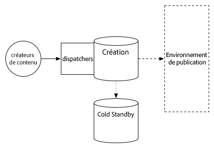

### Préparation de la mise à niveau {#upgrade-preparation}

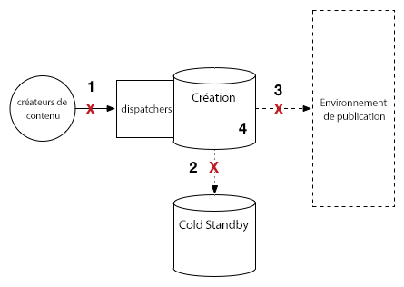

1. Arrêtez la création de contenu

1. Arrêtez l’instance de secours

1. Désactivez les agents de réplication sur l’auteur

1. Exécutez les [tâches de maintenance avant la mise à niveau](/help/sites-deploying/pre-upgrade-maintenance-tasks.md).

### Exécution de la mise à niveau {#upgrade-execution}

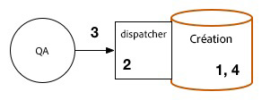

1. Exécutez la [mise à niveau sur place](/help/sites-deploying/in-place-upgrade.md)
1. Mettez à jour le module de dispatcher *si nécessaire*

1. Le contrôle qualité valide la mise à niveau

1. Fermez l’instance d’auteur.

### En cas de réussite {#if-successful}

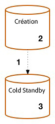

1. Copiez l’instance mise à niveau pour créer une nouvelle instance Cold Standby

1. Lancez l’instance d’auteur

1. Démarrez l’instance Standby.

### En cas d’échec (restauration) {#if-unsuccessful-rollback}

1. Démarrez l’instance Cold Standby en tant que nouvelle instance principale

1. Recréez l’environnement de création depuis l’instance Cold Standby.

## Cluster d’auteurs MongoMK {#mongomk-author-cluster}

### Démarrage de la topologie {#starting-topology-1}

La topologie utilisée pour cette section se compose d’un groupe d’auteurs MongoMK avec au moins deux instances d’auteur AEM, prises en charge par au moins deux bases de données MongoMK. Toutes les instances d’auteur partagent une banque de données. Ces étapes doivent s’appliquer aux entrepôts de données de fichier et S3. La réplication se produit des serveurs d’auteur à la ferme de publication TarMK.

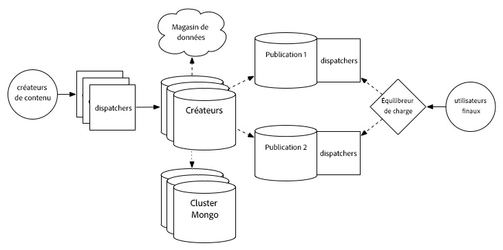

### Préparation de la mise à niveau {#upgrade-preparation-1}

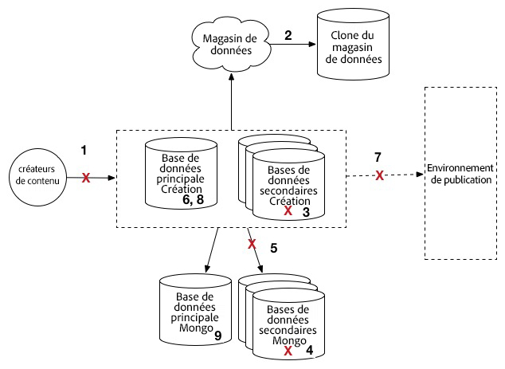

1. Arrêtez la création de contenu
1. Clonez l’entrepôt de données pour la sauvegarde
1. Arrêtez toutes les instances d’auteur AEM sauf une, votre instance d’auteur principale
1. Conservez uniquement un nœud MongoDB du jeu de réplication, votre instance Mongo principale
1. Mettez à jour le fichier `DocumentNodeStoreService.cfg` sur l’auteur principal pour refléter votre ensemble de réplication à un seul membre
1. Redémarrez l’auteur principal pour vous assurer qu’il redémarre correctement
1. Désactivez les agents de réplication sur l’auteur principal
1. Exécutez les [tâches de maintenance avant la mise à niveau](/help/sites-deploying/pre-upgrade-maintenance-tasks.md) sur l’instance d’auteur principale
1. Si nécessaire, mettez à niveau MongoDB vers la version 3.2 sur l’instance principale Mongo avec WiredTiger

### Exécution de la mise à niveau {#Upgrade-execution-1}

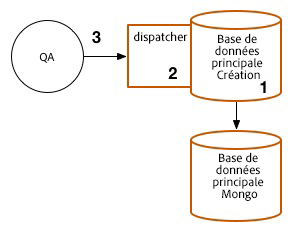

1. Exécutez une [mise à niveau sur place](/help/sites-deploying/in-place-upgrade.md) sur l’auteur principal
1. Mettez à jour le dispatcher ou le module web *si nécessaire*
1. Le contrôle qualité valide la mise à niveau

### En cas de réussite {#if-successful-1}

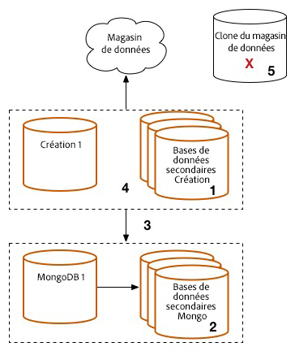

1. Créez de nouvelles instances d’auteur 6.5, connectées à votre instance de mise à niveau Mongo

1. Recréez les nœuds MongoDB qui ont été supprimés du cluster

1. Mettez à jour les fichiers `DocumentNodeStoreService.cfg` pour refléter l’ensemble de réplication complet

1. Redémarrez les instances d’auteur, une par une

1. Supprimez les entrepôt de données clonés.

### En cas d’échec (restauration)  {#if-unsuccessful-rollback-2}

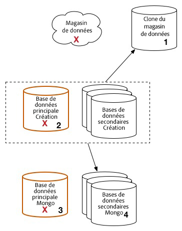

1. Reconfigurez les instances d’auteur secondaires pour établir la connexion à l’entrepôt de données cloné

1. Désactivez l’instance d’auteur principale mise à niveau

1. Désactivez l’instance principale Mongo mise à niveau.

1. Démarrez les instances secondaires Mongo, l’une d’entre elles faisant office d’instance principale

1. Configurez les fichiers `DocumentNodeStoreService.cfg` sur les instances d’auteur secondaires pour indiquer l’ensemble de réplication des instances Mongo qui ne sont pas encore mises à niveau

1. Démarrez les instances d’auteur secondaires

1. Nettoyez les instances d’auteur, le nœud Mongo et l’entrepôt de données mis à niveau.

## Ferme de publication TarMK {#tarmk-publish-farm}

### Ferme de publication TarMK {#tarmk-publish-farm-1}

La topologie utilisée pour cette section se compose de deux instances de publication TarMK, devancés par des dispatchers, eux-mêmes devancés par un équilibreur de charge. La réplication se produit du serveur de l’auteur à la ferme de publication TarMK.

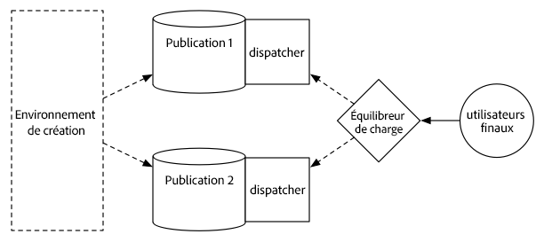

### Exécution de la mise à niveau {#upgrade-execution-2}

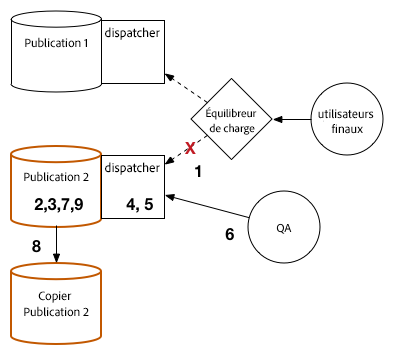

1. Arrêtez le trafic de l’instance de publication 2 à l’équilibreur de charge
1. Exécutez [pre-upgrade maintenance](/help/sites-deploying/pre-upgrade-maintenance-tasks.md) sur la publication 2
1. Exécutez [in-place upgrade](/help/sites-deploying/in-place-upgrade.md) sur la publication 2
1. Mettez à jour le dispatcher ou le module web *si nécessaire*
1. Videz le cache du dispatcher
1. Le contrôle qualité valide la publication 2 via le dispatcher, derrière le pare-feu
1. Désactivez la publication 2
1. Copiez l’instance de publication 2
1. Démarrez la publication 2

### En cas de réussite {#if-successful-2}

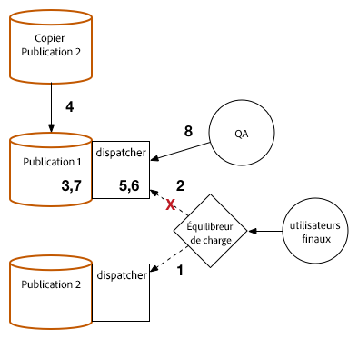

1. Activez le trafic vers la publication 2
1. Arrêter le trafic vers la publication 1
1. Arrêtez l’instance de publication 1
1. Remplacez la publication 1 avec une copie de la publication 2
1. Mettez à jour le dispatcher ou le module web *si nécessaire*
1. Videz le cache du dispatcher pour la publication 1
1. Démarrez la publication 1
1. Le contrôle qualité valide la publication 1 via le dispatcher, derrière le pare-feu

### En cas d’échec (restauration) {#if-unsuccessful-rollback-1}

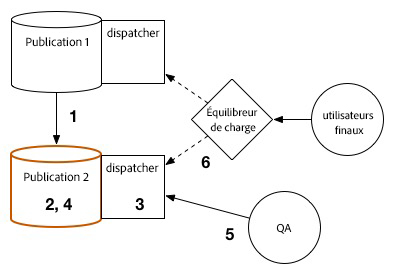

1. Créez une copie de la publication 1 
1. Remplacez la publication 2 avec une copie de la publication 1
1. Videz le cache du dispatcher pour la publication 2
1. Démarrez la publication 2
1. Le contrôle qualité valide la publication 2 via le dispatcher, derrière le pare-feu
1. Activez le trafic vers la publication 2

## Dernières étapes de mise à niveau {#final-upgrade-steps}

1. Activez le trafic vers la publication 1
1. Le contrôle qualité procède à la validation finale à partir d’une URL publique
1. Activez les agents de réplication de l’environnement de création
1. Reprenez la création de contenu
1. Effectuez les [vérifications d’après mise à niveau](/help/sites-deploying/post-upgrade-checks-and-troubleshooting.md).

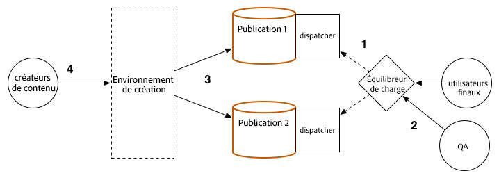

