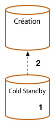

# Procédure de mise à niveau {#upgrade-procedure}

>[!NOTE]
>
>La mise à niveau nécessite un temps d’arrêt pour l’instance de création, car la plupart des mises à niveau d’Adobe Experience Manager (AEM) sont effectuées sur place. En suivant ces bonnes pratiques, vous pouvez réduire ou éliminer le temps d’arrêt de l’instance de publication.

Lors de la mise à niveau de vos environnements AEM, vous devez tenir compte des différences d’approche entre la mise à niveau des environnements de création ou de publication afin de minimiser les temps d’arrêt pour vos auteurs et autrices et vos utilisateurs et utilisatrices finaux. Cette page décrit la procédure de haut niveau pour mettre à niveau une topologie AEM en cours d’exécution sur une version d’AEM 6.x. Le processus étant différent entre les instances de création et de publication et les déploiements basés sur Mongo et TarMK, chaque niveau et micro-noyau a été répertorié dans une section distincte. Lors de l’exécution de votre déploiement, Adobe recommande d’abord de mettre à niveau votre environnement de création, de déterminer la réussite, puis de passer aux environnements de publication.

<!--
>[!IMPORTANT]
>
>The downtime during the upgrade can be significally reduced by indexing the repository before performing the upgrade. For more information, see [Using Offline Reindexing To Reduce Downtime During an Upgrade](/help/sites-deploying/upgrade-offline-reindexing.md)
-->

## Niveau de création TarMK {#tarmk-author-tier}

### Démarrer la topologie {#starting-topology}

La topologie utilisée pour cette section consiste en un serveur de création s’exécutant sur TarMK avec Cold Standby. La réplication se produit du serveur de création à la batterie de publication TarMK. Bien qu’elle ne soit pas illustrée ici, cette approche peut également être utilisée pour les déploiements qui utilisent le déchargement. Veillez à mettre à niveau ou à recréer l’instance de déchargement sur la nouvelle version après avoir désactivé les agents de réplication sur l’instance de création et avant de les réactiver.

### Préparation de la mise à niveau {#upgrade-preparation}

1. Arrêtez la création de contenu.

1. Arrêtez l’instance de secours.

1. Désactivez les agents de réplication sur l’instance de création.

1. Exécutez les [tâches de maintenance préalables à la mise à niveau](/help/sites-deploying/pre-upgrade-maintenance-tasks.md).

### Exécution de la mise à niveau {#upgrade-execution}

1. Exécutez la [mise à niveau sur place](/help/sites-deploying/in-place-upgrade.md).
1. Mettez à jour le module du Dispatcher *si nécessaire*.

1. Le contrôle qualité valide la mise à niveau.

1. Arrêtez l’instance de création.

### En cas de réussite {#if-successful}

1. Copiez l’instance mise à niveau pour créer une nouvelle instance Cold Standby.

1. Lancez l’instance de création.

1. Démarrez l’instance de secours.

### En cas d’échec (restauration) {#if-unsuccessful-rollback}

1. Démarrez l’instance Cold Standby en tant que nouvelle instance principale.

1. Recréez l’environnement de création depuis l’instance Cold Standby.

## Cluster de création MongoMK {#mongomk-author-cluster}

### Démarrer la topologie {#starting-topology-1}

La topologie utilisée pour cette section est constituée d’un cluster de création MongoMK avec au moins deux instances de création AEM, prises en charge par au moins deux bases de données MongoMK. Toutes les instances de création partagent un magasin de données. Ces étapes doivent s’appliquer aux magasins de données S3 et de fichiers. La réplication se produit des serveurs de création à la batterie de publication TarMK.

### Préparation de la mise à niveau {#upgrade-preparation-1}

1. Arrêtez la création de contenu.
1. Clonez le magasin de données pour la sauvegarde.
1. Arrêtez toutes les instances de création d’AEM sauf une, votre instance de création principale.
1. Conservez uniquement un nœud MongoDB du jeu de réplication, votre instance Mongo principale.
1. Mettez à jour le fichier `DocumentNodeStoreService.cfg` sur l’instance de création principale pour qu’il reflète votre jeu de réplication à un seul membre.
1. Redémarrez l’instance de création principale pour vous assurer qu’elle redémarre correctement.
1. Désactivez les agents de réplication sur l’instance de création principale.
1. Exécutez les [tâches de maintenance préalables à la mise à niveau](/help/sites-deploying/pre-upgrade-maintenance-tasks.md) sur l’instance de création principale.
1. Si nécessaire, mettez à niveau MongoDB vers la version 3.2 sur l’instance principale Mongo avec WiredTiger.

### Exécution de la mise à niveau {#Upgrade-execution-1}

1. Exécutez une [mise à niveau sur place](/help/sites-deploying/in-place-upgrade.md) sur l’instance de création principale.
1. Mettez à jour le Dispatcher ou le module web *si nécessaire*.
1. Le contrôle qualité valide la mise à niveau.

### En cas de réussite {#if-successful-1}

1. Créez de nouvelles instances de création 6.5, connectées à votre instance Mongo mise à niveau.

1. Recréez les nœuds MongoDB qui ont été supprimés du cluster.

1. Mettez à jour les fichiers `DocumentNodeStoreService.cfg` pour qu’ils reflètent le jeu de réplication complet.

1. Redémarrez les instances de création, une par une.

1. Supprimez les magasin de données clonés.

### En cas d’échec (restauration)  {#if-unsuccessful-rollback-2}

1. Reconfigurez les instances de création secondaires pour établir la connexion au magasin de données cloné.

1. Arrêtez l’instance de création principale mise à niveau.

1. Désactivez l’instance principale Mongo mise à niveau.

1. Démarrez les instances secondaires Mongo, l’une d’entre elles faisant office d’instance principale.

1. Configurez les fichiers `DocumentNodeStoreService.cfg` sur les instances de création secondaires pour indiquer l’ensemble de réplication des instances Mongo qui ne sont pas encore mises à niveau.

1. Démarrez les instances de création secondaires.

1. Nettoyez les instances de création, le nœud Mongo et le magasin de données mis à niveau.

## Ferme de publication TarMK {#tarmk-publish-farm}

### Ferme de publication TarMK {#tarmk-publish-farm-1}

La topologie supposée de cette section est composée de deux instances de publication TarMK, devant lesquelles les dispatchers sont eux-mêmes devancés par un équilibreur de charge. La réplication se produit du serveur de création à la batterie de publication TarMK.

### Exécution de la mise à niveau {#upgrade-execution-2}

1. Arrêtez le trafic vers l’instance de publication 2 au niveau de l’équilibreur de charge.
1. Exécutez la [maintenance préalable à la mise à niveau](/help/sites-deploying/pre-upgrade-maintenance-tasks.md) sur l’instance de publication 2.
1. Exécutez une [mise à jour sur place](/help/sites-deploying/in-place-upgrade.md) sur l’instance de publication 2.
1. Mettez à jour le Dispatcher ou le module web *si nécessaire*.
1. Videz le cache du Dispatcher.
1. Le contrôle qualité valide l’instance de publication 2 via le Dispatcher, derrière le pare-feu.
1. Arrêtez l’instance de publication 2.
1. Copiez l’instance de publication 2.
1. Démarrez l’instance de publication 2.

### En cas de réussite {#if-successful-2}

1. Activez le trafic vers l’instance de publication 2.
1. Arrêtez le trafic vers l’instance de publication 1.
1. Arrêtez l’instance de publication 1.
1. Remplacez l’instance de publication 1 par une copie de l’instance de publication 2.
1. Mettez à jour le Dispatcher ou le module web *si nécessaire*.
1. Videz le cache du Dispatcher pour l’instance de publication 1.
1. Démarrez l’instance de publication 1.
1. Le contrôle qualité valide l’instance de publication 1 via le Dispatcher, derrière le pare-feu.

### En cas d’échec (restauration) {#if-unsuccessful-rollback-1}

1. Créez une copie de l’instance de publication 1.
1. Remplacez l’instance de publication 2 par une copie de l’instance de publication 1.
1. Videz le cache du Dispatcher pour l’instance de publication 2.
1. Démarrez l’instance de publication 2.
1. Le contrôle qualité valide l’instance de publication 2 via le Dispatcher, derrière le pare-feu.
1. Activez le trafic vers l’instance de publication 2.

## Dernières étapes de mise à niveau {#final-upgrade-steps}

1. Activez le trafic vers l’instance de publication 1.
1. Le contrôle qualité procède à la validation finale à partir d’une URL publique.
1. Activez les agents de réplication de l’environnement de création.
1. Reprenez la création de contenu.
1. Effectuez les [vérifications d’après mise à niveau](/help/sites-deploying/post-upgrade-checks-and-troubleshooting.md).

