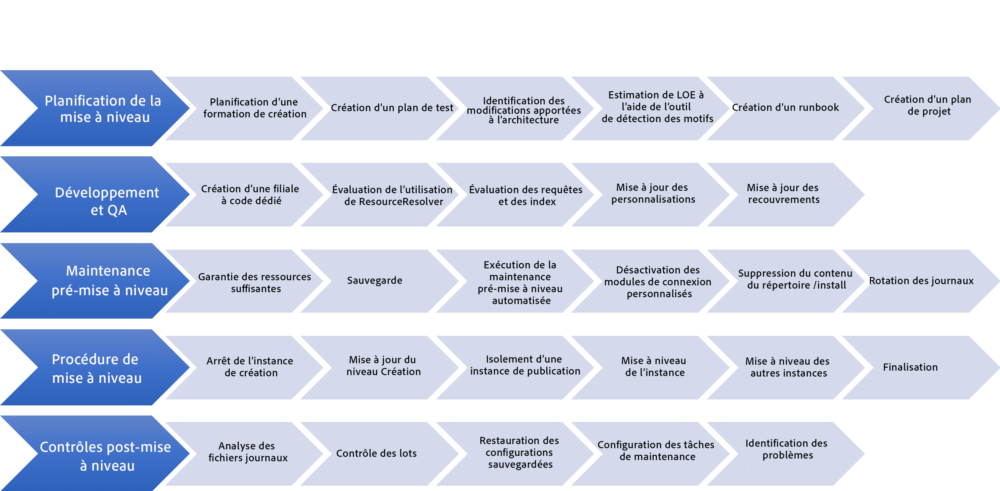
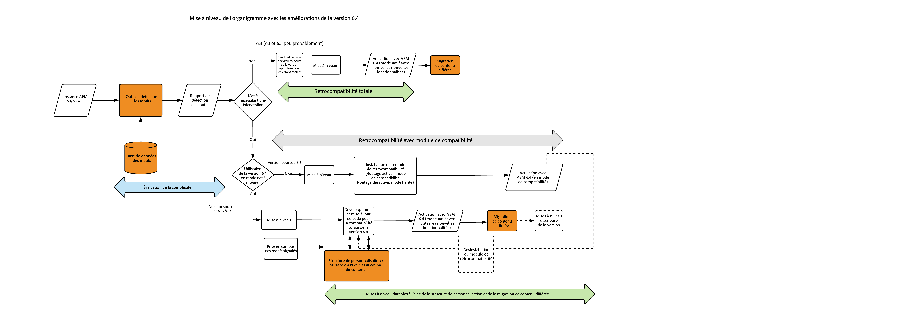

# Mise à niveau vers AEM 6.5 {#upgrading-to-aem}

Dans cette section, nous présentons la mise à niveau d’une installation AEM vers AEM 6.5 :

* [Planification de la mise à niveau](/help/sites-deploying/upgrade-planning.md)
* [Évaluation de la complexité de la mise à niveau à l’aide de l’outil de détection des motifs](/help/sites-deploying/pattern-detector.md)
* [Compatibilité descendante dans AEM 6.5](/help/sites-deploying/backward-compatibility.md)
* [Utilisation de la réindexation hors connexion pour réduire les temps d’inactivité lors d’une mise à niveau](/help/sites-deploying/upgrade-offline-reindexing.md)
* [Processus de mise à niveau](/help/sites-deploying/upgrade-procedure.md)
* [Code et personnalisations de la mise à niveau](/help/sites-deploying/upgrading-code-and-customizations.md)
* [Tâches de maintenance avant la mise à niveau](/help/sites-deploying/pre-upgrade-maintenance-tasks.md)
* [Réalisation d’une mise à niveau statique](/help/sites-deploying/in-place-upgrade.md)
* [Vérifications et dépannage après la mise à niveau](/help/sites-deploying/post-upgrade-checks-and-troubleshooting.md)
* [Mises à niveau possibles](/help/sites-deploying/sustainable-upgrades.md)
* [Migration différée du contenu](/help/sites-deploying/lazy-content-migration.md)
* [Restructuration des référentiels dans AEM 6.5](/help/sites-deploying/repository-restructuring.md)

Pour une référence conviviale aux instances d’AEM incluses dans ces procédures, les termes suivants sont utilisés tout au long de ces articles :

* L’instance *source* est l’instance AEM depuis laquelle vous mettez à niveau.
* L’instance *cible* est celle vers laquelle vous mettez à niveau.

>[!NOTE]
>
>Dans le cadre des efforts pour améliorer la fiabilité des mises à niveau, AEM a subi une restructuration complète des référentiels. Pour plus d’informations sur la façon de les aligner avec la nouvelle structure, voir[ Restructuration des référentiels dans AEM.](/help/sites-deploying/repository-restructuring.md)

## What Has Changed? {#what-has-changed}

Voici quelques changements majeurs mis en œuvre avec les dernières versions d’AEM :

AEM 6.0 a introduit le nouveau référentiel Jackrabbit Oak. Les gestionnaires de persistence ont été remplacés par les [micronoyaux](/help/sites-deploying/platform.md#contentbody_title_4). À partir de la version 6.1, CRX2 n’est plus pris en charge. L’outil de migration crx2oak doit être exécuté pour migrer les référentiels CRX2 à partir des instances 5.6.1. Pour plus d’informations, voir [Utilisation de l’outil de migration CRX2OAK](/help/sites-deploying/using-crx2oak.md). 

Si vous utilisez Asset Insights et que vous effectuez une mise à niveau à partir d’une version antérieure à AEM 6.2, les ressources doivent être migrées et doivent posséder des ID générés via un bean JMX. Lors de nos tests internes, 125 000 ressources ont été migrées en 1 heure dans un environnement TarMK, mais les résultats peuvent varier. 

La version 6.3 a introduit un nouveau format `SegmentNodeStore`, qui est la base de cette implémentation de TarMK. Si vous effectuez une mise à niveau à partir d’une version antérieure à AEM 6.3, une migration du référentiel est nécessaire dans le cadre de la mise à niveau, ce qui implique des interruptions du système.

L’équipe technique d’Adobe estime la durée du processus à environ 20 minutes. Veuillez noter que la réindexation n’est pas requise. En outre, une nouvelle version de l’outil crx2oak a été publiée pour fonctionner avec le nouveau format de référentiel.

**Cette migration n’est pas nécessaire dans le cas d’une mise à niveau d’AEM 6.3 vers AEM 6.5.**

Les tâche de maintenance avant la mise à niveau ont été optimisées dans le cadre de la prise en charge de l’automatisation.

Les options d’utilisation des lignes de commande de l’outil crx2oak ont été modifiées pour être adaptées à l’automatisation et pour prendre en charge plus de chemins de mise à niveau.

Les vérifications après la mise à niveau se sont également adaptées à l’automatisation.

Le nettoyage périodique des révisions et de l’entrepôt de données sont désormais des tâches de maintenance standard qui doivent être exécutées régulièrement. Avec l’introduction d’AEM 6.3, Adobe prend en charge et recommande le nettoyage des révisions en ligne. Voir [Nettoyage des révisions](/help/sites-deploying/revision-cleanup.md) pour plus d’informations sur la configuration de ces tâches. 

AEM a récemment introduit un [outil de détection des motifs](/help/sites-deploying/pattern-detector.md) qui permet d’évaluer la complexité de la mise à niveau lorsque vous commencez à planifier cette opération. AEM 6.5 met également l’accent sur la [rétrocompatibilité](/help/sites-deploying/backward-compatibility.md) (ou compatibilité descendante) des fonctionnalités. Enfin, des meilleures pratiques concernant les [mises à niveau possibles](/help/sites-deploying/sustainable-upgrades.md) ont également été ajoutées.

Pour plus d’informations sur les autres points modifiés dans les versions récentes d’AEM, consultez les notes de mise à jour complètes :

* [https://helpx.adobe.com/fr/experience-manager/6-2/release-notes.html](https://helpx.adobe.com/fr/experience-manager/6-2/release-notes.html)
* [https://helpx.adobe.com/fr/experience-manager/6-3/release-notes.html](https://helpx.adobe.com/fr/experience-manager/6-3/release-notes.html)
* [https://helpx.adobe.com/fr/experience-manager/6-4/release-notes.html](https://helpx.adobe.com/fr/experience-manager/6-4/release-notes.html )
* [https://helpx.adobe.com/fr/experience-manager/6-5/release-notes.html ](https://helpx.adobe.com/fr/experience-manager/6-5/release-notes.html )

## Vue d’ensemble de la mise à niveau {#upgrade-overview}

La mise à niveau d’AEM consiste en plusieurs étapes et peut parfois se dérouler sur plusieurs mois. L’aperçu suivant vous donne une vue d’ensemble du contenu d’un projet de mise à niveau, ainsi que des éléments inclus dans cette documentation :

## Flux de mise à niveau {#upgrade-overview-1}

Le diagramme ci-dessous illustre le flux recommandé pour la méthode de mise à niveau. Notez la référence aux nouvelles fonctionnalités que nous avons ajoutées. The upgrade should start with the Pattern Detector(see [Assessing the Upgrade Complexity with Pattern Detector](/help/sites-deploying/pattern-detector.md)) which should let you decide the path you want to take for compatibility with AEM 6.4 based on the patterns in the generated report.

There was a big focus in 6.5 to keep all the new features backward compatible, but in cases where you still see some backward compatibility issues, the compatibility mode allows you to temporarily defer development to keep your custom code compliant with 6.5. This approach helps you avoid development effort immediately after the upgrade(see [Backward Compatibility in AEM 6.5](/help/sites-deploying/backward-compatibility.md)).

Finally, in your 6.5 development cycle, features introduced under Sustainable Upgrades(see [Sustainable Upgrades](/help/sites-deploying/sustainable-upgrades.md)) help you follow best practices to make future upgrades even more efficient and seamless.

