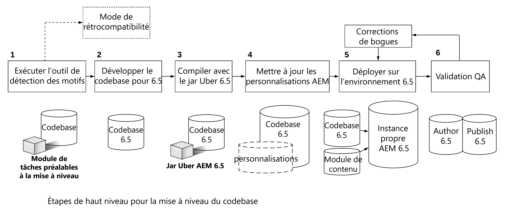
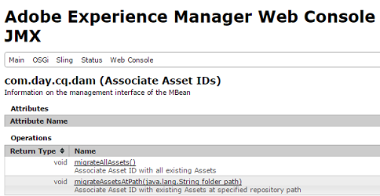

# Mise à niveau du code et des personnalisations{#upgrading-code-and-customizations}

En planifiant une mise à niveau, les parties suivantes de l’implémentation doivent être étudiées et résolues.

* [Amélioration de la base du code](#upgrade-code-base)
* [Alignement avec la structure de référentiel de la version 6.5](#align-repository-structure)
* [Personnalisations d’AEM](#aem-customizations)
*  [Procédure de test](#testing-procedure)

## Présentation {#overview}

1. **Détecteur** de schémas - Exécutez le Détecteur de schémas comme décrit dans la planification de la mise à niveau et comme décrit en détail dans [cette page](/help/sites-deploying/pattern-detector.md) pour obtenir un rapport de détecteur de schémas contenant plus de détails sur les zones à traiter en plus des API/lots indisponibles dans la version  d’AEM. Le rapport Détection des schémas doit vous indiquer les incompatibilités éventuelles dans votre code. S’il n’en existe aucune, votre déploiement est déjà compatible avec la version 6.5, vous pouvez tout de même choisir d’effectuer un nouveau développement pour utiliser la fonctionnalité 6.5, mais vous n’en avez pas besoin uniquement pour maintenir la compatibilité. En cas d’incompatibilités signalées, vous pouvez choisir a) Exécuter en mode de compatibilité et différer votre développement pour les nouvelles fonctionnalités 6.5 ou la compatibilité, b) Décider de procéder au développement après la mise à niveau, puis passer à l’étape 2. Please see please see [Backward Compatibility in AEM 6.5](/help/sites-deploying/backward-compatibility.md) for more details.

1. **Développer la base de code pour la version 6.5 **- Créer une branche ou un référentiel dédié pour la base de code pour la version  du. Utilisez les informations de la compatibilité avant la mise à niveau pour prévoir les zones de code à mettre à jour.
1. **Compiler avec 6.5 Uber jar **- Mettre à jour les POM de base du code pour pointer vers 6.5 uber jar et compiler le code par rapport à cela.
1. **Mettre à jour les personnalisations** AEM* - *Toutes les personnalisations ou extensions d’AEM doivent être mises à jour/validées pour fonctionner dans la version 6.5 et ajoutées à la base de code 6.5. Comprend des formulaires de recherche d’interface utilisateur, des personnalisations de ressources, tout élément utilisant /mnt/overlay

1. **Déployer vers 6.5** - Une instance propre d’AEM 6.5 (Auteur + Publication) doit être configurée dans un de  de développement/AQ. La base de code à jour et un échantillon représentatif de contenu (de la production actuelle) doivent être déployés.
1. **Validation d’assurance qualité et correction** de bogues : l’assurance qualité doit valider l’application sur les instances d’auteur et de publication de la version 6.5. Tous les bogues trouvés doivent être corrigés et validés dans la base de code 6.5. Répétez le cycle de développement autant de fois que nécessaire jusqu’à ce que tous les problèmes soient corrigés.

Avant d’effectuer une mise à niveau, vous devez disposer d’une base stable de code d’application qui a été complètement testée par rapport à la version cible d’AEM. En fonction des observations effectuées durant le test, il existe des façons d’optimiser le code personnalisé. Cela peut inclure la restructuration du code pour éviter de parcourir le référentiel, l’indexation personnalisée pour optimiser la recherche ou l’utilisation des nœuds non classés dans le JCR, entre autres.

Outre la possibilité de mettre à niveau votre base du code et vos personnalisations afin qu’elles fonctionnent avec la nouvelle version d’AEM, la version 6.5 permet de gérer plus efficacement vos personnalisations à l’aide de la fonctionnalité de compatibilité descendante (ou de rétrocompatibilité) décrite sur [cette page](/help/sites-deploying/backward-compatibility.md).

Comme indiqué ci-dessus et dans le diagramme ci-dessous, le fait d’exécuter l’[outil de détection des motifs](/help/sites-deploying/pattern-detector.md) au cours de la première étape vous aide à évaluer la complexité globale de la mise à niveau et à déterminer si vous souhaitez exécuter le mode de compatibilité ou mettre à jour vos personnalisations afin d’utiliser toutes les nouvelles fonctionnalités d’AEM 6.5. Please see the [Backward Compatibility in AEM 6.5](/help/sites-deploying/backward-compatibility.md) page for more details.
[ ](assets/upgrade-code-base-highlevel.png)

## Mise à niveau de la base de code {#upgrade-code-base}

### Création d’une branche spécifique pour la version 6.5 du code dans le contrôle de version {#create-a-dedicated-branch-for-6.5-code-in-version-control}

Tous les codes et configurations nécessaires à votre implémentation d’AEM doivent être gérés à l’aide d’une forme de contrôle de version. Une branche spécifique dans le contrôle de version doit être créée pour gérer tous les changements requis pour la base de code de la version cible d’AEM. Les tests itératifs de la base de code par rapport à la version cible d’AEM et les corrections de bogues consécutives sont gérés dans cette branche.

### Mise à jour de la version AEM Uber Jar {#update-the-aem-uber-jar-version}

AEM Uber jar inclut toutes les API d’AEM en tant que dépendance unique dans le fichier `pom.xml` de votre projet Maven. Il est toujours conseillé d’inclure le jar Uber comme dépendance unique au lieu d’incorporer les dépendances individuelles des API d’AEM. En améliorant la base de code, la version du jar Uber doit être modifiée pour indiquer la version cible d’AEM. Si votre projet a été développé sur une version AEM avant l’existence du jar Uber, toutes les dépendances individuelles des API d’AEM doivent être supprimées ou remplacées par une inclusion unique du jar Uber pour la version cible d’AEM. La base de code doit ensuite être recompilés par rapport à la nouvelle version du jar Uber. Toutes les méthodes obsolète d’API doivent être mis à jour pour être compatibles avec la version cible d’AEM.

```
<dependency>
    <groupId>com.adobe.aem</groupId>
    <artifactId>uber-jar</artifactId>
    <version>6.5.0</version>
    <classifier>apis</classifier>
    <scope>provided</scope>
</dependency>
```

### Élimination graduelle de l’utilisation de l’Administrative Resource Resolver  {#phase-out-use-of-administrative-resource-resolver}

The use of an administrative session through `SlingRepository.loginAdministrative()` and `ResourceResolverFactory.getAdministrativeResourceResolver()` was quite prevalent in code bases prior to AEM 6.0. These methods have been deprecated for security reasons as they give too broad of a level of access. [Dans les prochaines versions de Sling, ces méthodes seront supprimées](https://sling.apache.org/documentation/the-sling-engine/service-authentication.html#deprecation-of-administrative-authentication). Il est vivement recommandé de restructurer les codes afin d’utiliser les utilisateurs de service à la place. Plus d’informations sur les utilisateurs de service et [la manière d’éliminer les sessions administrative progressivement sont présentées ici](/help/sites-administering/security-service-users.md#how-to-phase-out=admin-sessions).

### Requêtes et index Oak {#queries-and-oak-indexes}

Toute utilisation des requêtes dans la base de code doit être complètement testée dans le cadre de la mise à jour de la base de code. Pour les clients mettant à niveau depuis Jackrabbit 2 (versions AEM plus anciennes que 6.0), cela est particulièrement important, puisque Oak n’indexe pas de contenu automatiquement, et des index personnalisés doivent être créés. Si la mise à jour est effectuée à partir d’une version 6.x d’AEM, les définitions d’index d’Oak ont peut-être été modifiées et sont susceptible d’impacter les requêtes existantes.

Plusieurs outils pour l’analyse et l’inspection de la performance des requête sont disponibles :

* [Outils d’index AEM](/help/sites-deploying/queries-and-indexing.md) 

* [Outils de diagnostic des opérations - Performance des requêtes](/help/sites-administering/operations-dashboard.md#diagnosis-tools)

* [Oak Utils](https://oakutils.appspot.com/) Il s’agit d’un outil Open Source qui n’est pas géré par Adobe. 

### IU classique - Création {#classic-ui-authoring}

La création de l’IU classique est toujours disponible dans AEM 6.5, mais elle sera bientôt obsolète. Vous trouverez plus d’informations[ ici](/help/release-notes/deprecated-removed-features.md#pre-announcement-for-next-release). Si votre application s’exécute dans l’environnement de création de l’interface utilisateur classique, il est recommandé de la mettre à niveau vers AEM 6.5 et de continuer à utiliser l’interface utilisateur classique. La migration vers l’interface utilisateur optimisée pour les écrans tactiles peut ensuite être prévue en tant que projet distinct à effectuer sur plusieurs cycles de développement. Pour utiliser l’interface utilisateur classique dans la version 6.5, plusieurs configurations OSGi sont nécessaires pour être intégrées dans la base de code. More details on how to configure this can be found [here](/help/sites-administering/enable-classic-ui.md).

## Alignement avec la structure de référentiel de la version 6.5 {#align-repository-structure}

Pour faciliter les mises à niveau et s’assurer que les configurations ne soient pas remplacées au cours de celles-ci, le référentiel est restructuré dans la version 6.4 afin de séparer le contenu de la configuration.

Therefore, a number of settings must be moved to no longer reside under `/etc` as had been the case in the past. To review the full set of repository restructuring concerns that must be reviewed and accomodated in the updated to AEM 6.4, see [Repository Restructuring in AEM 6.4](/help/sites-deploying/repository-restructuring.md).

## Personnalisations d’AEM  {#aem-customizations}

Toutes les personnalisations apportées à l’environnement de création d’AEM dans la version source d’AEM doivent être identifiées. Une fois identifiées, il est recommandé que chacune des personnalisations soit stockée dans le contrôle de version ou au moins prise en charge dans le cadre d’un module de contenu. Toutes les personnalisations doivent être déployées et validées dans le cadre d’un contrôle qualité ou un environnement d’évaluation exécutant la version cible d’AEM avant une mise à niveau de production.

### Généralités sur les recouvrements {#overlays-in-general}

Il est courant d’étendre la fonctionnalité prête à l’emploi d’AEM en superposant des nœuds et/ou des fichiers sous /libs avec d’autres nœuds sous /apps. Ces recouvrementsdoivent être suivis dans le contrôle de version et être testés avec la version cible d’AEM. Si un fichier (que ce soit, JS, JSP ou HTL) est superposé, il est recommandé de laisser un commentaire sur la fonctionnalité qui a été améliorée pour simplifier le test de régression de la version cible d’AEM. Vous trouverez plus d’informations sur les recouvrements en général[ ici](/help/sites-developing/overlays.md). Des instructions sur les recouvremets spécifiques d’AEM figurent ci-dessous.

### Mise à niveau des formulaires de recherche personnalisée {#upgrading-custom-search-forms}

Les facettes de la recherche personnalisée requièrent certains réglages manuels après la mise à niveau pour fonctionner correctement. Pour en savoir plus, voir [Mise à niveau des formulaires de recherche personnalisée](/help/sites-deploying/upgrading-custom-search-forms.md).

### Personnalisations de l’interface utilisateur d’Assets {#assets-ui-customizations}

>[!NOTE]
>
>Cette procédure n’est requise que pour les mises à niveau des versions d’AEM antérieures à 6.2. 

Les instances disposant de déploiements de ressources personnalisés doivent être préparées pour la mise à niveau. Cela permet de s’assurer que le contenu personnalisé est compatible avec la nouvelle structure de nœuds de la version 6.4. 

Vous pouvez préparer des personnalisations dans l’interface utilisateur Ressources en procédant comme suit :

1. On the instance that needs to be upgraded, open CRXDE Lite by going to *https://server:port/crx/de/index.jsp*

1. Accédez au nœud suivant :

   * `/apps/dam/content`

1. Renommez le nœud content en **content_backup**. Vous pouvez le faire en cliquant avec le bouton droit sur le volet d’exploration sur le côté gauche de la fenêtre, puis en sélectionnant **Renommer**.

1. Once the node has been renamed, create a new node named content under `/apps/dam` named **content** and set its node type to **sling:Folder**.

1. Déplacez tous les nœuds enfants de **content_backup** vers le nœud content que vous venez de créer. Vous pouvez le faire en cliquant avec le bouton droit sur chaque nœud enfant dans le volet d’exploration, puis en sélectionnant **Déplacer**. 

1. Supprimez le nœud **content_backup**.

1. The updated nodes beneath `/apps/dam` with the correct node type of `sling:Folder` should ideally be saved into version control and deployed with the code base or at a minimum backed up as content package.

### Génération d’identifiants pour les ressources existantes {#generating-asset-ids-for-existing-assets}

Pour générer des identifiants pour les ressources existantes, mettez à jour les ressources en même temps que l’instance AEM pour exécuter la version 6.5. Cela nécessite d’activer la [fonctionnalité Assets Insights](/help/assets/touch-ui-asset-insights.md). For more details, see [Add embed code](/help/assets/touch-ui-using-page-tracker.md#add-embed-code).

Pour mettre à niveau les ressources, configurez le module d’identifiants de ressources associé dans la console JMX. En fonction du nombre de ressources dans le référentiel, `migrateAllAssets`   peut prendre beaucoup de temps. Selon nos tests internes, cela peut prendre environ une heure pour 125 000 ressources sur TarMK.



Si vous avez besoin de plusieurs identifiants de ressources pour un sous-ensemble de vos ressources totales, utilisez l’API `migrateAssetsAtPath`.

For all other purposes, use the `migrateAllAssets()` API.

### Personnalisations de script InDesign {#indesign-script-customizations}

Adobe recommends putting custom scripts at `/apps/settings/dam/indesign/scripts` location. Pour en savoir plus sur les personnalisations de script InDesign, rendez-vous[ ici](/help/assets/indesign.md#configuring-the-aem-assets-workflow).

### Récupération des configurations ContextHub {#recovering-contexthub-configurations}

Les configurations ContextHub sont affectées par une mise à niveau. Instructions on how to recover existing ContextHub configurations can be found [here](/help/sites-administering/contexthub-config.md#recovering-contexthub-configurations-after-upgrading).

### Personnalisations des workflows {#workflow-customizations}

Il est courant de modifier les workflows prêts à l’emploi pour ajouter ou supprimer des fonctionnalités. A common workflow that is customized is the [!UICONTROL DAM Update Asset] workflow. Tous les workflows nécessitant une implémentation personnalisée doivent être enregistrés et stockés dans le contrôle de version, car ils risquent d’être remplacés lors de la mise à niveau.

### Modèles modifiables {#editable-templates}

>[!NOTE]
>
>Cette procédure n’est requise que pour les mises à niveau de Sites à l’aide des modèles modifiables d’AEM 6.2

La structure des modèles modifiables a changé entre les versions 6.2 et 6.3 d’AEM. Si vous effectuez une mise à niveau à partir de la version 6.2 ou antérieure et si le contenu de votre site est créé à l’aide de modèles modifiables, vous devez utiliser l’[outil de nettoyage de nœuds réactifs](https://github.com/Adobe-Marketing-Cloud/aem-sites-template-migration). L’outil est prévu pour fonctionner **après** une mise à niveau pour nettoyer le contenu. Il doit être exécuté sur les niveau d’auteur et de publication.

### Modifications d’une implémentation de groupes d’utilisateurs fermés {#cug-implementation-changes}

L’implémentation des groupes d’utilisateurs fermés a considérablement évolué pour contourner les limitations de performance et d’évolutivité dans les versions précédentes d’AEM. La version précédente des groupes d’utilisateurs fermés a été abandonnée dans la version 6.3. En outre, la nouvelle implémentation est uniquement prise en charge dans l’interface utilisateur tactile. Si vous effectuez une mise à niveau à partir de la version 6.2 ou antérieure, vous trouverez les instructions de migration vers la nouvelle implémentation [ici](/help/sites-administering/closed-user-groups.md#upgradetoaem63).

## Procédure de test {#testing-procedure}

Un plan evaluation complet doit être préparé en vue de tester les mises à niveau. Le test de la base de code améliorée et de l’application doit être d’abord effectué dans des environnements inférieur. Tous les bugs détectés doivent être corrigés de manière itérative jusqu’à ce que la base de code soit stable. Ce n’est qu’à ce moment que les environnements de niveau supérieur doivent être mis à niveau.

### Procédure de test de la mise à niveau {#testing-the-upgrade-procedure}

La procédure de mise à niveau, comme décrit ici, doit être testée sur des environnements de développement et de contrôle qualité, tel que cela est décrit dans votre runbook personnalisé (voir [Planification de votre mise à niveau](/help/sites-deploying/upgrade-planning.md)). La procédure de mise à niveau doit être répétée jusqu’à ce que toutes les étapes soient documentées dans le runbook de mise à niveau et que le processus de mise à niveau soit fluide.

### Zones de test d’implémentation  {#implementation-test-areas-}

Vous trouverez ci-dessous les domaines stratégiques de toute implémentation AEM devant être couverts par votre plan de tests une fois que l’environnement a été mis à niveau et que la base de code améliorée a été déployée.

<table>
 <tbody>
  <tr>
   <td><strong>Zone de test fonctionnelle</strong></td>
   <td><strong>Description</strong></td>
  </tr>
  <tr>
   <td>Sites publiés</td>
   <td>Test de l’implémentation d’AEM et du code associé sur le niveau de publication<br /> via le dispatcher. Doit inclure des critères pour les mises à jour de la page et<br /> l’invalidation du cache.</td>
  </tr>
  <tr>
   <td>Création  </td>
   <td>Test de votre implémentation d’AEM et du code associé sur le niveau d’auteur. Doit inclure la page, la création de composants et les boîtes de dialogue.</td>
  </tr>
  <tr>
   <td>Intégrations des solutions with Marketing Cloud</td>
   <td>Validation des intégrations avec des produits comme Analytics, DTM et Target.</td>
  </tr>
  <tr>
   <td>Intégration avec les systèmes tiers</td>
   <td>Toutes les intégrations tierces doivent être validées sur les niveaux d’auteur et de publication.</td>
  </tr>
  <tr>
   <td>Authentification, sécurité et autorisations</td>
   <td>Tous les mécanismes d’authentification tels que LDAP/SAML doivent être validés.<br />Les autorisations et les groupes doivent être testés sur les niveaux d’auteur et de publication.<br /></td>
  </tr>
  <tr>
   <td>Requêtes</td>
   <td>Les index et les requêtes personnalisés doivent être testés, ainsi que la performance des requêtes.</td>
  </tr>
  <tr>
   <td>Personnalisations de l’interface utilisateur</td>
   <td>Toutes les extensions ou personnalisations de l’interface utilisateur d’AEM dans l’environnement de création. </td>
  </tr>
  <tr>
   <td>Workflows   </td>
   <td>Fonctionnalités et workflows personnalisés et/ou prêts à l’emploi.</td>
  </tr>
  <tr>
   <td>Test de performance</td>
   <td>Le test de chargement doit être effectué au niveau de l’auteur et de la publication qui simulent des scénarios réels.</td>
  </tr>
 </tbody>
</table>

### Document de plan de tests et résultats {#document-test-plan-and-results}

Vous devez créer un plan de tests qui couvre les zones de tests d’implémentation décrites ci-dessus. Dans la plupart des cas, il semble logique de séparer le protocole de test par des listes de tâche d’auteur et de publication. Ce plan de tests doit être effectué sur les environnements de développement, de contrôle qualité et d’évaluation avant de mettre à niveau les environnements de production. Les résultats des tests et les mesures de performance doivent être collectés dans des environnements inférieurs pour fournir une comparaison lors de la mise à niveau des environnements d’évaluation et de production.
