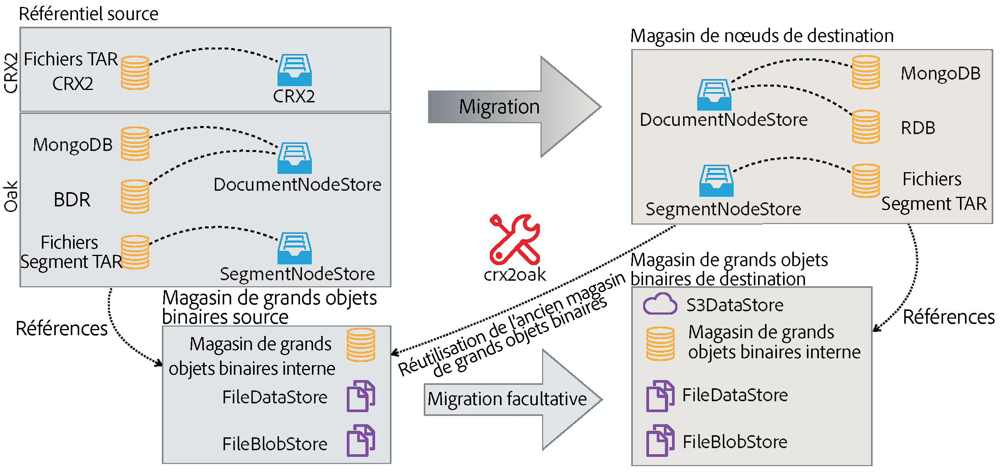
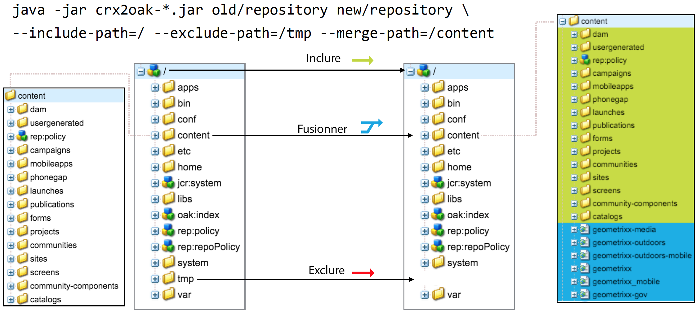
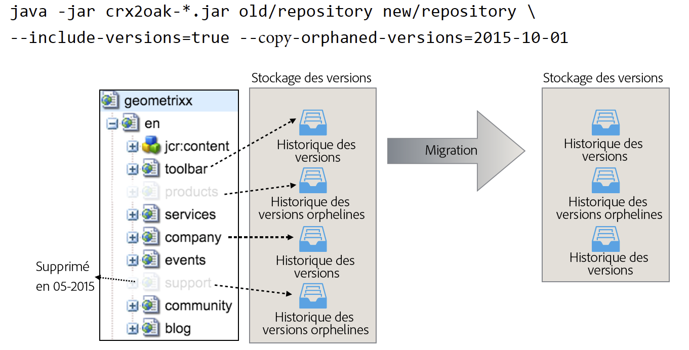

# Utilisation de l’outil de migration CRX2OAK{#using-the-crx-oak-migration-tool}

## Présentation {#introduction}

CRX2Oak est un outil qui a été conçu pour effectuer la migration des données entre différents référentiels.

Il peut être utilisé pour migrer des données à partir d’anciennes versions CQ basées sur Apache Jackrabbit 2 vers Oak, et peut aussi être utilisé pour copier des données entre référentiels Oak.

Vous pouvez télécharger la version la plus récente de crx2oak à partir du référentiel public Adobe via :[ https://repo.adobe.com/nexus/content/groups/public/com/adobe/granite/crx2oak/](https://repo.adobe.com/nexus/content/groups/public/com/adobe/granite/crx2oak/)

La liste de modifications et correctifs pour la dernière version est disponible via les [notes de mise à jour pour CRX2Oak](https://docs.adobe.com/content/help/en/experience-manager-64/release-notes/crx2oak.html).

>[!NOTE]
>
>Pour en savoir plus sur Apache Oak les conceptes clés de persistence AEM, voir [Introduction à la plateforme AEM](/help/sites-deploying/platform.md).

## Cas d’utilisation de migration {#migration-use-cases}

L’outil peut être utilisé pour :

* Effectuer une migration d’anciennes versions de CQ 5 vers AEM 6
* Copier les données entre plusieurs référentiels Oak
* Convertir des données entre différentes implémentations du micronoyau Oak.

La prise en charge pour la migration des référentiels à l’aide d’entrepôts Blob externes (communément appelés entrepôts de données) est fournie selon différentes combinations. One possible migration path is from a CRX2 repository that is using an external `FileDataStore` to an Oak repository using a `S3DataStore`.

Le diagramme ci-dessous montre toutes les combinaisons de migration possibles prises en charge par CRX2Oak :



## Fonctionnalités {#features}

CRX2Oak est appelé durant les mises à niveau d’AEM d’une façon permettant à l’utilisateur de spécifier un profile de migration prédéfini qui automatise la reconfiguration des modes de persistence. Cela s’appelle le mode quickstart.

Il peut également être exécuté séparément s’il requiert plus de personnalisations. Toutefois, veuillez noter qu’avec ce mode, les modifications s’appliquent uniquement au référentiel et toute reconfiguration supplémentaire d’AEM doit être effectuée manuellement. Cela s’appelle le mode autonome.

Veuillez aussi noter que si les paramètres par défaut sont en mode autonome, seuls les entrepôts de nœuds seront migrés, et le nouveau référentiel réutilisera l’ancien entrepôt binaire.

### Mode de démarrage rapide automatisé {#automated-quickstart-mode}

Depuis AEM 6.3, CRX2Oak est capable de gérer les profils de migration définis par l’utilisateur pouvant être configurés avec toutes les options de migration disponibles. Cela offre plus de flexibilité et donne la capacité d’automatiser la configuration d’AEM; des caractéristiques qui ne sont pas disponibles si vous utilisez l’outil en mode autonome. 

Pour passer CRX2Oak en mode de démarrage rapide, vous avez besoin de définir le chemin vers le dossier crx-quickstart dans le répertoire d’installation d’AEM via cette variable d’environnement du système d’exploitation :

**Pour les systèmes basés sur UNIX et Mac OS :**

```shell
export SLING_HOME="/path/to/crx-quickstart"
```

**Pour Windows :**

```shell
SET "SLING_HOME=/path/to/crx-quickstart"
```

#### Prise en charge de la reprise {#resume-support}

La migration peut être interrompue à tout moment avec la possibilité de la redémarrer par la suite. 

#### Logique de mise à niveau personnalisable {#customizable-upgrade-logic}

La logique Java personnalisé peut également être mise en œuvre en utilisant `CommitHooks`. Les classes `RepositoryInitializer` personnalisées peuvent être mises en œuvre pour initialiser le référentiel avec des valeures personnalisées.

#### Prise en charge des opérations de mappage de la mémoire {#support-for-memory-mapped-operations}

CRX2Oak prend également en charge les opérations de mappage de la mémoire par défaut. Le mappage de la mémoire permet d’améliorer grandement la performance et doit être utilisé chaque fois que cela est possible.

>[!CAUTION]
>
>Veuillez noter toutefois que les opérations de mappage de la mémoire ne sont pas prises en charge pour les plateformes Windows. Therefore, it is recommended to add the **--disable-mmap** parameter when performing the migration on Windows.

#### Migration sélective de contenu {#selective-migration-of-content}

By default, the tool migrates the whole repository under the `"/"` path. Néanmoins, vous avez un contrôle total du contenu devant être migré.

If there is any part of the content that is not required on the new instance, you can use the `--exclude-path` parameter to exclude the content and optimize the upgrade procedure.

#### Fusion du chemin {#path-merging}

If data needs to be copied between two repositories and you have a content path that is different on both instances, you can define it in the `--merge-path` parameter. Une fois que cela est fait, CRX2Oak copie uniquement les nouveaux nœuds dans le référentiel de destination tout en gardant les anciens en place. 



#### Prise en charge des versions {#version-support}

AEM crée par défaut une version de chaque nœud ou page modifié, pour ensuite le stocker dans le référentiel. Les versions peuvent alors être utilisées pour restaurer la page à un état antérieur.

Néanmoins, ces versions ne sont jamais purgées, même si la page originale est supprimée. Les migrations effectuées avec des référentiels utilisés depuis très longtemps peuvent avoir besoin de traiter beaucoup de données redondantes, à cause des versions orphelines.

A useful feature for these types of situations is the addition of the `--copy-versions` parameter. Il peut être utilisé pour ignorer les noeuds de version pendant la migration ou la copie d’un référentiel.

Vous pouvez aussi choisir de copier des versions orphelines en ajoutant le paramètre `--copy-orphaned-versions=true`.

Both parameters also support a `YYYY-MM-DD` date format, in case you want to copy versions no later than a specific date.



#### Version Open Source {#open-source-version}

Une version Open Source de CRX2Oak est disponible sous forme de mise à niveau Oak. Elle prend en charge toutes les fonctions, sauf :

* Prise en charge de CRX2
* Prise en charge du profil de migration
* Prise en charge de la reconfiguration automatisée d’AEM

See the [Apache Documentation](https://jackrabbit.apache.org/oak/docs/migration.html) for more information.

## Paramètres {#parameters}

### Options d’entrepôts de nœuds {#node-store-options}

* `--cache`: Taille du cache en Mo (la valeur par défaut est `256`)

* `--mmap`: Activer l’accès aux fichiers mappés en mémoire pour le magasin de segments
* `--src-password:` Mot de passe de la base de données RDB source

* `--src-user:` Utilisateur de la RDB source

* `--user`: Utilisateur de la RDB ciblée

* `--password`: Mot de passe de la cible RDB.

### Options de migration {#migration-options}

* `--early-shutdown`: Ferme le référentiel source JCR2 après la copie des noeuds et avant l’application des crochets de validation.
* `--fail-on-error`: Force un échec de la migration si les noeuds ne peuvent pas être lus à partir du référentiel source.
* `--ldap`: Migration des utilisateurs LDAP d’une instance CQ 5.x vers une instance Oak. Pour que cela fonctionne, le fournisseur d’identité dans la configuration Oak doit être nommé ldap. Pour plus d’informations, consultez la [documentation LDAP](/help/sites-administering/ldap-config.md).

* `--ldap-config:` Utilisez cette méthode conjointement avec le `--ldap` paramètre pour les référentiels CQ 5.x qui utilisaient plusieurs serveurs LDAP pour l’authentification. You can use it to point to the CQ 5.x `ldap_login.conf` or `jaas.conf` configuration files. Le format est `--ldapconfig=path/to/ldap_login.conf`.

### Options d’entrepôt de versions {#version-store-options}

* `--copy-orphaned-versions`: Ignore la copie des versions orphelines. Parameters supported are: `true`, `false` and `yyyy-mm-dd`. La valeur par défaut est `true`.

* `--copy-versions:` Copie l’enregistrement de version. Paramètres: `true`, `false`, `yyyy-mm-dd`. La valeur par défaut est `true`.

#### Options de chemin {#path-options}

* `--include-paths:` Liste séparée par des virgules des chemins à inclure lors de la copie
* `--merge-paths`: Liste séparée par des virgules des chemins à fusionner pendant la copie
* `--exclude-paths:` Liste des chemins d’accès à exclure au cours de la copie séparés par des virgules.

### Options de stockage du Blob source {#source-blob-store-options}

* `--src-datastore:` Répertoire de la banque de données à utiliser comme source `FileDataStore`

* `--src-fileblobstore`: Répertoire de la banque de données à utiliser comme source `FileBlobStore`

* `--src-s3datastore`: Répertoire de la banque de données à utiliser pour la source `S3DataStore`

* `--src-s3config`: Fichier de configuration de la source `S3DataStore`.

### Options d’entrepôt de blob de destination {#destination-blobstore-options}

* `--datastore:` Répertoire de la banque de données à utiliser comme cible `FileDataStore`

* `--fileblobstore:` Répertoire de la banque de données à utiliser comme cible `FileBlobStore`

* `--s3datastore`: Répertoire de la banque de données à utiliser pour la cible `S3DataStore`

* `--s3config`: Fichier de configuration de la cible `S3DataStore`.

### Options d’aide {#help-options}

* `-?, -h, --help:` Affiche les informations d’aide.

## Débogage {#debugging}

Vous pouvez aussi activer les informations de débogage pour le processus de migration afin de pouvoir résoudre tout problème pouvant survenir durant le processus. Vous pouvez effectuer cette opération différemment selon le mode sur lequel vous souhaitez exécuter l’outil :

<table>
 <tbody>
  <tr>
   <td><strong>Mode CRX2Oak</strong></td>
   <td><strong>Action</strong></td>
  </tr>
  <tr>
   <td>Mode démarrage rapide</td>
   <td>You can add the <strong>--log-level TRACE</strong> or <strong>--log-level DEBUG </strong>options to the command line when running CRX2Oak. In this mode logs are automatically redirected to the <strong>upgrade.log file</strong>.</td>
  </tr>
  <tr>
   <td>Mode autonome</td>
   <td><p>Add the <strong>--trace</strong> options to the CRX2Oak command line to show TRACE events on standard output (you need to redirect logs yourself using redirection character: '&gt;' or 'tee' command for later inspection).</p> </td>
  </tr>
 </tbody>
</table>

## Autres considérations {#other-considerations}

Lors de la migration vers un ensemble de réplications MongoDB, assurez-vous de configurer le paramètre `WriteConcern` sur `2` pour toutes les connexions aux bases de données Mongo.

Vous pouvez le faire en ajoutant le paramètre `w=2` à la fin de la chaîne de connexion, comme suit :

```xml
java -Xmx4092m -XX:MaxPermSize=1024m -jar crx2oak.jar crx-quickstart/repository/ mongodb://localhost:27017/aem-author?replicaset=replica1&w=2
```

>[!NOTE]
>
>Pour plus d’informations, voir la documentation de chaîne de connexion MongoDB sur les [problèmes d’écriture](https://docs.mongodb.org/manual/reference/connection-string/#write-concern-options).

