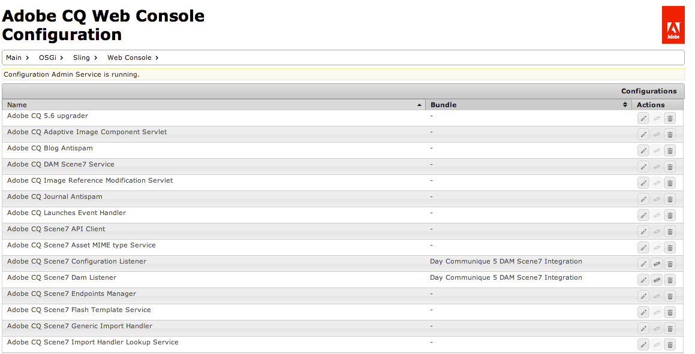

# Console web{#web-console}

La console Web de Adobe Experience Manager (AEM) est basée sur la variable [Console de gestion Web Apache Felix](https://felix.apache.org/documentation/subprojects/apache-felix-web-console.html). Apache Felix est un travail de la communauté pour mettre en œuvre la plateforme de service OSGi R4, qui inclut le cadre OSGi et les services standard.

>[!NOTE]
>
>Dans la console web, toute description qui mentionne les paramètres par défaut est liée aux valeurs par défaut de Sling.
>
>AEM ayant ses propres paramètres par défaut, ces derniers peuvent être différents de ceux répertoriés dans la console.

La console web propose une sélection d’onglets pour la maintenance des lots OSGi, notamment :

* [Configuration](#configuration) : utilisé pour configurer les lots OSGi. Il s’agit donc du mécanisme sous-jacent pour configurer les paramètres système d’AEM
* [Lots](#bundles) : utilisé pour installer des lots
* [Composants](#components) : utilisé pour contrôler le statut des composants requis pour AEM

Toutes les modifications apportées sont immédiatement appliquées au système en cours d’exécution. Aucun redémarrage n’est requis.

Cette console est accessible à partir de `../system/console` ; par exemple :

`http://localhost:4502/system/console/components`

## Configuration {#configuration}

L’onglet **Configuration** est utilisé pour configurer les lots OSGi. Il s’agit donc du mécanisme sous-jacent pour configurer les paramètres système d’AEM.

>[!NOTE]
>
>Voir [Configuration OSGi à l’aide de la console web](/help/sites-deploying/configuring-osgi.md) pour plus de détails.

L’onglet **Configuration** est accessible soit via :

* Le menu déroulant :

  **OSGi >**

* L’URL ; par exemple :

  `http://localhost:4502/system/console/configMgr`

Une liste des configurations s’affiche :

Deux types de configurations sont disponibles dans les listes déroulantes de cet écran :

* **Configurations**
Permet de mettre à jour les configurations existantes. Elles possèdent une identité persistante (PID) et peuvent être :

   * standard ou intégrales pour AEM. Elles sont nécessaires ; si elles sont supprimées, les valeurs sont renvoyées aux paramètres par défaut.
   * les instances créées à partir des configurations d’usine ; ces instances sont créées par l’utilisateur ou l’utilisatrice et la suppression supprime l’instance.

* **Configurations d’usine**
Permet de créer une instance de l’objet de fonctionnalité requis.

  Il est attribué à une identité persistante, puis répertorié dans la liste déroulante Configurations .

La sélection d’une entrée de la liste affiche les paramètres liés à cette configuration :

Vous pouvez mettre à jour les paramètres selon vos besoins et : 

* **Enregistrer**

  Enregistrez les modifications apportées.

  Pour une configuration d’usine, cela crée une instance avec une identité persistante. La nouvelle instance est ensuite répertoriée sous Configurations.

* **Réinitialiser**

  Réinitialisez les paramètres affichés à l’écran en fonction de ceux enregistrés en dernier.

* **Supprimer**

  Supprime la configuration actuelle. Si elle est standard, les paramètres sont renvoyés aux paramètres par défaut. Si elle est créée à partir d’une configuration d’usine, l’instance spécifique est supprimée.

* **Dissocier**

  Dissocie la configuration actuelle du lot.

* **Annuler**

  Annule toutes les modifications actuelles.

## Lots {#bundles}

L’onglet **Lots** correspond au mécanisme permettant d’installer les lots OSGi requis par AEM. Cet onglet est accessible via l’une des méthodes suivantes : 

* Le menu déroulant :

  **OSGi >**

* L’URL ; par exemple :

  `http://localhost:4502/system/console/bundles`

Une liste de lots s’affiche :

En utilisant cet onglet vous pouvez réaliser les opérations suivantes :

* **Installer ou mettre à jour**

  Vous pouvez utiliser l’option **Parcourir** pour trouver le fichier contenant votre lot et spécifier s’il doit **commencer** immédiatement et à quel **niveau de départ**.

* **Recharger**

  Actualise la liste affichée.

* **Actualiser les packages**

  Cette opération vérifie les références de tous les packages et les actualise, si nécessaire.

  Par exemple, après une mise à jour, l’ancienne et la nouvelle version peuvent toujours être exécutées en raison de références antérieures. Cette option vérifie et déplace toutes les références à la nouvelle version, ce qui permet à l’ancienne version de s’arrêter.

* **Démarrer**

  Lance un lot en fonction du niveau initial spécifié.

* **Arrêter**

  Arrête le lot.

* **Désinstaller**

  Permet de désinstaller le lot du système.

* **Afficher le statut**

  La liste spécifie l’état du lot ; cliquez sur le nom d’un lot spécifique avec des informations supplémentaires.

>[!NOTE]
>
>Après **Mettre à jour**, Adobe vous recommande d’effectuer une **Actualisation des modules**.

## Composants {#components}

La variable **Composants** vous permet d’activer et/ou de désactiver les différents composants. Il est accessible par les éléments suivants :

* Le menu déroulant :

  **Principal >**

* L’URL ; par exemple :

  `http://localhost:4502/system/console/components`

Une liste des composants s’affiche. Plusieurs icônes sont disponibles pour vous permettre d’activer, de désactiver ou (le cas échéant) d’ouvrir les détails de la configuration pour un composant spécifique.

Cliquer sur le nom d’un composant spécifique affiche des informations supplémentaires sur son état. Vous pouvez également activer, désactiver ou recharger le composant.

>[!NOTE]
>
>L’activation ou la désactivation d’un composant s’applique uniquement jusqu’au redémarrage d’AEM/CRX.
>
>L’état de départ est défini dans le descripteur de composant, qui est généré pendant le développement et stocké dans le lot au moment de la création du lot.
