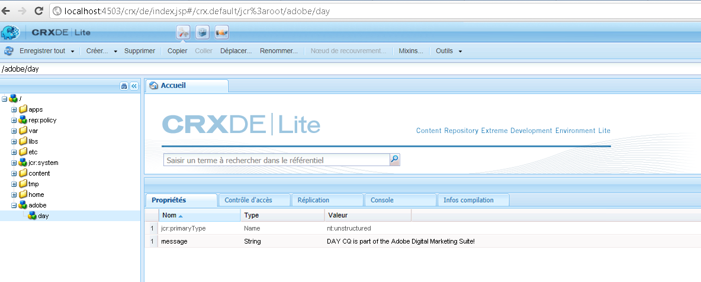

# Comment accéder au JCR AEM par programmation{#how-to-programmatically-access-the-aem-jcr}

Vous pouvez modifier, par programmation, les nœuds et propriétés situés dans le référentiel Adobe CQ qui fait partie d’Adobe Marketing Cloud. Pour accéder au référentiel CQ, vous utilisez l’API Java Content Repository (JCR). Vous pouvez utiliser l’API JCR Java pour exécuter des opérations CRUD (création, remplacement, mise à jour et suppression) sur du contenu situé dans le référentiel Adobe CQ. For more information about the Java JCR API, see [https://jackrabbit.apache.org/jcr/jcr-api.html](https://jackrabbit.apache.org/jcr/jcr-api.html).

>[!NOTE]
>
>Cet article de développement modifie le JCR Adobe CQ à partir d’une application Java externe. En revanche, vous pouvez modifier le JCR depuis un lot OSGi en utilisant l’API JCR. For details, see [Persisting CQ data in the Java Content Repository](https://helpx.adobe.com/experience-manager/using/persisting-cq-data-java-content1.html).

>[!NOTE]
>
>To use the JCR API, add the `jackrabbit-standalone-2.4.0.jar` file to your Java application’s class path. You can obtain this JAR file from the Java JCR API web page at [https://jackrabbit.apache.org/jcr/jcr-api.html](https://jackrabbit.apache.org/jcr/jcr-api.html).

>[!NOTE]
>
>Pour savoir comment interroger le JCR Adobe CQ à l’aide de l’API JCR Query, voir [Interrogation des données Adobe Experience Manager à l’aide de l’API JCR](https://helpx.adobe.com/experience-manager/using/querying-experience-manager-data-using1.html).

## Création d’une instance de référentiel {#create-a-repository-instance}

Cet article de développement fait appel à une méthode statique appartenant à la classe `org.apache.jackrabbit.commons.JcrUtils` pour se connecter à un référentiel et établir une connexion. Il existe cependant d’autres modus operandi. Cette méthode se nomme `getRepository`. Dans ce cas, un paramètre de chaîne est utilisé, qui représente l’URL du serveur Adobe CQ. Par exemple, `http://localhost:4503/crx/server`.

La méthode `getRepository` renvoie une instance `Repository`, comme le montre l’exemple de code ci-dessous.

```java
//Create a connection to the AEM JCR repository running on local host
Repository repository = JcrUtils.getRepository("http://localhost:4503/crx/server");
```

## Création d’une instance de session {#create-a-session-instance}

The `Repository`instance represents the CRX repository. You use the `Repository`instance to establish a session with the repository. To create a session, invoke the `Repository`instance’s `login`method and pass a `javax.jcr.SimpleCredentials` object. The `login`method returns a `javax.jcr.Session` instance.

You create a `SimpleCredentials`object by using its constructor and passing the following string values:

* Nom de l’utilisateur
* Mot de passe correspondant

When passing the second parameter, call the String object’s `toCharArray`method. The following code shows how to call the `login`method that returns a `javax.jcr.Sessioninstance`.

```java
//Create a Session instance
javax.jcr.Session session = repository.login( new SimpleCredentials("admin", "admin".toCharArray()));
```

## Création d’une instance de nœud {#create-a-node-instance}

Use a `Session`instance to create a `javax.jcr.Node` instance. Une instance `Node` vous permet d’effectuer des opérations de nœud. Vous pouvez, par exemple, créer un nœud. Pour créer un nœud qui représente le nœud racine, appelez la méthode `Session` de l’instance `getRootNode`, comme illustré dans la ligne de code ci-dessous.

```java
//Create a Node
Node root = session.getRootNode();
```

Once you create a `Node`instance, you can perform tasks such as creating another node and adding a value to it. Le code suivant, par exemple, crée deux nœuds et ajoute une valeur au deuxième.

```java
// Store content
Node day = adobe.addNode("day");
day.setProperty("message", "Adobe CQ is part of the Adobe Digital Marketing Suite!");
```

## Récupération de valeurs de nœud {#retrieve-node-values}

To retrieve a node and its value, invoke the `Node`instance’s `getNode`method and pass a string value that represents the fully-qualified path to the node. Examinez la structure de nœud créée dans l’exemple de code précédent. Pour récupérer le nœud day, indiquez adobe/day, comme indiqué dans le code suivant :

```java
// Retrieve content
Node node = root.getNode("adobe/day");
System.out.println(node.getPath());
System.out.println(node.getProperty("message").getString());
```

## Création de nœuds dans le référentiel Adobe CQ {#create-nodes-in-the-adobe-cq-repository}

The following Java code example represents a Java class that connects to Adobe CQ, creates a `Session`instance, and adds new nodes. Une valeur de données est affectée au nœud, puis la valeur du nœud et son chemin d’accès sont écrits sur la console. Lorsque vous en avez terminé avec l’instance Session, veillez à vous déconnecter.

```java
/*
 * This Java Quick Start uses the jackrabbit-standalone-2.4.0.jar
 * file. See the previous section for the location of this JAR file
 */

import javax.jcr.Repository;
import javax.jcr.Session;
import javax.jcr.SimpleCredentials;
import javax.jcr.Node;

import org.apache.jackrabbit.commons.JcrUtils;
import org.apache.jackrabbit.core.TransientRepository;

public class GetRepository {

public static void main(String[] args) throws Exception {

try {

    //Create a connection to the CQ repository running on local host
    Repository repository = JcrUtils.getRepository("http://localhost:4503/crx/server");

   //Create a Session
   javax.jcr.Session session = repository.login( new SimpleCredentials("admin", "admin".toCharArray()));

  //Create a node that represents the root node
  Node root = session.getRootNode();

  // Store content
  Node adobe = root.addNode("adobe");
  Node day = adobe.addNode("day");
  day.setProperty("message", "Adobe CQ is part of the Adobe Digital Marketing Suite!");

  // Retrieve content
  Node node = root.getNode("adobe/day");
  System.out.println(node.getPath());
  System.out.println(node.getProperty("message").getString());

  // Save the session changes and log out
  session.save();
  session.logout();
  }
 catch(Exception e){
  e.printStackTrace();
  }
 }
}
```

After you run the full code example and create the nodes, you can view the new nodes in the **[!UICONTROL CRXDE Lite]**, as shown in the following illustration.



