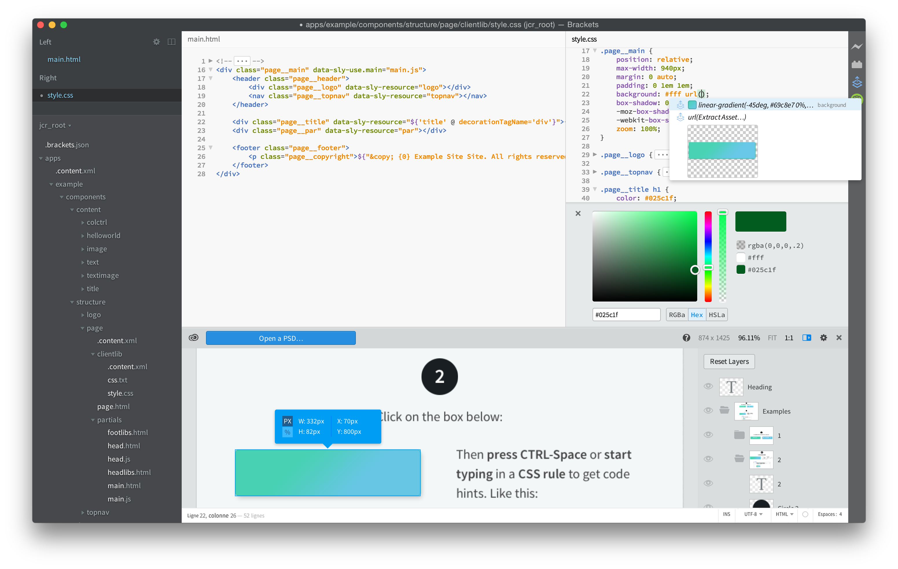
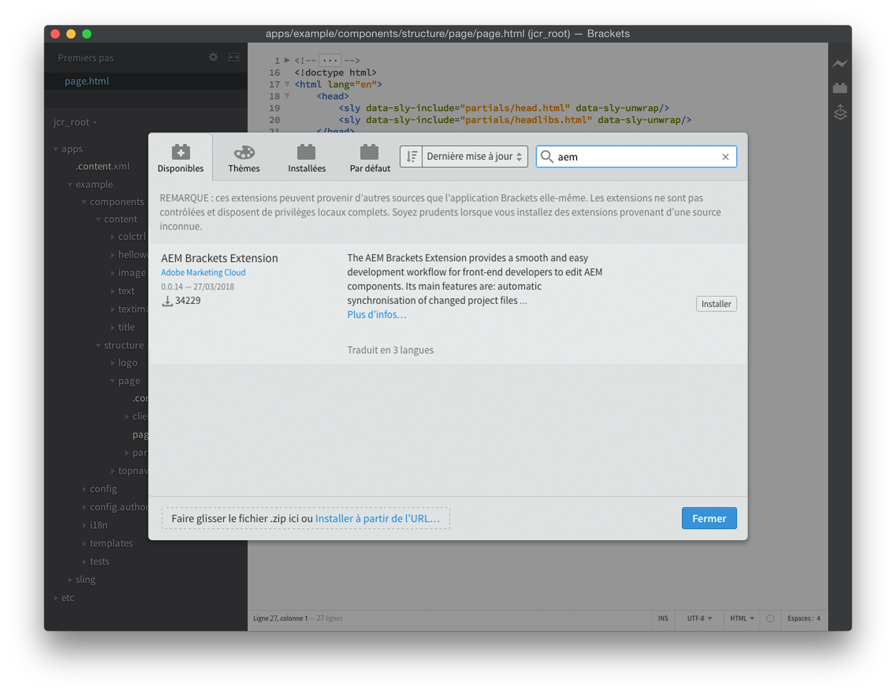
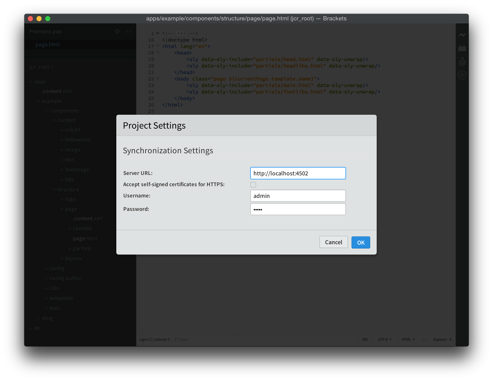
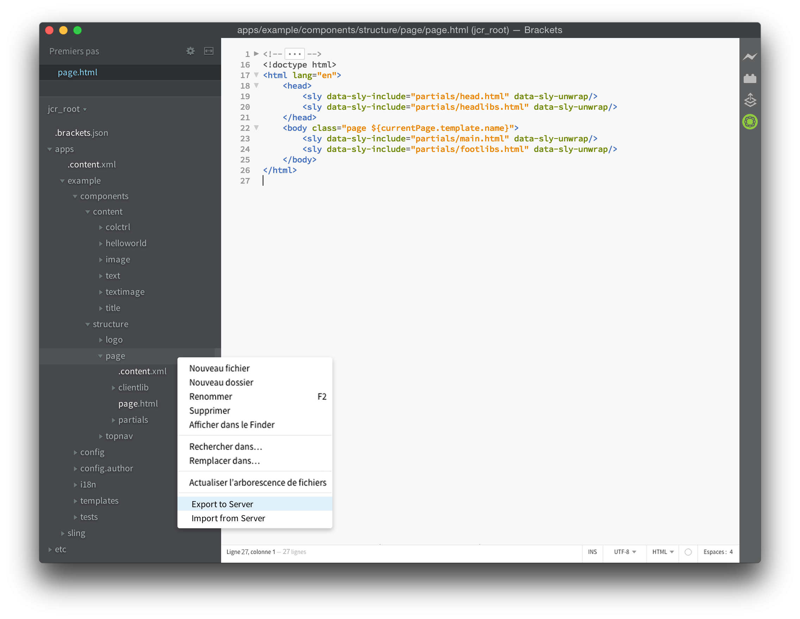
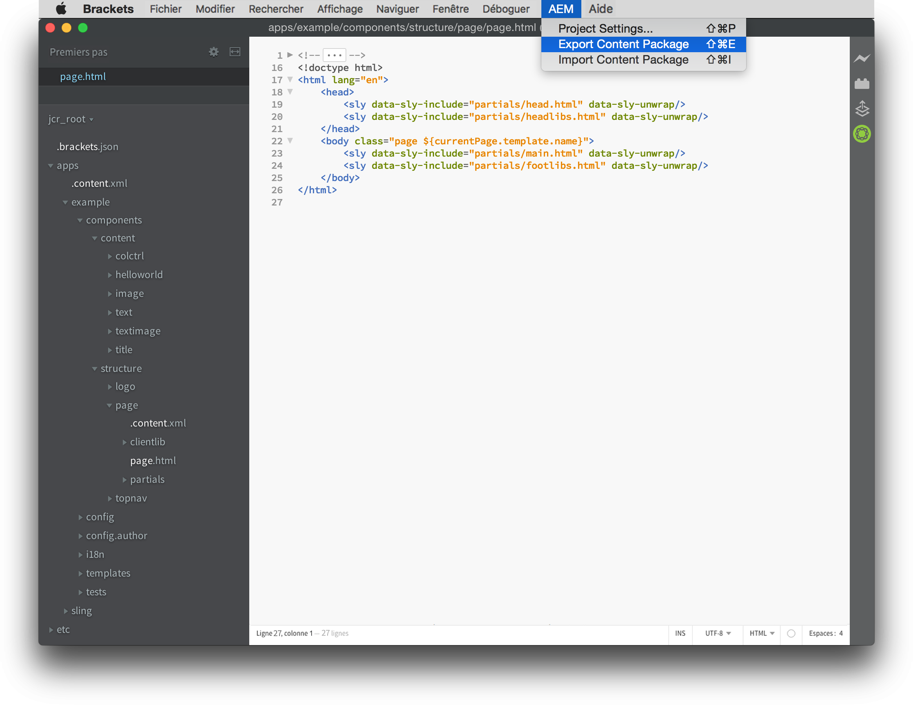
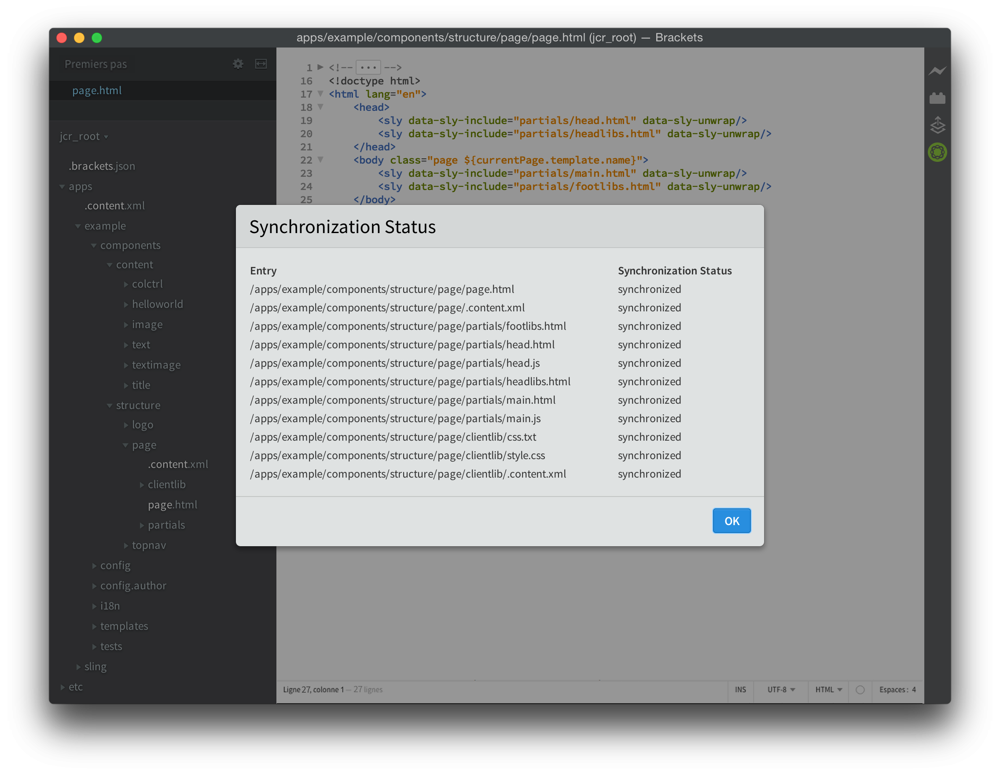

# Extension AEM Brackets{#aem-brackets-extension}

## Présentation {#overview}

L’extension AEM Brackets offre un workflow fluide pour modifier les composants AEM et les bibliothèques clientes. Elle tire parti de la puissance de l’éditeur de code [Brackets](https://brackets.io/) qui donne accès aux fichiers et calques Photoshop depuis l’éditeur de code. La synchronisation simplifiée (aucun Maven ou File Vault requis) grâce à l’extension améliore le rendement des développeurs et permet également aux développeurs de front-end ayant des connaissances AEM limitées de participer à des projets. Cette extension fournit également une prise en charge du [langage de modèle HTML (HTL)](https://docs.adobe.com/content/help/fr-FR/experience-manager-htl/using/overview.html), ce qui élimine la complexité du JSP pour faciliter et sécuriser le développement de composants.

### Fonctionnalités {#features}

Les principales fonctionnalités de l’extension AEM Brackets sont les suivantes :

* Synchronisation automatisée des fichiers modifiés vers l’instance de développement AEM.
* Synchronisation bidirectionnelle manuelle des fichiers et des dossiers.
* Synchronisation complète des packages de contenu du projet.
* Fin du code HTML pour les expressions et les instructions de bloc `data-sly-*`.

En outre, Brackets propose de nombreuses fonctionnalités utiles pour les développeurs de front-end AEM :

* Prise en charge des fichiers Photoshop pour extraire les informations d’un fichier PSD, comme des calques, des mesures, des couleurs, des polices, du texte, etc.
* Conseils relatifs au code du fichier PSD pour réutiliser facilement cette information extraite dans le code.
* Prise en charge du préprocesseur CSS, comme LESS et SCSS.
* Et des centaines d’extensions supplémentaires qui répondent à des besoins plus précis.

## Installation {#installation}

### Brackets {#brackets}

L’extension AEM Brackets prend en charge les versions 1.0 ou ultérieures.

Téléchargez la dernière version de Brackets à partir de [crochets.io](https://brackets.io/).

### L’extension {#the-extension}

Pour installer l’extension, procédez comme suit :

1. Ouvrez Brackets. Dans le menu **Fichier**, sélectionnez **Extension Manager...**
1. Entrez **AEM** dans la barre de recherche et recherchez l’**extension AEM Brackets**.

   

1. Cliquez sur **Installer**.
1. Fermez la boîte de dialogue et Extension Manager, une fois l’installation terminée.

## Prise en main {#getting-started}

### Le projet de modules de contenu {#the-content-package-project}

Une fois l’extension installée, vous pouvez commencer à développer des composants AEM en ouvrant un dossier de modules de contenu à partir de votre système de fichiers avec Brackets.

Le projet doit contenir au moins :

1. un dossier `jcr_root` (ex. `myproject/jcr_root`)

1. un fichier `filter.xml` (p. ex. `myproject/META-INF/vault/filter.xml`); pour plus d&#39;informations sur la structure du fichier `filter.xml`, consultez la définition du filtre d&#39;espace de travail .

Dans le menu **Fichier** de Brackets, choisissez **Ouvrir le dossier...** et choisissez le dossier `jcr_root` ou le dossier du projet parent.

>[!NOTE]
>
>Si vous n&#39;avez pas de projet avec un package de contenu, vous pouvez essayer l&#39;[exemple TodoMVC HTML ](https://github.com/Adobe-Marketing-Cloud/aem-sightly-sample-todomvc). Sur GitHub, cliquez sur **Télécharger ZIP**, extrayez les fichiers localement, et comme indiqué ci-dessus, ouvrez le dossier `jcr_root` dans Brackets. Suivez ensuite les étapes ci-dessous pour configurer les **Paramètres du projet**, puis téléchargez le package complet sur votre instance de développement AEM en effectuant une opération d&#39;**Exporter le package de contenu**, comme indiqué plus loin dans la section Synchronisation du package de contenu complet.
>
>Après ces étapes, vous devez pouvoir accéder à l&#39;URL `/content/todo.html` sur votre instance de développement AEM et vous pouvez début apporter des modifications au code dans Brackets et voir comment, après une actualisation dans le navigateur Web, les modifications ont été immédiatement synchronisées avec le serveur AEM.

### Paramètres du projet {#project-settings}

Pour synchroniser le contenu avec une instance de développement AEM dans les deux sens, vous devez définir les paramètres du projet. Pour ce faire, accédez au menu **AEM** et choisissez **Paramètres du projet..**

Les paramètres du projet permettent de définir :

1. URL du serveur (ex. `http://localhost:4502`)
1. Permet de tolérer les serveurs ne disposant pas d&#39;un certificat HTTPS valide (ne cochez pas cette case, sauf si nécessaire).
1. Le nom d’utilisateur qui a servi à synchroniser le contenu (par exemple `admin`)
1. Mot de passe de l’utilisateur (ex. `admin`)

## Synchronisation du contenu {#synchronizing-content}

AEM Brackets Extension fournit les types suivants de synchronisation de contenu pour les fichiers et les dossiers autorisés par les règles de filtrage définies dans `filter.xml` :

### Synchronisation automatisée des fichiers modifiés {#automated-synchronization-of-changed-files}

Ne synchronise que les changements de Brackets vers l’instance d’AEM, mais jamais l’inverse.

### Synchronisation bidirectionnelle manuelle {#manual-bidirectional-synchronization}

Dans Project Explorer, ouvrez le menu contextuel en cliquant avec le bouton droit de la souris sur un fichier ou un dossier, et vous pouvez accéder aux options **Exporter vers le serveur** ou **Importer à partir du serveur**.

>[!NOTE]
>
>Si l&#39;entrée sélectionnée se trouve en dehors du dossier `jcr_root`, les entrées de menu contextuel **Exporter vers le serveur** et **Importer à partir du serveur** sont désactivées.

### Synchronisation complète des modules de contenu {#full-content-package-synchronization}

Dans le menu **AEM**, les options **Exporter le package de contenu** ou **Importer le package de contenu** permettent de synchroniser l’ensemble du projet avec le serveur.

### État de la synchronisation {#synchronization-status}

L’extension AEM Brackets comporte une icône de notification dans la barre d’outils à droite de la fenêtre Brackets, qui indique l’état de la dernière synchronisation :

* vert - tous les fichiers ont été synchronisés avec succès
* bleu - une opération de synchronisation est en cours
* jaune - certains fichiers n’ont pas été synchronisés
* rouge - aucun des fichiers n’a été synchronisé

En cliquant sur l’icône de notification, vous ouvrez la boîte de dialogue du rapport d’état de la synchronisation qui répertorie tous les états de chaque fichier synchronisé.

>[!NOTE]
>
>Seul le contenu marqué comme inclus par les règles de filtrage de `filter.xml` est synchronisé, quelle que soit la méthode de synchronisation appliquée.
>
>De plus, les fichiers `.vltignore` sont pris en charge pour exclure le contenu de la synchronisation vers et depuis le référentiel.

## Modification du code HTL {#editing-htl-code}

L’extension AEM Brackets propose également une fonction de remplissage automatique pour faciliter l’écriture d’attributs et d’expressions HTL.

### Remplissage automatique des attributs {#attribute-auto-completion}

1. Dans un attribut HTML, tapez `sly`. L’attribut est automatiquement rempli sur `data-sly-`.
1. Sélectionnez l’attribut HTL dans la liste déroulante.

### Remplissage automatique des expressions  {#expression-auto-completion}

Dans une expression `${}`, les noms de variable courants sont automatiquement renseignés.

## Informations supplémentaires {#more-information}

L’extension AEM Brackets est un projet open source, hébergé sur GitHub par l’entreprise [Adobe Marketing Cloud](https://github.com/Adobe-Marketing-Cloud), sous licence Apache, version 2.0 :

* Référentiel de code : [https://github.com/Adobe-Marketing-Cloud/aem-sightly-brackets-extension ](https://github.com/Adobe-Marketing-Cloud/aem-sightly-brackets-extension)
* Apache License, version 2.0 : [https://www.apache.org/licenses/LICENSE-2.0.html](https://www.apache.org/licenses/LICENSE-2.0.html)

L&#39;éditeur de code Brackets est également un projet open source, hébergé sur GitHub par l&#39;organisation [Adobe Systems Incorporated](https://github.com/adobe) :

* Référentiel de code : [https://github.com/adobe/brackets](https://github.com/adobe/brackets)

N’hésitez pas à apporter votre contribution !
