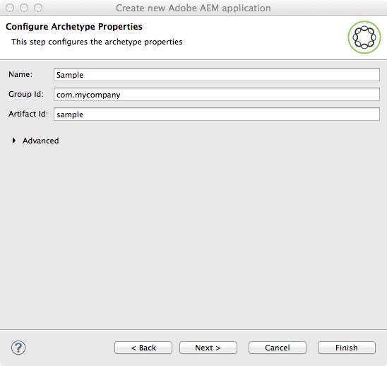

# AEM Developer Tools for Eclipse{#aem-developer-tools-for-eclipse}


## Présentation {#overview}

AEM Developer Tools for Eclipse est un plug-in Eclipse basé sur le [plug-in Eclipse pour Apache Sling](https://sling.apache.org/documentation/development/ide-tooling.html) disponible avec Apache License 2.

Il offre plusieurs fonctionnalités qui facilitent le développement d’AEM :

* Intégration transparente avec les instances AEM via Eclipse Server Connector.
* Synchronisation pour les bundles de contenu et d’OSGI
* Prise en charge du débogage avec fonctionnalité de remplacement de code à chaud.
* Amorçage simple de projets AEM avec un assistant de création de projet spécifique.
* Modification facile des propriétés JCR.

## Conditions préalables {#requirements}

Avant d’utiliser AEM Developer Tools, vous devez :

* Télécharger et installer [Eclipse IDE pour les développeurs Java EE](https://eclipse.org/downloads/packages/eclipse-ide-java-ee-developers/lunar). Les outils de développement AEM prennent actuellement en charge Eclipse Kepler ou version ultérieure

* Peut être utilisé avec AEM version 5.6.1 ou ultérieure
* configurer votre installation Eclipse pour vous assurer de disposer d’au moins 1 Go de mémoire de segment en modifiant votre fichier de configuration `eclipse.ini` de la manière décrite dans la [FAQ Eclipse](https://wiki.eclipse.org/FAQ_How_do_I_increase_the_heap_size_available_to_Eclipse%3F).

>[!NOTE]
>
>Sous macOS, vous devez cliquer avec le bouton droit de la souris sur **Eclipse.app**, puis sélectionner **Voir le contenu du paquet** pour trouver le fichier `eclipse.ini`**.**

## Installation de AEM Developer Tools for Eclipse {#how-to-install-the-aem-developer-tools-for-eclipse}

Une fois les [conditions préalables](#requirements) ci-dessus réunies, vous pouvez installer le plug-in comme suit :

1. Parcourez le [**site web AEM** Developer Tools](https://eclipse.adobe.com/aem/dev-tools/).

1. Copiez le **Lien d’installation**.

   Notez que vous pouvez également télécharger un fichier d’archives au lieu d’utiliser le lien d’installation. Cela permet une installation hors ligne, mais sans recevoir les notifications de mise à jour automatique.

1. Dans Eclipse, ouvrez le menu **Help** (Aide).
1. Cliquez sur **Install New Software** (Installer un nouveau logiciel).
1. Cliquez sur **Add...** (Ajouter).
1. Dans **Name** (Nom), tapez AEM Developer Tools.
1. Dans **Location** (Emplacement), copiez l’URL d’installation.
1. Cliquez sur **OK**.
1. Cochez les deux modules externes **AEM** et **Sling**.
1. Cliquez sur **Next** (Suivant).
1. Cliquez sur **Suivant**.
1. Acceptez les contrats de licence et cliquez sur **Finish** (Terminer).
1. Cliquez sur **Yes** pour redémarrer Eclipse.

## Importation de projets existants {#how-to-import-existing-projects}

>[!NOTE]
>
>Voir [Comment utiliser un lot dans Eclipse lorsqu’il a été téléchargé à partir d’AEM](https://stackoverflow.com/questions/29699726/how-to-work-with-a-bundle-in-eclipse-when-it-was-downloaded-from-aem/29705407#29705407).

## La perspective AEM {#the-aem-perspective}

AEM Developer Tools for Eclipse est proposé avec une Perspective offrant un contrôle total sur vos projets et instances AEM.


## Exemple de projet multi-module {#sample-multi-module-project}

AEM Developer Tools for Eclipse est fourni avec un exemple de projet multi-module qui vous aide à vous familiariser rapidement avec une configuration de projet dans Eclipse, et sert également de guide de bonnes pratiques pour plusieurs fonctionnalités AEM. [En savoir plus sur l’archétype du projet](https://github.com/Adobe-Marketing-Cloud/aem-project-archetype).

Suivez les étapes ci-après pour créer l’exemple de projet :

1. Dans le menu **Fichier** > **Nouveau** > **Projet**, accédez à la section **AEM** et sélectionnez **Exemple de projet multi-module AEM**.

   

1. Cliquez sur **Next** (Suivant).

   >[!NOTE]
   >
   >Cette étape peut prendre un certain temps car m2eclipse doit analyser les catalogues d’archétype.

   

1. Choisissez **com.adobe.granite.archetypes:sample-project-archetype : (numéro le plus élevé)** dans le menu, puis cliquez sur **Suivant**.

   

1. Entrez un **nom**, un **id de groupe** et un **id d’artefact** pour le projet exemple. Vous pouvez également choisir de définir certaines propriétés avancées.

   

1. Vous devez ensuite configurer un serveur AEM auquel Eclipse se connectera.

   Pour utiliser la fonctionnalité de débogage, vous devez avoir démarré AEM en mode débogage, ce qui peut être réalisé, par exemple, en ajoutant ce qui suit à la ligne de commande :

   ```
       -nofork -agentlib:jdwp=transport=dt_socket,server=y,suspend=n,address=10123
   ```

   

1. Cliquez sur **Finish** (Terminer). La structure du projet est créée.

   >[!NOTE]
   >
   >Sur une nouvelle installation (plus précisément : si les dépendances Maven n’ont jamais été téléchargées), vous risquez de créer le projet avec des erreurs. Dans ce cas, veuillez suivre la procédure décrite dans [Résolution d’une définition de projet non valide](#resolving-invalid-project-definition).

## Résolution des incidents {#troubleshooting}

### Résolution d’une définition de projet non valide {#resolving-invalid-project-definition}

Pour résoudre des dépendances et une définition de projet non valides, procédez comme suit :

1. Sélectionnez tous les projets créés.
1. Faites un clic-droit. Dans le menu **Maven**, sélectionnez **Update Projects** (Mettre à jour les projets).
1. Cochez **Force Updates of Snapshot/Releases** (Forcer les mises à jour d’instantané/de versions).
1. Cliquez sur **OK**. Eclipse essaie de télécharger les dépendances demandées.

### Activation de l’auto-remplissage de la bibliothèque de balises dans les fichiers JSP {#enabling-tag-library-autocompletion-in-jsp-files}

L’auto-remplissage de la bibliothèque de balises est prête à l’emploi, étant donné que les dépendances appropriées sont ajoutées au projet. Un problème a été recensé lors de l’utilisation de AEM Uber Jar qui n’ajoute pas les fichiers tld et TagExtraInfo nécessaires.

Pour contourner ce problème, assurez-vous que l’artefact org.apache.sling.scripting.jsp.taglib est présent dans le chemin de classe avant le fichier AEM Uber Jar. Pour les projets Maven, placez la dépendance suivante dans le fichier pom.xml avant le fichier Uber Jar.

```xml
<dependency>
  <groupId>org.apache.sling</groupId>
  <artifactId>org.apache.sling.scripting.jsp.taglib</artifactId>
  <scope>provided</scope>
</dependency>
```

Assurez-vous d’ajouter la version appropriée pour votre déploiement d’AEM.

## Informations supplémentaires {#more-information}

Le site web officiel Apache Sling IDE tooling for Eclipse fournit des informations utiles :

* Le [**guide de l’utilisateur** Apache Sling IDE tooling for Eclipse](https://sling.apache.org/documentation/development/ide-tooling.html) : cette documentation vous guide à travers les concepts généraux, l’intégration des serveurs et les fonctionnalités de déploiement pris en charge par AEM Development Tools.
* La section [Dépannage](https://sling.apache.org/documentation/development/ide-tooling.html#troubleshooting).
* La [liste des problèmes connus](https://sling.apache.org/documentation/development/ide-tooling.html#known-issues).

La documentation officielle [Eclipse](https://eclipse.org/) suivante peut vous aider à configurer votre environnement :

* [Prise en main d’Eclipse](https://eclipse.org/users/)
* [Système d’aide d’Eclipse Luna](https://help.eclipse.org/luna/index.jsp)
* [Intégration Maven (m2eclipse)](https://www.eclipse.org/m2e/)

